# AI聊天服务

<cite>
**本文档引用的文件**
- [ai_chat.py](file://backend/api/v1/ai_chat.py)
- [ai_chat_service.py](file://backend/services/ai_chat_service.py)
- [ai_chat_session.py](file://core/models/ai_chat_session.py)
- [qwen_client.py](file://llm/qwen_client.py)
- [ai_chat.py](file://backend/schemas/ai_chat.py)
- [memory_service.py](file://backend/services/memory_service.py)
- [cost_tracker.py](file://llm/cost_tracker.py)
- [5c24a4e1ec52_add_novel_id_and_title_to_chat_session.py](file://alembic/versions_archived/5c24a4e1ec52_add_novel_id_and_title_to_chat_session.py)
- [aiChat.ts](file://frontend/src/api/aiChat.ts)
- [config.py](file://backend/config.py)
- [pyproject.toml](file://pyproject.toml)
- [graph.py](file://backend/api/v1/graph.py)
- [graph_query_service.py](file://backend/services/graph_query_service.py)
- [neo4j_client.py](file://core/graph/neo4j_client.py)
- [graph_query_mixin.py](file://agents/graph_query_mixin.py)
- [agentmesh_memory_adapter.py](file://backend/services/agentmesh_memory_adapter.py)
- [context_manager.py](file://backend/services/context_manager.py)
- [revision_understanding_service.py](file://backend/services/revision_understanding_service.py)
- [revision_execution_service.py](file://backend/services/revision_execution_service.py)
- [revision_data_validator.py](file://backend/services/revision_data_validator.py)
- [revision.py](file://backend/api/v1/revision.py)
- [revision_plan.py](file://core/models/revision_plan.py)
- [review_loop.py](file://agents/review_loop.py)
- [continuity_integration_module.py](file://agents/continuity_integration_module.py)
</cite>

## 更新摘要
**变更内容**
- 新增修订建议提取、应用和智能章节分析功能
- 集成完整的修订系统，支持结构化建议提取和数据库应用
- 增强AI聊天服务的修订能力，支持自然语言修订和智能摘要
- 新增修订数据验证和执行服务，确保修订建议的准确性和安全性
- 扩展前端界面，支持修订建议的可视化展示和一键应用

## 目录
1. [简介](#简介)
2. [项目结构](#项目结构)
3. [核心组件](#核心组件)
4. [架构概览](#架构概览)
5. [详细组件分析](#详细组件分析)
6. [修订系统集成](#修订系统集成)
7. [智能章节分析功能](#智能章节分析功能)
8. [持久化记忆系统](#持久化记忆系统)
9. [依赖关系分析](#依赖关系分析)
10. [性能考虑](#性能考虑)
11. [故障排除指南](#故障排除指南)
12. [结论](#结论)

## 简介

AI聊天服务是一个基于FastAPI构建的智能对话系统，专门为网络小说创作提供AI辅助功能。该系统集成了通义千问大模型，支持多种创作场景，包括小说创作、爬虫任务规划、小说修订和内容分析。系统采用内存缓存机制和数据库持久化相结合的方式，提供了高效的会话管理和内容存储能力。

**更新** 系统现已显著增强了分析能力和稳定性，新增了修订建议提取、应用和智能章节分析功能，以及与新修订系统的完整集成。这些改进大幅提升了系统的智能化水平和用户体验，特别是在处理复杂的章节内容分析、关系网络查询和结构化修订建议方面。

## 项目结构

AI聊天服务采用分层架构设计，主要分为以下几个层次：

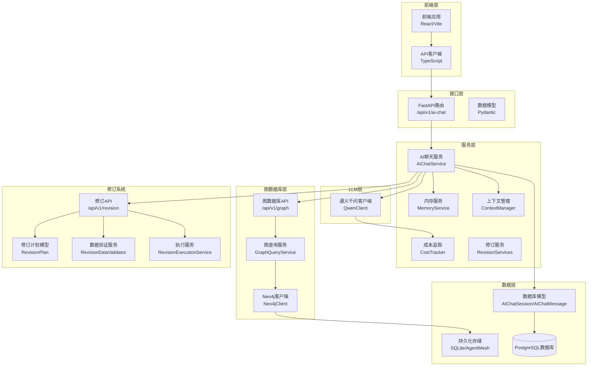
```mermaid
graph TB
subgraph "前端层"
FE[前端应用<br/>React/Vite]
API[API客户端<br/>TypeScript]
end
subgraph "接口层"
Router[FastAPI路由<br/>/api/v1/ai-chat]
Schemas[数据模型<br/>Pydantic]
end
subgraph "服务层"
Service[AI聊天服务<br/>AiChatService]
Memory[内存服务<br/>MemoryService]
Context[上下文管理<br/>ContextManager]
Cost[成本追踪<br/>CostTracker]
Revision[修订服务<br/>RevisionServices]
end
subgraph "图数据库层"
GraphAPI[图数据库API<br/>/api/v1/graph]
GraphService[图查询服务<br/>GraphQueryService]
Neo4j[Neo4j客户端<br/>Neo4jClient]
end
subgraph "LLM层"
Qwen[通义千问客户端<br/>QwenClient]
end
subgraph "数据层"
Models[数据库模型<br/>AIChatSession/AIChatMessage]
Persist[持久化存储<br/>SQLite/AgentMesh]
DB[(PostgreSQL数据库)]
end
subgraph "修订系统"
RevisionAPI[修订API<br/>/api/v1/revision]
RevisionPlan[修订计划模型<br/>RevisionPlan]
Validator[数据验证服务<br/>RevisionDataValidator]
Executor[执行服务<br/>RevisionExecutionService]
end
FE --> API
API --> Router
Router --> Service
Service --> Memory
Service --> Context
Service --> Qwen
Service --> Models
Service --> GraphAPI
GraphAPI --> GraphService
GraphService --> Neo4j
Neo4j --> Persist
Models --> DB
Qwen --> Cost
Service --> RevisionAPI
RevisionAPI --> RevisionPlan
RevisionAPI --> Validator
RevisionAPI --> Executor
```

**图表来源**
- [ai_chat.py:1-50](file://backend/api/v1/ai_chat.py#L1-L50)
- [ai_chat_service.py:189-200](file://backend/services/ai_chat_service.py#L189-L200)
- [qwen_client.py:16-45](file://llm/qwen_client.py#L16-L45)
- [graph.py:29-30](file://backend/api/v1/graph.py#L29-L30)
- [revision.py:17-42](file://backend/api/v1/revision.py#L17-L42)

**章节来源**
- [ai_chat.py:1-50](file://backend/api/v1/ai_chat.py#L1-L50)
- [ai_chat_service.py:1-50](file://backend/services/ai_chat_service.py#L1-L50)
- [pyproject.toml:8-37](file://pyproject.toml#L8-L37)

## 核心组件

### AI聊天服务核心类

AI聊天服务的核心是`AiChatService`类，它负责管理所有聊天相关的业务逻辑：

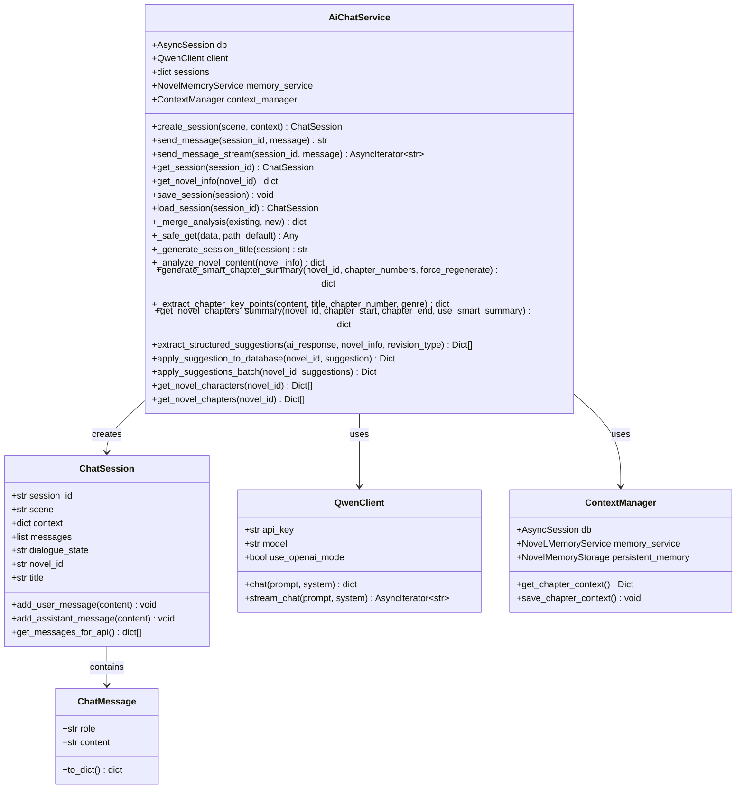
```mermaid
classDiagram
class AiChatService {
+AsyncSession db
+QwenClient client
+dict sessions
+NovelMemoryService memory_service
+ContextManager context_manager
+create_session(scene, context) ChatSession
+send_message(session_id, message) str
+send_message_stream(session_id, message) AsyncIterator~str~
+get_session(session_id) ChatSession
+get_novel_info(novel_id) dict
+save_session(session) void
+load_session(session_id) ChatSession
+_merge_analysis(existing, new) dict
+_safe_get(data, path, default) Any
+_generate_session_title(session) str
+_analyze_novel_content(novel_info) dict
+generate_smart_chapter_summary(novel_id, chapter_numbers, force_regenerate) dict
+_extract_chapter_key_points(content, title, chapter_number, genre) dict
+get_novel_chapters_summary(novel_id, chapter_start, chapter_end, use_smart_summary) dict
+extract_structured_suggestions(ai_response, novel_info, revision_type) Dict[]
+apply_suggestion_to_database(novel_id, suggestion) Dict
+apply_suggestions_batch(novel_id, suggestions) Dict
+get_novel_characters(novel_id) Dict[]
+get_novel_chapters(novel_id) Dict[]
}
class ChatSession {
+str session_id
+str scene
+dict context
+list messages
+str dialogue_state
+str novel_id
+str title
+add_user_message(content) void
+add_assistant_message(content) void
+get_messages_for_api() dict[]
}
class ChatMessage {
+str role
+str content
+to_dict() dict
}
class QwenClient {
+str api_key
+str model
+bool use_openai_mode
+chat(prompt, system) dict
+stream_chat(prompt, system) AsyncIterator~str~
}
class ContextManager {
+AsyncSession db
+NoveLMemoryService memory_service
+NovelMemoryStorage persistent_memory
+get_chapter_context() Dict
+save_chapter_context() void
}
AiChatService --> ChatSession : creates
AiChatService --> QwenClient : uses
AiChatService --> ContextManager : uses
ChatSession --> ChatMessage : contains
```

**图表来源**
- [ai_chat_service.py:189-200](file://backend/services/ai_chat_service.py#L189-L200)
- [ai_chat_service.py:128-187](file://backend/services/ai_chat_service.py#L128-L187)
- [qwen_client.py:16-45](file://llm/qwen_client.py#L16-L45)
- [context_manager.py:110-149](file://backend/services/context_manager.py#L110-L149)

### 数据模型

系统使用SQLAlchemy定义了两个核心数据模型：

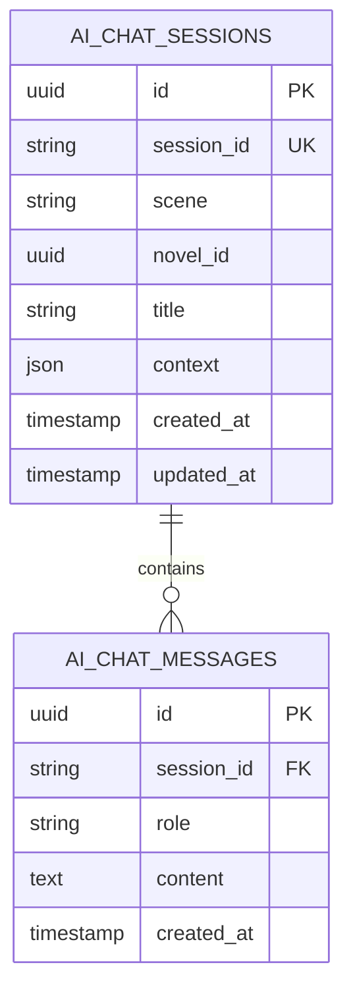
```mermaid
erDiagram
AI_CHAT_SESSIONS {
uuid id PK
string session_id UK
string scene
uuid novel_id
string title
json context
timestamp created_at
timestamp updated_at
}
AI_CHAT_MESSAGES {
uuid id PK
string session_id FK
string role
text content
timestamp created_at
}
AI_CHAT_SESSIONS ||--o{ AI_CHAT_MESSAGES : contains
```

**图表来源**
- [ai_chat_session.py:17-36](file://core/models/ai_chat_session.py#L17-L36)

**章节来源**
- [ai_chat_service.py:189-200](file://backend/services/ai_chat_service.py#L189-L200)
- [ai_chat_session.py:1-36](file://core/models/ai_chat_session.py#L1-L36)

## 架构概览

AI聊天服务采用异步架构设计，支持高并发请求处理：

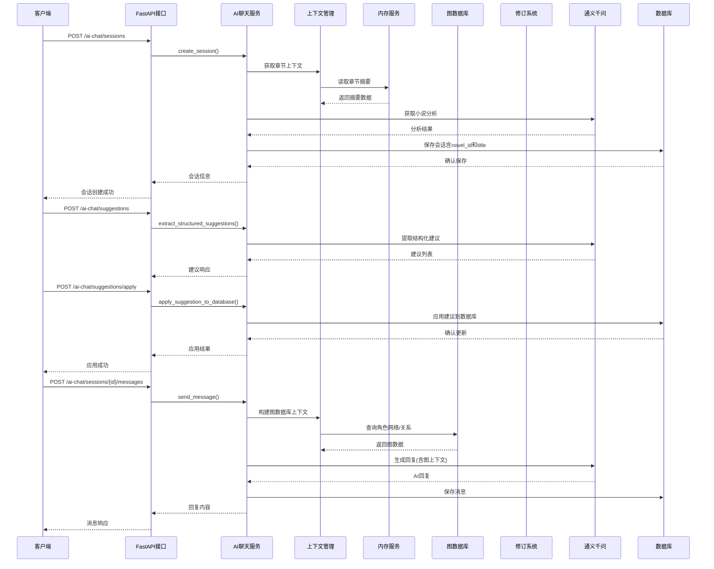
```mermaid
sequenceDiagram
participant Client as 客户端
participant API as FastAPI接口
participant Service as AI聊天服务
participant Context as 上下文管理
participant Memory as 内存服务
participant Graph as 图数据库
participant Revision as 修订系统
participant LLM as 通义千问
participant DB as 数据库
Client->>API : POST /ai-chat/sessions
API->>Service : create_session()
Service->>Context : 获取章节上下文
Context->>Memory : 读取章节摘要
Memory-->>Context : 返回摘要数据
Service->>LLM : 获取小说分析
LLM-->>Service : 分析结果
Service->>DB : 保存会话含novel_id和title
DB-->>Service : 确认保存
Service-->>API : 会话信息
API-->>Client : 会话创建成功
Client->>API : POST /ai-chat/suggestions
API->>Service : extract_structured_suggestions()
Service->>LLM : 提取结构化建议
LLM-->>Service : 建议列表
Service-->>API : 建议响应
Client->>API : POST /ai-chat/suggestions/apply
API->>Service : apply_suggestion_to_database()
Service->>DB : 应用建议到数据库
DB-->>Service : 确认更新
Service-->>API : 应用结果
API-->>Client : 应用成功
Client->>API : POST /ai-chat/sessions/{id}/messages
API->>Service : send_message()
Service->>Context : 构建图数据库上下文
Context->>Graph : 查询角色网络/关系
Graph-->>Context : 返回图数据
Service->>LLM : 生成回复(含图上下文)
LLM-->>Service : AI回复
Service->>DB : 保存消息
Service-->>API : 回复内容
API-->>Client : 消息响应
```

**图表来源**
- [ai_chat.py:54-104](file://backend/api/v1/ai_chat.py#L54-L104)
- [ai_chat_service.py:526-570](file://backend/services/ai_chat_service.py#L526-L570)
- [context_manager.py:157-190](file://backend/services/context_manager.py#L157-L190)
- [ai_chat.py:311-431](file://backend/api/v1/ai_chat.py#L311-L431)

## 详细组件分析

### 会话管理系统

会话管理系统是AI聊天服务的核心功能之一，支持多种场景的智能对话：

#### 支持的场景类型

系统定义了四种主要的创作场景：

| 场景类型 | 用途 | 系统提示词 |
|---------|------|----------|
| novel_creation | 小说创作 | 专业的创作顾问，帮助规划世界观、角色和情节 |
| crawler_task | 爬虫任务 | 数据分析师，制定爬取策略和市场分析 |
| novel_revision | 小说修订 | 编辑助手，直接生成修订后的内容 |
| novel_analysis | 小说分析 | 分析师，提供全面的分析和建议 |

#### 会话生命周期管理

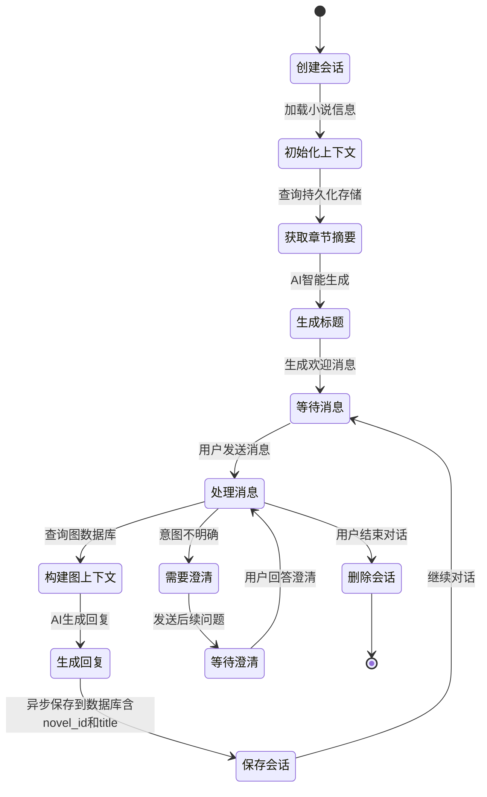
```mermaid
stateDiagram-v2
[*] --> 创建会话
创建会话 --> 初始化上下文 : 加载小说信息
初始化上下文 --> 获取章节摘要 : 查询持久化存储
获取章节摘要 --> 生成标题 : AI智能生成
生成标题 --> 等待消息 : 生成欢迎消息
等待消息 --> 处理消息 : 用户发送消息
处理消息 --> 构建图上下文 : 查询图数据库
构建图上下文 --> 生成回复 : AI生成回复
生成回复 --> 保存会话 : 异步保存到数据库含novel_id和title
保存会话 --> 等待消息 : 继续对话
处理消息 --> 需要澄清 : 意图不明确
需要澄清 --> 等待澄清 : 发送后续问题
等待澄清 --> 处理消息 : 用户回答澄清
处理消息 --> 删除会话 : 用户结束对话
删除会话 --> [*]
```

**图表来源**
- [ai_chat_service.py:526-570](file://backend/services/ai_chat_service.py#L526-L570)
- [ai_chat_service.py:572-574](file://backend/services/ai_chat_service.py#L572-L574)

**章节来源**
- [ai_chat_service.py:53-115](file://backend/services/ai_chat_service.py#L53-L115)
- [ai_chat_service.py:526-570](file://backend/services/ai_chat_service.py#L526-L570)

### 智能标题生成功能

**更新** 系统新增了智能标题生成功能，支持从对话内容中自动生成简洁明了的会话标题：

#### 标题生成流程

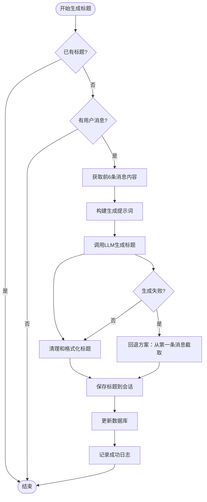
```mermaid
flowchart TD
Start([开始生成标题]) --> CheckTitle{已有标题?}
CheckTitle --> |是| End([结束])
CheckTitle --> |否| CheckMessages{有用户消息?}
CheckMessages --> |否| End
CheckMessages --> |是| GetContent[获取前6条消息内容]
GetContent --> BuildPrompt[构建生成提示词]
BuildPrompt --> CallLLM[调用LLM生成标题]
CallLLM --> CleanTitle[清理和格式化标题]
CleanTitle --> SaveTitle[保存标题到会话]
SaveTitle --> UpdateDB[更新数据库]
UpdateDB --> LogSuccess[记录成功日志]
LogSuccess --> End
CallLLM --> Error{生成失败?}
Error --> |是| Fallback[回退方案：从第一条消息截取]
Fallback --> SaveTitle
Error --> |否| CleanTitle
```

#### 标题生成策略

系统提供了多层次的标题生成策略：

1. **AI智能生成**：基于对话内容分析，生成简洁概括的标题
2. **回退方案**：当AI生成失败时，从第一条用户消息中截取内容
3. **长度限制**：确保标题不超过50个字符，保持简洁性

**章节来源**
- [ai_chat_service.py:999-1046](file://backend/services/ai_chat_service.py#L999-L1046)

### 会话隔离与组织导航

**更新** 系统新增了会话隔离功能，通过novel_id属性支持按小说进行会话分组管理：

#### 会话隔离机制

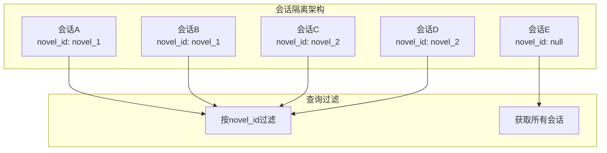
```mermaid
graph TB
subgraph "会话隔离架构"
Session1[会话A<br/>novel_id: novel_1]
Session2[会话B<br/>novel_id: novel_1]
Session3[会话C<br/>novel_id: novel_2]
Session4[会话D<br/>novel_id: novel_2]
Session5[会话E<br/>novel_id: null]
end
subgraph "查询过滤"
Filter1[按novel_id过滤]
Filter2[获取所有会话]
end
Session1 --> Filter1
Session2 --> Filter1
Session3 --> Filter1
Session4 --> Filter1
Session5 --> Filter2
```

#### 会话查询与过滤

系统支持多种会话查询方式：

| 查询方式 | 参数 | 功能 | 使用场景 |
|---------|------|------|----------|
| 全部会话 | 无 | 获取所有会话 | 管理界面查看 |
| 按场景过滤 | scene | 按创作场景过滤 | 快速定位特定类型会话 |
| 按小说隔离 | novel_id | 按小说ID隔离会话 | 组织导航和项目管理 |
| 组合过滤 | scene + novel_id | 同时按场景和小说过滤 | 精确查找特定会话 |

**章节来源**
- [ai_chat_service.py:854-899](file://backend/services/ai_chat_service.py#L854-L899)
- [ai_chat.py:227-243](file://backend/api/v1/ai_chat.py#L227-L243)

### LLM集成与流式处理

系统集成了通义千问大模型，支持同步和流式两种调用方式：

#### LLM客户端架构

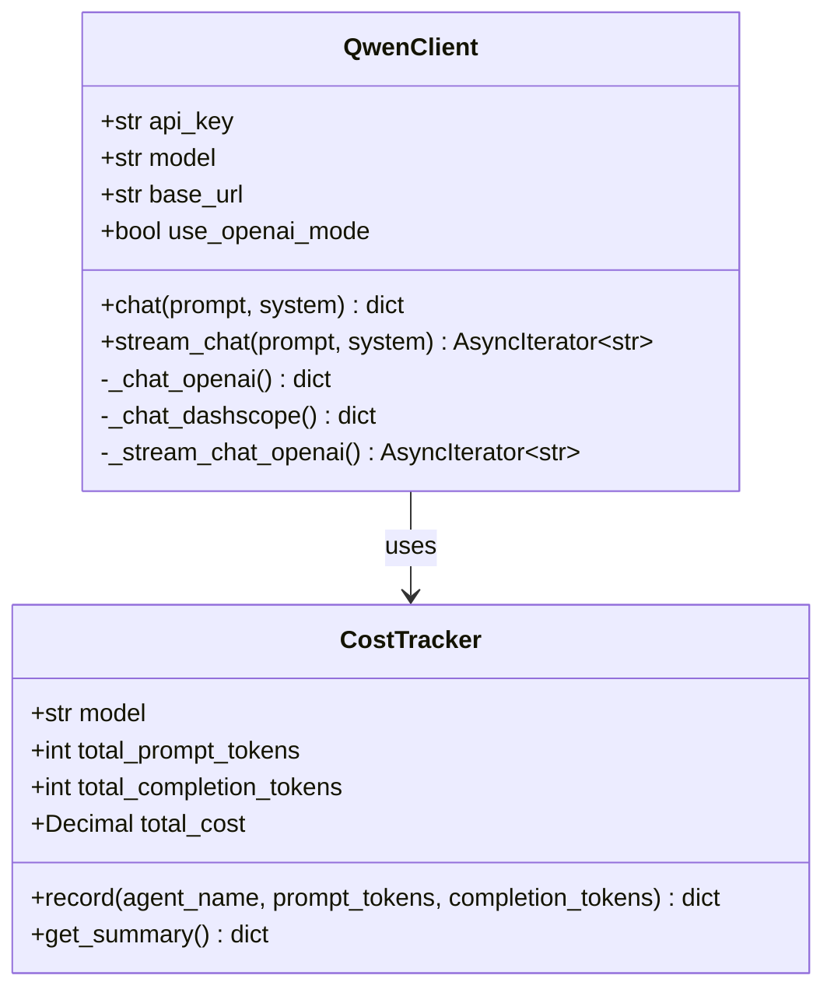
```mermaid
classDiagram
class QwenClient {
+str api_key
+str model
+str base_url
+bool use_openai_mode
+chat(prompt, system) dict
+stream_chat(prompt, system) AsyncIterator~str~
-_chat_openai() dict
-_chat_dashscope() dict
-_stream_chat_openai() AsyncIterator~str~
}
class CostTracker {
+str model
+int total_prompt_tokens
+int total_completion_tokens
+Decimal total_cost
+record(agent_name, prompt_tokens, completion_tokens) dict
+get_summary() dict
}
QwenClient --> CostTracker : uses
```

**图表来源**
- [qwen_client.py:16-45](file://llm/qwen_client.py#L16-L45)
- [cost_tracker.py:16-25](file://llm/cost_tracker.py#L16-L25)

#### 流式对话处理流程

```mermaid
flowchart TD
Start([开始流式对话]) --> AcceptWS[接受WebSocket连接]
AcceptWS --> ReceiveMsg[接收用户消息]
ReceiveMsg --> SendStart[发送开始信号]
SendStart --> StreamLLM[流式调用LLM]
StreamLLM --> ProcessChunk[处理响应块]
ProcessChunk --> SendChunk[发送响应块]
SendChunk --> CheckDone{对话完成?}
CheckDone --> |否| StreamLLM
CheckDone --> |是| SendEnd[发送结束信号]
SendEnd --> CloseWS[关闭连接]
CloseWS --> End([结束])
StreamLLM --> Error{发生错误?}
Error --> |是| SendError[发送错误信息]
SendError --> CloseWS
Error --> |否| ProcessChunk
```

**图表来源**
- [ai_chat.py:129-191](file://backend/api/v1/ai_chat.py#L129-L191)

**章节来源**
- [qwen_client.py:16-232](file://llm/qwen_client.py#L16-L232)
- [cost_tracker.py:1-74](file://llm/cost_tracker.py#L1-L74)

### 内存缓存与数据管理

系统实现了多层次的数据缓存机制，以提高性能和响应速度：

#### 内存缓存架构

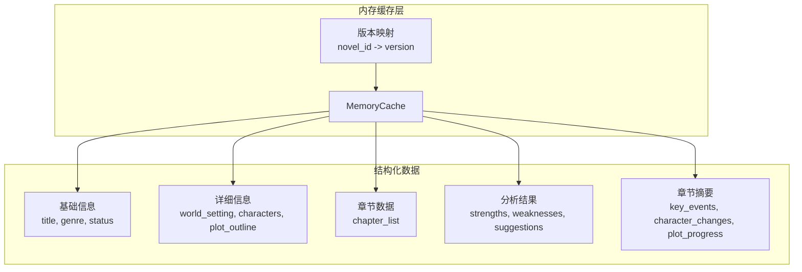
```mermaid
graph TB
subgraph "内存缓存层"
Cache[MemoryCache]
Version[版本映射<br/>novel_id -> version]
end
subgraph "结构化数据"
Base[基础信息<br/>title, genre, status]
Details[详细信息<br/>world_setting, characters, plot_outline]
Chapters[章节数据<br/>chapter_list]
Analysis[分析结果<br/>strengths, weaknesses, suggestions]
ChapterSummaries[章节摘要<br/>key_events, character_changes, plot_progress]
end
Cache --> Base
Cache --> Details
Cache --> Chapters
Cache --> Analysis
Cache --> ChapterSummaries
Version --> Cache
```

**图表来源**
- [memory_service.py:72-139](file://backend/services/memory_service.py#L72-L139)

#### 缓存策略

系统采用了LRU（最近最少使用）算法和时间过期机制：

| 缓存参数 | 默认值 | 说明 |
|---------|--------|------|
| 最大缓存大小 | 100 | 缓存小说数量上限 |
| 过期时间 | 30分钟 | 数据过期时间 |
| 访问统计 | 启用 | 记录访问次数和时间 |

**更新** 增强了变化检测机制，现在内存服务会比较关键字段和章节、角色数量来判断内容是否发生变化，并返回相应的`has_changes`状态。

**章节来源**
- [memory_service.py:10-70](file://backend/services/memory_service.py#L10-L70)
- [memory_service.py:72-232](file://backend/services/memory_service.py#L72-L232)

### API接口设计

系统提供了RESTful API和WebSocket接口，支持多种交互方式：

#### 主要API端点

| 端点 | 方法 | 功能 | 返回类型 |
|------|------|------|----------|
| /ai-chat/sessions | POST | 创建会话 | AIChatSessionResponse |
| /ai-chat/sessions/{session_id}/messages | POST | 发送消息 | AIChatMessageResponse |
| /ai-chat/ws/{session_id} | WebSocket | 流式对话 | 文本块 |
| /ai-chat/parse-novel | POST | 解析小说意图 | NovelParseResponse |
| /ai-chat/extract-suggestions | POST | 提取修订建议 | ExtractSuggestionsResponse |
| /ai-chat/apply-suggestion | POST | 应用单个建议 | ApplySuggestionResult |
| /ai-chat/apply-suggestions | POST | 批量应用建议 | ApplySuggestionsResponse |
| /ai-chat/novels/{novel_id}/characters-list | GET | 获取角色列表 | NovelCharactersResponse |
| /ai-chat/novels/{novel_id}/chapters-list | GET | 获取章节列表 | NovelChaptersResponse |
| /ai-chat/sessions | GET | 获取会话列表 | 包含novel_id和title |

#### WebSocket通信协议

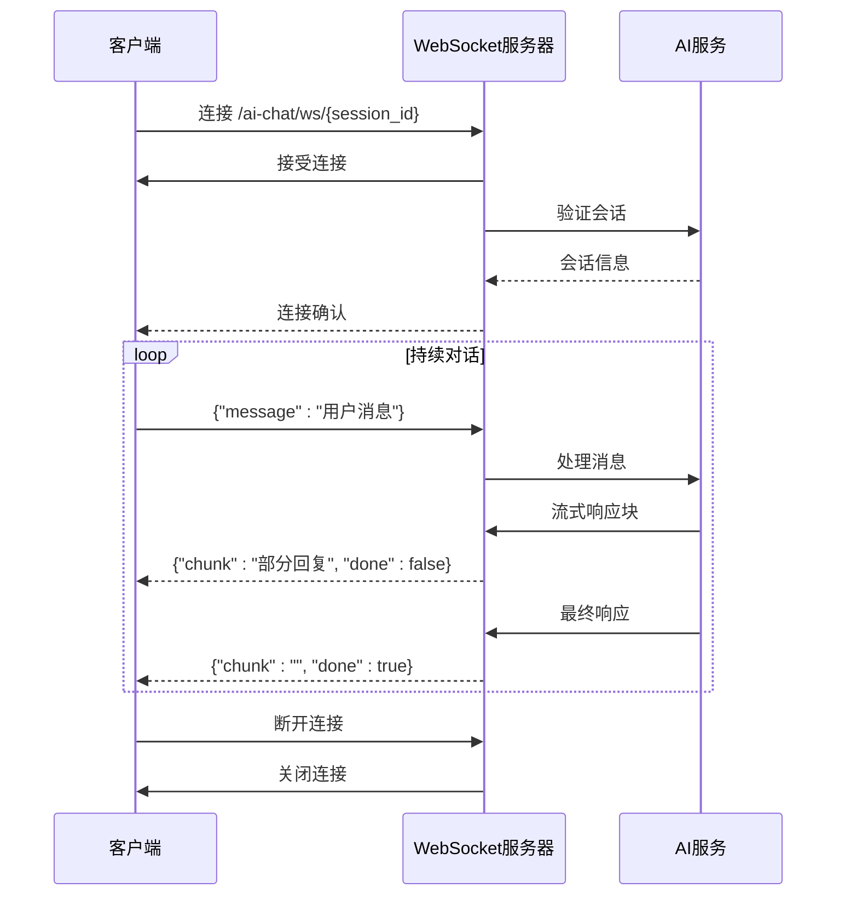
```mermaid
sequenceDiagram
participant Client as 客户端
participant WS as WebSocket服务器
participant Service as AI服务
Client->>WS : 连接 /ai-chat/ws/{session_id}
WS->>Client : 接受连接
WS->>Service : 验证会话
Service-->>WS : 会话信息
WS-->>Client : 连接确认
loop 持续对话
Client->>WS : {"message" : "用户消息"}
WS->>Service : 处理消息
Service->>WS : 流式响应块
WS-->>Client : {"chunk" : "部分回复", "done" : false}
Service->>WS : 最终响应
WS-->>Client : {"chunk" : "", "done" : true}
end
Client->>WS : 断开连接
WS->>Client : 关闭连接
```

**图表来源**
- [ai_chat.py:129-191](file://backend/api/v1/ai_chat.py#L129-L191)

**章节来源**
- [ai_chat.py:59-621](file://backend/api/v1/ai_chat.py#L59-L621)
- [aiChat.ts:97-207](file://frontend/src/api/aiChat.ts#L97-L207)

### 小说信息刷新逻辑增强

**更新** 系统现已增强小说信息刷新逻辑，提供了更稳定的数据处理机制：

#### 增强的小说信息获取流程

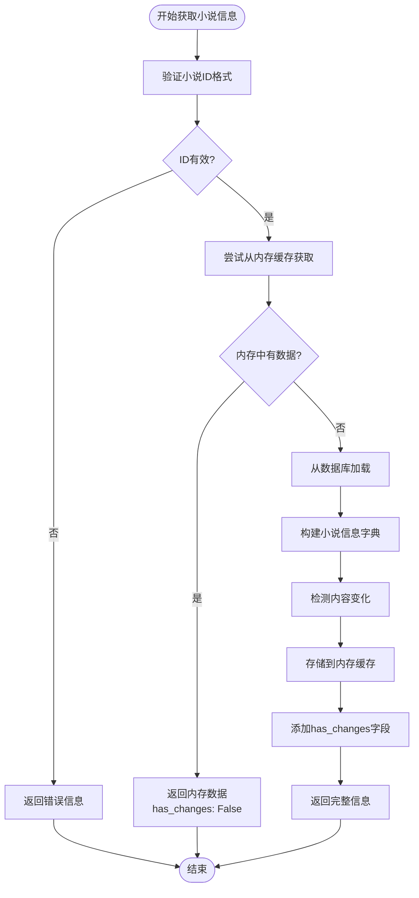
```mermaid
flowchart TD
Start([开始获取小说信息]) --> ValidateID[验证小说ID格式]
ValidateID --> ValidID{ID有效?}
ValidID --> |否| ReturnError[返回错误信息]
ValidID --> |是| TryMemory[尝试从内存缓存获取]
TryMemory --> HasMemory{内存中有数据?}
HasMemory --> |是| ReturnMemory[返回内存数据<br/>has_changes: False]
HasMemory --> |否| LoadFromDB[从数据库加载]
LoadFromDB --> BuildInfo[构建小说信息字典]
BuildInfo --> DetectChanges[检测内容变化]
DetectChanges --> StoreMemory[存储到内存缓存]
StoreMemory --> AddHasChanges[添加has_changes字段]
AddHasChanges --> ReturnInfo[返回完整信息]
ReturnError --> End([结束])
ReturnMemory --> End
ReturnInfo --> End
```

#### 增强的内存服务功能

内存服务现在具备更完善的变化检测机制：

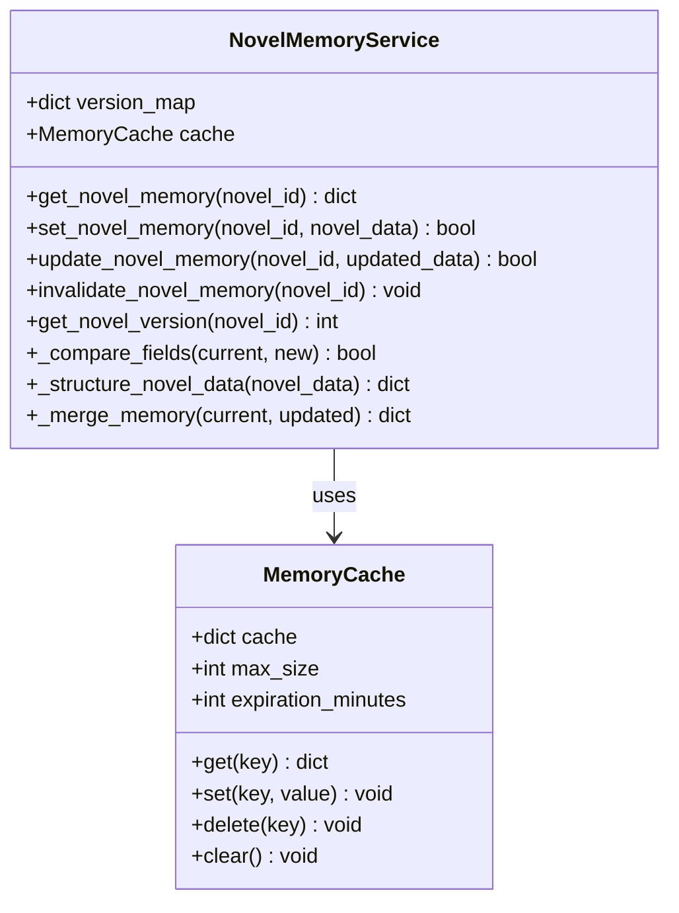
```mermaid
classDiagram
class NovelMemoryService {
+dict version_map
+MemoryCache cache
+get_novel_memory(novel_id) dict
+set_novel_memory(novel_id, novel_data) bool
+update_novel_memory(novel_id, updated_data) bool
+invalidate_novel_memory(novel_id) void
+get_novel_version(novel_id) int
+_compare_fields(current, new) bool
+_structure_novel_data(novel_data) dict
+_merge_memory(current, updated) dict
}
class MemoryCache {
+dict cache
+int max_size
+int expiration_minutes
+get(key) dict
+set(key, value) void
+delete(key) void
+clear() void
}
NovelMemoryService --> MemoryCache : uses
```

**图表来源**
- [memory_service.py:72-164](file://backend/services/memory_service.py#L72-L164)

**章节来源**
- [ai_chat_service.py:316-482](file://backend/services/ai_chat_service.py#L316-L482)
- [memory_service.py:84-138](file://backend/services/memory_service.py#L84-L138)

### 新增功能详解

#### 增量分析合并功能

**更新** 系统新增了`_merge_analysis`方法，支持增量合并分析结果：

```mermaid
flowchart TD
Start([开始增量合并]) --> CheckExisting{有现有分析?}
CheckExisting --> |否| ReturnNew[返回新分析副本]
CheckExisting --> |是| CheckNew{有新分析?}
CheckNew --> |否| ReturnExisting[返回现有分析副本]
CheckNew --> |是| CopyExisting[复制现有分析]
CopyExisting --> MergeStrengths[合并strengths不重复项]
MergeStrengths --> MergeWeaknesses[合并weaknesses不重复项]
MergeWeaknesses --> MergeSuggestions[合并suggestions不重复项]
MergeSuggestions --> ReplaceGenreSpecific[替换genre_specific为新值]
ReplaceGenreSpecific --> ReturnMerged[返回合并结果]
```

#### 安全字段访问功能

**更新** 系统新增了`_safe_get`方法，提供安全的嵌套字典访问：

```mermaid
flowchart TD
Start([开始安全访问]) --> CheckData{数据有效?}
CheckData --> |否| ReturnDefault[返回默认值]
CheckData --> |是| SplitPath[分割路径]
SplitPath --> IterateKeys[遍历键路径]
IterateKeys --> CheckType{当前是字典?}
CheckType --> |否| ReturnDefault
CheckType --> |是| GetKey[获取键值]
GetKey --> CheckNone{键值为空?}
CheckNone --> |是| ReturnDefault
CheckNone --> |否| NextKey[下一个键]
NextKey --> IterateKeys
```

#### 增强的小说分析功能

**更新** 系统增强了小说分析功能，提供更智能的内容分析：

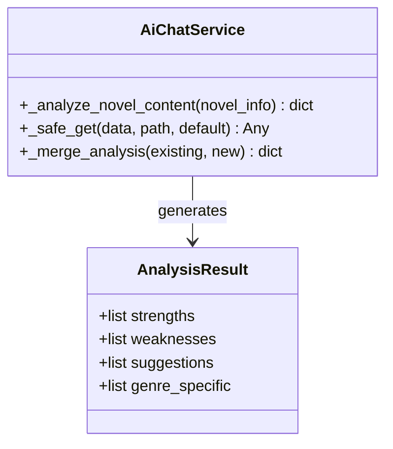
```mermaid
classDiagram
class AiChatService {
+_analyze_novel_content(novel_info) dict
+_safe_get(data, path, default) Any
+_merge_analysis(existing, new) dict
}
class AnalysisResult {
+list strengths
+list weaknesses
+list suggestions
+list genre_specific
}
AiChatService --> AnalysisResult : generates
```

**章节来源**
- [ai_chat_service.py:1451-1507](file://backend/services/ai_chat_service.py#L1451-L1507)
- [ai_chat_service.py:1508-1575](file://backend/services/ai_chat_service.py#L1508-L1575)

### 修订建议提取与应用功能

**更新** 系统新增了完整的修订建议提取、验证和应用功能：

#### 修订建议提取流程

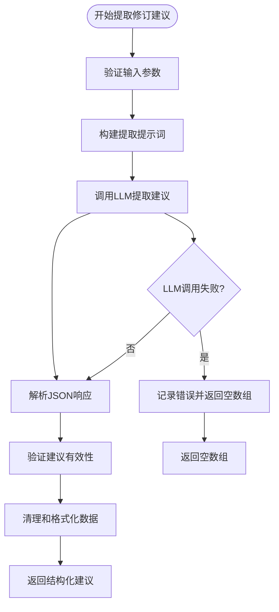
```mermaid
flowchart TD
Start([开始提取修订建议]) --> ValidateInput[验证输入参数]
ValidateInput --> BuildPrompt[构建提取提示词]
BuildPrompt --> CallLLM[调用LLM提取建议]
CallLLM --> ParseJSON[解析JSON响应]
ParseJSON --> ValidateSuggestion[验证建议有效性]
ValidateSuggestion --> CleanData[清理和格式化数据]
CleanData --> ReturnSuggestions[返回结构化建议]
CallLLM --> Error{LLM调用失败?}
Error --> |是| HandleError[记录错误并返回空数组]
Error --> |否| ParseJSON
HandleError --> ReturnEmpty[返回空数组]
```

#### 修订建议应用流程

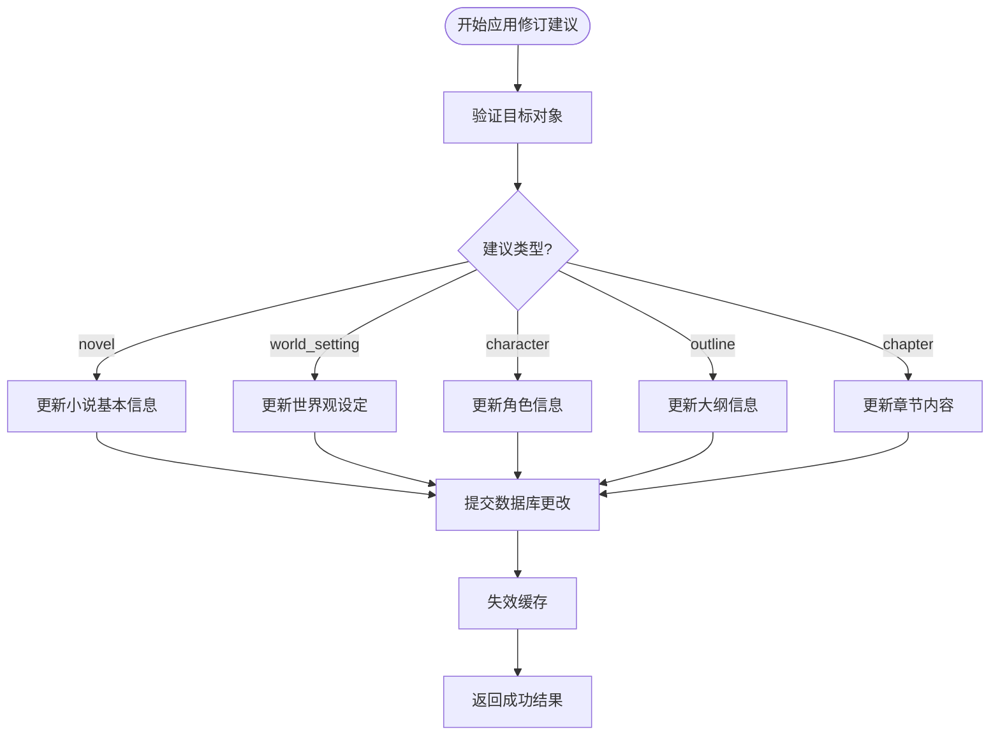
```mermaid
flowchart TD
Start([开始应用修订建议]) --> ValidateTarget[验证目标对象]
ValidateTarget --> CheckType{建议类型?}
CheckType --> |novel| UpdateNovel[更新小说基本信息]
CheckType --> |world_setting| UpdateWorld[更新世界观设定]
CheckType --> |character| UpdateCharacter[更新角色信息]
CheckType --> |outline| UpdateOutline[更新大纲信息]
CheckType --> |chapter| UpdateChapter[更新章节内容]
UpdateNovel --> CommitDB[提交数据库更改]
UpdateWorld --> CommitDB
UpdateCharacter --> CommitDB
UpdateOutline --> CommitDB
UpdateChapter --> CommitDB
CommitDB --> InvalidateCache[失效缓存]
InvalidateCache --> Success[返回成功结果]
```

**章节来源**
- [ai_chat_service.py:2618-3100](file://backend/services/ai_chat_service.py#L2618-L3100)
- [ai_chat.py:311-431](file://backend/api/v1/ai_chat.py#L311-L431)

## 修订系统集成

### 修订系统架构

**更新** 系统集成了完整的修订系统，支持从自然语言反馈到结构化建议再到数据库应用的完整流程：

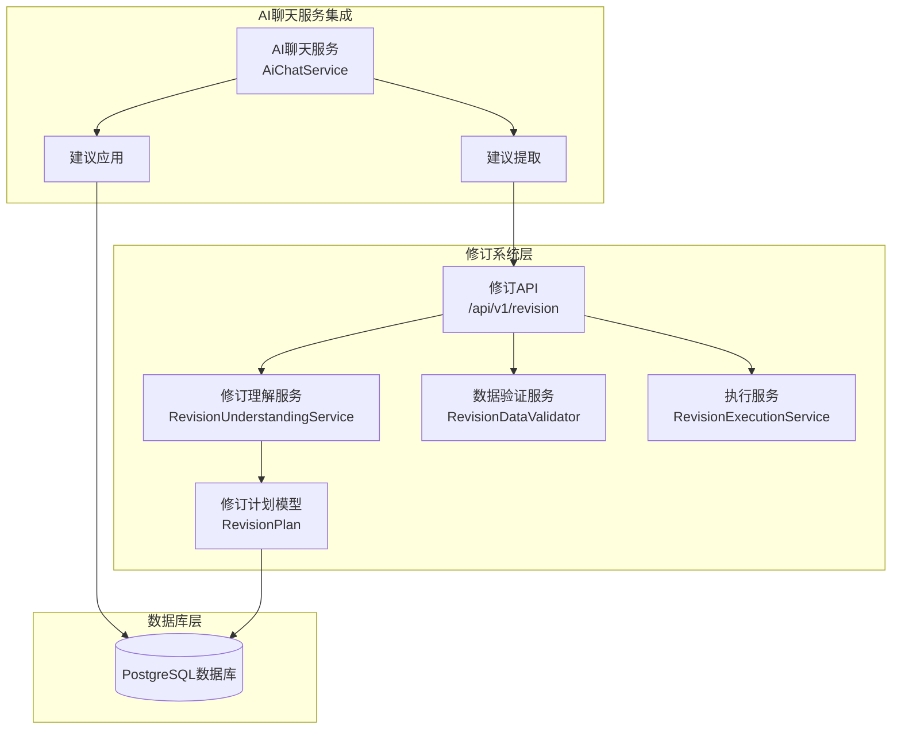
```mermaid
graph TB
subgraph "修订系统层"
RevisionAPI[修订API<br/>/api/v1/revision]
Understanding[修订理解服务<br/>RevisionUnderstandingService]
Validator[数据验证服务<br/>RevisionDataValidator]
Executor[执行服务<br/>RevisionExecutionService]
Plan[修订计划模型<br/>RevisionPlan]
end
subgraph "AI聊天服务集成"
AiChat[AI聊天服务<br/>AiChatService]
SuggestionExtraction[建议提取]
SuggestionApplication[建议应用]
end
subgraph "数据库层"
DB[(PostgreSQL数据库)]
end
RevisionAPI --> Understanding
RevisionAPI --> Validator
RevisionAPI --> Executor
Understanding --> Plan
AiChat --> SuggestionExtraction
AiChat --> SuggestionApplication
SuggestionExtraction --> RevisionAPI
SuggestionApplication --> DB
Plan --> DB
```

**图表来源**
- [revision.py:17-42](file://backend/api/v1/revision.py#L17-L42)
- [revision_understanding_service.py:17-498](file://backend/services/revision_understanding_service.py#L17-L498)
- [revision_data_validator.py:43-619](file://backend/services/revision_data_validator.py#L43-L619)
- [revision_execution_service.py:34-458](file://backend/services/revision_execution_service.py#L34-L458)
- [revision_plan.py:33-116](file://core/models/revision_plan.py#L33-L116)

### 修订理解服务

**更新** 新增了`RevisionUnderstandingService`类，负责理解用户反馈并生成修订计划：

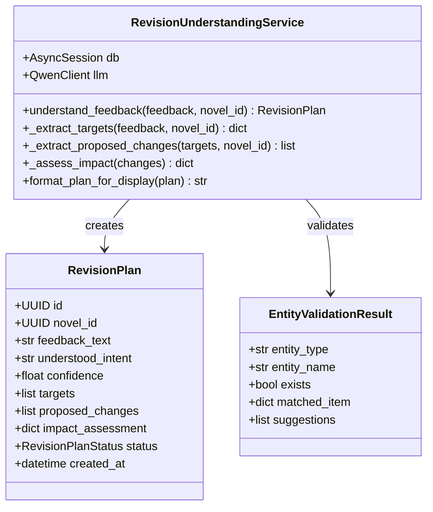
```mermaid
classDiagram
class RevisionUnderstandingService {
+AsyncSession db
+QwenClient llm
+understand_feedback(feedback, novel_id) RevisionPlan
+_extract_targets(feedback, novel_id) dict
+_extract_proposed_changes(targets, novel_id) list
+_assess_impact(changes) dict
+format_plan_for_display(plan) str
}
class RevisionPlan {
+UUID id
+UUID novel_id
+str feedback_text
+str understood_intent
+float confidence
+list targets
+list proposed_changes
+dict impact_assessment
+RevisionPlanStatus status
+datetime created_at
}
class EntityValidationResult {
+str entity_type
+str entity_name
+bool exists
+dict matched_item
+list suggestions
}
RevisionUnderstandingService --> RevisionPlan : creates
RevisionUnderstandingService --> EntityValidationResult : validates
```

**图表来源**
- [revision_understanding_service.py:17-498](file://backend/services/revision_understanding_service.py#L17-L498)
- [revision_plan.py:33-116](file://core/models/revision_plan.py#L33-L116)

**章节来源**
- [revision_understanding_service.py:17-498](file://backend/services/revision_understanding_service.py#L17-L498)
- [revision_plan.py:33-116](file://core/models/revision_plan.py#L33-L116)

### 修订数据验证服务

**更新** 新增了`RevisionDataValidator`类，负责验证用户反馈中的实体是否存在：

```mermaid
classDiagram
class RevisionDataValidator {
+AsyncSession db
+validate_feedback(feedback, novel_id) ValidationReport
+_extract_entities(feedback, context) dict
+_validate_characters(names, context) list
+_validate_chapters(numbers, context) list
+_validate_locations(locations, context) list
+_validate_world_elements(elements, context) list
+_find_similar_names(target, names) list
}
class ValidationReport {
+str novel_id
+bool is_valid
+int entity_count
+int valid_count
+int invalid_count
+list character_results
+list chapter_results
+list location_results
+list world_element_results
+dict extracted_entities
+str warning_message
+str summary
}
RevisionDataValidator --> ValidationReport : generates
```

**图表来源**
- [revision_data_validator.py:43-619](file://backend/services/revision_data_validator.py#L43-L619)

**章节来源**
- [revision_data_validator.py:43-619](file://backend/services/revision_data_validator.py#L43-L619)

### 修订执行服务

**更新** 新增了`RevisionExecutionService`类，负责执行用户确认的修订计划：

```mermaid
classDiagram
class RevisionExecutionService {
+AsyncSession db
+execute_plan(plan_id, confirmed, modifications) ExecutionResult
+preview_plan(plan_id) dict
+_get_plan(plan_id) RevisionPlan
+_merge_modifications(proposed, modifications) list
+_execute_single_change(change) ChangeResult
+_update_character(id, field, value) ChangeResult
+_update_chapter(id, field, value) ChangeResult
+_update_world_setting(novel_id, field, value) ChangeResult
+_update_outline(novel_id, field, value) ChangeResult
+_extract_affected_chapters(plan, results) list
}
class ExecutionResult {
+bool success
+str message
+list changes
+list affected_chapters
}
class ChangeResult {
+bool success
+str target_type
+str target_name
+str field
+str message
}
RevisionExecutionService --> ExecutionResult : returns
RevisionExecutionService --> ChangeResult : produces
```

**图表来源**
- [revision_execution_service.py:34-458](file://backend/services/revision_execution_service.py#L34-L458)

**章节来源**
- [revision_execution_service.py:34-458](file://backend/services/revision_execution_service.py#L34-L458)

### 修订API接口

**更新** 新增了完整的修订API接口，支持修订反馈理解、计划执行和经验学习：

| 端点 | 方法 | 功能 | 返回类型 |
|------|------|------|----------|
| /revision/understand | POST | 理解修订反馈并生成计划 | RevisionPlanResponse |
| /revision/execute | POST | 执行修订计划 | ExecutionResultResponse |
| /revision/preview/{plan_id} | GET | 预览修订计划影响 | dict |
| /revision/plans/{novel_id} | GET | 获取修订计划列表 | dict |
| /revision/lessons/{novel_id} | GET | 获取适用的经验教训 | LessonResponse |
| /revision/strategies/{novel_id} | GET | 获取策略建议 | StrategyResponse |
| /revision/preferences | POST | 记录用户偏好 | PreferenceResponse |
| /revision/preferences/{user_id} | GET | 获取用户偏好列表 | dict |

**章节来源**
- [revision.py:136-463](file://backend/api/v1/revision.py#L136-L463)

## 智能章节分析功能

### 章节摘要生成

**更新** 系统新增了智能章节摘要生成功能，支持结构化的章节内容分析：

```mermaid
flowchart TD
Start([开始章节摘要生成]) --> LoadContext[加载章节上下文]
LoadContext --> AnalyzeContent[分析章节内容]
AnalyzeContent --> ExtractEvents[提取关键事件]
ExtractEvents --> TrackCharacters[追踪角色变化]
TrackCharacters --> AnalyzePlot[分析情节进展]
AnalyzePlot --> CheckForeshadowing[检查伏笔暗示]
CheckForeshadowing --> SummarizeEnding[总结结尾状态]
SummarizeEnding --> FormatOutput[格式化输出]
FormatOutput --> SaveToMemory[保存到持久化存储]
SaveToMemory --> ReturnResult[返回摘要结果]
```

#### 章节摘要结构

智能摘要包含以下结构化信息：

| 摘要字段 | 描述 | 示例 |
|---------|------|------|
| key_events | 关键事件列表 | 主角获得神秘力量、与反派首次交锋 |
| character_changes | 角色变化描述 | 主角性格变得更加谨慎、配角身份暴露 |
| plot_progress | 情节进展概述 | 推进主线剧情、埋下重要伏笔 |
| foreshadowing | 伏笔暗示列表 | 未来冲突的预兆、重要物品的出现 |
| ending_state | 结尾状态描述 | 悬念设置、角色关系变化 |

**章节来源**
- [ai_chat_service.py:1862-1910](file://backend/services/ai_chat_service.py#L1862-L1910)
- [context_manager.py:157-249](file://backend/services/context_manager.py#L157-L249)

### 图数据库上下文集成

**更新** 系统将图数据库查询结果集成到章节分析中，提供更丰富的上下文信息：

```mermaid
sequenceDiagram
participant AI as AI聊天服务
participant Graph as 图数据库
participant Memory as 持久化存储
AI->>Graph : 查询角色关系网络
Graph-->>AI : 返回关系数据
AI->>Graph : 查询角色影响力
Graph-->>AI : 返回影响力报告
AI->>Graph : 检测一致性冲突
Graph-->>AI : 返回冲突报告
AI->>Memory : 获取章节摘要
Memory-->>AI : 返回摘要数据
AI->>AI : 构建综合分析上下文
AI-->>AI : 生成智能章节分析
```

#### 图上下文信息

系统从图数据库获取以下信息用于章节分析：

1. **角色关系网络**：角色之间的直接和间接关系
2. **角色影响力**：角色在网络中的重要程度和影响范围
3. **一致性冲突检测**：角色行为、关系、时间线等方面的冲突
4. **伏笔追踪**：待回收的伏笔及其相关信息
5. **事件时间线**：按章节排序的重要事件

**章节来源**
- [graph_query_mixin.py:362-445](file://agents/graph_query_mixin.py#L362-L445)
- [graph_query_service.py:320-522](file://backend/services/graph_query_service.py#L320-L522)

### 修订建议与智能分析集成

**更新** 系统将修订建议提取功能与智能章节分析深度集成：

```mermaid
flowchart TD
Start([开始修订分析]) --> LoadChapters[加载章节内容]
LoadChapters --> GenerateSmartSummary[生成智能摘要]
GenerateSmartSummary --> AnalyzeWithLLM[LLM分析章节]
AnalyzeWithLLM --> ExtractIssues[提取问题和建议]
ExtractIssues --> ValidateEntities[验证实体存在性]
ValidateEntities --> GeneratePlan[生成修订计划]
GeneratePlan --> ReviewLoop[评审循环]
ReviewLoop --> ApplySuggestion[应用修订建议]
ApplySuggestion --> UpdateMemory[更新记忆缓存]
UpdateMemory --> End([完成])
```

#### 修订建议提取流程

系统支持多种修订类型的建议提取：

1. **小说基本信息修订**：标题、作者、简介、类型等
2. **世界观设定修订**：修炼体系、地理环境、势力划分等
3. **角色设定修订**：性格、背景、能力、关系等
4. **大纲修订**：结构类型、主线剧情、关键转折点等
5. **章节内容修订**：标题、内容、情节等

**章节来源**
- [ai_chat_service.py:2618-2720](file://backend/services/ai_chat_service.py#L2618-L2720)
- [review_loop.py:71-408](file://agents/review_loop.py#L71-L408)

## 持久化记忆系统

### AgentMesh存储架构

**更新** 系统采用了AgentMesh设计理念，建立了完整的持久化记忆系统：

```mermaid
graph TB
subgraph "持久化存储层"
SQLite[SQLite数据库]
FTS[FTS5全文搜索引擎]
end
subgraph "存储表结构"
ChapterSummaries[章节摘要表]
CharacterStates[角色状态表]
NovelMetadata[小说元数据表]
Foreshadowing[伏笔追踪表]
MemoryChunks[记忆块表]
ReflectionEntries[反思记录表]
ChapterPatterns[章节模式表]
WritingLessons[写作经验规则表]
end
subgraph "索引系统"
CompositeIndex[复合索引]
FullTextIndex[全文索引]
end
SQLite --> ChapterSummaries
SQLite --> CharacterStates
SQLite --> NovelMetadata
SQLite --> Foreshadowing
SQLite --> MemoryChunks
SQLite --> ReflectionEntries
SQLite --> ChapterPatterns
SQLite --> WritingLessons
FTS --> FullTextIndex
ChapterSummaries --> CompositeIndex
CharacterStates --> CompositeIndex
MemoryChunks --> FullTextIndex
```

**图表来源**
- [agentmesh_memory_adapter.py:46-287](file://backend/services/agentmesh_memory_adapter.py#L46-L287)

### 章节摘要存储

**更新** 新增了专门的章节摘要存储功能，支持结构化的内容分析结果：

#### 章节摘要表结构

| 字段名 | 类型 | 描述 | 索引 |
|--------|------|------|------|
| id | TEXT | 主键标识 | PRIMARY KEY |
| novel_id | TEXT | 小说ID | INDEX |
| chapter_number | INTEGER | 章节号 | INDEX, COMPOSITE |
| key_events | TEXT | 关键事件JSON数组 | - |
| character_changes | TEXT | 角色变化描述 | - |
| plot_progress | TEXT | 情节进展描述 | - |
| foreshadowing | TEXT | 伏笔JSON数组 | - |
| ending_state | TEXT | 结尾状态描述 | - |
| full_content_hash | TEXT | 完整内容哈希 | - |
| word_count | INTEGER | 字数统计 | - |
| created_at | TEXT | 创建时间 | - |
| updated_at | TEXT | 更新时间 | - |

#### 存储流程

```mermaid
flowchart TD
Start([开始存储章节摘要]) --> ValidateInput[验证输入数据]
ValidateInput --> ComputeHash[计算内容哈希]
ComputeHash --> CheckExisting[检查是否已存在]
CheckExisting --> |存在| CompareHash[比较哈希值]
CompareHash --> |相同| SkipUpdate[跳过更新]
CompareHash --> |不同| UpdateRecord[更新记录]
CheckExisting --> |不存在| InsertRecord[插入新记录]
UpdateRecord --> UpdateFTS[更新全文索引]
InsertRecord --> UpdateFTS
SkipUpdate --> End([结束])
UpdateFTS --> End
```

**章节来源**
- [agentmesh_memory_adapter.py:51-88](file://backend/services/agentmesh_memory_adapter.py#L51-L88)
- [agentmesh_memory_adapter.py:301-391](file://backend/services/agentmesh_memory_adapter.py#L301-L391)

### 上下文管理器

**更新** 新增了上下文管理器，统一管理多层缓存和持久化存储：

```mermaid
classDiagram
class ContextManager {
+AsyncSession db
+NoveLMemoryService memory_service
+NovelMemoryStorage persistent_memory
+Dict[str, Any] _current_context
+int _context_version
+get_chapter_context(chapter, include_prev) Dict
+save_chapter_context(chapter, context) void
+get_recent_contexts(n) List[Dict]
+invalidate_context() void
}
class NovelMemoryStorage {
+Path db_path
+sqlite3.Connection _get_connection()
+save_chapter_summary(novel_id, chapter, summary) str
+get_chapter_summary(novel_id, chapter) Dict
+get_chapter_summaries(novel_id, start, end) List[Dict]
+get_recent_chapter_summaries(novel_id, current, count) List[Dict]
}
ContextManager --> NovelMemoryStorage : uses
```

**图表来源**
- [context_manager.py:110-149](file://backend/services/context_manager.py#L110-L149)
- [agentmesh_memory_adapter.py:20-33](file://backend/services/agentmesh_memory_adapter.py#L20-L33)

**章节来源**
- [context_manager.py:110-249](file://backend/services/context_manager.py#L110-L249)
- [agentmesh_memory_adapter.py:20-800](file://backend/services/agentmesh_adapter.py#L20-L800)

## 依赖关系分析

### 外部依赖

系统使用了多个关键的外部库：

```mermaid
graph LR
subgraph "核心框架"
FastAPI[FastAPI 0.115.0]
SQLAlchemy[SQLAlchemy 2.0.0]
Pydantic[Pydantic 2.0.0]
end
subgraph "数据库"
AsyncPG[asyncpg]
Alembic[Alembic 1.14.0]
Neo4j[neo4j 5.0.0]
end
subgraph "LLM服务"
DashScope[DashScope 1.20.0]
OpenAI[OpenAI 2.21.0]
end
subgraph "消息队列"
Celery[Celery 5.4.0]
Redis[Redis 5.0.0]
end
subgraph "工具库"
CrewAI[CrewAI 0.100.0]
Websockets[Websockets 14.0]
Tenacity[Tenacity 9.1.4]
end
FastAPI --> SQLAlchemy
FastAPI --> Pydantic
SQLAlchemy --> AsyncPG
FastAPI --> DashScope
DashScope --> OpenAI
FastAPI --> Celery
Celery --> Redis
```

**图表来源**
- [pyproject.toml:8-37](file://pyproject.toml#L8-L37)

### 内部模块依赖

```mermaid
graph TD
subgraph "接口层"
API[backend/api/v1/ai_chat.py]
GraphAPI[backend/api/v1/graph.py]
RevisionAPI[backend/api/v1/revision.py]
end
subgraph "服务层"
Service[backend/services/ai_chat_service.py]
Memory[backend/services/memory_service.py]
Context[backend/services/context_manager.py]
GraphService[backend/services/graph_query_service.py]
RevisionUnderstanding[backend/services/revision_understanding_service.py]
RevisionExecution[backend/services/revision_execution_service.py]
Validator[backend/services/revision_data_validator.py]
Cost[llm/cost_tracker.py]
end
subgraph "模型层"
Models[core/models/ai_chat_session.py]
Neo4jClient[core/graph/neo4j_client.py]
RevisionPlan[core/models/revision_plan.py]
end
subgraph "LLM层"
Qwen[llm/qwen_client.py]
end
subgraph "配置层"
Config[backend/config.py]
end
API --> Service
GraphAPI --> GraphService
RevisionAPI --> RevisionUnderstanding
RevisionAPI --> RevisionExecution
RevisionAPI --> Validator
Service --> Memory
Service --> Context
Service --> Qwen
Service --> Models
Service --> Config
GraphService --> Neo4jClient
RevisionUnderstanding --> RevisionPlan
Qwen --> Cost
```

**图表来源**
- [ai_chat.py:1-37](file://backend/api/v1/ai_chat.py#L1-L37)
- [ai_chat_service.py:1-15](file://backend/services/ai_chat_service.py#L1-L15)
- [revision.py:17-42](file://backend/api/v1/revision.py#L17-L42)

**章节来源**
- [pyproject.toml:8-37](file://pyproject.toml#L8-L37)
- [ai_chat.py:1-37](file://backend/api/v1/ai_chat.py#L1-L37)

## 性能考虑

### 缓存策略优化

系统通过多层缓存机制提升性能：

1. **内存缓存**：使用LRU算法，支持30分钟过期
2. **数据库缓存**：异步保存，避免阻塞主流程
3. **版本控制**：跟踪内容变化，及时更新缓存
4. **持久化存储**：SQLite + FTS5，支持全文搜索

**更新** 增强了变化检测机制，现在内存服务会智能地比较关键字段和章节、角色数量来判断内容是否发生变化，从而减少不必要的缓存更新操作。

### 异步处理

系统广泛使用异步编程模式：

- **异步数据库操作**：使用SQLAlchemy异步引擎
- **异步WebSocket处理**：支持高并发实时通信
- **异步LLM调用**：避免阻塞事件循环
- **异步图数据库查询**：支持高并发关系查询

### 成本控制

系统实现了完善的成本追踪机制：

- **Token统计**：精确记录输入输出tokens
- **成本计算**：根据模型定价自动计算费用
- **预算控制**：可配置的成本上限

### 图数据库性能优化

**更新** 图数据库查询进行了专门的性能优化：

- **连接池管理**：Neo4jClient支持连接池复用
- **查询优化**：使用白名单验证防止Cypher注入
- **事务处理**：支持批量操作的原子性
- **索引优化**：创建复合索引提升查询性能

### 修订系统性能优化

**更新** 修订系统采用了多项性能优化措施：

- **并行实体验证**：使用异步查询并行验证多个实体
- **缓存机制**：缓存验证结果，避免重复查询
- **批量应用**：支持批量应用修订建议，减少数据库往返
- **增量更新**：只更新发生变化的数据，减少写操作

## 故障排除指南

### 常见问题及解决方案

#### LLM调用失败

**问题症状**：API返回500错误，提示LLM调用失败

**可能原因**：
1. API密钥配置错误
2. 网络连接不稳定
3. 模型服务不可用

**解决步骤**：
1. 检查`.env`文件中的`DASHSCOPE_API_KEY`
2. 验证网络连接和代理设置
3. 查看LLM服务状态

#### 会话加载失败

**问题症状**：获取会话详情时报404错误

**可能原因**：
1. 会话ID不存在
2. 数据库连接问题
3. 会话已被清理

**解决步骤**：
1. 确认会话ID的有效性
2. 检查数据库连接状态
3. 重新创建会话

#### WebSocket连接异常

**问题症状**：WebSocket连接频繁断开

**可能原因**：
1. 网络不稳定
2. 服务器负载过高
3. 客户端超时设置过短

**解决步骤**：
1. 检查网络连接质量
2. 监控服务器资源使用情况
3. 调整客户端超时设置

#### 小说信息获取失败

**问题症状**：`get_novel_info`返回错误或空数据

**可能原因**：
1. 小说ID格式无效
2. 小说不存在于数据库
3. 内存缓存服务异常

**解决步骤**：
1. 验证小说ID格式（UUID格式）
2. 检查数据库中是否存在对应的小说记录
3. 查看内存服务日志，确认缓存服务正常运行
4. 检查`force_db`参数设置，必要时强制从数据库加载

#### 会话标题生成失败

**问题症状**：会话标题显示为"新会话"或生成异常

**可能原因**：
1. AI模型调用失败
2. 对话内容为空
3. 标题生成逻辑异常

**解决步骤**：
1. 检查LLM服务状态和API密钥配置
2. 确认会话中有用户消息
3. 查看日志中的错误信息
4. 系统会自动使用回退方案（从第一条消息截取）

#### 增量分析合并失败

**问题症状**：分析结果未正确合并

**可能原因**：
1. 分析结果格式不正确
2. 字段类型不匹配
3. 合并逻辑异常

**解决步骤**：
1. 检查分析结果的结构和数据类型
2. 确认字段路径的有效性
3. 查看合并过程的日志信息
4. 验证安全访问方法的使用

#### 图数据库连接失败

**问题症状**：图数据库查询返回None或报错

**可能原因**：
1. Neo4j服务不可用
2. 认证信息错误
3. 图数据库功能未启用
4. 连接池耗尽

**解决步骤**：
1. 检查Neo4j服务状态和网络连接
2. 验证NEO4J_USER和NEO4J_PASSWORD配置
3. 确认ENABLE_GRAPH_DATABASE设置为True
4. 检查连接池配置和最大连接数
5. 查看Neo4jClient的连接日志

#### 章节摘要生成失败

**问题症状**：智能摘要功能返回空结果或错误

**可能原因**：
1. SQLite数据库连接失败
2. 章节摘要表结构异常
3. FTS5全文索引损坏
4. 内存存储服务异常

**解决步骤**：
1. 检查SQLite数据库文件权限和磁盘空间
2. 验证chapter_summaries表结构完整性
3. 重建FTS5全文索引
4. 检查AgentMesh存储服务日志
5. 清理损坏的索引数据

#### 修订建议提取失败

**问题症状**：提取修订建议返回空数组或错误

**可能原因**：
1. LLM调用失败或响应格式不正确
2. 输入参数验证失败
3. JSON解析错误
4. 建议格式不符合规范

**解决步骤**：
1. 检查LLM服务状态和API密钥配置
2. 验证输入参数的novel_id和ai_response格式
3. 查看日志中的JSON解析错误信息
4. 确认建议格式符合预期的JSON结构

#### 修订建议应用失败

**问题症状**：应用修订建议返回失败或部分成功

**可能原因**：
1. 目标对象不存在或ID无效
2. 字段名不正确或不允许修改
3. 数据库事务失败
4. 结构化数据解析错误

**解决步骤**：
1. 检查目标对象ID是否存在于数据库
2. 验证字段名是否在允许的字段列表中
3. 查看数据库事务日志，确认是否有约束冲突
4. 检查结构化数据的JSON格式是否正确
5. 对于列表字段，确保提供正确的JSON格式

#### 修订数据验证失败

**问题症状**：验证用户反馈中的实体失败

**可能原因**：
1. 数据库连接问题
2. 实体提取正则表达式匹配失败
3. 异步查询超时
4. 中文数字转换错误

**解决步骤**：
1. 检查数据库连接状态和权限
2. 验证正则表达式的正确性
3. 查看异步查询的超时设置
4. 检查中文数字转换函数的逻辑
5. 确认角色名列表的加载是否成功

**章节来源**
- [ai_chat.py:98-104](file://backend/api/v1/ai_chat.py#L98-L104)
- [qwen_client.py:97-106](file://llm/qwen_client.py#L97-L106)
- [neo4j_client.py:133-172](file://core/graph/neo4j_client.py#L133-L172)
- [agentmesh_memory_adapter.py:46-88](file://backend/services/agentmesh_memory_adapter.py#L46-L88)
- [revision_understanding_service.py:17-498](file://backend/services/revision_understanding_service.py#L17-L498)
- [revision_execution_service.py:34-458](file://backend/services/revision_execution_service.py#L34-L458)

## 结论

AI聊天服务是一个功能完整、架构清晰的智能对话系统。通过合理的分层设计和多层缓存机制，系统能够在保证性能的同时提供高质量的AI服务。主要特点包括：

1. **多场景支持**：涵盖小说创作、爬虫任务、修订和分析四大场景
2. **高性能架构**：异步处理、内存缓存、流式响应
3. **成本控制**：完善的Token统计和成本追踪
4. **易扩展性**：模块化设计，便于功能扩展和维护
5. **智能组织**：新增的会话隔离和智能标题生成功能，提升了用户体验
6. **图数据库集成**：全新的图数据库智能章节分析功能
7. **持久化记忆**：基于AgentMesh理念的完整记忆系统
8. **修订系统集成**：完整的修订建议提取、验证和应用功能
9. **智能分析能力**：深度集成的智能章节分析和修订建议功能

**更新** 系统现已显著增强了分析能力和稳定性，通过新增的修订建议提取、应用和智能章节分析功能，以及与新修订系统的完整集成，大幅提升了系统的智能化水平和用户体验。特别是修订系统的集成，使得系统能够从自然语言反馈中提取结构化的修订建议，并直接应用到数据库中，为用户提供了一站式的创作辅助解决方案。

这些改进使得系统能够更好地处理复杂的创作场景，提供更加精准和个性化的AI辅助服务，特别是在处理章节内容分析、角色关系理解和情节发展预测等方面表现出色。系统现在不仅能够理解文本内容，还能够利用图数据库的强大查询能力和修订系统的智能分析，为用户提供深层次的创作洞察和建议。

该系统为网络小说创作提供了强大的AI辅助能力，能够显著提升创作效率和质量，是现代AI驱动的创作工具的重要代表。通过持续的功能扩展和性能优化，系统将继续为创作者提供更加智能、便捷和高效的服务体验。