# AI聊天服务

<cite>
**本文档引用的文件**
- [ai_chat.py](file://backend/api/v1/ai_chat.py)
- [ai_chat_service.py](file://backend/services/ai_chat_service.py)
- [ai_chat_session.py](file://core/models/ai_chat_session.py)
- [qwen_client.py](file://llm/qwen_client.py)
- [ai_chat.py](file://backend/schemas/ai_chat.py)
- [memory_service.py](file://backend/services/memory_service.py)
- [cost_tracker.py](file://llm/cost_tracker.py)
- [5c24a4e1ec52_add_novel_id_and_title_to_chat_session.py](file://alembic/versions/5c24a4e1ec52_add_novel_id_and_title_to_chat_session.py)
- [aiChat.ts](file://frontend/src/api/aiChat.ts)
- [config.py](file://backend/config.py)
- [pyproject.toml](file://pyproject.toml)
- [agentmesh_memory_adapter.py](file://backend/services/agentmesh_memory_adapter.py)
</cite>

## 更新摘要
**变更内容**
- 新增持久化记忆上下文集成，显著提升文学分析深度和准确性
- 集成SQLite持久化存储，替代内存缓存的短期记忆限制
- 实现章节摘要、角色状态、伏笔追踪等多维度记忆管理
- 新增增强的AI分析提示构建，包含完整的上下文信息
- 实现AgentMesh风格的记忆系统，支持全文搜索和语义检索

## 目录
1. [简介](#简介)
2. [项目结构](#项目结构)
3. [核心组件](#核心组件)
4. [架构概览](#架构概览)
5. [详细组件分析](#详细组件分析)
6. [依赖关系分析](#依赖关系分析)
7. [性能考虑](#性能考虑)
8. [故障排除指南](#故障排除指南)
9. [结论](#结论)

## 简介

AI聊天服务是一个基于FastAPI构建的智能对话系统，专门为网络小说创作提供AI辅助功能。该系统集成了通义千问大模型，支持多种创作场景，包括小说创作、爬虫任务规划、小说修订和内容分析。系统采用内存缓存机制和数据库持久化相结合的方式，提供了高效的会话管理和内容存储能力。

**更新** 系统现已显著增强了分析能力和稳定性，新增了增量分析合并功能、安全字段访问机制、智能标题生成和会话隔离等特性。更重要的是，系统集成了AgentMesh风格的持久化记忆系统，通过SQLite数据库实现长期记忆存储，显著提升了文学分析的深度和准确性。

## 项目结构

AI聊天服务采用分层架构设计，主要分为以下几个层次：

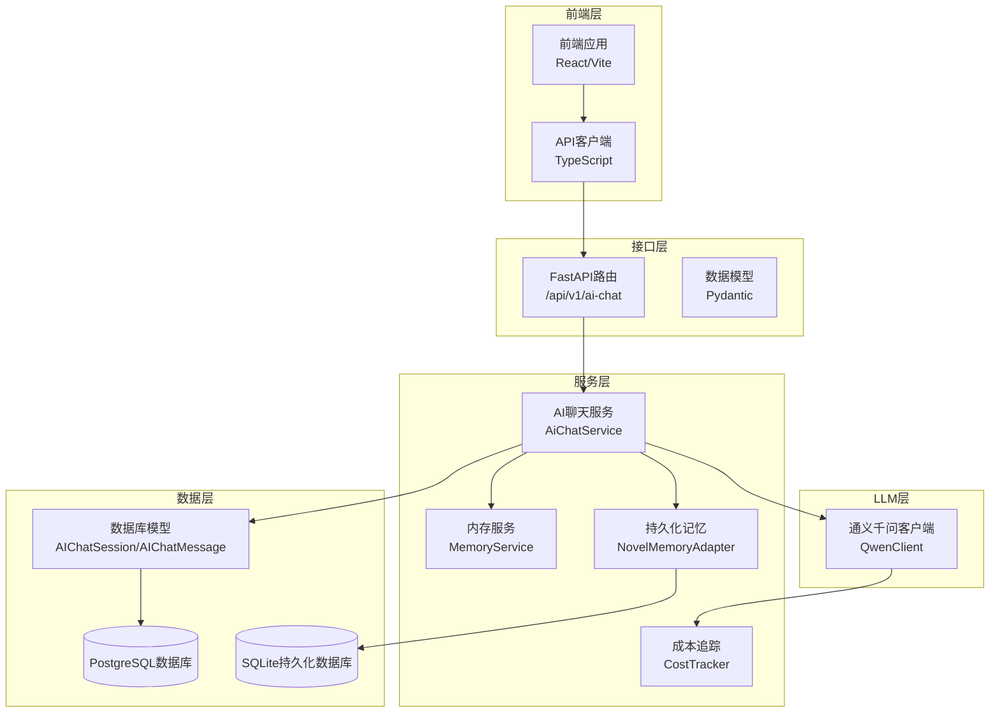

**图表来源**
- [ai_chat.py](file://backend/api/v1/ai_chat.py#L1-L50)
- [ai_chat_service.py](file://backend/services/ai_chat_service.py#L189-L200)
- [agentmesh_memory_adapter.py](file://backend/services/agentmesh_memory_adapter.py#L922-L936)
- [qwen_client.py](file://llm/qwen_client.py#L16-L45)

**章节来源**
- [ai_chat.py](file://backend/api/v1/ai_chat.py#L1-L50)
- [ai_chat_service.py](file://backend/services/ai_chat_service.py#L1-L50)
- [pyproject.toml](file://pyproject.toml#L8-L37)

## 核心组件

### AI聊天服务核心类

AI聊天服务的核心是`AiChatService`类，它负责管理所有聊天相关的业务逻辑：

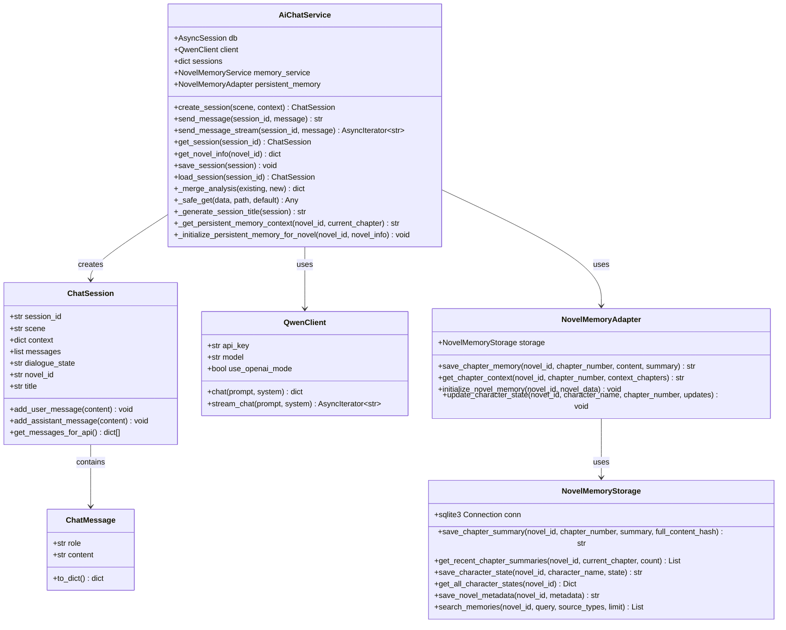

**图表来源**
- [ai_chat_service.py](file://backend/services/ai_chat_service.py#L189-L200)
- [ai_chat_service.py](file://backend/services/ai_chat_service.py#L128-L187)
- [agentmesh_memory_adapter.py](file://backend/services/agentmesh_memory_adapter.py#L922-L936)
- [agentmesh_memory_adapter.py](file://backend/services/agentmesh_memory_adapter.py#L20-L32)
- [qwen_client.py](file://llm/qwen_client.py#L16-L45)

### 数据模型

系统使用SQLAlchemy定义了两个核心数据模型：

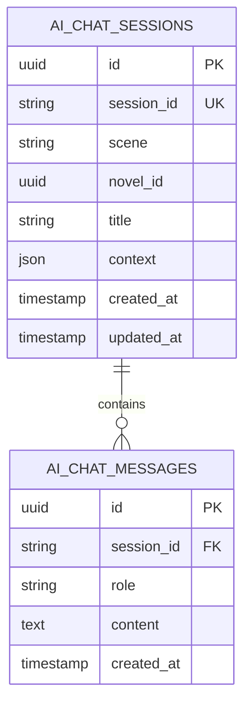

**图表来源**
- [ai_chat_session.py](file://core/models/ai_chat_session.py#L17-L36)

**章节来源**
- [ai_chat_service.py](file://backend/services/ai_chat_service.py#L189-L200)
- [ai_chat_session.py](file://core/models/ai_chat_session.py#L1-L36)

## 架构概览

AI聊天服务采用异步架构设计，支持高并发请求处理：

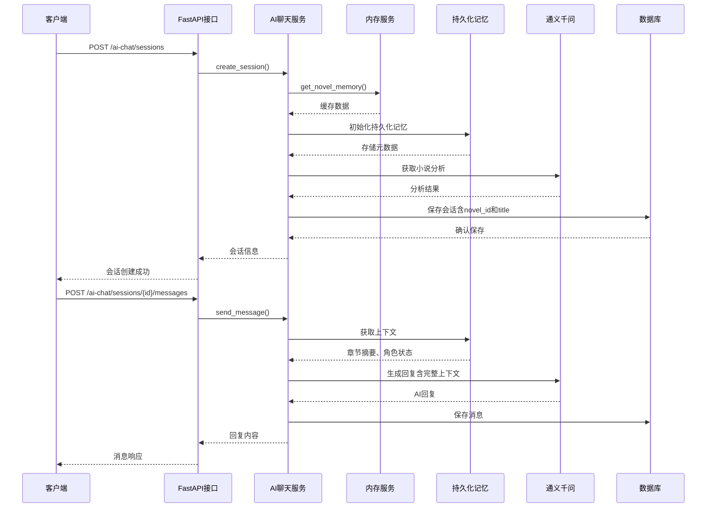

**图表来源**
- [ai_chat.py](file://backend/api/v1/ai_chat.py#L54-L104)
- [ai_chat_service.py](file://backend/services/ai_chat_service.py#L526-L570)
- [agentmesh_memory_adapter.py](file://backend/services/agentmesh_memory_adapter.py#L968-L1015)

## 详细组件分析

### 会话管理系统

会话管理系统是AI聊天服务的核心功能之一，支持多种场景的智能对话：

#### 支持的场景类型

系统定义了四种主要的创作场景：

| 场景类型 | 用途 | 系统提示词 |
|---------|------|----------|
| novel_creation | 小说创作 | 专业的创作顾问，帮助规划世界观、角色和情节 |
| crawler_task | 爬虫任务 | 数据分析师，制定爬取策略和市场分析 |
| novel_revision | 小说修订 | 编辑助手，直接生成修订后的内容 |
| novel_analysis | 小说分析 | 分析师，提供全面的分析和建议 |

#### 会话生命周期管理

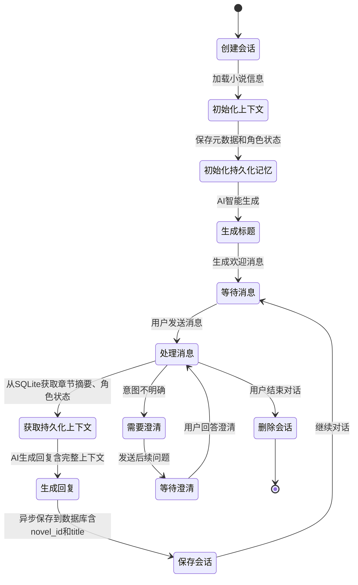

**图表来源**
- [ai_chat_service.py](file://backend/services/ai_chat_service.py#L526-L570)
- [ai_chat_service.py](file://backend/services/ai_chat_service.py#L572-L574)
- [agentmesh_memory_adapter.py](file://backend/services/agentmesh_memory_adapter.py#L968-L1015)

**章节来源**
- [ai_chat_service.py](file://backend/services/ai_chat_service.py#L53-L115)
- [ai_chat_service.py](file://backend/services/ai_chat_service.py#L526-L570)

### 持久化记忆系统

**更新** 系统新增了AgentMesh风格的持久化记忆系统，通过SQLite数据库实现长期记忆存储，显著提升了分析能力：

#### 持久化记忆架构

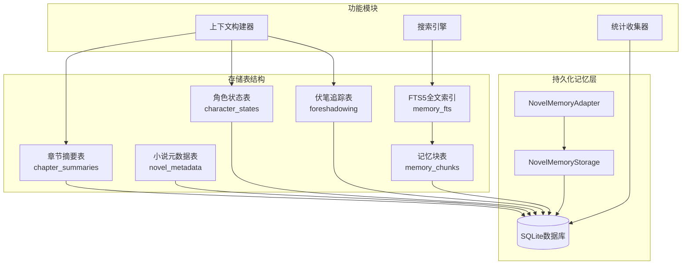

**图表来源**
- [agentmesh_memory_adapter.py](file://backend/services/agentmesh_memory_adapter.py#L20-L32)
- [agentmesh_memory_adapter.py](file://backend/services/agentmesh_memory_adapter.py#L47-L168)

#### 持久化记忆功能

系统实现了多维度的记忆管理：

1. **章节摘要管理**：保存每章的关键事件、角色变化、情节进展
2. **角色状态追踪**：记录角色的位置、境界、情感状态、关系变化
3. **伏笔追踪系统**：管理埋设的伏笔及其解决状态
4. **全文搜索能力**：通过FTS5实现关键词搜索和语义检索
5. **统计分析功能**：提供小说记忆的统计信息

**章节来源**
- [agentmesh_memory_adapter.py](file://backend/services/agentmesh_memory_adapter.py#L20-L168)
- [agentmesh_memory_adapter.py](file://backend/services/agentmesh_memory_adapter.py#L183-L344)
- [agentmesh_memory_adapter.py](file://backend/services/agentmesh_memory_adapter.py#L374-L497)

### 增强的AI分析提示构建

**更新** 系统现在能够从持久化记忆中获取完整的上下文信息，显著提升了分析的深度和准确性：

#### 增强的分析流程

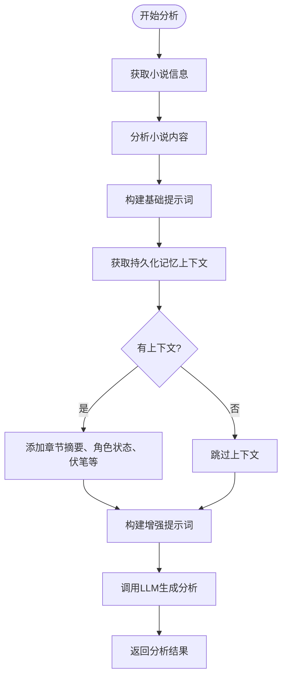

#### 持久化上下文内容

系统从持久化记忆中获取以下信息：

1. **章节摘要**：最近N章的主要事件、角色变化、情节进展
2. **角色状态**：主要角色的当前位置、修炼境界、情感状态
3. **伏笔追踪**：待解决的伏笔及其相关信息
4. **时间线事件**：关键事件的时间线梳理

**章节来源**
- [ai_chat_service.py](file://backend/services/ai_chat_service.py#L994-L1061)
- [ai_chat_service.py](file://backend/services/ai_chat_service.py#L1137-L1143)

### 智能标题生成功能

**更新** 系统新增了智能标题生成功能，支持从对话内容中自动生成简洁明了的会话标题：

#### 标题生成流程


#### 标题生成策略

系统提供了多层次的标题生成策略：

1. **AI智能生成**：基于对话内容分析，生成简洁概括的标题
2. **回退方案**：当AI生成失败时，从第一条用户消息中截取内容
3. **长度限制**：确保标题不超过50个字符，保持简洁性

**章节来源**
- [ai_chat_service.py](file://backend/services/ai_chat_service.py#L604-L682)

### 会话隔离与组织导航

**更新** 系统新增了会话隔离功能，通过novel_id属性支持按小说进行会话分组管理：

#### 会话隔离机制

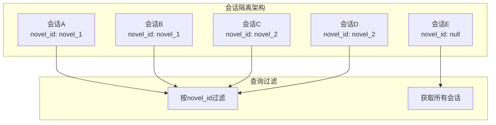

#### 会话查询与过滤

系统支持多种会话查询方式：

| 查询方式 | 参数 | 功能 | 使用场景 |
|---------|------|------|----------|
| 全部会话 | 无 | 获取所有会话 | 管理界面查看 |
| 按场景过滤 | scene | 按创作场景过滤 | 快速定位特定类型会话 |
| 按小说隔离 | novel_id | 按小说ID隔离会话 | 组织导航和项目管理 |
| 组合过滤 | scene + novel_id | 同时按场景和小说过滤 | 精确查找特定会话 |

**章节来源**
- [ai_chat_service.py](file://backend/services/ai_chat_service.py#L476-L518)
- [ai_chat.py](file://backend/api/v1/ai_chat.py#L180-L196)

### LLM集成与流式处理

系统集成了通义千问大模型，支持同步和流式两种调用方式：

#### LLM客户端架构

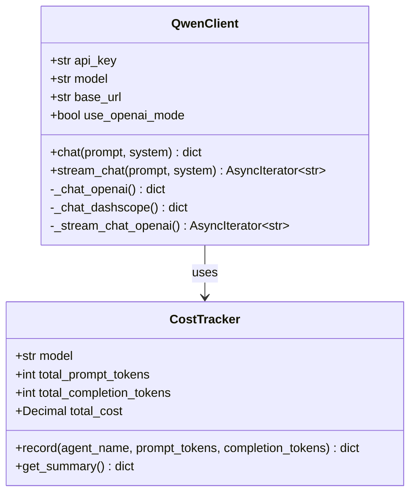

**图表来源**
- [qwen_client.py](file://llm/qwen_client.py#L16-L45)
- [cost_tracker.py](file://llm/cost_tracker.py#L16-L25)

#### 流式对话处理流程

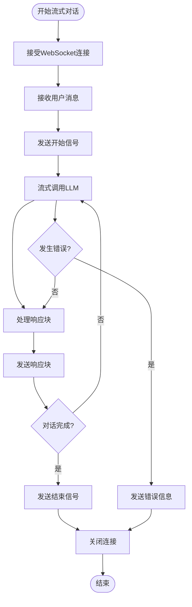

**图表来源**
- [ai_chat.py](file://backend/api/v1/ai_chat.py#L106-L151)

**章节来源**
- [qwen_client.py](file://llm/qwen_client.py#L16-L232)
- [cost_tracker.py](file://llm/cost_tracker.py#L1-L74)

### 内存缓存与数据管理

系统实现了多层次的数据缓存机制，以提高性能和响应速度：

#### 内存缓存架构

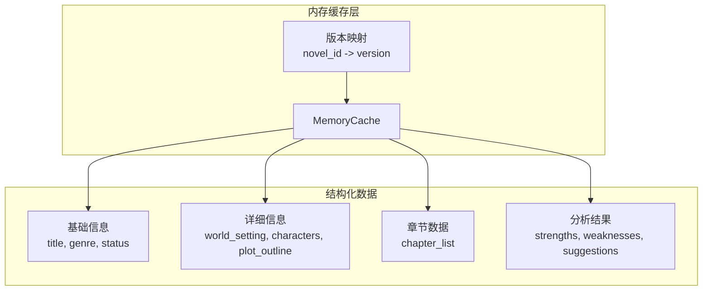

**图表来源**
- [memory_service.py](file://backend/services/memory_service.py#L72-L139)

#### 缓存策略

系统采用了LRU（最近最少使用）算法和时间过期机制：

| 缓存参数 | 默认值 | 说明 |
|---------|--------|------|
| 最大缓存大小 | 100 | 缓存小说数量上限 |
| 过期时间 | 30分钟 | 数据过期时间 |
| 访问统计 | 启用 | 记录访问次数和时间 |

**更新** 增强了变化检测机制，现在内存服务会比较关键字段和章节、角色数量来判断内容是否发生变化，并返回相应的`has_changes`状态。

**章节来源**
- [memory_service.py](file://backend/services/memory_service.py#L10-L70)
- [memory_service.py](file://backend/services/memory_service.py#L72-L232)

### API接口设计

系统提供了RESTful API和WebSocket接口，支持多种交互方式：

#### 主要API端点

| 端点 | 方法 | 功能 | 返回类型 |
|------|------|------|----------|
| /ai-chat/sessions | POST | 创建会话 | AIChatSessionResponse |
| /ai-chat/sessions/{session_id}/messages | POST | 发送消息 | AIChatMessageResponse |
| /ai-chat/ws/{session_id} | WebSocket | 流式对话 | 文本块 |
| /ai-chat/parse-novel | POST | 解析小说意图 | NovelParseResponse |
| /ai-chat/extract-suggestions | POST | 提取修订建议 | ExtractSuggestionsResponse |
| /ai-chat/sessions | GET | 获取会话列表 | 包含novel_id和title |

#### WebSocket通信协议

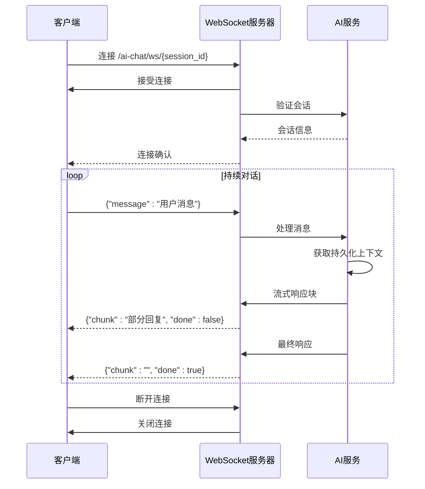

**图表来源**
- [ai_chat.py](file://backend/api/v1/ai_chat.py#L106-L151)

**章节来源**
- [ai_chat.py](file://backend/api/v1/ai_chat.py#L54-L415)
- [aiChat.ts](file://frontend/src/api/aiChat.ts#L97-L207)

### 小说信息刷新逻辑增强

**更新** 系统现已增强小说信息刷新逻辑，提供了更稳定的数据处理机制：

#### 增强的小说信息获取流程

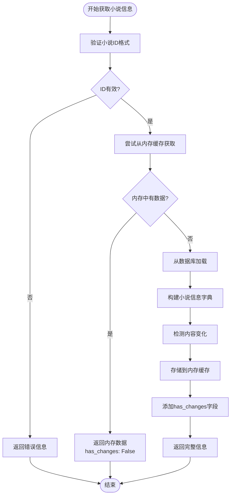

#### 增强的内存服务功能

内存服务现在具备更完善的变化检测机制：


**图表来源**
- [memory_service.py](file://backend/services/memory_service.py#L72-L164)

**章节来源**
- [ai_chat_service.py](file://backend/services/ai_chat_service.py#L206-L368)
- [memory_service.py](file://backend/services/memory_service.py#L84-L138)

### 新增功能详解

#### 增量分析合并功能

**更新** 系统新增了`_merge_analysis`方法，支持增量合并分析结果：

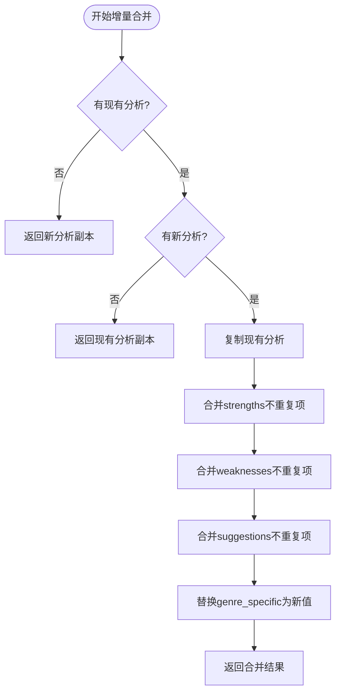

#### 安全字段访问功能

**更新** 系统新增了`_safe_get`方法，提供安全的嵌套字典访问：

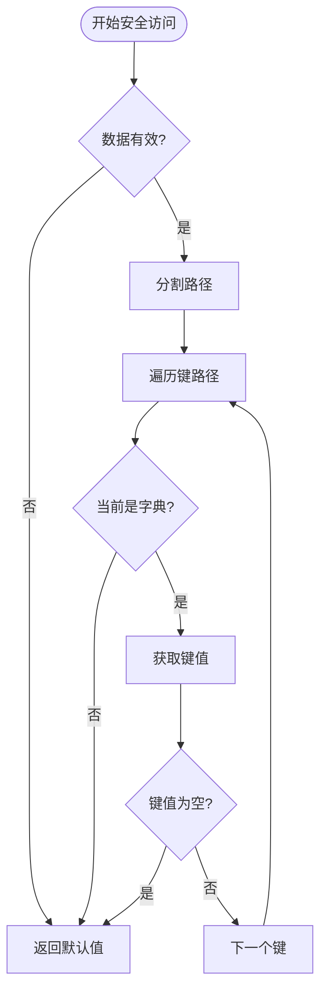

#### 增强的小说分析功能

**更新** 系统增强了小说分析功能，提供更智能的内容分析：

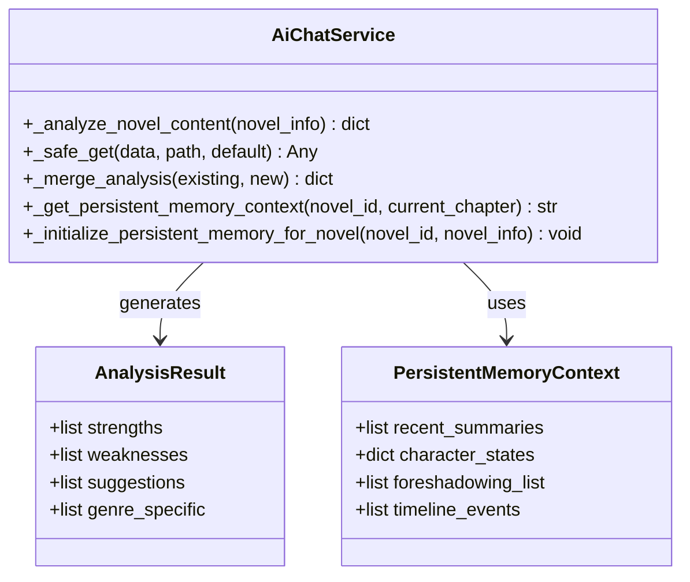

**章节来源**
- [ai_chat_service.py](file://backend/services/ai_chat_service.py#L869-L923)
- [ai_chat_service.py](file://backend/services/ai_chat_service.py#L925-L985)
- [ai_chat_service.py](file://backend/services/ai_chat_service.py#L994-L1061)

#### 持久化记忆上下文获取

**更新** 系统新增了`_get_persistent_memory_context`方法，从SQLite数据库获取增强的上下文信息：

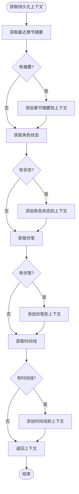

**章节来源**
- [ai_chat_service.py](file://backend/services/ai_chat_service.py#L994-L1061)

## 依赖关系分析

### 外部依赖

系统使用了多个关键的外部库：

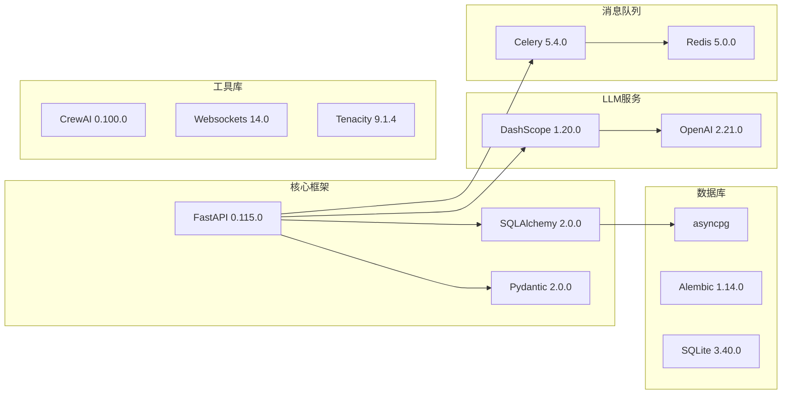

**图表来源**
- [pyproject.toml](file://pyproject.toml#L8-L37)

### 内部模块依赖

```mermaid
graph TD
subgraph "接口层"
API[backend/api/v1/ai_chat.py]
end
subgraph "服务层"
Service[backend/services/ai_chat_service.py]
Memory[backend/services/memory_service.py]
PersistentMemory[backend/services/agentmesh_memory_adapter.py]
Cost[llm/cost_tracker.py]
end
subgraph "模型层"
Models[core/models/ai_chat_session.py]
end
subgraph "LLM层"
Qwen[llm/qwen_client.py]
end
subgraph "配置层"
Config[backend/config.py]
end
API --> Service
Service --> Memory
Service --> PersistentMemory
Service --> Qwen
Service --> Models
Service --> Config
Qwen --> Cost
```

**图表来源**
- [ai_chat.py](file://backend/api/v1/ai_chat.py#L1-L37)
- [ai_chat_service.py](file://backend/services/ai_chat_service.py#L1-L15)
- [agentmesh_memory_adapter.py](file://backend/services/agentmesh_memory_adapter.py#L922-L936)

**章节来源**
- [pyproject.toml](file://pyproject.toml#L8-L37)
- [ai_chat.py](file://backend/api/v1/ai_chat.py#L1-L37)

## 性能考虑

### 缓存策略优化

系统通过多层缓存机制提升性能：

1. **内存缓存**：使用LRU算法，支持30分钟过期
2. **数据库缓存**：异步保存，避免阻塞主流程
3. **版本控制**：跟踪内容变化，及时更新缓存

**更新** 增强了变化检测机制，现在内存服务会智能地比较关键字段和章节、角色数量来判断内容是否发生变化，从而减少不必要的缓存更新操作。

### 异步处理

系统广泛使用异步编程模式：

- **异步数据库操作**：使用SQLAlchemy异步引擎
- **异步WebSocket处理**：支持高并发实时通信
- **异步LLM调用**：避免阻塞事件循环

### 成本控制

系统实现了完善的成本追踪机制：

- **Token统计**：精确记录输入输出tokens
- **成本计算**：根据模型定价自动计算费用
- **预算控制**：可配置的成本上限

### 持久化存储优化

**更新** 新增的持久化记忆系统具有以下性能特点：

- **SQLite WAL模式**：提升并发读写性能
- **FTS5全文索引**：支持高效的关键词搜索
- **哈希校验**：避免重复存储相同内容
- **批量操作**：支持批量保存和查询

## 故障排除指南

### 常见问题及解决方案

#### LLM调用失败

**问题症状**：API返回500错误，提示LLM调用失败

**可能原因**：
1. API密钥配置错误
2. 网络连接不稳定
3. 模型服务不可用

**解决步骤**：
1. 检查`.env`文件中的`DASHSCOPE_API_KEY`
2. 验证网络连接和代理设置
3. 查看LLM服务状态

#### 会话加载失败

**问题症状**：获取会话详情时报404错误

**可能原因**：
1. 会话ID不存在
2. 数据库连接问题
3. 会话已被清理

**解决步骤**：
1. 确认会话ID的有效性
2. 检查数据库连接状态
3. 重新创建会话

#### WebSocket连接异常

**问题症状**：WebSocket连接频繁断开

**可能原因**：
1. 网络不稳定
2. 服务器负载过高
3. 客户端超时设置过短

**解决步骤**：
1. 检查网络连接质量
2. 监控服务器资源使用情况
3. 调整客户端超时设置

#### 小说信息获取失败

**问题症状**：`get_novel_info`返回错误或空数据

**可能原因**：
1. 小说ID格式无效
2. 小说不存在于数据库
3. 内存缓存服务异常

**解决步骤**：
1. 验证小说ID格式（UUID格式）
2. 检查数据库中是否存在对应的小说记录
3. 查看内存服务日志，确认缓存服务正常运行
4. 检查`force_db`参数设置，必要时强制从数据库加载

#### 持久化记忆系统异常

**问题症状**：`_get_persistent_memory_context`返回空内容或报错

**可能原因**：
1. SQLite数据库文件损坏
2. 数据库连接问题
3. 表结构不完整
4. FTS5索引异常

**解决步骤**：
1. 检查`novel_memory.db`文件是否存在且可读写
2. 验证数据库连接字符串和权限
3. 运行数据库初始化脚本重建表结构
4. 检查FTS5扩展是否可用
5. 查看日志中的具体错误信息

#### 会话标题生成失败

**问题症状**：会话标题显示为"新会话"或生成异常

**可能原因**：
1. AI模型调用失败
2. 对话内容为空
3. 标题生成逻辑异常

**解决步骤**：
1. 检查LLM服务状态和API密钥配置
2. 确认会话中有用户消息
3. 查看日志中的错误信息
4. 系统会自动使用回退方案（从第一条消息截取）

#### 增量分析合并失败

**问题症状**：分析结果未正确合并

**可能原因**：
1. 分析结果格式不正确
2. 字段类型不匹配
3. 合并逻辑异常

**解决步骤**：
1. 检查分析结果的结构和数据类型
2. 确认字段路径的有效性
3. 查看合并过程的日志信息
4. 验证安全访问方法的使用

#### 增强的AI分析提示构建失败

**问题症状**：分析提示词构建不完整或缺少上下文

**可能原因**：
1. 持久化记忆上下文获取失败
2. 上下文格式化错误
3. LLM调用参数配置问题

**解决步骤**：
1. 检查持久化记忆系统的可用性
2. 验证获取的上下文数据格式
3. 确认LLM调用参数的完整性
4. 查看日志中的错误堆栈信息

**章节来源**
- [ai_chat.py](file://backend/api/v1/ai_chat.py#L98-L104)
- [qwen_client.py](file://llm/qwen_client.py#L97-L106)
- [agentmesh_memory_adapter.py](file://backend/services/agentmesh_memory_adapter.py#L47-L168)

## 结论

AI聊天服务是一个功能完整、架构清晰的智能对话系统。通过合理的分层设计和多层缓存机制，系统能够在保证性能的同时提供高质量的AI服务。主要特点包括：

1. **多场景支持**：涵盖小说创作、爬虫任务、修订和分析四大场景
2. **高性能架构**：异步处理、内存缓存、流式响应
3. **成本控制**：完善的Token统计和成本追踪
4. **易扩展性**：模块化设计，便于功能扩展和维护
5. **智能组织**：新增的会话隔离和智能标题生成功能，提升了用户体验

**更新** 系统现已显著增强了分析能力和稳定性，通过新增的增量分析合并功能、安全字段访问机制、智能标题生成、会话隔离以及最重要的持久化记忆系统等特性，大幅提升了系统的智能化水平和用户体验。特别是AgentMesh风格的SQLite持久化记忆系统，通过章节摘要、角色状态、伏笔追踪等功能，为AI分析提供了完整的上下文信息，显著提升了文学分析的深度和准确性。

该系统为网络小说创作提供了强大的AI辅助能力，能够显著提升创作效率和质量。持久化记忆系统的集成使得AI能够理解小说的完整发展脉络，提供更加精准和个性化的分析与建议，真正实现了"有记忆"的智能创作助手。