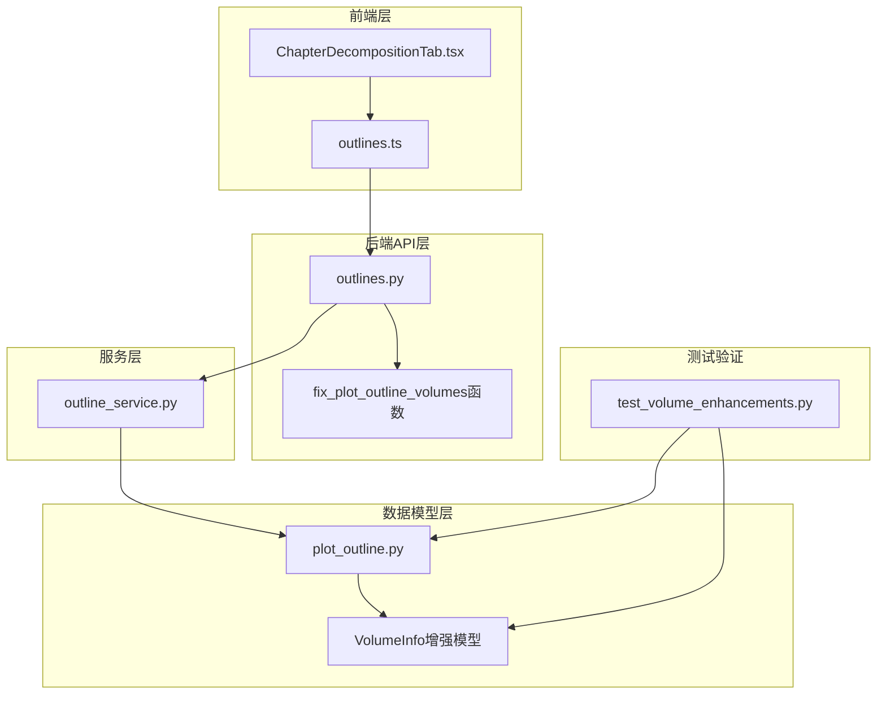
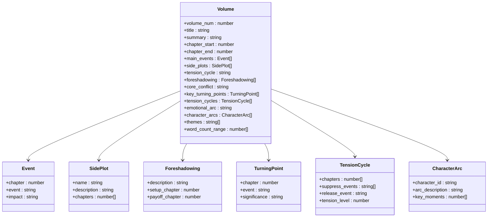
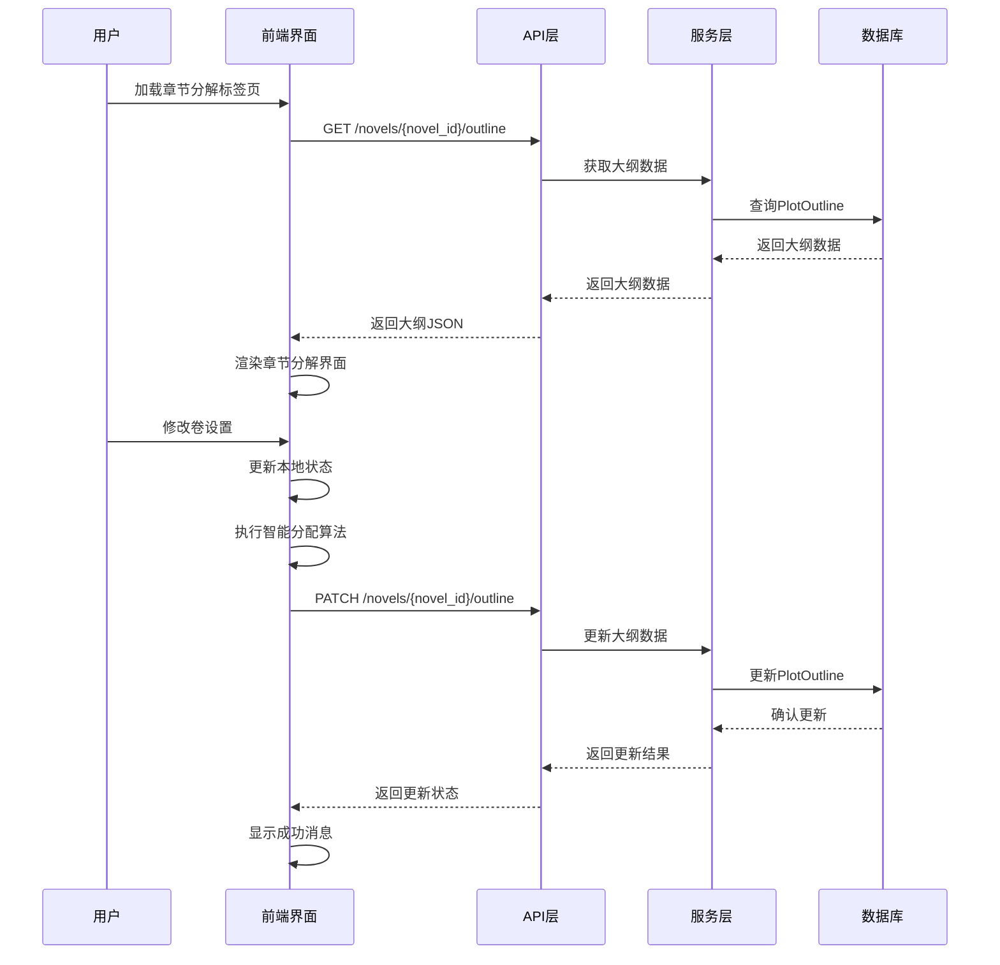
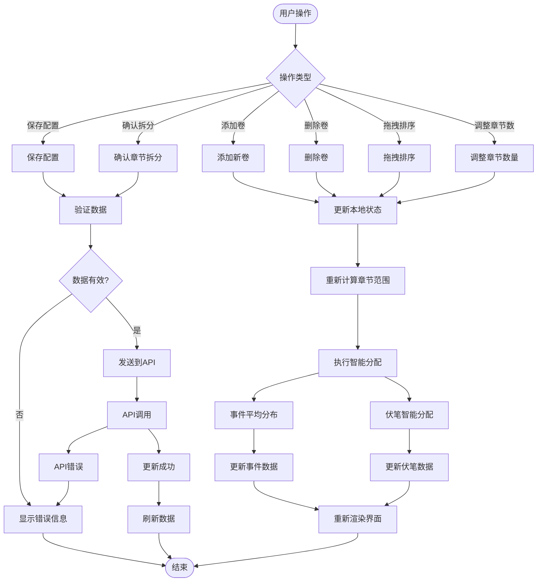
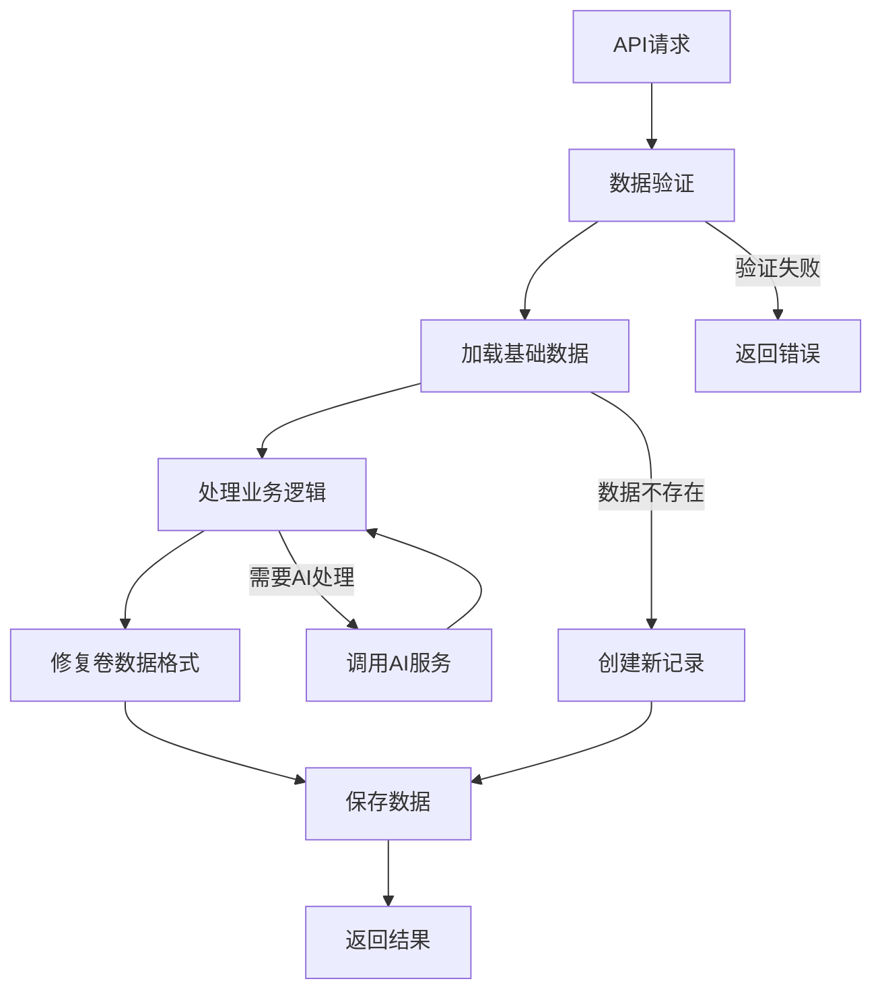
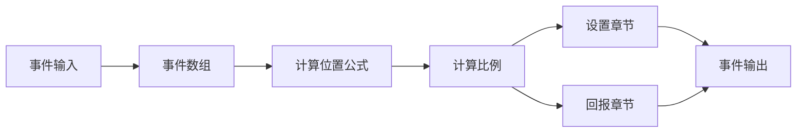
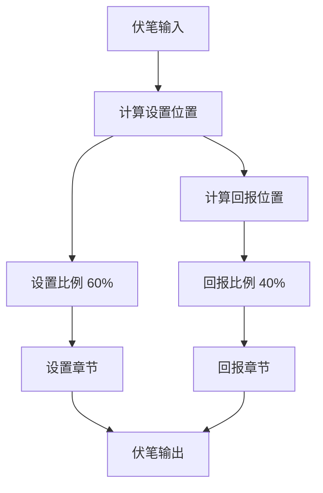
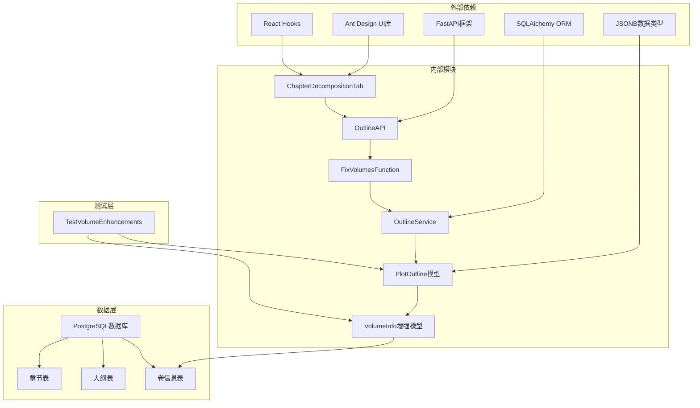

# 章节分解标签页

<cite>
**本文档引用的文件**
- [ChapterDecompositionTab.tsx](file://frontend/src/pages/NovelDetail/ChapterDecompositionTab.tsx)
- [outlines.ts](file://frontend/src/api/outlines.ts)
- [outlines.py](file://backend/api/v1/outlines.py)
- [outline.py](file://backend/schemas/outline.py)
- [plot_outline.py](file://core/models/plot_outline.py)
- [outline_service.py](file://backend/services/outline_service.py)
- [test_volume_enhancements.py](file://test_volume_enhancements.py)
</cite>

## 更新摘要
**所做更改**
- 新增卷信息增强功能的详细说明
- 更新事件在卷内的平均分布算法实现
- 新增伏笔设置和回报的智能分配机制
- 完善章节分解界面的增强功能文档
- 补充数据模型和API接口的增强说明

## 目录
1. [简介](#简介)
2. [项目结构](#项目结构)
3. [核心组件](#核心组件)
4. [架构概览](#架构概览)
5. [详细组件分析](#详细组件分析)
6. [卷信息增强功能](#卷信息增强功能)
7. [事件分布算法](#事件分布算法)
8. [伏笔智能分配](#伏笔智能分配)
9. [依赖关系分析](#依赖关系分析)
10. [性能考虑](#性能考虑)
11. [故障排除指南](#故障排除指南)
12. [结论](#结论)

## 简介

章节分解标签页是小说创作系统中的核心功能模块，经过增强后提供了更加完善的小说创作工具。该功能不仅支持基本的卷结构管理，还引入了智能化的事件分布、伏笔设置和回报分配机制，为作者提供了一个专业级的小说创作环境。

系统实现了完整的章节拆分工作流，从大纲数据的加载、编辑、验证到最终的确认和持久化。新增的增强功能包括卷信息处理、事件在卷内的平均分布算法、伏笔设置和回报的智能分配，显著提升了小说创作的效率和质量。

## 项目结构

章节分解功能涉及前端界面、API接口、业务逻辑和服务层等多个层面的协作，现已支持增强的卷信息处理：



**图表来源**
- [ChapterDecompositionTab.tsx:1-790](file://frontend/src/pages/NovelDetail/ChapterDecompositionTab.tsx#L1-L790)
- [outlines.py:831-849](file://backend/api/v1/outlines.py#L831-L849)

## 核心组件

章节分解标签页由多个核心组件构成，每个组件都有明确的职责和功能。经过增强后，系统支持更加丰富的卷信息处理：

### 增强的卷信息模型

系统使用增强的卷信息模型来存储详细的章节分解数据，支持多种创作要素：



**图表来源**
- [ChapterDecompositionTab.tsx:32-65](file://frontend/src/pages/NovelDetail/ChapterDecompositionTab.tsx#L32-L65)
- [outline.py:73-127](file://backend/schemas/outline.py#L73-L127)

### 增强的数据模型定义

系统使用增强的卷信息模型来存储详细的章节分解数据：

| 字段名 | 类型 | 描述 | 默认值 |
|--------|------|------|--------|
| number | int | 卷号 | - |
| title | str | 卷标题 | "" |
| summary | str | 卷概要 | None |
| chapters | list[int] | 章节范围 [start, end] | [] |
| core_conflict | str | 核心冲突 | None |
| main_events | list[Event] | 主线事件列表 | None |
| key_turning_points | list[TurningPoint] | 关键转折点列表 | None |
| tension_cycles | list[TensionCycle] | 张力循环列表 | None |
| emotional_arc | str | 情感弧线 | None |
| character_arcs | list[CharacterArc] | 角色发展弧线 | None |
| side_plots | list[SidePlot] | 支线情节列表 | None |
| foreshadowing | list[Foreshadowing] | 伏笔分配列表 | None |
| themes | list[str] | 主题列表 | None |
| word_count_range | list[int] | 字数范围 [min, max] | None |

**章节来源**
- [outline.py:73-127](file://backend/schemas/outline.py#L73-L127)
- [plot_outline.py:17-72](file://core/models/plot_outline.py#L17-L72)

## 架构概览

章节分解系统采用前后端分离的架构设计，经过增强后实现了更加完善的智能分配机制：



**图表来源**
- [outlines.py:157-201](file://backend/api/v1/outlines.py#L157-L201)
- [ChapterDecompositionTab.tsx:297-363](file://frontend/src/pages/NovelDetail/ChapterDecompositionTab.tsx#L297-L363)

## 详细组件分析

### 增强的前端界面组件

章节分解标签页实现了高度交互式的用户界面，经过增强后提供了更加智能的编辑功能：

#### 卷管理功能增强

系统支持动态的卷管理操作，并集成了智能分配算法：

1. **添加卷**：用户可以随时添加新的卷，系统会自动分配默认的章节范围
2. **删除卷**：至少保留一个卷，防止数据丢失
3. **拖拽排序**：支持通过拖拽调整卷的顺序
4. **章节数量调整**：每卷的章节数量可以在5-20之间调整
5. **智能事件分配**：主线事件自动在卷内平均分布
6. **智能伏笔分配**：伏笔在卷内按比例分布设置和回报

#### 智能分配算法实现



**图表来源**
- [ChapterDecompositionTab.tsx:304-340](file://frontend/src/pages/NovelDetail/ChapterDecompositionTab.tsx#L304-L340)
- [ChapterDecompositionTab.tsx:327-337](file://frontend/src/pages/NovelDetail/ChapterDecompositionTab.tsx#L327-L337)

#### 张力循环管理增强

系统提供了专门的张力循环选择器，支持四种不同的张力模式：

| 张力模式 | 颜色 | 描述 |
|----------|------|------|
| rising | 绿色 | 上升 - 冲突逐渐升级 |
| climax | 红色 | 高潮 - 冲突达到顶峰 |
| falling | 橙色 | 下降 - 冲突逐步缓解 |
| flat | 蓝色 | 平稳 - 缓慢发展 |

**章节来源**
- [ChapterDecompositionTab.tsx:759-789](file://frontend/src/pages/NovelDetail/ChapterDecompositionTab.tsx#L759-L789)

### 增强的后端API接口

后端提供了完整的API接口来支持章节分解功能，现已支持增强的卷信息处理：

#### 大纲管理API增强

```mermaid
classDiagram
class OutlineAPI {
+GET /novels/{novel_id}/outline
+PATCH /novels/{novel_id}/outline
+POST /novels/{novel_id}/outline/generate
+POST /novels/{novel_id}/outline/decompose
+GET /novels/{novel_id}/outline/versions
+POST /novels/{novel_id}/outline/ai-assist
+POST /novels/{novel_id}/outline/enhance-preview
}
class FixVolumesFunction {
+fix_plot_outline_volumes(plot_outline) PlotOutline
+确保每个卷都有number字段
+修复数据格式兼容性
}
OutlineAPI --> FixVolumesFunction
OutlineAPI --> OutlineService
```

**图表来源**
- [outlines.py:27-45](file://backend/api/v1/outlines.py#L27-L45)
- [outlines.py:831-849](file://backend/api/v1/outlines.py#L831-L849)

#### 数据验证和处理增强

后端API实现了严格的数据验证和处理机制，现已支持增强的卷信息处理：

1. **小说存在性验证**：所有操作都首先验证小说是否存在
2. **数据格式标准化**：确保返回的数据格式一致，特别是卷信息的number字段
3. **智能数据修复**：自动修复缺失的卷号字段
4. **错误处理**：提供详细的错误信息和状态码
5. **事务处理**：保证数据操作的原子性和一致性

**章节来源**
- [outlines.py:151-200](file://backend/api/v1/outlines.py#L151-L200)
- [outlines.py:831-849](file://backend/api/v1/outlines.py#L831-L849)

### 增强的服务层逻辑

服务层负责协调各个组件的工作，实现复杂的业务逻辑，现已支持增强的卷信息处理：

#### 大纲服务功能增强



**图表来源**
- [outline_service.py:28-43](file://backend/services/outline_service.py#L28-L43)

#### 测试验证机制

系统提供了完整的测试验证机制来确保增强功能的正确性：

1. **卷信息结构测试**：验证增强的卷信息数据结构
2. **字段完整性测试**：确保所有新增字段都能正确存储和读取
3. **JSON序列化测试**：验证数据的序列化和反序列化
4. **智能分配算法测试**：验证事件分布和伏笔分配的正确性

**章节来源**
- [test_volume_enhancements.py:18-125](file://test_volume_enhancements.py#L18-L125)

## 卷信息增强功能

经过增强的卷信息处理功能提供了更加丰富的小说创作要素支持：

### 核心冲突管理

系统支持为每个卷设置核心冲突，帮助作者明确每卷的主要矛盾和发展方向：

- **核心冲突描述**：提供200-300字的详细描述
- **冲突类型分类**：支持个人成长、社会冲突、超自然力量等多种类型
- **冲突发展追踪**：自动追踪核心冲突在整个小说中的发展轨迹

### 主线事件智能分配

系统实现了智能的主线事件分配算法，确保事件在卷内均匀分布：



**图表来源**
- [ChapterDecompositionTab.tsx:311-315](file://frontend/src/pages/NovelDetail/ChapterDecompositionTab.tsx#L311-L315)

### 关键转折点管理

系统支持为每个卷设置关键转折点，每个转折点包含：

- **章节号**：事件发生的精确章节
- **事件描述**：转折事件的详细描述
- **重要性评级**：对剧情发展的重要程度评估

### 张力循环设计

系统支持设计复杂的张力循环，实现"欲扬先抑"的叙事效果：

- **压制期事件**：逐步积累冲突和紧张感
- **释放期事件**：冲突达到顶峰并得到释放
- **紧张度调节**：可调节的紧张度级别（0-10）

**章节来源**
- [ChapterDecompositionTab.tsx:616-627](file://frontend/src/pages/NovelDetail/ChapterDecompositionTab.tsx#L616-L627)

## 事件分布算法

系统实现了智能的事件分布算法，确保主线事件在卷内均匀分布：

### 平均分布算法原理

算法基于以下公式实现事件的智能分布：

```
事件章节 = 起始章节 + (事件索引 / 事件总数) × (结束章节 - 起始章节)
```

### 具体实现步骤

1. **计算事件比例**：每个事件在卷内占的比例
2. **确定章节范围**：根据比例计算事件应该出现的章节
3. **四舍五入处理**：确保事件出现在有效的章节上
4. **边界保护**：确保事件不会超出卷的章节范围

### 算法优势

- **均匀分布**：事件在整个卷内均匀分布
- **智能适应**：根据卷的长度自动调整事件密度
- **保持连续性**：确保事件之间的逻辑连贯性

**章节来源**
- [ChapterDecompositionTab.tsx:311-315](file://frontend/src/pages/NovelDetail/ChapterDecompositionTab.tsx#L311-L315)

## 伏笔智能分配

系统实现了智能的伏笔设置和回报分配机制：

### 伏笔分配算法原理

算法基于以下策略实现伏笔的智能分配：



**图表来源**
- [ChapterDecompositionTab.tsx:327-337](file://frontend/src/pages/NovelDetail/ChapterDecompositionTab.tsx#L327-L337)

### 具体实现策略

1. **设置阶段**：在卷的前60%章节设置伏笔
2. **回报阶段**：在设置后的40%章节进行伏笔回报
3. **比例分配**：根据伏笔数量按比例分配设置和回报位置
4. **边界保护**：确保回报章节不超过卷的结束章节

### 伏笔管理特性

- **自动分配**：无需手动指定设置和回报章节
- **智能平衡**：确保伏笔设置和回报的平衡
- **灵活调整**：支持手动调整伏笔的位置
- **一致性检查**：自动检查伏笔设置和回报的逻辑一致性

**章节来源**
- [ChapterDecompositionTab.tsx:647-659](file://frontend/src/pages/NovelDetail/ChapterDecompositionTab.tsx#L647-L659)

## 依赖关系分析

章节分解系统涉及多个层次的依赖关系，现已支持增强的卷信息处理：



**图表来源**
- [ChapterDecompositionTab.tsx:1-28](file://frontend/src/pages/NovelDetail/ChapterDecompositionTab.tsx#L1-L28)
- [outlines.py:831-849](file://backend/api/v1/outlines.py#L831-L849)

### 前端依赖增强

前端组件依赖于多个现代化的开发工具和技术栈，现已支持增强的卷信息处理：

| 依赖项 | 版本 | 用途 |
|--------|------|------|
| react | ^18.2.0 | 核心框架 |
| antd | ^5.12.0 | UI组件库 |
| @ant-design/icons | ^5.2.0 | 图标库 |
| typescript | ^5.0.0 | 类型系统 |

### 后端依赖增强

后端服务使用了现代Python Web开发的最佳实践，现已支持JSONB数据类型：

| 依赖项 | 版本 | 用途 |
|--------|------|------|
| fastapi | ^0.104.0 | Web框架 |
| sqlalchemy | ^2.0.0 | ORM框架 |
| asyncpg | ^0.29.0 | PostgreSQL驱动 |
| pydantic | ^2.5.0 | 数据验证 |
| jsonb | 支持 | 增强的JSON数据类型 |

**章节来源**
- [ChapterDecompositionTab.tsx:1-28](file://frontend/src/pages/NovelDetail/ChapterDecompositionTab.tsx#L1-L28)
- [plot_outline.py:17-72](file://core/models/plot_outline.py#L17-L72)

## 性能考虑

章节分解系统在设计时充分考虑了性能优化，现已支持增强的卷信息处理：

### 前端性能优化增强

1. **状态管理优化**：使用React的useCallback和useMemo避免不必要的重渲染
2. **智能分配算法**：优化的事件和伏笔分配算法，减少计算开销
3. **懒加载**：只在需要时加载和渲染数据
4. **虚拟滚动**：对于大量数据的场景使用虚拟滚动技术
5. **缓存策略**：合理使用浏览器缓存减少网络请求

### 后端性能优化增强

1. **数据库索引**：为常用查询字段建立适当的索引
2. **连接池**：使用连接池管理数据库连接
3. **异步处理**：使用异步I/O提高并发处理能力
4. **查询优化**：优化复杂查询语句，避免N+1查询问题
5. **JSONB优化**：利用PostgreSQL的JSONB类型进行高效的数据存储和查询

### 数据传输优化增强

1. **数据压缩**：对大数据量进行压缩传输
2. **分页加载**：支持分页加载大量数据
3. **增量更新**：只传输变化的数据部分
4. **智能修复**：自动修复数据格式，减少重复处理

## 故障排除指南

### 常见问题和解决方案

#### 数据加载失败

**症状**：页面显示加载失败或空白

**可能原因**：
1. 网络连接问题
2. API服务器不可用
3. 数据库连接异常
4. 权限不足
5. 卷信息格式不正确

**解决方案**：
1. 检查网络连接状态
2. 验证API服务是否正常运行
3. 查看服务器日志获取详细错误信息
4. 确认用户权限和认证状态
5. 检查卷信息的number字段是否正确

#### 数据保存失败

**症状**：点击保存按钮后没有反应或显示错误

**可能原因**：
1. 数据格式不正确
2. 服务器验证失败
3. 数据库写入异常
4. 并发冲突
5. 智能分配算法错误

**解决方案**：
1. 检查必填字段是否完整
2. 验证数据格式是否符合要求
3. 查看具体的错误消息
4. 重新尝试操作或刷新页面
5. 检查智能分配算法的计算结果

#### 卷信息格式错误

**症状**：卷信息显示异常或功能失效

**可能原因**：
1. 缺失number字段
2. 数据类型不正确
3. JSON格式错误
4. 字段值超出范围

**解决方案**：
1. 使用内置的数据修复功能
2. 检查卷信息的number字段
3. 验证数据类型的正确性
4. 确保JSON格式的合法性
5. 调整字段值到有效范围内

### 调试技巧增强

1. **浏览器开发者工具**：使用Network面板查看API请求和响应
2. **服务器日志**：查看后端日志获取详细错误信息
3. **数据库查询**：使用数据库客户端查看实际数据状态
4. **单元测试**：编写测试用例验证核心功能
5. **智能分配调试**：使用console.log跟踪分配算法的执行过程

**章节来源**
- [ChapterDecompositionTab.tsx:150-155](file://frontend/src/pages/NovelDetail/ChapterDecompositionTab.tsx#L150-L155)
- [outlines.py:174-200](file://backend/api/v1/outlines.py#L174-L200)

## 结论

章节分解标签页经过增强后，已成为小说创作系统中功能最完善的小说创作工具。系统通过前后端分离的设计、完善的API接口、强大的服务层逻辑、健壮的数据模型和智能的分配算法，为作者提供了一个高效、易用且智能化的小说创作环境。

系统的主要优势包括：

1. **用户体验优秀**：直观的界面设计和流畅的交互体验
2. **功能完整**：涵盖了小说创作的各个方面，包括智能事件分配和伏笔管理
3. **扩展性强**：模块化的架构便于功能扩展
4. **性能优异**：优化的前后端实现确保良好的响应速度
5. **可靠性高**：完善的错误处理和数据验证机制
6. **智能化程度高**：内置的事件分布和伏笔分配算法
7. **数据完整性保障**：自动修复和验证机制确保数据质量

经过增强的功能包括：
- 卷信息处理的全面增强
- 事件在卷内的平均分布算法
- 伏笔设置和回报的智能分配
- 数据格式的自动修复机制
- 完善的测试验证体系

未来可以考虑的功能改进包括：
- 增加更多的模板和预设选项
- 支持更复杂的大纲结构
- 提供实时协作功能
- 增强AI辅助创作能力
- 优化移动端用户体验
- 扩展智能分配算法的应用范围

通过持续的优化和改进，章节分解标签页将继续为小说创作者提供强有力的技术支持，帮助作者创作出更加精彩的小说作品。