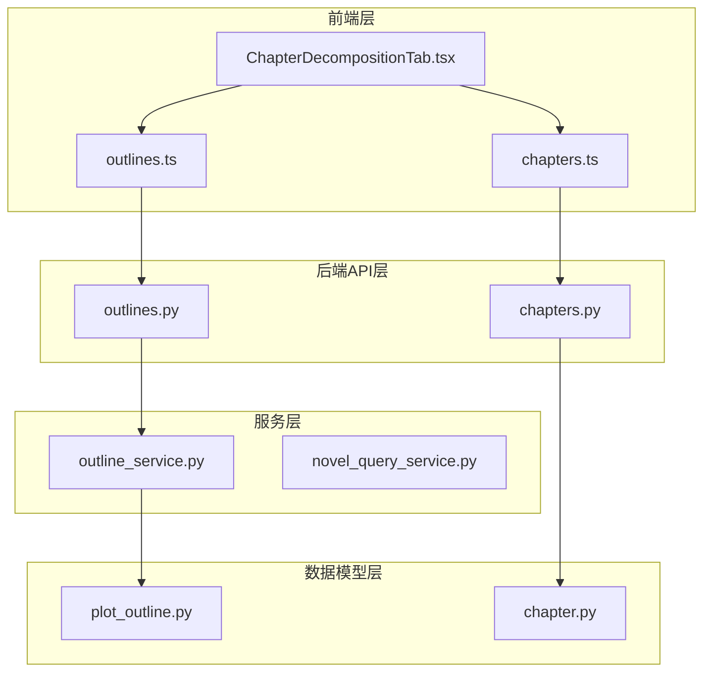
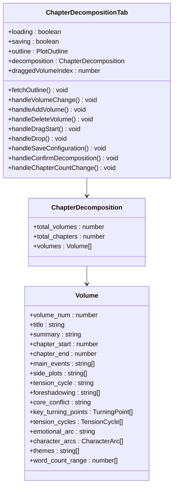
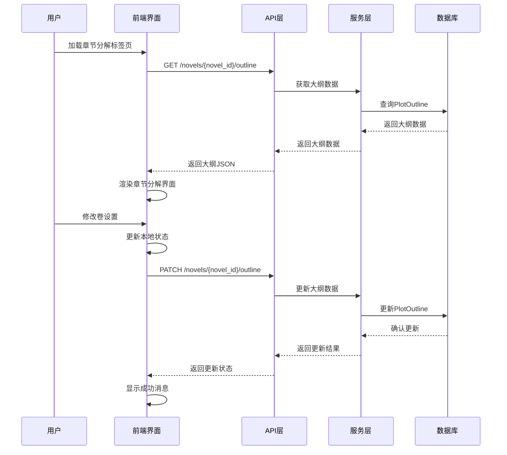
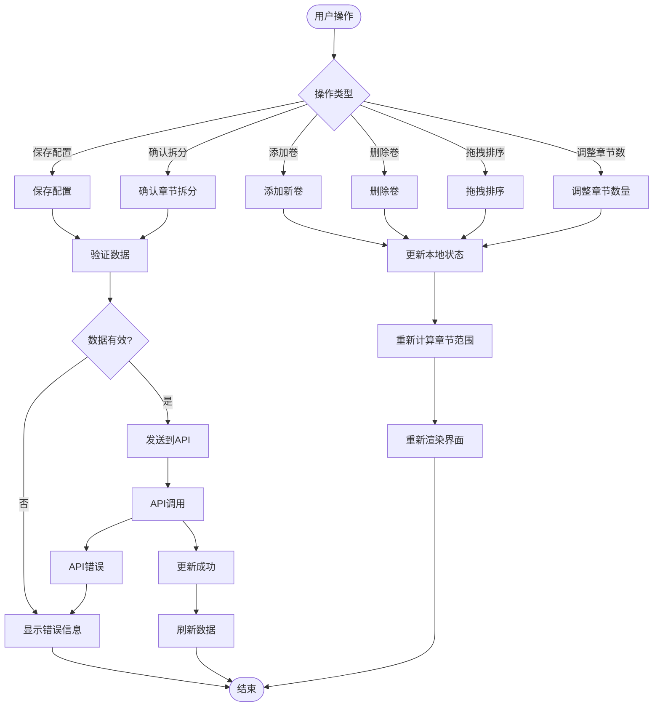
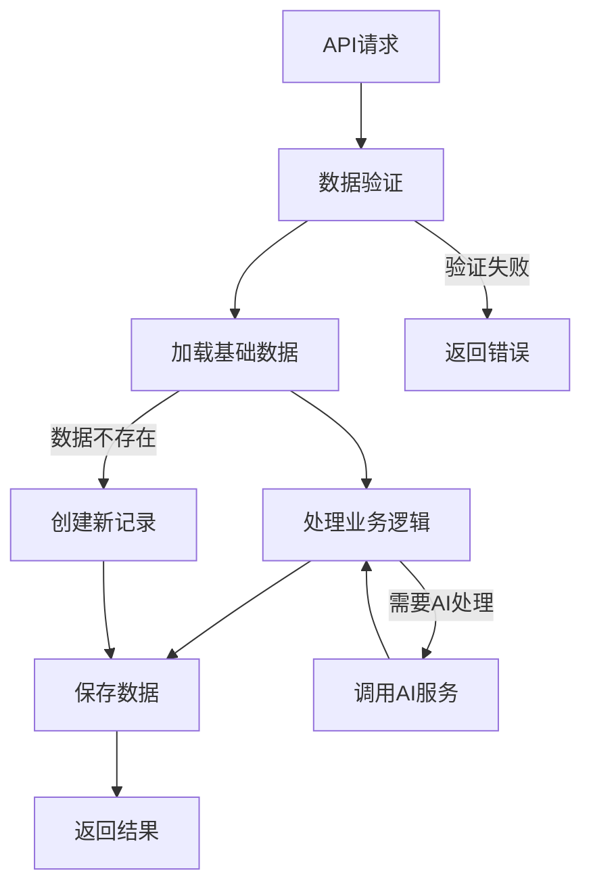
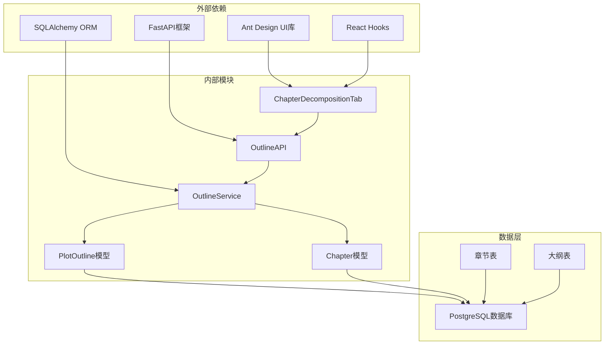

# 章节分解标签页

<cite>
**本文档引用的文件**
- [ChapterDecompositionTab.tsx](file://frontend/src/pages/NovelDetail/ChapterDecompositionTab.tsx)
- [outlines.ts](file://frontend/src/api/outlines.ts)
- [chapters.ts](file://frontend/src/api/chapters.ts)
- [outlines.py](file://backend/api/v1/outlines.py)
- [chapters.py](file://backend/api/v1/chapters.py)
- [outline.py](file://backend/schemas/outline.py)
- [plot_outline.py](file://core/models/plot_outline.py)
- [chapter.py](file://core/models/chapter.py)
- [outline_service.py](file://backend/services/outline_service.py)
- [novel_query_service.py](file://backend/services/novel_query_service.py)
- [ChaptersTab.tsx](file://frontend/src/pages/NovelDetail/ChaptersTab.tsx)
</cite>

## 目录
1. [简介](#简介)
2. [项目结构](#项目结构)
3. [核心组件](#核心组件)
4. [架构概览](#架构概览)
5. [详细组件分析](#详细组件分析)
6. [依赖关系分析](#依赖关系分析)
7. [性能考虑](#性能考虑)
8. [故障排除指南](#故障排除指南)
9. [结论](#结论)

## 简介

章节分解标签页是小说创作系统中的核心功能模块，它允许作者对小说的大纲进行可视化管理和调整。该功能提供了直观的界面来管理小说的卷结构、章节分配、张力循环、主题设置等关键创作要素。

该标签页实现了完整的章节拆分工作流，从大纲数据的加载、编辑、验证到最终的确认和持久化。系统支持拖拽排序、动态调整章节数量、批量操作等功能，为作者提供了一个专业级的小说创作工具。

## 项目结构

章节分解功能涉及前端界面、API接口、业务逻辑和服务层等多个层面的协作：



**图表来源**
- [ChapterDecompositionTab.tsx:1-783](file://frontend/src/pages/NovelDetail/ChapterDecompositionTab.tsx#L1-L783)
- [outlines.py:1-800](file://backend/api/v1/outlines.py#L1-L800)

**章节来源**
- [ChapterDecompositionTab.tsx:1-783](file://frontend/src/pages/NovelDetail/ChapterDecompositionTab.tsx#L1-L783)
- [outlines.py:1-800](file://backend/api/v1/outlines.py#L1-L800)

## 核心组件

章节分解标签页由多个核心组件构成，每个组件都有明确的职责和功能：

### 前端组件架构



**图表来源**
- [ChapterDecompositionTab.tsx:31-70](file://frontend/src/pages/NovelDetail/ChapterDecompositionTab.tsx#L31-L70)

### 数据模型定义

系统使用增强的卷信息模型来存储详细的章节分解数据：

| 字段名 | 类型 | 描述 | 默认值 |
|--------|------|------|--------|
| number | int | 卷号 | - |
| title | str | 卷标题 | "" |
| summary | str | 卷概要 | None |
| chapters | list[int] | 章节范围 [start, end] | [] |
| core_conflict | str | 核心冲突 | None |
| main_events | list | 主线事件列表 | None |
| key_turning_points | list | 关键转折点列表 | None |
| tension_cycles | list | 张力循环列表 | None |
| emotional_arc | str | 情感弧线 | None |
| character_arcs | list | 角色发展弧线 | None |
| side_plots | list | 支线情节列表 | None |
| foreshadowing | list | 伏笔分配列表 | None |
| themes | list | 主题列表 | None |
| word_count_range | list[int] | 字数范围 [min, max] | None |

**章节来源**
- [outline.py:73-127](file://backend/schemas/outline.py#L73-L127)
- [plot_outline.py:17-72](file://core/models/plot_outline.py#L17-L72)

## 架构概览

章节分解系统采用前后端分离的架构设计，实现了完整的数据流和控制流程：



**图表来源**
- [outlines.py:122-201](file://backend/api/v1/outlines.py#L122-L201)
- [ChapterDecompositionTab.tsx:89-156](file://frontend/src/pages/NovelDetail/ChapterDecompositionTab.tsx#L89-L156)

## 详细组件分析

### 前端界面组件

章节分解标签页实现了高度交互式的用户界面，提供了丰富的编辑功能：

#### 卷管理功能

系统支持动态的卷管理操作：

1. **添加卷**：用户可以随时添加新的卷，系统会自动分配默认的章节范围
2. **删除卷**：至少保留一个卷，防止数据丢失
3. **拖拽排序**：支持通过拖拽调整卷的顺序
4. **章节数量调整**：每卷的章节数量可以在5-20之间调整

#### 数据绑定和验证



**图表来源**
- [ChapterDecompositionTab.tsx:190-250](file://frontend/src/pages/NovelDetail/ChapterDecompositionTab.tsx#L190-L250)
- [ChapterDecompositionTab.tsx:296-368](file://frontend/src/pages/NovelDetail/ChapterDecompositionTab.tsx#L296-L368)

#### 张力循环管理

系统提供了专门的张力循环选择器，支持四种不同的张力模式：

| 张力模式 | 颜色 | 描述 |
|----------|------|------|
| rising | 绿色 | 上升 - 冲突逐渐升级 |
| climax | 红色 | 高潮 - 冲突达到顶峰 |
| falling | 橙色 | 下降 - 冲突逐步缓解 |
| flat | 蓝色 | 平稳 - 缓慢发展 |

**章节来源**
- [ChapterDecompositionTab.tsx:752-782](file://frontend/src/pages/NovelDetail/ChapterDecompositionTab.tsx#L752-L782)

### 后端API接口

后端提供了完整的API接口来支持章节分解功能：

#### 大纲管理API

```mermaid
classDiagram
class OutlineAPI {
+GET /novels/{novel_id}/outline
+PATCH /novels/{novel_id}/outline
+POST /novels/{novel_id}/outline/generate
+POST /novels/{novel_id}/outline/decompose
+GET /novels/{novel_id}/outline/versions
+POST /novels/{novel_id}/outline/ai-assist
}
class ChapterAPI {
+GET /novels/{novel_id}/chapters
+GET /novels/{novel_id}/chapters/{chapter_number}
+PATCH /novels/{novel_id}/chapters/{chapter_number}
+DELETE /novels/{novel_id}/chapters/{chapter_number}
+POST /novels/{novel_id}/chapters/batch-delete
}
OutlineAPI --> OutlineService
ChapterAPI --> ChapterService
```

**图表来源**
- [outlines.py:27-45](file://backend/api/v1/outlines.py#L27-L45)
- [chapters.py:27-27](file://backend/api/v1/chapters.py#L27-L27)

#### 数据验证和处理

后端API实现了严格的数据验证和处理机制：

1. **小说存在性验证**：所有操作都首先验证小说是否存在
2. **数据格式标准化**：确保返回的数据格式一致
3. **错误处理**：提供详细的错误信息和状态码
4. **事务处理**：保证数据操作的原子性和一致性

**章节来源**
- [outlines.py:122-201](file://backend/api/v1/outlines.py#L122-L201)
- [chapters.py:30-80](file://backend/api/v1/chapters.py#L30-L80)

### 服务层逻辑

服务层负责协调各个组件的工作，实现复杂的业务逻辑：

#### 大纲服务功能



**图表来源**
- [outline_service.py:28-43](file://backend/services/outline_service.py#L28-L43)

#### 章节管理服务

服务层提供了完整的章节管理功能：

1. **章节列表查询**：支持分页、筛选和排序
2. **章节内容管理**：支持创建、更新、删除章节
3. **批量操作**：支持批量删除章节
4. **统计信息**：自动维护小说的统计信息

**章节来源**
- [outline_service.py:44-114](file://backend/services/outline_service.py#L44-L114)
- [chapters.py:30-80](file://backend/api/v1/chapters.py#L30-L80)

## 依赖关系分析

章节分解系统涉及多个层次的依赖关系：



**图表来源**
- [ChapterDecompositionTab.tsx:1-28](file://frontend/src/pages/NovelDetail/ChapterDecompositionTab.tsx#L1-L28)
- [outlines.py:10-43](file://backend/api/v1/outlines.py#L10-L43)

### 前端依赖

前端组件依赖于多个现代化的开发工具和技术栈：

| 依赖项 | 版本 | 用途 |
|--------|------|------|
| react | ^18.2.0 | 核心框架 |
| antd | ^5.12.0 | UI组件库 |
| @ant-design/icons | ^5.2.0 | 图标库 |
| typescript | ^5.0.0 | 类型系统 |

### 后端依赖

后端服务使用了现代Python Web开发的最佳实践：

| 依赖项 | 版本 | 用途 |
|--------|------|------|
| fastapi | ^0.104.0 | Web框架 |
| sqlalchemy | ^2.0.0 | ORM框架 |
| asyncpg | ^0.29.0 | PostgreSQL驱动 |
| pydantic | ^2.5.0 | 数据验证 |

**章节来源**
- [ChapterDecompositionTab.tsx:1-28](file://frontend/src/pages/NovelDetail/ChapterDecompositionTab.tsx#L1-L28)
- [outlines.py:10-43](file://backend/api/v1/outlines.py#L10-L43)

## 性能考虑

章节分解系统在设计时充分考虑了性能优化：

### 前端性能优化

1. **状态管理优化**：使用React的useCallback和useMemo避免不必要的重渲染
2. **懒加载**：只在需要时加载和渲染数据
3. **虚拟滚动**：对于大量数据的场景使用虚拟滚动技术
4. **缓存策略**：合理使用浏览器缓存减少网络请求

### 后端性能优化

1. **数据库索引**：为常用查询字段建立适当的索引
2. **连接池**：使用连接池管理数据库连接
3. **异步处理**：使用异步I/O提高并发处理能力
4. **查询优化**：优化复杂查询语句，避免N+1查询问题

### 数据传输优化

1. **数据压缩**：对大数据量进行压缩传输
2. **分页加载**：支持分页加载大量数据
3. **增量更新**：只传输变化的数据部分

## 故障排除指南

### 常见问题和解决方案

#### 数据加载失败

**症状**：页面显示加载失败或空白

**可能原因**：
1. 网络连接问题
2. API服务器不可用
3. 数据库连接异常
4. 权限不足

**解决方案**：
1. 检查网络连接状态
2. 验证API服务是否正常运行
3. 查看服务器日志获取详细错误信息
4. 确认用户权限和认证状态

#### 数据保存失败

**症状**：点击保存按钮后没有反应或显示错误

**可能原因**：
1. 数据格式不正确
2. 服务器验证失败
3. 数据库写入异常
4. 并发冲突

**解决方案**：
1. 检查必填字段是否完整
2. 验证数据格式是否符合要求
3. 查看具体的错误消息
4. 重新尝试操作或刷新页面

#### 章节排序问题

**症状**：拖拽排序后章节范围计算错误

**可能原因**：
1. 状态更新顺序问题
2. 计算逻辑错误
3. 事件处理冲突

**解决方案**：
1. 重新拖拽排序
2. 手动调整章节范围
3. 检查浏览器控制台是否有JavaScript错误
4. 刷新页面重新加载数据

### 调试技巧

1. **浏览器开发者工具**：使用Network面板查看API请求和响应
2. **服务器日志**：查看后端日志获取详细错误信息
3. **数据库查询**：使用数据库客户端查看实际数据状态
4. **单元测试**：编写测试用例验证核心功能

**章节来源**
- [ChapterDecompositionTab.tsx:150-155](file://frontend/src/pages/NovelDetail/ChapterDecompositionTab.tsx#L150-L155)
- [outlines.py:174-200](file://backend/api/v1/outlines.py#L174-L200)

## 结论

章节分解标签页是小说创作系统中的重要功能模块，它提供了专业级的小说创作工具。该系统通过前后端分离的设计、完善的API接口、强大的服务层逻辑和健壮的数据模型，为作者提供了一个高效、易用的小说创作环境。

系统的主要优势包括：

1. **用户体验优秀**：直观的界面设计和流畅的交互体验
2. **功能完整**：涵盖了小说创作的各个方面
3. **扩展性强**：模块化的架构便于功能扩展
4. **性能优异**：优化的前后端实现确保良好的响应速度
5. **可靠性高**：完善的错误处理和数据验证机制

未来可以考虑的功能改进包括：
- 增加更多的模板和预设选项
- 支持更复杂的大纲结构
- 提供实时协作功能
- 增强AI辅助创作能力
- 优化移动端用户体验

通过持续的优化和改进，章节分解标签页将继续为小说创作者提供强有力的技术支持。