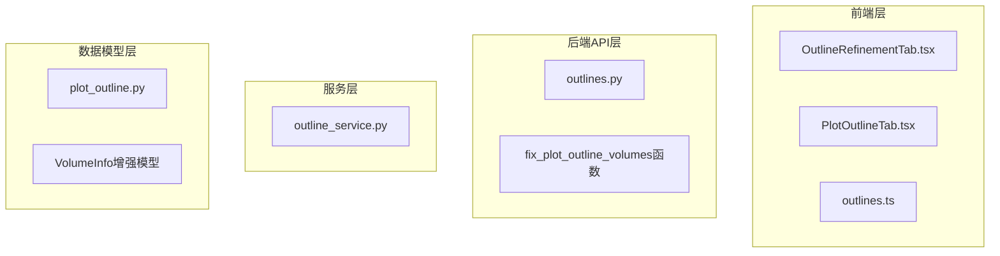
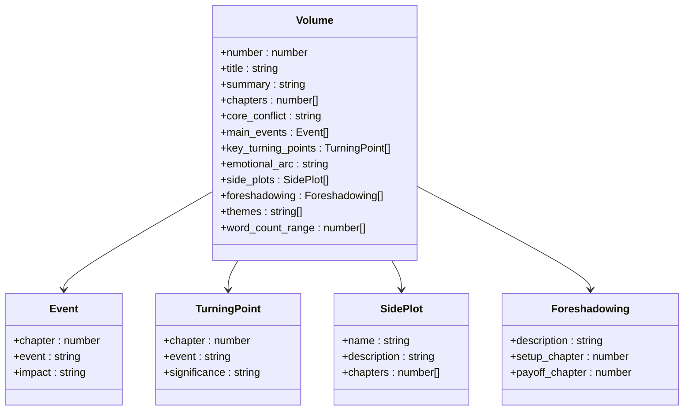
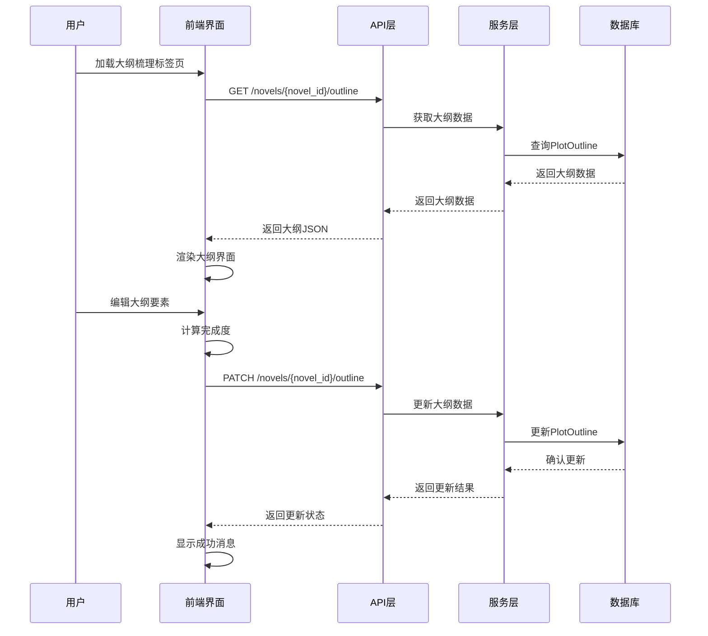
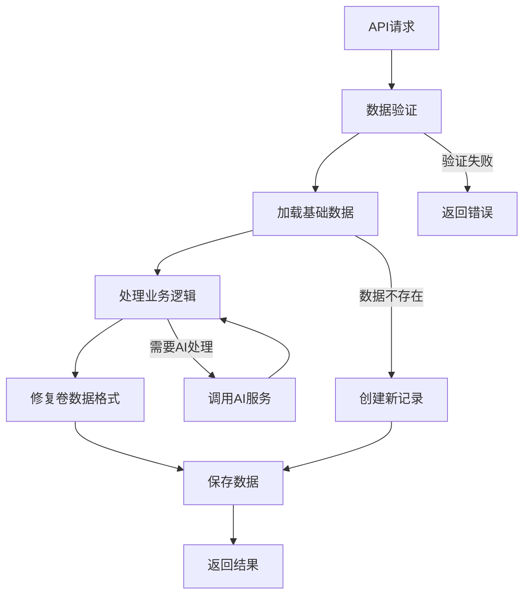
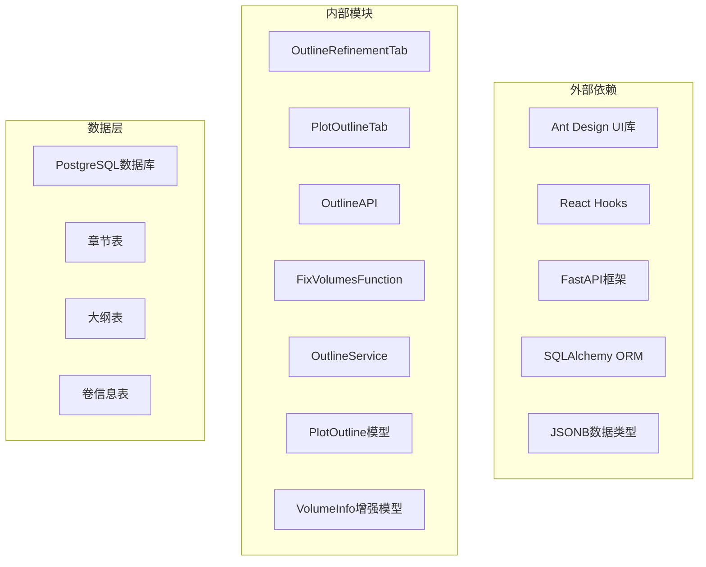

# 章节分解标签页

<cite>
**本文档引用的文件**
- [OutlineRefinementTab.tsx](file://frontend/src/pages/NovelDetail/OutlineRefinementTab.tsx)
- [PlotOutlineTab.tsx](file://frontend/src/pages/NovelDetail/PlotOutlineTab.tsx)
- [outlines.ts](file://frontend/src/api/outlines.ts)
- [outlines.py](file://backend/api/v1/outlines.py)
- [outline.py](file://backend/schemas/outline.py)
- [plot_outline.py](file://core/models/plot_outline.py)
- [outline_service.py](file://backend/services/outline_service.py)
</cite>

## 更新摘要
**所做更改**
- 移除了关于ChapterDecompositionTab组件的全部内容
- 更新了章节分解功能的实现方式，现在通过大纲梳理和智能完善功能实现
- 简化了UI架构，移除了手动章节分解、卷管理、拖拽排序等复杂功能
- 更新了API接口和数据模型的相关说明
- 移除了事件分布算法、伏笔智能分配等高级功能的描述

## 目录
1. [简介](#简介)
2. [项目结构](#项目结构)
3. [核心组件](#核心组件)
4. [架构概览](#架构概览)
5. [详细组件分析](#详细组件分析)
6. [大纲梳理功能](#大纲梳理功能)
7. [智能完善功能](#智能完善功能)
8. [依赖关系分析](#依赖关系分析)
9. [性能考虑](#性能考虑)
10. [故障排除指南](#故障排除指南)
11. [结论](#结论)

## 简介

章节分解功能经过重大简化后，现已成为小说创作系统中的核心大纲管理模块。系统通过大纲梳理和智能完善两大功能，为作者提供了一个更加简洁高效的创作环境。虽然移除了复杂的手动章节分解功能，但通过AI辅助和智能算法，依然能够为作者提供高质量的大纲创作体验。

系统实现了从大纲生成、编辑、验证到最终确认的完整工作流，支持卷章结构的智能展示和版本管理。新的架构更加注重用户体验和创作效率，减少了学习成本和操作复杂度。

## 项目结构

章节分解功能现在通过简化的架构实现，主要涉及前端大纲界面、API接口、业务逻辑和服务层的协作：



**图表来源**
- [OutlineRefinementTab.tsx:1-680](file://frontend/src/pages/NovelDetail/OutlineRefinementTab.tsx#L1-L680)
- [PlotOutlineTab.tsx:1-237](file://frontend/src/pages/NovelDetail/PlotOutlineTab.tsx#L1-L237)
- [outlines.py:120-208](file://backend/api/v1/outlines.py#L120-L208)

## 核心组件

章节分解功能现在由两个核心组件构成，每个组件都有明确的职责和功能：

### 简化的卷信息模型

系统使用简化的卷信息模型来存储大纲数据，支持基本的创作要素：



**图表来源**
- [outline.py:67-127](file://backend/schemas/outline.py#L67-L127)
- [plot_outline.py:13-81](file://core/models/plot_outline.py#L13-L81)

### 简化的数据模型定义

系统使用简化的卷信息模型来存储大纲数据：

| 字段名 | 类型 | 描述 | 默认值 |
|--------|------|------|--------|
| number | int | 卷号 | - |
| title | str | 卷标题 | "" |
| summary | str | 卷概要 | None |
| chapters | list[int] | 章节范围 [start, end] | [] |
| core_conflict | str | 核心冲突 | None |
| main_events | list[Event] | 主线事件列表 | None |
| key_turning_points | list[TurningPoint] | 关键转折点列表 | None |
| emotional_arc | str | 情感弧线 | None |
| side_plots | list[SidePlot] | 支线情节列表 | None |
| foreshadowing | list[Foreshadowing] | 伏笔分配列表 | None |
| themes | list[str] | 主题列表 | None |
| word_count_range | list[int] | 字数范围 [min, max] | None |

**章节来源**
- [outline.py:67-127](file://backend/schemas/outline.py#L67-L127)
- [plot_outline.py:13-81](file://core/models/plot_outline.py#L13-L81)

## 架构概览

章节分解系统采用简化的前后端分离架构设计，专注于核心的大纲管理功能：



**图表来源**
- [outlines.py:165-208](file://backend/api/v1/outlines.py#L165-L208)
- [OutlineRefinementTab.tsx:278-305](file://frontend/src/pages/NovelDetail/OutlineRefinementTab.tsx#L278-L305)

## 详细组件分析

### 简化的前端界面组件

章节分解功能现在通过两个核心组件实现，提供了更加简洁的用户界面：

#### 大纲梳理界面

系统提供了专门的大纲梳理界面，支持主线剧情要素的编辑和AI辅助：

1. **主线剧情编辑**：支持核心冲突、主角目标、反派阻碍等要素的编辑
2. **AI辅助生成**：提供智能建议生成功能
3. **完成度计算**：实时计算大纲完成度百分比
4. **智能完善**：支持离线任务的大纲智能完善功能

#### 卷章结构展示

系统提供了卷章结构的可视化展示功能：

1. **卷结构树形展示**：以树形结构展示卷章层级关系
2. **详细信息展示**：支持卷概要、主线事件、转折点等详细信息的查看
3. **版本历史管理**：提供大纲版本历史的查看和管理功能

### 简化的后端API接口

后端API接口现在专注于核心的大纲管理功能：

#### 大纲管理API

```mermaid
classDiagram
class OutlineAPI {
+GET /novels/{novel_id}/outline
+PATCH /novels/{novel_id}/outline
+POST /novels/{novel_id}/outline/generate
+POST /novels/{novel_id}/outline/enhance-preview
+POST /novels/{novel_id}/outline/ai-assist
+GET /novels/{novel_id}/outline/versions
}
class FixVolumesFunction {
+fix_plot_outline_volumes(plot_outline) PlotOutline
+确保每个卷都有number字段
+修复数据格式兼容性
}
OutlineAPI --> FixVolumesFunction
OutlineAPI --> OutlineService
```

**图表来源**
- [outlines.py:120-208](file://backend/api/v1/outlines.py#L120-L208)
- [outlines.py:204-206](file://backend/api/v1/outlines.py#L204-L206)

#### 数据验证和处理

后端API实现了简化的数据验证和处理机制：

1. **小说存在性验证**：所有操作都首先验证小说是否存在
2. **数据格式标准化**：确保返回的数据格式一致
3. **智能数据修复**：自动修复缺失的卷号字段
4. **错误处理**：提供详细的错误信息和状态码
5. **事务处理**：保证数据操作的原子性和一致性

### 简化的服务层逻辑

服务层现在专注于核心的大纲管理业务逻辑：

#### 大纲服务功能



**图表来源**
- [outline_service.py:28-43](file://backend/services/outline_service.py#L28-L43)

## 大纲梳理功能

大纲梳理功能是章节分解系统的核心组成部分，提供了简化的创作工具：

### 主线剧情要素管理

系统支持对主线剧情的各个要素进行编辑和管理：

- **核心冲突**：描述故事的主要矛盾和冲突
- **主角目标**：主角想要达成的目标
- **反派阻碍**：反派角色或主要阻碍
- **升级路径**：力量体系或成长路径
- **情感弧光**：主角的情感变化历程
- **关键揭示**：故事中的重要揭示和转折
- **角色成长**：角色的成长和变化
- **结局描述**：故事的结局

### AI辅助创作

系统提供了强大的AI辅助创作功能：

1. **智能建议生成**：基于当前大纲内容提供精准的建议
2. **上下文感知**：AI会根据已有的大纲要素提供相关建议
3. **置信度评估**：显示建议的置信度和备选方案
4. **生成理由**：解释AI建议的生成逻辑

### 完成度监控

系统实时计算和显示大纲完成度：

- **字段统计**：统计已完成的大纲要素数量
- **百分比显示**：以进度条形式显示完成度
- **颜色指示**：不同完成度对应不同的颜色
- **智能提示**：根据完成度提供相应的操作建议

**章节来源**
- [OutlineRefinementTab.tsx:37-63](file://frontend/src/pages/NovelDetail/OutlineRefinementTab.tsx#L37-L63)
- [OutlineRefinementTab.tsx:320-359](file://frontend/src/pages/NovelDetail/OutlineRefinementTab.tsx#L320-L359)

## 智能完善功能

智能完善功能是章节分解系统的重要特色，提供了离线任务的大纲智能完善能力：

### 离线任务处理

系统支持创建离线任务来处理复杂的大纲完善需求：

1. **任务创建**：用户可以创建大纲完善任务
2. **后台处理**：任务在后台异步处理，不影响用户操作
3. **进度跟踪**：用户可以随时查看任务进度
4. **结果通知**：任务完成后提供通知和结果查看

### 智能完善选项

系统提供了灵活的智能完善选项：

- **迭代次数**：控制完善算法的迭代次数
- **质量阈值**：设置大纲质量的最低标准
- **编辑保留**：决定是否保留用户的手动编辑
- **数据库更新**：控制是否直接更新数据库

### 质量评估

系统提供详细的大纲质量评估报告：

- **总体评分**：对大纲的整体质量进行评分
- **维度分析**：分析大纲在各个维度的表现
- **优势识别**：识别大纲的优势点
- **改进建议**：提供具体的改进建议

**章节来源**
- [OutlineRefinementTab.tsx:418-487](file://frontend/src/pages/NovelDetail/OutlineRefinementTab.tsx#L418-L487)
- [outlines.py:747-800](file://backend/api/v1/outlines.py#L747-L800)

## 依赖关系分析

章节分解系统现在具有简化的依赖关系：



**图表来源**
- [OutlineRefinementTab.tsx:1-36](file://frontend/src/pages/NovelDetail/OutlineRefinementTab.tsx#L1-L36)
- [outlines.py:204-206](file://backend/api/v1/outlines.py#L204-L206)

### 前端依赖

前端组件依赖于现代化的开发工具和技术栈：

| 依赖项 | 版本 | 用途 |
|--------|------|------|
| react | ^18.2.0 | 核心框架 |
| antd | ^5.12.0 | UI组件库 |
| @ant-design/icons | ^5.2.0 | 图标库 |
| typescript | ^5.0.0 | 类型系统 |

### 后端依赖

后端服务使用了现代Python Web开发的最佳实践：

| 依赖项 | 版本 | 用途 |
|--------|------|------|
| fastapi | ^0.104.0 | Web框架 |
| sqlalchemy | ^2.0.0 | ORM框架 |
| asyncpg | ^0.29.0 | PostgreSQL驱动 |
| pydantic | ^2.5.0 | 数据验证 |
| jsonb | 支持 | 增强的JSON数据类型 |

**章节来源**
- [OutlineRefinementTab.tsx:1-36](file://frontend/src/pages/NovelDetail/OutlineRefinementTab.tsx#L1-L36)
- [plot_outline.py:13-81](file://core/models/plot_outline.py#L13-L81)

## 性能考虑

章节分解系统在简化设计时充分考虑了性能优化：

### 前端性能优化

1. **状态管理优化**：使用React的useCallback和useMemo避免不必要的重渲染
2. **懒加载**：只在需要时加载和渲染数据
3. **虚拟滚动**：对于大量数据的场景使用虚拟滚动技术
4. **缓存策略**：合理使用浏览器缓存减少网络请求

### 后端性能优化

1. **数据库索引**：为常用查询字段建立适当的索引
2. **连接池**：使用连接池管理数据库连接
3. **异步处理**：使用异步I/O提高并发处理能力
4. **查询优化**：优化复杂查询语句，避免N+1查询问题
5. **JSONB优化**：利用PostgreSQL的JSONB类型进行高效的数据存储和查询

### 数据传输优化

1. **数据压缩**：对大数据量进行压缩传输
2. **分页加载**：支持分页加载大量数据
3. **增量更新**：只传输变化的数据部分
4. **智能修复**：自动修复数据格式，减少重复处理

## 故障排除指南

### 常见问题和解决方案

#### 数据加载失败

**症状**：页面显示加载失败或空白

**可能原因**：
1. 网络连接问题
2. API服务器不可用
3. 数据库连接异常
4. 权限不足
5. 卷信息格式不正确

**解决方案**：
1. 检查网络连接状态
2. 验证API服务是否正常运行
3. 查看服务器日志获取详细错误信息
4. 确认用户权限和认证状态
5. 检查卷信息的number字段是否正确

#### 数据保存失败

**症状**：点击保存按钮后没有反应或显示错误

**可能原因**：
1. 数据格式不正确
2. 服务器验证失败
3. 数据库写入异常
4. 并发冲突

**解决方案**：
1. 检查必填字段是否完整
2. 验证数据格式是否符合要求
3. 查看具体的错误消息
4. 重新尝试操作或刷新页面

#### AI辅助功能异常

**症状**：AI辅助功能无法正常工作

**可能原因**：
1. AI服务不可用
2. 上下文数据缺失
3. 网络连接问题
4. API调用频率限制

**解决方案**：
1. 检查AI服务的可用性
2. 确保有足够的上下文数据
3. 检查网络连接状态
4. 等待一段时间后重试

### 调试技巧

1. **浏览器开发者工具**：使用Network面板查看API请求和响应
2. **服务器日志**：查看后端日志获取详细错误信息
3. **数据库查询**：使用数据库客户端查看实际数据状态
4. **单元测试**：编写测试用例验证核心功能

**章节来源**
- [OutlineRefinementTab.tsx:278-305](file://frontend/src/pages/NovelDetail/OutlineRefinementTab.tsx#L278-L305)
- [outlines.py:165-208](file://backend/api/v1/outlines.py#L165-L208)

## 结论

章节分解功能经过重大简化后，已成为小说创作系统中更加专注和高效的大纲管理工具。系统通过简化的UI架构、核心的大纲梳理功能和智能完善能力，为作者提供了一个更加友好和实用的创作环境。

系统的主要优势包括：

1. **用户体验优秀**：简洁直观的界面设计，降低了学习成本
2. **功能专注**：专注于核心的大纲管理功能，避免了功能冗余
3. **AI辅助强大**：提供了智能的AI辅助创作能力
4. **性能优异**：简化的架构设计确保了良好的响应速度
5. **可靠性高**：完善的错误处理和数据验证机制
6. **扩展性强**：模块化的架构便于未来的功能扩展

经过简化的功能包括：
- 移除了复杂的手动章节分解功能
- 简化了卷管理和拖拽排序操作
- 移除了事件分布算法和伏笔智能分配
- 简化了API接口和数据模型
- 减少了前端组件的复杂度

未来可以考虑的功能改进包括：
- 增强AI辅助创作的能力
- 支持更多类型的大纲结构
- 提供实时协作功能
- 优化移动端用户体验
- 扩展智能完善算法的应用范围

通过持续的优化和改进，章节分解功能将继续为小说创作者提供强有力的技术支持，帮助作者创作出更加精彩的小说作品。