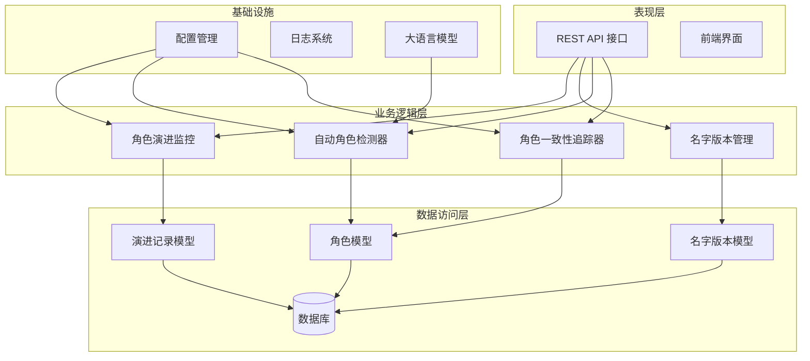
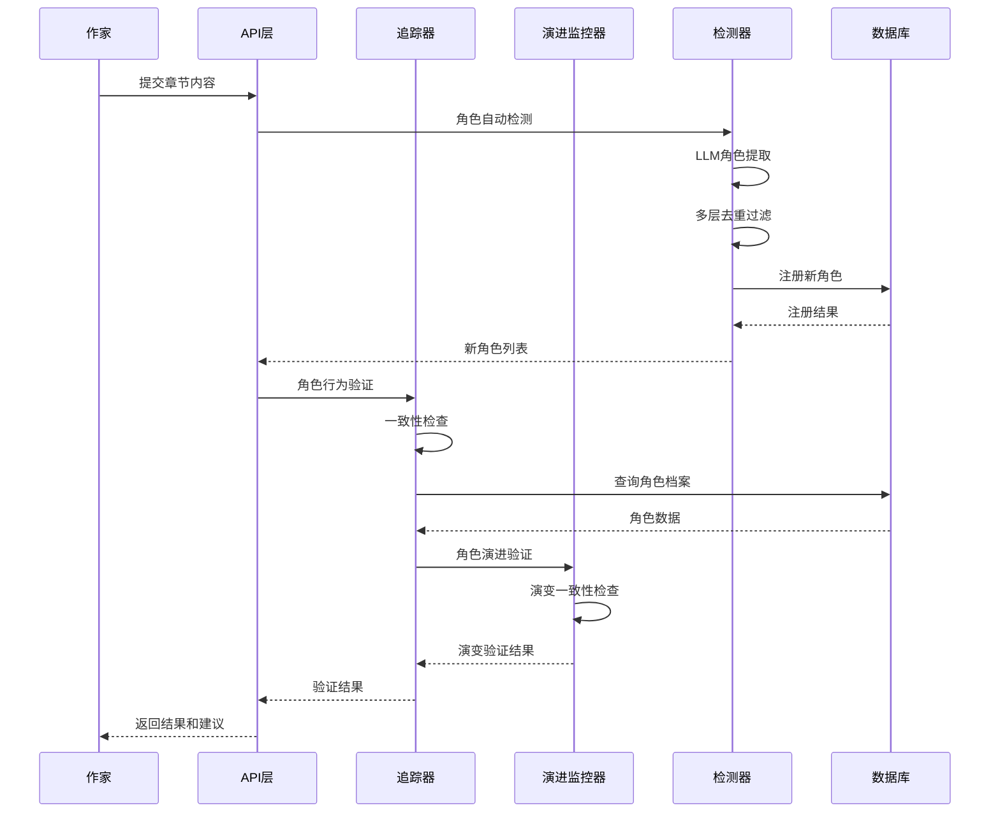
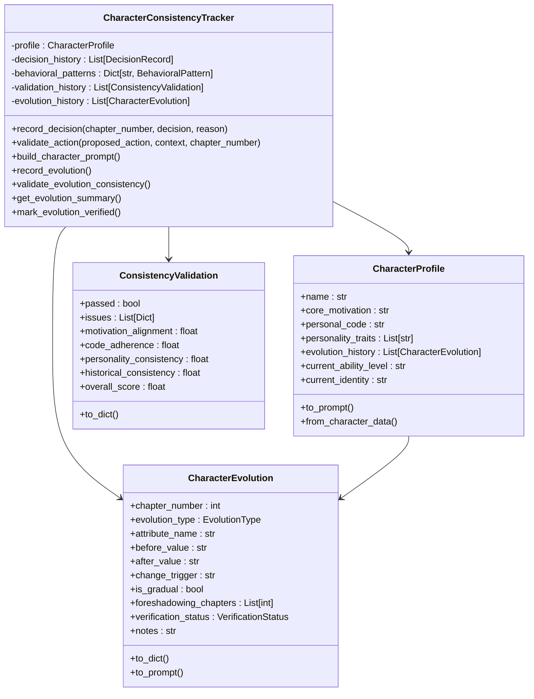
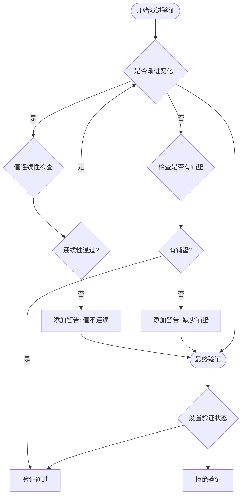
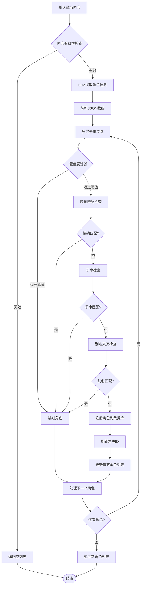
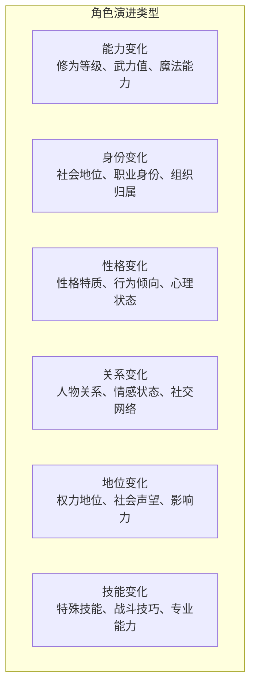
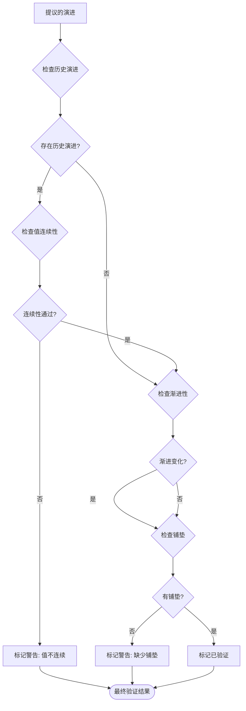
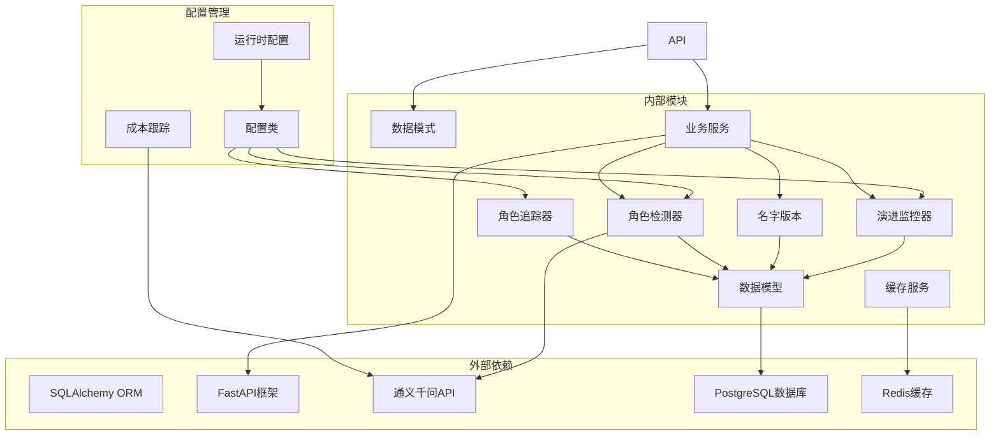

# 角色一致性追踪系统

<cite>
**本文档引用的文件**
- [character_consistency_tracker.py](file://agents/character_consistency_tracker.py)
- [character.py](file://core/models/character.py)
- [character_auto_detector.py](file://backend/services/character_auto_detector.py)
- [characters.py](file://backend/api/v1/characters.py)
- [character_name_version.py](file://core/models/character_name_version.py)
- [character.py](file://backend/schemas/character.py)
- [config.py](file://backend/config.py)
- [test_character_name_version.py](file://tests/test_character_name_version.py)
</cite>

## 更新摘要
**变更内容**
- 新增多维角色演进监控功能，支持能力、身份、性格、关系等多维度演进追踪
- 增强角色演变验证机制，包含渐进变化检测和铺垫验证
- 扩展角色档案结构，增加演进历史和当前状态字段
- 新增角色演变摘要生成和验证状态管理功能

## 目录
1. [简介](#简介)
2. [项目结构](#项目结构)
3. [核心组件](#核心组件)
4. [架构概览](#架构概览)
5. [详细组件分析](#详细组件分析)
6. [多维角色演进监控](#多维角色演进监控)
7. [依赖关系分析](#依赖关系分析)
8. [性能考量](#性能考量)
9. [故障排除指南](#故障排除指南)
10. [结论](#结论)

## 简介

角色一致性追踪系统是一个专为小说创作设计的智能角色管理系统，旨在确保角色行为在整个故事发展过程中的连贯性和一致性。该系统通过追踪角色的核心动机、行为准则、性格特质、历史决策以及角色演变轨迹，为作家提供实时的角色行为一致性验证和改进建议。

**系统核心价值**：
- **角色行为一致性验证**：实时检查角色行为是否符合其设定
- **多维角色演进监控**：追踪角色在能力、身份、性格、关系等方面的渐进变化
- **自动角色检测**：从章节内容中自动识别和注册新角色
- **关系网络管理**：维护复杂的人物关系图谱
- **名字版本控制**：确保角色名称变更的可追溯性

**新增功能亮点**：
- **演进轨迹追踪**：监控角色能力、身份、性格等方面的渐进变化
- **演进验证机制**：检测突兀变化（缺少铺垫）和前后矛盾
- **多维度演进类型**：支持能力变化、身份变化、性格变化、关系变化、地位变化、技能变化
- **演进状态管理**：跟踪演进验证状态（待验证、已验证、警告、拒绝）

## 项目结构

该系统采用模块化架构，主要分为以下几个核心层次：



**图表来源**
- [character_consistency_tracker.py:1-1064](file://agents/character_consistency_tracker.py#L1-L1064)
- [character_auto_detector.py:1-471](file://backend/services/character_auto_detector.py#L1-L471)
- [character.py:1-136](file://core/models/character.py#L1-L136)

**章节来源**
- [character_consistency_tracker.py:1-1064](file://agents/character_consistency_tracker.py#L1-L1064)
- [character.py:1-136](file://core/models/character.py#L1-L136)
- [character_auto_detector.py:1-471](file://backend/services/character_auto_detector.py#L1-L471)

## 核心组件

### 角色一致性追踪器

角色一致性追踪器是系统的核心组件，负责维护和验证角色的完整性设定。

**主要功能**：
- 维护角色档案（核心动机、行为准则、性格特质）
- 记录历史决策和行为模式
- 验证新行为的一致性
- 生成详细的分析报告和改进建议
- **新增**：记录和验证角色演进轨迹

**关键数据结构**：
- `CharacterProfile`：角色档案，包含核心设定和演进历史
- `CharacterEvolution`：角色演变记录，支持多维度演进追踪
- `ConsistencyValidation`：一致性验证结果

### 自动角色检测器

从章节内容中自动识别和注册新角色，确保角色库的完整性和准确性。

**核心特性**：
- 多层去重过滤（精确匹配、子串包含、别名交叉检查）
- 置信度阈值控制
- 批量角色注册
- 数据库竞态条件防护

### 名字版本管理系统

维护角色名称变更的历史记录，确保名称变更的可追溯性和一致性。

**功能特性**：
- 版本记录创建和管理
- 版本历史查询和对比
- 版本回溯和恢复
- 名称变更验证

**章节来源**
- [character_consistency_tracker.py:306-1064](file://agents/character_consistency_tracker.py#L306-L1064)
- [character_auto_detector.py:24-471](file://backend/services/character_auto_detector.py#L24-L471)
- [character_name_version.py:35-203](file://core/models/character_name_version.py#L35-L203)

## 架构概览

系统采用分层架构设计，确保各组件职责清晰、耦合度低：



**图表来源**
- [character_consistency_tracker.py:447-538](file://agents/character_consistency_tracker.py#L447-L538)
- [character_auto_detector.py:45-117](file://backend/services/character_auto_detector.py#L45-L117)

**章节来源**
- [characters.py:1-552](file://backend/api/v1/characters.py#L1-L552)
- [config.py:282-287](file://backend/config.py#L282-L287)

## 详细组件分析

### 角色一致性追踪器类图



**图表来源**
- [character_consistency_tracker.py:117-304](file://agents/character_consistency_tracker.py#L117-L304)

### 角色演进验证流程



**图表来源**
- [character_consistency_tracker.py:886-957](file://agents/character_consistency_tracker.py#L886-L957)

### 自动角色检测流程



**图表来源**
- [character_auto_detector.py:174-363](file://backend/services/character_auto_detector.py#L174-L363)

**章节来源**
- [character_consistency_tracker.py:886-957](file://agents/character_consistency_tracker.py#L886-L957)
- [character_auto_detector.py:174-363](file://backend/services/character_auto_detector.py#L174-L363)

### API接口设计

系统提供RESTful API接口，支持角色的完整生命周期管理：

```mermaid
graph LR
subgraph "角色管理API"
GET_LIST[GET /characters<br/>获取角色列表]
GET_DETAIL[GET /characters/{id}<br/>获取角色详情]
CREATE_ROLE[POST /characters<br/>创建角色]
UPDATE_ROLE[PATCH /characters/{id}<br/>更新角色]
DELETE_ROLE[DELETE /characters/{id}<br/>删除角色]
end
subgraph "关系管理API"
GET_RELATION[GET /characters/{id}/relationships<br/>获取关系图]
NAME_VERSION[角色名字版本API]
end
subgraph "辅助功能API"
DETECT_CHAR[POST /chapters/{id}/detect-characters<br/>自动检测角色]
CONSISTENCY[POST /characters/{id}/validate-consistency<br/>验证一致性]
EVOLUTION[POST /characters/{id}/validate-evolution<br/>验证演进一致性]
EVO_SUMMARY[GET /characters/{id}/evolution-summary<br/>获取演进摘要]
end
```

**图表来源**
- [characters.py:102-360](file://backend/api/v1/characters.py#L102-L360)

**章节来源**
- [characters.py:102-360](file://backend/api/v1/characters.py#L102-L360)

## 多维角色演进监控

### 角色演进类型系统

系统支持六种主要的演进类型，每种类型都有特定的验证规则和监控重点：



**演进验证状态**：
- **待验证（PENDING）**：演进记录已创建但尚未验证
- **已验证（VERIFIED）**：演进有充足铺垫，验证通过
- **警告（WARNING）**：演进缺少铺垫，需要关注
- **拒绝（REJECTED）**：演进前后矛盾，验证失败

### 演进记录管理

每个角色演进记录包含以下关键信息：

- **章节信息**：演进发生的章节编号
- **演进类型**：具体的演进类别
- **属性名称**：演进的具体属性（如"修为等级"、"身份"）
- **值范围**：变化前后的具体数值
- **变化触发**：导致演进的原因事件
- **渐进性**：是否为渐进变化
- **铺垫章节**：包含演进铺垫的章节列表
- **验证状态**：当前的验证状态
- **备注信息**：额外的说明信息

### 演进验证算法

系统采用多层次验证机制确保演进的合理性：



**章节来源**
- [character_consistency_tracker.py:42-115](file://agents/character_consistency_tracker.py#L42-L115)
- [character_consistency_tracker.py:784-1001](file://agents/character_consistency_tracker.py#L784-L1001)

## 依赖关系分析

系统采用松耦合设计，各组件间依赖关系清晰：



**图表来源**
- [character_consistency_tracker.py:14-20](file://agents/character_consistency_tracker.py#L14-L20)
- [character_auto_detector.py:15-22](file://backend/services/character_auto_detector.py#L15-L22)

**章节来源**
- [config.py:48-514](file://backend/config.py#L48-L514)

## 性能考量

系统在设计时充分考虑了性能优化：

### 缓存策略
- **角色关系缓存**：利用Redis缓存角色关系图数据
- **查询结果缓存**：对频繁查询的结果进行缓存
- **配置信息缓存**：使用LRU缓存减少配置读取开销
- **演进历史缓存**：缓存角色演进摘要和统计信息

### 异步处理
- **批量操作**：支持批量角色注册和更新
- **异步数据库操作**：使用async/await提高并发性能
- **后台任务**：将耗时的分析任务放入队列处理
- **演进验证异步化**：支持异步演进验证和状态更新

### 数据库优化
- **索引优化**：为常用查询字段建立索引
- **连接池管理**：合理配置数据库连接池大小
- **查询优化**：使用高效的SQL查询和分页
- **演进历史分区**：按章节范围分区存储演进记录

## 故障排除指南

### 常见问题及解决方案

**角色检测失败**
- 检查LLM API密钥配置
- 验证章节内容长度限制
- 确认置信度阈值设置合理

**角色一致性验证错误**
- 检查角色档案数据完整性
- 验证历史决策记录
- 确认演进轨迹的连续性

**角色演进验证失败**
- 检查演进记录的值连续性
- 验证演进是否有足够的铺垫
- 确认演进类型与属性匹配

**数据库连接问题**
- 检查数据库URL配置
- 验证网络连接状态
- 确认数据库服务可用性

**性能问题**
- 监控数据库查询性能
- 检查缓存命中率
- 优化索引配置

**章节来源**
- [test_character_name_version.py:148-227](file://tests/test_character_name_version.py#L148-L227)

## 结论

角色一致性追踪系统通过智能化的角色管理机制，为小说创作提供了强有力的技术支撑。系统的主要优势包括：

1. **全面的角色管理**：从角色创建到演进的全生命周期管理
2. **智能验证机制**：基于AI的自动一致性检查和演进验证
3. **多维演进监控**：支持能力、身份、性格、关系等多维度演进追踪
4. **灵活的扩展性**：模块化设计便于功能扩展
5. **高可靠性**：完善的错误处理和故障恢复机制
6. **良好的用户体验**：直观的API接口和详细的反馈信息

**新增功能价值**：
- **演进轨迹可视化**：通过演进摘要展示角色的发展历程
- **铺垫提醒机制**：自动检测演进的铺垫情况并提供改进建议
- **状态管理**：跟踪演进验证状态，确保故事逻辑的连贯性
- **多维度分析**：从六个维度全面监控角色的演进情况

该系统不仅能够帮助作家保持角色行为的一致性，还能通过演进轨迹追踪和关系网络分析，为故事创作提供深度洞察。随着多维角色演进监控功能的不断完善和技术的持续优化，该系统将成为小说创作领域的重要工具，为作家提供更加智能和全面的角色管理支持。