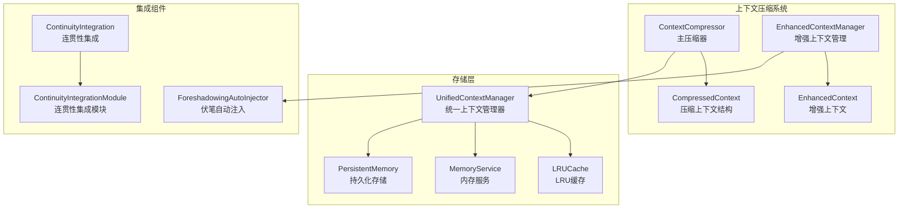
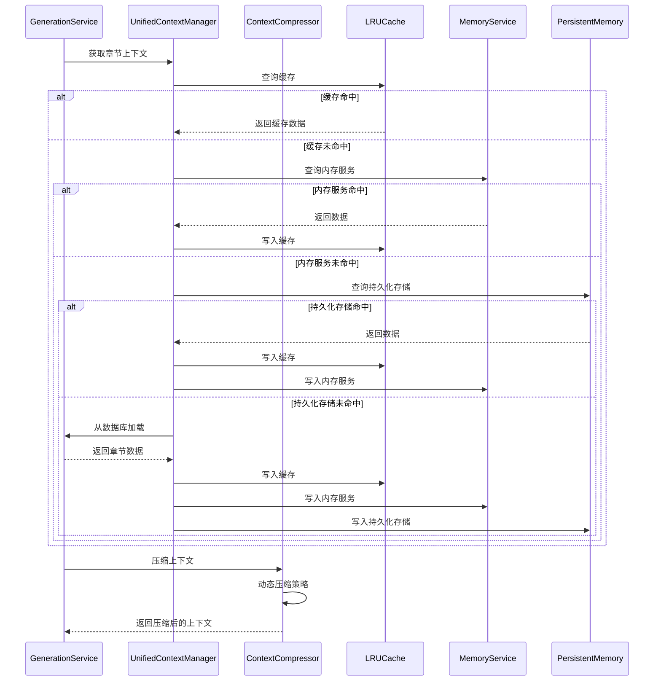
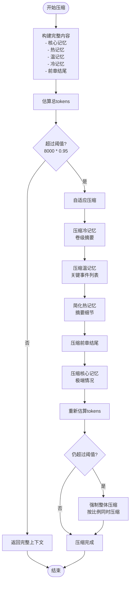
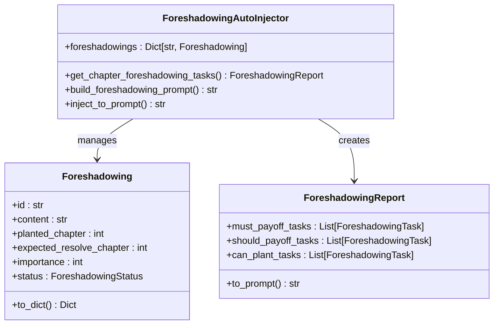
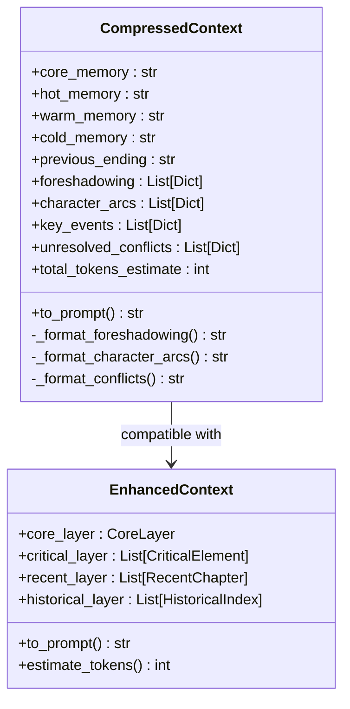
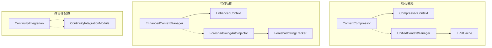

# Context Compressor 上下文压缩器

<cite>
**本文档引用的文件**
- [context_compressor.py](file://agents/context_compressor.py)
- [enhanced_context_manager.py](file://agents/enhanced_context_manager.py)
- [context_manager.py](file://backend/services/context_manager.py)
- [continuity_integration.py](file://agents/continuity_integration.py)
- [continuity_integration_module.py](file://agents/continuity_integration_module.py)
- [foreshadowing_auto_injector.py](file://agents/foreshadowing_auto_injector.py)
- [foreshadowing_tracker.py](file://agents/foreshadowing_tracker.py)
- [test_context_compression_enhancement.py](file://tests/agents/test_context_compression_enhancement.py)
</cite>

## 目录
1. [简介](#简介)
2. [项目结构](#项目结构)
3. [核心组件](#核心组件)
4. [架构概览](#架构概览)
5. [详细组件分析](#详细组件分析)
6. [依赖关系分析](#依赖关系分析)
7. [性能考虑](#性能考虑)
8. [故障排除指南](#故障排除指南)
9. [结论](#结论)

## 简介

Context Compressor 是小说创作AI系统中的核心组件，专门解决长篇小说创作过程中上下文膨胀的问题。该系统采用分层记忆架构，将上下文保持在恒定的8000 tokens左右，确保AI在生成章节时能够高效地访问关键信息而不受内存限制的影响。

系统的核心创新包括：
- **四层记忆架构**：热记忆、温记忆、冷记忆和核心记忆
- **动态压缩策略**：先构建完整内容，超阈值时才按优先级逐步压缩
- **智能增强功能**：自动提取和追踪伏笔、角色发展、关键事件和未解决冲突
- **统一上下文管理**：与持久化存储系统无缝集成

## 项目结构

**图表来源**
- [context_compressor.py:112-238](file://agents/context_compressor.py#L112-L238)
- [enhanced_context_manager.py:209-293](file://agents/enhanced_context_manager.py#L209-L293)
- [context_manager.py:99-155](file://backend/services/context_manager.py#L99-L155)

**章节来源**
- [context_compressor.py:1-10](file://agents/context_compressor.py#L1-L10)
- [context_manager.py:1-14](file://backend/services/context_manager.py#L1-L14)

## 核心组件

### ContextCompressor 主压缩器

ContextCompressor是系统的核心类，负责将多层次的小说信息压缩到固定大小的上下文窗口中。

**主要特性：**
- **分层记忆管理**：热记忆(2章)、温记忆(8章)、冷记忆(更早章节)、核心记忆(始终携带)
- **动态压缩策略**：先构建完整内容，超阈值时才按优先级逐步压缩
- **智能增强功能**：自动提取伏笔、角色发展、关键事件和未解决冲突
- **安全系数控制**：使用95%的安全系数避免边界溢出

**压缩优先级（从高到低）：**
1. core_memory - 核心记忆（世界观、角色、主线）
2. previous_ending - 前章结尾
3. hot_memory - 前2章摘要
4. warm_memory - 前3-10章关键事件
5. cold_memory - 卷级摘要

**章节来源**
- [context_compressor.py:112-137](file://agents/context_compressor.py#L112-L137)
- [context_compressor.py:159-238](file://agents/context_compressor.py#L159-L238)

### CompressedContext 压缩上下文结构

CompressedContext是ContextCompressor的输出结构，包含压缩后的上下文信息。

**核心字段：**
- `core_memory`: 核心记忆（始终携带）
- `hot_memory`: 热记忆（最近2章摘要）
- `warm_memory`: 温记忆（前3-10章关键事件）
- `cold_memory`: 冷记忆（卷级摘要）
- `previous_ending`: 前章结尾

**增强记忆层（可选）：**
- `foreshadowing`: 伏笔追踪列表
- `character_arcs`: 角色发展轨迹
- `key_events`: 关键事件
- `unresolved_conflicts`: 未解决冲突

**章节来源**
- [context_compressor.py:18-44](file://agents/context_compressor.py#L18-L44)

### UnifiedContextManager 统一上下文管理器

UnifiedContextManager是后端服务中的统一上下文管理器，负责三层存储系统的协调工作。

**三层存储架构：**
1. **LRUCache (内存缓存)**：快速访问，支持TTL过期
2. **MemoryService (兼容层)**：内存服务缓存
3. **PersistentMemory (SQLite)**：持久化存储

**核心功能：**
- 自动同步机制：三层存储之间的数据同步
- LRU + TTL清理策略：防止内存泄漏
- 统一上下文构建接口：简化调用流程

**章节来源**
- [context_manager.py:99-155](file://backend/services/context_manager.py#L99-L155)
- [context_manager.py:157-282](file://backend/services/context_manager.py#L157-L282)

## 架构概览

**图表来源**
- [context_manager.py:157-203](file://backend/services/context_manager.py#L157-L203)
- [context_compressor.py:159-238](file://agents/context_compressor.py#L159-L238)

## 详细组件分析

### 动态压缩算法

ContextCompressor采用先进的动态压缩策略，确保在保持信息完整性的同时控制上下文大小。

**图表来源**
- [context_compressor.py:249-318](file://agents/context_compressor.py#L249-L318)
- [context_compressor.py:226-237](file://agents/context_compressor.py#L226-L237)

**章节来源**
- [context_compressor.py:249-318](file://agents/context_compressor.py#L249-L318)

### 增强记忆提取功能

ContextCompressor内置多种智能提取功能，自动从章节摘要中识别关键信息。

#### 伏笔追踪系统

**图表来源**
- [foreshadowing_auto_injector.py:194-315](file://agents/foreshadowing_auto_injector.py#L194-L315)
- [foreshadowing_auto_injector.py:32-94](file://agents/foreshadowing_auto_injector.py#L32-L94)

#### 角色发展追踪

ContextCompressor能够自动追踪角色的发展轨迹，识别最近10章中的重要变化。

**追踪规则：**
- 扫描最近10章的关键事件
- 识别包含角色名称的事件
- 提取变化描述并排序
- 限制每个角色最多3个变化

**章节来源**
- [context_compressor.py:387-445](file://agents/context_compressor.py#L387-L445)

### 上下文格式化系统

ContextCompressor提供了强大的格式化功能，将压缩后的上下文转换为适合LLM使用的提示词格式。

**图表来源**
- [context_compressor.py:18-110](file://agents/context_compressor.py#L18-L110)
- [enhanced_context_manager.py:157-207](file://agents/enhanced_context_manager.py#L157-L207)

**章节来源**
- [context_compressor.py:45-110](file://agents/context_compressor.py#L45-L110)

## 依赖关系分析

**图表来源**
- [context_compressor.py:12-15](file://agents/context_compressor.py#L12-L15)
- [context_manager.py:140-155](file://backend/services/context_manager.py#L140-L155)

**章节来源**
- [continuity_integration.py:24-47](file://agents/continuity_integration.py#L24-L47)
- [continuity_integration_module.py:94-143](file://agents/continuity_integration_module.py#L94-L143)

## 性能考虑

### Token估算策略

ContextCompressor采用保守的token估算方法，确保压缩效果的准确性：

- **中文估算**：字符数 / 1.3（保守值）
- **英文估算**：字符数 / 4（基于4字符≈1token的经验值）
- **混合文本**：采用较大的估算值确保安全

### 压缩效率优化

**优先级压缩顺序**：
1. **冷记忆压缩**：卷级摘要，影响最小
2. **温记忆压缩**：关键事件列表，保留重要事件
3. **热记忆压缩**：摘要细节，保留核心信息
4. **前章结尾压缩**：最小压缩幅度
5. **核心记忆压缩**：极少数情况下才压缩

**压缩算法特点**：
- **按比例截取**：优先保留完整句子
- **智能截断**：寻找句号边界确保语义完整性
- **事件列表优化**：保留前N个最重要的事件

### 内存管理策略

**LRU缓存配置**：
- **最大容量**：100个条目
- **TTL过期**：30分钟
- **自动清理**：定期清理过期项

**存储层次优化**：
- **本地缓存优先**：减少数据库访问
- **渐进式同步**：更新时同步到所有层
- **懒加载机制**：延迟初始化昂贵组件

## 故障排除指南

### 常见问题及解决方案

#### 1. 上下文过大问题

**症状**：压缩后仍超过8000 tokens

**可能原因**：
- 核心记忆过大（世界观、角色、主线描述过长）
- 章节数量过多导致热/温记忆累积
- 卷级摘要过于详细

**解决方案**：
- 优化核心记忆描述，保留关键信息
- 调整热记忆和温记忆的章节数量
- 简化卷级摘要的详细程度

#### 2. 信息丢失问题

**症状**：压缩后关键信息缺失

**可能原因**：
- 压缩优先级设置不当
- 增强记忆功能未启用
- 前章结尾信息被过度压缩

**解决方案**：
- 检查压缩优先级配置
- 启用增强记忆提取功能
- 调整前章结尾的压缩比例

#### 3. 性能问题

**症状**：压缩过程耗时过长

**可能原因**：
- 章节数量过多
- 复杂的格式化操作
- 多次压缩迭代

**解决方案**：
- 优化数据结构，减少不必要的格式化
- 调整压缩阈值
- 实施增量压缩策略

**章节来源**
- [test_context_compression_enhancement.py:360-446](file://tests/agents/test_context_compression_enhancement.py#L360-L446)

### 调试技巧

1. **启用详细日志**：查看压缩过程的详细信息
2. **监控token估算**：跟踪压缩前后的token变化
3. **分析压缩效果**：检查各层压缩的比例和效果
4. **测试边界条件**：验证极端情况下的行为

## 结论

Context Compressor系统通过创新的分层记忆架构和智能压缩策略，成功解决了长篇小说创作中的上下文膨胀问题。系统的主要优势包括：

**技术优势**：
- **智能压缩算法**：动态阈值控制，确保信息完整性
- **多层记忆架构**：平衡信息保留和内存效率
- **增强功能集成**：自动提取关键创作元素
- **统一存储管理**：三层存储系统的无缝集成

**实用性优势**：
- **易于使用**：简洁的API接口
- **高度可配置**：支持参数调整以适应不同需求
- **性能优化**：高效的内存管理和压缩算法
- **扩展性强**：模块化设计便于功能扩展

**未来发展方向**：
- **LLM集成**：使用更先进的语言模型提升信息提取准确性
- **自适应学习**：根据创作历史优化压缩策略
- **实时监控**：提供压缩效果的实时反馈
- **多模态支持**：扩展到图像、音频等多媒体内容

该系统为AI驱动的小说创作提供了坚实的技术基础，能够有效支持长篇作品的自动化创作需求。