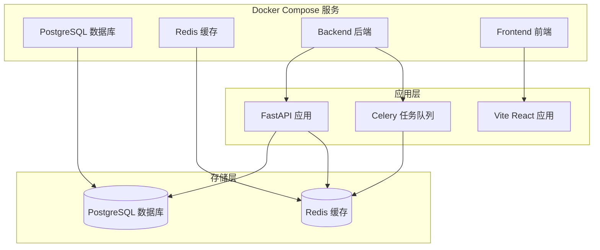
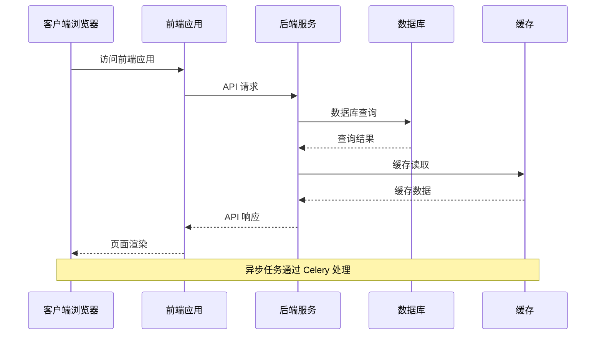
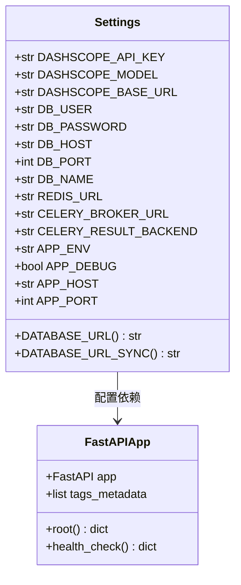
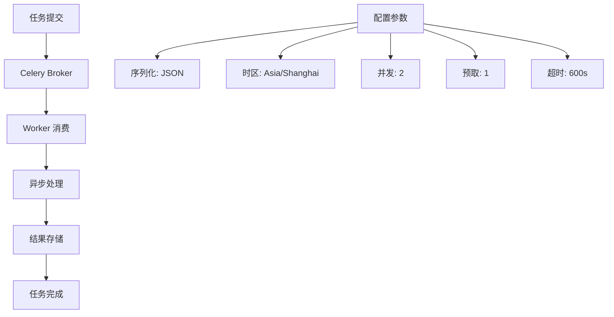
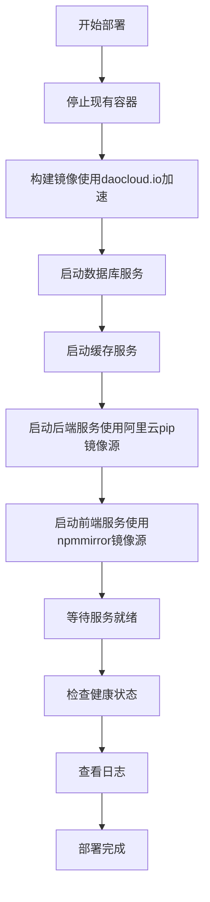
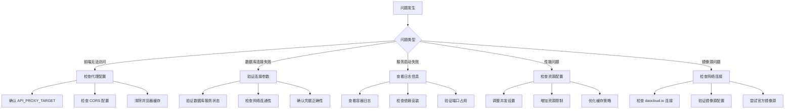

# Docker 部署

<cite>
**本文档引用的文件**
- [docker-compose.yml](file://docker-compose.yml)
- [Dockerfile.backend](file://Dockerfile.backend)
- [Dockerfile.frontend](file://Dockerfile.frontend)
- [docker-start.sh](file://docker-start.sh)
- [docker-stop.sh](file://docker-stop.sh)
- [frontend/docker-entrypoint.sh](file://frontend/docker-entrypoint.sh)
- [.env.example](file://.env.example)
- [pyproject.toml](file://pyproject.toml)
- [DOCKER_DEPLOY.md](file://DOCKER_DEPLOY.md)
</cite>

## 更新摘要
**变更内容**
- 新增镜像源优化配置章节，详细介绍中国大陆开发者构建优化
- 更新后端和前端Dockerfile配置说明，包含新的构建参数
- 补充daocloud.io镜像加速服务说明
- 更新部署流程中的镜像源配置

## 目录
1. [简介](#简介)
2. [项目结构](#项目结构)
3. [核心组件](#核心组件)
4. [架构概览](#架构概览)
5. [详细组件分析](#详细组件分析)
6. [镜像源优化配置](#镜像源优化配置)
7. [部署流程](#部署流程)
8. [性能考虑](#性能考虑)
9. [故障排除指南](#故障排除指南)
10. [结论](#结论)

## 简介

小说生成系统是一个基于 Docker 的现代化 Web 应用，采用前后端分离架构，集成了 AI 内容生成、多 Agent 协作和自动化发布等功能。该系统提供了完整的 Docker 部署方案，支持快速启动、热重载和容器编排，并针对中国大陆开发者进行了镜像源优化，显著提升构建速度和可靠性。

## 项目结构

系统采用微服务架构，包含以下主要组件：



**图表来源**
- [docker-compose.yml](file://docker-compose.yml#L1-L91)

**章节来源**
- [docker-compose.yml](file://docker-compose.yml#L1-L91)

## 核心组件

### 数据库服务 (PostgreSQL)

系统使用 PostgreSQL 作为主数据库，配置了完整的健康检查机制：

- **镜像版本**: m.daocloud.io/docker.io/postgres:17
- **端口映射**: 5434:5432
- **认证配置**: 用户名、密码、数据库名
- **数据持久化**: 使用 Docker 卷 `postgres_data`
- **健康检查**: 每10秒检查一次，超时5秒，最多重试5次

### 缓存服务 (Redis)

Redis 提供缓存和消息队列功能：

- **镜像版本**: m.daocloud.io/docker.io/redis:6-alpine
- **端口映射**: 6379:6379
- **数据持久化**: 使用 Docker 卷 `redis_data`
- **健康检查**: 每10秒检查一次，超时3秒，最多重试5次

### 后端服务 (FastAPI)

后端服务基于 Python 3.12 和 FastAPI 框架，经过镜像源优化：

- **镜像构建**: 基于 m.daocloud.io/docker.io/python:3.12-slim
- **依赖管理**: 使用 Poetry 1.8.2
- **镜像源优化**: 使用阿里云 pip 镜像源 https://mirrors.aliyun.com/pypi/simple/
- **端口暴露**: 8000
- **热重载**: 支持代码修改自动重启
- **挂载目录**: 包含 backend、core、agents、llm、workers

### 前端服务 (React/Vite)

前端服务基于 Node.js 20 和 Vite，经过镜像源优化：

- **镜像构建**: 基于 m.daocloud.io/docker.io/node:20-alpine
- **开发服务器**: Vite 开发服务器
- **端口暴露**: 3000
- **热重载**: HMR（热模块替换）
- **镜像源优化**: 使用 npmmirror 镜像源 https://registry.npmmirror.com
- **挂载目录**: 包含 src 和 public 目录

**章节来源**
- [docker-compose.yml](file://docker-compose.yml#L1-L91)
- [Dockerfile.backend](file://Dockerfile.backend#L1-L36)
- [Dockerfile.frontend](file://Dockerfile.frontend#L1-L28)

## 架构概览

系统采用容器化微服务架构，实现了服务间的松耦合和独立部署：



**图表来源**
- [docker-compose.yml](file://docker-compose.yml#L32-L87)

## 详细组件分析

### 后端应用配置

后端应用使用 Pydantic 设置管理系统配置：



**图表来源**
- [pyproject.toml](file://pyproject.toml#L8-L37)

### Celery 任务队列

系统使用 Celery 处理异步任务，支持长任务和并发控制：



**图表来源**
- [pyproject.toml](file://pyproject.toml#L18-L18)

## 镜像源优化配置

### daocloud.io 镜像加速服务

系统全面采用 daocloud.io 提供的镜像加速服务，显著提升中国大陆地区的构建速度：

- **PostgreSQL 镜像**: m.daocloud.io/docker.io/postgres:17
- **Redis 镜像**: m.daocloud.io/docker.io/redis:6-alpine  
- **Python 镜像**: m.daocloud.io/docker.io/python:3.12-slim
- **Node.js 镜像**: m.daocloud.io/docker.io/node:20-alpine

### 后端镜像源优化

后端服务使用阿里云 pip 镜像源进行依赖安装：

- **PIP_INDEX_URL**: https://mirrors.aliyun.com/pypi/simple/
- **PIP_TRUSTED_HOST**: mirrors.aliyun.com
- **apt 源优化**: 将 deb.debian.org 替换为 mirrors.aliyun.com

### 前端镜像源优化

前端服务使用 npmmirror 镜像源进行包安装：

- **NPM_REGISTRY**: https://registry.npmmirror.com
- **apk 源优化**: 将 dl-cdn.alpinelinux.org 替换为 mirrors.aliyun.com

**章节来源**
- [Dockerfile.backend](file://Dockerfile.backend#L1-L36)
- [Dockerfile.frontend](file://Dockerfile.frontend#L1-L28)
- [docker-compose.yml](file://docker-compose.yml#L3-L76)

## 部署流程

### 环境准备

1. **系统要求**
   - Docker Engine 20.10+
   - Docker Compose 2.0+
   - 至少 4GB RAM

2. **环境变量配置**
   ```bash
   # 复制示例配置
   cp .env.example .env
   
   # 配置 LLM API 密钥
   DASHSCOPE_API_KEY=your_api_key_here
   ```

### 启动步骤



**图表来源**
- [docker-start.sh](file://docker-start.sh#L1-L33)
- [docker-compose.yml](file://docker-compose.yml#L32-L87)

### 访问地址

- **前端应用**: http://localhost:3000
- **后端 API**: http://localhost:8000
- **API 文档**: http://localhost:8000/docs
- **健康检查**: http://localhost:8000/health

**章节来源**
- [docker-start.sh](file://docker-start.sh#L1-L33)
- [docker-stop.sh](file://docker-stop.sh#L1-L20)
- [DOCKER_DEPLOY.md](file://DOCKER_DEPLOY.md#L255-L270)

## 性能考虑

### 资源分配

1. **内存配置**
   - 后端服务: 建议至少 1GB RAM
   - 前端服务: 建议至少 512MB RAM
   - 数据库: 建议至少 1GB RAM
   - 缓存: 建议至少 256MB RAM

2. **并发设置**
   - Celery 工作线程: 2个
   - 预取倍数: 1（避免长任务阻塞）
   - 任务超时: 600秒（10分钟）

### 网络优化

1. **容器间通信**
   - 使用服务名而非 IP 地址
   - 禁用 SSL 连接以提高性能
   - 配置适当的连接池大小

2. **缓存策略**
   - Redis 缓存热点数据
   - 前端静态资源缓存
   - API 响应缓存

3. **镜像源优化效果**
   - daocloud.io 加速服务减少镜像拉取时间
   - 阿里云 pip 镜像源提升 Python 依赖安装速度
   - npmmirror 镜像源提升 npm 包安装速度

## 故障排除指南

### 常见问题及解决方案



**图表来源**
- [DOCKER_DEPLOY.md](file://DOCKER_DEPLOY.md#L147-L218)

### 调试工具

1. **日志查看**
   ```bash
   # 查看所有服务日志
   docker-compose logs -f
   
   # 查看特定服务日志
   docker-compose logs -f backend
   docker-compose logs -f frontend
   ```

2. **容器交互**
   ```bash
   # 进入后端容器
   docker exec -it novel_backend bash
   
   # 进入数据库容器
   docker exec -it novel_postgres psql -U novel_user -d novel_system
   ```

3. **网络诊断**
   ```bash
   # 检查服务状态
   docker-compose ps
   
   # 检查端口映射
   docker-compose port backend 8000
   ```

**章节来源**
- [DOCKER_DEPLOY.md](file://DOCKER_DEPLOY.md#L147-L218)

## 结论

小说生成系统的 Docker 部署方案提供了完整、可靠的容器化解决方案，并针对中国大陆开发者进行了专门优化。通过合理的架构设计、配置管理和镜像源优化，系统实现了：

- **高可用性**: 健康检查和自动重启机制
- **可扩展性**: 独立的服务容器和负载均衡
- **易维护性**: 统一的配置管理和部署流程
- **高性能**: 优化的资源分配、缓存策略和镜像源加速
- **国际化**: daocloud.io 镜像加速服务确保全球用户访问速度

该部署方案适合开发、测试和生产环境使用，为后续的功能扩展和运维管理奠定了坚实基础。镜像源优化配置显著提升了中国大陆地区用户的构建体验，减少了网络延迟和连接超时问题。