# Docker 部署

<cite>
**本文档引用的文件**
- [docker-compose.prod.yml](file://docker-compose.prod.yml)
- [docker-compose.yml](file://docker-compose.yml)
- [docker-compose.dev.yml](file://docker-compose.dev.yml)
- [nginx/nginx.conf](file://nginx/nginx.conf)
- [backend/Dockerfile](file://backend/Dockerfile)
- [frontend/Dockerfile](file://frontend/Dockerfile)
- [deploy_docker.sh](file://deploy_docker.sh)
- [docker-start.sh](file://docker-start.sh)
- [docker-stop.sh](file://docker-stop.sh)
- [rebuild_docker.sh](file://rebuild_docker.sh)
- [backend/main.py](file://backend/main.py)
- [backend/config.py](file://backend/config.py)
</cite>

## 更新摘要
**所做更改**
- 新增生产环境专用配置 docker-compose.prod.yml，包含 Nginx 反向代理和优化的容器网络设置
- 更新架构概览，反映新增的 Nginx 代理层和生产环境部署流程
- 增强了生产环境部署章节，详细介绍 Nginx 配置和容器网络优化
- 更新了部署脚本章节，反映新的生产环境部署流程
- 新增生产环境健康检查和负载均衡配置说明

## 目录
1. [简介](#简介)
2. [项目结构](#项目结构)
3. [核心组件](#核心组件)
4. [架构概览](#架构概览)
5. [详细组件分析](#详细组件分析)
6. [生产环境部署](#生产环境部署)
7. [开发环境配置](#开发环境配置)
8. [部署脚本分析](#部署脚本分析)
9. [性能考虑](#性能考虑)
10. [故障排除指南](#故障排除指南)
11. [结论](#结论)

## 简介

小说生成系统采用 Docker 容器化部署，提供了完整的微服务架构解决方案。该系统基于 Python FastAPI 后端、React 前端、PostgreSQL 数据库和 Redis 缓存的现代化技术栈，支持 AI 驱动的小说创作和生成。

系统的核心优势包括：
- **容器化部署**：通过 Docker 和 docker-compose 实现服务编排
- **多环境支持**：同时支持开发、测试和生产环境配置
- **Nginx 反向代理**：生产环境提供统一入口和负载均衡
- **自动化运维**：提供完整的部署、启动、停止和重建脚本
- **智能环境检测**：自动适配不同部署环境的配置需求
- **健康检查**：内置服务健康状态监控
- **数据库迁移**：集成 Alembic 数据库版本管理

**更新** 新增的生产环境配置 docker-compose.prod.yml 提供了企业级的部署方案，包含 Nginx 反向代理、优化的容器网络设置和增强的安全配置。简化后的开发环境配置专注于开发效率和调试便利性。

## 项目结构

项目的 Docker 部署架构采用多服务容器设计，包含以下核心组件：

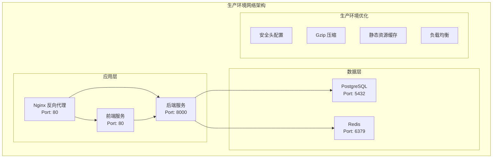

**图表来源**
- [docker-compose.prod.yml:1-88](file://docker-compose.prod.yml#L1-L88)
- [nginx/nginx.conf:1-79](file://nginx/nginx.conf#L1-L79)

**章节来源**
- [docker-compose.prod.yml:1-88](file://docker-compose.prod.yml#L1-L88)
- [docker-compose.yml:1-113](file://docker-compose.yml#L1-L113)
- [docker-compose.dev.yml:1-82](file://docker-compose.dev.yml#L1-L82)

## 核心组件

### 后端服务 (Backend)

后端服务是整个系统的核心，基于 FastAPI 框架构建，提供 RESTful API 接口和业务逻辑处理。

**主要特性：**
- **FastAPI 框架**：高性能异步 Web 框架
- **CORS 支持**：跨域资源共享配置
- **健康检查**：数据库和 Redis 连接状态检查
- **OpenAPI 文档**：自动生成 API 文档
- **多环境配置**：支持开发、测试和生产环境

**环境配置：**
- Python 3.12 环境
- PostgreSQL 数据库连接
- Redis 缓存支持
- Celery 异步任务队列

**章节来源**
- [backend/main.py:1-159](file://backend/main.py#L1-L159)
- [backend/config.py:1-200](file://backend/config.py#L1-L200)

### 前端服务 (Frontend)

前端服务采用 React + TypeScript 技术栈，提供用户界面和交互体验。

**主要特性：**
- **Vite 开发服务器**：快速的开发环境
- **TypeScript 支持**：类型安全的 JavaScript
- **热重载**：开发时自动刷新
- **代理配置**：API 请求转发

**环境配置：**
- Node.js 20 环境
- Vite 构建工具
- 开发代理到后端 API

**章节来源**
- [frontend/Dockerfile:1-33](file://frontend/Dockerfile#L1-L33)

### Nginx 反向代理

**新增** Nginx 作为生产环境的统一入口，提供负载均衡、安全防护和性能优化。

**主要特性：**
- **反向代理**：统一 API 入口
- **Gzip 压缩**：提升传输效率
- **安全头配置**：增强应用安全性
- **静态资源缓存**：优化前端性能
- **SPA 路由支持**：支持前端路由

**配置特点：**
- **端口映射**：对外暴露 80 端口
- **健康检查**：内置 /health 端点
- **WebSocket 支持**：支持实时通信
- **超时配置**：合理的请求超时设置

**章节来源**
- [nginx/nginx.conf:1-79](file://nginx/nginx.conf#L1-L79)
- [frontend/Dockerfile:22-33](file://frontend/Dockerfile#L22-L33)

### 数据库服务 (PostgreSQL)

PostgreSQL 作为主数据库，存储所有小说创作相关的数据。

**配置特点：**
- **版本 17**：最新稳定版本
- **数据持久化**：使用 Docker 卷存储
- **健康检查**：自动监控数据库状态
- **端口映射**：开发环境映射到 5434

**章节来源**
- [docker-compose.prod.yml:2-18](file://docker-compose.prod.yml#L2-L18)
- [docker-compose.yml:2-20](file://docker-compose.yml#L2-L20)

### 缓存服务 (Redis)

Redis 提供高性能的键值存储，支持会话管理、缓存和消息队列功能。

**配置特点：**
- **版本 6**：长期支持版本
- **多数据库实例**：0-2 数据库分离
- **健康检查**：自动监控缓存状态
- **数据持久化**：使用 Docker 卷存储

**章节来源**
- [docker-compose.prod.yml:20-33](file://docker-compose.prod.yml#L20-L33)
- [docker-compose.yml:21-35](file://docker-compose.yml#L21-L35)

## 架构概览

系统采用微服务架构，通过 Docker 容器实现服务间的解耦和独立部署。新增的生产环境架构包含 Nginx 反向代理层。

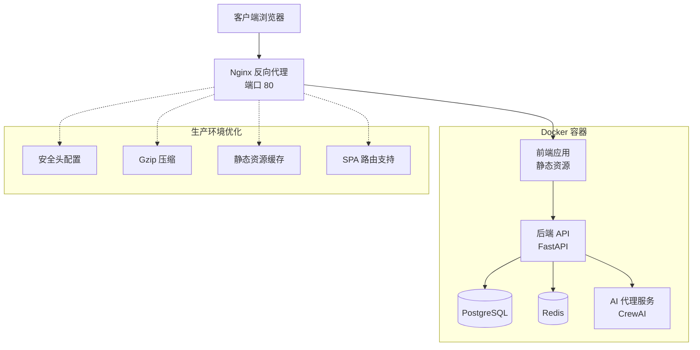

**图表来源**
- [docker-compose.prod.yml:68-79](file://docker-compose.prod.yml#L68-L79)
- [nginx/nginx.conf:1-79](file://nginx/nginx.conf#L1-L79)

## 详细组件分析

### Docker 镜像构建流程

#### 后端镜像构建

后端镜像构建过程包含多个优化步骤：

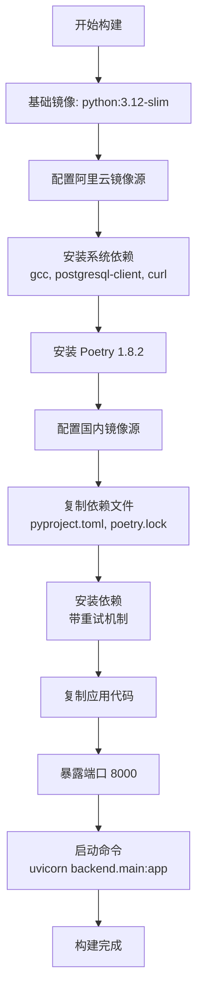

**图表来源**
- [backend/Dockerfile:1-57](file://backend/Dockerfile#L1-L57)

**构建优化策略：**
- 使用阿里云镜像源加速依赖下载
- 多次重试确保依赖安装稳定性
- 分层构建优化缓存利用率

#### 前端镜像构建

**更新** 前端镜像构建流程进行了重大优化，采用多阶段构建和 Nginx 部署：

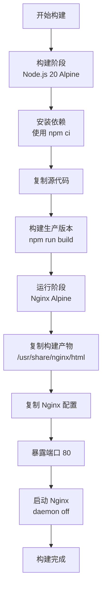

**图表来源**
- [frontend/Dockerfile:1-33](file://frontend/Dockerfile#L1-L33)

**生产环境优化：**
- 多阶段构建减少镜像大小
- 使用 Nginx 替代 Vite 开发服务器
- 静态资源优化和缓存配置
- 内置 Nginx 配置文件

**章节来源**
- [backend/Dockerfile:1-57](file://backend/Dockerfile#L1-L57)
- [frontend/Dockerfile:1-33](file://frontend/Dockerfile#L1-L33)

### 服务编排配置

#### 生产环境配置

**新增** 生产环境使用 docker-compose.prod.yml 进行服务编排，包含完整的 Nginx 反向代理和优化的容器网络设置：

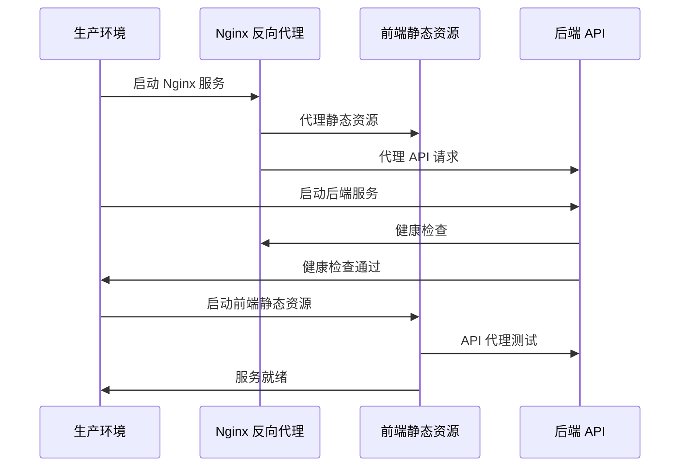

**图表来源**
- [docker-compose.prod.yml:34-79](file://docker-compose.prod.yml#L34-L79)

**关键配置：**
- **Nginx 反向代理**：统一入口和负载均衡
- **容器网络**：专用 app-network 隔离
- **健康检查**：自动监控服务状态
- **端口映射**：生产环境端口映射
- **数据持久化**：Docker 卷管理

#### 开发环境配置

开发环境使用独立的 docker-compose.dev.yml，支持代码热重载：

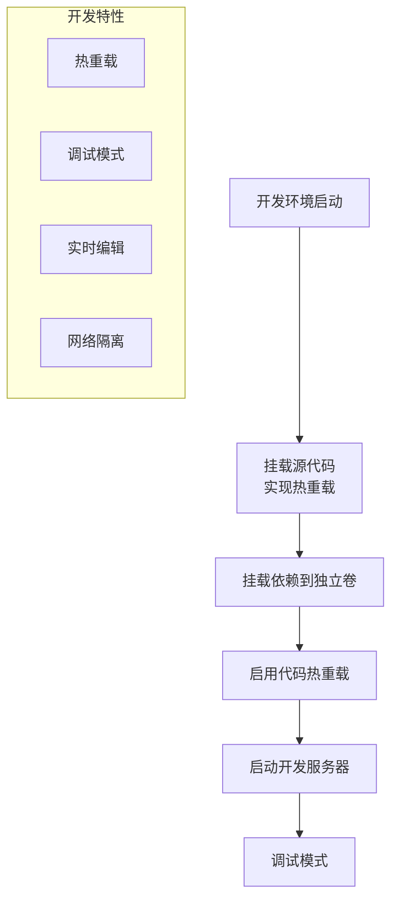

**图表来源**
- [docker-compose.dev.yml:36-73](file://docker-compose.dev.yml#L36-L73)

**开发优化：**
- 源代码挂载实现热重载
- 独立依赖卷避免覆盖
- 开发服务器自动重启
- 专用开发网络隔离

**章节来源**
- [docker-compose.prod.yml:1-88](file://docker-compose.prod.yml#L1-L88)
- [docker-compose.dev.yml:1-82](file://docker-compose.dev.yml#L1-L82)

## 生产环境部署

### Nginx 反向代理配置

**新增** 生产环境的 Nginx 配置提供了企业级的部署能力：

#### 核心功能特性

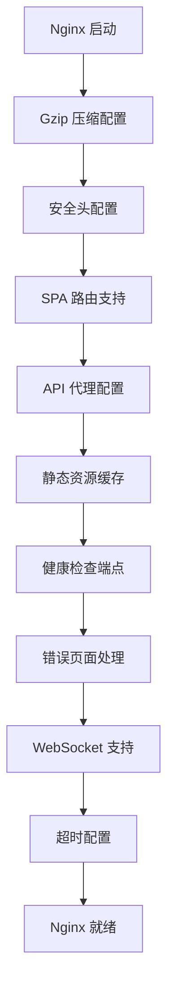

**图表来源**
- [nginx/nginx.conf:1-79](file://nginx/nginx.conf#L1-L79)

#### 安全配置

1. **X-Frame-Options**：防止点击劫持攻击
2. **X-Content-Type-Options**：阻止 MIME 类型嗅探
3. **X-XSS-Protection**：启用 XSS 保护
4. **Content Security Policy**：内容安全策略

#### 性能优化

1. **Gzip 压缩**：压缩文本资源
2. **静态资源缓存**：长期缓存静态文件
3. **超时设置**：合理的连接和读取超时
4. **WebSocket 支持**：实时通信支持

#### 网络配置

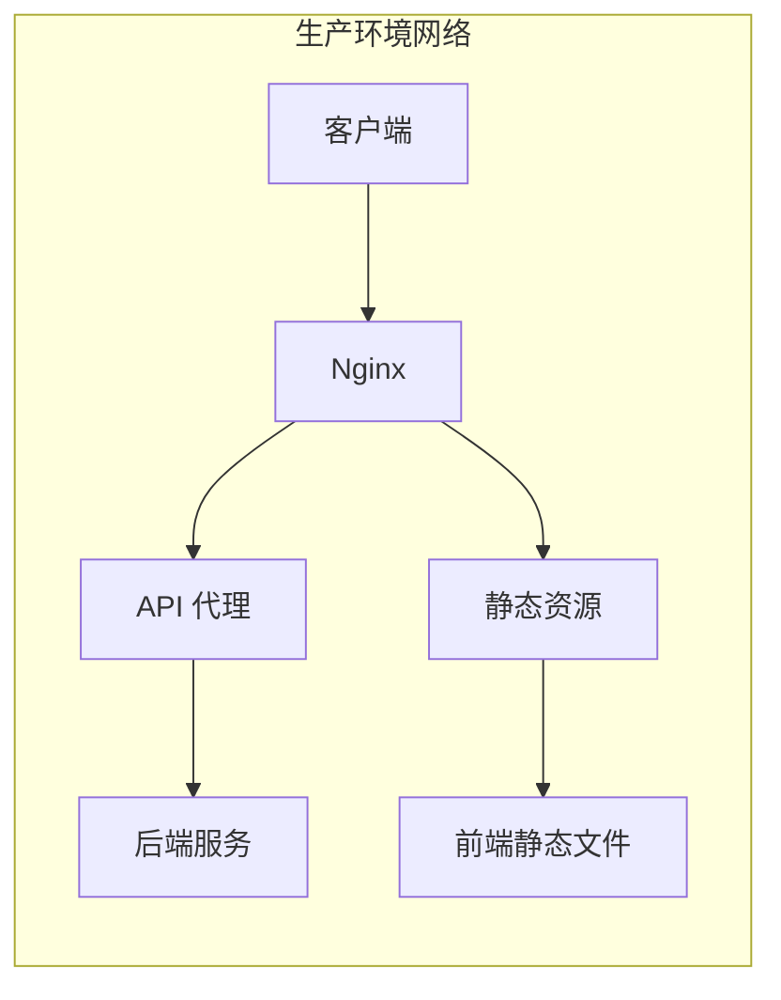

**配置特性：**
- **端口映射**：对外暴露 80 端口
- **容器网络**：通过 app-network 通信
- **健康检查**：内置 /health 端点
- **负载均衡**：支持多实例部署

**章节来源**
- [docker-compose.prod.yml:68-79](file://docker-compose.prod.yml#L68-L79)
- [nginx/nginx.conf:1-79](file://nginx/nginx.conf#L1-L79)

### 容器网络优化

**新增** 生产环境采用专用的容器网络配置：

#### 网络架构

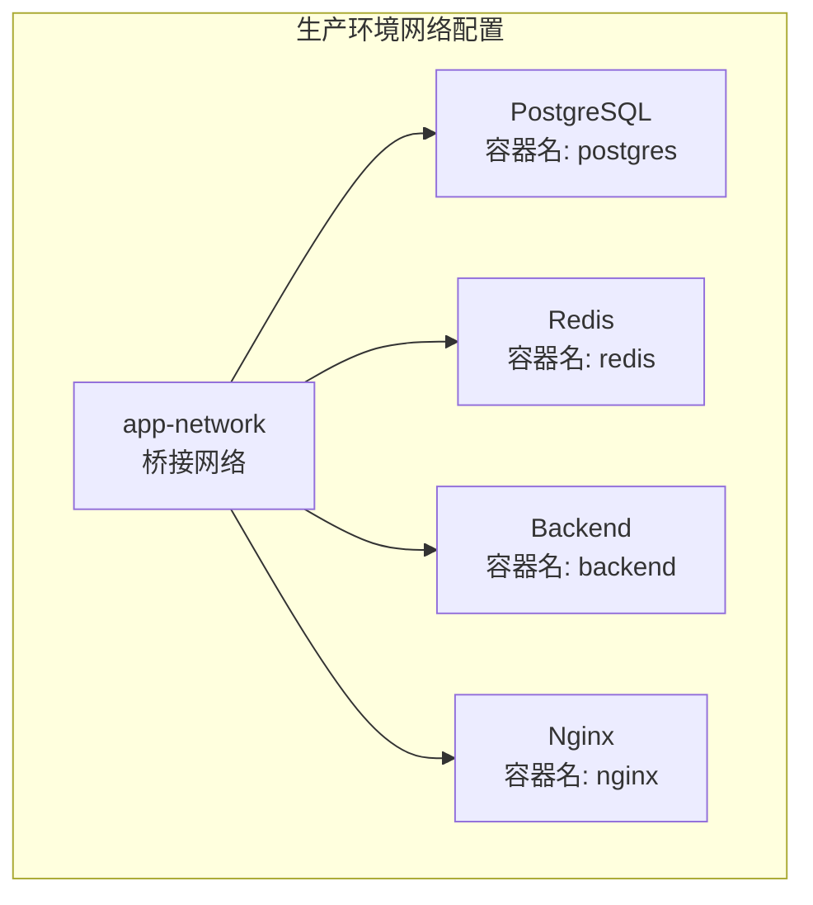

**网络特性：**
- **专用网络**：app-network 隔离生产环境
- **容器别名**：通过服务名进行内部通信
- **端口映射**：生产环境端口映射到宿主机
- **健康检查**：自动监控容器状态

#### 端口配置

| 服务 | 容器端口 | 宿主机端口 | 用途 |
|------|----------|------------|------|
| PostgreSQL | 5432 | 无映射 | 内部数据库服务 |
| Redis | 6379 | 无映射 | 内部缓存服务 |
| Backend | 8000 | 8080 | API 服务 |
| Nginx | 80 | 80 | 反向代理 |

**章节来源**
- [docker-compose.prod.yml:85-88](file://docker-compose.prod.yml#L85-L88)
- [docker-compose.prod.yml:57-58](file://docker-compose.prod.yml#L57-L58)

## 开发环境配置

### 开发环境优化

开发环境配置进行了简化，专注于开发效率和调试便利性：

#### 核心特性

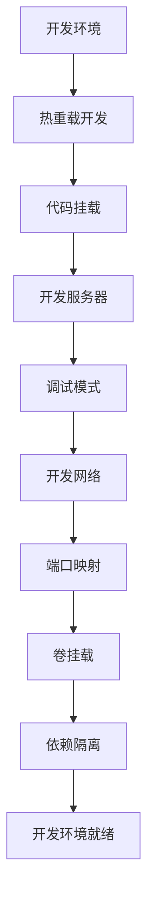

**图表来源**
- [docker-compose.dev.yml:36-73](file://docker-compose.dev.yml#L36-L73)

#### 开发优化

1. **热重载支持**：代码修改自动重启
2. **源代码挂载**：实时同步开发代码
3. **独立网络**：novel_dev_network 隔离
4. **端口映射**：开发端口与生产分离
5. **依赖隔离**：独立的开发依赖卷

#### 端口配置

| 服务 | 容器端口 | 开发端口 | 用途 |
|------|----------|----------|------|
| PostgreSQL | 5432 | 5436 | 开发数据库 |
| Redis | 6379 | 6382 | 开发缓存 |
| Backend | 8000 | 8000 | 开发 API |
| Frontend | 3000 | 3000 | 开发前端 |

**章节来源**
- [docker-compose.dev.yml:1-82](file://docker-compose.dev.yml#L1-L82)

## 部署脚本分析

### 生产环境部署脚本

**更新** 生产环境部署脚本针对新的 docker-compose.prod.yml 进行了优化：

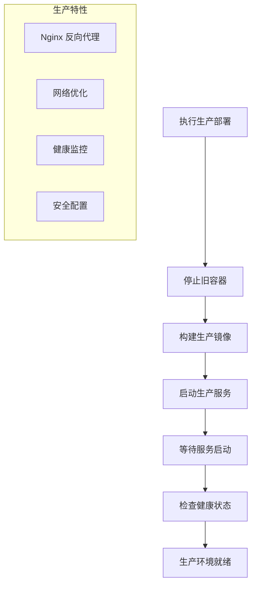

**图表来源**
- [deploy_docker.sh:1-35](file://deploy_docker.sh#L1-L35)

#### 自动化特性

1. **彩色输出提示**：区分不同操作阶段
2. **失败自动终止**：防止错误扩散
3. **详细的用户反馈**：服务状态检查确认
4. **健康状态监控**：自动验证部署结果

#### 部署流程

```bash
# 使用生产环境配置
docker-compose -f docker-compose.prod.yml up -d

# 验证部署状态
docker-compose -f docker-compose.prod.yml ps

# 检查 Nginx 健康状态
curl http://localhost/health

# 访问生产环境
# 前端：http://localhost
# 后端 API：http://localhost/api/
```

### 开发环境部署脚本

开发环境部署脚本保持原有功能，专注于开发效率：

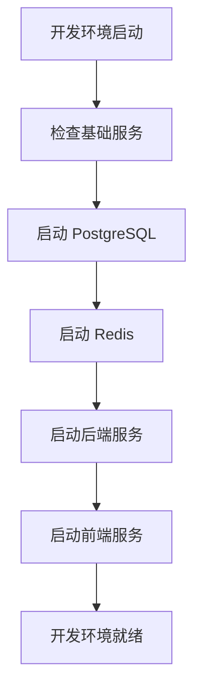

**图表来源**
- [docker-start.sh:1-29](file://docker-start.sh#L1-L29)

#### 开发特性

1. **一键启动**：快速启动完整开发环境
2. **自动构建**：包含镜像构建步骤
3. **健康检查**：验证服务状态
4. **端口验证**：确认端口映射正确

**章节来源**
- [deploy_docker.sh:1-35](file://deploy_docker.sh#L1-L35)
- [docker-start.sh:1-29](file://docker-start.sh#L1-L29)
- [docker-stop.sh:1-23](file://docker-stop.sh#L1-L23)
- [rebuild_docker.sh:1-38](file://rebuild_docker.sh#L1-L38)

## 性能考虑

### 生产环境性能优化

**新增** 生产环境采用了多项性能优化措施：

#### Nginx 性能优化

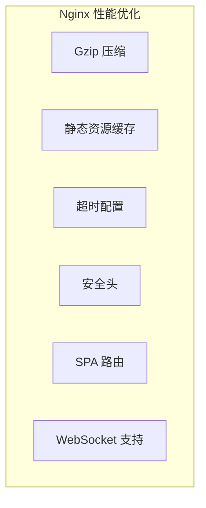

**优化措施：**
- **Gzip 压缩**：压缩文本资源，减少传输大小
- **静态资源缓存**：长期缓存 JS/CSS/图片等静态文件
- **超时配置**：合理的连接和读取超时设置
- **安全头配置**：增强应用安全性

#### 容器网络优化

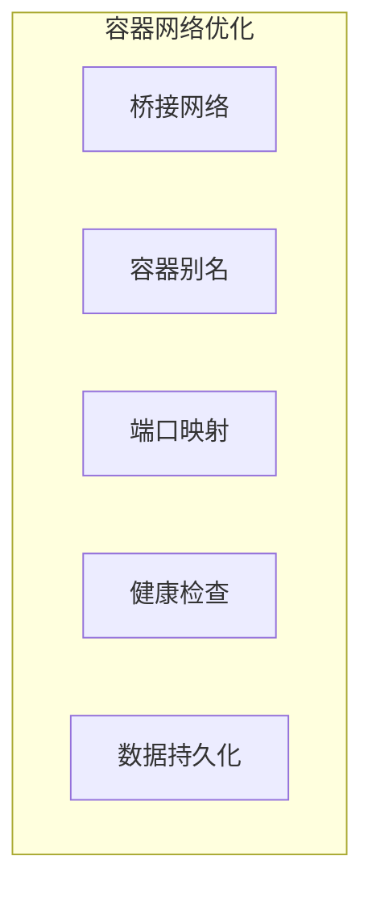

**优化措施：**
- **专用网络**：app-network 隔离生产环境
- **容器别名**：通过服务名进行内部通信
- **健康检查**：自动监控容器状态
- **数据持久化**：Docker 卷管理确保数据安全

### 开发环境性能考虑

开发环境保持原有优化，专注于开发效率：

- **热重载**：代码修改自动重启
- **源代码挂载**：实时同步开发代码
- **独立网络**：novel_dev_network 隔离
- **端口映射**：开发端口与生产分离

## 故障排除指南

### 生产环境常见问题

#### Nginx 反向代理问题

**症状**：访问生产环境页面空白或 502 错误

**诊断步骤：**
1. 检查 Nginx 服务状态
2. 验证后端 API 连接
3. 查看 Nginx 错误日志
4. 确认静态资源路径

**解决方案：**
```bash
# 检查 Nginx 状态
docker-compose -f docker-compose.prod.yml ps | grep nginx

# 查看 Nginx 日志
docker-compose -f docker-compose.prod.yml logs nginx

# 检查后端 API 状态
docker-compose -f docker-compose.prod.yml ps | grep backend

# 重启 Nginx 服务
docker-compose -f docker-compose.prod.yml restart nginx
```

#### 健康检查失败

**症状**：服务显示 unhealthy 状态

**诊断方法：**
1. 检查服务日志
2. 验证依赖服务状态
3. 确认端口映射正确
4. 检查 Nginx 配置

**排查命令：**
```bash
# 查看所有服务状态
docker-compose -f docker-compose.prod.yml ps

# 查看特定服务日志
docker-compose -f docker-compose.prod.yml logs backend

# 执行健康检查
curl http://localhost/health
```

#### 端口冲突

**症状**：容器启动失败，端口被占用

**解决方法：**
```bash
# 检查端口使用情况
netstat -tulpn | grep ':80\|':8080'

# 修改 docker-compose.prod.yml 中的端口映射
# 或停止占用端口的进程
```

### 开发环境调试

#### 热重载问题

**症状**：前端代码修改后不生效

**解决方法：**
1. 确认开发容器正常运行
2. 检查文件挂载是否正确
3. 重启开发服务器

**调试命令：**
```bash
# 检查文件挂载
docker-compose exec backend ls -la /app

# 重启开发服务器
docker-compose restart backend

# 查看开发日志
docker-compose logs backend
```

#### API 代理问题

**症状**：前端无法访问后端 API

**诊断步骤：**
1. 检查 API_PROXY_TARGET 环境变量
2. 验证后端服务状态
3. 确认 CORS 配置

**配置验证：**
```bash
# 检查环境变量
docker-compose exec frontend env | grep API_PROXY_TARGET

# 测试 API 连接
curl http://localhost:8000/health

# 检查网络连通性
docker-compose exec frontend ping backend
```

### 生产环境监控

#### 性能监控

```bash
# 查看资源使用情况
docker stats

# 监控服务日志
docker-compose -f docker-compose.prod.yml logs -f --tail=100

# 检查数据库性能
docker-compose -f docker-compose.prod.yml exec postgres pg_stat_statements_reset()
```

#### 故障恢复

```bash
# 快速恢复服务
docker-compose -f docker-compose.prod.yml restart backend nginx

# 清理并重新部署
./rebuild_docker.sh

# 检查磁盘空间
docker system df
```

### 网络配置问题

**新增** 生产环境网络配置特有的问题和解决方案

#### 容器网络连接问题

**症状**：容器间无法通信或服务启动失败

**诊断方法：**
1. 检查 app-network 是否正确创建
2. 验证容器是否加入正确的网络
3. 确认容器别名配置

**解决步骤：**
```bash
# 检查网络配置
docker network ls | grep app-network

# 查看网络详情
docker network inspect app-network

# 重启网络中的容器
docker-compose -f docker-compose.prod.yml restart backend nginx

# 检查容器网络连接
docker-compose -f docker-compose.prod.yml exec backend ping postgres
```

#### 端口映射问题

**症状**：外部无法访问生产环境服务

**诊断方法：**
1. 检查宿主机端口映射
2. 验证防火墙设置
3. 确认 Nginx 配置

**解决步骤：**
```bash
# 检查端口映射
docker-compose -f docker-compose.prod.yml port nginx 80

# 检查防火墙规则
sudo ufw status

# 重启 Nginx 服务
docker-compose -f docker-compose.prod.yml restart nginx
```

**章节来源**
- [docker-stop.sh:1-23](file://docker-stop.sh#L1-L23)
- [nginx/nginx.conf:1-79](file://nginx/nginx.conf#L1-L79)
- [docker-compose.prod.yml:1-88](file://docker-compose.prod.yml#L1-L88)

## 结论

小说生成系统的 Docker 部署方案经过重大升级，提供了更加完善的企业级部署解决方案。通过新增的生产环境配置和 Nginx 反向代理，系统具备了以下优势：

### 核心优势

1. **完整的微服务架构**：清晰的服务边界和职责分离
2. **企业级生产环境**：Nginx 反向代理提供统一入口和负载均衡
3. **强大的自动化能力**：从构建到部署的全流程自动化
4. **灵活的环境配置**：支持开发、测试和生产环境的无缝切换
5. **完善的监控机制**：内置健康检查和状态监控
6. **优秀的开发体验**：热重载和调试支持
7. **网络安全防护**：Nginx 提供安全头配置和防护
8. **性能优化**：Gzip 压缩和静态资源缓存

**更新** 最新的生产环境配置 docker-compose.prod.yml 提供了企业级的部署能力，包含 Nginx 反向代理、优化的容器网络设置和增强的安全配置。简化后的开发环境配置专注于开发效率和调试便利性。

### 技术亮点

- **多阶段构建优化**：减少镜像大小，提升部署效率
- **Nginx 反向代理**：统一入口、负载均衡、安全防护
- **智能环境检测**：自动适配不同部署环境
- **健康检查集成**：确保服务可用性
- **数据持久化**：Docker 卷管理确保数据安全
- **网络隔离**：专用 Docker 网络提供安全的服务通信
- **安全头配置**：增强应用安全性
- **静态资源优化**：提升前端性能

### 未来改进方向

1. **CI/CD 集成**：自动化测试和部署流水线
2. **监控告警**：更完善的性能监控和告警系统
3. **扩展性优化**：支持水平扩展和负载均衡
4. **安全性增强**：网络隔离和访问控制
5. **备份策略**：完善的数据备份和恢复机制
6. **部署脚本优化**：进一步提升自动化程度和用户体验
7. **多环境管理**：支持更多环境的配置管理

该部署方案为小说生成系统的稳定运行和持续发展奠定了坚实的基础，为后续的功能扩展和技术演进提供了良好的基础设施支持。新增的生产环境配置特别适合企业级部署，提供了更好的性能、安全性和可维护性。简化的开发环境配置提升了开发效率，为开发者提供了更好的开发体验。