# Docker 部署

<cite>
**本文档引用的文件**
- [Dockerfile.backend](file://Dockerfile.backend)
- [Dockerfile.frontend](file://Dockerfile.frontend)
- [docker-compose.yml](file://docker-compose.yml)
- [docker-compose.dev.yml](file://docker-compose.dev.yml)
- [docker-compose.migration.yml](file://docker-compose.migration.yml)
- [deploy_docker.sh](file://deploy_docker.sh)
- [docker-start.sh](file://docker-start.sh)
- [docker-stop.sh](file://docker-stop.sh)
- [rebuild_docker.sh](file://rebuild_docker.sh)
- [.dockerignore](file://.dockerignore)
- [frontend/docker-entrypoint.sh](file://frontend/docker-entrypoint.sh)
- [DEPLOYMENT_SUMMARY.md](file://DEPLOYMENT_SUMMARY.md)
- [backend/main.py](file://backend/main.py)
- [backend/config.py](file://backend/config.py)
- [pyproject.toml](file://pyproject.toml)
</cite>

## 目录
1. [简介](#简介)
2. [项目结构](#项目结构)
3. [核心组件](#核心组件)
4. [架构概览](#架构概览)
5. [详细组件分析](#详细组件分析)
6. [依赖分析](#依赖分析)
7. [性能考虑](#性能考虑)
8. [故障排除指南](#故障排除指南)
9. [结论](#结论)

## 简介

小说生成系统采用 Docker 容器化部署，提供了完整的微服务架构解决方案。该系统基于 Python FastAPI 后端、React 前端、PostgreSQL 数据库和 Redis 缓存的现代化技术栈，支持 AI 驱动的小说创作和生成。

系统的核心优势包括：
- **容器化部署**：通过 Docker 和 docker-compose 实现服务编排
- **多环境支持**：同时支持开发和生产环境配置
- **自动化运维**：提供完整的部署、启动、停止和重建脚本
- **健康检查**：内置服务健康状态监控
- **数据库迁移**：集成 Alembic 数据库版本管理

## 项目结构

项目的 Docker 部署架构采用多服务容器设计，包含以下核心组件：

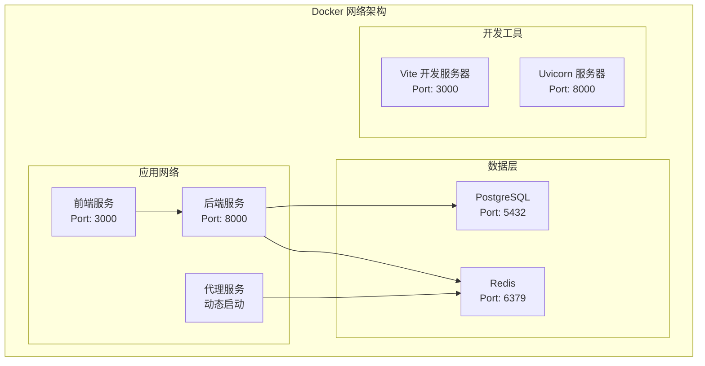

**图表来源**
- [docker-compose.yml:1-112](file://docker-compose.yml#L1-L112)
- [docker-compose.dev.yml:1-103](file://docker-compose.dev.yml#L1-L103)

**章节来源**
- [docker-compose.yml:1-112](file://docker-compose.yml#L1-L112)
- [docker-compose.dev.yml:1-103](file://docker-compose.dev.yml#L1-L103)

## 核心组件

### 后端服务 (Backend)

后端服务是整个系统的核心，基于 FastAPI 框架构建，提供 RESTful API 接口和业务逻辑处理。

**主要特性：**
- **FastAPI 框架**：高性能异步 Web 框架
- **CORS 支持**：跨域资源共享配置
- **健康检查**：数据库和 Redis 连接状态检查
- **OpenAPI 文档**：自动生成 API 文档

**环境配置：**
- Python 3.12 环境
- PostgreSQL 数据库连接
- Redis 缓存支持
- Celery 异步任务队列

**章节来源**
- [backend/main.py:1-149](file://backend/main.py#L1-L149)
- [backend/config.py:1-132](file://backend/config.py#L1-L132)

### 前端服务 (Frontend)

前端服务采用 React + TypeScript 技术栈，提供用户界面和交互体验。

**主要特性：**
- **Vite 开发服务器**：快速的开发环境
- **TypeScript 支持**：类型安全的 JavaScript
- **热重载**：开发时自动刷新
- **代理配置**：API 请求转发

**环境配置：**
- Node.js 20 环境
- Vite 构建工具
- 开发代理到后端 API

**章节来源**
- [Dockerfile.frontend:1-28](file://Dockerfile.frontend#L1-L28)
- [frontend/docker-entrypoint.sh:1-11](file://frontend/docker-entrypoint.sh#L1-L11)

### 数据库服务 (PostgreSQL)

PostgreSQL 作为主数据库，存储所有小说创作相关的数据。

**配置特点：**
- **版本 17**：最新稳定版本
- **数据持久化**：使用 Docker 卷存储
- **健康检查**：自动监控数据库状态
- **端口映射**：开发环境映射到 5434

**章节来源**
- [docker-compose.yml:2-17](file://docker-compose.yml#L2-L17)
- [docker-compose.dev.yml:7-23](file://docker-compose.dev.yml#L7-L23)

### 缓存服务 (Redis)

Redis 提供高性能的键值存储，支持会话管理、缓存和消息队列功能。

**配置特点：**
- **版本 6**：长期支持版本
- **多数据库实例**：0-2 数据库分离
- **健康检查**：自动监控缓存状态
- **数据持久化**：使用 Docker 卷存储

**章节来源**
- [docker-compose.yml:21-34](file://docker-compose.yml#L21-L34)
- [docker-compose.dev.yml:24-35](file://docker-compose.dev.yml#L24-L35)

## 架构概览

系统采用微服务架构，通过 Docker 容器实现服务间的解耦和独立部署。

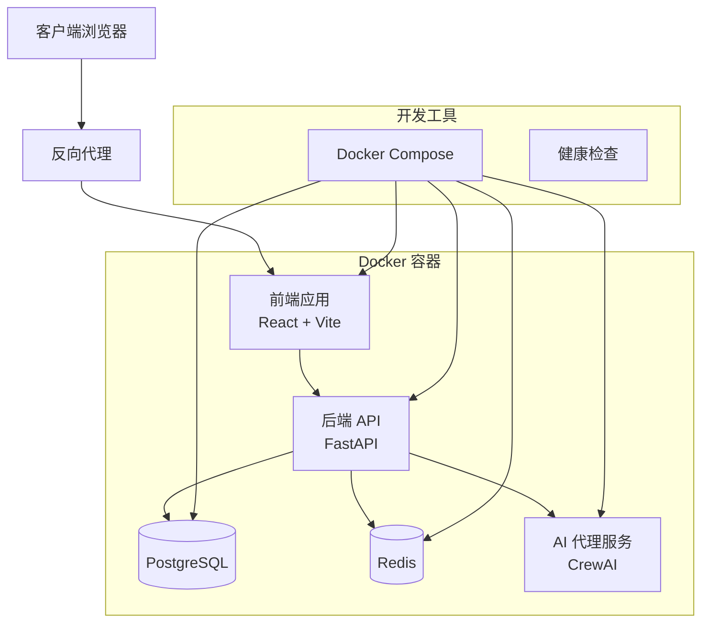

**图表来源**
- [docker-compose.yml:1-112](file://docker-compose.yml#L1-L112)
- [backend/main.py:62-90](file://backend/main.py#L62-L90)

## 详细组件分析

### Docker 镜像构建流程

#### 后端镜像构建

后端镜像构建过程包含多个优化步骤：

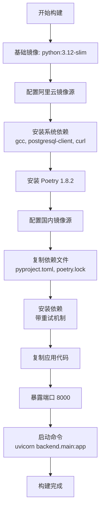

**图表来源**
- [Dockerfile.backend:1-42](file://Dockerfile.backend#L1-L42)

**构建优化策略：**
- 使用阿里云镜像源加速依赖下载
- 多次重试确保依赖安装稳定性
- 分层构建优化缓存利用率

#### 前端镜像构建

前端镜像构建流程相对简洁：

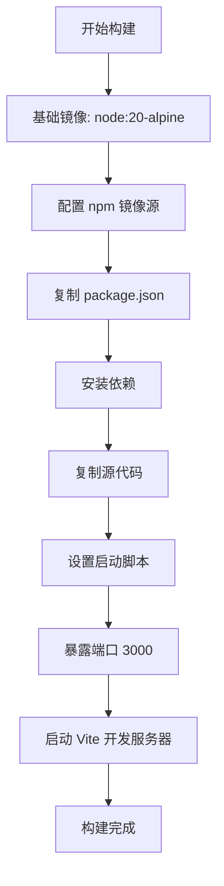

**图表来源**
- [Dockerfile.frontend:1-28](file://Dockerfile.frontend#L1-L28)

**开发环境特性：**
- 使用 Alpine Linux 减小镜像体积
- 支持热重载开发模式
- 自动环境变量注入

**章节来源**
- [Dockerfile.backend:1-42](file://Dockerfile.backend#L1-L42)
- [Dockerfile.frontend:1-28](file://Dockerfile.frontend#L1-L28)

### 服务编排配置

#### 生产环境配置

生产环境使用 docker-compose.yml 进行服务编排，包含完整的健康检查和依赖管理：

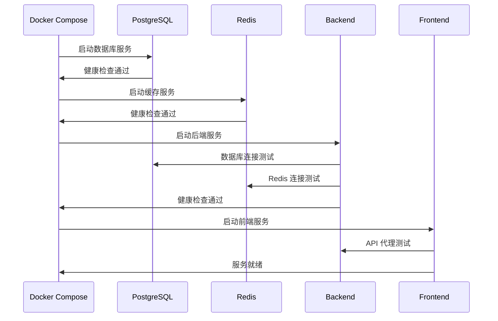

**图表来源**
- [docker-compose.yml:36-83](file://docker-compose.yml#L36-L83)

**关键配置：**
- **健康检查**：自动监控服务状态
- **依赖关系**：按顺序启动服务
- **端口映射**：开发环境端口分离
- **数据持久化**：Docker 卷管理

#### 开发环境配置

开发环境使用独立的 docker-compose.dev.yml，支持代码热重载：

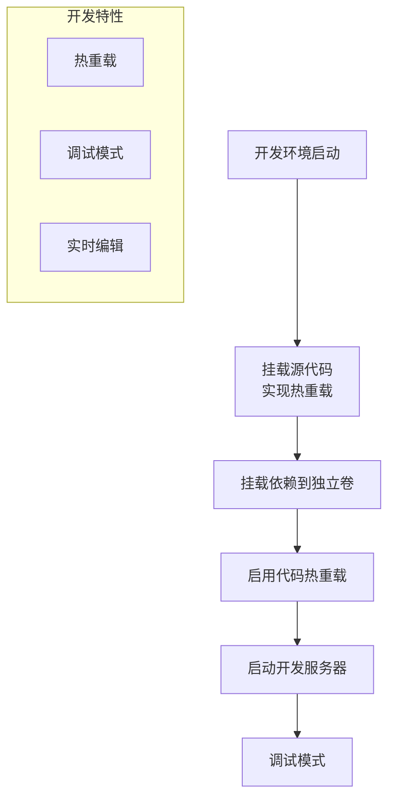

**图表来源**
- [docker-compose.dev.yml:37-71](file://docker-compose.dev.yml#L37-L71)

**开发优化：**
- 源代码挂载实现热重载
- 独立依赖卷避免覆盖
- 开发服务器自动重启

**章节来源**
- [docker-compose.yml:1-112](file://docker-compose.yml#L1-L112)
- [docker-compose.dev.yml:1-103](file://docker-compose.dev.yml#L1-L103)

### 部署脚本分析

#### 一键部署脚本

部署脚本提供完整的自动化部署流程：

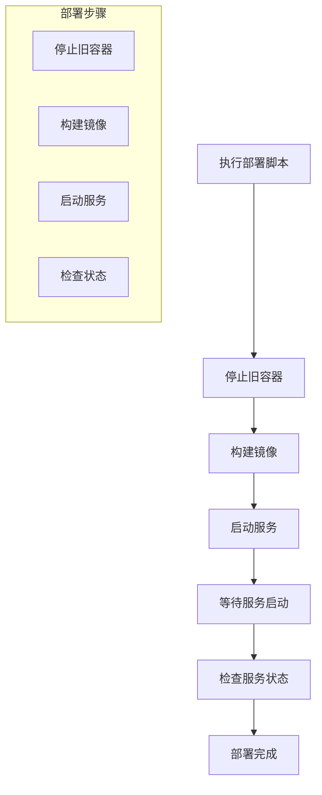

**图表来源**
- [deploy_docker.sh:19-44](file://deploy_docker.sh#L19-L44)

**自动化特性：**
- 颜色化输出提示
- 失败自动终止
- 服务状态检查

#### 重建部署脚本

重建脚本提供完全重新构建的能力：

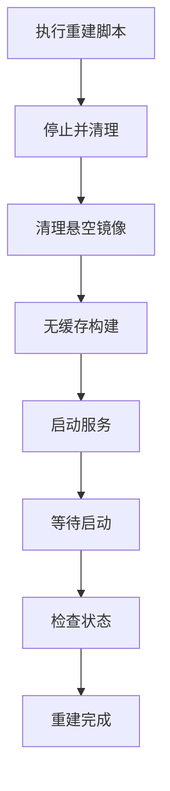

**图表来源**
- [rebuild_docker.sh:19-48](file://rebuild_docker.sh#L19-L48)

**重建特性：**
- 清理所有旧资源
- 强制重新构建
- 完全重新部署

**章节来源**
- [deploy_docker.sh:1-51](file://deploy_docker.sh#L1-L51)
- [rebuild_docker.sh:1-66](file://rebuild_docker.sh#L1-L66)

## 依赖分析

### 系统依赖关系

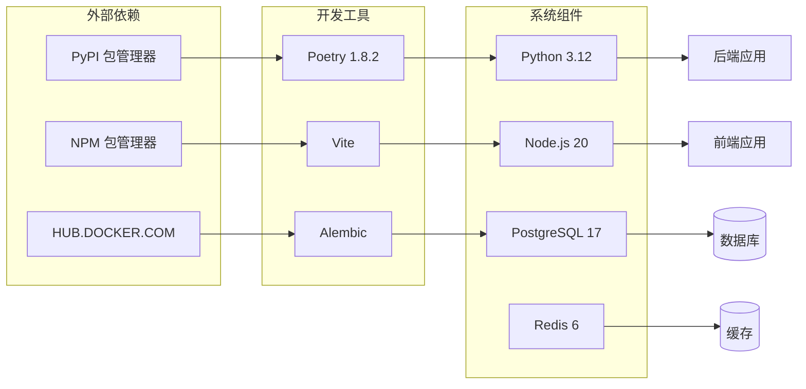

**图表来源**
- [pyproject.toml:8-37](file://pyproject.toml#L8-L37)
- [Dockerfile.backend:19-25](file://Dockerfile.backend#L19-L25)

### 环境变量配置

系统采用智能的环境变量配置，支持 Docker 和本地开发两种模式：

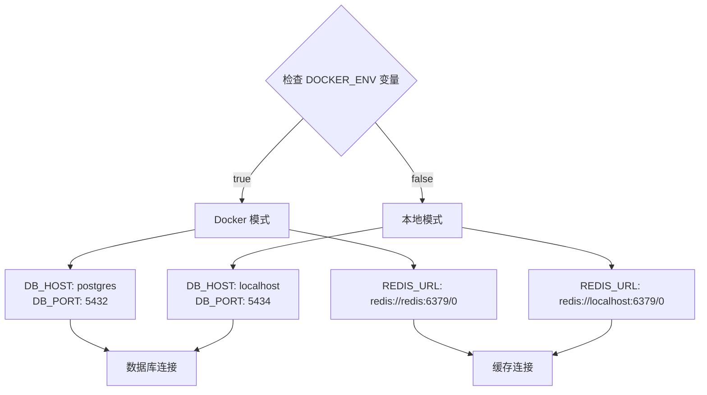

**图表来源**
- [backend/config.py:18-62](file://backend/config.py#L18-L62)

**配置特性：**
- 自动环境检测
- 统一连接管理
- 环境隔离

**章节来源**
- [backend/config.py:1-132](file://backend/config.py#L1-L132)
- [pyproject.toml:1-64](file://pyproject.toml#L1-L64)

## 性能考虑

### 镜像优化策略

系统采用了多项镜像优化技术来提升构建和运行效率：

1. **多阶段构建**：减少最终镜像大小
2. **缓存优化**：合理利用 Docker 层缓存
3. **镜像源优化**：使用阿里云镜像加速下载
4. **依赖管理**：Poetry 管理 Python 依赖

### 内存和 CPU 优化

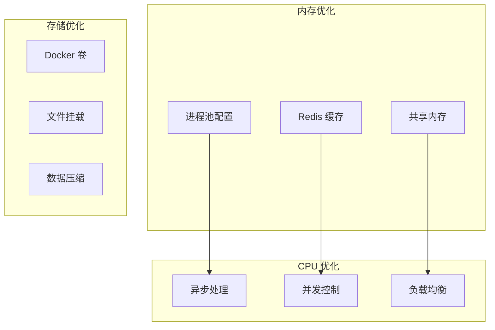

**优化措施：**
- 异步数据库操作
- Redis 缓存热点数据
- 进程池管理
- 文件系统优化

### 网络性能

系统网络架构经过精心设计以确保最佳性能：

- **服务发现**：通过 Docker 网络自动服务发现
- **负载均衡**：多实例部署支持水平扩展
- **连接池**：数据库和 Redis 连接池管理
- **超时配置**：合理的请求超时设置

## 故障排除指南

### 常见部署问题

#### 数据库连接问题

**症状**：后端服务启动失败，数据库连接错误

**诊断步骤：**
1. 检查 PostgreSQL 服务状态
2. 验证数据库凭据配置
3. 确认网络连通性
4. 查看数据库日志

**解决方案：**
```bash
# 检查数据库状态
docker-compose ps | grep postgres

# 进入数据库容器
docker exec -it novel_postgres psql -U novel_user -d novel_system

# 重启数据库服务
docker-compose restart postgres
```

#### 健康检查失败

**症状**：服务显示 unhealthy 状态

**诊断方法：**
1. 检查服务日志
2. 验证依赖服务状态
3. 确认端口映射正确

**排查命令：**
```bash
# 查看所有服务状态
docker-compose ps

# 查看特定服务日志
docker-compose logs backend

# 执行健康检查
curl http://localhost:8000/health
```

#### 端口冲突

**症状**：容器启动失败，端口被占用

**解决方法：**
```bash
# 检查端口使用情况
netstat -tulpn | grep ':8000\|:3000\|:5434'

# 修改 docker-compose.yml 中的端口映射
# 或停止占用端口的进程
```

#### 依赖安装失败

**症状**：Poetry 安装依赖失败

**解决方案：**
```bash
# 清理缓存重新安装
rm -rf ~/.cache/pypoetry
docker-compose build --no-cache

# 检查网络连接
ping mirrors.aliyun.com

# 使用代理（如需要）
export http_proxy=http://proxy.server.com:8080
export https_proxy=http://proxy.server.com:8080
```

### 开发环境调试

#### 热重载问题

**症状**：前端代码修改后不生效

**解决方法：**
1. 确认开发容器正常运行
2. 检查文件挂载是否正确
3. 重启开发服务器

**调试命令：**
```bash
# 检查文件挂载
docker-compose exec frontend ls -la /app/src

# 重启前端服务
docker-compose restart frontend

# 查看前端日志
docker-compose logs frontend
```

#### API 代理问题

**症状**：前端无法访问后端 API

**诊断步骤：**
1. 检查 API_PROXY_TARGET 环境变量
2. 验证后端服务状态
3. 确认 CORS 配置

**配置验证：**
```bash
# 检查环境变量
docker-compose exec frontend env | grep API_PROXY_TARGET

# 测试 API 连接
curl http://localhost:8000/health

# 检查网络连通性
docker-compose exec frontend ping backend
```

### 生产环境监控

#### 性能监控

```bash
# 查看资源使用情况
docker stats

# 监控服务日志
docker-compose logs -f --tail=100

# 检查数据库性能
docker-compose exec postgres pg_stat_statements_reset()
```

#### 故障恢复

```bash
# 快速恢复服务
docker-compose restart backend frontend postgres redis

# 清理并重新部署
./rebuild_docker.sh

# 检查磁盘空间
docker system df
```

**章节来源**
- [DEPLOYMENT_SUMMARY.md:210-253](file://DEPLOYMENT_SUMMARY.md#L210-L253)
- [docker-stop.sh:1-20](file://docker-stop.sh#L1-L20)

## 结论

小说生成系统的 Docker 部署方案提供了完整、可靠的容器化解决方案。通过精心设计的架构和完善的自动化工具，系统具备了以下优势：

### 核心优势

1. **完整的微服务架构**：清晰的服务边界和职责分离
2. **强大的自动化能力**：从构建到部署的全流程自动化
3. **灵活的环境配置**：支持开发和生产环境的无缝切换
4. **完善的监控机制**：内置健康检查和状态监控
5. **优秀的开发体验**：热重载和调试支持

### 技术亮点

- **多阶段构建优化**：减少镜像大小，提升部署效率
- **智能环境检测**：自动适配不同部署环境
- **健康检查集成**：确保服务可用性
- **数据持久化**：Docker 卷管理确保数据安全
- **网络隔离**：Docker 网络提供安全的服务通信

### 未来改进方向

1. **CI/CD 集成**：自动化测试和部署流水线
2. **监控告警**：更完善的性能监控和告警系统
3. **扩展性优化**：支持水平扩展和负载均衡
4. **安全性增强**：网络隔离和访问控制
5. **备份策略**：完善的数据备份和恢复机制

该部署方案为小说生成系统的稳定运行和持续发展奠定了坚实的基础，为后续的功能扩展和技术演进提供了良好的基础设施支持。