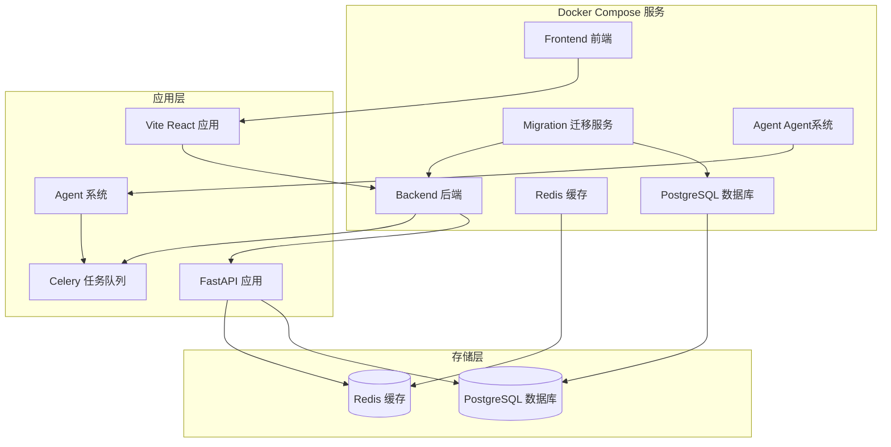
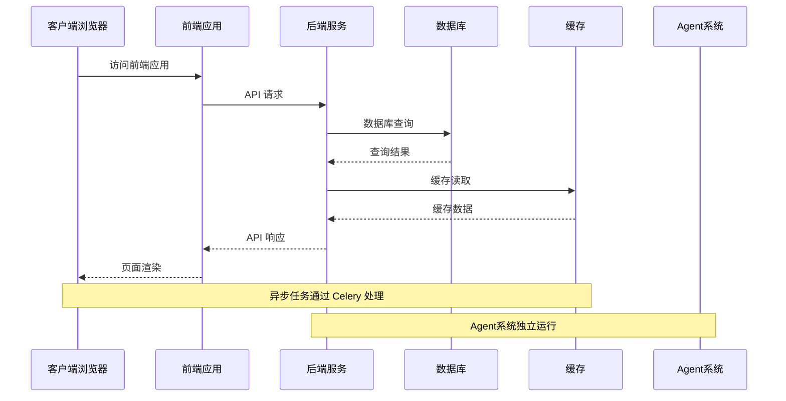
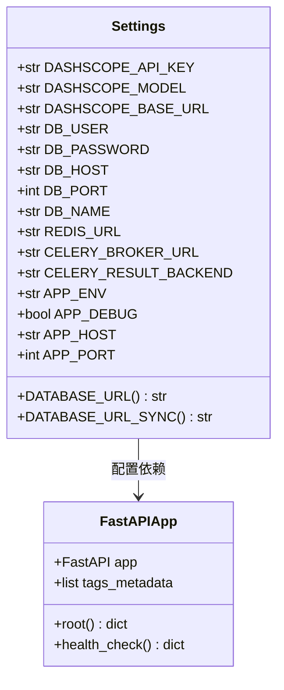
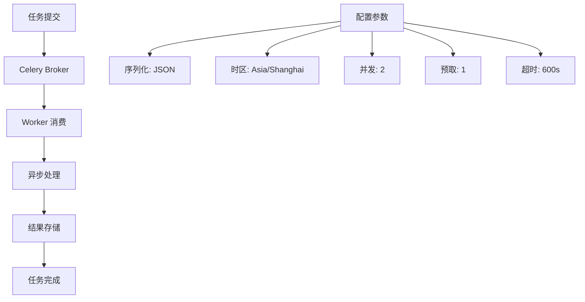
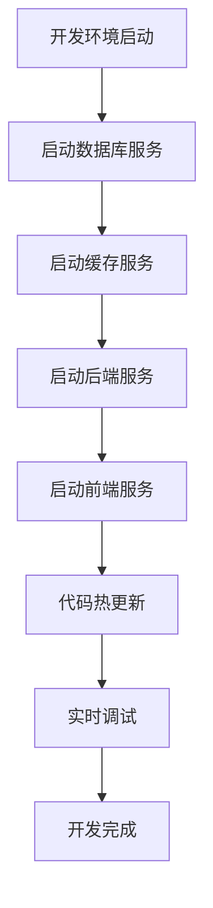
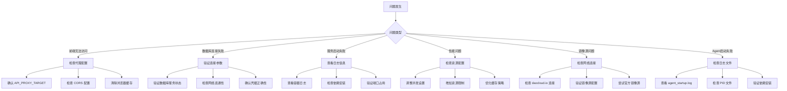

# Docker 部署

<cite>
**本文档引用的文件**
- [docker-compose.yml](file://docker-compose.yml)
- [docker-compose.dev.yml](file://docker-compose.dev.yml)
- [docker-compose.migration.yml](file://docker-compose.migration.yml)
- [Dockerfile.backend](file://Dockerfile.backend)
- [Dockerfile.frontend](file://Dockerfile.frontend)
- [docker-start.sh](file://docker-start.sh)
- [docker-stop.sh](file://docker-stop.sh)
- [frontend/docker-entrypoint.sh](file://frontend/docker-entrypoint.sh)
- [.env.example](file://.env.example)
- [pyproject.toml](file://pyproject.toml)
- [DOCKER_DEPLOY.md](file://DOCKER_DEPLOY.md)
- [LOCAL_DEV_GUIDE.md](file://LOCAL_DEV_GUIDE.md)
- [start_local_dev.sh](file://start_local_dev.sh)
- [scripts/init_local_dev.sh](file://scripts/init_local_dev.sh)
- [scripts/start_backend.sh](file://scripts/start_backend.sh)
- [scripts/start_frontend.sh](file://scripts/start_frontend.sh)
- [scripts/start_agents.sh](file://scripts/start_agents.sh)
- [scripts/stop_agents.sh](file://scripts/stop_agents.sh)
- [run_migration.sh](file://run_migration.sh)
</cite>

## 更新摘要
**变更内容**
- 新增开发环境Docker配置，支持代码热更新和挂载卷
- 新增数据库迁移Docker配置，提供一次性迁移服务
- 新增本地开发脚本，简化开发环境启动流程
- 新增Agent系统管理脚本，支持Agent的启动和停止
- 新增数据库迁移脚本，支持直接在容器中执行迁移
- 更新本地开发指南，提供多种开发模式选择

## 目录
1. [简介](#简介)
2. [项目结构](#项目结构)
3. [核心组件](#核心组件)
4. [架构概览](#架构概览)
5. [详细组件分析](#详细组件分析)
6. [开发环境配置](#开发环境配置)
7. [数据库迁移配置](#数据库迁移配置)
8. [本地开发脚本](#本地开发脚本)
9. [Agent系统管理](#agent系统管理)
10. [镜像源优化配置](#镜像源优化配置)
11. [部署流程](#部署流程)
12. [性能考虑](#性能考虑)
13. [故障排除指南](#故障排除指南)
14. [结论](#结论)

## 简介

小说生成系统是一个基于 Docker 的现代化 Web 应用，采用前后端分离架构，集成了 AI 内容生成、多 Agent 协作和自动化发布等功能。该系统提供了完整的 Docker 部署方案，支持快速启动、热重载和容器编排，并针对中国大陆开发者进行了镜像源优化，显著提升构建速度和可靠性。

系统现已支持多种部署模式：
- **生产环境部署**：完整的容器化部署，使用预构建镜像
- **开发环境部署**：代码热更新，支持挂载卷和实时调试
- **数据库迁移**：一次性迁移服务，确保数据库结构一致性
- **本地开发模式**：混合部署，后端本地运行，前端Docker容器

## 项目结构

系统采用微服务架构，包含以下主要组件：



**图表来源**
- [docker-compose.yml:1-112](file://docker-compose.yml#L1-L112)
- [docker-compose.dev.yml:6-103](file://docker-compose.dev.yml#L6-L103)
- [docker-compose.migration.yml:3-127](file://docker-compose.migration.yml#L3-L127)

**章节来源**
- [docker-compose.yml:1-112](file://docker-compose.yml#L1-L112)
- [docker-compose.dev.yml:6-103](file://docker-compose.dev.yml#L6-L103)
- [docker-compose.migration.yml:3-127](file://docker-compose.migration.yml#L3-L127)

## 核心组件

### 数据库服务 (PostgreSQL)

系统使用 PostgreSQL 作为主数据库，配置了完整的健康检查机制：

- **镜像版本**: m.daocloud.io/docker.io/postgres:17
- **端口映射**: 5434:5432
- **认证配置**: 用户名、密码、数据库名
- **数据持久化**: 使用 Docker 卷 `postgres_data`
- **健康检查**: 每10秒检查一次，超时5秒，最多重试5次
- **网络配置**: 使用自定义网络 `app-network`

### 缓存服务 (Redis)

Redis 提供缓存和消息队列功能：

- **镜像版本**: m.daocloud.io/docker.io/redis:6-alpine
- **端口映射**: 6379:6379
- **数据持久化**: 使用 Docker 卷 `redis_data`
- **健康检查**: 每10秒检查一次，超时3秒，最多重试5次
- **网络配置**: 使用自定义网络 `app-network`

### 后端服务 (FastAPI)

后端服务基于 Python 3.12 和 FastAPI 框架，经过镜像源优化：

- **镜像构建**: 基于 m.daocloud.io/docker.io/python:3.12-slim
- **依赖管理**: 使用 Poetry 1.8.2
- **镜像源优化**: 使用阿里云 pip 镜像源 https://mirrors.aliyun.com/pypi/simple/
- **端口暴露**: 8000
- **健康检查**: 每30秒检查一次，超时10秒，最多重试3次
- **重启策略**: unless-stopped
- **挂载目录**: 包含 backend、core、agents、llm、workers

### 前端服务 (React/Vite)

前端服务基于 Node.js 20 和 Vite，经过镜像源优化：

- **镜像构建**: 基于 m.daocloud.io/docker.io/node:20-alpine
- **开发服务器**: Vite 开发服务器
- **端口暴露**: 3000
- **镜像源优化**: 使用 npmmirror 镜像源 https://registry.npmmirror.com
- **挂载目录**: 包含 src 和 public 目录
- **网络配置**: 使用自定义网络 `app-network`

### 迁移服务 (数据库迁移)

提供一次性数据库迁移服务：

- **镜像构建**: 基于 Dockerfile.backend
- **执行命令**: alembic upgrade head
- **依赖关系**: 依赖健康状态的数据库服务
- **网络配置**: 使用外部网络 `novel_system_default`

### Agent系统

支持独立的Agent系统管理：

- **启动方式**: 使用Poetry运行Python脚本
- **日志管理**: 自动创建日志目录和PID文件
- **进程管理**: 支持优雅停止和强制终止
- **配置管理**: 通过环境变量配置Agent行为

**章节来源**
- [docker-compose.yml:1-112](file://docker-compose.yml#L1-L112)
- [docker-compose.dev.yml:37-103](file://docker-compose.dev.yml#L37-L103)
- [docker-compose.migration.yml:4-127](file://docker-compose.migration.yml#L4-L127)
- [Dockerfile.backend:1-42](file://Dockerfile.backend#L1-L42)
- [Dockerfile.frontend:1-28](file://Dockerfile.frontend#L1-L28)

## 架构概览

系统采用容器化微服务架构，实现了服务间的松耦合和独立部署：



**图表来源**
- [docker-compose.yml:36-103](file://docker-compose.yml#L36-L103)

## 详细组件分析

### 后端应用配置

后端应用使用 Pydantic 设置管理系统配置：



**图表来源**
- [pyproject.toml:8-37](file://pyproject.toml#L8-L37)

### Celery 任务队列

系统使用 Celery 处理异步任务，支持长任务和并发控制：



**图表来源**
- [pyproject.toml:18-18](file://pyproject.toml#L18-L18)

### 开发环境配置

开发环境支持代码热更新和挂载卷：



**图表来源**
- [docker-compose.dev.yml:69-96](file://docker-compose.dev.yml#L69-L96)

## 开发环境配置

### 开发环境Docker配置

系统提供了专门的开发环境配置，支持代码热更新和挂载卷：

- **配置文件**: `docker-compose.dev.yml`
- **启动命令**: `docker-compose -f docker-compose.dev.yml up`
- **热更新机制**: 使用挂载卷实现代码实时更新
- **开发模式**: APP_ENV=development, APP_DEBUG=true

### 开发环境特性

1. **代码热更新**
   - 后端: 使用 `pip install -e .` 和 `--reload` 参数
   - 前端: 使用 Vite HMR 实现热模块替换
   - 挂载卷: `./:/app:cached` 实现代码同步

2. **持久化依赖**
   - 后端依赖: `backend_packages:/usr/local/lib/python3.12/site-packages`
   - 前端依赖: `frontend_node_modules:/app/node_modules`

3. **开发工具集成**
   - 后端: Uvicorn 开发服务器
   - 前端: Vite 开发服务器
   - 环境变量: 自动配置开发环境参数

**章节来源**
- [docker-compose.dev.yml:3-103](file://docker-compose.dev.yml#L3-L103)

## 数据库迁移配置

### 迁移环境Docker配置

系统提供了专门的数据库迁移配置：

- **配置文件**: `docker-compose.migration.yml`
- **启动命令**: `docker-compose -f docker-compose.migration.yml up`
- **一次性执行**: 迁移完成后自动停止
- **独立服务**: 迁移服务与应用服务分离

### 迁移服务特性

1. **一次性执行**
   - 迁移完成后容器自动停止
   - 避免重复迁移问题
   - 确保数据库结构一致性

2. **依赖管理**
   - 依赖健康状态的数据库服务
   - 自动等待数据库就绪
   - 支持重试机制

3. **网络隔离**
   - 使用外部网络 `novel_system_default`
   - 与其他服务隔离
   - 避免端口冲突

**章节来源**
- [docker-compose.migration.yml:1-127](file://docker-compose.migration.yml#L1-L127)

## 本地开发脚本

### 自动初始化脚本

系统提供了完整的本地开发环境初始化脚本：

- **脚本文件**: `scripts/init_local_dev.sh`
- **功能**: 创建虚拟环境、安装依赖、配置环境变量
- **支持工具**: Poetry 和 pip 两种依赖管理方式

### 后端启动脚本

- **脚本文件**: `scripts/start_backend.sh`
- **功能**: 检查环境、连接数据库、执行迁移、启动服务
- **健康检查**: 自动检测 PostgreSQL 和 Redis 连接状态

### 前端启动脚本

- **脚本文件**: `scripts/start_frontend.sh`
- **功能**: 检查依赖、验证后端状态、启动开发服务器
- **自动安装**: 缺少依赖时自动安装

### 一键启动脚本

- **脚本文件**: `start_local_dev.sh`
- **功能**: 启动基础服务、检查数据库、提供启动选项
- **混合模式**: 数据库使用Docker，后端前端本地运行

**章节来源**
- [scripts/init_local_dev.sh:1-83](file://scripts/init_local_dev.sh#L1-L83)
- [scripts/start_backend.sh:1-51](file://scripts/start_backend.sh#L1-L51)
- [scripts/start_frontend.sh:1-44](file://scripts/start_frontend.sh#L1-L44)
- [start_local_dev.sh:1-93](file://start_local_dev.sh#L1-L93)

## Agent系统管理

### Agent启动脚本

系统提供了完整的Agent系统管理脚本：

- **启动脚本**: `scripts/start_agents.sh`
- **功能**: 创建日志目录、启动Agent系统、保存PID文件
- **日志管理**: 自动生成启动日志和运行日志

### Agent停止脚本

- **停止脚本**: `scripts/stop_agents.sh`
- **功能**: 优雅停止、强制终止、清理PID文件
- **安全机制**: 检查进程存在性和超时处理

### Agent系统特性

1. **进程管理**
   - 自动创建日志目录
   - 保存进程ID到PID文件
   - 支持优雅停止和强制终止

2. **监控功能**
   - 实时查看运行状态
   - 自动记录启动和停止时间
   - 提供详细的日志信息

3. **配置灵活性**
   - 通过环境变量配置Agent行为
   - 支持多种审查配置
   - 可扩展的Agent框架

**章节来源**
- [scripts/start_agents.sh:1-35](file://scripts/start_agents.sh#L1-L35)
- [scripts/stop_agents.sh:1-61](file://scripts/stop_agents.sh#L1-L61)

## 镜像源优化配置

### daocloud.io 镜像加速服务

系统全面采用 daocloud.io 提供的镜像加速服务，显著提升中国大陆地区的构建速度：

- **PostgreSQL 镜像**: m.daocloud.io/docker.io/postgres:17
- **Redis 镜像**: m.daocloud.io/docker.io/redis:6-alpine  
- **Python 镜像**: m.daocloud.io/docker.io/python:3.12-slim
- **Node.js 镜像**: m.daocloud.io/docker.io/node:20-alpine

### 后端镜像源优化

后端服务使用阿里云 pip 镜像源进行依赖安装：

- **PIP_INDEX_URL**: https://mirrors.aliyun.com/pypi/simple/
- **PIP_TRUSTED_HOST**: mirrors.aliyun.com
- **apt 源优化**: 将 deb.debian.org 替换为 mirrors.aliyun.com
- **Poetry 配置**: 使用阿里云镜像源加速依赖安装

### 前端镜像源优化

前端服务使用 npmmirror 镜像源进行包安装：

- **NPM_REGISTRY**: https://registry.npmmirror.com
- **apk 源优化**: 将 dl-cdn.alpinelinux.org 替换为 mirrors.aliyun.com

### 迁移脚本镜像源优化

数据库迁移脚本也采用了镜像源优化：

- **PostgreSQL 镜像**: 使用 daocloud.io 加速
- **apt 源优化**: 阿里云镜像源
- **SQL 执行**: 直接在容器中执行迁移命令

**章节来源**
- [Dockerfile.backend:1-42](file://Dockerfile.backend#L1-L42)
- [Dockerfile.frontend:1-28](file://Dockerfile.frontend#L1-L28)
- [docker-compose.yml:3-90](file://docker-compose.yml#L3-L90)
- [docker-compose.dev.yml:38-96](file://docker-compose.dev.yml#L38-L96)
- [docker-compose.migration.yml:6-106](file://docker-compose.migration.yml#L6-L106)
- [run_migration.sh:1-171](file://run_migration.sh#L1-L171)

## 部署流程

### 环境准备

1. **系统要求**
   - Docker Engine 20.10+
   - Docker Compose 2.0+
   - 至少 4GB RAM

2. **环境变量配置**
   ```bash
   # 复制示例配置
   cp .env.example .env
   
   # 配置 LLM API 密钥
   DASHSCOPE_API_KEY=your_api_key_here
   ```

### 部署模式选择

系统支持多种部署模式：

#### 生产环境部署
```bash
# 使用默认配置
docker-compose up -d

# 指定环境变量
DASHSCOPE_API_KEY=your_key docker-compose up -d
```

#### 开发环境部署
```bash
# 启动开发环境
docker-compose -f docker-compose.dev.yml up

# 启动基础服务
docker-compose -f docker-compose.dev.yml up -d postgres redis
```

#### 数据库迁移部署
```bash
# 执行数据库迁移
docker-compose -f docker-compose.migration.yml up
```

### 访问地址

- **前端应用**: http://localhost:3000
- **后端 API**: http://localhost:8000
- **API 文档**: http://localhost:8000/docs
- **健康检查**: http://localhost:8000/health

**章节来源**
- [docker-start.sh:1-33](file://docker-start.sh#L1-L33)
- [docker-stop.sh:1-20](file://docker-stop.sh#L1-L20)
- [DOCKER_DEPLOY.md:255-270](file://DOCKER_DEPLOY.md#L255-L270)
- [LOCAL_DEV_GUIDE.md:161-187](file://LOCAL_DEV_GUIDE.md#L161-L187)

## 性能考虑

### 资源分配

1. **内存配置**
   - 后端服务: 建议至少 1GB RAM
   - 前端服务: 建议至少 512MB RAM
   - 数据库: 建议至少 1GB RAM
   - 缓存: 建议至少 256MB RAM

2. **并发设置**
   - Celery 工作线程: 2个
   - 预取倍数: 1（避免长任务阻塞）
   - 任务超时: 600秒（10分钟）

### 网络优化

1. **容器间通信**
   - 使用服务名而非 IP 地址
   - 禁用 SSL 连接以提高性能
   - 配置适当的连接池大小

2. **缓存策略**
   - Redis 缓存热点数据
   - 前端静态资源缓存
   - API 响应缓存

3. **镜像源优化效果**
   - daocloud.io 加速服务减少镜像拉取时间
   - 阿里云 pip 镜像源提升 Python 依赖安装速度
   - npmmirror 镜像源提升 npm 包安装速度

4. **开发环境优化**
   - 挂载卷实现代码热更新
   - 持久化依赖避免重复安装
   - 分离的迁移服务确保数据库一致性

## 故障排除指南

### 常见问题及解决方案



**图表来源**
- [DOCKER_DEPLOY.md:147-218](file://DOCKER_DEPLOY.md#L147-L218)

### 调试工具

1. **日志查看**
   ```bash
   # 查看所有服务日志
   docker-compose logs -f
   
   # 查看特定服务日志
   docker-compose logs -f backend
   docker-compose logs -f frontend
   ```

2. **容器交互**
   ```bash
   # 进入后端容器
   docker exec -it novel_backend bash
   
   # 进入数据库容器
   docker exec -it novel_postgres psql -U novel_user -d novel_system
   ```

3. **网络诊断**
   ```bash
   # 检查服务状态
   docker-compose ps
   
   # 检查端口映射
   docker-compose port backend 8000
   ```

4. **Agent系统调试**
   ```bash
   # 查看Agent日志
   tail -f logs/agent_system.log
   
   # 检查Agent进程
   cat logs/agent.pid
   
   # 停止Agent系统
   ./scripts/stop_agents.sh
   ```

**章节来源**
- [DOCKER_DEPLOY.md:147-218](file://DOCKER_DEPLOY.md#L147-L218)

## 结论

小说生成系统的 Docker 部署方案提供了完整、可靠的容器化解决方案，并针对中国大陆开发者进行了专门优化。通过合理的架构设计、配置管理和镜像源优化，系统实现了：

- **高可用性**: 健康检查和自动重启机制
- **可扩展性**: 独立的服务容器和负载均衡
- **易维护性**: 统一的配置管理和部署流程
- **高性能**: 优化的资源分配、缓存策略和镜像源加速
- **国际化**: daocloud.io 镜像加速服务确保全球用户访问速度
- **开发友好**: 多种开发模式支持，从本地开发到生产部署

**新增功能总结**：
- **开发环境Docker配置**：支持代码热更新和挂载卷
- **数据库迁移Docker配置**：提供一次性迁移服务
- **本地开发脚本**：简化开发环境启动流程
- **Agent系统管理**：支持Agent的启动和停止
- **数据库迁移脚本**：支持直接在容器中执行迁移

该部署方案适合开发、测试和生产环境使用，为后续的功能扩展和运维管理奠定了坚实基础。镜像源优化配置显著提升了中国大陆地区用户的构建体验，减少了网络延迟和连接超时问题。多种部署模式的选择使得系统能够适应不同的使用场景和需求。