# 增强上下文管理器

<cite>
**本文档引用的文件**
- [enhanced_context_manager.py](file://agents/enhanced_context_manager.py)
- [context_manager.py](file://backend/services/context_manager.py)
- [team_context.py](file://agents/team_context.py)
- [context_compressor.py](file://agents/context_compressor.py)
- [continuity_integration.py](file://agents/continuity_integration.py)
- [continuity_inference.py](file://agents/continuity_inference.py)
- [continuity_validation.py](file://agents/continuity_validation.py)
- [context_propagator.py](file://agents/context_propagator.py)
- [foreshadowing_auto_injector.py](file://agents/foreshadowing_auto_injector.py)
- [foreshadowing_tracker.py](file://agents/foreshadowing_tracker.py)
- [generation_service.py](file://backend/services/generation_service.py)
- [test_context_compression_enhancement.py](file://tests/agents/test_context_compression_enhancement.py)
</cite>

## 更新摘要
**变更内容**
- 新增统一上下文管理器的LRU缓存策略实现
- 更新TTL过期机制的技术细节
- 增加自动同步机制的架构说明
- 补充性能监控系统的实现细节
- 更新缓存清理策略和内存管理机制

## 目录
1. [简介](#简介)
2. [项目结构](#项目结构)
3. [核心组件](#核心组件)
4. [架构概览](#架构概览)
5. [详细组件分析](#详细组件分析)
6. [依赖关系分析](#依赖关系分析)
7. [性能考量](#性能考量)
8. [故障排除指南](#故障排除指南)
9. [结论](#结论)

## 简介

增强上下文管理器是小说生成系统中的核心组件，旨在解决长篇小说创作中的上下文信息丢失问题。该系统采用四层记忆架构，确保关键信息在创作过程中得到妥善管理和利用。

系统的主要目标包括：
- **解决上下文信息丢失**：通过分层记忆架构确保重要信息不被遗忘
- **智能信息提取**：不仅仅是压缩，而是保留重要内容
- **动态上下文调整**：基于重要性和紧急程度动态调整上下文
- **连贯性保障**：确保章节间的逻辑连贯性和叙事一致性
- **统一存储管理**：通过LRU缓存和TTL机制实现高效的多层存储统一

## 项目结构

小说生成系统采用模块化设计，主要分为以下几个层次：

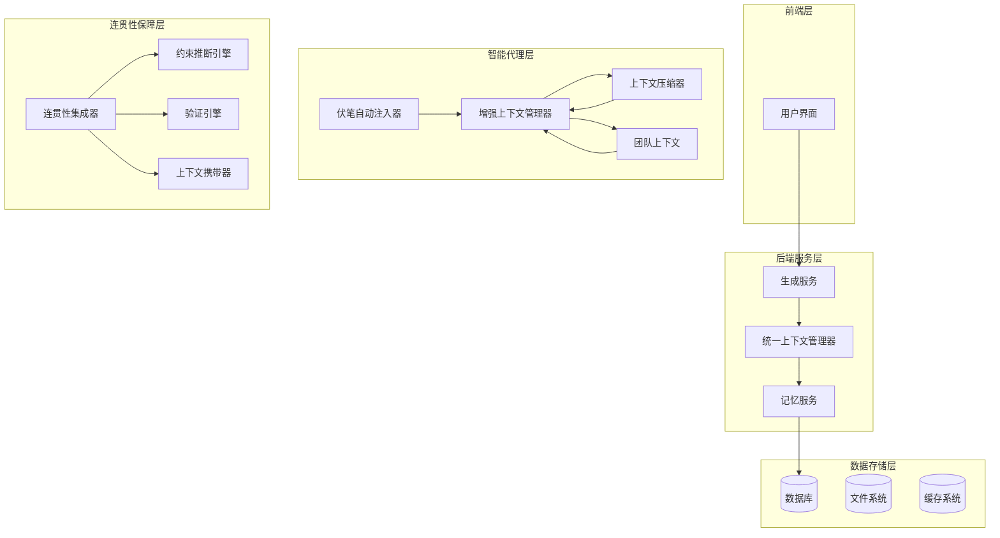

**图表来源**
- [generation_service.py:1-200](file://backend/services/generation_service.py#L1-L200)
- [context_manager.py:1-390](file://backend/services/context_manager.py#L1-L390)
- [enhanced_context_manager.py:1-573](file://agents/enhanced_context_manager.py#L1-L573)

**章节来源**
- [generation_service.py:1-200](file://backend/services/generation_service.py#L1-L200)
- [context_manager.py:1-390](file://backend/services/context_manager.py#L1-L390)

## 核心组件

### 四层记忆架构

系统采用创新的四层记忆架构，确保不同重要性的信息得到适当处理：

#### 1. 核心层（Core Layer）
- **职责**：小说的核心要素，始终携带
- **包含内容**：核心主题、核心问题、主线冲突、主角终极目标、类型
- **特点**：永不丢失，提供创作的基本框架

#### 2. 关键层（Critical Layer）
- **职责**：必须在上下文中保留的信息
- **包含内容**：伏笔、未解决冲突、角色重大决策
- **特点**：基于重要性和紧急程度动态调整

#### 3. 近期层（Recent Layer）
- **职责**：最近章节的详细信息
- **包含内容**：详细摘要、结尾原文
- **特点**：最近3章的内容，提供最新情境

#### 4. 历史层（Historical Layer）
- **职责**：早期章节的索引式回顾
- **包含内容**：卷级摘要、关键事件索引
- **特点**：更早章节的概括性信息

**章节来源**
- [enhanced_context_manager.py:20-201](file://agents/enhanced_context_manager.py#L20-L201)

### 统一上下文管理器

统一上下文管理器是系统的核心存储管理层，实现了三层存储的统一管理：

#### LRU缓存策略

统一上下文管理器采用了先进的LRU（最近最少使用）缓存策略，结合TTL（生存时间）过期机制：

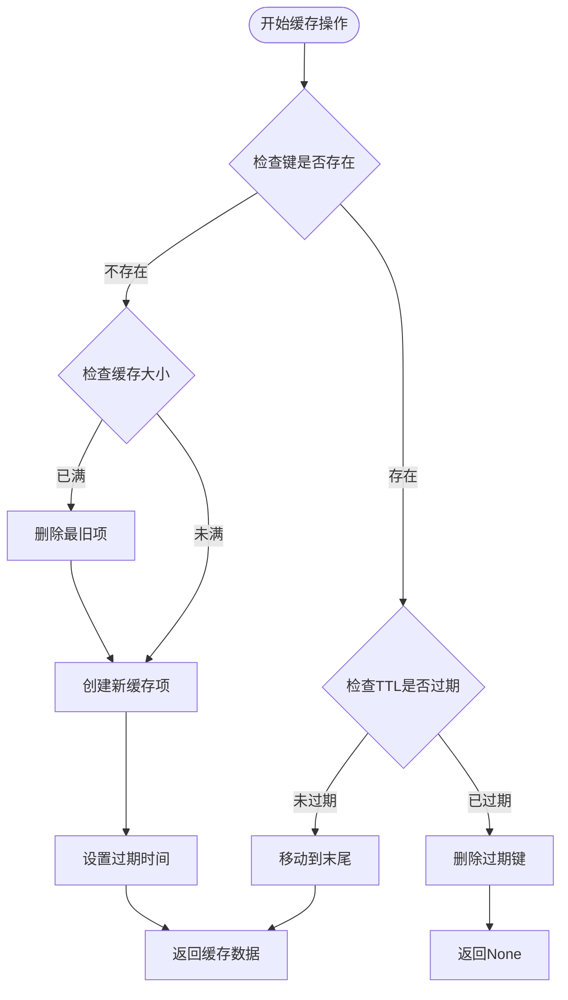

**图表来源**
- [context_manager.py:33-97](file://backend/services/context_manager.py#L33-L97)

#### 自动同步机制

统一上下文管理器实现了智能的自动同步机制，确保三层存储的一致性：

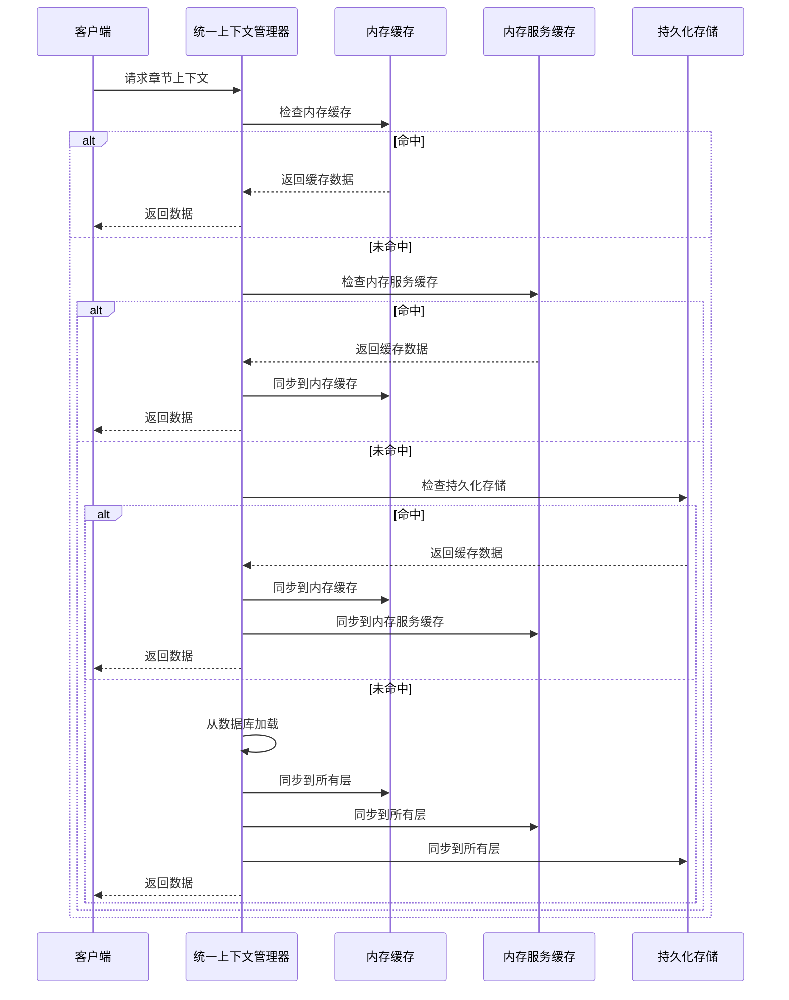

**图表来源**
- [context_manager.py:157-250](file://backend/services/context_manager.py#L157-L250)

#### TTL过期管理

统一上下文管理器实现了精确的TTL（Time-To-Live）过期管理机制：

**章节来源**
- [context_manager.py:33-97](file://backend/services/context_manager.py#L33-L97)

### 上下文压缩器

上下文压缩器采用动态压缩策略，确保上下文大小保持在恒定水平：

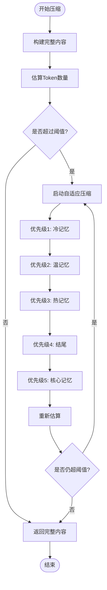

**图表来源**
- [context_compressor.py:249-318](file://agents/context_compressor.py#L249-L318)

**章节来源**
- [context_compressor.py:112-318](file://agents/context_compressor.py#L112-L318)

## 架构概览

增强上下文管理器系统采用分层架构设计，各组件协同工作：

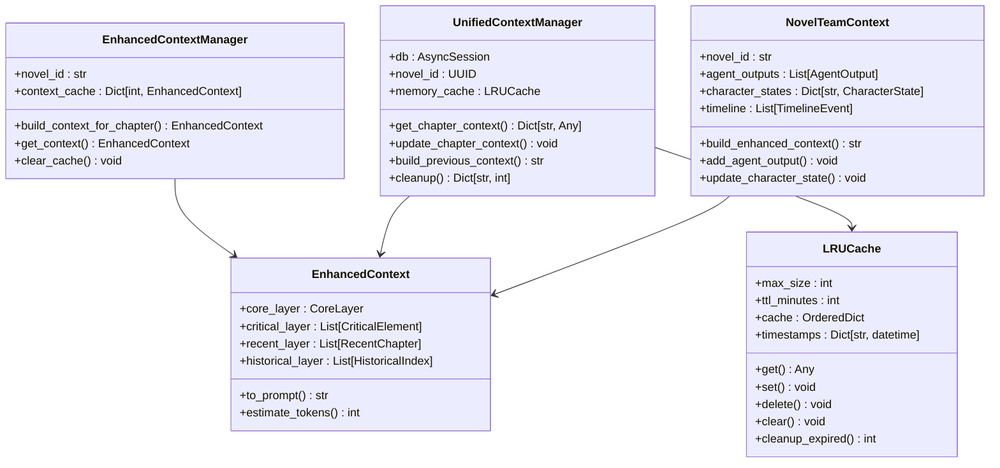

**图表来源**
- [enhanced_context_manager.py:209-563](file://agents/enhanced_context_manager.py#L209-L563)
- [context_manager.py:99-390](file://backend/services/context_manager.py#L99-L390)
- [team_context.py:173-638](file://agents/team_context.py#L173-L638)

**章节来源**
- [enhanced_context_manager.py:209-563](file://agents/enhanced_context_manager.py#L209-L563)
- [context_manager.py:99-390](file://backend/services/context_manager.py#L99-L390)
- [team_context.py:173-638](file://agents/team_context.py#L173-L638)

## 详细组件分析

### 增强上下文管理器

增强上下文管理器是系统的核心组件，负责构建和管理小说创作所需的上下文信息。

#### 核心数据结构

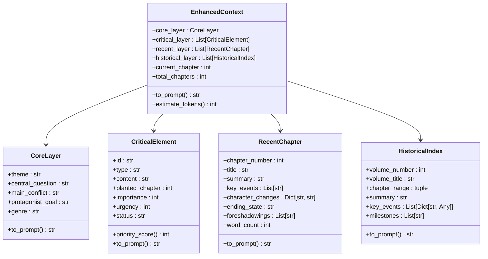

**图表来源**
- [enhanced_context_manager.py:20-201](file://agents/enhanced_context_manager.py#L20-L201)

#### 关键层构建算法

关键层的构建是系统的核心功能之一，通过智能识别"如果这章不写，后面就忘了"的信息：

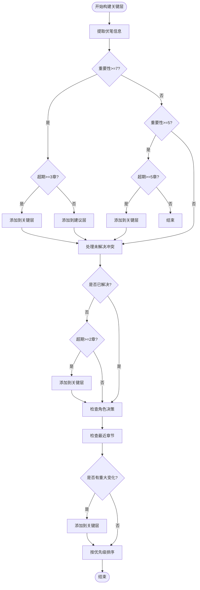

**图表来源**
- [enhanced_context_manager.py:314-424](file://agents/enhanced_context_manager.py#L314-L424)

**章节来源**
- [enhanced_context_manager.py:209-563](file://agents/enhanced_context_manager.py#L209-L563)

### 团队上下文管理

团队上下文管理器实现了Agent之间的信息共享和状态追踪：

#### Agent协作机制

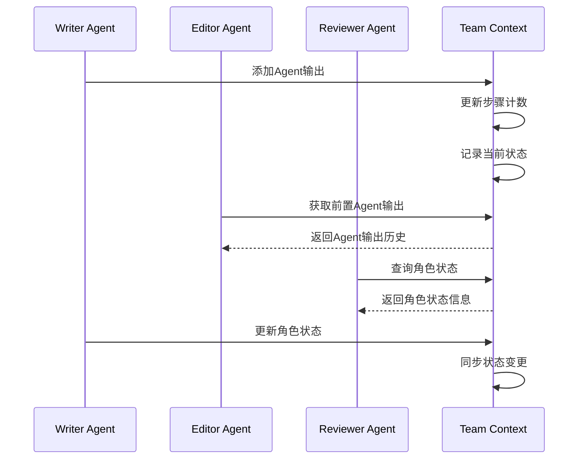

**图表来源**
- [team_context.py:303-364](file://agents/team_context.py#L303-L364)

**章节来源**
- [team_context.py:173-638](file://agents/team_context.py#L173-L638)

### 连贯性保障系统

连贯性保障系统确保章节间的逻辑连贯性和叙事一致性：

#### 约束推断引擎

约束推断引擎通过分析上一章内容自动推断读者期待和连贯性约束：

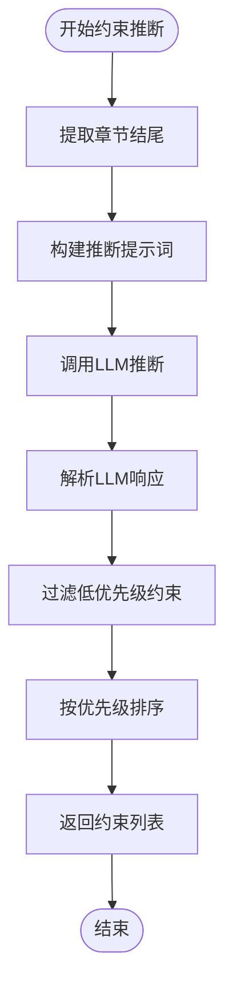

**图表来源**
- [continuity_inference.py:73-146](file://agents/continuity_inference.py#L73-L146)

#### 验证引擎

验证引擎使用LLM评估新章节是否满足连贯性约束：

**章节来源**
- [continuity_inference.py:17-273](file://agents/continuity_inference.py#L17-L273)
- [continuity_validation.py:20-360](file://agents/continuity_validation.py#L20-L360)

### 伏笔管理系统

伏笔管理系统确保小说中的伏笔得到妥善管理和追踪：

#### 伏笔自动注入器

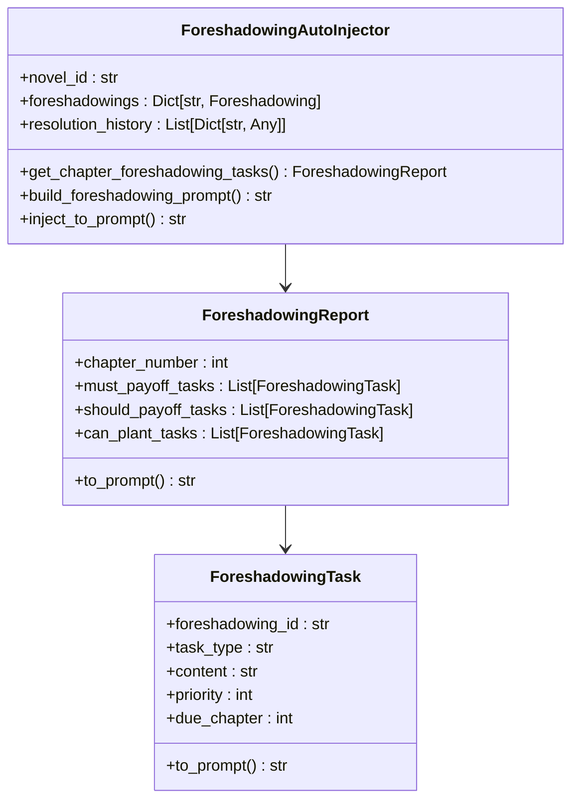

**图表来源**
- [foreshadowing_auto_injector.py:194-315](file://agents/foreshadowing_auto_injector.py#L194-L315)

**章节来源**
- [foreshadowing_auto_injector.py:194-641](file://agents/foreshadowing_auto_injector.py#L194-L641)

## 依赖关系分析

系统采用松耦合的设计，各组件之间通过清晰的接口进行交互：

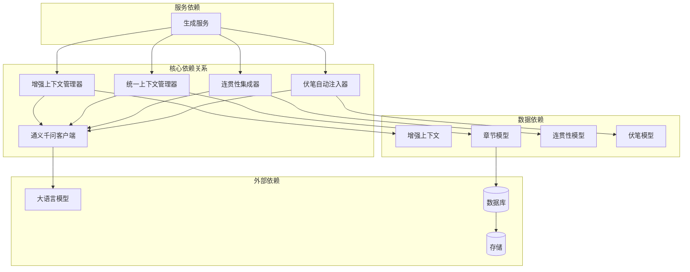

**图表来源**
- [generation_service.py:34-106](file://backend/services/generation_service.py#L34-L106)
- [continuity_integration.py:24-47](file://agents/continuity_integration.py#L24-L47)

**章节来源**
- [generation_service.py:34-106](file://backend/services/generation_service.py#L34-L106)
- [continuity_integration.py:24-47](file://agents/continuity_integration.py#L24-L47)

## 性能考量

系统在设计时充分考虑了性能优化：

### 缓存策略

1. **多级缓存架构**：内存缓存 + 内存服务缓存 + 持久化缓存
2. **LRU淘汰机制**：确保热门数据优先保留
3. **TTL过期管理**：自动清理过期数据
4. **智能同步**：跨层数据同步，避免重复计算
5. **内存清理策略**：定期清理过期缓存，防止内存泄漏

### 上下文压缩优化

1. **动态压缩策略**：只有在超阈值时才启动压缩
2. **优先级压缩**：核心记忆优先保留，其他内容按优先级压缩
3. **完整内容保留**：_build_xxx_full方法确保关键内容不被截取
4. **安全系数**：预留10%的安全余量，避免边界溢出

### 并发处理

1. **异步操作**：所有数据库操作采用异步模式
2. **线程安全**：使用asyncio.Lock保证并发安全性
3. **资源池管理**：合理管理LLM调用资源

### 性能监控

统一上下文管理器实现了完善的性能监控系统：

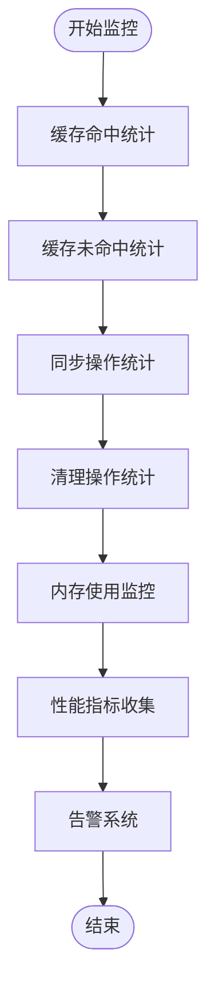

**图表来源**
- [context_manager.py:360-390](file://backend/services/context_manager.py#L360-L390)

**章节来源**
- [context_manager.py:360-390](file://backend/services/context_manager.py#L360-L390)

## 故障排除指南

### 常见问题及解决方案

#### 上下文过大问题

**问题现象**：生成内容时上下文超限

**解决方案**：
1. 检查ContextCompressor的阈值设置
2. 验证动态压缩机制是否正常工作
3. 确认优先级压缩策略是否正确执行

#### Agent协作问题

**问题现象**：Agent间信息共享失败

**解决方案**：
1. 检查NovelTeamContext的锁机制
2. 验证异步操作的正确性
3. 确认数据序列化/反序列化过程

#### 连贯性验证失败

**问题现象**：章节过渡验证未通过

**解决方案**：
1. 检查约束推断引擎的LLM调用
2. 验证验证引擎的评分机制
3. 确认上下文携带器的提示词构建

#### 缓存失效问题

**问题现象**：统一上下文管理器缓存频繁失效

**解决方案**：
1. 检查TTL配置是否合理
2. 验证LRU缓存容量设置
3. 确认自动同步机制是否正常工作
4. 检查内存清理策略的有效性

**章节来源**
- [context_compressor.py:249-318](file://agents/context_compressor.py#L249-L318)
- [team_context.py:244-268](file://agents/team_context.py#L244-L268)
- [continuity_validation.py:90-150](file://agents/continuity_validation.py#L90-L150)

## 结论

增强上下文管理器系统通过创新的四层记忆架构和智能压缩策略，有效解决了长篇小说创作中的上下文信息丢失问题。系统的主要优势包括：

1. **多层次记忆架构**：确保不同重要性的信息得到适当处理
2. **智能信息提取**：不仅仅是压缩，而是保留重要内容
3. **动态上下文调整**：基于重要性和紧急程度动态调整上下文
4. **连贯性保障**：确保章节间的逻辑连贯性和叙事一致性
5. **高效性能**：通过多级缓存和智能压缩确保系统性能
6. **统一存储管理**：通过LRU缓存和TTL机制实现高效的多层存储统一
7. **自动同步机制**：确保三层存储的一致性和可靠性
8. **完善的性能监控**：实时监控系统性能并提供告警机制

该系统为小说生成提供了强大的上下文支持，能够帮助创作者保持故事的一致性和连贯性，同时确保重要的情节线索不会在创作过程中丢失。统一上下文管理器的实现进一步提升了系统的可靠性和性能表现，为大规模小说生成应用提供了坚实的技术基础。