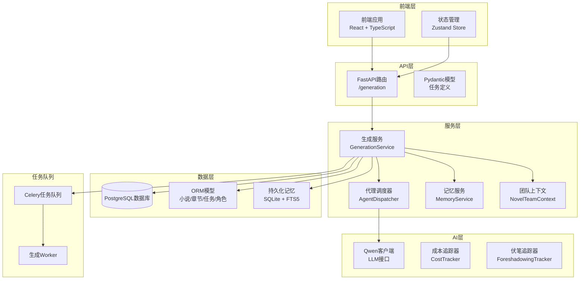
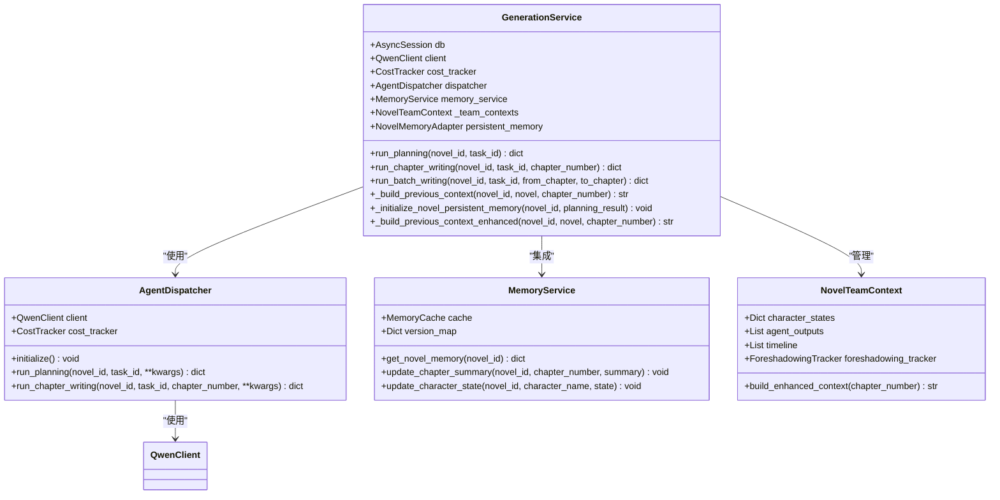
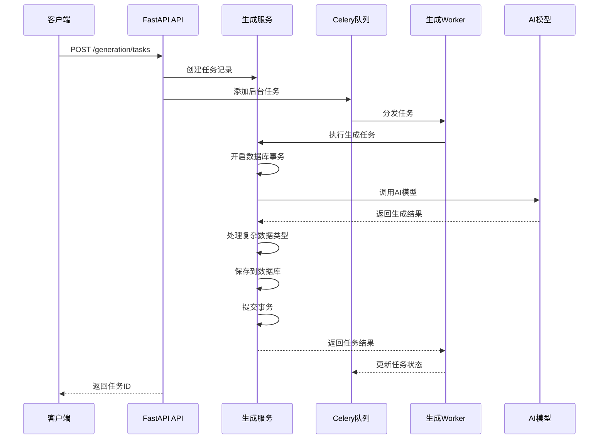
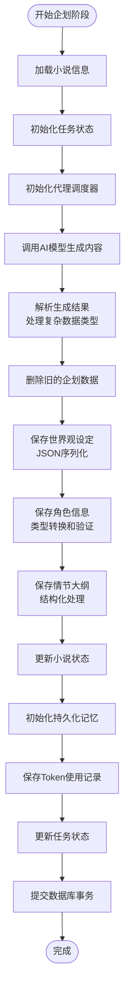
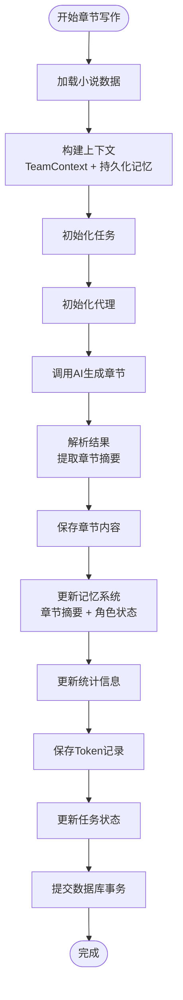
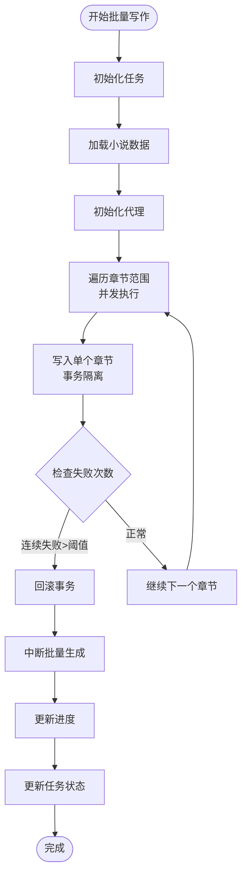
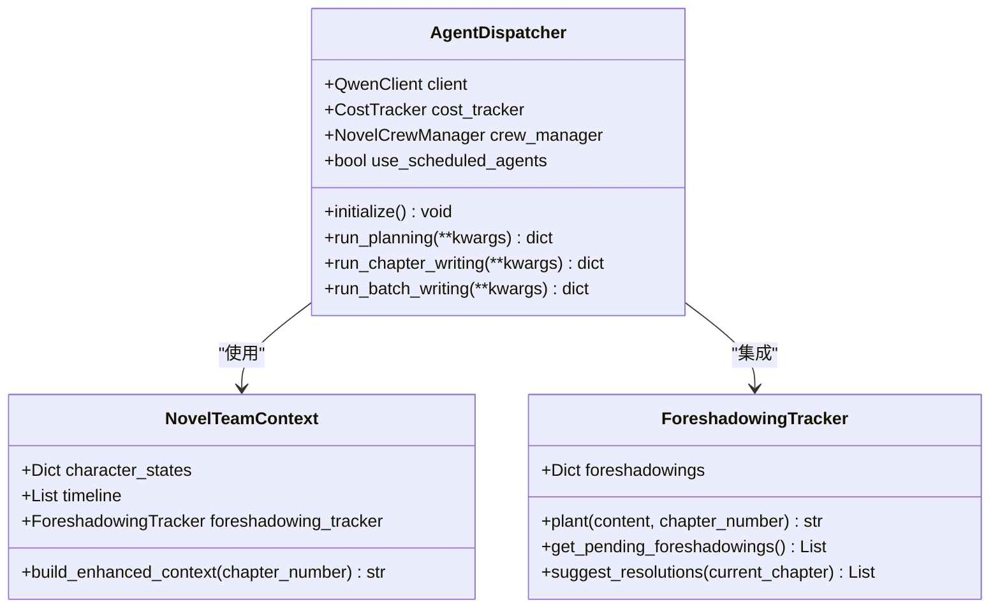
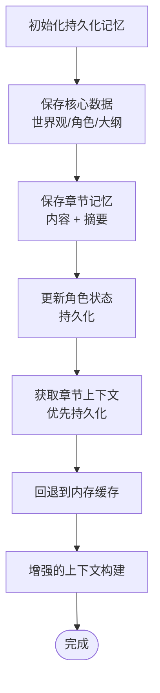
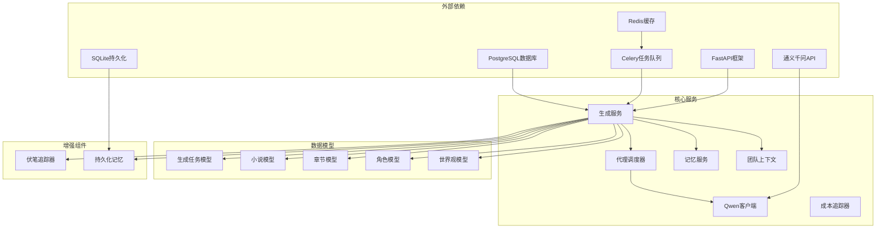
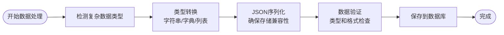

# 生成服务

<cite>
**本文档引用的文件**
- [generation_service.py](file://backend/services/generation_service.py)
- [generation.py](file://backend/api/v1/generation.py)
- [generation_worker.py](file://workers/generation_worker.py)
- [generation_task.py](file://core/models/generation_task.py)
- [qwen_client.py](file://llm/qwen_client.py)
- [agent_dispatcher.py](file://agents/agent_dispatcher.py)
- [generation.py](file://backend/schemas/generation.py)
- [useGenerationStore.ts](file://frontend/src/stores/useGenerationStore.ts)
- [celery_app.py](file://workers/celery_app.py)
- [novel.py](file://core/models/novel.py)
- [config.py](file://backend/config.py)
- [character.py](file://core/models/character.py)
- [world_setting.py](file://core/models/world_setting.py)
- [team_context.py](file://agents/team_context.py)
- [foreshadowing_tracker.py](file://agents/foreshadowing_tracker.py)
- [memory_service.py](file://backend/services/memory_service.py)
</cite>

## 更新摘要
**所做更改**
- 更新了数据库事务管理和回滚机制的说明
- 增强了角色数据处理逻辑的描述
- 添加了复杂数据类型的自动序列化支持
- 扩展了持久化记忆系统的介绍
- 更新了TeamContext和伏笔追踪系统的说明

## 目录
1. [简介](#简介)
2. [项目结构](#项目结构)
3. [核心组件](#核心组件)
4. [架构概览](#架构概览)
5. [详细组件分析](#详细组件分析)
6. [依赖关系分析](#依赖关系分析)
7. [性能考虑](#性能考虑)
8. [故障排除指南](#故障排除指南)
9. [结论](#结论)

## 简介

生成服务是小说创作自动化系统的核心模块，负责协调AI代理完成小说的企划、写作和批量生成任务。该服务通过异步架构设计，结合FastAPI后端、Celery任务队列和多种AI模型，实现了高效的小说生成流水线。

系统支持三种主要任务类型：
- **企划阶段**：生成世界观设定、角色信息和情节大纲
- **单章写作**：生成单个章节的完整内容
- **批量写作**：并行生成多个章节内容

**更新** 本次更新重点增强了数据库事务管理、角色数据处理和复杂数据类型的序列化能力，同时集成了持久化记忆系统和TeamContext协作机制。

## 项目结构

生成服务位于项目的后端服务层，采用分层架构设计：

**图表来源**
- [generation_service.py](file://backend/services/generation_service.py#L33-L70)
- [generation.py](file://backend/api/v1/generation.py#L20-L20)
- [generation_worker.py](file://workers/generation_worker.py#L12-L18)

**章节来源**
- [generation_service.py](file://backend/services/generation_service.py#L1-L1155)
- [generation.py](file://backend/api/v1/generation.py#L1-L171)

## 核心组件

### 生成服务 (GenerationService)

生成服务是整个系统的核心协调器，负责：

- **任务编排**：协调不同类型的生成任务
- **数据持久化**：将生成结果保存到数据库，支持事务回滚
- **成本控制**：追踪和管理AI模型调用成本
- **状态管理**：维护任务的生命周期状态
- **复杂数据处理**：自动序列化复杂数据类型
- **持久化记忆**：集成SQLite持久化记忆系统

**图表来源**
- [generation_service.py](file://backend/services/generation_service.py#L33-L70)
- [agent_dispatcher.py](file://agents/agent_dispatcher.py#L17-L83)
- [memory_service.py](file://backend/services/memory_service.py#L74-L171)
- [team_context.py](file://agents/team_context.py#L162-L230)

### API接口层

API层提供了RESTful接口来管理生成任务：

- **POST /generation/tasks**：创建新的生成任务
- **GET /generation/tasks**：获取任务列表
- **GET /generation/tasks/{task_id}**：获取特定任务状态
- **POST /generation/tasks/{task_id}/cancel**：取消任务

**章节来源**
- [generation.py](file://backend/api/v1/generation.py#L23-L103)
- [generation.py](file://backend/api/v1/generation.py#L106-L171)

### 任务队列系统

系统采用Celery分布式任务队列来处理长时间运行的任务：

- **规划任务**：`run_planning_task`
- **写作任务**：`run_writing_task`
- **批量任务**：自动批处理多个章节

**章节来源**
- [generation_worker.py](file://workers/generation_worker.py#L58-L70)
- [celery_app.py](file://workers/celery_app.py#L6-L26)

## 架构概览

生成服务采用异步事件驱动架构，支持高并发和可扩展性：

**图表来源**
- [generation.py](file://backend/api/v1/generation.py#L73-L101)
- [generation_worker.py](file://workers/generation_worker.py#L21-L34)

## 详细组件分析

### 企划阶段 (Planning Phase)

企划阶段负责生成小说的基础框架，现支持增强的数据处理和事务管理：

**图表来源**
- [generation_service.py](file://backend/services/generation_service.py#L71-L276)

**章节来源**
- [generation_service.py](file://backend/services/generation_service.py#L71-L276)

### 单章写作 (Chapter Writing)

单章写作流程包括上下文构建、内容生成和增强的记忆管理：

**图表来源**
- [generation_service.py](file://backend/services/generation_service.py#L277-L514)

**章节来源**
- [generation_service.py](file://backend/services/generation_service.py#L277-L514)

### 批量写作 (Batch Writing)

批量写作支持连续章节的并行生成，具备增强的错误处理和事务管理：

**图表来源**
- [generation_service.py](file://backend/services/generation_service.py#L516-L738)

**章节来源**
- [generation_service.py](file://backend/services/generation_service.py#L516-L738)

### 代理调度器 (Agent Dispatcher)

代理调度器负责协调不同类型的AI代理，现支持增强的TeamContext协作：

**图表来源**
- [agent_dispatcher.py](file://agents/agent_dispatcher.py#L17-L83)
- [team_context.py](file://agents/team_context.py#L162-L230)
- [foreshadowing_tracker.py](file://agents/foreshadowing_tracker.py#L120-L200)

**章节来源**
- [agent_dispatcher.py](file://agents/agent_dispatcher.py#L17-L487)

### 持久化记忆系统

新增的持久化记忆系统提供长期存储能力：

**图表来源**
- [generation_service.py](file://backend/services/generation_service.py#L1083-L1155)

**章节来源**
- [generation_service.py](file://backend/services/generation_service.py#L1083-L1155)

## 依赖关系分析

生成服务的依赖关系呈现清晰的分层结构，现包含增强的记忆和协作组件：

**图表来源**
- [generation_service.py](file://backend/services/generation_service.py#L12-L27)
- [agent_dispatcher.py](file://agents/agent_dispatcher.py#L7-L14)

**章节来源**
- [generation_service.py](file://backend/services/generation_service.py#L1-L1155)
- [agent_dispatcher.py](file://agents/agent_dispatcher.py#L1-L487)

## 性能考虑

### 异步处理优化

系统采用异步编程模型来提高性能：

- **异步数据库操作**：使用SQLAlchemy异步会话
- **异步AI调用**：支持流式响应和重试机制
- **并发任务处理**：Celery支持多worker并发执行
- **事务管理**：支持回滚操作确保数据一致性

### 增强的数据处理

**图表来源**
- [generation_service.py](file://backend/services/generation_service.py#L177-L197)

### 缓存策略

- **记忆系统**：使用Redis缓存章节摘要和角色状态
- **上下文优化**：智能选择结构化摘要而非全文内容
- **任务状态缓存**：快速查询任务执行状态
- **持久化记忆**：SQLite + FTS5提供长期存储

### 事务管理增强

系统现在支持完整的事务管理：

- **自动回滚**：异常情况下自动回滚数据库操作
- **状态一致性**：确保任务状态和数据状态同步
- **错误恢复**：支持部分失败的章节继续处理
- **资源清理**：异常情况下清理临时资源

## 故障排除指南

### 常见问题及解决方案

| 问题类型 | 症状 | 解决方案 |
|---------|------|----------|
| LLM调用失败 | 任务状态变为failed | 检查API密钥和网络连接 |
| 数据库连接异常 | 无法保存生成结果 | 验证数据库配置和连接池 |
| 任务超时 | Celery任务长时间运行 | 调整任务超时设置 |
| Token耗尽 | 生成被意外停止 | 检查成本追踪和预算限制 |
| 事务回滚 | 部分数据丢失 | 检查异常处理和回滚逻辑 |
| 持久化失败 | 记忆数据丢失 | 验证SQLite配置和权限 |

### 日志监控

系统提供详细的日志记录：

- **任务状态变更**：记录每个任务的开始、完成和失败
- **Token使用**：追踪每次AI调用的成本
- **错误信息**：保存详细的异常堆栈信息
- **事务状态**：记录数据库操作的开始和结束

**章节来源**
- [generation_service.py](file://backend/services/generation_service.py#L265-L275)
- [generation_service.py](file://backend/services/generation_service.py#L508-L514)

## 结论

生成服务通过精心设计的架构实现了高效的小说自动化生成。其核心优势包括：

1. **模块化设计**：清晰的分层架构便于维护和扩展
2. **异步处理**：支持高并发和良好的用户体验
3. **成本控制**：完善的Token追踪和预算管理
4. **可扩展性**：支持多种AI模型和代理类型
5. **可靠性**：完善的错误处理和任务恢复机制
6. **增强的数据处理**：支持复杂数据类型的自动序列化
7. **持久化记忆**：提供长期存储和跨会话状态保持
8. **团队协作**：集成TeamContext和伏笔追踪系统

该系统为AI驱动的小说创作提供了坚实的技术基础，支持从简单的故事生成到复杂长篇小说的完整创作流程。新增的事务管理、数据处理和持久化功能进一步提升了系统的稳定性和实用性。