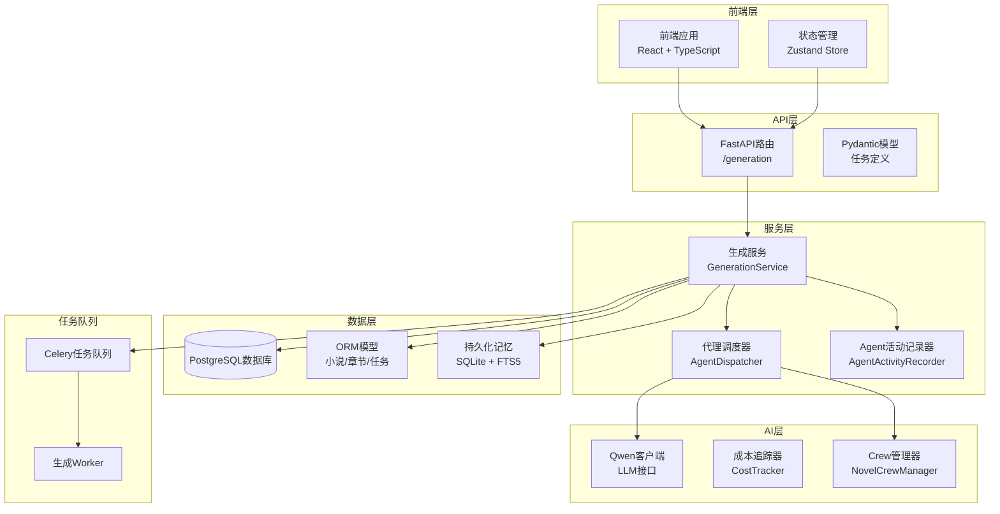
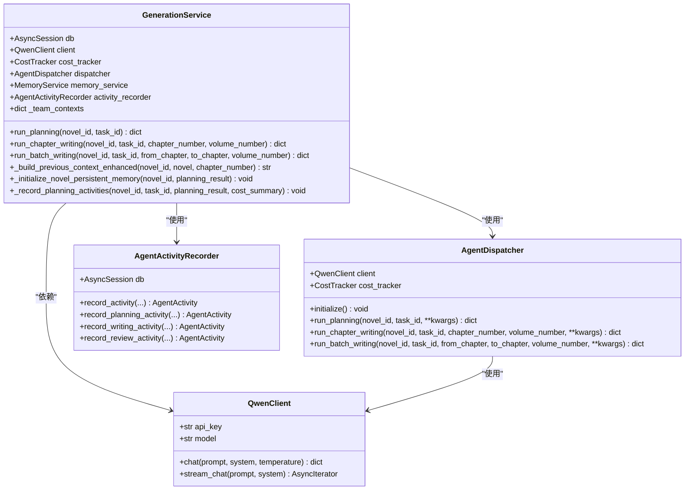
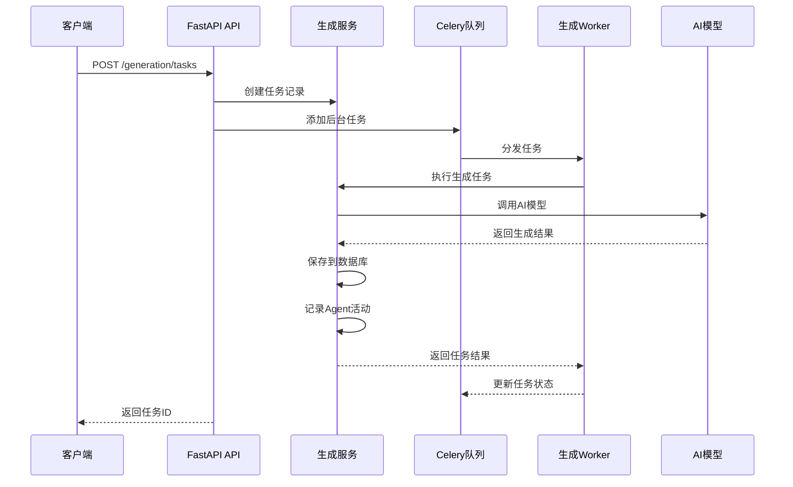
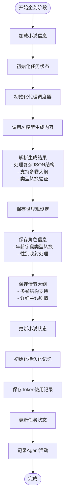
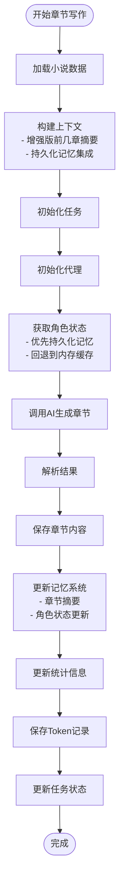
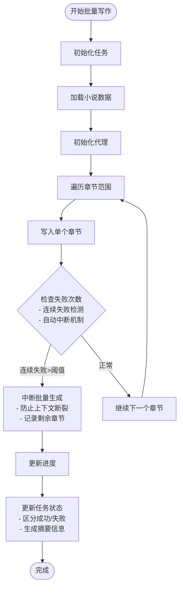
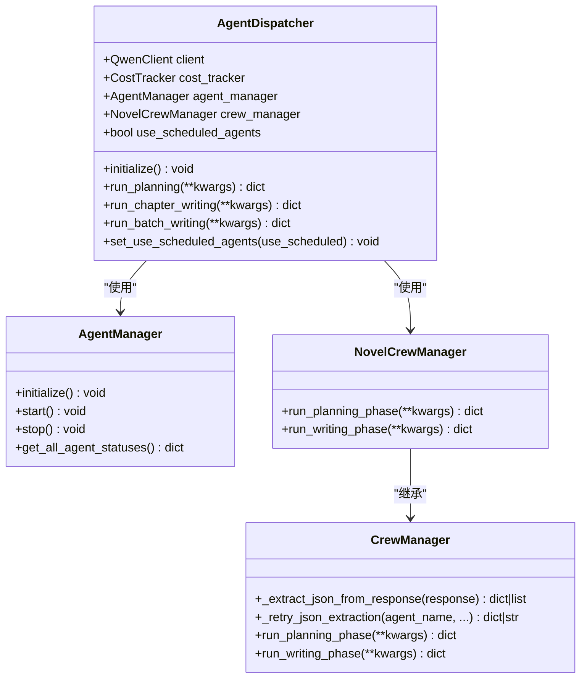
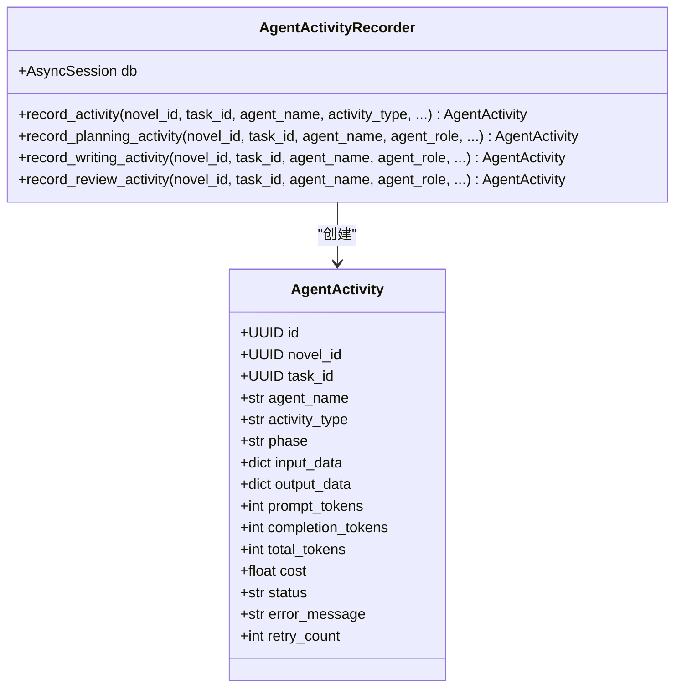
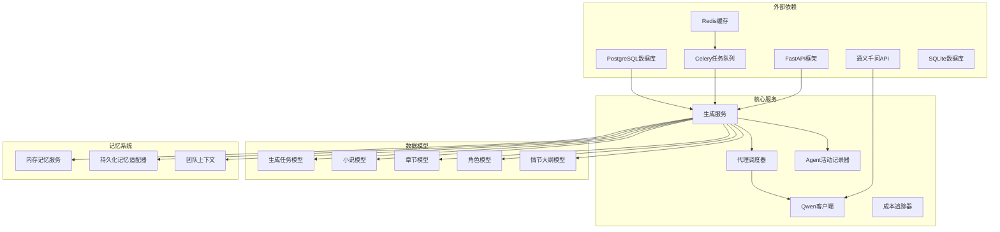

# 生成服务

<cite>
**本文档引用的文件**
- [generation_service.py](file://backend/services/generation_service.py)
- [generation.py](file://backend/api/v1/generation.py)
- [generation_worker.py](file://workers/generation_worker.py)
- [generation_task.py](file://core/models/generation_task.py)
- [qwen_client.py](file://llm/qwen_client.py)
- [agent_dispatcher.py](file://agents/agent_dispatcher.py)
- [generation.py](file://backend/schemas/generation.py)
- [useGenerationStore.ts](file://frontend/src/stores/useGenerationStore.ts)
- [celery_app.py](file://workers/celery_app.py)
- [novel.py](file://core/models/novel.py)
- [config.py](file://backend/config.py)
- [cost_tracker.py](file://llm/cost_tracker.py)
- [plot_outline.py](file://core/models/plot_outline.py)
- [crew_manager.py](file://agents/crew_manager.py)
- [agent_activity_recorder.py](file://backend/services/agent_activity_recorder.py)
- [agent_mesh_memory_adapter.py](file://backend/services/agentmesh_memory_adapter.py)
- [memory_service.py](file://backend/services/memory_service.py)
- [team_context.py](file://agents/team_context.py)
</cite>

## 更新摘要
**所做更改**
- 增强了规划阶段的数据处理能力，包括对复杂LLM响应数据结构的处理
- 新增字符年龄字段的类型转换机制
- 实现情节大纲的多卷结构支持
- 改进了成本跟踪和错误处理机制
- 新增Agent活动记录功能
- 增强了持久化记忆系统

## 目录
1. [简介](#简介)
2. [项目结构](#项目结构)
3. [核心组件](#核心组件)
4. [架构概览](#架构概览)
5. [详细组件分析](#详细组件分析)
6. [依赖关系分析](#依赖关系分析)
7. [性能考虑](#性能考虑)
8. [故障排除指南](#故障排除指南)
9. [结论](#结论)

## 简介

生成服务是小说创作自动化系统的核心模块，负责协调AI代理完成小说的企划、写作和批量生成任务。该服务通过异步架构设计，结合FastAPI后端、Celery任务队列和多种AI模型，实现了高效的小说生成流水线。

系统支持三种主要任务类型：
- **企划阶段**：生成世界观设定、角色信息和情节大纲
- **单章写作**：生成单个章节的完整内容
- **批量写作**：并行生成多个章节内容

**更新** 增强了规划阶段的数据处理能力，包括对复杂LLM响应数据结构的处理、字符年龄字段的类型转换、情节大纲的多卷结构支持，以及改进的成本跟踪和错误处理机制

## 项目结构

生成服务位于项目的后端服务层，采用分层架构设计：

**图表来源**
- [generation_service.py:34-76](file://backend/services/generation_service.py#L34-L76)
- [agent_dispatcher.py:17-87](file://agents/agent_dispatcher.py#L17-L87)
- [agent_activity_recorder.py:14-25](file://backend/services/agent_activity_recorder.py#L14-L25)

**章节来源**
- [generation_service.py:1-800](file://backend/services/generation_service.py#L1-L800)
- [generation.py:1-171](file://backend/api/v1/generation.py#L1-L171)

## 核心组件

### 生成服务 (GenerationService)

生成服务是整个系统的核心协调器，负责：

- **任务编排**：协调不同类型的生成任务
- **数据持久化**：将生成结果保存到数据库
- **成本控制**：追踪和管理AI模型调用成本
- **状态管理**：维护任务的生命周期状态
- **Agent活动记录**：记录详细的Agent执行活动

**图表来源**
- [generation_service.py:34-76](file://backend/services/generation_service.py#L34-L76)
- [agent_dispatcher.py:17-87](file://agents/agent_dispatcher.py#L17-L87)
- [qwen_client.py:16-27](file://llm/qwen_client.py#L16-L27)
- [agent_activity_recorder.py:14-25](file://backend/services/agent_activity_recorder.py#L14-L25)

### API接口层

API层提供了RESTful接口来管理生成任务：

- **POST /generation/tasks**：创建新的生成任务
- **GET /generation/tasks**：获取任务列表
- **GET /generation/tasks/{task_id}**：获取特定任务状态
- **POST /generation/tasks/{task_id}/cancel**：取消任务

**章节来源**
- [generation.py:23-103](file://backend/api/v1/generation.py#L23-L103)
- [generation.py:106-171](file://backend/api/v1/generation.py#L106-L171)

### 任务队列系统

系统采用Celery分布式任务队列来处理长时间运行的任务：

- **规划任务**：`run_planning_task`
- **写作任务**：`run_writing_task`
- **批量任务**：自动批处理多个章节

**章节来源**
- [generation_worker.py:58-70](file://workers/generation_worker.py#L58-L70)
- [celery_app.py:6-26](file://workers/celery_app.py#L6-L26)

## 架构概览

生成服务采用异步事件驱动架构，支持高并发和可扩展性：

**图表来源**
- [generation.py:73-101](file://backend/api/v1/generation.py#L73-L101)
- [generation_worker.py:21-34](file://workers/generation_worker.py#L21-L34)

## 详细组件分析

### 企划阶段 (Planning Phase)

企划阶段负责生成小说的基础框架，现已增强对复杂数据结构的处理能力：

**图表来源**
- [generation_service.py:77-298](file://backend/services/generation_service.py#L77-L298)

**章节来源**
- [generation_service.py:77-298](file://backend/services/generation_service.py#L77-L298)

### 单章写作 (Chapter Writing)

单章写作流程包括上下文构建和内容生成，现已增强记忆系统集成：

**图表来源**
- [generation_service.py:312-566](file://backend/services/generation_service.py#L312-L566)

**章节来源**
- [generation_service.py:312-566](file://backend/services/generation_service.py#L312-L566)

### 批量写作 (Batch Writing)

批量写作支持连续章节的并行生成，现已增强错误处理和中断机制：

**图表来源**
- [generation_service.py:576-798](file://backend/services/generation_service.py#L576-L798)

**章节来源**
- [generation_service.py:576-798](file://backend/services/generation_service.py#L576-L798)

### 代理调度器 (Agent Dispatcher)

代理调度器负责协调不同类型的AI代理，现已增强配置管理和错误处理：

**图表来源**
- [agent_dispatcher.py:17-87](file://agents/agent_dispatcher.py#L17-L87)
- [crew_manager.py:38-158](file://agents/crew_manager.py#L38-L158)

**章节来源**
- [agent_dispatcher.py:17-491](file://agents/agent_dispatcher.py#L17-L491)
- [crew_manager.py:159-358](file://agents/crew_manager.py#L159-L358)

### Agent活动记录器 (Agent Activity Recorder)

新增的Agent活动记录器用于详细记录Agent执行过程：

**图表来源**
- [agent_activity_recorder.py:14-25](file://backend/services/agent_activity_recorder.py#L14-L25)

**章节来源**
- [agent_activity_recorder.py:1-316](file://backend/services/agent_activity_recorder.py#L1-L316)

## 依赖关系分析

生成服务的依赖关系呈现清晰的分层结构，现已增强记忆系统和活动记录功能：

**图表来源**
- [generation_service.py:12-76](file://backend/services/generation_service.py#L12-L76)
- [agent_dispatcher.py:7-11](file://agents/agent_dispatcher.py#L7-L11)

**章节来源**
- [generation_service.py:1-800](file://backend/services/generation_service.py#L1-L800)
- [agent_dispatcher.py:1-491](file://agents/agent_dispatcher.py#L1-L491)

## 性能考虑

### 异步处理优化

系统采用异步编程模型来提高性能：

- **异步数据库操作**：使用SQLAlchemy异步会话
- **异步AI调用**：支持流式响应和重试机制
- **并发任务处理**：Celery支持多worker并发执行

### 成本控制机制

成本追踪现已增强多维度统计和章节级追踪：

**图表来源**
- [generation_service.py:257-286](file://backend/services/generation_service.py#L257-L286)
- [cost_tracker.py:28-95](file://llm/cost_tracker.py#L28-L95)

### 缓存策略

- **记忆系统**：使用Redis缓存章节摘要和角色状态
- **上下文优化**：智能选择结构化摘要而非全文内容
- **任务状态缓存**：快速查询任务执行状态
- **持久化记忆**：SQLite + FTS5支持长期记忆存储

## 故障排除指南

### 常见问题及解决方案

| 问题类型 | 症状 | 解决方案 |
|---------|------|----------|
| LLM调用失败 | 任务状态变为failed | 检查API密钥和网络连接 |
| 数据库连接异常 | 无法保存生成结果 | 验证数据库配置和连接池 |
| 任务超时 | Celery任务长时间运行 | 调整任务超时设置 |
| Token耗尽 | 生成被意外停止 | 检查成本追踪和预算限制 |
| JSON解析失败 | 企划阶段数据处理异常 | 检查复杂数据结构处理逻辑 |
| 多卷大纲错误 | 情节大纲结构不正确 | 验证多卷结构转换逻辑 |
| 角色状态不一致 | 写作阶段角色信息错误 | 检查持久化记忆同步机制 |

### 日志监控

系统提供详细的日志记录：

- **任务状态变更**：记录每个任务的开始、完成和失败
- **Token使用**：追踪每次AI调用的成本
- **错误信息**：保存详细的异常堆栈信息
- **Agent活动**：记录详细的Agent执行过程

**章节来源**
- [generation_service.py:300-310](file://backend/services/generation_service.py#L300-L310)
- [generation_service.py:568-574](file://backend/services/generation_service.py#L568-L574)
- [agent_activity_recorder.py:105-108](file://backend/services/agent_activity_recorder.py#L105-L108)

## 结论

生成服务通过精心设计的架构实现了高效的小说自动化生成。其核心优势包括：

1. **模块化设计**：清晰的分层架构便于维护和扩展
2. **异步处理**：支持高并发和良好的用户体验
3. **成本控制**：完善的Token追踪和预算管理
4. **可扩展性**：支持多种AI模型和代理类型
5. **可靠性**：完善的错误处理和任务恢复机制
6. **智能数据处理**：增强的JSON解析和数据结构处理能力
7. **详细活动记录**：全面的Agent执行过程追踪
8. **持久化记忆**：长期记忆支持和状态同步

**更新** 该系统现已显著增强了规划阶段的数据处理能力，包括对复杂LLM响应数据结构的处理、字符年龄字段的类型转换、情节大纲的多卷结构支持，以及改进的成本跟踪和错误处理机制。这些增强为AI驱动的小说创作提供了更加稳健和智能化的技术基础，支持从简单的故事生成到复杂长篇小说的完整创作流程。