# 生成服务

<cite>
**本文档引用的文件**
- [generation_service.py](file://backend/services/generation_service.py)
- [generation.py](file://backend/api/v1/generation.py)
- [generation_worker.py](file://workers/generation_worker.py)
- [generation_task.py](file://core/models/generation_task.py)
- [qwen_client.py](file://llm/qwen_client.py)
- [agent_dispatcher.py](file://agents/agent_dispatcher.py)
- [generation.py](file://backend/schemas/generation.py)
- [useGenerationStore.ts](file://frontend/src/stores/useGenerationStore.ts)
- [celery_app.py](file://workers/celery_app.py)
- [novel.py](file://core/models/novel.py)
- [config.py](file://backend/config.py)
- [cost_tracker.py](file://llm/cost_tracker.py)
- [plot_outline.py](file://core/models/plot_outline.py)
- [crew_manager.py](file://agents/crew_manager.py)
- [agent_activity_recorder.py](file://backend/services/agent_activity_recorder.py)
- [agent_mesh_memory_adapter.py](file://backend/services/agentmesh_memory_adapter.py)
- [memory_service.py](file://backend/services/memory_service.py)
- [team_context.py](file://agents/team_context.py)
- [context_manager.py](file://backend/services/context_manager.py)
- [outlines.py](file://backend/api/v1/outlines.py)
- [graph_sync_service.py](file://backend/services/graph_sync_service.py)
- [entity_extractor_service.py](file://backend/services/entity_extractor_service.py)
- [graph_query_service.py](file://backend/services/graph_query_service.py)
- [graph.py](file://backend/api/v1/graph.py)
- [neo4j_client.py](file://core/graph/neo4j_client.py)
- [graph_models.py](file://core/graph/graph_models.py)
- [relationship_mapper.py](file://core/graph/relationship_mapper.py)
- [graph_query_mixin.py](file://agents/graph_query_mixin.py)
</cite>

## 更新摘要
**所做更改**
- 新增图数据库同步功能，支持章节生成后的实体同步
- 新增实体抽取服务，使用LLM从章节内容中抽取角色、地点、事件等实体
- 新增图查询服务，提供角色网络、路径分析、影响力计算等功能
- 新增Agent图查询混入，为AI代理提供图数据库查询能力
- 新增完整的图数据库API接口，支持健康检查、同步、查询等操作
- 新增图数据库配置支持，包括连接配置和功能开关
- 新增实体抽取配置，支持LLM模型选择和置信度阈值设置

## 目录
1. [简介](#简介)
2. [项目结构](#项目结构)
3. [核心组件](#核心组件)
4. [架构概览](#架构概览)
5. [详细组件分析](#详细组件分析)
6. [依赖关系分析](#依赖关系分析)
7. [性能考虑](#性能考虑)
8. [故障排除指南](#故障排除指南)
9. [结论](#结论)

## 简介

生成服务是小说创作自动化系统的核心模块，负责协调AI代理完成小说的企划、写作和批量生成任务。该服务通过异步架构设计，结合FastAPI后端、Celery任务队列和多种AI模型，实现了高效的小说生成流水线。

系统支持四种主要任务类型：
- **企划阶段**：生成世界观设定、角色信息和情节大纲
- **单章写作**：生成单个章节的完整内容
- **批量写作**：并行生成多个章节内容
- **编辑任务**：对生成内容进行润色和质量提升

**更新** 新增了图数据库同步和实体抽取功能，通过GraphSyncService实现章节生成后的实体同步，通过EntityExtractorService使用LLM从章节内容中抽取角色、地点、事件等实体信息。新增了GraphQueryService提供图分析查询能力，以及GraphQueryMixin为Agent提供图数据库查询支持。

## 项目结构

生成服务位于项目的后端服务层，采用分层架构设计：

```mermaid
graph TB
subgraph "前端层"
FE[前端应用<br/>React + TypeScript]
Store[状态管理<br/>Zustand Store]
end
subgraph "API层"
API[FastAPI路由<br/>/generation]
GraphAPI[图数据库API<br/>/novels/{novel_id}/graph]
Schema[Pydantic模型<br/>任务定义]
ModelToDict[model_to_dict工具<br/>序列化机制]
end
subgraph "服务层"
GS[生成服务<br/>GenerationService]
AD[代理调度器<br/>AgentDispatcher]
AAR[Agent活动记录器<br/>AgentActivityRecorder]
UCM[统一上下文管理器<br/>UnifiedContextManager]
TC[团队上下文<br/>NovelTeamContext]
GSS[图同步服务<br/>GraphSyncService]
EES[实体抽取服务<br/>EntityExtractorService]
GQS[图查询服务<br/>GraphQueryService]
end
subgraph "AI层"
QC[Qwen客户端<br/>LLM接口]
CT[成本追踪器<br/>CostTracker]
CM[Crew管理器<br/>NovelCrewManager]
EQM[图查询混入<br/>GraphQueryMixin]
end
subgraph "数据层"
DB[(PostgreSQL数据库)]
GraphDB[(Neo4j图数据库)]
Model[ORM模型<br/>小说/章节/任务]
PM[持久化记忆<br/>SQLite + FTS5]
end
subgraph "任务队列"
Celery[Celery任务队列<br/>并发控制=2]
Worker[生成Worker]
end
FE --> API
Store --> API
API --> GS
GS --> AD
GS --> AAR
GS --> UCM
GS --> TC
GS --> GSS
GS --> EES
AD --> QC
AD --> CM
GS --> DB
GS --> GraphDB
GS --> PM
GS --> Model
GS --> Celery
Celery --> Worker
GraphAPI --> GSS
GraphAPI --> EES
GraphAPI --> GQS
```

**图表来源**
- [generation_service.py:34-76](file://backend/services/generation_service.py#L34-L76)
- [agent_dispatcher.py:17-87](file://agents/agent_dispatcher.py#L17-L87)
- [agent_activity_recorder.py:14-25](file://backend/services/agent_activity_recorder.py#L14-L25)
- [celery_app.py:21-22](file://workers/celery_app.py#L21-L22)
- [context_manager.py:1-200](file://backend/services/context_manager.py#L1-L200)
- [team_context.py:173-242](file://agents/team_context.py#L173-L242)
- [graph_sync_service.py:61-125](file://backend/services/graph_sync_service.py#L61-L125)
- [entity_extractor_service.py:235-316](file://backend/services/entity_extractor_service.py#L235-L316)
- [graph_query_service.py:135-218](file://backend/services/graph_query_service.py#L135-L218)

**章节来源**
- [generation_service.py:1-1303](file://backend/services/generation_service.py#L1-L1303)
- [generation.py:1-204](file://backend/api/v1/generation.py#L1-L204)

## 核心组件

### 生成服务 (GenerationService)

生成服务是整个系统的核心协调器，负责：

- **任务编排**：协调不同类型的生成任务
- **数据持久化**：将生成结果保存到数据库
- **成本控制**：追踪和管理AI模型调用成本
- **状态管理**：维护任务的生命周期状态
- **Agent活动记录**：记录详细的Agent执行活动
- **并发控制**：实施三层并发控制机制
- **团队协作**：管理团队上下文和协作流程
- **统一上下文**：通过UnifiedContextManager管理上下文
- **图数据库同步**：章节生成后异步同步实体到图数据库
- **实体抽取**：使用LLM从章节内容中抽取实体信息

```mermaid
classDiagram
class GenerationService {
+AsyncSession db
+QwenClient client
+CostTracker cost_tracker
+AgentDispatcher dispatcher
+MemoryService memory_service
+AgentActivityRecorder activity_recorder
+dict _context_managers
+UnifiedContextManager _get_context_manager(novel_id)
+run_planning(novel_id, task_id) dict
+run_chapter_writing(novel_id, task_id, current_chapter, volume_number) dict
+run_batch_writing(novel_id, task_id, from_chapter, to_chapter, volume_number) dict
+_build_previous_context_enhanced(novel_id, novel, current_chapter) str
+_initialize_novel_persistent_memory(novel_id, planning_result) void
+_record_planning_activities(novel_id, task_id, planning_result, cost_summary) void
+run_editing_task(novel_id, task_id, draft_content, current_chapter) dict
+_sync_chapter_to_graph_safe(novel_id, chapter_number, chapter_content, chapter_plan) void
}
class UnifiedContextManager {
+AsyncSession db
+dict cache
+dict ttl_cache
+build_previous_context(current_chapter, count) str
+get_context_data() dict
+clear_expired() void
}
class AgentDispatcher {
+QwenClient client
+CostTracker cost_tracker
+initialize() void
+run_planning(novel_id, task_id, **kwargs) dict
+run_chapter_writing(novel_id, task_id, current_chapter, volume_number, **kwargs) dict
+run_batch_writing(novel_id, task_id, from_chapter, to_chapter, volume_number, **kwargs) dict
+run_editing_task(novel_id, task_id, draft_content, current_chapter, **kwargs) dict
}
class NovelTeamContext {
+str novel_id
+str novel_title
+dict novel_metadata
+dict world_setting
+list characters
+dict plot_outline
+list agent_outputs
+dict character_states
+list timeline
+int current_story_day
+int current_chapter_number
+int current_volume_number
+add_agent_output_async(agent_name, output, subtask) void
+update_character_state_async(char_name, **kwargs) void
+add_timeline_event_async(chapter_number, event, characters, location) void
+build_enhanced_context(current_chapter) str
+to_dict() dict
+from_dict(data) NovelTeamContext
}
class GraphSyncService {
+Neo4jClient client
+AsyncSession db
+sync_novel_full(novel_id) SyncResult
+sync_characters(novel_id, characters) SyncResult
+sync_chapter_entities(novel_id, chapter_number, chapter_content) SyncResult
+sync_character_relationships(novel_id, character) SyncResult
+sync_foreshadowing(novel_id, foreshadowing_id, content, planted_chapter, ftype, status, related_characters) bool
+delete_novel_graph(novel_id) int
}
class EntityExtractorService {
+QwenClient llm
+extract_from_chapter(chapter_number, chapter_content, known_characters) ExtractionResult
+extract_entities_batch(chapters, known_characters) List[ExtractionResult]
+extract_foreshadowing_check(chapter_content, pending_foreshadowings) List[str]
}
class GraphQueryService {
+Neo4jClient client
+get_character_network(novel_id, character_name, depth) Optional[CharacterNetwork]
+find_shortest_path(novel_id, from_char, to_char) Optional[CharacterPath]
+get_all_relationships(novel_id, relationship_type) List[Dict[str, Any]]
+check_consistency_conflicts(novel_id) List[ConflictReport]
+find_character_influence(novel_id, character_name) Optional[InfluenceReport]
+get_event_timeline(novel_id, character_name) List[Dict[str, Any]]
+find_pending_foreshadowings(novel_id, current_chapter) List[Dict[str, Any]]
}
GenerationService --> UnifiedContextManager : "使用"
GenerationService --> AgentDispatcher : "使用"
GenerationService --> NovelTeamContext : "管理"
GenerationService --> GraphSyncService : "使用"
GenerationService --> EntityExtractorService : "使用"
AgentDispatcher --> QwenClient : "使用"
```

**图表来源**
- [generation_service.py:34-76](file://backend/services/generation_service.py#L34-L76)
- [agent_dispatcher.py:17-87](file://agents/agent_dispatcher.py#L17-L87)
- [qwen_client.py:16-27](file://llm/qwen_client.py#L16-L27)
- [agent_activity_recorder.py:14-25](file://backend/services/agent_activity_recorder.py#L14-L25)
- [context_manager.py:1-200](file://backend/services/context_manager.py#L1-L200)
- [team_context.py:173-242](file://agents/team_context.py#L173-L242)
- [graph_sync_service.py:61-125](file://backend/services/graph_sync_service.py#L61-L125)
- [entity_extractor_service.py:235-316](file://backend/services/entity_extractor_service.py#L235-L316)
- [graph_query_service.py:135-218](file://backend/services/graph_query_service.py#L135-L218)

### 图数据库API接口

新增了完整的图数据库API接口，提供健康检查、数据同步、查询分析等功能：

- **健康检查**：`GET /novels/{novel_id}/graph/health` - 检查图数据库连接状态
- **初始化连接**：`POST /novels/{novel_id}/graph/init` - 初始化图数据库连接
- **数据同步**：`POST /novels/{novel_id}/graph/sync` - 同步小说数据到图数据库
- **同步状态**：`GET /novels/{novel_id}/graph/sync/status` - 获取同步状态
- **清除数据**：`DELETE /novels/{novel_id}/graph/sync` - 清除小说的图数据
- **角色网络**：`GET /novels/{novel_id}/graph/network/{character_name}` - 获取角色关系网络
- **路径查询**：`GET /novels/{novel_id}/graph/path` - 查找角色间最短路径
- **关系查询**：`GET /novels/{novel_id}/graph/relationships` - 获取所有角色关系
- **一致性检测**：`GET /novels/{novel_id}/graph/conflicts` - 检测一致性冲突
- **影响力分析**：`GET /novels/{novel_id}/graph/influence/{character_name}` - 获取角色影响力
- **事件时间线**：`GET /novels/{novel_id}/graph/timeline` - 获取事件时间线
- **伏笔查询**：`GET /novels/{novel_id}/graph/foreshadowings/pending` - 获取待回收伏笔
- **实体抽取**：`POST /novels/{novel_id}/graph/extract` - 从章节内容抽取实体
- **批量抽取**：`POST /novels/{novel_id}/graph/extract/batch` - 批量抽取实体

**章节来源**
- [graph.py:35-581](file://backend/api/v1/graph.py#L35-L581)

### 任务队列系统

系统采用Celery分布式任务队列来处理长时间运行的任务，现已增强并发控制：

- **规划任务**：`run_planning_task`
- **写作任务**：`run_writing_task`
- **批量任务**：自动批处理多个章节
- **编辑任务**：`run_editing_task`

**更新** Celery配置已调整：
- `worker_concurrency=2`：限制并发worker数量
- `worker_prefetch_multiplier=1`：长任务不预取，避免长时间占用

**章节来源**
- [generation_worker.py:58-70](file://workers/generation_worker.py#L58-L70)
- [celery_app.py:6-26](file://workers/celery_app.py#L6-L26)

## 架构概览

生成服务采用异步事件驱动架构，支持高并发和可扩展性，现已实施三层并发控制和图数据库集成：

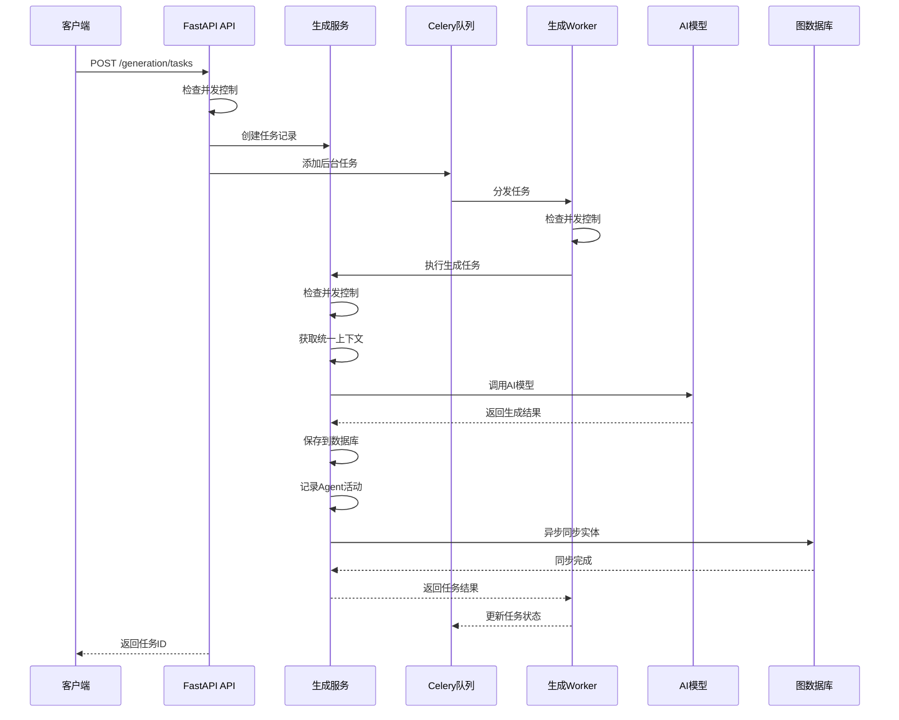

**图表来源**
- [generation.py:73-101](file://backend/api/v1/generation.py#L73-L101)
- [generation_worker.py:21-34](file://workers/generation_worker.py#L21-L34)

## 详细组件分析

### 企划阶段 (Planning Phase)

企划阶段负责生成小说的基础框架，现已增强对复杂数据结构的处理能力和三层并发控制：

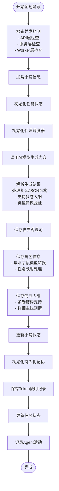

**图表来源**
- [generation_service.py:77-298](file://backend/services/generation_service.py#L77-L298)

**章节来源**
- [generation_service.py:77-298](file://backend/services/generation_service.py#L77-L298)

### 单章写作 (Chapter Writing)

单章写作流程包括上下文构建和内容生成，现已增强记忆系统集成、编辑任务支持和图数据库同步：

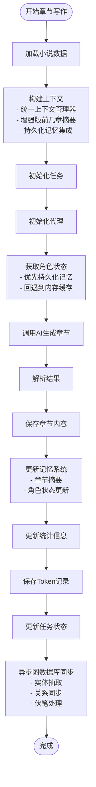

**图表来源**
- [generation_service.py:312-566](file://backend/services/generation_service.py#L312-L566)

**章节来源**
- [generation_service.py:312-566](file://backend/services/generation_service.py#L312-L566)

### 批量写作 (Batch Writing)

批量写作支持连续章节的并行生成，现已增强错误处理、中断机制、编辑任务支持和图数据库同步：


**图表来源**
- [generation_service.py:576-798](file://backend/services/generation_service.py#L576-L798)

**章节来源**
- [generation_service.py:576-798](file://backend/services/generation_service.py#L576-L798)

### 编辑任务 (Editing Task)

新增的编辑任务支持对生成内容进行润色和质量提升：

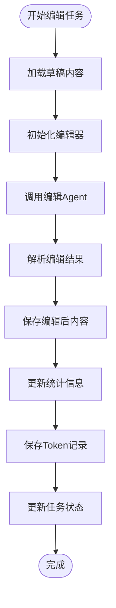

**图表来源**
- [generation_service.py:800-948](file://backend/services/generation_service.py#L800-L948)

**章节来源**
- [generation_service.py:800-948](file://backend/services/generation_service.py#L800-L948)

### 图同步服务 (GraphSyncService)

**新增** 图同步服务负责将PostgreSQL中的实体数据同步到Neo4j图数据库：

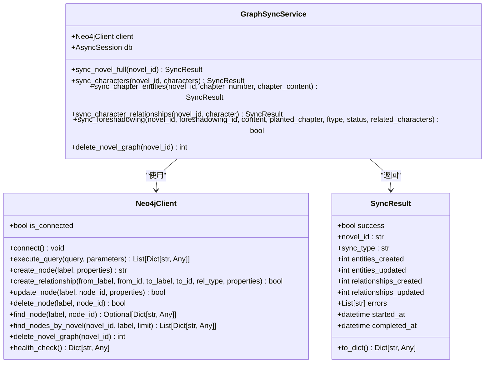

**图表来源**
- [graph_sync_service.py:61-125](file://backend/services/graph_sync_service.py#L61-L125)
- [graph_sync_service.py:30-59](file://backend/services/graph_sync_service.py#L30-L59)
- [neo4j_client.py:81-180](file://core/graph/neo4j_client.py#L81-180)

**章节来源**
- [graph_sync_service.py:1-596](file://backend/services/graph_sync_service.py#L1-L596)

### 实体抽取服务 (EntityExtractorService)

**新增** 实体抽取服务使用LLM从章节内容中抽取实体信息：

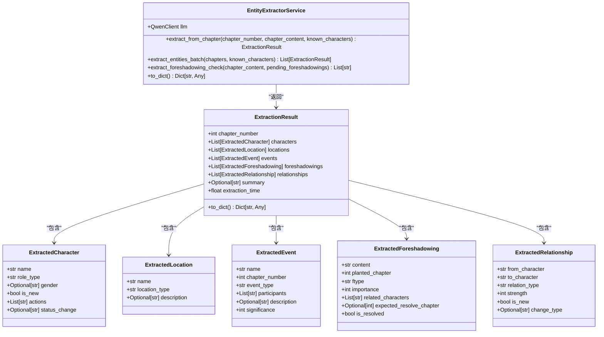

**图表来源**
- [entity_extractor_service.py:235-316](file://backend/services/entity_extractor_service.py#L235-L316)
- [entity_extractor_service.py:75-148](file://backend/services/entity_extractor_service.py#L75-L148)
- [entity_extractor_service.py:17-74](file://backend/services/entity_extractor_service.py#L17-L74)

**章节来源**
- [entity_extractor_service.py:1-579](file://backend/services/entity_extractor_service.py#L1-L579)

### 图查询服务 (GraphQueryService)

**新增** 图查询服务提供各种图分析查询能力：

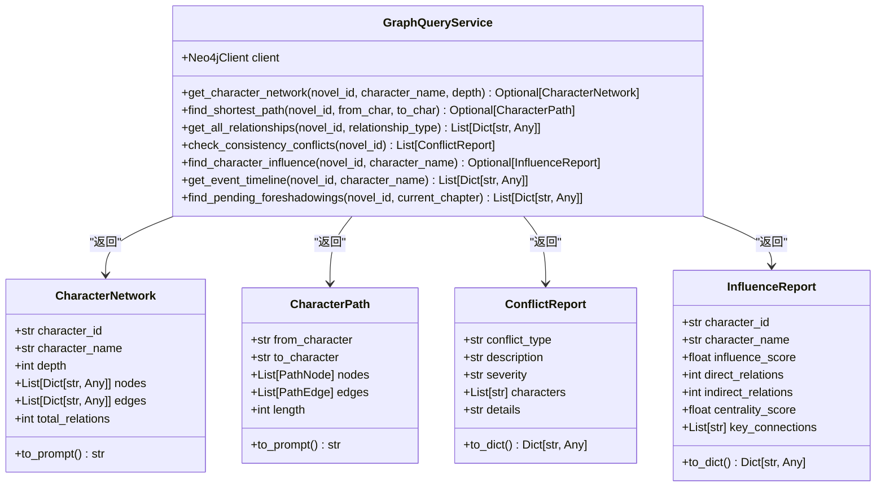

**图表来源**
- [graph_query_service.py:135-218](file://backend/services/graph_query_service.py#L135-L218)
- [graph_query_service.py:14-108](file://backend/services/graph_query_service.py#L14-L108)
- [graph_query_service.py:35-87](file://backend/services/graph_query_service.py#L35-L87)

**章节来源**
- [graph_query_service.py:1-537](file://backend/services/graph_query_service.py#L1-L537)

### Agent图查询混入 (GraphQueryMixin)

**新增** Agent图查询混入为AI代理提供图数据库查询能力：

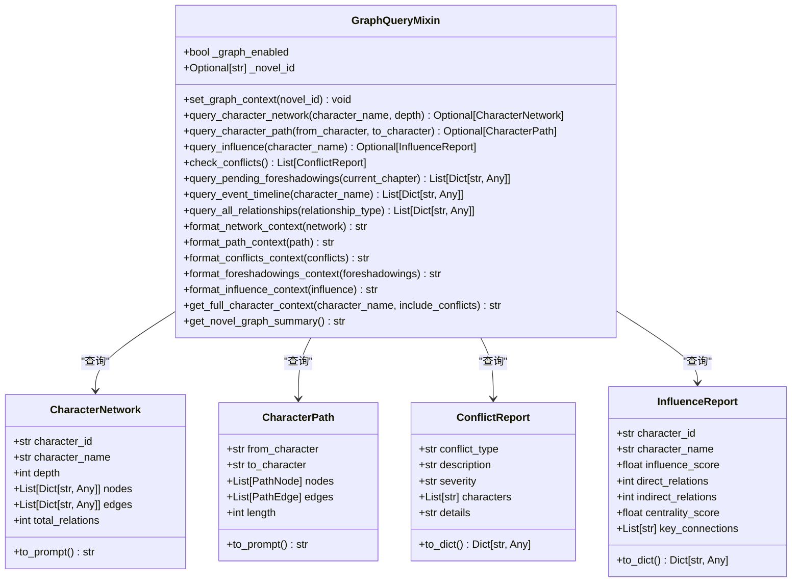

**图表来源**
- [graph_query_mixin.py:26-210](file://agents/graph_query_mixin.py#L26-L210)
- [graph_query_mixin.py:14-31](file://agents/graph_query_mixin.py#L14-L31)

**章节来源**
- [graph_query_mixin.py:1-498](file://agents/graph_query_mixin.py#L1-L498)

### 代理调度器 (Agent Dispatcher)

代理调度器负责协调不同类型的AI代理，现已增强配置管理、错误处理、编辑任务支持和图数据库查询能力：

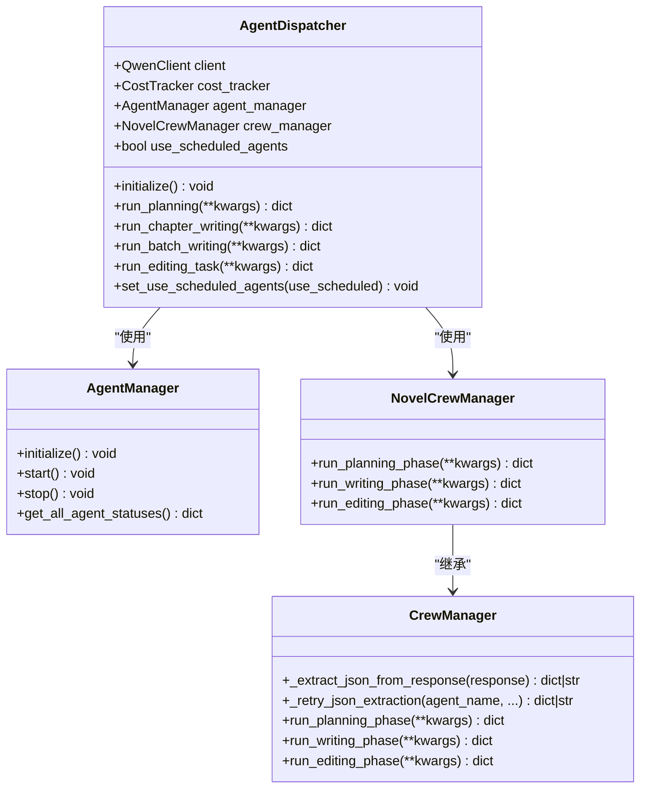

**图表来源**
- [agent_dispatcher.py:17-87](file://agents/agent_dispatcher.py#L17-L87)
- [crew_manager.py:38-158](file://agents/crew_manager.py#L38-L158)

**章节来源**
- [agent_dispatcher.py:17-491](file://agents/agent_dispatcher.py#L17-L491)
- [crew_manager.py:159-358](file://agents/crew_manager.py#L159-L358)

### Agent活动记录器 (Agent Activity Recorder)

新增的Agent活动记录器用于详细记录Agent执行过程：

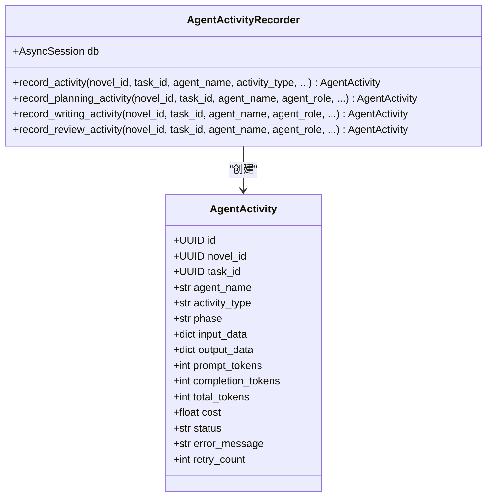

**图表来源**
- [agent_activity_recorder.py:14-25](file://backend/services/agent_activity_recorder.py#L14-L25)

**章节来源**
- [agent_activity_recorder.py:1-316](file://backend/services/agent_activity_recorder.py#L1-L316)

### 统一上下文管理器 (UnifiedContextManager)

**新增** 统一上下文管理器替代了分散的上下文管理，提供了一致的上下文访问接口：

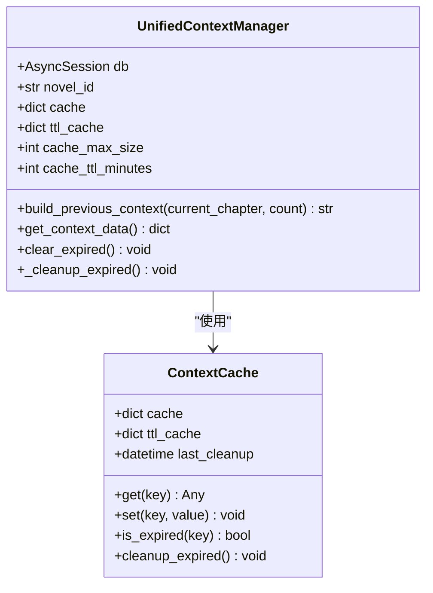

**图表来源**
- [context_manager.py:1-200](file://backend/services/context_manager.py#L1-L200)

**章节来源**
- [context_manager.py:1-200](file://backend/services/context_manager.py#L1-L200)

### 团队上下文管理 (NovelTeamContext)

**新增** 团队上下文管理支持多Agent协作工作流：

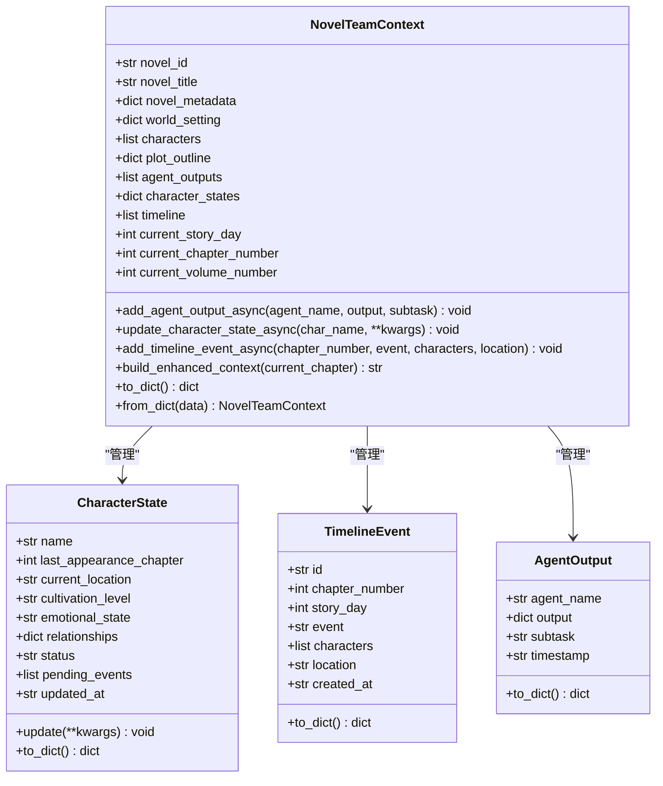

**图表来源**
- [team_context.py:173-242](file://agents/team_context.py#L173-L242)
- [team_context.py:41-89](file://agents/team_context.py#L41-L89)
- [team_context.py:91-121](file://agents/team_context.py#L91-L121)
- [team_context.py:22-39](file://agents/team_context.py#L22-L39)

**章节来源**
- [team_context.py:1-638](file://agents/team_context.py#L1-L638)

### API序列化机制 (model_to_dict)

**更新** API序列化机制通过model_to_dict工具函数得到重大改进：

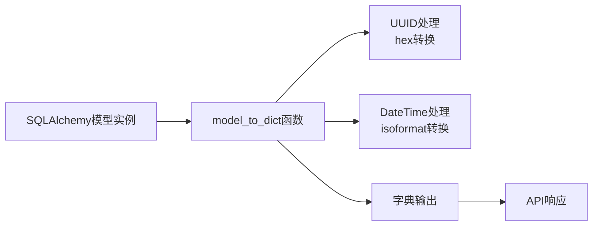

**图表来源**
- [outlines.py:911-928](file://backend/api/v1/outlines.py#L911-L928)

**章节来源**
- [outlines.py:911-928](file://backend/api/v1/outlines.py#L911-L928)

## 依赖关系分析

生成服务的依赖关系呈现清晰的分层结构，现已增强记忆系统、活动记录功能、编辑任务支持和图数据库集成：

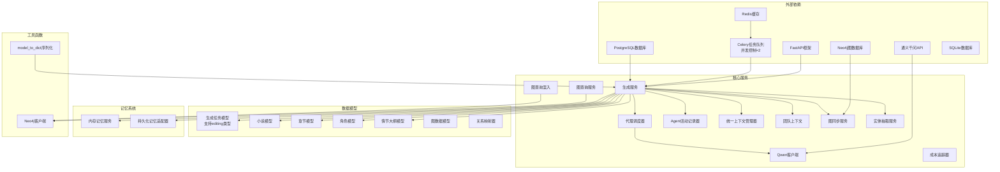

**图表来源**
- [generation_service.py:12-76](file://backend/services/generation_service.py#L12-L76)
- [agent_dispatcher.py:7-11](file://agents/agent_dispatcher.py#L7-L11)
- [generation_task.py:12-16](file://core/models/generation_task.py#L12-L16)
- [context_manager.py:1-200](file://backend/services/context_manager.py#L1-L200)
- [team_context.py:173-242](file://agents/team_context.py#L173-L242)
- [outlines.py:911-928](file://backend/api/v1/outlines.py#L911-L928)
- [graph_sync_service.py:15-27](file://backend/services/graph_sync_service.py#L15-L27)
- [entity_extractor_service.py:12-14](file://backend/services/entity_extractor_service.py#L12-L14)
- [graph_query_service.py:10](file://backend/services/graph_query_service.py#L10)
- [graph_query_mixin.py:14-23](file://agents/graph_query_mixin.py#L14-L23)

**章节来源**
- [generation_service.py:1-1303](file://backend/services/generation_service.py#L1-L1303)
- [agent_dispatcher.py:1-491](file://agents/agent_dispatcher.py#L1-L491)

## 性能考虑

### 异步处理优化

系统采用异步编程模型来提高性能：

- **异步数据库操作**：使用SQLAlchemy异步会话
- **异步AI调用**：支持流式响应和重试机制
- **并发任务处理**：Celery支持多worker并发执行
- **异步图数据库同步**：章节生成后异步执行，避免阻塞主流程

### 成本控制机制

成本追踪现已增强多维度统计和章节级追踪：

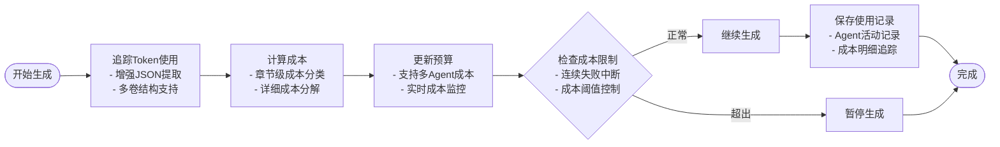

**图表来源**
- [generation_service.py:257-286](file://backend/services/generation_service.py#L257-L286)
- [cost_tracker.py:28-95](file://llm/cost_tracker.py#L28-L95)

### 缓存策略

- **统一上下文缓存**：使用LRU缓存和TTL过期机制
- **记忆系统**：使用Redis缓存章节摘要和角色状态
- **上下文优化**：智能选择结构化摘要而非全文内容
- **任务状态缓存**：快速查询任务执行状态
- **持久化记忆**：SQLite + FTS5支持长期记忆存储
- **图查询缓存**：支持图查询结果缓存，提高查询性能

### 三层并发控制机制

**更新** 系统现已实施严格的三层并发控制机制：

#### API层并发控制
- 防止同一小说同时创建多个企划任务
- 实时检查现有运行中的企划任务
- 返回明确的错误信息指导用户

#### 服务层并发控制  
- 在生成服务内部再次检查并发限制
- 防止服务层级别的竞态条件
- 确保数据库层面的一致性

#### Worker层并发控制
- Celery Worker内部的最终检查
- 防止Worker级别的重复执行
- 保证系统资源的合理分配

### 图数据库性能优化

**新增** 图数据库集成的性能优化：

- **异步同步**：章节生成后异步执行图数据库同步，避免阻塞主流程
- **批量操作**：支持批量实体抽取和关系创建
- **连接池管理**：Neo4j客户端使用连接池提高连接复用效率
- **查询缓存**：图查询结果支持缓存，减少重复查询开销
- **白名单验证**：防止Cypher注入攻击，确保查询安全性
- **事务管理**：支持批量操作的事务原子性保证

### 团队协作优化

**新增** 团队协作工作流的性能优化：

- **异步上下文管理**：使用asyncio.Lock保证线程安全
- **增量更新**：只更新变更的角色状态和时间线
- **批量序列化**：通过model_to_dict优化大量数据的序列化
- **缓存策略**：统一上下文管理器减少重复计算
- **图数据模型**：支持丰富的实体关系类型和属性

**章节来源**
- [generation.py:48-64](file://backend/api/v1/generation.py#L48-L64)
- [generation_worker.py:29-42](file://workers/generation_worker.py#L29-L42)
- [generation_service.py:87-100](file://backend/services/generation_service.py#L87-L100)
- [team_context.py:244-268](file://agents/team_context.py#L244-L268)
- [context_manager.py:1-200](file://backend/services/context_manager.py#L1-L200)
- [graph_sync_service.py:2061-2108](file://backend/services/generation_service.py#L2061-L2108)

## 故障排除指南

### 常见问题及解决方案

| 问题类型 | 症状 | 解决方案 |
|---------|------|----------|
| LLM调用失败 | 任务状态变为failed | 检查API密钥和网络连接 |
| 数据库连接异常 | 无法保存生成结果 | 验证数据库配置和连接池 |
| 任务超时 | Celery任务长时间运行 | 调整任务超时设置 |
| Token耗尽 | 生成被意外停止 | 检查成本追踪和预算限制 |
| JSON解析失败 | 企划阶段数据处理异常 | 检查复杂数据结构处理逻辑 |
| 多卷大纲错误 | 情节大纲结构不正确 | 验证多卷结构转换逻辑 |
| 角色状态不一致 | 写作阶段角色信息错误 | 检查持久化记忆同步机制 |
| 并发控制错误 | "已有企划任务在运行中" | 等待现有任务完成后重试 |
| 编辑任务失败 | 编辑阶段内容质量不佳 | 检查编辑Agent配置和提示词 |
| 团队上下文冲突 | 多Agent协作时数据不一致 | 检查异步锁和序列化机制 |
| 上下文缓存失效 | 前置章节上下文丢失 | 检查缓存TTL和清理机制 |
| 图数据库连接失败 | 同步任务被跳过 | 检查Neo4j连接配置和网络 |
| 实体抽取失败 | 章节内容未同步到图数据库 | 检查LLM配置和内容长度限制 |
| 图查询超时 | 角色网络查询响应慢 | 检查查询深度和索引配置 |
| 伏笔同步错误 | 伏笔状态更新失败 | 检查角色名称匹配和关系映射 |

### 日志监控

系统提供详细的日志记录：

- **任务状态变更**：记录每个任务的开始、完成和失败
- **Token使用**：追踪每次AI调用的成本
- **错误信息**：保存详细的异常堆栈信息
- **Agent活动**：记录详细的Agent执行过程
- **并发控制**：记录并发检查的结果和拒绝原因
- **团队协作**：记录Agent输出和状态变更
- **上下文管理**：记录缓存命中率和清理操作
- **图数据库操作**：记录同步结果和错误信息
- **实体抽取**：记录抽取结果和处理时间
- **图查询**：记录查询性能和结果格式化

**章节来源**
- [generation_service.py:300-310](file://backend/services/generation_service.py#L300-L310)
- [generation_service.py:568-574](file://backend/services/generation_service.py#L568-L574)
- [agent_activity_recorder.py:105-108](file://backend/services/agent_activity_recorder.py#L105-L108)

## 结论

生成服务通过精心设计的架构实现了高效的小说自动化生成。其核心优势包括：

1. **模块化设计**：清晰的分层架构便于维护和扩展
2. **异步处理**：支持高并发和良好的用户体验
3. **成本控制**：完善的Token追踪和预算管理
4. **可扩展性**：支持多种AI模型和代理类型
5. **可靠性**：完善的错误处理和任务恢复机制
6. **智能数据处理**：增强的JSON解析和数据结构处理能力
7. **详细活动记录**：全面的Agent执行过程追踪
8. **持久化记忆**：长期记忆支持和状态同步
9. **三层并发控制**：严格的并发限制防止资源竞争
10. **编辑任务支持**：完整的润色和质量提升流程
11. **团队协作**：NovelTeamContext支持多Agent协作工作流
12. **统一上下文**：UnifiedContextManager提供一致的上下文访问
13. **优化序列化**：model_to_dict工具函数提升API性能
14. **异步锁机制**：确保团队上下文的线程安全
15. **图数据库集成**：完整的图数据同步和查询能力
16. **实体抽取功能**：LLM驱动的智能实体识别和抽取
17. **Agent图查询**：为AI代理提供强大的图数据分析能力
18. **配置灵活性**：支持图数据库和实体抽取的灵活配置
19. **性能优化**：异步操作、缓存策略和连接池管理
20. **安全防护**：图查询白名单验证和异常处理机制

**更新** 该系统现已显著增强了并发控制能力、编辑任务支持、图数据库集成和实体抽取功能。新增的GraphSyncService实现了章节生成后的实体同步，EntityExtractorService通过LLM实现了智能实体抽取，GraphQueryService提供了丰富的图分析查询能力，GraphQueryMixin为AI代理集成了图数据库查询功能。这些增强为AI驱动的小说创作提供了更加稳健、智能化和可扩展的技术基础，支持从简单的故事生成到复杂长篇小说的完整创作流程，同时为未来的内容分析、关系挖掘和智能推荐奠定了坚实的技术基础。