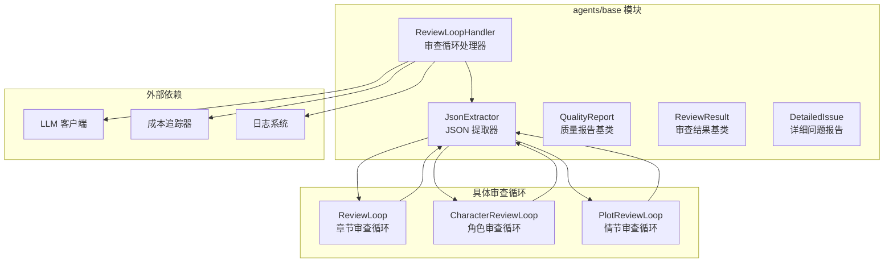
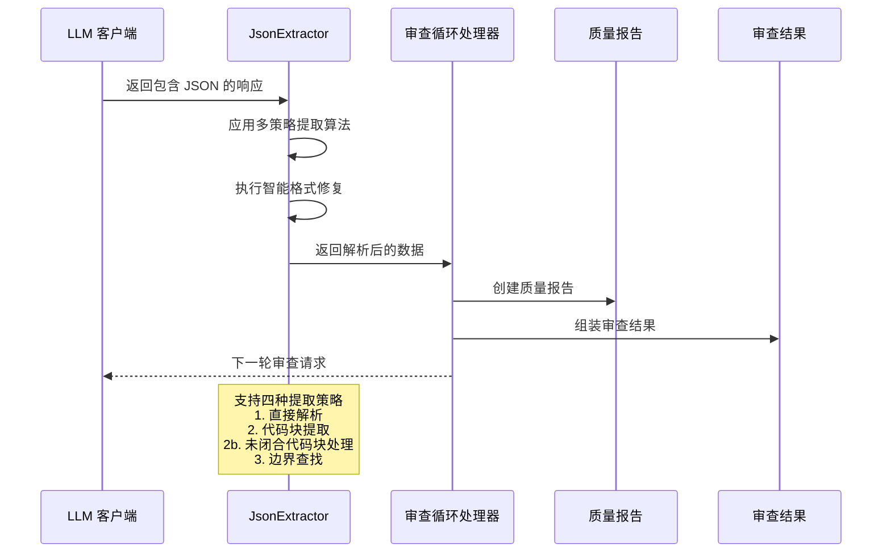
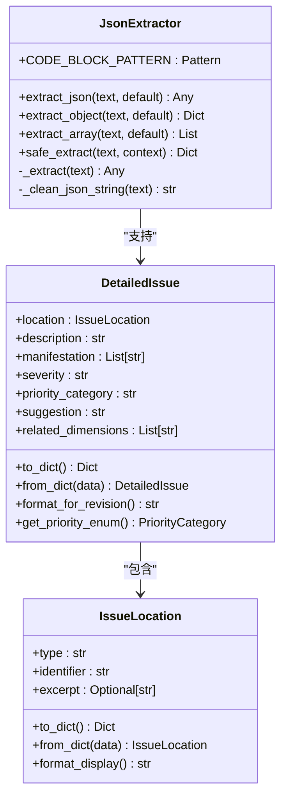
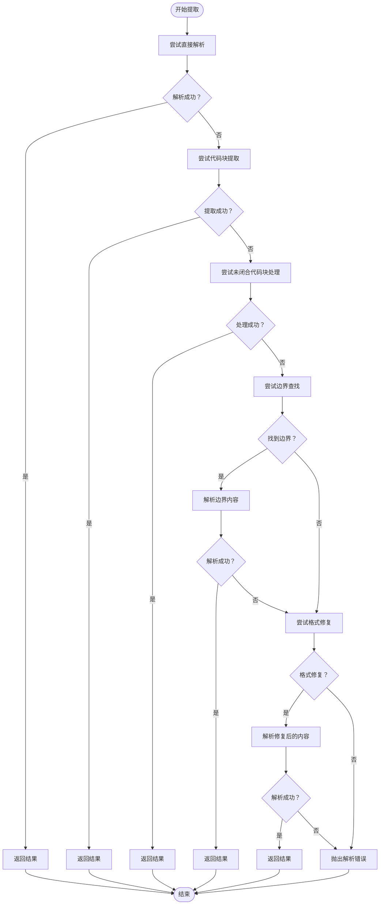
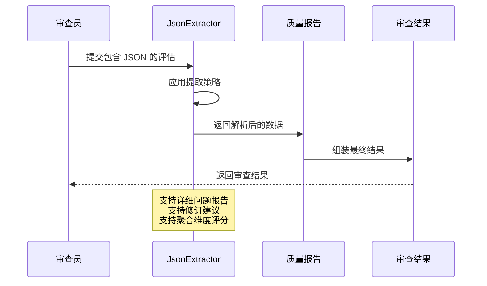
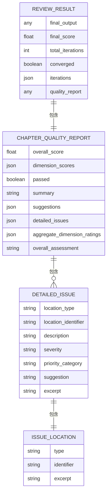
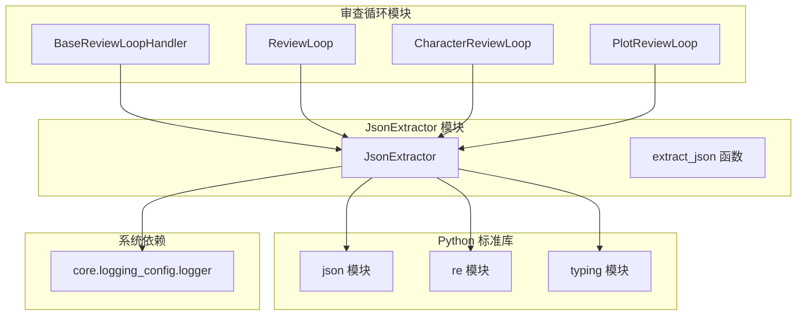

# Json Extractor

<cite>
**本文档引用的文件**
- [json_extractor.py](file://agents/base/json_extractor.py)
- [__init__.py](file://agents/base/__init__.py)
- [review_loop_base.py](file://agents/base/review_loop_base.py)
- [review_loop.py](file://agents/review_loop.py)
- [character_review_loop.py](file://agents/character_review_loop.py)
- [plot_review_loop.py](file://agents/plot_review_loop.py)
- [quality_report.py](file://agents/base/quality_report.py)
- [detailed_issue.py](file://agents/base/detailed_issue.py)
- [review_result.py](file://agents/base/review_result.py)
</cite>

## 更新摘要
**变更内容**
- 新增了对未闭合代码块的智能提取策略（strategy 2b）
- 增强了 JSON 解析鲁棒性，新增23行代码
- 完善了全面的错误处理机制
- 优化了代码块提取的健壮性

## 目录
1. [简介](#简介)
2. [项目结构](#项目结构)
3. [核心组件](#核心组件)
4. [架构概览](#架构概览)
5. [详细组件分析](#详细组件分析)
6. [依赖关系分析](#依赖关系分析)
7. [性能考量](#性能考量)
8. [故障排除指南](#故障排除指南)
9. [结论](#结论)

## 简介
Json Extractor 是小说创作自动化系统中的核心数据处理组件，专门负责从大型语言模型（LLM）的响应中可靠地提取 JSON 数据。该组件采用多策略提取算法，能够处理各种格式的 LLM 输出，包括纯 JSON 文本、Markdown 代码块包裹的 JSON，以及混合文本中的 JSON 片段。

**更新** 新增了对未闭合代码块的智能提取策略（strategy 2b），显著增强了对 LLM 响应截断场景的处理能力，提升了整体解析鲁棒性。

该组件在整个审查循环系统中发挥着关键作用，为章节审查、角色审查、情节审查等各种自动化流程提供稳定的 JSON 解析能力。通过智能的错误恢复机制和灵活的提取策略，Json Extractor 确保了整个小说创作系统的数据处理可靠性。

## 项目结构
Json Extractor 位于 agents/base 模块中，作为审查循环基础设施的核心组件之一。该模块提供了完整的审查循环生态系统，包括 JSON 提取、质量报告、审查结果等基础组件。



**图表来源**
- [json_extractor.py:1-265](file://agents/base/json_extractor.py#L1-L265)
- [review_loop_base.py:1-800](file://agents/base/review_loop_base.py#L1-L800)

**章节来源**
- [json_extractor.py:1-265](file://agents/base/json_extractor.py#L1-L265)
- [__init__.py:1-79](file://agents/base/__init__.py#L1-L79)

## 核心组件
Json Extractor 模块包含以下核心组件：

### JsonExtractor 类
这是主要的 JSON 提取器类，提供多种提取策略和便捷方法。其核心功能包括：
- 直接 JSON 解析
- Markdown 代码块提取（含未闭合代码块处理）
- 边界查找提取
- 智能格式修复
- 安全提取模式

### 辅助数据结构
模块还包含与 JSON 提取密切相关的数据结构：
- DetailedIssue：详细问题报告结构
- BaseQualityReport：质量报告基类
- BaseReviewResult：审查结果基类

**章节来源**
- [json_extractor.py:16-265](file://agents/base/json_extractor.py#L16-L265)
- [detailed_issue.py:65-161](file://agents/base/detailed_issue.py#L65-L161)
- [quality_report.py:44-118](file://agents/base/quality_report.py#L44-L118)

## 架构概览
Json Extractor 在整个小说创作系统中扮演着数据处理枢纽的角色。它与审查循环处理器紧密集成，为各种审查流程提供统一的 JSON 解析能力。



**图表来源**
- [review_loop_base.py:718-800](file://agents/base/review_loop_base.py#L718-L800)
- [json_extractor.py:102-181](file://agents/base/json_extractor.py#L102-L181)

## 详细组件分析

### JsonExtractor 类设计
JsonExtractor 类采用了面向对象的设计模式，提供了清晰的接口和强大的功能集。



**图表来源**
- [json_extractor.py:16-265](file://agents/base/json_extractor.py#L16-L265)
- [detailed_issue.py:65-161](file://agents/base/detailed_issue.py#L65-L161)

#### 提取策略层次
JsonExtractor 实现了四层提取策略，按照优先级顺序执行：

1. **直接解析策略**（最高优先级）
   - 直接使用 json.loads() 解析完整文本
   - 适用于纯 JSON 格式的 LLM 响应

2. **代码块提取策略**（第二优先级）
   - 使用正则表达式匹配 Markdown 代码块
   - 支持 ```json ... ``` 和 ``` ... ``` 格式
   - 提取代码块内的 JSON 内容

3. **未闭合代码块处理策略**（第三优先级）
   - **新增** 处理以 ```json 或 ``` 开头但缺少闭合标记的场景
   - 自动检测代码块起始位置并提取内部 JSON
   - 通过查找第一个 { 和最后一个 } 来定位 JSON 对象边界

4. **边界查找策略**（最低优先级）
   - 查找文本中的第一个 { 和最后一个 } 或 [ 和 ]
   - 提取其中的 JSON 片段
   - 适用于混合文本中的 JSON 提取

**章节来源**
- [json_extractor.py](file://agents/base/json_extractor.py#L102-L181)

#### 智能格式修复机制
当标准提取策略失败时，JsonExtractor 会尝试智能修复常见的 JSON 格式问题：



**图表来源**
- [json_extractor.py](file://agents/base/json_extractor.py#L102-L181)

**章节来源**
- [json_extractor.py](file://agents/base/json_extractor.py#L183-L220)

### 在审查循环中的应用
JsonExtractor 在各种审查循环中发挥着关键作用，确保审查数据的准确提取和处理。

#### 章节审查循环中的应用
在章节审查循环中，JsonExtractor 主要用于解析编辑器的评估结果：



**图表来源**
- [review_loop.py](file://agents/review_loop.py#L520-L534)

#### 角色审查循环中的应用
在角色审查循环中，JsonExtractor 负责解析角色列表和角色评估数据：

**章节来源**
- [character_review_loop.py](file://agents/character_review_loop.py#L340-L348)

#### 情节审查循环中的应用
在情节审查循环中，JsonExtractor 处理情节大纲和卷信息的提取：

**章节来源**
- [plot_review_loop.py](file://agents/plot_review_loop.py#L400-L412)

### 数据结构支持
JsonExtractor 与相关的数据结构紧密集成，提供完整的审查数据处理能力。



**图表来源**
- [detailed_issue.py](file://agents/base/detailed_issue.py#L65-L161)
- [quality_report.py](file://agents/base/quality_report.py#L273-L471)
- [review_result.py](file://agents/base/review_result.py#L23-L237)

**章节来源**
- [detailed_issue.py](file://agents/base/detailed_issue.py#L1-L249)
- [quality_report.py](file://agents/base/quality_report.py#L1-L471)
- [review_result.py](file://agents/base/review_result.py#L1-L237)

## 依赖关系分析
JsonExtractor 模块具有清晰的依赖关系，主要依赖于 Python 标准库和核心日志系统。



**图表来源**
- [json_extractor.py:9-13](file://agents/base/json_extractor.py#L9-L13)
- [review_loop_base.py:25-30](file://agents/base/review_loop_base.py#L25-L30)

### 外部依赖关系
JsonExtractor 的外部依赖非常有限，仅依赖于：
- Python 标准库的 json 和 re 模块
- 核心日志配置系统
- 审查循环处理器的基础类

这种设计确保了 JsonExtractor 的独立性和可移植性，使其可以在系统中的任何地方使用而不会引入额外的复杂依赖。

**章节来源**
- [json_extractor.py:9-13](file://agents/base/json_extractor.py#L9-L13)
- [__init__.py:23-45](file://agents/base/__init__.py#L23-L45)

## 性能考量
JsonExtractor 在设计时充分考虑了性能优化，采用了多种策略来确保高效的 JSON 提取：

### 算法复杂度分析
- **直接解析策略**：O(n) 时间复杂度，其中 n 为输入文本长度
- **代码块提取策略**：O(n) 时间复杂度，包含正则表达式匹配
- **未闭合代码块处理策略**：O(n) 时间复杂度，包含字符串扫描和边界查找
- **边界查找策略**：O(n) 时间复杂度，包含两次线性扫描
- **格式修复策略**：O(n) 时间复杂度，包含多次字符串操作

### 内存使用优化
- 采用惰性求值策略，只在必要时进行复杂的字符串操作
- 使用正则表达式预编译，避免重复编译开销
- 实现智能缓存机制，避免重复的解析尝试

### 错误处理优化
- 实现快速失败机制，一旦找到可行的提取策略立即返回
- 使用默认值机制，避免昂贵的异常处理开销
- 提供安全提取模式，防止系统崩溃

**更新** 新增的未闭合代码块处理策略在保持 O(n) 复杂度的同时，增加了对 LLM 响应截断场景的专门处理，显著提升了实际应用中的成功率。

## 故障排除指南
当 JsonExtractor 遇到难以处理的 JSON 格式时，可以采用以下故障排除策略：

### 常见问题诊断
1. **空输入处理**
   - 系统会抛出 ValueError 异常
   - 建议在调用前检查输入是否为空

2. **格式不兼容**
   - 检查 LLM 响应是否包含有效的 JSON 结构
   - 确认 JSON 格式是否符合预期

3. **编码问题**
   - 确保输入文本使用正确的字符编码
   - 检查是否存在特殊字符或转义序列

4. **未闭合代码块问题**
   - **新增** 检查 LLM 响应是否以 ```json 或 ``` 开头但缺少闭合标记
   - 系统现在能自动处理这种截断场景

### 调试技巧
- 使用 safe_extract 方法进行安全提取，避免异常传播
- 启用详细日志记录，跟踪提取过程
- 实现自定义默认值，确保系统稳定性

**章节来源**
- [json_extractor.py:110-L111](file://agents/base/json_extractor.py#L110-L111)
- [json_extractor.py:223-L245](file://agents/base/json_extractor.py#L223-L245)

## 结论
Json Extractor 作为小说创作自动化系统的核心组件，展现了优秀的工程设计和实用性。其多策略提取算法、智能格式修复机制和完善的错误处理能力，确保了系统在处理各种 LLM 响应时的稳定性和可靠性。

**更新** 新增的未闭合代码块智能提取策略（strategy 2b）显著增强了对 LLM 响应截断场景的处理能力，通过新增23行代码实现了对以 ```json 或 ``` 开头但缺少闭合标记的代码块的自动识别和提取。这一改进使得 JsonExtractor 能够更好地应对实际生产环境中可能出现的各种格式问题，大大提升了系统的鲁棒性和实用性。

通过与其他审查循环组件的紧密集成，JsonExtractor 为整个小说创作流程提供了坚实的数据处理基础。其简洁的 API 设计、清晰的错误处理和良好的性能表现，使其成为现代 AI 辅助创作系统中不可或缺的关键组件。

未来的发展方向包括进一步优化提取算法、增强对复杂 JSON 结构的支持，以及提供更多的配置选项来适应不同的使用场景。