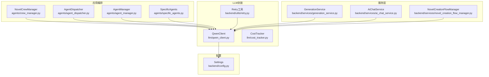
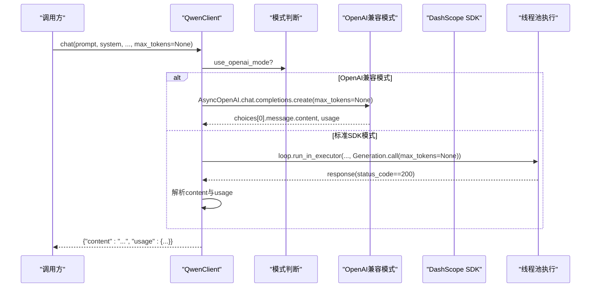
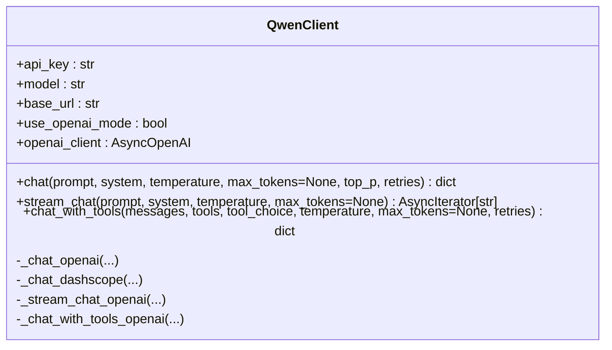
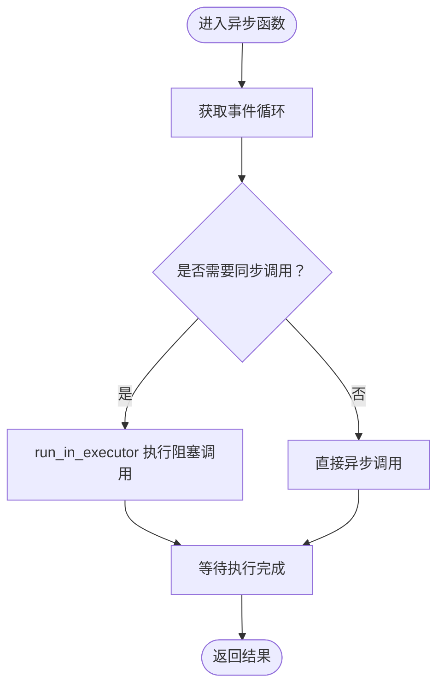
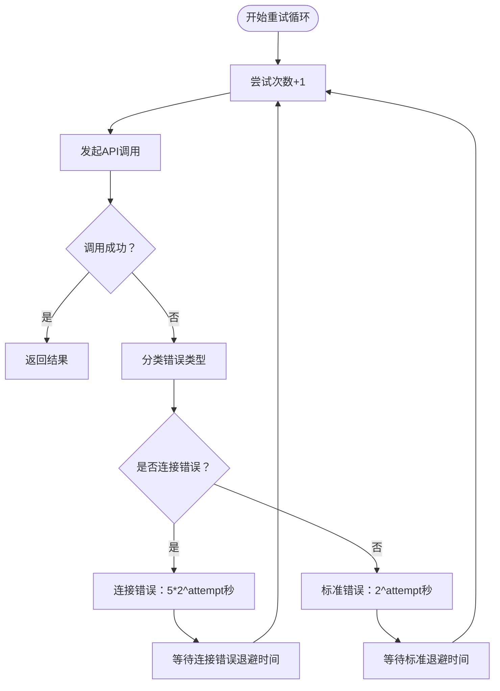
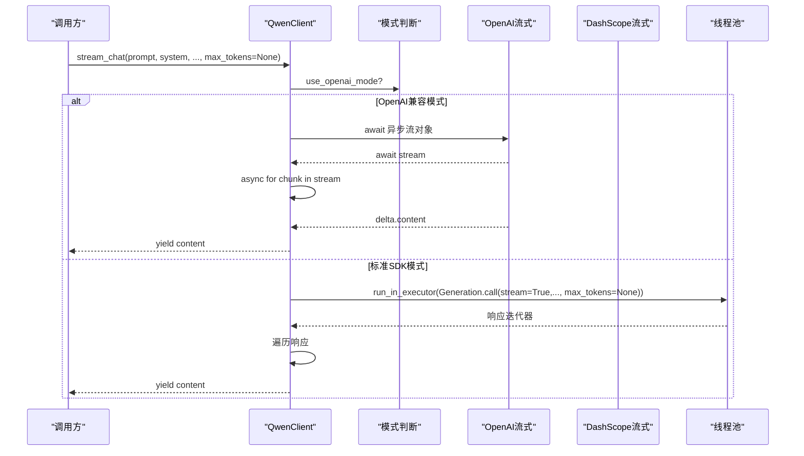
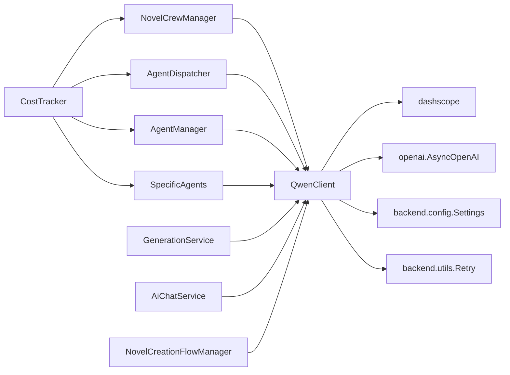

# LLM客户端封装

<cite>
**本文档引用的文件**
- [llm/qwen_client.py](file://llm/qwen_client.py)
- [llm/__init__.py](file://llm/__init__.py)
- [backend/config.py](file://backend/config.py)
- [llm/cost_tracker.py](file://llm/cost_tracker.py)
- [agents/crew_manager.py](file://agents/crew_manager.py)
- [agents/agent_dispatcher.py](file://agents/agent_dispatcher.py)
- [agents/agent_manager.py](file://agents/agent_manager.py)
- [agents/specific_agents.py](file://agents/specific_agents.py)
- [backend/services/generation_service.py](file://backend/services/generation_service.py)
- [backend/services/ai_chat_service.py](file://backend/services/ai_chat_service.py)
- [backend/utils/retry.py](file://backend/utils/retry.py)
- [backend/services/novel_creation_flow_manager.py](file://backend/services/novel_creation_flow_manager.py)
</cite>

## 更新摘要
**所做更改**
- 更新了max_tokens参数的实现，从必需整数改为可选参数（Optional[int] = None）
- 新增None值表示不限制token响应的说明
- 改进了智能重试机制，连接错误使用5s/10s/20s扩展等待，其他错误使用1s/2s/4s指数退避
- 增强了OpenAI兼容模式的流式调用处理
- 优化了超时配置，OpenAI兼容模式下设置300秒总超时
- 强调了max_tokens参数在不同模式下的行为差异

## 目录
1. [简介](#简介)
2. [项目结构](#项目结构)
3. [核心组件](#核心组件)
4. [架构总览](#架构总览)
5. [组件详解](#组件详解)
6. [依赖关系分析](#依赖关系分析)
7. [性能考量](#性能考量)
8. [故障排查指南](#故障排查指南)
9. [结论](#结论)
10. [附录](#附录)

## 简介
本文件为"LLM客户端封装"的技术文档，聚焦于QwenClient类的设计与实现，覆盖以下主题：
- OpenAI兼容模式与标准DashScope SDK两种调用方式的实现差异
- 异步调用机制：事件循环处理、线程池使用、阻塞避免策略
- 智能重试机制：区分连接错误与其他错误、详细的错误类型记录、超时处理、优雅降级策略
- 流式输出：增量响应处理、内容拼接、异常中断恢复
- 工具调用功能：函数调用支持、参数处理、返回值解析
- 配置管理：API密钥、模型参数、基础URL设置
- 性能优化建议、错误处理最佳实践、调试技巧
- 面向AI工程师与后端开发者的实用指导

## 项目结构
该仓库采用分层与功能模块结合的组织方式：
- llm目录：封装QwenClient、CostTracker、PromptManager等LLM相关能力
- agents目录：编排Agent工作流，调用QwenClient执行各阶段任务
- backend目录：服务层（GenerationService、AiChatService）、配置（Settings）、中间件等
- **新增** backend/utils/retry.py：提供通用的智能重试工具模块
- 核心配置通过.env与backend/config.py读取

**更新** 新增了NovelCreationFlowManager的依赖关系

图表来源
- [llm/qwen_client.py:16-383](file://llm/qwen_client.py#L16-L383)
- [llm/cost_tracker.py:16-126](file://llm/cost_tracker.py#L16-L126)
- [backend/utils/retry.py:1-276](file://backend/utils/retry.py#L1-L276)
- [agents/crew_manager.py:19-1988](file://agents/crew_manager.py#L19-L1988)
- [agents/agent_dispatcher.py:17-440](file://agents/agent_dispatcher.py#L17-L440)
- [agents/agent_manager.py:22-227](file://agents/agent_manager.py#L22-L227)
- [agents/specific_agents.py:15-200](file://agents/specific_agents.py#L15-L200)
- [backend/services/generation_service.py:27-689](file://backend/services/generation_service.py#L27-L689)
- [backend/services/ai_chat_service.py:1718-1917](file://backend/services/ai_chat_service.py#L1718-L1917)
- [backend/services/novel_creation_flow_manager.py:130-329](file://backend/services/novel_creation_flow_manager.py#L130-L329)
- [backend/config.py:5-514](file://backend/config.py#L5-L514)

章节来源
- [llm/qwen_client.py:1-383](file://llm/qwen_client.py#L1-L383)
- [backend/config.py:1-514](file://backend/config.py#L1-L514)

## 核心组件
- QwenClient：统一的通义千问客户端封装，支持OpenAI兼容模式与标准DashScope SDK；提供同步/异步聊天与流式输出；内置智能重试机制（区分连接错误与其他错误）、详细的错误类型记录、超时处理、优雅降级策略；支持工具调用功能。
- CostTracker：按模型定价追踪token用量与成本，支持记录、汇总与重置。
- **新增** Retry工具模块：提供通用的智能重试机制，支持指数退避、异常分类处理、可配置的延迟时间、重试日志记录。
- GenerationService：服务层编排器，负责调用Agent调度器与QwenClient，持久化结果与token使用。
- AiChatService：AI聊天服务层，集成QwenClient实现流式对话功能，支持WebSocket实时通信。
- **新增** NovelCreationFlowManager：小说创作流程管理器，使用QwenClient进行多轮对话和内容生成。

**更新** 新增了NovelCreationFlowManager的说明

章节来源
- [llm/qwen_client.py:16-383](file://llm/qwen_client.py#L16-L383)
- [llm/cost_tracker.py:16-126](file://llm/cost_tracker.py#L16-L126)
- [backend/utils/retry.py:1-276](file://backend/utils/retry.py#L1-L276)
- [backend/services/generation_service.py:27-689](file://backend/services/generation_service.py#L27-L689)
- [backend/services/ai_chat_service.py:1718-1917](file://backend/services/ai_chat_service.py#L1718-L1917)
- [backend/services/novel_creation_flow_manager.py:130-329](file://backend/services/novel_creation_flow_manager.py#L130-L329)

## 架构总览
QwenClient在不同模式下的调用路径如下：

**更新** 修正了流式调用的序列图，现在正确展示了await异步流对象的处理

图表来源
- [llm/qwen_client.py:76-83](file://llm/qwen_client.py#L76-L83)
- [llm/qwen_client.py:208-213](file://llm/qwen_client.py#L208-L213)
- [llm/qwen_client.py:254-264](file://llm/qwen_client.py#L254-L264)

章节来源
- [llm/qwen_client.py:29-63](file://llm/qwen_client.py#L29-L63)

## 组件详解

### QwenClient设计与实现
- 模式选择
  - 依据base_url是否包含特定标识判定是否启用OpenAI兼容模式。
  - 兼容模式下使用AsyncOpenAI；否则使用dashscope SDK并设置api_key与base_http_api_url。
- 同步/异步聊天
  - chat方法根据模式路由至_openai或_dashscope实现。
  - _chat_openai直接异步调用；_chat_dashscope通过线程池run_in_executor执行同步调用，避免阻塞事件循环。
- **智能重试机制**
  - 采用智能重试策略：区分连接错误（包含"connection"、"connect"、"timeout"、"network"关键词）和其他错误。
  - 连接错误使用更长退避时间（5 * 2^attempt秒）：5s、10s、20s...
  - 其他错误使用标准退避时间（2^attempt秒）：1s、2s、4s...
  - **新增** 详细的错误类型记录：记录last_error_type和last_error，便于诊断和日志分析。
  - **新增** 超时处理：OpenAI兼容模式下设置300秒总超时，10秒连接超时，300秒读取超时，300秒写入超时。
- 流式输出
  - OpenAI兼容模式：**已修复** 正确await异步流对象后再遍历块，确保可靠的实时响应处理和防止竞态条件。
  - 标准SDK模式：通过线程池执行同步流式调用，遍历响应对象，逐块yield content。
- 工具调用功能
  - **新增** 支持OpenAI兼容模式下的工具调用，包括函数定义、参数传递、返回值解析。
  - 自动识别tool_calls并转换为统一格式，支持text回复回退机制。
- **max_tokens参数更新**
  - **更新** max_tokens参数现在为可选参数（Optional[int] = None），默认值为None。
  - None值表示不限制token响应，避免截断问题。
  - 仅在max_tokens不为None时才传递给API，确保兼容性。

**更新** 重点更新了max_tokens参数从必需整数改为可选参数的实现细节

**更新** 更新了类图中max_tokens参数的默认值说明

图表来源
- [llm/qwen_client.py:16-383](file://llm/qwen_client.py#L16-L383)

章节来源
- [llm/qwen_client.py:19-63](file://llm/qwen_client.py#L19-L63)
- [llm/qwen_client.py:65-192](file://llm/qwen_client.py#L65-L192)
- [llm/qwen_client.py:194-383](file://llm/qwen_client.py#L194-L383)

### 异步调用与线程池策略
- 事件循环处理
  - 在异步函数中通过asyncio.get_event_loop获取事件循环。
- 线程池使用
  - 使用loop.run_in_executor(None, ...)执行阻塞型同步调用，避免阻塞事件循环。
- 阻塞避免策略
  - 标准SDK的Generation.call在兼容模式下通过线程池执行，确保异步接口非阻塞。
  - OpenAI兼容模式直接使用异步流式接口，无需额外线程池。

**更新** 修正了流式调用的流程图，现在正确反映了await异步流对象的处理步骤

图表来源
- [llm/qwen_client.py:151-162](file://llm/qwen_client.py#L151-L162)
- [llm/qwen_client.py:254-264](file://llm/qwen_client.py#L254-L264)

章节来源
- [llm/qwen_client.py:151-162](file://llm/qwen_client.py#L151-L162)
- [llm/qwen_client.py:254-264](file://llm/qwen_client.py#L254-L264)

### 智能重试机制设计
- **新增** 智能重试策略
  - **连接错误识别**：通过关键词匹配（"connection"、"connect"、"timeout"、"network"）自动识别连接错误。
  - **差异化退避**：连接错误使用更长退避时间（5 * 2^attempt秒），其他错误使用标准退避时间（2^attempt秒）。
  - **详细错误记录**：记录last_error_type和last_error，便于诊断和日志分析。
- 指数退避
  - 标准退避等待时间为2^attempt秒，最多retries次尝试。
- 错误分类
  - API错误（status_code!=200）与异常捕获分别记录warning。
- 超时配置
  - **新增** OpenAI兼容模式下设置300秒总超时，10秒连接超时，300秒读取超时，300秒写入超时，确保复杂任务的稳定执行。
- **优雅降级策略**
  - 对于连接错误，系统自动延长退避时间，避免对上游API造成过大压力。
  - 对于其他错误，使用标准退避策略，保持响应效率。

**更新** 新增了详细的智能重试机制流程图和错误分类处理

图表来源
- [llm/qwen_client.py:99-144](file://llm/qwen_client.py#L99-L144)
- [llm/qwen_client.py:146-199](file://llm/qwen_client.py#L146-L199)
- [llm/qwen_client.py:40-51](file://llm/qwen_client.py#L40-L51)

章节来源
- [llm/qwen_client.py:99-144](file://llm/qwen_client.py#L99-L144)
- [llm/qwen_client.py:146-199](file://llm/qwen_client.py#L146-L199)
- [llm/qwen_client.py:40-51](file://llm/qwen_client.py#L40-L51)

### 流式输出实现原理
- OpenAI兼容模式
  - **已修复** 使用异步流式接口，**正确await异步流对象后再遍历块**，确保可靠的实时响应处理和防止竞态条件。
  - 通过async for直接遍历异步流对象，逐块yield delta.content。
- 标准SDK模式
  - 使用线程池执行同步流式调用，遍历响应对象，逐块yield content。
- 异常中断恢复
  - 若响应状态码非200，立即抛出RuntimeError，中断流式过程。

**更新** 重点强调了await异步流对象的修复，这是本次更新的核心改进

**更新** 修正了流式调用的序列图，现在正确展示了await异步流对象的处理步骤

图表来源
- [llm/qwen_client.py:208-213](file://llm/qwen_client.py#L208-L213)
- [llm/qwen_client.py:217-242](file://llm/qwen_client.py#L217-L242)
- [llm/qwen_client.py:254-264](file://llm/qwen_client.py#L254-L264)

章节来源
- [llm/qwen_client.py:194-265](file://llm/qwen_client.py#L194-L265)

### 工具调用功能实现
- **新增** OpenAI兼容模式下的工具调用支持
- 函数定义格式
  - 支持标准OpenAI工具格式，包括function名称、描述、参数定义
  - 参数类型支持JSON Schema定义
- 调用流程
  - 通过tools参数传递工具定义
  - 支持tool_choice参数控制工具选择策略
  - 自动检测tool_calls并转换为统一格式
- 返回值处理
  - 工具调用：返回{"type": "tool_call", "tool_calls": [...]}
  - 文本回复：返回{"type": "text", "content": str}

**更新** 新增了完整的工具调用功能说明

章节来源
- [llm/qwen_client.py:269-366](file://llm/qwen_client.py#L269-L366)

### 配置管理
- 配置来源
  - Settings类从.env文件读取DASHSCOPE_API_KEY、DASHSCOPE_MODEL、DASHSCOPE_BASE_URL等。
  - .env中示例使用OpenAI兼容模式的base_url。
- 模式切换
  - 当base_url包含特定标识时启用OpenAI兼容模式；否则使用标准DashScope SDK。
- 模块导出
  - llm/__init__.py导出QwenClient、qwen_client、CostTracker、PromptManager。

章节来源
- [backend/config.py:5-514](file://backend/config.py#L5-L514)
- [llm/__init__.py:1-8](file://llm/__init__.py#L1-L8)

### 在编排系统中的使用
- 服务层调用
  - GenerationService在运行企划/写作阶段时，通过AgentDispatcher与NovelCrewManager间接调用QwenClient。
- Agent层调用
  - SpecificAgents与AgentManager在任务处理中直接调用QwenClient并记录CostTracker。
- 成本追踪
  - NovelCrewManager在每次调用后记录usage到CostTracker，并在服务层持久化token使用情况。
- **新增** 流式对话服务
  - AiChatService集成QwenClient实现流式对话功能，支持WebSocket实时通信，通过async for正确处理流式响应。
- **新增** 小说创作流程
  - NovelCreationFlowManager使用QwenClient进行多轮对话和内容生成，支持可选的max_tokens参数。

**更新** 新增了NovelCreationFlowManager和AiChatService的使用说明

章节来源
- [backend/services/generation_service.py:27-689](file://backend/services/generation_service.py#L27-L689)
- [agents/crew_manager.py:104-163](file://agents/crew_manager.py#L104-L163)
- [agents/specific_agents.py:37-113](file://agents/specific_agents.py#L37-L113)
- [agents/agent_manager.py:64-125](file://agents/agent_manager.py#L64-L125)
- [backend/services/ai_chat_service.py:1718-1917](file://backend/services/ai_chat_service.py#L1718-L1917)
- [backend/services/novel_creation_flow_manager.py:130-329](file://backend/services/novel_creation_flow_manager.py#L130-L329)

## 依赖关系分析
- QwenClient依赖
  - dashscope与openai异步客户端
  - backend.config.settings读取配置
  - **新增** backend.utils.retry模块提供智能重试支持
- 编排层依赖
  - agents/crew_manager.py、agents/agent_dispatcher.py、agents/agent_manager.py均依赖QwenClient与CostTracker
- 服务层依赖
  - backend.services.generation_service组合QwenClient与CostTracker，并通过AgentDispatcher编排
  - **新增** backend.services.ai_chat_service依赖QwenClient实现流式对话功能
  - **新增** backend.services.novel_creation_flow_manager依赖QwenClient进行多轮对话
  - **新增** backend.utils.retry提供通用重试机制支持

**更新** 新增了Retry工具模块和NovelCreationFlowManager的依赖关系

**更新** 新增了Retry工具模块与相关组件的依赖关系

图表来源
- [llm/qwen_client.py:7-11](file://llm/qwen_client.py#L7-L11)
- [backend/config.py:5-514](file://backend/config.py#L5-L514)
- [backend/utils/retry.py:1-276](file://backend/utils/retry.py#L1-L276)
- [agents/crew_manager.py:12-35](file://agents/crew_manager.py#L12-L35)
- [agents/agent_dispatcher.py:10-31](file://agents/agent_dispatcher.py#L10-L31)
- [agents/agent_manager.py:18-69](file://agents/agent_manager.py#L18-L69)
- [agents/specific_agents.py:7-36](file://agents/specific_agents.py#L7-L36)
- [backend/services/generation_service.py:21-34](file://backend/services/generation_service.py#L21-L34)
- [backend/services/ai_chat_service.py:1718-1917](file://backend/services/ai_chat_service.py#L1718-L1917)
- [backend/services/novel_creation_flow_manager.py:130-329](file://backend/services/novel_creation_flow_manager.py#L130-L329)

章节来源
- [llm/qwen_client.py:7-11](file://llm/qwen_client.py#L7-L11)
- [backend/config.py:5-514](file://backend/config.py#L5-L514)
- [backend/utils/retry.py:1-276](file://backend/utils/retry.py#L1-L276)
- [agents/crew_manager.py:12-35](file://agents/crew_manager.py#L12-L35)
- [agents/agent_dispatcher.py:10-31](file://agents/agent_dispatcher.py#L10-L31)
- [agents/agent_manager.py:18-69](file://agents/agent_manager.py#L18-L69)
- [agents/specific_agents.py:7-36](file://agents/specific_agents.py#L7-L36)
- [backend/services/generation_service.py:21-34](file://backend/services/generation_service.py#L21-L34)
- [backend/services/ai_chat_service.py:1718-1917](file://backend/services/ai_chat_service.py#L1718-L1917)
- [backend/services/novel_creation_flow_manager.py:130-329](file://backend/services/novel_creation_flow_manager.py#L130-L329)

## 性能考量
- 异步与线程池
  - 标准SDK调用通过线程池执行，避免阻塞事件循环，适合高并发场景。
- **智能重试优化**
  - **新增** 连接错误使用更长退避时间，避免对上游API造成过大压力。
  - **新增** 其他错误使用标准退避策略，保持响应效率。
  - **新增** 详细的错误类型记录，便于性能分析和问题定位。
- 流式输出
  - **已修复** 减少内存占用，提升交互体验；**正确await异步流对象**确保可靠的实时响应处理和防止竞态条件。
- 成本控制
  - 使用CostTracker记录usage，结合模型定价估算成本，便于预算控制。
- **新增** 超时优化
  - OpenAI兼容模式设置300秒超时，适用于复杂推理任务，避免长时间阻塞。
- **max_tokens参数优化**
  - **更新** None值表示不限制token响应，避免不必要的截断，提升生成质量。
  - 仅在需要限制时才设置max_tokens，减少API调用开销。

**更新** 强调了智能重试机制对性能和可靠性的提升作用，新增了max_tokens参数的性能考量

## 故障排查指南
- 常见错误与定位
  - API错误：检查status_code与message，确认网络连通与鉴权信息。
  - 异常：查看warning日志中的last_error，定位具体异常类型。
  - 流式中断：若出现非200状态，立即抛出RuntimeError，需检查请求参数与模型可用性。
  - **新增** 连接错误识别：如果错误信息包含"connection"、"connect"、"timeout"、"network"关键词，系统会自动识别为连接错误并使用更长退避时间。
  - **新增** 重试失败诊断：查看last_error_type和last_error，了解最后一次失败的具体原因。
  - **新增** 流式响应竞态条件：如果出现响应顺序混乱或丢失，检查是否正确await异步流对象。
  - **新增** 工具调用失败：检查tools定义格式是否符合OpenAI标准，确认tool_choice参数设置。
  - **新增** max_tokens参数问题：检查max_tokens是否为None或负数，None表示不限制，负数可能导致API错误。
- 调试建议
  - 在调用前后打印usage，核对prompt_tokens与completion_tokens。
  - 在Agent层与服务层分别记录调用耗时与结果，便于定位瓶颈。
  - 使用较小max_tokens与temperature快速验证流程。
  - **新增** 在流式对话中监控WebSocket连接状态，确保实时响应的稳定性。
  - **新增** 工具调用时启用详细日志，检查tool_calls解析结果。
  - **新增** 连接错误频繁发生时，考虑增加retries次数或检查网络稳定性。
  - **新增** 通过last_error_type分析错误模式，优化相应的退避策略。
  - **新增** max_tokens参数调试：在需要限制token时设置正值，在不限制时使用None。

**更新** 新增了智能重试机制和连接错误识别的故障排查指南，新增了max_tokens参数的调试建议

章节来源
- [llm/qwen_client.py:117-144](file://llm/qwen_client.py#L117-L144)
- [llm/qwen_client.py:179-199](file://llm/qwen_client.py#L179-L199)
- [llm/qwen_client.py:237-242](file://llm/qwen_client.py#L237-L242)

## 结论
QwenClient提供了统一、健壮的通义千问调用封装，支持OpenAI兼容模式与标准SDK两种路径，具备完善的异步与重试机制、流式输出能力、工具调用功能以及成本追踪支持。**本次更新显著增强了客户端的功能和可靠性**，通过智能重试策略（区分连接错误与其他错误）、详细的错误类型记录、超时处理和优雅降级策略，大幅提升了系统的稳定性和用户体验。新增的连接错误自动识别和差异化退避机制能够有效应对网络不稳定的情况，而300秒的超时配置为复杂推理任务提供了更好的稳定性保障。**max_tokens参数从必需整数改为可选参数（Optional[int] = None）的更新，消除了之前硬编码的token限制，支持None值表示不限制token响应，显著提升了生成质量和灵活性**。结合编排层与服务层的协同，可高效支撑小说创作全流程的自动化生成与发布，同时支持实时流式对话功能。

**更新** 强调了智能重试机制对系统可靠性的重大提升，新增了max_tokens参数更新的重要意义

## 附录
- 配置项说明
  - DASHSCOPE_API_KEY：通义千问API密钥
  - DASHSCOPE_MODEL：默认模型名称
  - DASHSCOPE_BASE_URL：基础URL，包含特定标识时启用OpenAI兼容模式
- 使用建议
  - 在生产环境建议开启智能重试与合理的retries上限
  - 对于高并发场景，优先使用OpenAI兼容模式的异步接口
  - 结合CostTracker进行成本监控与优化
  - **新增** 在流式对话中确保正确await异步流对象，避免竞态条件和响应丢失
  - **新增** 工具调用时遵循OpenAI标准格式，确保参数正确传递
  - **新增** 复杂任务建议使用OpenAI兼容模式，利用300秒超时配置
  - **新增** 连接错误频繁发生时，考虑增加retries次数或检查网络稳定性
  - **新增** 通过last_error_type分析错误模式，优化相应的退避策略
  - **新增** max_tokens参数使用建议：需要限制token时设置正值，不需要限制时使用None
  - **新增** 在不限制token响应的场景下，可获得更完整的生成内容，避免截断问题

**更新** 新增了智能重试机制和连接错误处理的使用建议，新增了max_tokens参数的使用建议

章节来源
- [backend/config.py:5-514](file://backend/config.py#L5-L514)
- [llm/qwen_client.py:40-51](file://llm/qwen_client.py#L40-L51)