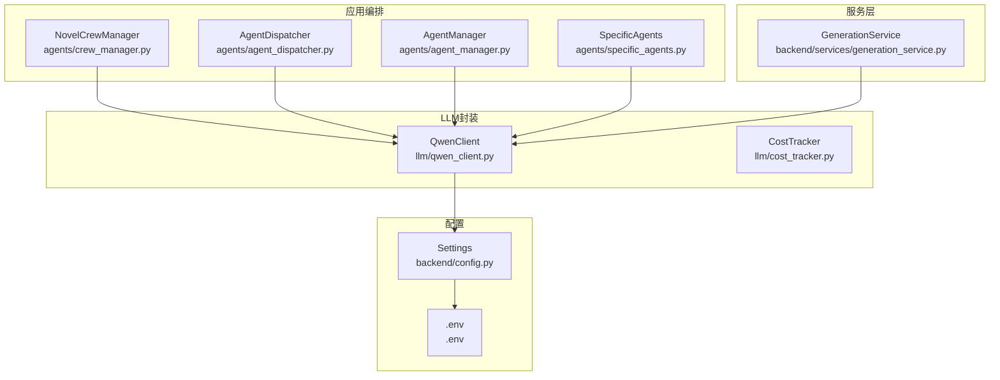
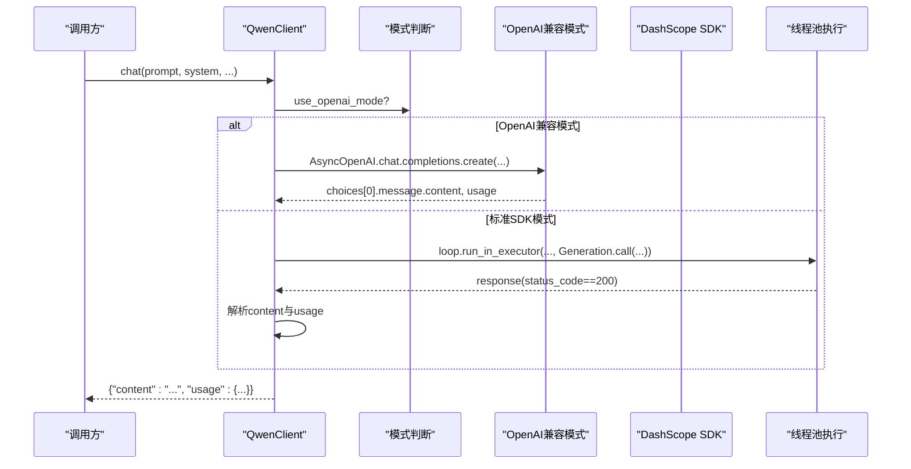
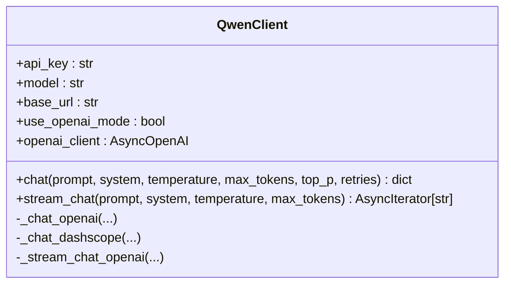
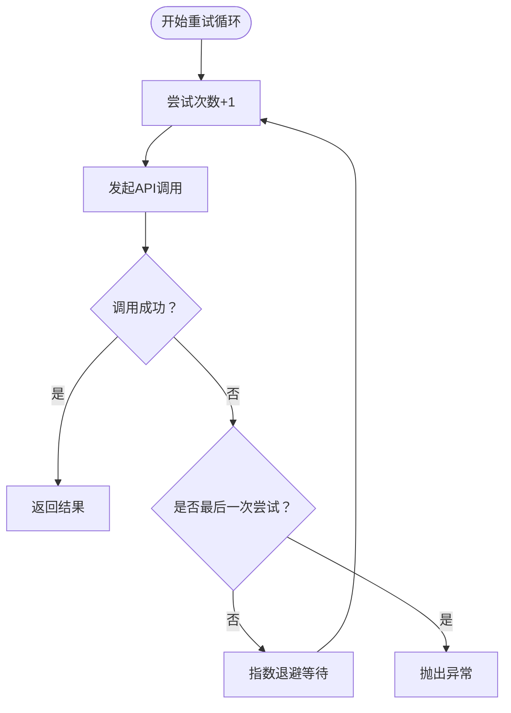
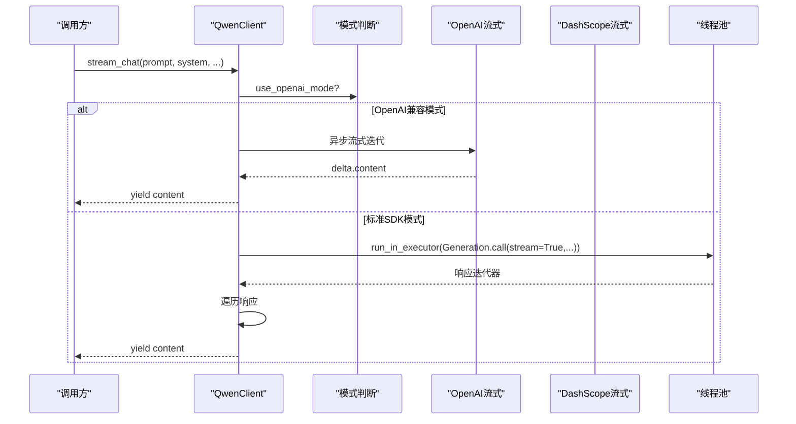
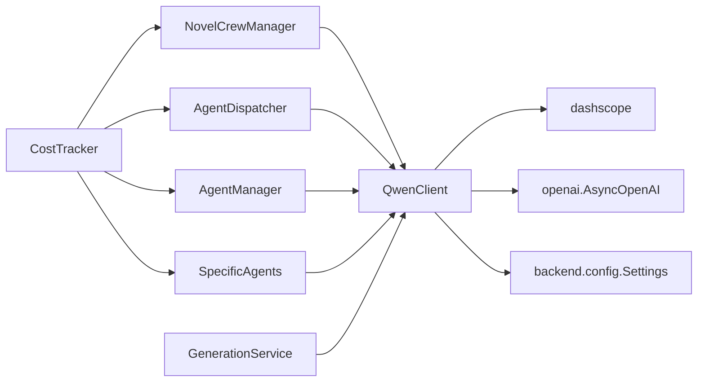

# LLM客户端封装

<cite>
**本文引用的文件**
- [llm/qwen_client.py](file://llm/qwen_client.py)
- [llm/__init__.py](file://llm/__init__.py)
- [backend/config.py](file://backend/config.py)
- [.env](file://.env)
- [.env.example](file://.env.example)
- [agents/crew_manager.py](file://agents/crew_manager.py)
- [agents/agent_dispatcher.py](file://agents/agent_dispatcher.py)
- [agents/agent_manager.py](file://agents/agent_manager.py)
- [agents/specific_agents.py](file://agents/specific_agents.py)
- [backend/services/generation_service.py](file://backend/services/generation_service.py)
- [llm/cost_tracker.py](file://llm/cost_tracker.py)
</cite>

## 目录
1. [简介](#简介)
2. [项目结构](#项目结构)
3. [核心组件](#核心组件)
4. [架构总览](#架构总览)
5. [组件详解](#组件详解)
6. [依赖关系分析](#依赖关系分析)
7. [性能考量](#性能考量)
8. [故障排查指南](#故障排查指南)
9. [结论](#结论)
10. [附录](#附录)

## 简介
本文件为“LLM客户端封装”的技术文档，聚焦于QwenClient类的设计与实现，覆盖以下主题：
- OpenAI兼容模式与标准DashScope SDK两种调用方式的实现差异
- 异步调用机制：事件循环处理、线程池使用、阻塞避免策略
- 重试机制：指数退避算法、错误分类处理、超时配置
- 流式输出：增量响应处理、内容拼接、异常中断恢复
- 配置管理：API密钥、模型参数、基础URL设置
- 性能优化建议、错误处理最佳实践、调试技巧
- 面向AI工程师与后端开发者的实用指导

## 项目结构
该仓库采用分层与功能模块结合的组织方式：
- llm目录：封装QwenClient、CostTracker、PromptManager等LLM相关能力
- agents目录：编排Agent工作流，调用QwenClient执行各阶段任务
- backend目录：服务层（GenerationService）、配置（Settings）、中间件等
- 核心配置通过.env与backend/config.py读取

图表来源
- [llm/qwen_client.py](file://llm/qwen_client.py#L16-L231)
- [llm/cost_tracker.py](file://llm/cost_tracker.py#L16-L74)
- [agents/crew_manager.py](file://agents/crew_manager.py#L19-L480)
- [agents/agent_dispatcher.py](file://agents/agent_dispatcher.py#L17-L440)
- [agents/agent_manager.py](file://agents/agent_manager.py#L22-L227)
- [agents/specific_agents.py](file://agents/specific_agents.py#L15-L200)
- [backend/services/generation_service.py](file://backend/services/generation_service.py#L27-L689)
- [backend/config.py](file://backend/config.py#L5-L59)
- [.env](file://.env#L1-L22)

章节来源
- [llm/qwen_client.py](file://llm/qwen_client.py#L1-L232)
- [backend/config.py](file://backend/config.py#L1-L59)
- [.env](file://.env#L1-L22)

## 核心组件
- QwenClient：统一的通义千问客户端封装，支持OpenAI兼容模式与标准DashScope SDK；提供同步/异步聊天与流式输出；内置指数退避重试。
- CostTracker：按模型定价追踪token用量与成本，支持记录、汇总与重置。
- GenerationService：服务层编排器，负责调用Agent调度器与QwenClient，持久化结果与token使用。

章节来源
- [llm/qwen_client.py](file://llm/qwen_client.py#L16-L231)
- [llm/cost_tracker.py](file://llm/cost_tracker.py#L16-L74)
- [backend/services/generation_service.py](file://backend/services/generation_service.py#L27-L689)

## 架构总览
QwenClient在不同模式下的调用路径如下：

图表来源
- [llm/qwen_client.py](file://llm/qwen_client.py#L46-L161)

章节来源
- [llm/qwen_client.py](file://llm/qwen_client.py#L29-L63)

## 组件详解

### QwenClient设计与实现
- 模式选择
  - 依据base_url是否包含特定标识判定是否启用OpenAI兼容模式。
  - 兼容模式下使用AsyncOpenAI；否则使用dashscope SDK并设置api_key与base_http_api_url。
- 同步/异步聊天
  - chat方法根据模式路由至_openai或_dashscope实现。
  - _chat_openai直接异步调用；_chat_dashscope通过线程池run_in_executor执行同步调用，避免阻塞事件循环。
- 重试机制
  - 采用指数退避（2^attempt秒），最多retries次尝试。
  - 对API错误与异常分别记录warning，并在最终失败时抛出RuntimeError。
- 流式输出
  - OpenAI兼容模式：直接使用异步流式接口，逐块yield delta内容。
  - 标准SDK模式：通过线程池执行同步流式调用，遍历响应对象，逐块yield content。
- 参数与默认值
  - 支持temperature、max_tokens、top_p等参数；默认模型与API密钥来自配置。

图表来源
- [llm/qwen_client.py](file://llm/qwen_client.py#L16-L231)

章节来源
- [llm/qwen_client.py](file://llm/qwen_client.py#L19-L63)
- [llm/qwen_client.py](file://llm/qwen_client.py#L65-L161)
- [llm/qwen_client.py](file://llm/qwen_client.py#L163-L228)

### 异步调用与线程池策略
- 事件循环处理
  - 在异步函数中通过asyncio.get_event_loop获取事件循环。
- 线程池使用
  - 使用loop.run_in_executor(None, ...)执行阻塞型同步调用，避免阻塞事件循环。
- 阻塞避免策略
  - 标准SDK的Generation.call在兼容模式下通过线程池执行，确保异步接口非阻塞。
  - OpenAI兼容模式直接使用异步流式接口，无需额外线程池。

图表来源
- [llm/qwen_client.py](file://llm/qwen_client.py#L126-L138)
- [llm/qwen_client.py](file://llm/qwen_client.py#L184-L196)

章节来源
- [llm/qwen_client.py](file://llm/qwen_client.py#L126-L138)
- [llm/qwen_client.py](file://llm/qwen_client.py#L184-L196)

### 重试机制设计
- 指数退避
  - 等待时间为2^attempt秒，最多retries次尝试。
- 错误分类
  - API错误（status_code!=200）与异常捕获分别记录warning。
- 超时配置
  - 当前实现未显式设置HTTP请求超时，若需增强可在AsyncOpenAI或dashscope SDK层增加timeout参数。

图表来源
- [llm/qwen_client.py](file://llm/qwen_client.py#L80-L106)
- [llm/qwen_client.py](file://llm/qwen_client.py#L124-L161)

章节来源
- [llm/qwen_client.py](file://llm/qwen_client.py#L80-L106)
- [llm/qwen_client.py](file://llm/qwen_client.py#L124-L161)

### 流式输出实现原理
- OpenAI兼容模式
  - 使用异步流式接口，逐块yield delta.content。
- 标准SDK模式
  - 使用线程池执行同步流式调用，遍历响应对象，逐块yield content。
- 异常中断恢复
  - 若响应状态码非200，立即抛出RuntimeError，中断流式过程。

图表来源
- [llm/qwen_client.py](file://llm/qwen_client.py#L163-L228)

章节来源
- [llm/qwen_client.py](file://llm/qwen_client.py#L163-L228)

### 配置管理
- 配置来源
  - Settings类从.env文件读取DASHSCOPE_API_KEY、DASHSCOPE_MODEL、DASHSCOPE_BASE_URL等。
  - .env中示例使用OpenAI兼容模式的base_url。
- 模式切换
  - 当base_url包含特定标识时启用OpenAI兼容模式；否则使用标准DashScope SDK。
- 模块导出
  - llm/__init__.py导出QwenClient、qwen_client、CostTracker、PromptManager。

章节来源
- [backend/config.py](file://backend/config.py#L5-L59)
- [.env](file://.env#L1-L22)
- [.env.example](file://.env.example#L1-L21)
- [llm/__init__.py](file://llm/__init__.py#L1-L6)

### 在编排系统中的使用
- 服务层调用
  - GenerationService在运行企划/写作阶段时，通过AgentDispatcher与NovelCrewManager间接调用QwenClient。
- Agent层调用
  - SpecificAgents与AgentManager在任务处理中直接调用QwenClient并记录CostTracker。
- 成本追踪
  - NovelCrewManager在每次调用后记录usage到CostTracker，并在服务层持久化token使用情况。

章节来源
- [backend/services/generation_service.py](file://backend/services/generation_service.py#L27-L689)
- [agents/crew_manager.py](file://agents/crew_manager.py#L104-L163)
- [agents/specific_agents.py](file://agents/specific_agents.py#L37-L113)
- [agents/agent_manager.py](file://agents/agent_manager.py#L64-L125)

## 依赖关系分析
- QwenClient依赖
  - dashscope与openai异步客户端
  - backend.config.settings读取配置
- 编排层依赖
  - agents/crew_manager.py、agents/agent_dispatcher.py、agents/agent_manager.py均依赖QwenClient与CostTracker
- 服务层依赖
  - backend/services/generation_service.py组合QwenClient与CostTracker，并通过AgentDispatcher编排

图表来源
- [llm/qwen_client.py](file://llm/qwen_client.py#L7-L11)
- [backend/config.py](file://backend/config.py#L5-L59)
- [agents/crew_manager.py](file://agents/crew_manager.py#L12-L35)
- [agents/agent_dispatcher.py](file://agents/agent_dispatcher.py#L10-L31)
- [agents/agent_manager.py](file://agents/agent_manager.py#L18-L69)
- [agents/specific_agents.py](file://agents/specific_agents.py#L7-L36)
- [backend/services/generation_service.py](file://backend/services/generation_service.py#L21-L34)

章节来源
- [llm/qwen_client.py](file://llm/qwen_client.py#L7-L11)
- [backend/config.py](file://backend/config.py#L5-L59)
- [agents/crew_manager.py](file://agents/crew_manager.py#L12-L35)
- [agents/agent_dispatcher.py](file://agents/agent_dispatcher.py#L10-L31)
- [agents/agent_manager.py](file://agents/agent_manager.py#L18-L69)
- [agents/specific_agents.py](file://agents/specific_agents.py#L7-L36)
- [backend/services/generation_service.py](file://backend/services/generation_service.py#L21-L34)

## 性能考量
- 异步与线程池
  - 标准SDK调用通过线程池执行，避免阻塞事件循环，适合高并发场景。
- 指数退避
  - 降低对上游API的压力，提高稳定性；可根据业务需求调整retries与等待策略。
- 流式输出
  - 减少内存占用，提升交互体验；注意在异常时及时中断流。
- 成本控制
  - 使用CostTracker记录usage，结合模型定价估算成本，便于预算控制。

## 故障排查指南
- 常见错误与定位
  - API错误：检查status_code与message，确认网络连通与鉴权信息。
  - 异常：查看warning日志中的last_error，定位具体异常类型。
  - 流式中断：若出现非200状态，立即抛出RuntimeError，需检查请求参数与模型可用性。
- 调试建议
  - 在调用前后打印usage，核对prompt_tokens与completion_tokens。
  - 在Agent层与服务层分别记录调用耗时与结果，便于定位瓶颈。
  - 使用较小max_tokens与temperature快速验证流程。

章节来源
- [llm/qwen_client.py](file://llm/qwen_client.py#L97-L106)
- [llm/qwen_client.py](file://llm/qwen_client.py#L152-L161)
- [llm/qwen_client.py](file://llm/qwen_client.py#L204-L204)

## 结论
QwenClient提供了统一、健壮的通义千问调用封装，支持OpenAI兼容模式与标准SDK两种路径，具备完善的异步与重试机制、流式输出能力以及成本追踪支持。结合编排层与服务层的协同，可高效支撑小说创作全流程的自动化生成与发布。

## 附录
- 配置项说明
  - DASHSCOPE_API_KEY：通义千问API密钥
  - DASHSCOPE_MODEL：默认模型名称
  - DASHSCOPE_BASE_URL：基础URL，包含特定标识时启用OpenAI兼容模式
- 使用建议
  - 在生产环境建议开启指数退避与合理的retries上限
  - 对于高并发场景，优先使用OpenAI兼容模式的异步接口
  - 结合CostTracker进行成本监控与优化

章节来源
- [.env](file://.env#L1-L22)
- [.env.example](file://.env.example#L1-L21)
- [backend/config.py](file://backend/config.py#L5-L59)