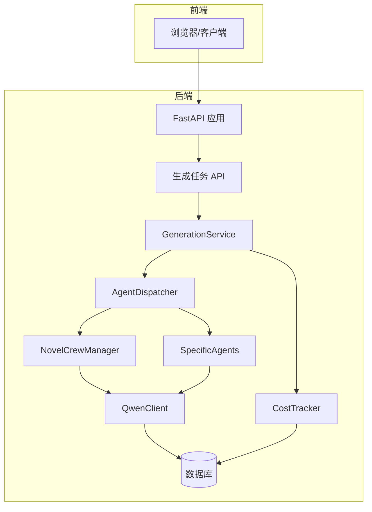
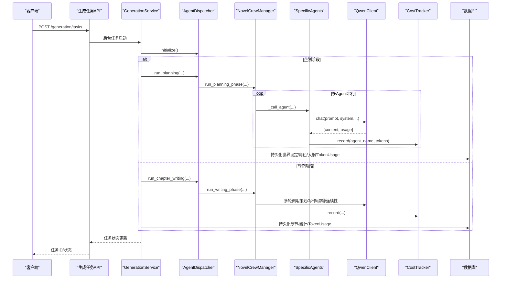
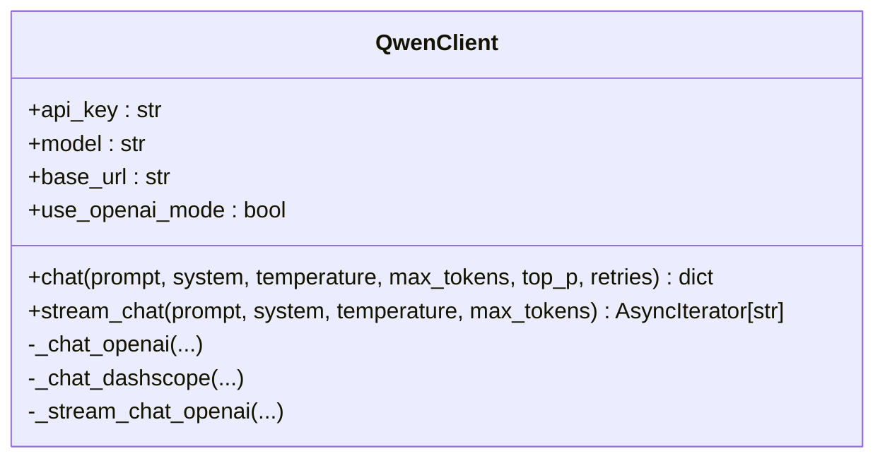
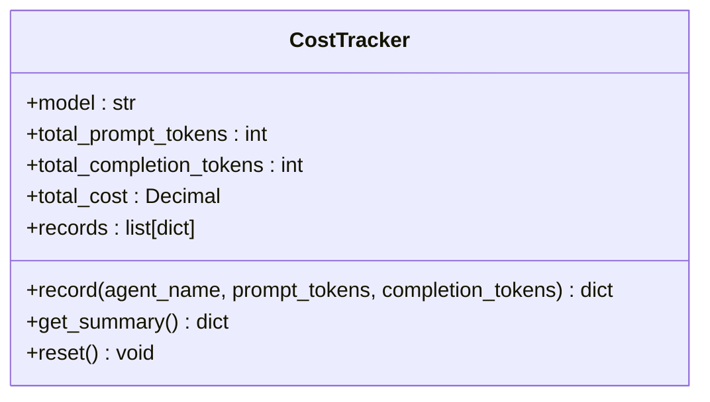
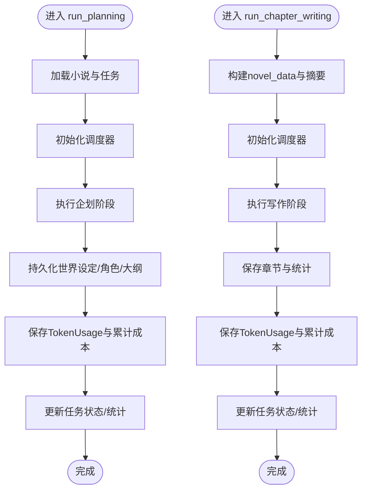
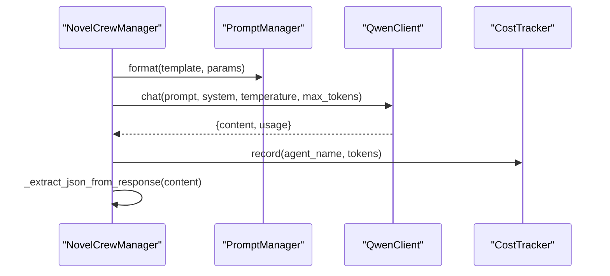
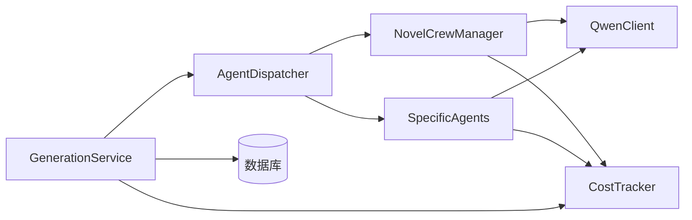

# LLM集成架构

<cite>
**本文引用的文件**
- [llm/qwen_client.py](file://llm/qwen_client.py)
- [llm/cost_tracker.py](file://llm/cost_tracker.py)
- [backend/services/generation_service.py](file://backend/services/generation_service.py)
- [agents/agent_dispatcher.py](file://agents/agent_dispatcher.py)
- [agents/crew_manager.py](file://agents/crew_manager.py)
- [agents/specific_agents.py](file://agents/specific_agents.py)
- [backend/api/v1/generation.py](file://backend/api/v1/generation.py)
- [backend/config.py](file://backend/config.py)
- [core/models/token_usage.py](file://core/models/token_usage.py)
- [core/models/novel.py](file://core/models/novel.py)
- [workers/generation_worker.py](file://workers/generation_worker.py)
- [backend/main.py](file://backend/main.py)
</cite>

## 目录
1. [引言](#引言)
2. [项目结构](#项目结构)
3. [核心组件](#核心组件)
4. [架构总览](#架构总览)
5. [详细组件分析](#详细组件分析)
6. [依赖关系分析](#依赖关系分析)
7. [性能考量](#性能考量)
8. [故障排查指南](#故障排查指南)
9. [结论](#结论)
10. [附录](#附录)

## 引言
本技术文档面向AI工程师与系统架构师，系统性梳理本项目的LLM集成架构，重点覆盖以下方面：
- DashScope/Qwen API的集成实现：异步封装、OpenAI兼容模式、重试与指数退避、流式输出。
- Token使用追踪系统：使用量统计、成本计算、累计汇总、持久化记录。
- 提示词管理：模板化、参数注入、版本与A/B测试的可扩展性建议。
- 错误处理策略：网络异常、API限流、模型过载、任务取消与降级。
- 性能优化：请求批处理、并发控制、缓存与预热、成本控制与模型选择。
- 质量评估：连续性检查、质量评分、成本-质量权衡。

## 项目结构
项目采用分层与模块化组织：
- llm：LLM客户端与成本追踪模块
- agents：Agent调度、编排与具体Agent实现
- backend：FastAPI应用、API路由、服务层、数据库模型
- core：通用模型、数据库、日志配置
- workers：Celery工作进程（可选的异步执行路径）

图表来源
- [backend/main.py](file://backend/main.py#L15-L33)
- [backend/api/v1/generation.py](file://backend/api/v1/generation.py#L23-L103)
- [backend/services/generation_service.py](file://backend/services/generation_service.py#L27-L35)
- [agents/agent_dispatcher.py](file://agents/agent_dispatcher.py#L17-L32)
- [agents/crew_manager.py](file://agents/crew_manager.py#L19-L36)
- [agents/specific_agents.py](file://agents/specific_agents.py#L15-L36)
- [llm/qwen_client.py](file://llm/qwen_client.py#L16-L45)
- [llm/cost_tracker.py](file://llm/cost_tracker.py#L16-L25)

章节来源
- [backend/main.py](file://backend/main.py#L15-L33)
- [backend/api/v1/generation.py](file://backend/api/v1/generation.py#L23-L103)

## 核心组件
- QwenClient：统一的DashScope/Qwen客户端，支持OpenAI兼容模式与标准SDK模式；提供同步阻塞调用的线程池封装，避免事件循环阻塞；内置指数退避重试与流式输出。
- CostTracker：按模型定价表统计prompt/completion token与累计成本，记录明细并提供汇总接口。
- GenerationService：服务编排入口，负责任务生命周期、数据库持久化、成本归集与小说统计更新。
- AgentDispatcher：在“调度器模式”与“CrewAI风格”之间切换，协调Agent执行流程。
- NovelCrewManager：以“直接调用QwenClient”的方式实现的Crew编排，负责提示词模板调用、JSON提取、成本追踪与阶段串联。
- SpecificAgents：市场分析、内容策划、创作、编辑、发布等Agent，均通过PromptManager注入模板与参数，并调用QwenClient与CostTracker。
- 数据模型：TokenUsage、Novel等，承载成本与统计的持久化。

章节来源
- [llm/qwen_client.py](file://llm/qwen_client.py#L16-L232)
- [llm/cost_tracker.py](file://llm/cost_tracker.py#L16-L74)
- [backend/services/generation_service.py](file://backend/services/generation_service.py#L27-L35)
- [agents/agent_dispatcher.py](file://agents/agent_dispatcher.py#L17-L32)
- [agents/crew_manager.py](file://agents/crew_manager.py#L19-L36)
- [agents/specific_agents.py](file://agents/specific_agents.py#L15-L36)
- [core/models/token_usage.py](file://core/models/token_usage.py#L11-L25)
- [core/models/novel.py](file://core/models/novel.py#L37-L66)

## 架构总览
下图展示从API到LLM调用与成本追踪的关键交互路径：

图表来源
- [backend/api/v1/generation.py](file://backend/api/v1/generation.py#L73-L103)
- [backend/services/generation_service.py](file://backend/services/generation_service.py#L68-L196)
- [agents/agent_dispatcher.py](file://agents/agent_dispatcher.py#L33-L68)
- [agents/crew_manager.py](file://agents/crew_manager.py#L104-L163)
- [agents/specific_agents.py](file://agents/specific_agents.py#L37-L113)
- [llm/qwen_client.py](file://llm/qwen_client.py#L46-L161)
- [llm/cost_tracker.py](file://llm/cost_tracker.py#L26-L56)
- [core/models/token_usage.py](file://core/models/token_usage.py#L11-L25)

## 详细组件分析

### QwenClient：DashScope/Qwen集成与异步封装
- 模式识别：根据base_url是否包含特定字符串自动切换OpenAI兼容模式或标准DashScope SDK模式。
- 异步调用：OpenAI兼容模式直接使用异步客户端；标准SDK模式通过线程池在事件循环外执行同步调用，避免阻塞。
- 重试机制：指数退避重试，最多n次，记录每次异常并等待相应时间后重试。
- 流式输出：支持增量返回文本片段，便于前端实时渲染。
- 参数优化：温度、最大token、top_p等参数可配置；根据模型能力与场景选择合理上限。

图表来源
- [llm/qwen_client.py](file://llm/qwen_client.py#L16-L232)

章节来源
- [llm/qwen_client.py](file://llm/qwen_client.py#L19-L161)

### CostTracker：Token使用与成本追踪
- 定价表：按模型区分输入/输出单价（元/千tokens），支持qwen-plus/turbo/max等。
- 记录与汇总：单次调用记录prompt/completion/total tokens与成本；提供累计统计与明细列表。
- 日志输出：每次record输出当前调用成本与累计成本，便于可观测性。

图表来源
- [llm/cost_tracker.py](file://llm/cost_tracker.py#L16-L74)

章节来源
- [llm/cost_tracker.py](file://llm/cost_tracker.py#L19-L74)
- [core/models/token_usage.py](file://core/models/token_usage.py#L11-L25)

### GenerationService：服务编排与持久化
- 生命周期：创建任务、初始化调度器、执行阶段、持久化结果、更新小说统计与任务状态。
- 企划阶段：构建世界观、角色、情节大纲，记录TokenUsage与累计成本。
- 写作阶段：构建novel_data与前几章摘要，执行单章写作与批量写作，更新章节统计与成本。
- 错误处理：捕获异常、回滚任务状态、记录错误信息。

图表来源
- [backend/services/generation_service.py](file://backend/services/generation_service.py#L36-L196)
- [backend/services/generation_service.py](file://backend/services/generation_service.py#L206-L377)

章节来源
- [backend/services/generation_service.py](file://backend/services/generation_service.py#L30-L35)
- [backend/services/generation_service.py](file://backend/services/generation_service.py#L68-L196)
- [backend/services/generation_service.py](file://backend/services/generation_service.py#L206-L377)

### AgentDispatcher：调度与模式切换
- 模式：默认使用CrewAI风格（NovelCrewManager）；可切换至“基于调度器的Agent系统”，当前仅部分流程实现。
- 初始化：启动Agent管理器，准备各Agent可用。
- 任务编排：根据任务类型（planning/writing/batch_writing）选择对应执行路径。

章节来源
- [agents/agent_dispatcher.py](file://agents/agent_dispatcher.py#L17-L68)
- [agents/agent_dispatcher.py](file://agents/agent_dispatcher.py#L171-L195)
- [agents/agent_dispatcher.py](file://agents/agent_dispatcher.py#L197-L263)

### NovelCrewManager：提示词驱动的编排
- 直接调用QwenClient：不依赖外部LLM集成，通过PromptManager模板化提示词。
- JSON提取：对LLM返回的非结构化文本进行鲁棒解析，支持markdown代码块与括号匹配。
- 成本追踪：在每次Agent调用后记录usage，统一由CostTracker汇总。
- 阶段串联：企划阶段（主题分析→世界观→角色→情节），写作阶段（策划→初稿→编辑→连续性检查）。

图表来源
- [agents/crew_manager.py](file://agents/crew_manager.py#L104-L163)
- [agents/crew_manager.py](file://agents/crew_manager.py#L168-L302)
- [agents/crew_manager.py](file://agents/crew_manager.py#L308-L479)

章节来源
- [agents/crew_manager.py](file://agents/crew_manager.py#L19-L36)
- [agents/crew_manager.py](file://agents/crew_manager.py#L104-L163)
- [agents/crew_manager.py](file://agents/crew_manager.py#L168-L302)
- [agents/crew_manager.py](file://agents/crew_manager.py#L308-L479)

### SpecificAgents：模板化Agent实现
- MarketAnalysisAgent/ContentPlanningAgent/WritingAgent/EditingAgent/PublishingAgent：均通过PromptManager注入系统提示词与任务提示词，调用QwenClient并记录成本。
- 通信：通过AgentCommunicator发送任务完成消息（当前调度器模式下使用），便于后续编排。

章节来源
- [agents/specific_agents.py](file://agents/specific_agents.py#L15-L113)
- [agents/specific_agents.py](file://agents/specific_agents.py#L115-L214)
- [agents/specific_agents.py](file://agents/specific_agents.py#L216-L320)
- [agents/specific_agents.py](file://agents/specific_agents.py#L322-L423)
- [agents/specific_agents.py](file://agents/specific_agents.py#L425-L505)

### API层：任务提交与查询
- 任务创建：支持planning、writing、batch_writing三类任务；批量写作需提供起止章节。
- 任务列表与详情：支持按小说ID与状态过滤，分页查询。
- 取消任务：仅允许未完成的任务被取消。

章节来源
- [backend/api/v1/generation.py](file://backend/api/v1/generation.py#L23-L103)
- [backend/api/v1/generation.py](file://backend/api/v1/generation.py#L106-L134)
- [backend/api/v1/generation.py](file://backend/api/v1/generation.py#L137-L171)

### 配置与环境
- 设置项：DashScope API密钥、模型、base_url；数据库、Redis、Celery等。
- 环境变量：通过Settings读取.env文件，支持缓存。

章节来源
- [backend/config.py](file://backend/config.py#L5-L59)

### 数据模型与持久化
- TokenUsage：记录每次调用的agent名、tokens与成本，关联小说与任务。
- Novel：维护token_cost、章节/字数统计、状态等。

章节来源
- [core/models/token_usage.py](file://core/models/token_usage.py#L11-L25)
- [core/models/novel.py](file://core/models/novel.py#L37-L66)

### Celery工作进程（可选）
- 通过workers/generation_worker.py在同步环境中运行异步任务，适配后台队列执行。
- 适用于生产环境的高并发与可靠性保障。

章节来源
- [workers/generation_worker.py](file://workers/generation_worker.py#L21-L69)

## 依赖关系分析
- 组件耦合：GenerationService依赖QwenClient与CostTracker；AgentDispatcher协调CrewManager与SpecificAgents；CrewManager与SpecificAgents均依赖QwenClient与CostTracker。
- 外部依赖：DashScope SDK、OpenAI异步客户端、SQLAlchemy、Celery/Redis。
- 循环依赖：当前实现未发现循环导入；注意在Agent与PromptManager之间保持模板只读注入，避免双向耦合。

图表来源
- [backend/services/generation_service.py](file://backend/services/generation_service.py#L27-L35)
- [agents/agent_dispatcher.py](file://agents/agent_dispatcher.py#L17-L32)
- [agents/crew_manager.py](file://agents/crew_manager.py#L19-L36)
- [agents/specific_agents.py](file://agents/specific_agents.py#L15-L36)
- [llm/qwen_client.py](file://llm/qwen_client.py#L16-L45)
- [llm/cost_tracker.py](file://llm/cost_tracker.py#L16-L25)

## 性能考量
- 请求批处理与并发控制
  - 批量写作：GenerationService提供批量执行接口，内部逐章调用，适合顺序稳定场景；可结合Celery队列实现并行化与限速。
  - 并发与限流：QwenClient内置指数退避；建议在API层增加速率限制与队列缓冲，避免瞬时峰值导致限流。
- 缓存策略
  - Prompt模板与参数：可在Agent侧缓存常用模板格式化结果，减少重复拼接开销。
  - 历史摘要：对前几章摘要进行本地缓存，避免重复构造。
- 预热机制
  - 在部署初期预热常用模型与提示词，降低首帧延迟。
- 成本控制与模型选择
  - 根据任务复杂度选择合适模型：简单推理用turbo，结构化输出与JSON解析用max。
  - 动态调整temperature与max_tokens，平衡质量与成本。
- 质量评估
  - 连续性检查与质量评分：CrewManager内置连续性检查Agent，输出质量评分与问题清单，便于持续改进。

[本节为通用指导，无需列出章节来源]

## 故障排查指南
- 网络异常与超时
  - QwenClient在异常时记录警告并指数退避重试；若多次失败，抛出运行时错误。建议在上层增加熔断与降级策略。
- API限流与配额
  - 当DashScope返回非200状态码时，QwenClient记录错误并重试；建议监控429/402等状态码并触发限速。
- 模型过载与不稳定
  - 通过降低temperature、缩短max_tokens、拆分长提示词等方式缓解；必要时切换更稳定的模型。
- 任务取消与状态不一致
  - API层支持取消未完成任务；若出现状态不一致，检查任务状态更新逻辑与数据库事务。
- JSON解析失败
  - CrewManager的JSON提取具备多种策略；若仍失败，检查提示词约束与模型输出稳定性，必要时启用严格JSON模式。

章节来源
- [llm/qwen_client.py](file://llm/qwen_client.py#L79-L106)
- [llm/qwen_client.py](file://llm/qwen_client.py#L123-L161)
- [agents/crew_manager.py](file://agents/crew_manager.py#L37-L103)

## 结论
本项目通过QwenClient与CostTracker实现了对DashScope/Qwen的统一接入与成本可控；GenerationService与AgentDispatcher提供清晰的服务编排与任务生命周期管理；CrewManager与SpecificAgents以提示词模板为核心，形成可扩展的Agent协作框架。建议在生产环境中引入Celery并行化、速率限制与熔断、模板缓存与预热，持续优化成本与质量的平衡。

[本节为总结，无需列出章节来源]

## 附录
- 提示词管理建议
  - 模板设计：将系统提示词与任务提示词分离，便于版本控制与A/B测试。
  - 动态参数注入：通过PromptManager.format集中注入，保证一致性与可测试性。
  - 版本控制：为关键提示词建立版本号，配合灰度发布与效果评估。
  - A/B测试：对不同提示词版本进行对照实验，收集质量评分与成本指标，持续迭代。

[本节为概念性建议，无需列出章节来源]