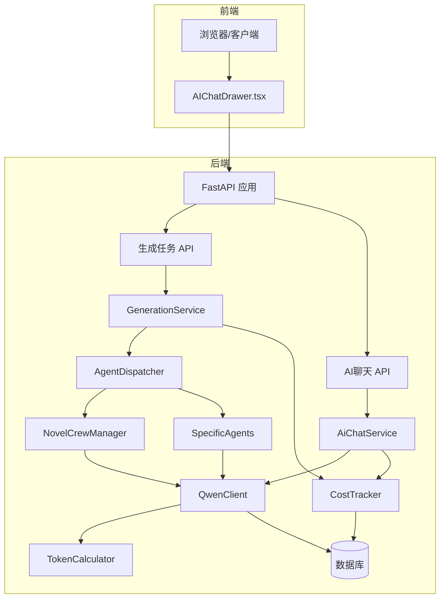
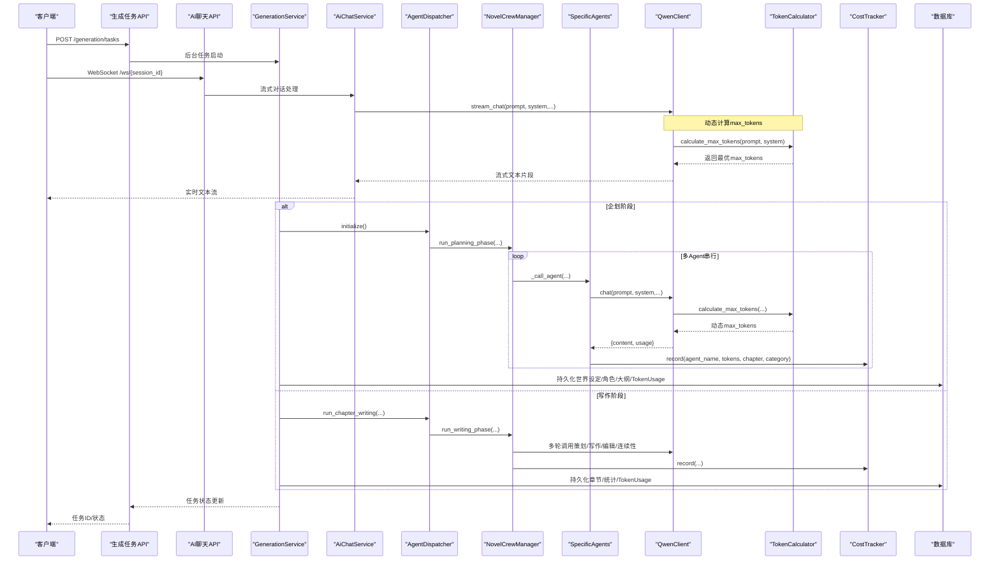
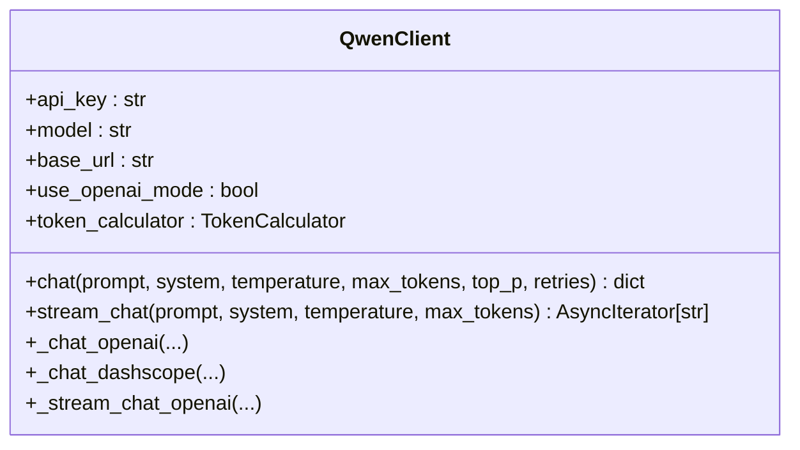
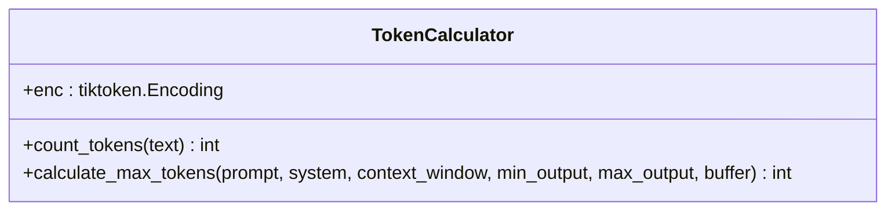
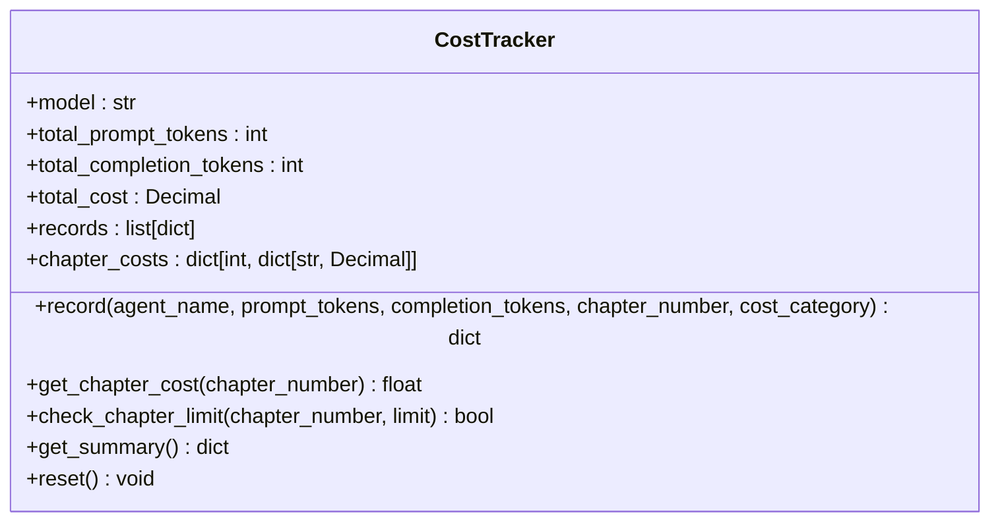
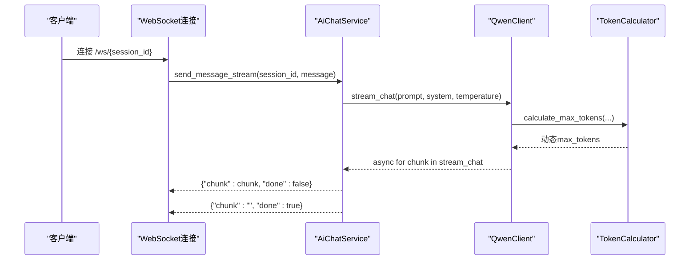
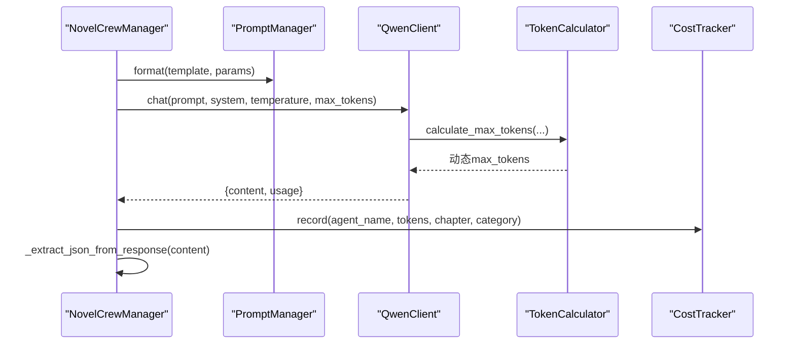
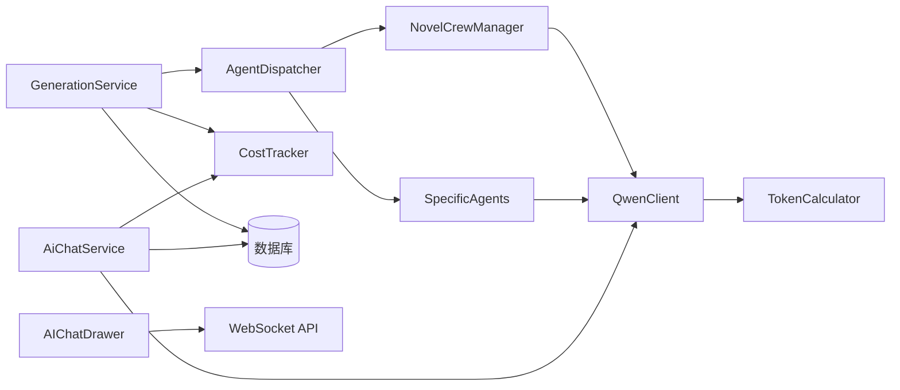

# LLM集成架构

<cite>
**本文引用的文件**
- [llm/qwen_client.py](file://llm/qwen_client.py)
- [llm/token_calculator.py](file://llm/token_calculator.py)
- [llm/cost_tracker.py](file://llm/cost_tracker.py)
- [backend/services/generation_service.py](file://backend/services/generation_service.py)
- [agents/agent_dispatcher.py](file://agents/agent_dispatcher.py)
- [agents/crew_manager.py](file://agents/crew_manager.py)
- [agents/specific_agents.py](file://agents/specific_agents.py)
- [backend/api/v1/generation.py](file://backend/api/v1/generation.py)
- [backend/api/v1/ai_chat.py](file://backend/api/v1/ai_chat.py)
- [backend/services/ai_chat_service.py](file://backend/services/ai_chat_service.py)
- [backend/config.py](file://backend/config.py)
- [core/models/token_usage.py](file://core/models/token_usage.py)
- [core/models/novel.py](file://core/models/novel.py)
- [workers/generation_worker.py](file://workers/generation_worker.py)
- [backend/main.py](file://backend/main.py)
- [frontend/src/components/AIChatDrawer.tsx](file://frontend/src/components/AIChatDrawer.tsx)
- [backend/utils/retry.py](file://backend/utils/retry.py)
- [backend/utils/concurrency.py](file://backend/utils/concurrency.py)
- [tests/unit/test_token_calculator.py](file://tests/unit/test_token_calculator.py)
</cite>

## 更新摘要
**变更内容**
- 新增TokenCalculator类，实现基于tiktoken的精确token计算和智能max_tokens动态分配
- 增强QwenClient的动态token管理能力，支持根据输入内容自动计算最优输出空间
- 优化成本追踪系统，新增章节维度和成本类别追踪功能
- 完善异步流式调用的错误处理和性能监控机制

## 目录
1. [引言](#引言)
2. [项目结构](#项目结构)
3. [核心组件](#核心组件)
4. [架构总览](#架构总览)
5. [详细组件分析](#详细组件分析)
6. [依赖关系分析](#依赖关系分析)
7. [性能考量](#性能考量)
8. [故障排查指南](#故障排查指南)
9. [结论](#结论)
10. [附录](#附录)

## 引言
本技术文档面向AI工程师与系统架构师，系统性梳理本项目的LLM集成架构，重点覆盖以下方面：
- DashScope/Qwen API的集成实现：异步封装、OpenAI兼容模式、重试与指数退避、流式输出。
- **新增** Token动态管理：基于tiktoken的精确token计算和智能max_tokens分配算法。
- **增强** 成本追踪系统：按章节、按类别维度的成本追踪与预算控制。
- 提示词管理：模板化、参数注入、版本与A/B测试的可扩展性建议。
- 错误处理策略：网络异常、API限流、模型过载、任务取消与降级。
- 性能优化：请求批处理、并发控制、缓存与预热、成本控制与模型选择。
- 质量评估：连续性检查、质量评分、成本-质量权衡。

## 项目结构
项目采用分层与模块化组织：
- llm：LLM客户端与成本追踪模块，**新增** TokenCalculator动态token管理
- agents：Agent调度、编排与具体Agent实现
- backend：FastAPI应用、API路由、服务层、数据库模型
- core：通用模型、数据库、日志配置
- workers：Celery工作进程（可选的异步执行路径）
- frontend：React前端应用，支持WebSocket实时对话

**图表来源**
- [backend/main.py:15-33](file://backend/main.py#L15-L33)
- [backend/api/v1/generation.py:23-103](file://backend/api/v1/generation.py#L23-L103)
- [backend/api/v1/ai_chat.py:129-189](file://backend/api/v1/ai_chat.py#L129-L189)
- [backend/services/generation_service.py:27-35](file://backend/services/generation_service.py#L27-L35)
- [backend/services/ai_chat_service.py:2155-2349](file://backend/services/ai_chat_service.py#L2155-L2349)
- [agents/agent_dispatcher.py:17-32](file://agents/agent_dispatcher.py#L17-L32)
- [agents/crew_manager.py:19-36](file://agents/crew_manager.py#L19-L36)
- [agents/specific_agents.py:15-36](file://agents/specific_agents.py#L15-L36)
- [llm/qwen_client.py:16-45](file://llm/qwen_client.py#L16-L45)
- [llm/token_calculator.py:1-86](file://llm/token_calculator.py#L1-L86)
- [llm/cost_tracker.py:16-25](file://llm/cost_tracker.py#L16-L25)

**章节来源**
- [backend/main.py:15-33](file://backend/main.py#L15-L33)
- [backend/api/v1/generation.py:23-103](file://backend/api/v1/generation.py#L23-L103)
- [backend/api/v1/ai_chat.py:129-189](file://backend/api/v1/ai_chat.py#L129-L189)

## 核心组件
- QwenClient：统一的DashScope/Qwen客户端，支持OpenAI兼容模式与标准SDK模式；提供同步阻塞调用的线程池封装，避免事件循环阻塞；内置指数退避重试与流式输出；**新增** 集成TokenCalculator实现智能max_tokens动态分配。
- **新增** TokenCalculator：基于tiktoken的精确token计算器，支持中文和英文文本的精确token计数，实现动态max_tokens智能分配算法。
- CostTracker：按模型定价表统计prompt/completion token与累计成本，**增强** 支持章节维度和成本类别追踪，提供详细的成本分析接口。
- GenerationService：服务编排入口，负责任务生命周期、数据库持久化、成本归集与小说统计更新。
- AiChatService：AI聊天服务，支持同步和流式对话，集成WebSocket实时通信。
- AgentDispatcher：在"调度器模式"与"CrewAI风格"之间切换，协调Agent执行流程。
- NovelCrewManager：以"直接调用QwenClient"的方式实现的Crew编排，负责提示词模板调用、JSON提取、成本追踪与阶段串联。
- SpecificAgents：市场分析、内容策划、创作、编辑、发布等Agent，均通过PromptManager注入模板与参数，并调用QwenClient与CostTracker。
- 数据模型：TokenUsage、Novel等，承载成本与统计的持久化。
- AIChatDrawer：前端WebSocket组件，实现实时对话界面。

**章节来源**
- [llm/qwen_client.py:16-350](file://llm/qwen_client.py#L16-L350)
- [llm/token_calculator.py:1-86](file://llm/token_calculator.py#L1-L86)
- [llm/cost_tracker.py:16-126](file://llm/cost_tracker.py#L16-L126)
- [backend/services/generation_service.py:27-35](file://backend/services/generation_service.py#L27-L35)
- [backend/services/ai_chat_service.py:2155-2349](file://backend/services/ai_chat_service.py#L2155-L2349)
- [agents/agent_dispatcher.py:17-32](file://agents/agent_dispatcher.py#L17-L32)
- [agents/crew_manager.py:19-36](file://agents/crew_manager.py#L19-L36)
- [agents/specific_agents.py:15-36](file://agents/specific_agents.py#L15-L36)
- [core/models/token_usage.py:11-25](file://core/models/token_usage.py#L11-L25)
- [core/models/novel.py:37-66](file://core/models/novel.py#L37-L66)
- [frontend/src/components/AIChatDrawer.tsx:146-201](file://frontend/src/components/AIChatDrawer.tsx#L146-L201)

## 架构总览
下图展示从API到LLM调用与成本追踪的关键交互路径，**新增** TokenCalculator的动态token管理流程：

**图表来源**
- [backend/api/v1/generation.py:73-103](file://backend/api/v1/generation.py#L73-L103)
- [backend/api/v1/ai_chat.py:129-189](file://backend/api/v1/ai_chat.py#L129-L189)
- [backend/services/generation_service.py:68-196](file://backend/services/generation_service.py#L68-L196)
- [backend/services/ai_chat_service.py:2155-2349](file://backend/services/ai_chat_service.py#L2155-L2349)
- [agents/agent_dispatcher.py:33-68](file://agents/agent_dispatcher.py#L33-L68)
- [agents/crew_manager.py:104-163](file://agents/crew_manager.py#L104-L163)
- [agents/specific_agents.py:37-113](file://agents/specific_agents.py#L37-L113)
- [llm/qwen_client.py:180-269](file://llm/qwen_client.py#L180-L269)
- [llm/token_calculator.py:42-85](file://llm/token_calculator.py#L42-L85)
- [llm/cost_tracker.py:26-56](file://llm/cost_tracker.py#L26-L56)
- [core/models/token_usage.py:11-25](file://core/models/token_usage.py#L11-L25)

## 详细组件分析

### QwenClient：DashScope/Qwen集成与异步封装
- 模式识别：根据base_url是否包含特定字符串自动切换OpenAI兼容模式或标准DashScope SDK模式。
- **新增** TokenCalculator集成：初始化时创建TokenCalculator实例，用于动态计算max_tokens。
- 异步调用：OpenAI兼容模式直接使用异步客户端；标准SDK模式通过线程池在事件循环外执行同步调用，避免阻塞。
- **增强** 动态token管理：当max_tokens为None时，自动调用TokenCalculator.calculate_max_tokens()计算最优输出空间。
- 重试机制：指数退避重试，最多n次，记录每次异常并等待相应时间后重试。
- 流式输出：支持增量返回文本片段，便于前端实时渲染。

**更新** 集成TokenCalculator实现智能max_tokens动态分配

**图表来源**
- [llm/qwen_client.py:16-350](file://llm/qwen_client.py#L16-L350)
- [llm/token_calculator.py:7-25](file://llm/token_calculator.py#L7-L25)

**章节来源**
- [llm/qwen_client.py:19-350](file://llm/qwen_client.py#L19-L350)

### TokenCalculator：智能token动态管理
- **新增** 精确token计算：基于tiktoken库实现中文和英文文本的精确token计数，支持编码失败时的降级估算。
- **新增** 智能max_tokens算法：根据输入token数量、模型上下文窗口和安全缓冲区动态计算最优输出空间。
- **新增** 参数配置：支持自定义编码方式、上下文窗口、最小/最大输出token数、安全缓冲区等参数。
- **新增** 警告机制：当输入过大导致可用输出空间不足时发出警告，建议压缩输入内容。

**图表来源**
- [llm/token_calculator.py:7-86](file://llm/token_calculator.py#L7-L86)

**章节来源**
- [llm/token_calculator.py:1-86](file://llm/token_calculator.py#L1-L86)

### CostTracker：增强的成本追踪系统
- **增强** 章节维度追踪：新增chapter_costs字典，支持按章节维度的成本统计和分析。
- **增强** 成本类别追踪：支持base、iteration、query、vote等不同成本类别的精细化追踪。
- **增强** 预算控制：新增check_chapter_limit()方法，支持章节成本超限检测和预算控制。
- 定价表：按模型区分输入/输出单价（元/千tokens），支持qwen-plus/turbo/max等。
- 记录与汇总：单次调用记录prompt/completion/total tokens与成本；提供累计统计与明细列表。
- 日志输出：每次record输出当前调用成本与累计成本，便于可观测性。

**图表来源**
- [llm/cost_tracker.py:16-126](file://llm/cost_tracker.py#L16-L126)

**章节来源**
- [llm/cost_tracker.py:1-126](file://llm/cost_tracker.py#L1-L126)
- [core/models/token_usage.py:11-25](file://core/models/token_usage.py#L11-L25)

### GenerationService：服务编排与持久化
- 生命周期：创建任务、初始化调度器、执行阶段、持久化结果、更新小说统计与任务状态。
- 企划阶段：构建世界观、角色、情节大纲，记录TokenUsage与累计成本。
- 写作阶段：构建novel_data与前几章摘要，执行单章写作与批量写作，更新章节统计与成本。
- 错误处理：捕获异常、回滚任务状态、记录错误信息。

**图表来源**
- [backend/services/generation_service.py:36-196](file://backend/services/generation_service.py#L36-L196)
- [backend/services/generation_service.py:206-377](file://backend/services/generation_service.py#L206-L377)

**章节来源**
- [backend/services/generation_service.py:30-35](file://backend/services/generation_service.py#L30-L35)
- [backend/services/generation_service.py:68-196](file://backend/services/generation_service.py#L68-L196)
- [backend/services/generation_service.py:206-377](file://backend/services/generation_service.py#L206-L377)

### AiChatService：AI聊天服务与流式对话
- 同步与流式对话：支持传统的同步消息回复和WebSocket流式对话。
- 流式处理：使用async for循环遍历stream_chat的异步迭代器，实现实时文本流输出。
- **增强** Token动态管理：流式对话同样支持TokenCalculator的智能max_tokens分配。
- WebSocket集成：提供完整的WebSocket接口，支持客户端与服务器的双向实时通信。
- 会话管理：维护用户会话状态，支持澄清机制和后续问题生成。
- 错误处理：完善的异常捕获和错误响应机制，确保服务稳定性。

**更新** 增强的流式对话支持Token动态管理

**图表来源**
- [backend/api/v1/ai_chat.py:129-189](file://backend/api/v1/ai_chat.py#L129-L189)
- [backend/services/ai_chat_service.py:2155-2349](file://backend/services/ai_chat_service.py#L2155-L2349)
- [llm/qwen_client.py:180-269](file://llm/qwen_client.py#L180-L269)
- [llm/token_calculator.py:42-85](file://llm/token_calculator.py#L42-L85)

**章节来源**
- [backend/api/v1/ai_chat.py:129-189](file://backend/api/v1/ai_chat.py#L129-L189)
- [backend/services/ai_chat_service.py:2155-2349](file://backend/services/ai_chat_service.py#L2155-L2349)

### AgentDispatcher：调度与模式切换
- 模式：默认使用CrewAI风格（NovelCrewManager）；可切换至"基于调度器的Agent系统"，当前仅部分流程实现。
- 初始化：启动Agent管理器，准备各Agent可用。
- 任务编排：根据任务类型（planning/writing/batch_writing）选择对应执行路径。

**章节来源**
- [agents/agent_dispatcher.py:17-68](file://agents/agent_dispatcher.py#L17-L68)
- [agents/agent_dispatcher.py:171-195](file://agents/agent_dispatcher.py#L171-L195)
- [agents/agent_dispatcher.py:197-263](file://agents/agent_dispatcher.py#L197-L263)

### NovelCrewManager：提示词驱动的编排
- 直接调用QwenClient：不依赖外部LLM集成，通过PromptManager模板化提示词。
- JSON提取：对LLM返回的非结构化文本进行鲁棒解析，支持markdown代码块与括号匹配。
- **增强** 成本追踪：在每次Agent调用后记录usage，支持章节维度和成本类别追踪，统一由CostTracker汇总。
- 阶段串联：企划阶段（主题分析→世界观→角色→情节），写作阶段（策划→初稿→编辑→连续性检查）。

**图表来源**
- [agents/crew_manager.py:104-163](file://agents/crew_manager.py#L104-L163)
- [agents/crew_manager.py:168-302](file://agents/crew_manager.py#L168-L302)
- [agents/crew_manager.py:308-479](file://agents/crew_manager.py#L308-L479)
- [llm/qwen_client.py:86-93](file://llm/qwen_client.py#L86-L93)
- [llm/token_calculator.py:42-85](file://llm/token_calculator.py#L42-L85)

**章节来源**
- [agents/crew_manager.py:19-36](file://agents/crew_manager.py#L19-L36)
- [agents/crew_manager.py:104-163](file://agents/crew_manager.py#L104-L163)
- [agents/crew_manager.py:168-302](file://agents/crew_manager.py#L168-L302)
- [agents/crew_manager.py:308-479](file://agents/crew_manager.py#L308-L479)

### SpecificAgents：模板化Agent实现
- MarketAnalysisAgent/ContentPlanningAgent/WritingAgent/EditingAgent/PublishingAgent：均通过PromptManager注入系统提示词与任务提示词，调用QwenClient并记录成本。
- **增强** 成本追踪：支持章节维度和成本类别记录，便于精细化成本控制。
- 通信：通过AgentCommunicator发送任务完成消息（当前调度器模式下使用），便于后续编排。

**章节来源**
- [agents/specific_agents.py:15-113](file://agents/specific_agents.py#L15-L113)
- [agents/specific_agents.py:115-214](file://agents/specific_agents.py#L115-L214)
- [agents/specific_agents.py:216-320](file://agents/specific_agents.py#L216-L320)
- [agents/specific_agents.py:322-423](file://agents/specific_agents.py#L322-L423)
- [agents/specific_agents.py:425-505](file://agents/specific_agents.py#L425-L505)

### API层：任务提交与查询
- 任务创建：支持planning、writing、batch_writing三类任务；批量写作需提供起止章节。
- 任务列表与详情：支持按小说ID与状态过滤，分页查询。
- 取消任务：仅允许未完成的任务被取消。
- **增强** WebSocket聊天：提供实时流式对话接口，支持客户端与服务器的双向通信，集成Token动态管理。

**更新** 增强的WebSocket聊天接口，支持Token动态管理

**章节来源**
- [backend/api/v1/generation.py:23-103](file://backend/api/v1/generation.py#L23-L103)
- [backend/api/v1/generation.py:106-134](file://backend/api/v1/generation.py#L106-L134)
- [backend/api/v1/generation.py:137-171](file://backend/api/v1/generation.py#L137-L171)
- [backend/api/v1/ai_chat.py:129-189](file://backend/api/v1/ai_chat.py#L129-L189)

### 配置与环境
- 设置项：DashScope API密钥、模型、base_url；**新增** 模型上下文窗口、最大/最小输出token数配置。
- 环境变量：通过Settings读取.env文件，支持缓存。

**章节来源**
- [backend/config.py:5-204](file://backend/config.py#L5-L204)

### 数据模型与持久化
- TokenUsage：记录每次调用的agent名、tokens与成本，关联小说与任务。
- Novel：维护token_cost、章节/字数统计、状态等。

**章节来源**
- [core/models/token_usage.py:11-25](file://core/models/token_usage.py#L11-L25)
- [core/models/novel.py:37-66](file://core/models/novel.py#L37-L66)

### Celery工作进程（可选）
- 通过workers/generation_worker.py在同步环境中运行异步任务，适配后台队列执行。
- 适用于生产环境的高并发与可靠性保障。

**章节来源**
- [workers/generation_worker.py:21-69](file://workers/generation_worker.py#L21-L69)

### 前端WebSocket实现
- AIChatDrawer：完整的WebSocket客户端实现，支持实时消息流、错误处理和连接管理。
- 实时渲染：通过onmessage事件实时更新UI，支持流式文本增量显示。
- 用户体验：提供流畅的对话体验，包括滚动定位、状态指示等。

**更新** 增强的前端WebSocket组件，支持Token动态管理

**章节来源**
- [frontend/src/components/AIChatDrawer.tsx:146-201](file://frontend/src/components/AIChatDrawer.tsx#L146-L201)

### 并发控制与重试机制
- 分布式锁：使用Redis实现分布式锁，防止并发操作冲突。
- 异步重试：提供通用的异步重试包装器，支持指数退避和抖动。
- 并发装饰器：为API端点添加并发控制，防止竞态条件。

**更新** 增强的并发控制和重试机制

**章节来源**
- [backend/utils/concurrency.py:1-223](file://backend/utils/concurrency.py#L1-L223)
- [backend/utils/retry.py:75-190](file://backend/utils/retry.py#L75-L190)

## 依赖关系分析
- 组件耦合：GenerationService与AiChatService均依赖QwenClient与CostTracker；**新增** QwenClient依赖TokenCalculator；AgentDispatcher协调CrewManager与SpecificAgents；CrewManager与SpecificAgents均依赖QwenClient与CostTracker。
- 外部依赖：DashScope SDK、OpenAI异步客户端、SQLAlchemy、Celery/Redis、**新增** tiktoken库。
- 循环依赖：当前实现未发现循环导入；注意在Agent与PromptManager之间保持模板只读注入，避免双向耦合。

**图表来源**
- [backend/services/generation_service.py:27-35](file://backend/services/generation_service.py#L27-L35)
- [backend/services/ai_chat_service.py:2155-2349](file://backend/services/ai_chat_service.py#L2155-L2349)
- [agents/agent_dispatcher.py:17-32](file://agents/agent_dispatcher.py#L17-L32)
- [agents/crew_manager.py:19-36](file://agents/crew_manager.py#L19-L36)
- [agents/specific_agents.py:15-36](file://agents/specific_agents.py#L15-L36)
- [llm/qwen_client.py:16-45](file://llm/qwen_client.py#L16-L45)
- [llm/token_calculator.py:1-86](file://llm/token_calculator.py#L1-L86)
- [llm/cost_tracker.py:16-25](file://llm/cost_tracker.py#L16-L25)
- [frontend/src/components/AIChatDrawer.tsx:146-201](file://frontend/src/components/AIChatDrawer.tsx#L146-L201)

## 性能考量
- 请求批处理与并发控制
  - 批量写作：GenerationService提供批量执行接口，内部逐章调用，适合顺序稳定场景；可结合Celery队列实现并行化与限速。
  - 并发与限流：QwenClient内置指数退避；建议在API层增加速率限制与队列缓冲，避免瞬时峰值导致限流。
  - **异步流式优化**：WebSocket流式对话使用高效的异步迭代器，避免阻塞事件循环，提升响应速度。
  - **并发控制**：使用分布式锁防止多用户同时操作导致的数据不一致问题。
  - **新增** Token动态管理：TokenCalculator基于tiktoken的精确计算，避免固定max_tokens导致的截断或超限问题。
- 缓存策略
  - Prompt模板与参数：可在Agent侧缓存常用模板格式化结果，减少重复拼接开销。
  - 历史摘要：对前几章摘要进行本地缓存，避免重复构造。
  - **会话缓存**：AiChatService维护会话状态，减少重复的上下文构建。
  - **Redis缓存**：使用Redis缓存热点数据，提升响应速度。
  - **新增** Token计算缓存：TokenCalculator支持编码失败时的降级估算，提升系统稳定性。
- 预热机制
  - 在部署初期预热常用模型与提示词，降低首帧延迟。
  - **流式预热**：提前初始化QwenClient实例，确保流式调用的快速响应。
  - **连接池预热**：预热数据库和Redis连接池，避免首次请求延迟。
  - **新增** Token编码预热：预热tiktoken编码器，避免首次token计算的性能开销。
- 成本控制与模型选择
  - 根据任务复杂度选择合适模型：简单推理用turbo，结构化输出与JSON解析用max。
  - **增强** 动态调整temperature与max_tokens，平衡质量与成本；**新增** TokenCalculator自动优化输出空间。
  - **增强** 成本追踪：实时追踪Token使用情况，**新增** 支持章节维度和成本类别分析，提供成本预警。
  - **新增** 预算控制：通过check_chapter_limit()方法实现章节成本超限检测。
- 质量评估
  - 连续性检查与质量评分：CrewManager内置连续性检查Agent，输出质量评分与问题清单，便于持续改进。
  - **异步重试**：使用通用重试机制提升系统稳定性，减少失败率。

## 故障排查指南
- 网络异常与超时
  - QwenClient在异常时记录警告并指数退避重试；若多次失败，抛出运行时错误。建议在上层增加熔断与降级策略。
  - **流式连接**：WebSocket连接异常时，确保正确的错误处理和连接重连机制。
  - **超时配置**：OpenAI兼容模式设置了较长的超时时间（300秒），适合复杂任务。
  - **新增** Token计算异常：当tiktoken编码加载失败时，自动降级为简化估算，确保系统继续运行。
- API限流与配额
  - 当DashScope返回非200状态码时，QwenClient记录错误并重试；建议监控429/402等状态码并触发限速。
  - **重试机制**：使用指数退避重试，避免雪崩效应。
- 模型过载与不稳定
  - 通过降低temperature、缩短max_tokens、拆分长提示词等方式缓解；必要时切换更稳定的模型。
  - **并发控制**：使用分布式锁防止多个请求同时访问同一资源。
  - **新增** Token动态分配：TokenCalculator自动调整max_tokens，避免模型过载。
- 任务取消与状态不一致
  - API层支持取消未完成任务；若出现状态不一致，检查任务状态更新逻辑与数据库事务。
- JSON解析失败
  - CrewManager的JSON提取具备多种策略；若仍失败，检查提示词约束与模型输出稳定性，必要时启用严格JSON模式。
  - **新增** JSON重试机制：当JSON提取失败时，使用修正提示词让LLM重新输出合法JSON。
- **流式对话问题**
  - **异步await实现**：确保在调用stream_chat时正确使用async for循环，避免忘记await导致的协程对象问题。
  - **WebSocket连接**：检查客户端连接状态，确保正确的消息格式和错误处理。
  - **内存泄漏**：监控流式对话过程中的内存使用，及时清理会话状态。
  - **前端处理**：确保WebSocket消息的正确解析和UI更新。
- **并发冲突**
  - **分布式锁**：使用Redis分布式锁防止并发操作冲突。
  - **重试策略**：实现指数退避重试，避免频繁重试导致系统压力。
  - **连接池管理**：合理配置数据库和Redis连接池，避免连接耗尽。
- **新增** Token计算问题
  - **编码失败**：当tiktoken编码加载失败时，自动降级为简化估算（中文约1.3字符/token）。
  - **输入过大**：当可用输出空间不足时发出警告，建议压缩输入内容或调整模型参数。
  - **性能问题**：首次token计算可能较慢，建议预热tiktoken编码器。

**更新** 新增TokenCalculator相关的故障排查指南和增强的并发控制故障排查

**章节来源**
- [llm/qwen_client.py:79-106](file://llm/qwen_client.py#L79-L106)
- [llm/qwen_client.py:123-161](file://llm/qwen_client.py#L123-L161)
- [llm/token_calculator.py:20-24](file://llm/token_calculator.py#L20-L24)
- [llm/token_calculator.py:77-83](file://llm/token_calculator.py#L77-L83)
- [backend/services/ai_chat_service.py:2155-2349](file://backend/services/ai_chat_service.py#L2155-L2349)
- [agents/crew_manager.py:37-103](file://agents/crew_manager.py#L37-L103)
- [backend/utils/concurrency.py:1-223](file://backend/utils/concurrency.py#L1-L223)
- [backend/utils/retry.py:75-190](file://backend/utils/retry.py#L75-L190)

## 结论
本项目通过QwenClient与CostTracker实现了对DashScope/Qwen的统一接入与成本可控；**新增** TokenCalculator提供了精确的token计算和智能max_tokens动态分配能力；GenerationService与AgentDispatcher提供清晰的服务编排与任务生命周期管理；AiChatService扩展了实时流式对话能力，支持WebSocket双向通信；CrewManager与SpecificAgents以提示词模板为核心，形成可扩展的Agent协作框架。**最新的异步流式处理修复**确保了流式响应的可靠性和性能。**增强的并发控制和重试机制**提升了系统的稳定性和可靠性。**新增的Token动态管理**有效避免了固定max_tokens导致的问题，提升了系统效率。建议在生产环境中引入Celery并行化、速率限制与熔断、模板缓存与预热、分布式锁和异步重试，持续优化成本与质量的平衡。

## 附录
- 提示词管理建议
  - 模板设计：将系统提示词与任务提示词分离，便于版本控制与A/B测试。
  - 动态参数注入：通过PromptManager.format集中注入，保证一致性与可测试性。
  - 版本控制：为关键提示词建立版本号，配合灰度发布与效果评估。
  - A/B测试：对不同提示词版本进行对照实验，收集质量评分与成本指标，持续迭代。
- **异步流式开发最佳实践**
  - **正确的await模式**：在调用stream_chat时必须使用await关键字，确保协程正确执行。
  - **异步迭代器使用**：使用async for循环遍历流式响应，避免阻塞事件循环。
  - **错误处理**：为流式调用提供完善的异常捕获和错误恢复机制。
  - **资源管理**：及时清理流式连接和会话状态，防止内存泄漏。
  - **性能监控**：监控流式对话的延迟、吞吐量和错误率，持续优化性能。
  - **前端实现**：确保WebSocket消息的正确解析和UI更新，提供良好的用户体验。
  - **新增** Token动态管理：在流式对话中同样应用TokenCalculator的智能max_tokens分配。
- **并发控制最佳实践**
  - **分布式锁使用**：合理使用Redis分布式锁，避免死锁和性能问题。
  - **重试策略**：实现指数退避重试，避免频繁重试导致系统压力。
  - **连接池管理**：合理配置数据库和Redis连接池，避免连接耗尽。
  - **超时控制**：设置合理的超时时间，防止长时间阻塞。
- **成本控制最佳实践**
  - **Token监控**：实时监控Token使用情况，提供成本预警。
  - **模型选择**：根据任务复杂度选择合适的模型，平衡质量和成本。
  - **参数调优**：动态调整temperature与max_tokens，优化成本效益。
  - **缓存策略**：合理使用缓存，减少不必要的API调用。
  - **新增** **章节成本追踪**：利用CostTracker的章节维度功能，实现精细化成本控制。
  - **新增** **预算控制**：通过check_chapter_limit()方法实现章节成本超限检测。
- **新增** Token动态管理最佳实践
  - **编码预热**：在应用启动时预热tiktoken编码器，避免首次token计算的性能开销。
  - **降级策略**：当tiktoken编码加载失败时，自动降级为简化估算，确保系统继续运行。
  - **输入优化**：通过TokenCalculator的警告信息，及时发现并解决输入过大的问题。
  - **性能监控**：监控token计算的性能指标，及时发现潜在问题。