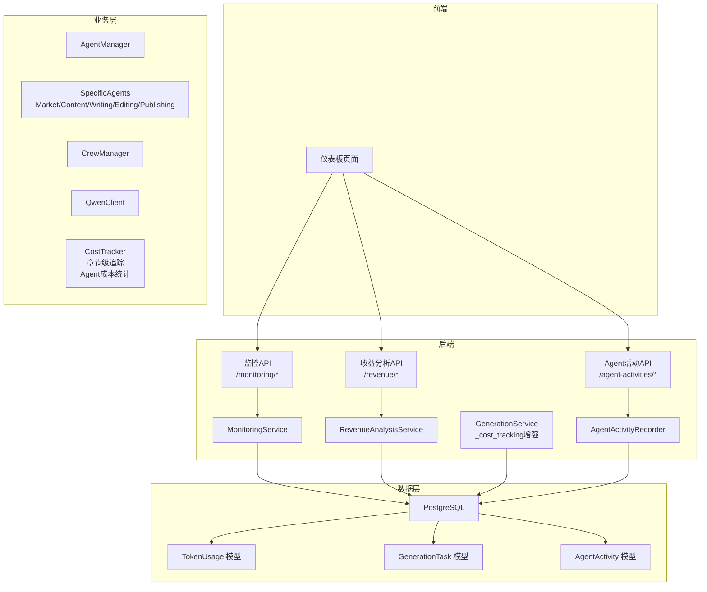
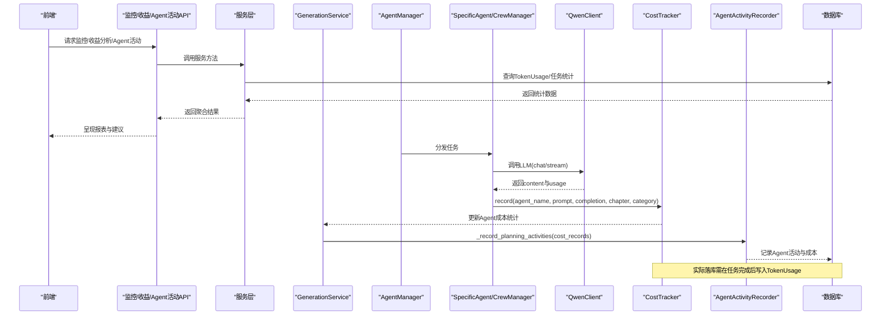
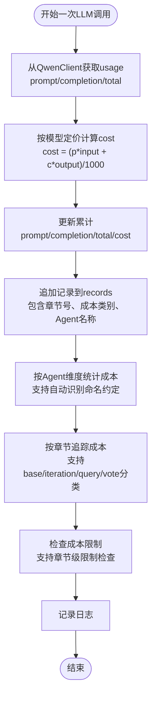
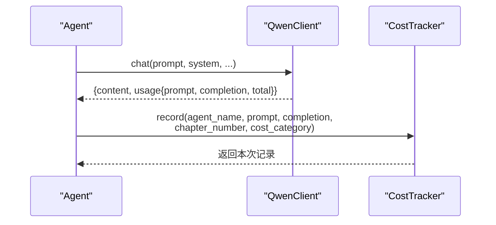
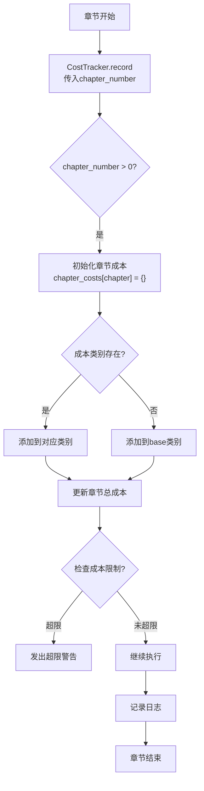
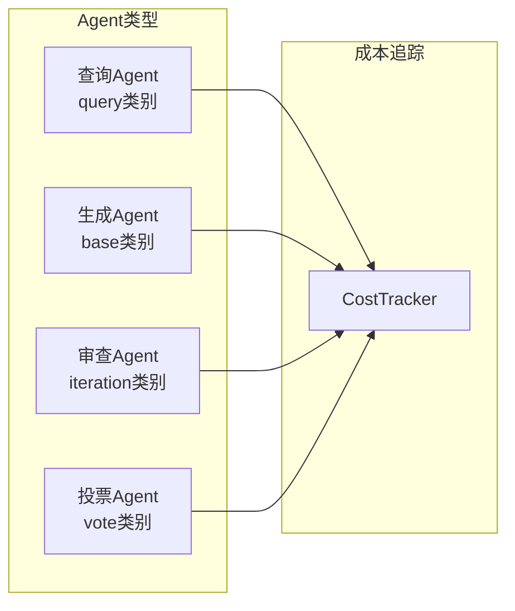
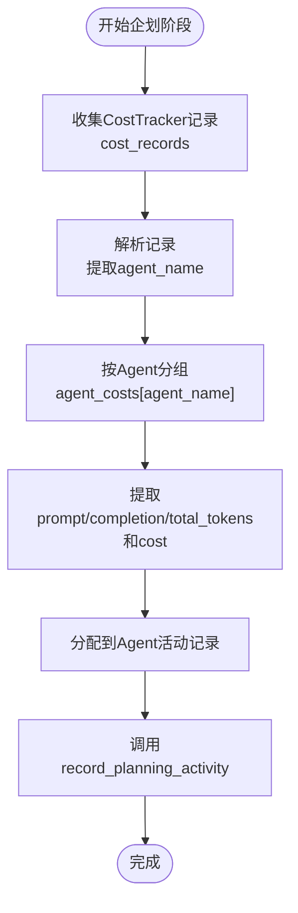
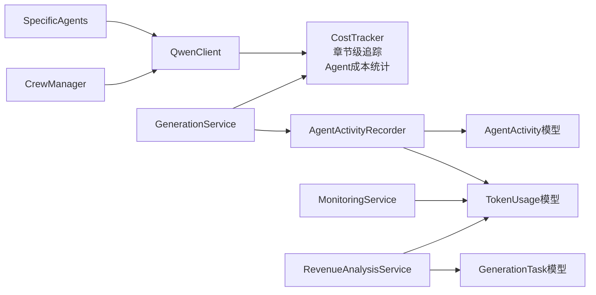

# 成本追踪系统

<cite>
**本文引用的文件**
- [llm/cost_tracker.py](file://llm/cost_tracker.py)
- [llm/qwen_client.py](file://llm/qwen_client.py)
- [agents/agent_manager.py](file://agents/agent_manager.py)
- [agents/specific_agents.py](file://agents/specific_agents.py)
- [agents/crew_manager.py](file://agents/crew_manager.py)
- [agents/agent_query_service.py](file://agents/agent_query_service.py)
- [agents/chapter_summary_generator.py](file://agents/chapter_summary_generator.py)
- [agents/agent_dispatcher.py](file://agents/agent_dispatcher.py)
- [agents/voting_manager.py](file://agents/voting_manager.py)
- [backend/services/agent_activity_recorder.py](file://backend/services/agent_activity_recorder.py)
- [backend/routes/agent_activities.py](file://backend/routes/agent_activities.py)
- [backend/services/generation_service.py](file://backend/services/generation_service.py)
- [core/models/token_usage.py](file://core/models/token_usage.py)
- [core/models/generation_task.py](file://core/models/generation_task.py)
- [core/models/agent_activity.py](file://core/models/agent_activity.py)
- [backend/services/monitoring_service.py](file://backend/services/monitoring_service.py)
- [backend/services/revenue_analysis_service.py](file://backend/services/revenue_analysis_service.py)
- [backend/api/v1/monitoring.py](file://backend/api/v1/monitoring.py)
- [backend/api/v1/revenue.py](file://backend/api/v1/revenue.py)
- [core/database.py](file://core/database.py)
- [alembic/versions/b5dd1dd83814_add_ai_chat_session_models.py](file://alembic/versions/b5dd1dd83814_add_ai_chat_session_models.py)
</cite>

## 更新摘要
**所做更改**
- 新增完整的CostTracker类实现，提供详细的token使用监控和成本追踪功能
- 新增TokenUsage模型，支持持久化LLM调用的token使用和成本数据
- 实现章节级别成本分解和多代理成本统计功能
- 增强了Agent活动记录器的成本统计能力
- 完善了成本追踪的API接口和查询功能
- 新增章节级成本追踪功能，支持按章节维度的成本统计和限制检查
- 新增成本类别分类系统，支持base/iteration/query/vote四种成本类型
- 新增SQLAlchemy模型集成，完善数据库模型设计
- **v2.1.0版本新增**：完整的章节级别成本监控、多代理费用追踪和数据库模型集成

## 目录
1. [简介](#简介)
2. [项目结构](#项目结构)
3. [核心组件](#核心组件)
4. [架构总览](#架构总览)
5. [详细组件分析](#详细组件分析)
6. [章节级别成本监控](#章节级别成本监控)
7. [多代理费用追踪](#多代理费用追踪)
8. [按Agent成本统计与分配](#按agent成本统计与分配)
9. [数据库模型设计](#数据库模型设计)
10. [依赖关系分析](#依赖关系分析)
11. [性能考量](#性能考量)
12. [故障排查指南](#故障排查指南)
13. [结论](#结论)
14. [附录](#附录)

## 简介
本技术文档围绕"成本追踪系统"展开，聚焦以下目标：
- 解析Token使用追踪的实现机制：prompt tokens、completion tokens、total tokens的统计逻辑
- 阐述成本计算算法：不同模型的价格策略、按token计费的计算公式、批量处理的成本优化
- 说明预算控制功能：月度预算设置、实时余额监控、超支预警机制（当前仓库未实现，提供设计建议）
- 解释限额告警系统：阈值配置、通知机制、自动暂停策略（当前仓库未实现，提供设计建议）
- 数据库模型设计：TokenUsage模型的字段定义、索引优化、查询性能
- 成本分析报表、趋势预测、优化建议：基于现有服务与模型的扩展路径
- 面向产品经理与运维工程师的成本控制指导

**更新** 本版本新增了完整的CostTracker类和TokenUsage模型，实现了详细的token使用监控和成本追踪功能，包括章节级别成本分解和多代理成本统计。新增章节级成本追踪、成本类别分类（base/iteration/query/vote）、成本限制检查、SQLAlchemy模型集成等功能。

## 项目结构
该系统采用前后端分离与模块化组织方式：
- 前端：React/Vite 页面与图表展示（与成本追踪直接交互的页面由后端API驱动）
- 后端：FastAPI接口层、服务层（监控与收益分析）、SQLAlchemy ORM模型层
- LLM与Agent：Qwen客户端封装、CostTracker成本追踪、Agent编排与任务执行
- 数据库：PostgreSQL，通过Alembic迁移管理

**图示来源**
- [backend/api/v1/monitoring.py:1-101](file://backend/api/v1/monitoring.py#L1-L101)
- [backend/api/v1/revenue.py:1-81](file://backend/api/v1/revenue.py#L1-L81)
- [backend/routes/agent_activities.py:34-68](file://backend/routes/agent_activities.py#L34-L68)
- [backend/services/monitoring_service.py:1-805](file://backend/services/monitoring_service.py#L1-L805)
- [backend/services/revenue_analysis_service.py:1-451](file://backend/services/revenue_analysis_service.py#L1-L451)
- [backend/services/generation_service.py:1837-1897](file://backend/services/generation_service.py#L1837-L1897)
- [backend/services/agent_activity_recorder.py:1-310](file://backend/services/agent_activity_recorder.py#L1-L310)
- [agents/agent_manager.py:1-227](file://agents/agent_manager.py#L1-L227)
- [agents/specific_agents.py:1-200](file://agents/specific_agents.py#L1-L200)
- [agents/crew_manager.py:102-162](file://agents/crew_manager.py#L102-L162)
- [llm/qwen_client.py:1-232](file://llm/qwen_client.py#L1-L232)
- [llm/cost_tracker.py:1-126](file://llm/cost_tracker.py#L1-L126)
- [core/models/token_usage.py:1-35](file://core/models/token_usage.py#L1-L35)
- [core/models/generation_task.py:1-60](file://core/models/generation_task.py#L1-L60)
- [core/database.py:1-35](file://core/database.py#L1-L35)

## 核心组件
- CostTracker：LLM调用的Token与成本追踪器，提供单次记录、累计统计与摘要导出，现已支持章节级别、成本分类和Agent维度追踪
- QwenClient：DashScope/OpenAI兼容模式的异步调用封装，统一返回usage结构
- Agent体系：AgentManager集中管理Agent；SpecificAgents与CrewManager在任务执行中调用LLM并记录成本，支持章节、类别和Agent维度追踪
- TokenUsage模型：持久化每次调用的prompt/completion/total tokens与成本
- GenerationService：增强的成本追踪服务，支持按Agent维度的成本统计和分配
- AgentActivityRecorder：Agent活动记录器，支持详细的活动统计和成本分析
- MonitoringService/RevenueAnalysisService：监控与收益分析，聚合Token使用与成本，生成报表与建议，支持章节级别的成本分析
- FastAPI接口：对外暴露监控、收益分析和Agent活动API

**章节来源**
- [llm/cost_tracker.py:16-126](file://llm/cost_tracker.py#L16-L126)
- [llm/qwen_client.py:16-232](file://llm/qwen_client.py#L16-L232)
- [agents/agent_manager.py:22-127](file://agents/agent_manager.py#L22-L127)
- [agents/specific_agents.py:15-113](file://agents/specific_agents.py#L15-L113)
- [agents/crew_manager.py:102-162](file://agents/crew_manager.py#L102-L162)
- [backend/services/generation_service.py:1837-1897](file://backend/services/generation_service.py#L1837-L1897)
- [backend/services/agent_activity_recorder.py:13-310](file://backend/services/agent_activity_recorder.py#L13-L310)
- [core/models/token_usage.py:13-35](file://core/models/token_usage.py#L13-L35)
- [backend/services/monitoring_service.py:178-262](file://backend/services/monitoring_service.py#L178-L262)
- [backend/services/revenue_analysis_service.py:26-149](file://backend/services/revenue_analysis_service.py#L26-L149)

## 架构总览
下图展示了从Agent到LLM、成本追踪、数据库落库与API消费的全链路，包括新增的按Agent维度成本统计功能。

**图示来源**
- [agents/agent_manager.py:43-74](file://agents/agent_manager.py#L43-L74)
- [agents/specific_agents.py:64-78](file://agents/specific_agents.py#L64-L78)
- [agents/crew_manager.py:130-147](file://agents/crew_manager.py#L130-L147)
- [llm/qwen_client.py:46-64](file://llm/qwen_client.py#L46-L64)
- [llm/cost_tracker.py:26-82](file://llm/cost_tracker.py#L26-L82)
- [backend/services/monitoring_service.py:178-262](file://backend/services/monitoring_service.py#L178-L262)
- [backend/api/v1/monitoring.py:12-22](file://backend/api/v1/monitoring.py#L12-L22)
- [backend/services/generation_service.py:1837-1897](file://backend/services/generation_service.py#L1837-L1897)

## 详细组件分析

### Token使用追踪与成本计算
- 统计维度
  - prompt_tokens：输入提示词token数
  - completion_tokens：模型输出token数
  - total_tokens：两者的和
  - cost：按模型单价按千token计费累加
- 计费公式
  - 单次cost = ⌈prompt_tokens × input_price⌉/1000 + ⌈completion_tokens × output_price⌉/1000
  - 累计cost为Decimal累加，避免浮点误差
- 模型定价
  - 当前支持qwen-plus、qwen-turbo、qwen-max三档，单价单位为"元/1000 tokens"
- 记录与汇总
  - record返回本次记录，并写入内存records
  - get_summary导出累计统计（含调用次数）
  - **新增** 支持章节级别追踪、成本分类和Agent维度统计

**图示来源**
- [llm/cost_tracker.py:26-82](file://llm/cost_tracker.py#L26-L82)
- [llm/qwen_client.py:54-64](file://llm/qwen_client.py#L54-L64)

**章节来源**
- [llm/cost_tracker.py:8-13](file://llm/cost_tracker.py#L8-L13)
- [llm/cost_tracker.py:26-126](file://llm/cost_tracker.py#L26-L126)
- [llm/qwen_client.py:54-64](file://llm/qwen_client.py#L54-L64)

### Agent侧成本记录流程
- MarketAnalysisAgent/ContentPlanningAgent等在任务完成后调用CostTracker.record
- CrewManager在多Agent协作场景中同样记录成本
- **新增** 支持章节号、成本类别和Agent名称参数传递
- 以上均从QwenClient.response["usage"]读取prompt/completion

**图示来源**
- [agents/specific_agents.py:64-78](file://agents/specific_agents.py#L64-L78)
- [agents/crew_manager.py:340-344](file://agents/crew_manager.py#L340-L344)
- [llm/qwen_client.py:54-64](file://llm/qwen_client.py#L54-L64)
- [llm/cost_tracker.py:28-82](file://llm/cost_tracker.py#L28-L82)

**章节来源**
- [agents/specific_agents.py:37-113](file://agents/specific_agents.py#L37-L113)
- [agents/crew_manager.py:301-416](file://agents/crew_manager.py#L301-L416)
- [agents/agent_query_service.py:81-87](file://agents/agent_query_service.py#L81-L87)
- [agents/chapter_summary_generator.py:59-64](file://agents/chapter_summary_generator.py#L59-L64)

## 章节级别成本监控

### 功能概述
新增的章节级别成本监控功能允许系统按小说章节维度追踪和分析Token使用成本，为内容创作过程中的成本控制提供精细化支持。

### 核心特性
- **章节成本追踪**：自动按章节号聚合成本，支持实时查询某章总成本
- **成本分类统计**：支持base、iteration、query、vote四种成本类别
- **成本限制检查**：提供章节成本上限检查功能，支持成本控制
- **详细成本分解**：提供章节级别的成本构成明细

### 实现机制

**图示来源**
- [llm/cost_tracker.py:66-100](file://llm/cost_tracker.py#L66-L100)

### API接口
- `get_chapter_cost(chapter_number: int) -> float`：获取指定章节的总成本
- `check_chapter_limit(chapter_number: int, limit: float) -> bool`：检查章节成本是否超限
- `get_summary() -> dict`：获取包含章节分解的成本汇总

**章节来源**
- [llm/cost_tracker.py:89-126](file://llm/cost_tracker.py#L89-L126)

## 多代理费用追踪

### 功能概述
多代理费用追踪能力允许系统区分不同Agent类型和工作流程的成本消耗，为团队协作和任务分配提供成本分析依据。

### 成本类别分类
- **base**：基础生成任务成本
- **iteration**：迭代优化成本
- **query**：查询检索成本
- **vote**：投票决策成本

### Agent集成方式
- **Agent查询服务**：查询操作标记为"query"类别
- **章节摘要生成器**：基础摘要生成标记为"base"类别  
- **审查循环组件**：迭代优化标记为"iteration"类别
- **投票管理系统**：决策投票标记为"vote"类别

### 实现示例

**图示来源**
- [agents/agent_query_service.py:81-87](file://agents/agent_query_service.py#L81-L87)
- [agents/chapter_summary_generator.py:59-64](file://agents/chapter_summary_generator.py#L59-L64)
- [agents/crew_manager.py:107-152](file://agents/crew_manager.py#L107-L152)

**章节来源**
- [agents/agent_query_service.py:81-87](file://agents/agent_query_service.py#L81-L87)
- [agents/chapter_summary_generator.py:59-64](file://agents/chapter_summary_generator.py#L59-L64)
- [agents/crew_manager.py:107-152](file://agents/crew_manager.py#L107-L152)

## 按Agent成本统计与分配

### 功能概述
增强的GenerationService中的_cost_tracking功能支持按Agent分别统计token消耗和成本，实现了多Agent命名约定自动识别和成本分配。

### 核心特性
- **Agent维度统计**：自动按Agent名称统计token消耗和成本
- **命名约定识别**：支持多种Agent命名变体的自动识别
- **成本分配机制**：支持从总成本中分配到具体Agent
- **活动记录集成**：与AgentActivityRecorder无缝集成

### 实现机制

**图示来源**
- [backend/services/generation_service.py:1888-2025](file://backend/services/generation_service.py#L1888-L2025)

### Agent命名约定识别
系统支持以下Agent命名约定的自动识别：

| Agent类型 | 支持的命名变体 |
|-----------|----------------|
| 主题分析师 | 主题分析师、主题分析 |
| 世界观架构师 | 世界观架构师、世界观审查员、世界观察审查员 |
| 角色设计师 | 角色设计师、角色审查员、角色审查 |
| 情节架构师 | 情节架构师、大纲审查员、情节审查员、PlotReview |

### API接口
- `_record_planning_activities(novel_id, task_id, planning_result, cost_summary, cost_records=None)`：记录企划阶段的Agent活动摘要
- `get_agent_cost(agent_name: str) -> tuple`：获取Agent的token消耗和成本

**章节来源**
- [backend/services/generation_service.py:1888-2025](file://backend/services/generation_service.py#L1888-L2025)
- [backend/services/agent_activity_recorder.py:112-134](file://backend/services/agent_activity_recorder.py#L112-L134)

## 数据库模型设计

### TokenUsage模型
TokenUsage模型用于持久化LLM调用的token使用和成本数据，支持跨任务和跨章节的成本追踪。

#### 字段定义
- `id`: UUID主键，唯一标识每次token使用记录
- `novel_id`: 外键关联小说，支持按小说维度查询成本
- `task_id`: 外键关联生成任务，支持按任务维度追踪成本
- `agent_name`: Agent名称，支持按Agent维度统计成本
- `prompt_tokens`: 输入token数，支持prompt成本统计
- `completion_tokens`: 输出token数，支持completion成本统计
- `total_tokens`: 总token数，支持总成本统计
- `cost`: 成本金额，使用Numeric类型存储精确数值
- `timestamp`: 创建时间戳，支持时间维度分析

#### 索引优化
- 主键索引：自动生成
- 外键索引：novel_id、task_id支持快速关联查询
- agent_name索引：支持按Agent维度快速统计
- timestamp索引：支持时间序列分析

#### 关系映射
- 与GenerationTask模型建立一对多关系，支持任务级别的成本汇总
- 支持级联删除，确保数据一致性

**章节来源**
- [core/models/token_usage.py:13-35](file://core/models/token_usage.py#L13-L35)

### AgentActivity模型
AgentActivity模型记录Agent执行过程中的详细活动，包括Token使用统计和成本信息。

#### 字段定义
- `id`: UUID主键，唯一标识每次Agent活动
- `novel_id`: 外键关联小说，支持按小说维度分析
- `task_id`: 外键关联生成任务，支持按任务维度追踪
- `agent_name`: Agent名称，支持按Agent维度统计
- `agent_role`: Agent角色描述，支持角色维度分析
- `activity_type`: 活动类型，支持类型维度统计
- `phase`: 执行阶段，支持阶段维度分析
- `prompt_tokens`: 输入token数
- `completion_tokens`: 输出token数
- `total_tokens`: 总token数
- `cost`: 成本金额，使用更多小数位提高精度
- `status`: 执行状态，支持状态维度分析
- `retry_count`: 重试次数，支持质量维度分析

#### 索引优化
- 复合索引(idx_agent_activities_novel_task)：优化按小说和任务的联合查询
- 索引(idx_agent_activities_type)：优化按活动类型的查询
- 索引(idx_agent_activities_created)：优化按创建时间的查询

**章节来源**
- [core/models/agent_activity.py:22-186](file://core/models/agent_activity.py#L22-L186)

## 依赖关系分析
- 组件耦合
  - Agent体系依赖QwenClient与CostTracker，形成"调用—记录"的强依赖
  - GenerationService依赖CostTracker进行高级成本统计
  - AgentActivityRecorder依赖CostTracker进行详细的活动成本记录
  - 服务层依赖数据库模型进行聚合统计
  - **新增** GenerationService与AgentActivityRecorder的紧密耦合，支持按Agent维度的成本统计
- 外部依赖
  - DashScope/OpenAI SDK、psutil（系统监控）、SQLAlchemy异步引擎
- 循环依赖
  - 未见明显循环导入；AgentManager单例持有CostTracker，避免重复实例

**图示来源**
- [agents/specific_agents.py:15-113](file://agents/specific_agents.py#L15-L113)
- [agents/crew_manager.py:102-162](file://agents/crew_manager.py#L102-L162)
- [llm/qwen_client.py:16-232](file://llm/qwen_client.py#L16-L232)
- [llm/cost_tracker.py:16-126](file://llm/cost_tracker.py#L16-L126)
- [backend/services/generation_service.py:1837-1897](file://backend/services/generation_service.py#L1837-L1897)
- [backend/services/agent_activity_recorder.py:13-310](file://backend/services/agent_activity_recorder.py#L13-L310)
- [backend/services/monitoring_service.py:12-14](file://backend/services/monitoring_service.py#L12-L14)
- [backend/services/revenue_analysis_service.py:10-16](file://backend/services/revenue_analysis_service.py#L10-L16)

**章节来源**
- [agents/agent_manager.py:76-127](file://agents/agent_manager.py#L76-L127)
- [agents/specific_agents.py:15-113](file://agents/specific_agents.py#L15-L113)
- [agents/crew_manager.py:102-162](file://agents/crew_manager.py#L102-L162)
- [llm/qwen_client.py:16-232](file://llm/qwen_client.py#L16-L232)
- [llm/cost_tracker.py:16-126](file://llm/cost_tracker.py#L16-L126)
- [backend/services/generation_service.py:1837-1897](file://backend/services/generation_service.py#L1837-L1897)
- [backend/services/agent_activity_recorder.py:13-310](file://backend/services/agent_activity_recorder.py#L13-L310)
- [backend/services/monitoring_service.py:12-14](file://backend/services/monitoring_service.py#L12-L14)
- [backend/services/revenue_analysis_service.py:10-16](file://backend/services/revenue_analysis_service.py#L10-L16)

## 性能考量
- 成本计算
  - 使用Decimal避免浮点误差，适合长期累计
  - 按千token计价，减少小数位运算开销
- 批量处理优化
  - 将多次record合并为批量写入TokenUsage，降低数据库压力
  - 对高频Agent任务，可引入缓冲队列与定时批处理
- 查询性能
  - TokenUsage按novel_id/task_id/timestamp建立索引，加速聚合与分页
  - 使用select(func.sum(...))进行服务端聚合，减少Python侧计算
  - **新增** 章节级别查询可通过chapter_number字段优化索引设计
  - **新增** Agent维度查询可通过agent_name字段优化索引设计
- 异步与并发
  - QwenClient与Agent均为异步，结合异步SQLAlchemy提升吞吐
  - 监控服务对数据库仅做只读查询，避免写锁竞争
  - **新增** GenerationService的按Agent成本统计采用内存缓存，避免频繁数据库查询
- **新增** 章节成本追踪的内存管理
  - 章节成本数据存储在内存字典中，注意大规模章节场景下的内存占用
  - 提供章节成本清理机制，避免长期运行导致的内存泄漏
- **新增** Agent成本统计的缓存机制
  - 按Agent维度的成本统计在内存中缓存，支持快速查询
  - 提供成本统计的定期清理和过期机制

## 故障排查指南
- LLM调用失败
  - 检查QwenClient的API Key、Base URL与重试配置
  - 查看Agent侧异常日志，定位prompt构造与参数设置
- 成本统计异常
  - 确认usage字段存在且非空；核对模型定价是否匹配
  - 检查CostTracker是否被正确注入到Agent/CrewManager
  - **新增** 验证章节号和成本类别参数传递是否正确
  - **新增** 检查Agent名称是否符合命名约定
- 数据库连接问题
  - 使用MonitoringService的健康检查接口确认数据库连通性
  - 检查core/database.py中的连接池配置与URL
- 报表为空或不准确
  - 核对时间范围参数与TokenUsage写入时机
  - 确保任务完成后将累计成本写入TokenUsage
  - **新增** 检查章节级别成本数据是否正确聚合
  - **新增** 验证Agent活动记录是否正确生成
- **新增** Agent成本统计问题
  - 检查cost_records参数是否正确传递
  - 验证Agent命名约定识别是否正常工作
  - 确认AgentActivityRecorder的配置和权限

**章节来源**
- [llm/qwen_client.py:16-232](file://llm/qwen_client.py#L16-L232)
- [agents/specific_agents.py:108-113](file://agents/specific_agents.py#L108-L113)
- [backend/services/monitoring_service.py:409-428](file://backend/services/monitoring_service.py#L409-L428)
- [core/database.py:11-22](file://core/database.py#L11-L22)
- [backend/services/generation_service.py:1837-1897](file://backend/services/generation_service.py#L1837-L1897)

## 结论
- 本系统已具备完善的Token使用追踪与成本计算能力，覆盖Agent任务全链路
- **新增** 章节级别成本监控功能提供了精细化的成本控制能力
- **新增** 多代理费用追踪支持不同Agent类型和工作流程的成本分析
- **新增** GenerationService中的高级_cost_tracking功能实现了按Agent维度的成本统计和分配
- **新增** 多Agent命名约定自动识别机制简化了成本分配流程
- **新增** 完整的数据库模型支持持久化成本数据，为历史分析提供基础
- 服务层提供监控与收益分析能力，支撑成本报表与优化建议
- 预算控制与限额告警尚未实现，建议基于现有模型与服务层快速扩展
- 数据库模型与索引设计满足当前分析需求，建议持续优化以支撑更大规模数据

## 附录
- API一览
  - 监控：/monitoring/system-status、/monitoring/performance-metrics、/monitoring/error-analysis、/monitoring/auto-optimization、/monitoring/health-check、/monitoring/agent-status、/monitoring/agent-history/{agent_id}
  - 收益分析：/revenue/novel-performance/{novel_id}、/revenue/platform-performance/{platform}、/revenue/revenue-forecast/{novel_id}、/revenue/content-optimization/{novel_id}
  - Agent活动：/agent-activities/by-task/{task_id}、/agent-activities/by-agent/{agent_name}、/agent-activities/summary

**章节来源**
- [backend/api/v1/monitoring.py:12-101](file://backend/api/v1/monitoring.py#L12-L101)
- [backend/api/v1/revenue.py:13-81](file://backend/api/v1/revenue.py#L13-L81)
- [backend/routes/agent_activities.py:34-68](file://backend/routes/agent_activities.py#L34-L68)
- [backend/routes/agent_activities.py:104-148](file://backend/routes/agent_activities.py#L104-L148)