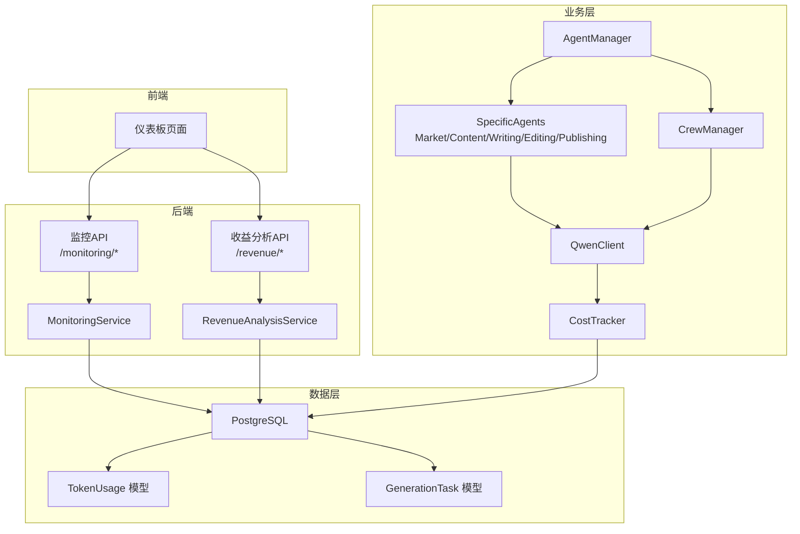
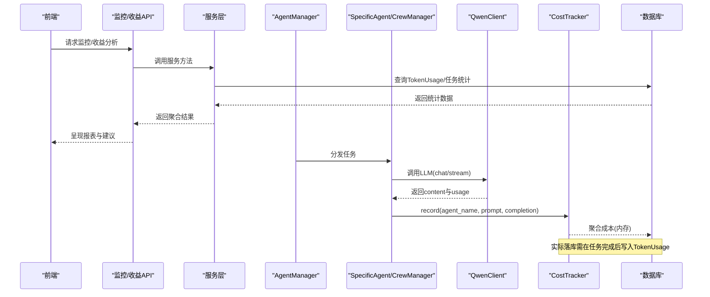
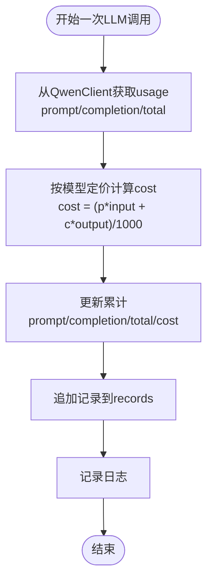
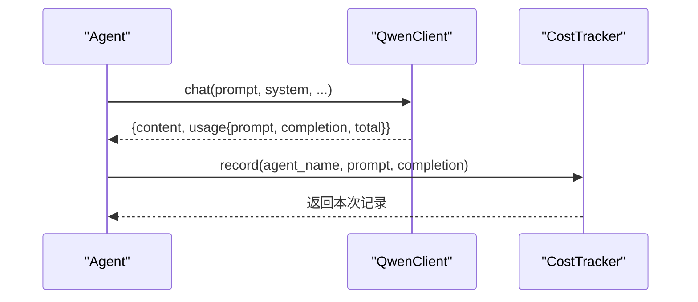
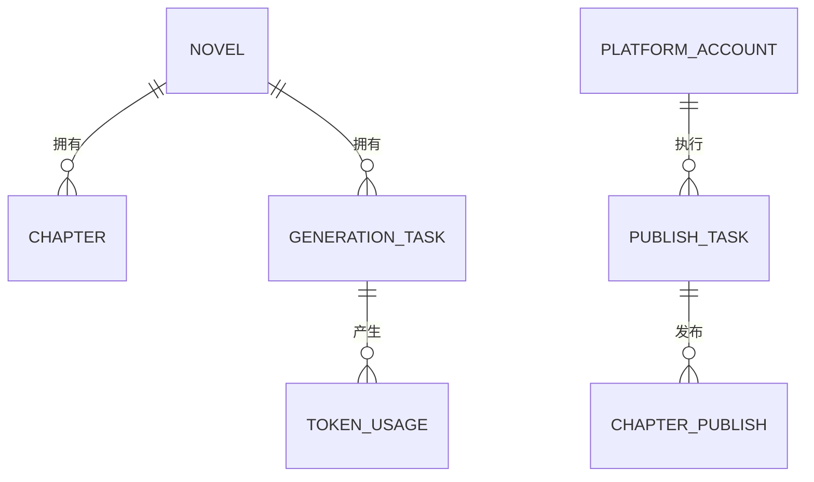
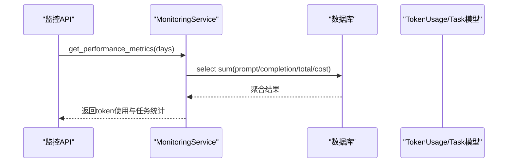
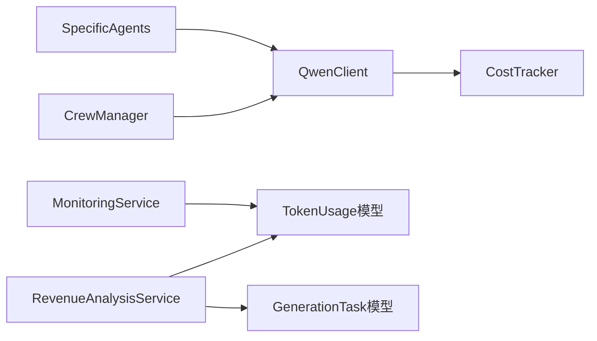

# 成本追踪系统

<cite>
**本文引用的文件**
- [llm/cost_tracker.py](file://llm/cost_tracker.py)
- [llm/qwen_client.py](file://llm/qwen_client.py)
- [agents/agent_manager.py](file://agents/agent_manager.py)
- [agents/specific_agents.py](file://agents/specific_agents.py)
- [agents/crew_manager.py](file://agents/crew_manager.py)
- [core/models/token_usage.py](file://core/models/token_usage.py)
- [core/models/generation_task.py](file://core/models/generation_task.py)
- [backend/services/monitoring_service.py](file://backend/services/monitoring_service.py)
- [backend/services/revenue_analysis_service.py](file://backend/services/revenue_analysis_service.py)
- [backend/api/v1/monitoring.py](file://backend/api/v1/monitoring.py)
- [backend/api/v1/revenue.py](file://backend/api/v1/revenue.py)
- [core/database.py](file://core/database.py)
- [alembic/versions/b5dd1dd83814_add_ai_chat_session_models.py](file://alembic/versions/b5dd1dd83814_add_ai_chat_session_models.py)
</cite>

## 目录
1. [简介](#简介)
2. [项目结构](#项目结构)
3. [核心组件](#核心组件)
4. [架构总览](#架构总览)
5. [详细组件分析](#详细组件分析)
6. [依赖关系分析](#依赖关系分析)
7. [性能考量](#性能考量)
8. [故障排查指南](#故障排查指南)
9. [结论](#结论)
10. [附录](#附录)

## 简介
本技术文档围绕“成本追踪系统”展开，聚焦以下目标：
- 解析Token使用追踪的实现机制：prompt tokens、completion tokens、total tokens的统计逻辑
- 阐述成本计算算法：不同模型的价格策略、按token计费的计算公式、批量处理的成本优化
- 说明预算控制功能：月度预算设置、实时余额监控、超支预警机制（当前仓库未实现，提供设计建议）
- 解释限额告警系统：阈值配置、通知机制、自动暂停策略（当前仓库未实现，提供设计建议）
- 数据库模型设计：TokenUsage模型的字段定义、索引优化、查询性能
- 成本分析报表、趋势预测、优化建议：基于现有服务与模型的扩展路径
- 面向产品经理与运维工程师的成本控制指导

## 项目结构
该系统采用前后端分离与模块化组织方式：
- 前端：React/Vite 页面与图表展示（与成本追踪直接交互的页面由后端API驱动）
- 后端：FastAPI接口层、服务层（监控与收益分析）、SQLAlchemy ORM模型层
- LLM与Agent：Qwen客户端封装、CostTracker成本追踪、Agent编排与任务执行
- 数据库：PostgreSQL，通过Alembic迁移管理

**图示来源**
- [backend/api/v1/monitoring.py](file://backend/api/v1/monitoring.py#L1-L101)
- [backend/api/v1/revenue.py](file://backend/api/v1/revenue.py#L1-L81)
- [backend/services/monitoring_service.py](file://backend/services/monitoring_service.py#L1-L805)
- [backend/services/revenue_analysis_service.py](file://backend/services/revenue_analysis_service.py#L1-L451)
- [agents/agent_manager.py](file://agents/agent_manager.py#L1-L227)
- [agents/specific_agents.py](file://agents/specific_agents.py#L1-L200)
- [agents/crew_manager.py](file://agents/crew_manager.py#L102-L162)
- [llm/qwen_client.py](file://llm/qwen_client.py#L1-L232)
- [llm/cost_tracker.py](file://llm/cost_tracker.py#L1-L74)
- [core/models/token_usage.py](file://core/models/token_usage.py#L1-L25)
- [core/models/generation_task.py](file://core/models/generation_task.py#L1-L47)
- [core/database.py](file://core/database.py#L1-L35)

**章节来源**
- [backend/api/v1/monitoring.py](file://backend/api/v1/monitoring.py#L1-L101)
- [backend/api/v1/revenue.py](file://backend/api/v1/revenue.py#L1-L81)
- [backend/services/monitoring_service.py](file://backend/services/monitoring_service.py#L1-L805)
- [backend/services/revenue_analysis_service.py](file://backend/services/revenue_analysis_service.py#L1-L451)
- [agents/agent_manager.py](file://agents/agent_manager.py#L1-L227)
- [agents/specific_agents.py](file://agents/specific_agents.py#L1-L200)
- [agents/crew_manager.py](file://agents/crew_manager.py#L102-L162)
- [llm/qwen_client.py](file://llm/qwen_client.py#L1-L232)
- [llm/cost_tracker.py](file://llm/cost_tracker.py#L1-L74)
- [core/models/token_usage.py](file://core/models/token_usage.py#L1-L25)
- [core/models/generation_task.py](file://core/models/generation_task.py#L1-L47)
- [core/database.py](file://core/database.py#L1-L35)

## 核心组件
- CostTracker：LLM调用的Token与成本追踪器，提供单次记录、累计统计与摘要导出
- QwenClient：DashScope/OpenAI兼容模式的异步调用封装，统一返回usage结构
- Agent体系：AgentManager集中管理Agent；SpecificAgents与CrewManager在任务执行中调用LLM并记录成本
- TokenUsage模型：持久化每次调用的prompt/completion/total tokens与成本
- MonitoringService/RevenueAnalysisService：监控与收益分析，聚合Token使用与成本，生成报表与建议
- FastAPI接口：对外暴露监控与收益分析API

**章节来源**
- [llm/cost_tracker.py](file://llm/cost_tracker.py#L16-L74)
- [llm/qwen_client.py](file://llm/qwen_client.py#L16-L232)
- [agents/agent_manager.py](file://agents/agent_manager.py#L22-L127)
- [agents/specific_agents.py](file://agents/specific_agents.py#L15-L113)
- [agents/crew_manager.py](file://agents/crew_manager.py#L102-L162)
- [core/models/token_usage.py](file://core/models/token_usage.py#L11-L25)
- [backend/services/monitoring_service.py](file://backend/services/monitoring_service.py#L178-L262)
- [backend/services/revenue_analysis_service.py](file://backend/services/revenue_analysis_service.py#L26-L149)

## 架构总览
下图展示了从Agent到LLM、成本追踪、数据库落库与API消费的全链路。

**图示来源**
- [agents/agent_manager.py](file://agents/agent_manager.py#L43-L74)
- [agents/specific_agents.py](file://agents/specific_agents.py#L64-L78)
- [agents/crew_manager.py](file://agents/crew_manager.py#L130-L147)
- [llm/qwen_client.py](file://llm/qwen_client.py#L46-L64)
- [llm/cost_tracker.py](file://llm/cost_tracker.py#L26-L56)
- [backend/services/monitoring_service.py](file://backend/services/monitoring_service.py#L178-L262)
- [backend/api/v1/monitoring.py](file://backend/api/v1/monitoring.py#L12-L22)

## 详细组件分析

### Token使用追踪与成本计算
- 统计维度
  - prompt_tokens：输入提示词token数
  - completion_tokens：模型输出token数
  - total_tokens：两者的和
  - cost：按模型单价按千token计费累加
- 计费公式
  - 单次cost = ⌈prompt_tokens × input_price⌉/1000 + ⌈completion_tokens × output_price⌉/1000
  - 累计cost为Decimal累加，避免浮点误差
- 模型定价
  - 当前支持qwen-plus、qwen-turbo、qwen-max三档，单价单位为“元/1000 tokens”
- 记录与汇总
  - record返回本次记录，并写入内存records
  - get_summary导出累计统计（含调用次数）

**图示来源**
- [llm/cost_tracker.py](file://llm/cost_tracker.py#L26-L56)
- [llm/qwen_client.py](file://llm/qwen_client.py#L54-L64)

**章节来源**
- [llm/cost_tracker.py](file://llm/cost_tracker.py#L8-L13)
- [llm/cost_tracker.py](file://llm/cost_tracker.py#L26-L67)
- [llm/qwen_client.py](file://llm/qwen_client.py#L54-L64)

### Agent侧成本记录流程
- MarketAnalysisAgent/ContentPlanningAgent等在任务完成后调用CostTracker.record
- CrewManager在多Agent协作场景中同样记录成本
- 以上均从QwenClient.response["usage"]读取prompt/completion

**图示来源**
- [agents/specific_agents.py](file://agents/specific_agents.py#L64-L78)
- [agents/crew_manager.py](file://agents/crew_manager.py#L130-L147)
- [llm/qwen_client.py](file://llm/qwen_client.py#L54-L64)
- [llm/cost_tracker.py](file://llm/cost_tracker.py#L26-L56)

**章节来源**
- [agents/specific_agents.py](file://agents/specific_agents.py#L37-L113)
- [agents/crew_manager.py](file://agents/crew_manager.py#L102-L162)

### 数据库模型与索引设计
- TokenUsage模型
  - 关键字段：novel_id、task_id、agent_name、prompt_tokens、completion_tokens、total_tokens、cost、timestamp
  - 关系：与GenerationTask双向关联，支持按小说与任务聚合
  - 建议索引：按novel_id、task_id、timestamp建立复合索引，提升分析查询性能
- GenerationTask模型
  - 包含token_usage与cost字段，便于任务粒度的成本归集
- Alembic迁移
  - 新增AI聊天会话表（与成本追踪无直接关系），体现数据库演进能力

**图示来源**
- [core/models/token_usage.py](file://core/models/token_usage.py#L11-L25)
- [core/models/generation_task.py](file://core/models/generation_task.py#L27-L47)
- [alembic/versions/b5dd1dd83814_add_ai_chat_session_models.py](file://alembic/versions/b5dd1dd83814_add_ai_chat_session_models.py#L21-L46)

**章节来源**
- [core/models/token_usage.py](file://core/models/token_usage.py#L11-L25)
- [core/models/generation_task.py](file://core/models/generation_task.py#L27-L47)
- [alembic/versions/b5dd1dd83814_add_ai_chat_session_models.py](file://alembic/versions/b5dd1dd83814_add_ai_chat_session_models.py#L21-L46)

### 监控与收益分析服务
- MonitoringService
  - 汇总Token使用：按时间窗口统计prompt/completion/total tokens与估算成本
  - 任务成功率：生成/发布/爬虫任务的总数、成功/失败数量与成功率
  - 系统健康度：CPU/内存/磁盘/数据库状态综合评分与建议
- RevenueAnalysisService
  - 小说性能分析：章节数、字数、发布统计、成本分析、成本效率、优化建议
  - 平台性能分析：账号数、任务/发布成功率、优化建议
  - 收益预测：基于历史数据的预期章节数、字数、成本与优化建议

**图示来源**
- [backend/api/v1/monitoring.py](file://backend/api/v1/monitoring.py#L25-L36)
- [backend/services/monitoring_service.py](file://backend/services/monitoring_service.py#L178-L262)

**章节来源**
- [backend/services/monitoring_service.py](file://backend/services/monitoring_service.py#L178-L262)
- [backend/services/revenue_analysis_service.py](file://backend/services/revenue_analysis_service.py#L26-L149)
- [backend/api/v1/revenue.py](file://backend/api/v1/revenue.py#L13-L28)

### 预算控制与限额告警（当前未实现，提供设计建议）
- 月度预算设置
  - 在数据库新增Budget表，字段：id、year_month、limit_amount、currency、created_at
  - 与TokenUsage按月聚合对比，计算累计消耗与剩余预算
- 实时余额监控
  - 基于MonitoringService的性能指标，实时计算累计成本并展示
- 超支预警机制
  - 阈值：如80%/90%预算触发预警，95%以上阻断新任务
  - 通知：邮件/IM推送，记录预警日志
- 自动暂停策略
  - 达到阈值后，AgentManager暂停新任务派发或降级模型（如切换至更便宜的qwen-turbo）

[本节为概念性设计，不直接分析具体文件，故无“章节来源”]

## 依赖关系分析
- 组件耦合
  - Agent体系依赖QwenClient与CostTracker，形成“调用—记录”的强依赖
  - 服务层依赖数据库模型进行聚合统计
- 外部依赖
  - DashScope/OpenAI SDK、psutil（系统监控）、SQLAlchemy异步引擎
- 循环依赖
  - 未见明显循环导入；AgentManager单例持有CostTracker，避免重复实例

**图示来源**
- [agents/specific_agents.py](file://agents/specific_agents.py#L15-L113)
- [agents/crew_manager.py](file://agents/crew_manager.py#L102-L162)
- [llm/qwen_client.py](file://llm/qwen_client.py#L16-L232)
- [llm/cost_tracker.py](file://llm/cost_tracker.py#L16-L74)
- [backend/services/monitoring_service.py](file://backend/services/monitoring_service.py#L12-L14)
- [backend/services/revenue_analysis_service.py](file://backend/services/revenue_analysis_service.py#L10-L16)

**章节来源**
- [agents/agent_manager.py](file://agents/agent_manager.py#L76-L127)
- [agents/specific_agents.py](file://agents/specific_agents.py#L15-L113)
- [agents/crew_manager.py](file://agents/crew_manager.py#L102-L162)
- [llm/qwen_client.py](file://llm/qwen_client.py#L16-L232)
- [llm/cost_tracker.py](file://llm/cost_tracker.py#L16-L74)
- [backend/services/monitoring_service.py](file://backend/services/monitoring_service.py#L12-L14)
- [backend/services/revenue_analysis_service.py](file://backend/services/revenue_analysis_service.py#L10-L16)

## 性能考量
- 成本计算
  - 使用Decimal避免浮点误差，适合长期累计
  - 按千token计价，减少小数位运算开销
- 批量处理优化
  - 将多次record合并为批量写入TokenUsage，降低数据库压力
  - 对高频Agent任务，可引入缓冲队列与定时批处理
- 查询性能
  - TokenUsage按novel_id/task_id/timestamp建立索引，加速聚合与分页
  - 使用select(func.sum(...))进行服务端聚合，减少Python侧计算
- 异步与并发
  - QwenClient与Agent均为异步，结合异步SQLAlchemy提升吞吐
  - 监控服务对数据库仅做只读查询，避免写锁竞争

[本节为通用性能建议，不直接分析具体文件，故无“章节来源”]

## 故障排查指南
- LLM调用失败
  - 检查QwenClient的API Key、Base URL与重试配置
  - 查看Agent侧异常日志，定位prompt构造与参数设置
- 成本统计异常
  - 确认usage字段存在且非空；核对模型定价是否匹配
  - 检查CostTracker是否被正确注入到Agent/CrewManager
- 数据库连接问题
  - 使用MonitoringService的健康检查接口确认数据库连通性
  - 检查core/database.py中的连接池配置与URL
- 报表为空或不准确
  - 核对时间范围参数与TokenUsage写入时机
  - 确保任务完成后将累计成本写入TokenUsage

**章节来源**
- [llm/qwen_client.py](file://llm/qwen_client.py#L16-L232)
- [agents/specific_agents.py](file://agents/specific_agents.py#L108-L113)
- [backend/services/monitoring_service.py](file://backend/services/monitoring_service.py#L409-L428)
- [core/database.py](file://core/database.py#L11-L22)

## 结论
- 本系统已具备完善的Token使用追踪与成本计算能力，覆盖Agent任务全链路
- 服务层提供监控与收益分析能力，支撑成本报表与优化建议
- 预算控制与限额告警尚未实现，建议基于现有模型与服务层快速扩展
- 数据库模型与索引设计满足当前分析需求，建议持续优化以支撑更大规模数据

## 附录
- API一览
  - 监控：/monitoring/system-status、/monitoring/performance-metrics、/monitoring/error-analysis、/monitoring/auto-optimization、/monitoring/health-check、/monitoring/agent-status、/monitoring/agent-history/{agent_id}
  - 收益分析：/revenue/novel-performance/{novel_id}、/revenue/platform-performance/{platform}、/revenue/revenue-forecast/{novel_id}、/revenue/content-optimization/{novel_id}

**章节来源**
- [backend/api/v1/monitoring.py](file://backend/api/v1/monitoring.py#L12-L101)
- [backend/api/v1/revenue.py](file://backend/api/v1/revenue.py#L13-L81)