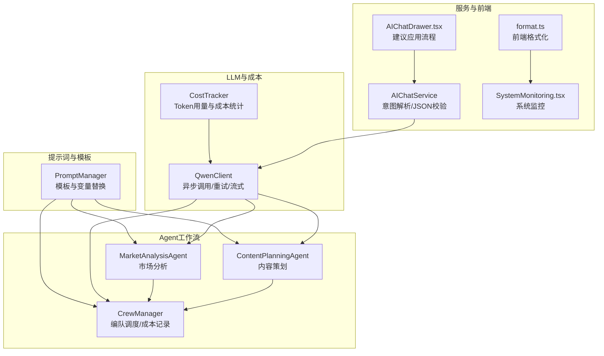
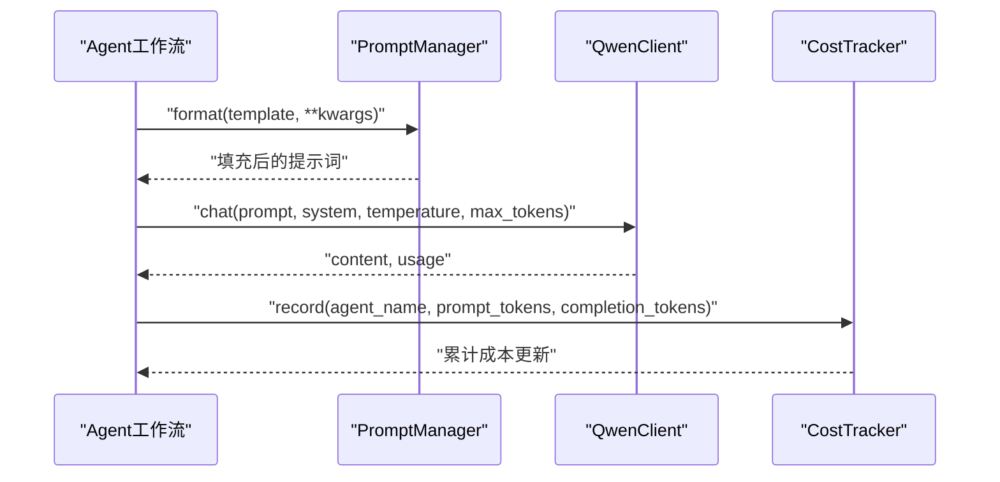
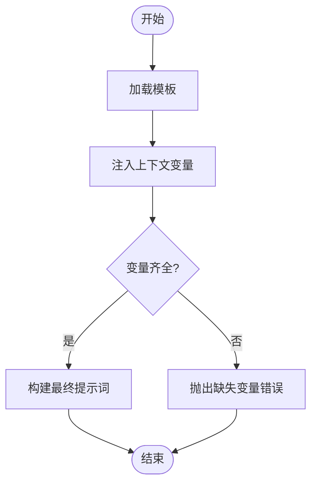
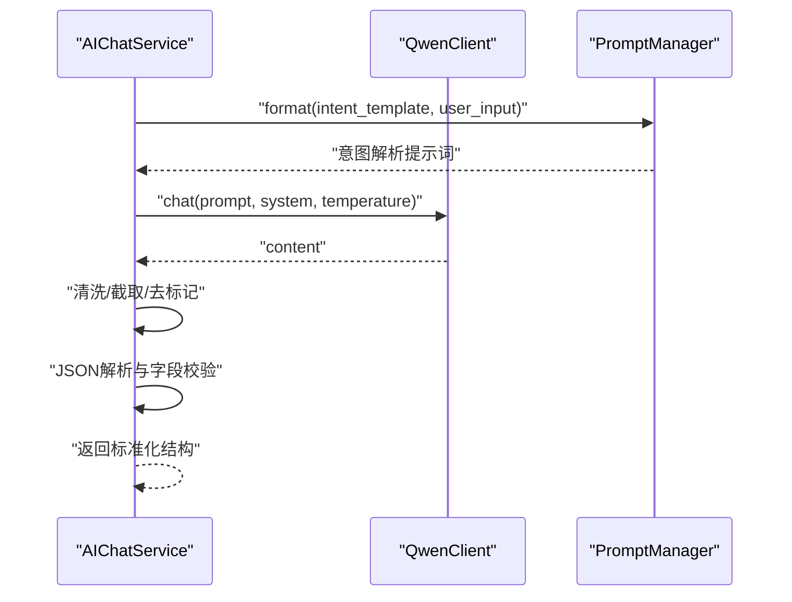
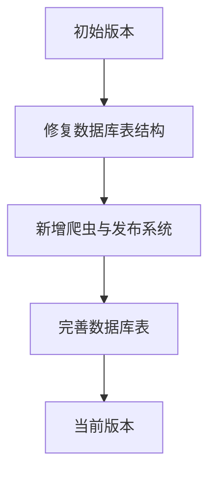
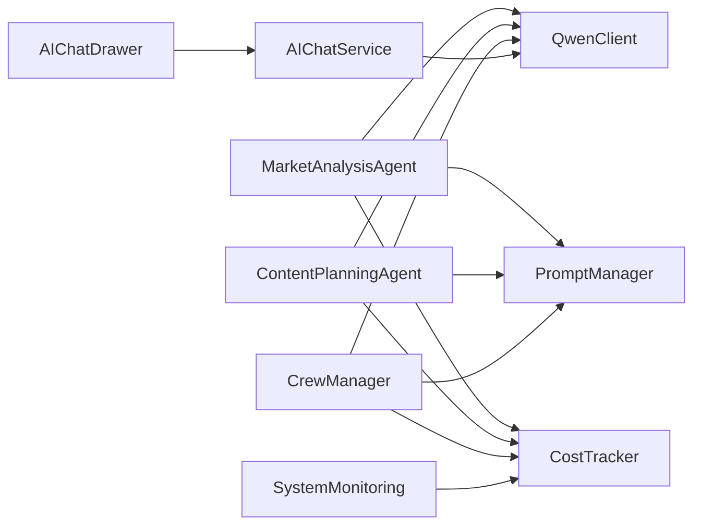

# 提示词管理系统

<cite>
**本文引用的文件**
- [llm/prompt_manager.py](file://llm/prompt_manager.py)
- [llm/qwen_client.py](file://llm/qwen_client.py)
- [llm/cost_tracker.py](file://llm/cost_tracker.py)
- [agents/specific_agents.py](file://agents/specific_agents.py)
- [agents/crew_manager.py](file://agents/crew_manager.py)
- [backend/services/ai_chat_service.py](file://backend/services/ai_chat_service.py)
- [frontend/src/utils/format.ts](file://frontend/src/utils/format.ts)
- [frontend/src/components/AIChatDrawer.tsx](file://frontend/src/components/AIChatDrawer.tsx)
- [frontend/src/pages/SystemMonitoring.tsx](file://frontend/src/pages/SystemMonitoring.tsx)
- [alembic/versions/186700edca0b_fix_complete_database_tables.py](file://alembic/versions/186700edca0b_fix_complete_database_tables.py)
- [alembic/versions/fc4ecf252bbb_add_crawler_and_publishing_system.py](file://alembic/versions/fc4ecf252bbb_add_crawler_and_publishing_system.py)
</cite>

## 目录
1. [引言](#引言)
2. [项目结构](#项目结构)
3. [核心组件](#核心组件)
4. [架构总览](#架构总览)
5. [详细组件分析](#详细组件分析)
6. [依赖关系分析](#依赖关系分析)
7. [性能考虑](#性能考虑)
8. [故障排查指南](#故障排查指南)
9. [结论](#结论)
10. [附录](#附录)

## 引言
本技术文档围绕“提示词管理系统”的设计与实现展开，聚焦于提示词模板的语法与变量替换机制、上下文注入策略、动态参数注入与校验、版本控制与回滚、A/B 测试支持、模板库管理、质量评估与性能基准、安全审查流程等主题。文档同时面向提示词工程师与AI应用开发者，提供可操作的架构解读、流程图示与最佳实践建议。

## 项目结构
该系统以“提示词模板 + LLM 客户端 + 成本追踪 + Agent 工作流 + 前端可视化”为主线组织代码，核心模块分布如下：
- 提示词与模板：llm/prompt_manager.py
- LLM 客户端：llm/qwen_client.py
- 成本追踪：llm/cost_tracker.py
- Agent 工作流与模板使用：agents/specific_agents.py、agents/crew_manager.py
- 服务层与意图解析：backend/services/ai_chat_service.py
- 前端展示与交互：frontend/src/utils/format.ts、frontend/src/components/AIChatDrawer.tsx、frontend/src/pages/SystemMonitoring.tsx
- 数据迁移与版本：alembic/versions/*

图表来源
- [llm/prompt_manager.py](file://llm/prompt_manager.py#L1-L200)
- [llm/qwen_client.py](file://llm/qwen_client.py#L1-L232)
- [llm/cost_tracker.py](file://llm/cost_tracker.py#L1-L74)
- [agents/specific_agents.py](file://agents/specific_agents.py#L1-L200)
- [agents/crew_manager.py](file://agents/crew_manager.py#L100-L170)
- [backend/services/ai_chat_service.py](file://backend/services/ai_chat_service.py#L1342-L1376)
- [frontend/src/utils/format.ts](file://frontend/src/utils/format.ts#L1-L22)
- [frontend/src/components/AIChatDrawer.tsx](file://frontend/src/components/AIChatDrawer.tsx#L311-L370)
- [frontend/src/pages/SystemMonitoring.tsx](file://frontend/src/pages/SystemMonitoring.tsx#L1-L58)

章节来源
- [llm/prompt_manager.py](file://llm/prompt_manager.py#L1-L200)
- [llm/qwen_client.py](file://llm/qwen_client.py#L1-L232)
- [llm/cost_tracker.py](file://llm/cost_tracker.py#L1-L74)
- [agents/specific_agents.py](file://agents/specific_agents.py#L1-L200)
- [agents/crew_manager.py](file://agents/crew_manager.py#L100-L170)
- [backend/services/ai_chat_service.py](file://backend/services/ai_chat_service.py#L1342-L1376)
- [frontend/src/utils/format.ts](file://frontend/src/utils/format.ts#L1-L22)
- [frontend/src/components/AIChatDrawer.tsx](file://frontend/src/components/AIChatDrawer.tsx#L311-L370)
- [frontend/src/pages/SystemMonitoring.tsx](file://frontend/src/pages/SystemMonitoring.tsx#L1-L58)

## 核心组件
- 提示词模板与变量替换：通过 PromptManager 统一管理模板与变量替换，支持多处 Agent 与服务层复用。
- LLM 客户端：QwenClient 封装 DashScope/OpenAI 兼容模式调用，提供重试、流式输出与参数配置。
- 成本追踪：CostTracker 记录 Token 使用与成本，支持按 Agent 聚合与汇总导出。
- Agent 工作流：MarketAnalysisAgent、ContentPlanningAgent 等在任务处理中使用模板与 LLM，并通过 CrewManager 进行统一调度与成本记录。
- 服务层与前端：AIChatService 对 LLM 返回进行 JSON 校验与清洗；前端提供格式化、建议应用与系统监控界面。

章节来源
- [llm/prompt_manager.py](file://llm/prompt_manager.py#L1-L200)
- [llm/qwen_client.py](file://llm/qwen_client.py#L1-L232)
- [llm/cost_tracker.py](file://llm/cost_tracker.py#L1-L74)
- [agents/specific_agents.py](file://agents/specific_agents.py#L1-L200)
- [agents/crew_manager.py](file://agents/crew_manager.py#L100-L170)
- [backend/services/ai_chat_service.py](file://backend/services/ai_chat_service.py#L1342-L1376)
- [frontend/src/utils/format.ts](file://frontend/src/utils/format.ts#L1-L22)
- [frontend/src/components/AIChatDrawer.tsx](file://frontend/src/components/AIChatDrawer.tsx#L311-L370)
- [frontend/src/pages/SystemMonitoring.tsx](file://frontend/src/pages/SystemMonitoring.tsx#L1-L58)

## 架构总览
系统采用“模板驱动 + LLM 调用 + 成本追踪 + 可观测性”的分层架构。模板由 PromptManager 维护，Agent 在任务中通过 pm.format 注入上下文变量，QwenClient 负责与模型服务交互，CostTracker 记录用量与成本，前端负责展示与交互。

图表来源
- [agents/specific_agents.py](file://agents/specific_agents.py#L137-L213)
- [agents/crew_manager.py](file://agents/crew_manager.py#L104-L162)
- [llm/prompt_manager.py](file://llm/prompt_manager.py#L1-L200)
- [llm/qwen_client.py](file://llm/qwen_client.py#L46-L161)
- [llm/cost_tracker.py](file://llm/cost_tracker.py#L26-L56)

## 详细组件分析

### 提示词模板与变量替换机制
- 设计要点
  - 模板集中管理，变量以键值对形式传入，支持字符串拼接与结构化上下文注入。
  - Agent 与服务层均通过 pm.format 调用，保证模板复用与一致性。
- 关键路径
  - MarketAnalysisAgent 中使用 pm.format 注入市场数据与平台信息。
  - ContentPlanningAgent 中使用 pm.format 注入市场分析与用户偏好。
  - CrewManager 中多处使用 pm.format 构建世界观、角色、剧情等任务提示词。
- 复杂度与性能
  - 变量替换为 O(n) 遍历替换，模板数量有限，整体开销可忽略。
  - 建议对热点模板进行缓存或预编译，减少重复格式化成本。

图表来源
- [agents/specific_agents.py](file://agents/specific_agents.py#L57-L62)
- [agents/specific_agents.py](file://agents/specific_agents.py#L157-L162)
- [agents/crew_manager.py](file://agents/crew_manager.py#L214-L216)
- [agents/crew_manager.py](file://agents/crew_manager.py#L234-L236)

章节来源
- [agents/specific_agents.py](file://agents/specific_agents.py#L57-L62)
- [agents/specific_agents.py](file://agents/specific_agents.py#L157-L162)
- [agents/crew_manager.py](file://agents/crew_manager.py#L214-L216)
- [agents/crew_manager.py](file://agents/crew_manager.py#L234-L236)

### 动态参数注入与校验
- 参数注入
  - Agent 通过 input_data 获取市场分析、用户偏好等上下文，pm.format 将其注入模板。
  - CrewManager 在不同阶段（主题、世界、角色、剧情、写作、编辑、连贯性）分别注入对应上下文。
- 类型转换与默认值
  - 服务层对 LLM 返回进行 JSON 清洗与字段校验，确保 genre 等字段合法，tags 为数组，synopsis 存在。
- 错误处理
  - 若 JSON 解析失败或字段缺失，服务层返回空结构，避免崩溃传播至前端。

图表来源
- [backend/services/ai_chat_service.py](file://backend/services/ai_chat_service.py#L1342-L1376)
- [llm/qwen_client.py](file://llm/qwen_client.py#L46-L161)
- [llm/prompt_manager.py](file://llm/prompt_manager.py#L1-L200)

章节来源
- [agents/crew_manager.py](file://agents/crew_manager.py#L214-L216)
- [agents/crew_manager.py](file://agents/crew_manager.py#L234-L236)
- [agents/crew_manager.py](file://agents/crew_manager.py#L255-L257)
- [agents/crew_manager.py](file://agents/crew_manager.py#L277-L279)
- [agents/crew_manager.py](file://agents/crew_manager.py#L372-L374)
- [agents/crew_manager.py](file://agents/crew_manager.py#L406-L408)
- [agents/crew_manager.py](file://agents/crew_manager.py#L416-L418)
- [agents/crew_manager.py](file://agents/crew_manager.py#L431-L433)
- [agents/crew_manager.py](file://agents/crew_manager.py#L449-L451)
- [backend/services/ai_chat_service.py](file://backend/services/ai_chat_service.py#L1342-L1376)

### 上下文注入策略
- 策略说明
  - 按阶段注入：主题阶段注入市场与偏好；世界阶段注入世界观设定；角色阶段注入角色档案；剧情阶段注入大纲与章节；写作/编辑阶段注入草稿与上下文。
  - 多 Agent 协作：CrewManager 在各阶段调用 Agent，形成链式上下文传递。
- 效果评估
  - 通过 CostTracker 聚合各阶段 Token 使用，评估上下文长度与复杂度对成本的影响。

章节来源
- [agents/crew_manager.py](file://agents/crew_manager.py#L214-L216)
- [agents/crew_manager.py](file://agents/crew_manager.py#L234-L236)
- [agents/crew_manager.py](file://agents/crew_manager.py#L255-L257)
- [agents/crew_manager.py](file://agents/crew_manager.py#L277-L279)
- [agents/crew_manager.py](file://agents/crew_manager.py#L372-L374)
- [agents/crew_manager.py](file://agents/crew_manager.py#L406-L408)
- [agents/crew_manager.py](file://agents/crew_manager.py#L416-L418)
- [agents/crew_manager.py](file://agents/crew_manager.py#L431-L433)
- [agents/crew_manager.py](file://agents/crew_manager.py#L449-L451)
- [llm/cost_tracker.py](file://llm/cost_tracker.py#L26-L56)

### 版本控制系统与回滚机制
- 当前实现
  - 项目使用 Alembic 进行数据库迁移，包含多个版本文件，体现版本演进与修复。
- 回滚机制
  - 可通过 Alembic downgrade 到历史版本，配合备份与灰度发布策略实现回滚。
- A/B 测试支持
  - 建议在模板层面引入版本标签与流量切分策略，结合前端与服务层的开关实现 A/B 实验。

图表来源
- [alembic/versions/186700edca0b_fix_complete_database_tables.py](file://alembic/versions/186700edca0b_fix_complete_database_tables.py#L1-L18)
- [alembic/versions/fc4ecf252bbb_add_crawler_and_publishing_system.py](file://alembic/versions/fc4ecf252bbb_add_crawler_and_publishing_system.py#L1-L18)

章节来源
- [alembic/versions/186700edca0b_fix_complete_database_tables.py](file://alembic/versions/186700edca0b_fix_complete_database_tables.py#L1-L18)
- [alembic/versions/fc4ecf252bbb_add_crawler_and_publishing_system.py](file://alembic/versions/fc4ecf252bbb_add_crawler_and_publishing_system.py#L1-L18)

### 模板库管理
- 分类组织
  - 模板按用途分类（市场分析、内容策划、写作、编辑、连贯性等），便于检索与维护。
- 搜索与过滤
  - 建议在前端增加模板搜索框与标签过滤，提升查找效率。
- 复用机制
  - 通过 pm.format 统一入口，避免重复编写相似提示词，降低维护成本。

章节来源
- [agents/specific_agents.py](file://agents/specific_agents.py#L57-L62)
- [agents/specific_agents.py](file://agents/specific_agents.py#L157-L162)
- [agents/crew_manager.py](file://agents/crew_manager.py#L214-L216)
- [agents/crew_manager.py](file://agents/crew_manager.py#L234-L236)
- [agents/crew_manager.py](file://agents/crew_manager.py#L255-L257)
- [agents/crew_manager.py](file://agents/crew_manager.py#L277-L279)
- [agents/crew_manager.py](file://agents/crew_manager.py#L372-L374)
- [agents/crew_manager.py](file://agents/crew_manager.py#L406-L408)
- [agents/crew_manager.py](file://agents/crew_manager.py#L416-L418)
- [agents/crew_manager.py](file://agents/crew_manager.py#L431-L433)
- [agents/crew_manager.py](file://agents/crew_manager.py#L449-L451)

### 提示词优化策略
- 效果评估
  - 通过 CostTracker 的 call_count、total_tokens、total_cost 评估模板效率；结合前端展示与用户反馈进行主观评估。
- 迭代改进
  - 建立模板评审清单，定期复盘高成本与低效果模板，优化变量注入与提示词结构。
- 最佳实践
  - 明确系统提示词职责边界；为每个阶段定义清晰的输出格式与约束；在服务层统一清洗与校验 LLM 输出。

章节来源
- [llm/cost_tracker.py](file://llm/cost_tracker.py#L58-L74)
- [frontend/src/utils/format.ts](file://frontend/src/utils/format.ts#L1-L22)
- [frontend/src/pages/SystemMonitoring.tsx](file://frontend/src/pages/SystemMonitoring.tsx#L1-L58)

### 性能基准测试
- 基准指标
  - 响应时间（含重试）、Token 使用量、成本、吞吐量（requests/sec）。
- 测试方法
  - 使用压测工具对 QwenClient.chat 与 CrewManager 调用进行并发测试，记录 p50/p95 延迟与错误率。
- 结果分析
  - 结合 CostTracker 的汇总数据评估不同模板的成本曲线，识别热点与瓶颈。

章节来源
- [llm/qwen_client.py](file://llm/qwen_client.py#L46-L161)
- [llm/cost_tracker.py](file://llm/cost_tracker.py#L58-L74)

### 安全审查流程
- 输入安全
  - 对用户输入进行最小化白名单过滤与长度限制，避免注入攻击。
- 输出安全
  - 服务层对 LLM 输出进行 JSON 校验与字段清洗，防止异常数据进入下游。
- 模板安全
  - 模板变量仅允许必要字段，避免敏感信息泄露；对模板变更建立审批与审计流程。

章节来源
- [backend/services/ai_chat_service.py](file://backend/services/ai_chat_service.py#L1342-L1376)
- [agents/specific_agents.py](file://agents/specific_agents.py#L137-L213)
- [agents/crew_manager.py](file://agents/crew_manager.py#L104-L162)

## 依赖关系分析
- 组件耦合
  - Agent 依赖 PromptManager 与 QwenClient；CrewManager 统一调度并记录成本；服务层依赖 QwenClient 并进行输出清洗。
- 外部依赖
  - DashScope SDK 与 OpenAI 兼容接口；前端 Ant Design 组件库与 dayjs 时间库。
- 循环依赖
  - 未发现直接循环导入；Agent 与 CrewManager 通过消息通信解耦。

图表来源
- [agents/specific_agents.py](file://agents/specific_agents.py#L1-L200)
- [agents/crew_manager.py](file://agents/crew_manager.py#L100-L170)
- [llm/prompt_manager.py](file://llm/prompt_manager.py#L1-L200)
- [llm/qwen_client.py](file://llm/qwen_client.py#L1-L232)
- [llm/cost_tracker.py](file://llm/cost_tracker.py#L1-L74)
- [backend/services/ai_chat_service.py](file://backend/services/ai_chat_service.py#L1342-L1376)
- [frontend/src/components/AIChatDrawer.tsx](file://frontend/src/components/AIChatDrawer.tsx#L311-L370)
- [frontend/src/pages/SystemMonitoring.tsx](file://frontend/src/pages/SystemMonitoring.tsx#L1-L58)

章节来源
- [agents/specific_agents.py](file://agents/specific_agents.py#L1-L200)
- [agents/crew_manager.py](file://agents/crew_manager.py#L100-L170)
- [llm/prompt_manager.py](file://llm/prompt_manager.py#L1-L200)
- [llm/qwen_client.py](file://llm/qwen_client.py#L1-L232)
- [llm/cost_tracker.py](file://llm/cost_tracker.py#L1-L74)
- [backend/services/ai_chat_service.py](file://backend/services/ai_chat_service.py#L1342-L1376)
- [frontend/src/components/AIChatDrawer.tsx](file://frontend/src/components/AIChatDrawer.tsx#L311-L370)
- [frontend/src/pages/SystemMonitoring.tsx](file://frontend/src/pages/SystemMonitoring.tsx#L1-L58)

## 性能考虑
- 模板格式化
  - 对高频模板进行缓存，减少重复格式化开销。
- LLM 调用
  - 控制 max_tokens 与 temperature，平衡质量与成本；启用重试与指数退避。
- 成本追踪
  - 定期导出 CostTracker 汇总，识别高成本模板与异常调用。

## 故障排查指南
- LLM 调用失败
  - 检查 API Key、Base URL 与模型配置；查看 QwenClient 重试日志与异常堆栈。
- JSON 解析失败
  - 在服务层确认 LLM 输出是否包含 JSON 标记，进行清洗后再解析。
- 成本异常
  - 核对 CostTracker 记录与实际调用次数，排查是否存在重复调用或异常 usage。

章节来源
- [llm/qwen_client.py](file://llm/qwen_client.py#L79-L106)
- [llm/qwen_client.py](file://llm/qwen_client.py#L123-L161)
- [backend/services/ai_chat_service.py](file://backend/services/ai_chat_service.py#L1368-L1373)
- [llm/cost_tracker.py](file://llm/cost_tracker.py#L26-L56)

## 结论
本系统通过“模板 + LLM + 成本追踪 + 可观测性”的组合，实现了可复用、可观测、可优化的提示词管理体系。建议在现有基础上完善模板版本与 A/B 能力、强化输入输出安全校验、建立模板评审与性能基线，持续提升提示词工程化水平。

## 附录
- 前端交互与展示
  - format.ts 提供成本与数字格式化；AIChatDrawer 支持建议应用流程；SystemMonitoring 展示系统运行状态与任务历史。

章节来源
- [frontend/src/utils/format.ts](file://frontend/src/utils/format.ts#L1-L22)
- [frontend/src/components/AIChatDrawer.tsx](file://frontend/src/components/AIChatDrawer.tsx#L311-L370)
- [frontend/src/pages/SystemMonitoring.tsx](file://frontend/src/pages/SystemMonitoring.tsx#L1-L58)