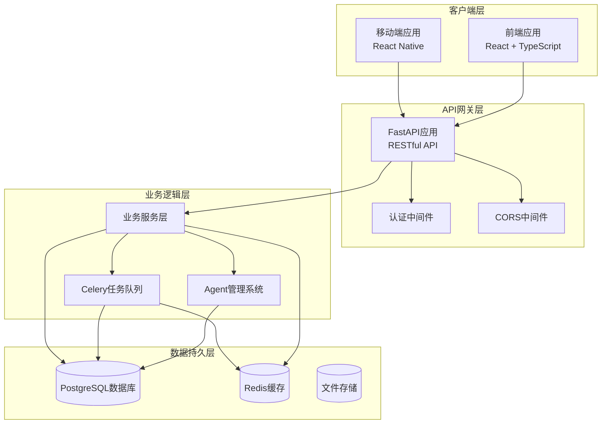
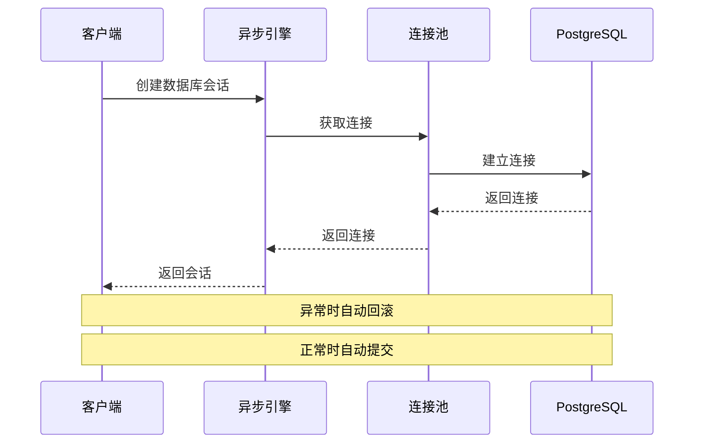
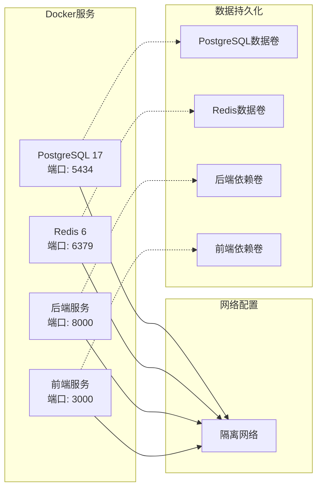
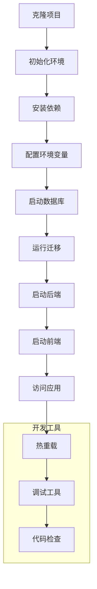

# 本地开发指南

<cite>
**本文档引用的文件**
- [LOCAL_DEV_GUIDE.md](file://LOCAL_DEV_GUIDE.md)
- [start_local_dev.sh](file://start_local_dev.sh)
- [docker-compose.dev.yml](file://docker-compose.dev.yml)
- [pyproject.toml](file://pyproject.toml)
- [requirements.txt](file://requirements.txt)
- [backend/main.py](file://backend/main.py)
- [backend/config.py](file://backend/config.py)
- [core/database.py](file://core/database.py)
- [agents/__init__.py](file://agents/__init__.py)
- [agents/crew_manager.py](file://agents/crew_manager.py)
- [backend/api/v1/novels.py](file://backend/api/v1/novels.py)
- [frontend/package.json](file://frontend/package.json)
- [frontend/vite.config.ts](file://frontend/vite.config.ts)
- [scripts/init_local_dev.sh](file://scripts/init_local_dev.sh)
</cite>

## 目录
1. [简介](#简介)
2. [项目结构](#项目结构)
3. [核心组件](#核心组件)
4. [架构概览](#架构概览)
5. [详细组件分析](#详细组件分析)
6. [依赖分析](#依赖分析)
7. [性能考虑](#性能考虑)
8. [故障排除指南](#故障排除指南)
9. [结论](#结论)
10. [附录](#附录)

## 简介

小说生成系统是一个基于AI驱动的完整小说创作平台，集成了多Agent协作架构和先进的内容生成技术。该系统支持从创意企划到最终发布的全流程小说创作，包括世界观设定、角色管理、剧情大纲规划、章节生成和多平台发布等功能。

系统采用现代化的技术栈：后端使用FastAPI + SQLAlchemy异步ORM，前端使用React + TypeScript，数据库使用PostgreSQL，缓存使用Redis，Agent系统基于CrewAI框架。整个架构支持热重载开发模式，提供完整的本地开发环境配置。

## 项目结构

该项目采用模块化的组织方式，主要包含以下核心目录：

```mermaid
graph TB
subgraph "项目根目录"
A[backend/] - 后端服务
B[frontend/] - 前端应用
C[agents/] - Agent系统
D[core/] - 核心模块
E[services/] - 业务服务
F[tests/] - 测试套件
G[scripts/] - 运维脚本
H[migrations/] - 数据库迁移
end
subgraph "后端架构"
A1[API路由] --> A2[业务服务]
A2 --> A3[数据模型]
A3 --> A4[数据库连接]
end
subgraph "Agent系统"
C1[Crew管理器] --> C2[审查循环]
C2 --> C3[投票管理]
C3 --> C4[查询服务]
end
subgraph "前端架构"
B1[React组件] --> B2[API客户端]
B2 --> B3[Vite配置]
end
```

**图表来源**
- [LOCAL_DEV_GUIDE.md:189-213](file://LOCAL_DEV_GUIDE.md#L189-L213)
- [backend/main.py:1-149](file://backend/main.py#L1-L149)

**章节来源**
- [LOCAL_DEV_GUIDE.md:189-213](file://LOCAL_DEV_GUIDE.md#L189-L213)
- [pyproject.toml:1-64](file://pyproject.toml#L1-L64)

## 核心组件

### 后端核心组件

后端系统基于FastAPI构建，提供了完整的RESTful API服务，支持异步数据库操作和中间件配置。

**数据库配置**：系统使用SQLAlchemy异步引擎，支持连接池管理和自动回滚机制。数据库连接根据Docker环境自动切换主机地址和端口。

**配置管理**：通过Pydantic设置类管理所有环境变量，支持开发和生产环境的动态配置切换。

**中间件配置**：实现了CORS中间件，专门针对前端开发服务器进行跨域配置。

**章节来源**
- [backend/main.py:1-149](file://backend/main.py#L1-L149)
- [backend/config.py:1-167](file://backend/config.py#L1-L167)
- [core/database.py:1-36](file://core/database.py#L1-L36)

### Agent系统组件

Agent系统是整个小说生成的核心，采用了多Agent协作架构，支持审查循环、投票共识和智能查询等功能。

**Crew管理器**：负责协调各个Agent的工作流程，支持质量驱动的迭代优化和连续性保证。

**审查循环**：实现了Writer-Editor模式的质量控制，通过多轮迭代提升生成内容的质量。

**投票管理**：在企划阶段提供多Agent投票决策机制，确保关键决策的合理性。

**章节来源**
- [agents/__init__.py:1-46](file://agents/__init__.py#L1-L46)
- [agents/crew_manager.py:1-200](file://agents/crew_manager.py#L1-L200)

### 前端核心组件

前端应用基于React 19和TypeScript构建，使用Vite作为开发服务器，提供了现代化的用户界面和开发体验。

**组件架构**：采用Ant Design组件库，支持响应式设计和良好的用户体验。

**API集成**：通过Axios客户端与后端API进行通信，支持代理配置以解决跨域问题。

**开发配置**：Vite配置支持热重载和开发服务器的网络访问。

**章节来源**
- [frontend/package.json:1-42](file://frontend/package.json#L1-L42)
- [frontend/vite.config.ts:1-44](file://frontend/vite.config.ts#L1-L44)

## 架构概览

系统采用分层架构设计，各组件之间通过清晰的接口进行交互：



**图表来源**
- [backend/main.py:62-90](file://backend/main.py#L62-L90)
- [docker-compose.dev.yml:37-96](file://docker-compose.dev.yml#L37-L96)

## 详细组件分析

### 数据库连接管理

系统使用SQLAlchemy异步引擎进行数据库操作，提供了完整的连接池管理和事务处理机制。



**图表来源**
- [core/database.py:26-36](file://core/database.py#L26-L36)

**章节来源**
- [core/database.py:1-36](file://core/database.py#L1-L36)

### Agent协作流程

Agent系统实现了复杂的多Agent协作机制，支持审查循环和智能决策：


**图表来源**
- [agents/crew_manager.py:41-165](file://agents/crew_manager.py#L41-L165)

**章节来源**
- [agents/crew_manager.py:1-200](file://agents/crew_manager.py#L1-L200)

### API路由架构

后端API采用模块化路由设计，每个功能模块都有独立的路由文件：

```mermaid
classDiagram
class NovelRouter {
+GET /novels
+POST /novels
+GET /novels/{id}
+PATCH /novels/{id}
+DELETE /novels/{id}
}
class CharacterRouter {
+GET /characters
+POST /characters
+GET /characters/{id}
+PATCH /characters/{id}
+DELETE /characters/{id}
}
class ChapterRouter {
+GET /chapters
+POST /chapters
+GET /chapters/{id}
+PATCH /chapters/{id}
+DELETE /chapters/{id}
}
class GenerationRouter {
+POST /generation/tasks
+GET /generation/tasks/{id}
+GET /generation/tasks/{id}/status
}
class APIRouter {
+include_router(router, prefix)
+health_check()
+root_info()
}
APIRouter --> NovelRouter
APIRouter --> CharacterRouter
APIRouter --> ChapterRouter
APIRouter --> GenerationRouter
```

**图表来源**
- [backend/api/v1/novels.py:22-189](file://backend/api/v1/novels.py#L22-L189)

**章节来源**
- [backend/api/v1/novels.py:1-189](file://backend/api/v1/novels.py#L1-L189)

## 依赖分析

### Python依赖关系

系统使用Poetry进行依赖管理，主要依赖包括：

**核心依赖**：
- FastAPI 0.115.0+ - Web框架
- SQLAlchemy 2.0.0+ - ORM框架
- asyncpg 0.30.0+ - PostgreSQL异步驱动
- Redis 5.0.0+ - 缓存和消息队列
- CrewAI 0.100.0+ - Agent框架
- DashScope 1.20.0+ - 大模型API

**开发依赖**：
- pytest 8.0.0+ - 测试框架
- ruff 0.8.0+ - 代码检查工具

**章节来源**
- [pyproject.toml:8-36](file://pyproject.toml#L8-L36)
- [requirements.txt:1-28](file://requirements.txt#L1-L28)

### Docker服务依赖

开发环境使用Docker Compose管理多个服务：



**图表来源**
- [docker-compose.dev.yml:6-103](file://docker-compose.dev.yml#L6-L103)

**章节来源**
- [docker-compose.dev.yml:1-103](file://docker-compose.dev.yml#L1-L103)

## 性能考虑

### 数据库性能优化

系统采用了多项数据库性能优化策略：

**连接池配置**：最大连接数20，溢出连接20，支持异步操作
**查询优化**：使用selectinload进行N+1查询优化
**索引策略**：对常用查询字段建立适当索引
**事务管理**：自动回滚机制确保数据一致性

### 缓存策略

**Redis缓存**：用于会话存储、任务队列和临时数据缓存
**前端缓存**：浏览器缓存静态资源，减少带宽消耗
**API缓存**：对频繁查询的结果进行缓存

### Agent性能优化

**并发处理**：使用Celery进行异步任务处理
**资源管理**：合理配置Agent数量和内存使用
**成本控制**：通过CostTracker监控和控制API调用成本

## 故障排除指南

### 常见问题及解决方案

**数据库连接问题**：
- 检查PostgreSQL服务状态：`docker-compose ps postgres`
- 验证连接字符串配置
- 确认端口5434未被占用

**Redis连接问题**：
- 启动Redis服务：`docker-compose up -d redis`
- 检查Redis端口6379可用性
- 验证Redis连接URL配置

**API密钥问题**：
- 检查.env文件中的DASHSCOPE_API_KEY
- 确认API密钥有效性和权限
- 验证DashScope服务可用性

**端口冲突问题**：
- 查找占用端口的进程：`lsof -i :8000`
- 修改配置文件中的端口号
- 使用不同的端口组合

**依赖安装问题**：
- 清理虚拟环境并重新安装
- 检查Python版本兼容性
- 验证网络连接和镜像源配置

**章节来源**
- [LOCAL_DEV_GUIDE.md:215-286](file://LOCAL_DEV_GUIDE.md#L215-L286)

## 结论

小说生成系统提供了一个完整、可扩展的AI小说创作平台。通过模块化的架构设计和丰富的功能特性，开发者可以快速上手并进行二次开发。

系统的本地开发环境配置完善，支持多种部署方式，包括手动安装和Docker容器化部署。完善的测试套件和文档支持确保了代码质量和开发效率。

对于想要深入了解系统的开发者，建议从Agent系统和API架构入手，逐步理解整个系统的协作机制和数据流转。

## 附录

### 开发环境启动流程



**图表来源**
- [scripts/init_local_dev.sh:1-83](file://scripts/init_local_dev.sh#L1-L83)
- [start_local_dev.sh:1-53](file://start_local_dev.sh#L1-L53)

### 环境变量配置

| 变量名 | 说明 | 默认值 | 必填 |
|--------|------|--------|------|
| DASHSCOPE_API_KEY | 阿里云DashScope API Key | - | ✅ |
| DATABASE_URL | PostgreSQL连接字符串 | localhost:5434 | ✅ |
| REDIS_URL | Redis连接URL | localhost:6379 | ❌ |
| APP_ENV | 应用环境 | development | ❌ |
| APP_DEBUG | 调试模式 | true | ❌ |
| DOCKER_ENV | Docker环境标记 | false | ❌ |

**章节来源**
- [LOCAL_DEV_GUIDE.md:287-310](file://LOCAL_DEV_GUIDE.md#L287-L310)