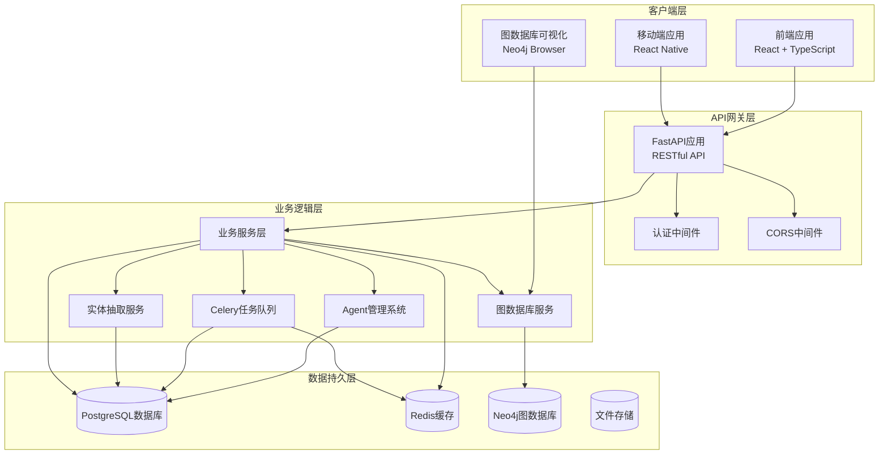
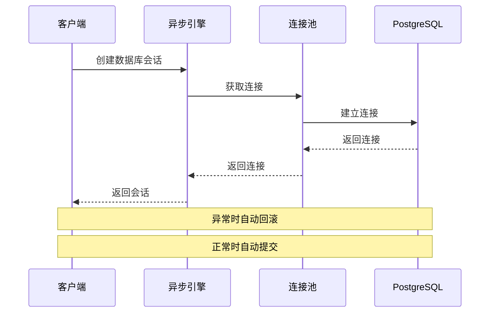
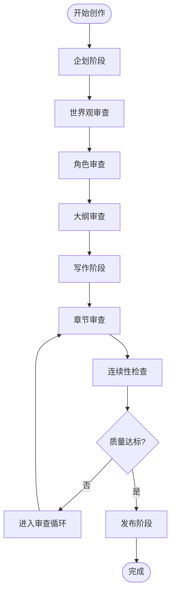
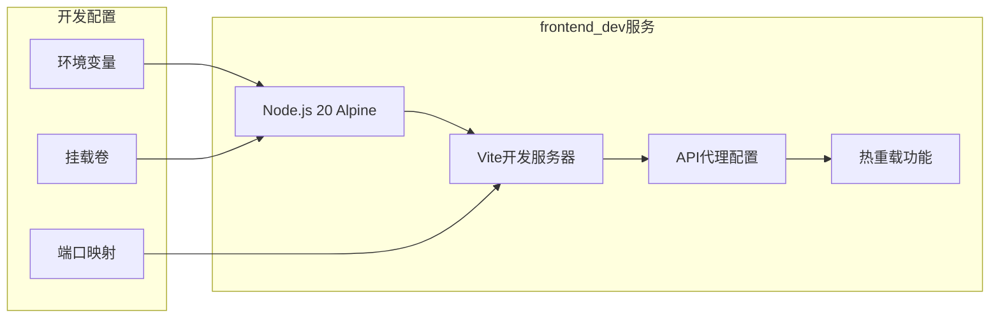
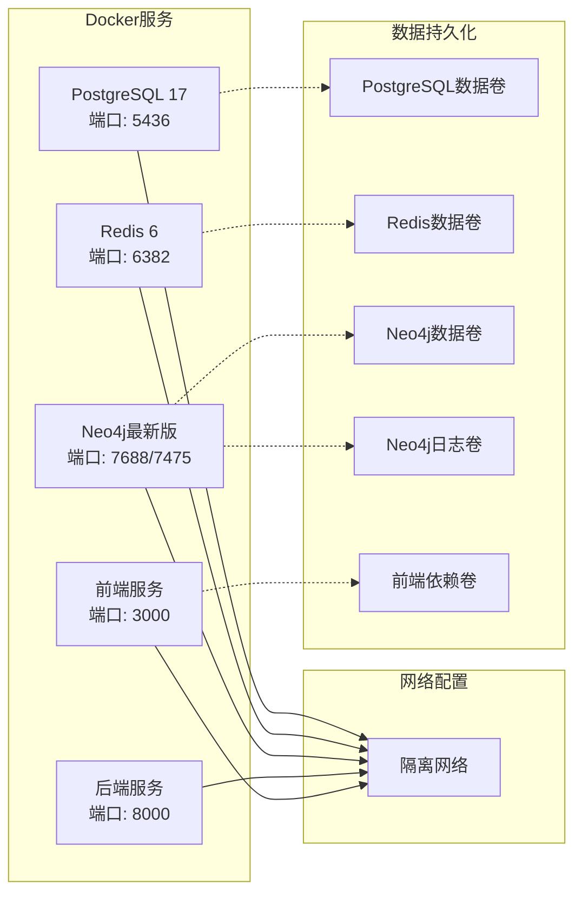
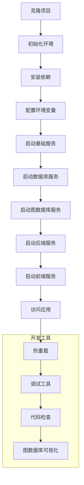

# 本地开发指南

<cite>
**本文档引用的文件**
- [LOCAL_DEV_GUIDE.md](file://LOCAL_DEV_GUIDE.md)
- [start_local_dev.sh](file://start_local_dev.sh)
- [docker-compose.dev.yml](file://docker-compose.dev.yml)
- [pyproject.toml](file://pyproject.toml)
- [requirements.txt](file://requirements.txt)
- [backend/main.py](file://backend/main.py)
- [backend/config.py](file://backend/config.py)
- [core/database.py](file://core/database.py)
- [agents/__init__.py](file://agents/__init__.py)
- [agents/crew_manager.py](file://agents/crew_manager.py)
- [backend/api/v1/novels.py](file://backend/api/v1/novels.py)
- [frontend/package.json](file://frontend/package.json)
- [frontend/vite.config.ts](file://frontend/vite.config.ts)
- [scripts/init_local_dev.sh](file://scripts/init_local_dev.sh)
- [frontend/Dockerfile](file://frontend/Dockerfile)
- [scripts/start_frontend.sh](file://scripts/start_frontend.sh)
- [start_dev.sh](file://start_dev.sh)
- [core/graph/neo4j_client.py](file://core/graph/neo4j_client.py)
- [backend/api/v1/graph.py](file://backend/api/v1/graph.py)
</cite>

## 更新摘要
**变更内容**
- 新增前端开发服务配置章节，详细介绍frontend_dev服务的架构和功能
- 更新Docker服务依赖图表，包含新增的Neo4j图数据库服务
- 增强前端开发环境配置说明，包括Vite代理和热重载功能
- 添加图数据库服务配置和API集成说明

## 目录
1. [简介](#简介)
2. [项目结构](#项目结构)
3. [核心组件](#核心组件)
4. [架构概览](#架构概览)
5. [详细组件分析](#详细组件分析)
6. [前端开发服务配置](#前端开发服务配置)
7. [依赖分析](#依赖分析)
8. [性能考虑](#性能考虑)
9. [故障排除指南](#故障排除指南)
10. [结论](#结论)
11. [附录](#附录)

## 简介

小说生成系统是一个基于AI驱动的完整小说创作平台，集成了多Agent协作架构和先进的内容生成技术。该系统支持从创意企划到最终发布的全流程小说创作，包括世界观设定、角色管理、剧情大纲规划、章节生成和多平台发布等功能。

系统采用现代化的技术栈：后端使用FastAPI + SQLAlchemy异步ORM，前端使用React + TypeScript，数据库使用PostgreSQL，缓存使用Redis，Agent系统基于CrewAI框架。整个架构支持热重载开发模式，提供完整的本地开发环境配置。

**更新** 新增了完整的前端开发服务配置，包括使用Node.js 20-alpine镜像的frontend_dev服务，支持热重载和API代理功能，以及Neo4j图数据库服务的集成。

## 项目结构

该项目采用模块化的组织方式，主要包含以下核心目录：

```mermaid
graph TB
subgraph "项目根目录"
A[backend/] - 后端服务
B[frontend/] - 前端应用
C[agents/] - Agent系统
D[core/] - 核心模块
E[services/] - 业务服务
F[tests/] - 测试套件
G[scripts/] - 运维脚本
H[migrations/] - 数据库迁移
I[workers/] - Celery任务队列
J[nginx/] - Nginx配置
end
subgraph "后端架构"
A1[API路由] --> A2[业务服务]
A2 --> A3[数据模型]
A3 --> A4[数据库连接]
end
subgraph "Agent系统"
C1[Crew管理器] --> C2[审查循环]
C2 --> C3[投票管理]
C3 --> C4[查询服务]
end
subgraph "前端架构"
B1[React组件] --> B2[API客户端]
B2 --> B3[Vite配置]
end
subgraph "图数据库服务"
K[Neo4j图数据库] --> K1[角色关系网络]
K --> K2[事件时间线]
K --> K3[伏笔追踪]
end
```

**图表来源**
- [LOCAL_DEV_GUIDE.md:189-213](file://LOCAL_DEV_GUIDE.md#L189-L213)
- [backend/main.py:1-149](file://backend/main.py#L1-L149)
- [docker-compose.dev.yml:37-59](file://docker-compose.dev.yml#L37-L59)

**章节来源**
- [LOCAL_DEV_GUIDE.md:189-213](file://LOCAL_DEV_GUIDE.md#L189-L213)
- [pyproject.toml:1-64](file://pyproject.toml#L1-L64)

## 核心组件

### 后端核心组件

后端系统基于FastAPI构建，提供了完整的RESTful API服务，支持异步数据库操作和中间件配置。

**数据库配置**：系统使用SQLAlchemy异步引擎，支持连接池管理和自动回滚机制。数据库连接根据Docker环境自动切换主机地址和端口。

**配置管理**：通过Pydantic设置类管理所有环境变量，支持开发和生产环境的动态配置切换。

**中间件配置**：实现了CORS中间件，专门针对前端开发服务器进行跨域配置。

**章节来源**
- [backend/main.py:1-149](file://backend/main.py#L1-L149)
- [backend/config.py:1-167](file://backend/config.py#L1-L167)
- [core/database.py:1-36](file://core/database.py#L1-L36)

### Agent系统组件

Agent系统是整个小说生成的核心，采用了多Agent协作架构，支持审查循环、投票共识和智能查询等功能。

**Crew管理器**：负责协调各个Agent的工作流程，支持质量驱动的迭代优化和连续性保证。

**审查循环**：实现了Writer-Editor模式的质量控制，通过多轮迭代提升生成内容的质量。

**投票管理**：在企划阶段提供多Agent投票决策机制，确保关键决策的合理性。

**章节来源**
- [agents/__init__.py:1-46](file://agents/__init__.py#L1-L46)
- [agents/crew_manager.py:1-200](file://agents/crew_manager.py#L1-L200)

### 前端核心组件

前端应用基于React 19和TypeScript构建，使用Vite作为开发服务器，提供了现代化的用户界面和开发体验。

**组件架构**：采用Ant Design组件库，支持响应式设计和良好的用户体验。

**API集成**：通过Axios客户端与后端API进行通信，支持代理配置以解决跨域问题。

**开发配置**：Vite配置支持热重载和开发服务器的网络访问。

**章节来源**
- [frontend/package.json:1-42](file://frontend/package.json#L1-L42)
- [frontend/vite.config.ts:1-44](file://frontend/vite.config.ts#L1-L44)

## 架构概览

系统采用分层架构设计，各组件之间通过清晰的接口进行交互：



**图表来源**
- [backend/main.py:62-90](file://backend/main.py#L62-L90)
- [docker-compose.dev.yml:37-96](file://docker-compose.dev.yml#L37-L96)

## 详细组件分析

### 数据库连接管理

系统使用SQLAlchemy异步引擎进行数据库操作，提供了完整的连接池管理和事务处理机制。



**图表来源**
- [core/database.py:26-36](file://core/database.py#L26-L36)

**章节来源**
- [core/database.py:1-36](file://core/database.py#L1-L36)

### Agent协作流程

Agent系统实现了复杂的多Agent协作机制，支持审查循环和智能决策：



**图表来源**
- [agents/crew_manager.py:41-165](file://agents/crew_manager.py#L41-L165)

**章节来源**
- [agents/crew_manager.py:1-200](file://agents/crew_manager.py#L1-L200)

### API路由架构

后端API采用模块化路由设计，每个功能模块都有独立的路由文件：

```mermaid
classDiagram
class NovelRouter {
+GET /novels
+POST /novels
+GET /novels/{id}
+PATCH /novels/{id}
+DELETE /novels/{id}
}
class CharacterRouter {
+GET /characters
+POST /characters
+GET /characters/{id}
+PATCH /characters/{id}
+DELETE /characters/{id}
}
class ChapterRouter {
+GET /chapters
+POST /chapters
+GET /chapters/{id}
+PATCH /chapters/{id}
+DELETE /chapters/{id}
}
class GenerationRouter {
+POST /generation/tasks
+GET /generation/tasks/{id}
+GET /generation/tasks/{id}/status
}
class GraphRouter {
+GET /novels/{novel_id}/graph/health
+POST /novels/{novel_id}/graph/init
+POST /novels/{novel_id}/graph/sync
+GET /novels/{novel_id}/graph/network/{character_name}
+GET /novels/{novel_id}/graph/path
+GET /novels/{novel_id}/graph/relationships
+GET /novels/{novel_id}/graph/conflicts
+GET /novels/{novel_id}/graph/influence/{character_name}
+GET /novels/{novel_id}/graph/timeline
+GET /novels/{novel_id}/graph/foreshadowings/pending
+POST /novels/{novel_id}/graph/extract
+POST /novels/{novel_id}/graph/extract/batch
+POST /novels/{novel_id}/graph/extract-all
+GET /novels/{novel_id}/graph/extract-all/{task_id}/status
}
class APIRouter {
+include_router(router, prefix)
+health_check()
+root_info()
}
APIRouter --> NovelRouter
APIRouter --> CharacterRouter
APIRouter --> ChapterRouter
APIRouter --> GenerationRouter
APIRouter --> GraphRouter
```

**图表来源**
- [backend/api/v1/novels.py:22-189](file://backend/api/v1/novels.py#L22-L189)
- [backend/api/v1/graph.py:43-765](file://backend/api/v1/graph.py#L43-L765)

**章节来源**
- [backend/api/v1/novels.py:1-189](file://backend/api/v1/novels.py#L1-L189)
- [backend/api/v1/graph.py:1-765](file://backend/api/v1/graph.py#L1-L765)

## 前端开发服务配置

**更新** 新增前端开发服务配置章节，详细介绍frontend_dev服务的架构和功能。

前端开发服务是系统的重要组成部分，提供了现代化的开发体验和完整的热重载功能。

### 前端开发服务架构

frontend_dev服务基于Node.js 20-alpine镜像构建，专门为前端开发提供独立的开发环境：



**图表来源**
- [docker-compose.dev.yml:107-124](file://docker-compose.dev.yml#L107-L124)
- [frontend/vite.config.ts:19-41](file://frontend/vite.config.ts#L19-L41)

### Vite开发服务器配置

Vite开发服务器提供了快速的开发体验，支持热重载和API代理功能：

**热重载配置**：监听所有网络接口，允许容器外部访问
**API代理**：将/api前缀的请求转发到后端服务
**开发服务器**：支持跨网络访问的开发环境

**章节来源**
- [frontend/vite.config.ts:1-44](file://frontend/vite.config.ts#L1-L44)
- [docker-compose.dev.yml:107-124](file://docker-compose.dev.yml#L107-L124)

### 环境变量配置

frontend_dev服务使用环境变量进行配置：

**API_PROXY_TARGET**：指定API代理的目标地址，默认指向后端服务
**开发环境**：支持Docker环境下的动态配置

**章节来源**
- [docker-compose.dev.yml:112-113](file://docker-compose.dev.yml#L112-L113)

### 依赖管理

前端项目使用npm进行依赖管理，支持完整的开发工具链：

**开发依赖**：Vite、TypeScript、ESLint等现代开发工具
**运行时依赖**：React、Ant Design、Axios等核心库
**构建工具**：支持开发和生产环境的不同构建配置

**章节来源**
- [frontend/package.json:1-42](file://frontend/package.json#L1-L42)

### 启动脚本

系统提供了多种启动前端服务的方式：

**Docker Compose启动**：直接使用docker-compose.dev.yml启动frontend_dev服务
**手动启动**：使用npm run dev命令启动Vite开发服务器
**脚本自动化**：提供完整的启动脚本，自动处理依赖安装和健康检查

**章节来源**
- [scripts/start_frontend.sh:1-34](file://scripts/start_frontend.sh#L1-L34)
- [start_dev.sh:43-45](file://start_dev.sh#L43-L45)

## 依赖分析

### Python依赖关系

系统使用Poetry进行依赖管理，主要依赖包括：

**核心依赖**：
- FastAPI 0.115.0+ - Web框架
- SQLAlchemy 2.0.0+ - ORM框架
- asyncpg 0.30.0+ - PostgreSQL异步驱动
- Redis 5.0.0+ - 缓存和消息队列
- CrewAI 0.100.0+ - Agent框架
- DashScope 1.20.0+ - 大模型API

**开发依赖**：
- pytest 8.0.0+ - 测试框架
- ruff 0.8.0+ - 代码检查工具

**章节来源**
- [pyproject.toml:8-36](file://pyproject.toml#L8-L36)
- [requirements.txt:1-28](file://requirements.txt#L1-L28)

### Docker服务依赖

开发环境使用Docker Compose管理多个服务，包括新增的图数据库服务：



**图表来源**
- [docker-compose.dev.yml:6-103](file://docker-compose.dev.yml#L6-L103)
- [docker-compose.dev.yml:37-59](file://docker-compose.dev.yml#L37-L59)

**章节来源**
- [docker-compose.dev.yml:1-137](file://docker-compose.dev.yml#L1-L137)

### 图数据库服务集成

**更新** 新增图数据库服务集成章节，介绍Neo4j图数据库的配置和使用。

系统集成了Neo4j图数据库服务，提供角色关系网络、事件时间线和伏笔追踪等功能：

**服务配置**：使用官方Neo4j镜像，配置APOC插件和内存参数
**端口映射**：Bolt协议端口7687和HTTP浏览器端口7474
**数据持久化**：独立的数据卷和日志卷管理
**环境变量**：预设用户名密码和插件配置

**章节来源**
- [docker-compose.dev.yml:37-59](file://docker-compose.dev.yml#L37-L59)
- [core/graph/neo4j_client.py:1-552](file://core/graph/neo4j_client.py#L1-L552)
- [backend/api/v1/graph.py:1-765](file://backend/api/v1/graph.py#L1-L765)

## 性能考虑

### 数据库性能优化

系统采用了多项数据库性能优化策略：

**连接池配置**：最大连接数20，溢出连接20，支持异步操作
**查询优化**：使用selectinload进行N+1查询优化
**索引策略**：对常用查询字段建立适当索引
**事务管理**：自动回滚机制确保数据一致性

### 缓存策略

**Redis缓存**：用于会话存储、任务队列和临时数据缓存
**前端缓存**：浏览器缓存静态资源，减少带宽消耗
**API缓存**：对频繁查询的结果进行缓存

### Agent性能优化

**并发处理**：使用Celery进行异步任务处理
**资源管理**：合理配置Agent数量和内存使用
**成本控制**：通过CostTracker监控和控制API调用成本

### 图数据库性能优化

**更新** 新增图数据库性能优化章节。

**连接池管理**：Neo4j客户端支持连接池和事务管理
**查询优化**：白名单机制防止Cypher注入，支持参数化查询
**缓存策略**：图查询结果缓存，减少重复查询开销
**异步处理**：大量数据处理使用异步和后台任务

**章节来源**
- [core/graph/neo4j_client.py:100-172](file://core/graph/neo4j_client.py#L100-L172)
- [backend/config.py:380-396](file://backend/config.py#L380-L396)

## 故障排除指南

### 常见问题及解决方案

**数据库连接问题**：
- 检查PostgreSQL服务状态：`docker-compose ps postgres`
- 验证连接字符串配置
- 确认端口5436未被占用

**Redis连接问题**：
- 启动Redis服务：`docker-compose up -d redis`
- 检查Redis端口6382可用性
- 验证Redis连接URL配置

**API密钥问题**：
- 检查.env文件中的DASHSCOPE_API_KEY
- 确认API密钥有效性和权限
- 验证DashScope服务可用性

**前端开发服务问题**：
- 检查frontend_dev服务状态：`docker-compose ps frontend_dev`
- 验证Vite开发服务器端口3000
- 确认API代理配置正确指向后端服务

**图数据库连接问题**：
- 启动Neo4j服务：`docker-compose up -d neo4j_dev`
- 检查Neo4j端口7688和7475
- 验证Neo4j用户名密码配置
- 确认APOC插件已正确加载

**端口冲突问题**：
- 查找占用端口的进程：`lsof -i :8000`
- 修改配置文件中的端口号
- 使用不同的端口组合

**依赖安装问题**：
- 清理虚拟环境并重新安装
- 检查Python版本兼容性
- 验证网络连接和镜像源配置

**章节来源**
- [LOCAL_DEV_GUIDE.md:215-286](file://LOCAL_DEV_GUIDE.md#L215-L286)

## 结论

小说生成系统提供了一个完整、可扩展的AI小说创作平台。通过模块化的架构设计和丰富的功能特性，开发者可以快速上手并进行二次开发。

系统的本地开发环境配置完善，支持多种部署方式，包括手动安装和Docker容器化部署。完善的测试套件和文档支持确保了代码质量和开发效率。

**更新** 新增的前端开发服务和图数据库服务进一步增强了系统的开发体验和功能完整性。前端开发服务提供了现代化的开发工具链，而图数据库服务则为复杂的关系查询和可视化提供了强大的支持。

对于想要深入了解系统的开发者，建议从Agent系统和API架构入手，逐步理解整个系统的协作机制和数据流转。

## 附录

### 开发环境启动流程



**图表来源**
- [scripts/init_local_dev.sh:1-83](file://scripts/init_local_dev.sh#L1-L83)
- [start_local_dev.sh:1-53](file://start_local_dev.sh#L1-L53)
- [start_dev.sh:18-45](file://start_dev.sh#L18-L45)

### 环境变量配置

| 变量名 | 说明 | 默认值 | 必填 |
|--------|------|--------|------|
| DASHSCOPE_API_KEY | 阿里云DashScope API Key | - | ✅ |
| DATABASE_URL | PostgreSQL连接字符串 | localhost:5436 | ✅ |
| REDIS_URL | Redis连接URL | localhost:6382 | ❌ |
| APP_ENV | 应用环境 | development | ❌ |
| APP_DEBUG | 调试模式 | true | ❌ |
| DOCKER_ENV | Docker环境标记 | false | ❌ |
| API_PROXY_TARGET | 前端API代理目标 | http://localhost:8000 | ❌ |
| ENABLE_GRAPH_DATABASE | 启用图数据库 | true | ❌ |
| NEO4J_PASSWORD | Neo4j密码 | novel_graph_pass | ❌ |

**章节来源**
- [LOCAL_DEV_GUIDE.md:287-310](file://LOCAL_DEV_GUIDE.md#L287-L310)
- [docker-compose.dev.yml:112-113](file://docker-compose.dev.yml#L112-L113)
- [backend/config.py:356-372](file://backend/config.py#L356-L372)

### Docker服务端口映射

| 服务名 | 容器端口 | 主机端口 | 用途 |
|--------|----------|----------|------|
| postgres_dev | 5432 | 5436 | PostgreSQL数据库 |
| redis_dev | 6379 | 6382 | Redis缓存 |
| neo4j_dev | 7687 | 7688 | Neo4j Bolt协议 |
| neo4j_dev | 7474 | 7475 | Neo4j浏览器界面 |
| backend_dev | 8000 | 8000 | FastAPI后端服务 |
| frontend_dev | 3000 | 3000 | Vite前端开发服务器 |

**章节来源**
- [docker-compose.dev.yml:9-103](file://docker-compose.dev.yml#L9-L103)
- [docker-compose.dev.yml:46-49](file://docker-compose.dev.yml#L46-L49)