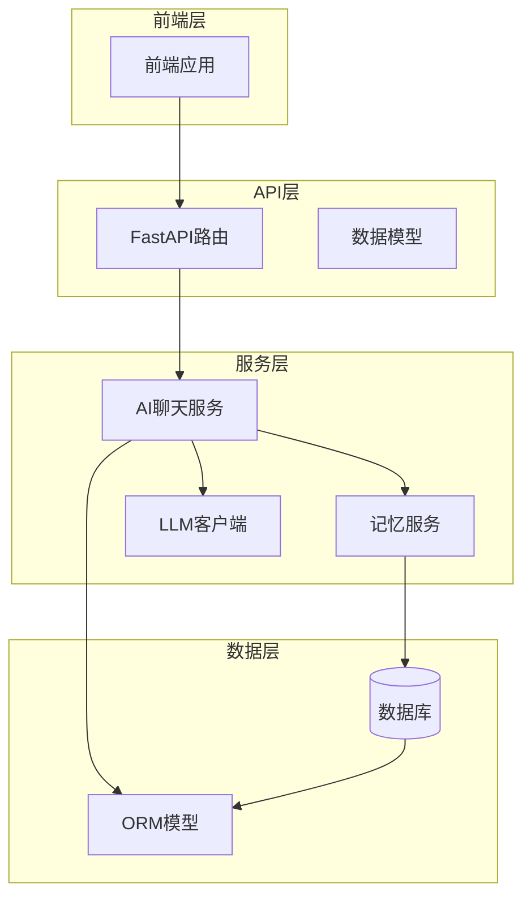
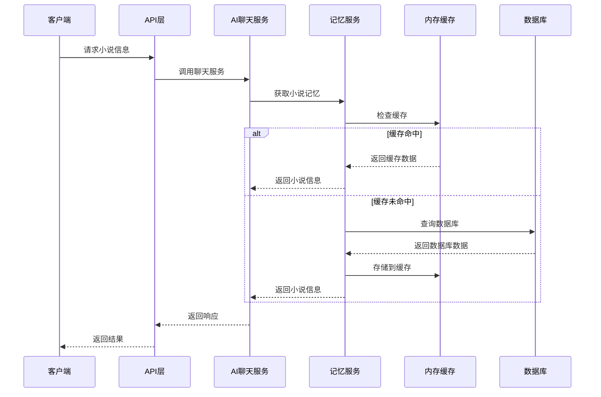
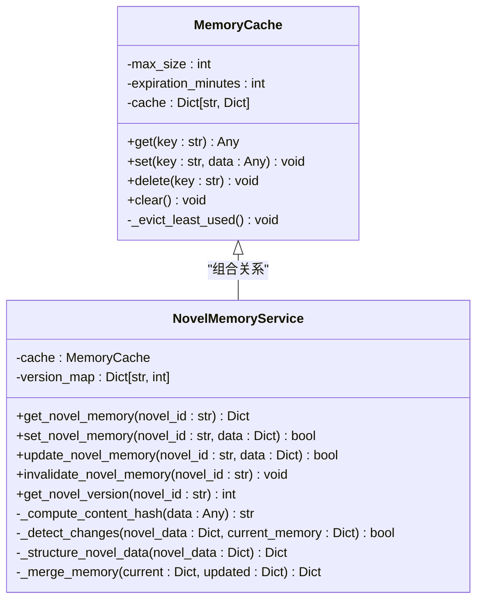
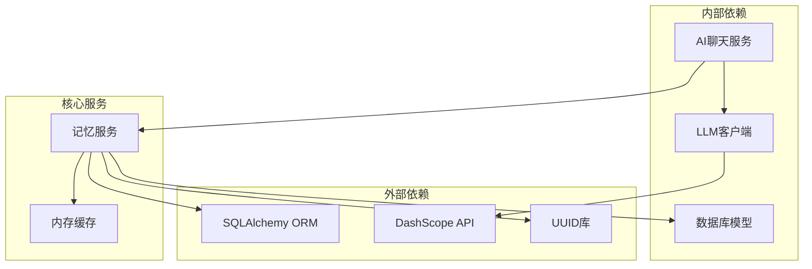
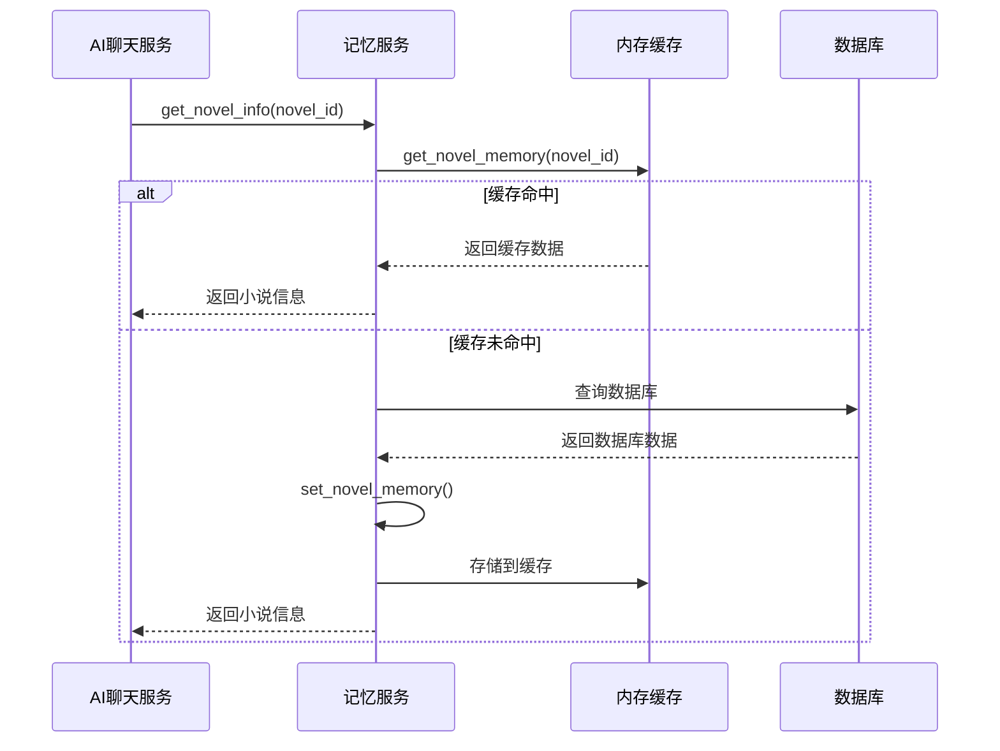

# Memory Service

<cite>
**本文档引用的文件**
- [memory_service.py](file://backend/services/memory_service.py)
- [ai_chat_service.py](file://backend/services/ai_chat_service.py)
- [ai_chat.py](file://backend/api/v1/ai_chat.py)
- [ai_chat_session.py](file://core/models/ai_chat_session.py)
- [novel.py](file://core/models/novel.py)
- [qwen_client.py](file://llm/qwen_client.py)
- [ai_chat.py](file://backend/schemas/ai_chat.py)
</cite>

## 目录
1. [简介](#简介)
2. [项目结构](#项目结构)
3. [核心组件](#核心组件)
4. [架构概览](#架构概览)
5. [详细组件分析](#详细组件分析)
6. [依赖关系分析](#依赖关系分析)
7. [性能考虑](#性能考虑)
8. [故障排除指南](#故障排除指南)
9. [结论](#结论)

## 简介

Memory Service 是小说创作系统中的核心记忆管理模块，负责高效存储和管理小说相关信息。该服务提供了智能的内存缓存机制、深度变化检测、版本控制以及专门针对小说创作场景的数据结构化管理。

该服务主要服务于AI聊天功能，通过智能缓存机制显著提升小说信息的访问速度，同时提供完整的版本控制和增量更新能力，确保小说创作过程中的数据一致性。

## 项目结构

Memory Service 在整个项目架构中扮演着关键角色，位于服务层的核心位置：

**图表来源**
- [memory_service.py](file://backend/services/memory_service.py#L1-L396)
- [ai_chat_service.py](file://backend/services/ai_chat_service.py#L1-L200)

**章节来源**
- [memory_service.py](file://backend/services/memory_service.py#L1-L396)
- [ai_chat_service.py](file://backend/services/ai_chat_service.py#L1-L200)

## 核心组件

Memory Service 包含两个核心组件：

### 1. MemoryCache 缓存系统
- **内存缓存实现**：提供LRU（最近最少使用）淘汰策略
- **过期管理**：支持可配置的过期时间
- **容量控制**：限制最大缓存条目数量
- **访问统计**：跟踪访问频率和时间

### 2. NovelMemoryService 小说记忆服务
- **深度变化检测**：检测小说各个组成部分的变化
- **版本控制系统**：维护小说内容的版本历史
- **结构化数据存储**：按层次结构组织小说数据
- **增量更新支持**：仅在内容发生变化时更新缓存

**章节来源**
- [memory_service.py](file://backend/services/memory_service.py#L12-L72)
- [memory_service.py](file://backend/services/memory_service.py#L74-L274)

## 架构概览

Memory Service 采用分层架构设计，与AI聊天服务紧密集成：

**图表来源**
- [ai_chat_service.py](file://backend/services/ai_chat_service.py#L207-L368)
- [memory_service.py](file://backend/services/memory_service.py#L133-L171)

## 详细组件分析

### MemoryCache 类分析

MemoryCache 提供了完整的内存缓存解决方案：

**图表来源**
- [memory_service.py](file://backend/services/memory_service.py#L12-L72)
- [memory_service.py](file://backend/services/memory_service.py#L74-L274)

#### 核心功能特性

1. **智能缓存淘汰**：基于访问频率和时间的LRU算法
2. **过期时间管理**：自动清理过期数据
3. **容量限制**：防止内存无限增长
4. **原子操作**：保证缓存操作的线程安全

**章节来源**
- [memory_service.py](file://backend/services/memory_service.py#L12-L72)

### NovelMemoryService 类分析

NovelMemoryService 是记忆服务的核心实现：

#### 数据结构设计

服务采用分层数据结构来组织小说信息：

**图表来源**
- [memory_service.py](file://backend/services/memory_service.py#L198-L239)

#### 深度变化检测算法

服务实现了复杂的变更检测机制：

**图表来源**
- [memory_service.py](file://backend/services/memory_service.py#L92-L131)

**章节来源**
- [memory_service.py](file://backend/services/memory_service.py#L74-L274)

### 章节摘要管理

服务提供了专门的章节摘要管理功能：

#### 章节摘要数据结构

| 字段 | 类型 | 描述 |
|------|------|------|
| key_events | List[Dict] | 关键事件列表 |
| character_changes | Dict[str, Any] | 角色变化记录 |
| plot_progress | str | 故事情节进展 |
| foreshadowing | List[str] | 预示性线索 |
| ending_state | Dict[str, Any] | 章节结尾状态 |

**章节来源**
- [memory_service.py](file://backend/services/memory_service.py#L277-L332)

### 角色状态管理

服务支持复杂的角色状态追踪：

#### 角色状态数据结构

| 字段 | 类型 | 描述 |
|------|------|------|
| last_appearance_chapter | int | 最后出场章节 |
| current_location | str | 当前位置 |
| cultivation_level | str | 修炼等级 |
| emotional_state | str | 情感状态 |
| relationships | Dict[str, Any] | 关系网络 |
| status | str | 角色状态 |
| pending_events | List[Dict] | 待处理事件 |

**章节来源**
- [memory_service.py](file://backend/services/memory_service.py#L335-L385)

## 依赖关系分析

Memory Service 与其他组件的依赖关系如下：

**图表来源**
- [memory_service.py](file://backend/services/memory_service.py#L1-L10)
- [ai_chat_service.py](file://backend/services/ai_chat_service.py#L1-L15)

### 与AI聊天服务的集成

Memory Service 与AI聊天服务的集成关系：

**图表来源**
- [ai_chat_service.py](file://backend/services/ai_chat_service.py#L207-L368)
- [memory_service.py](file://backend/services/memory_service.py#L133-L171)

**章节来源**
- [ai_chat_service.py](file://backend/services/ai_chat_service.py#L192-L200)
- [memory_service.py](file://backend/services/memory_service.py#L388-L396)

## 性能考虑

### 缓存性能优化

1. **LRU淘汰策略**：通过访问频率和时间排序实现智能淘汰
2. **哈希计算优化**：使用MD5哈希快速检测内容变化
3. **增量更新机制**：仅在内容变化时更新缓存
4. **内存使用控制**：限制最大缓存条目数量

### 数据结构优化

1. **分层存储**：将不同类型的数据分离存储
2. **延迟加载**：按需加载章节摘要和角色状态
3. **内容哈希**：使用哈希值快速比较复杂数据结构
4. **版本控制**：维护内容版本历史便于追踪变更

## 故障排除指南

### 常见问题及解决方案

#### 缓存失效问题
- **症状**：频繁从数据库重新加载数据
- **原因**：缓存过期时间设置过短
- **解决方案**：调整 `expiration_minutes` 参数

#### 内存泄漏问题
- **症状**：内存使用持续增长
- **原因**：缓存条目过多未被清理
- **解决方案**：检查 `max_size` 设置和淘汰机制

#### 版本冲突问题
- **症状**：版本号异常增长
- **原因**：并发更新导致的竞态条件
- **解决方案**：使用原子操作更新版本号

**章节来源**
- [memory_service.py](file://backend/services/memory_service.py#L56-L67)
- [memory_service.py](file://backend/services/memory_service.py#L155-L158)

## 结论

Memory Service 作为小说创作系统的核心组件，提供了高效、可靠的内存缓存和数据管理能力。其设计特点包括：

1. **智能缓存管理**：通过LRU算法和过期机制确保内存使用效率
2. **深度变化检测**：精确识别小说内容的细微变化
3. **版本控制系统**：完整追踪内容演进历史
4. **结构化数据存储**：针对小说创作场景优化的数据组织方式
5. **高性能架构**：与AI聊天服务无缝集成，提供流畅的用户体验

该服务为整个小说创作系统奠定了坚实的数据管理基础，支持复杂的AI辅助创作功能，是系统能够高效运行的关键保障。