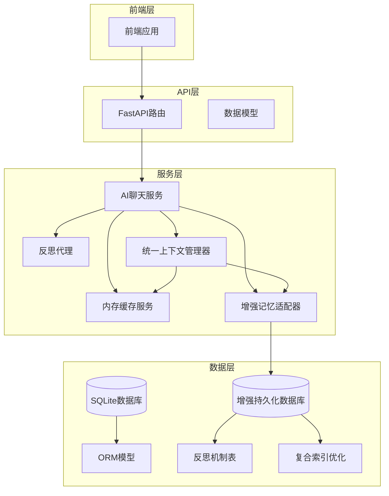
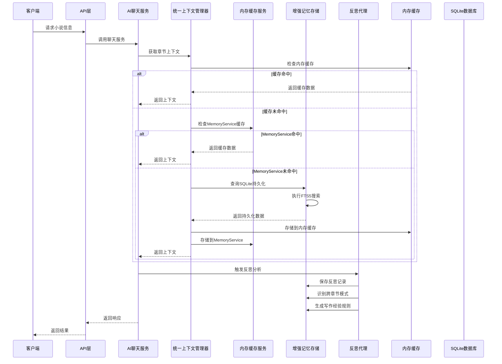
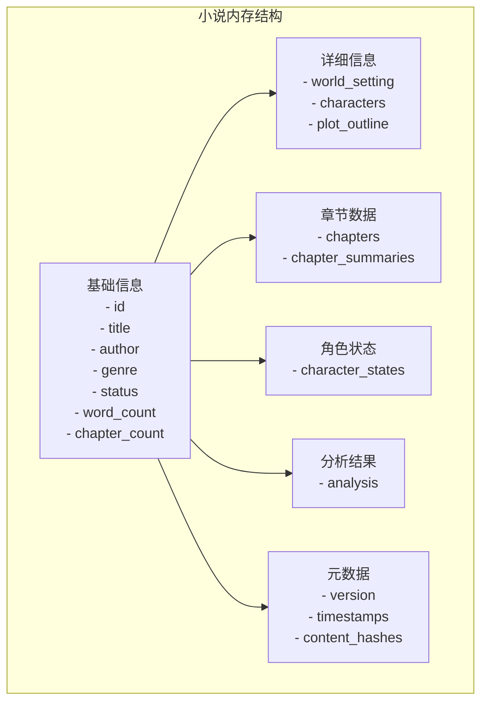
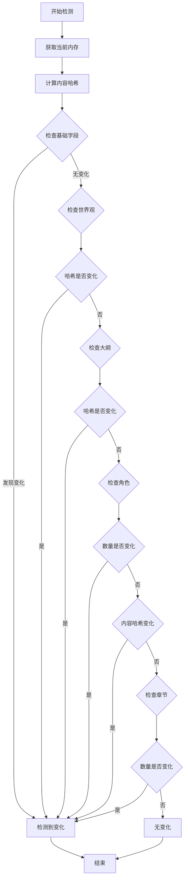
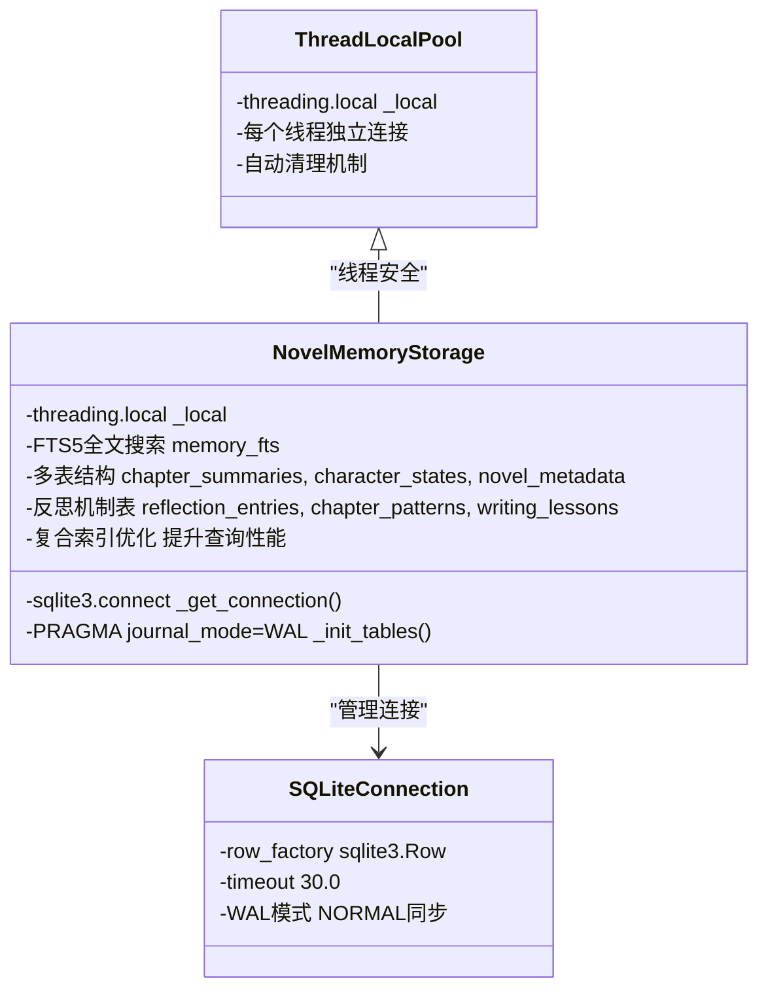
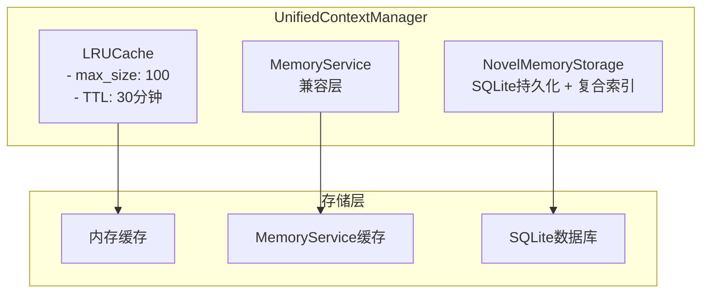
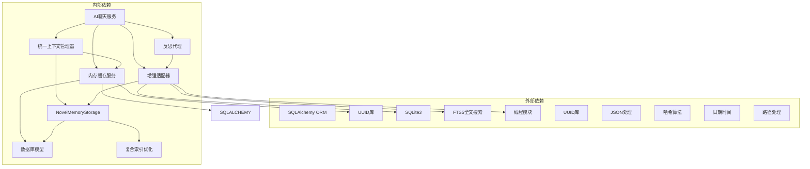
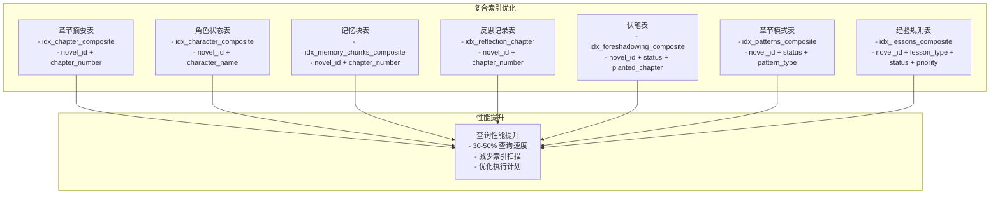

# 内存服务

<cite>
**本文档引用的文件**
- [memory_service.py](file://backend/services/memory_service.py)
- [agentmesh_memory_adapter.py](file://backend/services/agentmesh_memory_adapter.py)
- [context_manager.py](file://backend/services/context_manager.py)
- [ai_chat_service.py](file://backend/services/ai_chat_service.py)
- [ai_chat.py](file://backend/api/v1/ai_chat.py)
- [ai_chat_session.py](file://core/models/ai_chat_session.py)
- [novel.py](file://core/models/novel.py)
- [qwen_client.py](file://llm/qwen_client.py)
- [ai_chat.py](file://backend/schemas/ai_chat.py)
- [reflection_agent.py](file://agents/reflection_agent.py)
- [add_memory_query_indexes.py](file://migrations/add_memory_query_indexes.py)
- [test_memory_query_performance.py](file://tests/performance/test_memory_query_performance.py)
</cite>

## 更新摘要
**所做更改**
- 修复了agentmesh_memory_adapter中的SQL语法问题，修正了SELECT语句结构以正确检索章节摘要数据
- 新增了复合索引优化方案，解决了Issue #42中提到的记忆系统查询性能问题
- 更新了SQL查询语句的语法规范，确保与SQLite数据库的兼容性
- 增强了章节摘要查询的性能优化，通过复合索引提升查询效率

## 目录
1. [简介](#简介)
2. [项目结构](#项目结构)
3. [核心组件](#核心组件)
4. [架构概览](#架构概览)
5. [详细组件分析](#详细组件分析)
6. [依赖关系分析](#依赖关系分析)
7. [性能考虑](#性能考虑)
8. [故障排除指南](#故障排除指南)
9. [结论](#结论)

## 简介

内存服务是小说创作系统中的核心记忆管理模块，负责高效存储和管理小说相关信息。该服务提供了智能的内存缓存机制、深度变化检测、版本控制以及专门针对小说创作场景的数据结构化管理。

**更新** 系统当前采用增强的混合架构，新的NovelMemoryStorage适配器替代了旧的PersistentMemory类，实现了更强大的SQLite持久化层、FTS5全文搜索能力和线程安全连接池。该适配器借鉴AgentMesh的设计思想，提供分层记忆管理，支持章节摘要、角色状态、伏笔追踪等多维度记忆存储。

**更新** 为了解决Issue #42中提到的记忆系统查询性能问题，系统现已实现复合索引优化方案，通过专门的迁移脚本为高频查询添加了复合索引，显著提升了章节摘要、角色状态和记忆块的查询性能。

## 项目结构

内存服务在当前架构中采用三层存储设计，既包含内存缓存也包含增强的持久化存储：



**图表来源**
- [memory_service.py:1-449](file://backend/services/memory_service.py#L1-L449)
- [agentmesh_memory_adapter.py:20-1610](file://backend/services/agentmesh_memory_adapter.py#L20-L1610)
- [context_manager.py:99-391](file://backend/services/context_manager.py#L99-L391)
- [ai_chat_service.py:214-225](file://backend/services/ai_chat_service.py#L214-L225)

## 核心组件

内存服务包含五个核心组件：

### 1. MemoryCache 内存缓存系统
- **内存缓存实现**：提供LRU（最近最少使用）淘汰策略
- **过期管理**：支持可配置的过期时间（默认30分钟）
- **容量控制**：限制最大缓存条目数量（默认100个）
- **访问统计**：跟踪访问频率和时间

### 2. NovelMemoryService 小说内存服务
- **深度变化检测**：检测小说各个组成部分的变化
- **版本控制系统**：维护小说内容的版本历史
- **结构化数据存储**：按层次结构组织小说数据
- **增量更新支持**：仅在内容发生变化时更新缓存

### 3. NovelMemoryStorage 增强记忆存储层
- **SQLite持久化存储**：使用SQLite数据库进行长期数据存储
- **线程安全连接池**：使用threading.local()确保线程安全
- **WAL模式优化**：启用WAL模式提升并发性能
- **全文搜索支持**：集成FTS5全文搜索引擎
- **分层记忆管理**：支持章节摘要、角色状态、伏笔追踪等多维度记忆
- **反思机制支持**：提供反思记录、跨章节模式和写作经验规则的管理
- **复合索引优化**：通过Issue #42优化方案提升查询性能

### 4. NovelMemoryAdapter 高层记忆适配器
- **统一API接口**：提供高层API，集成持久化存储与现有系统
- **章节记忆操作**：保存章节摘要和生成上下文
- **小说元数据管理**：初始化和加载小说长期记忆
- **搜索操作**：提供全文搜索功能
- **角色状态管理**：更新和查询角色状态

### 5. UnifiedContextManager 统一上下文管理器
- **三层存储统一管理**：内存缓存、MemoryService、SQLite持久化
- **自动同步机制**：实现三层存储间的自动同步
- **LRU + TTL清理策略**：提供内存清理机制
- **统一上下文构建接口**：简化上下文获取流程

**章节来源**
- [memory_service.py:12-72](file://backend/services/memory_service.py#L12-L72)
- [memory_service.py:75-449](file://backend/services/memory_service.py#L75-L449)
- [agentmesh_memory_adapter.py:20-1610](file://backend/services/agentmesh_memory_adapter.py#L20-L1610)
- [context_manager.py:99-391](file://backend/services/context_manager.py#L99-L391)

## 架构概览

内存服务采用增强的三层架构设计，与AI聊天服务和反思代理紧密集成：



**图表来源**
- [ai_chat_service.py:232-467](file://backend/services/ai_chat_service.py#L232-L467)
- [context_manager.py:155-251](file://backend/services/context_manager.py#L155-L251)
- [agentmesh_memory_adapter.py:803-920](file://backend/services/agentmesh_memory_adapter.py#L803-L920)
- [reflection_agent.py:175-190](file://agents/reflection_agent.py#L175-L190)

## 详细组件分析

### MemoryCache 类分析

MemoryCache 提供了完整的内存缓存解决方案：


**图表来源**
- [memory_service.py:12-72](file://backend/services/memory_service.py#L12-L72)
- [memory_service.py:75-449](file://backend/services/memory_service.py#L75-L449)

#### 核心功能特性

1. **智能缓存淘汰**：基于访问频率和时间的LRU算法
2. **过期时间管理**：自动清理过期数据（默认30分钟）
3. **容量限制**：防止内存无限增长（默认100个条目）
4. **原子操作**：保证缓存操作的线程安全

**章节来源**
- [memory_service.py:12-72](file://backend/services/memory_service.py#L12-L72)

### NovelMemoryService 类分析

NovelMemoryService 是内存服务的核心实现：

#### 数据结构设计

服务采用分层数据结构来组织小说信息：



**图表来源**
- [memory_service.py:206-257](file://backend/services/memory_service.py#L206-L257)

#### 深度变化检测算法

服务实现了复杂的变更检测机制：



**图表来源**
- [memory_service.py:94-137](file://backend/services/memory_service.py#L94-L137)

**章节来源**
- [memory_service.py:75-449](file://backend/services/memory_service.py#L75-L449)

### NovelMemoryStorage 类分析

**更新** NovelMemoryStorage 是新的核心存储组件，替代了旧的PersistentMemory类：

#### 线程安全连接池设计



**图表来源**
- [agentmesh_memory_adapter.py:20-1610](file://backend/services/agentmesh_memory_adapter.py#L20-L1610)

#### 核心功能特性

1. **线程安全设计**：使用threading.local()为每个线程提供独立的数据库连接
2. **SQLite持久化存储**：使用SQLite数据库进行长期数据存储
3. **WAL模式优化**：启用WAL模式提升并发性能
4. **FTS5全文搜索**：集成FTS5全文搜索引擎支持关键词搜索
5. **多表结构设计**：支持章节摘要、角色状态、小说元数据等多维度存储
6. **反思机制支持**：提供反思记录、跨章节模式和写作经验规则的管理
7. **复合索引优化**：通过Issue #42优化方案提升查询性能
8. **SQL语法规范**：修复了SELECT语句结构问题，确保查询正确性

**章节来源**
- [agentmesh_memory_adapter.py:20-287](file://backend/services/agentmesh_memory_adapter.py#L20-L287)

### NovelMemoryAdapter 类分析

**更新** NovelMemoryAdapter 提供了增强的高层API接口：

#### 统一API接口设计

```mermaid
graph TD
subgraph "NovelMemoryAdapter API"
CHAPTER_MEM[章节记忆操作<br/>- save_chapter_memory()<br/>- get_chapter_context()]
NOVEL_MEM[小说元数据操作<br/>- initialize_novel_memory()<br/>- load_novel_bootstrap()]
SEARCH[搜索操作<br/>- search_relevant_context()]
CHARACTER[角色状态操作<br/>- update_character_state()]
STATS[统计和管理<br/>- get_statistics()<br/>- close()]
end
subgraph "底层存储"
STORAGE[NovelMemoryStorage<br/>SQLite + FTS5 + 复合索引]
end
CHAPTER_MEM --> STORAGE
NOVEL_MEM --> STORAGE
SEARCH --> STORAGE
CHARACTER --> STORAGE
STATS --> STORAGE
```

**图表来源**
- [agentmesh_memory_adapter.py:1353-1610](file://backend/services/agentmesh_memory_adapter.py#L1353-L1610)

#### 核心功能特性

1. **章节记忆操作**：保存章节摘要和生成上下文
2. **小说元数据管理**：初始化和加载小说长期记忆
3. **搜索操作**：提供全文搜索功能
4. **角色状态管理**：更新和查询角色状态
5. **统计和管理**：提供统计数据和资源管理

**章节来源**
- [agentmesh_memory_adapter.py:1353-1610](file://backend/services/agentmesh_memory_adapter.py#L1353-L1610)

### UnifiedContextManager 类分析

**更新** UnifiedContextManager 是新的统一上下文管理器：

#### 三层存储统一管理



**图表来源**
- [context_manager.py:99-391](file://backend/services/context_manager.py#L99-L391)

#### 核心功能特性

1. **三层存储统一管理**：内存缓存、MemoryService、SQLite持久化
2. **自动同步机制**：实现三层存储间的自动同步
3. **LRU + TTL清理策略**：提供内存清理机制
4. **统一上下文构建接口**：简化上下文获取流程

**章节来源**
- [context_manager.py:99-391](file://backend/services/context_manager.py#L99-L391)

## 依赖关系分析

**更新** 内存服务与其他组件的依赖关系发生了重大变化：



**图表来源**
- [memory_service.py:1-16](file://backend/services/memory_service.py#L1-L16)
- [ai_chat_service.py:14-15](file://backend/services/ai_chat_service.py#L14-L15)
- [agentmesh_memory_adapter.py:7-17](file://backend/services/agentmesh_memory_adapter.py#L7-L17)
- [context_manager.py:23-28](file://backend/services/context_manager.py#L23-L28)

### 与AI聊天服务和反思代理的集成

**更新** 内存服务与AI聊天服务和反思代理的集成关系：

```mermaid
sequenceDiagram
participant ChatService as AI聊天服务
participant ReflectionAgent as 反思代理
participant UnifiedContext as 统一上下文管理器
participant MemoryService as 内存缓存服务
participant PersistentStorage as 增强记忆存储
participant Cache as 内存缓存
participant DB as SQLite数据库
ChatService->>UnifiedContext : 获取章节上下文
UnifiedContext->>Cache : 检查内存缓存
alt 缓存命中
Cache-->>UnifiedContext : 返回缓存数据
UnifiedContext-->>ChatService : 返回上下文
else 缓存未命中
UnifiedContext->>MemoryService : 检查MemoryService缓存
alt MemoryService命中
MemoryService-->>UnifiedContext : 返回缓存数据
UnifiedContext-->>ChatService : 返回上下文
else MemoryService未命中
UnifiedContext->>PersistentStorage : 查询SQLite持久化
PersistentStorage->>PersistentStorage : 执行FTS5搜索
PersistentStorage-->>UnifiedContext : 返回持久化数据
UnifiedContext->>Cache : 存储到内存缓存
UnifiedContext->>MemoryService : 存储到MemoryService
UnifiedContext-->>ChatService : 返回上下文
end
ChatService->>ReflectionAgent : 触发反思分析
ReflectionAgent->>PersistentStorage : 保存反思记录
ReflectionAgent->>PersistentStorage : 识别跨章节模式
ReflectionAgent->>PersistentStorage : 生成写作经验规则
ChatService-->>ChatService : 返回响应
```

**图表来源**
- [ai_chat_service.py:232-467](file://backend/services/ai_chat_service.py#L232-L467)
- [context_manager.py:155-251](file://backend/services/context_manager.py#L155-L251)
- [agentmesh_memory_adapter.py:803-920](file://backend/services/agentmesh_memory_adapter.py#L803-L920)
- [reflection_agent.py:175-190](file://agents/reflection_agent.py#L175-L190)

**章节来源**
- [ai_chat_service.py:214-225](file://backend/services/ai_chat_service.py#L214-L225)
- [context_manager.py:139-153](file://backend/services/context_manager.py#L139-L153)
- [agentmesh_memory_adapter.py:1353-1368](file://backend/services/agentmesh_memory_adapter.py#L1353-L1368)
- [reflection_agent.py:147-155](file://agents/reflection_agent.py#L147-L155)

## 性能考虑

### 缓存性能优化

1. **LRU淘汰策略**：通过访问频率和时间排序实现智能淘汰
2. **哈希计算优化**：使用MD5哈希快速检测内容变化
3. **增量更新机制**：仅在内容变化时更新缓存
4. **内存使用控制**：限制最大缓存条目数量（默认100个）

### 数据库性能优化

**更新** 新的SQLite持久化层带来了多项性能优化：

1. **WAL模式**：启用SQLite WAL模式提升并发性能
2. **线程本地连接**：使用threading.local()避免线程安全问题
3. **FTS5全文搜索**：使用FTS5进行高效的全文检索
4. **复合索引优化**：通过Issue #42优化方案为高频查询添加复合索引
5. **SQL语法修复**：修正了SELECT语句结构问题，确保查询正确性
6. **反思机制索引**：为反思表建立专用索引提升查询性能
7. **连接池管理**：自动管理数据库连接生命周期

### 数据结构优化

1. **分层存储**：将不同类型的数据分离存储
2. **延迟加载**：按需加载章节摘要和角色状态
3. **内容哈希**：使用哈希值快速比较复杂数据结构
4. **版本控制**：维护内容版本历史便于追踪变更
5. **反思数据压缩**：使用JSON序列化存储复杂数据结构

### 反思机制性能考虑

1. **短期反思零LLM开销**：纯Python计算，不调用外部API
2. **长期反思按需触发**：每N章分析一次，减少LLM调用成本
3. **反思数据缓存**：活跃的反思记录和经验规则在内存中缓存
4. **批量操作优化**：反思代理批量处理多个章节的分析结果

### 复合索引优化方案

**更新** 为了解决Issue #42中提到的记忆系统查询性能问题，系统实现了专门的复合索引优化方案：



**图表来源**
- [add_memory_query_indexes.py:38-87](file://migrations/add_memory_query_indexes.py#L38-L87)

**章节来源**
- [add_memory_query_indexes.py:1-202](file://migrations/add_memory_query_indexes.py#L1-L202)

## 故障排除指南

### 常见问题及解决方案

#### 缓存失效问题
- **症状**：频繁从数据库重新加载数据
- **原因**：缓存过期时间设置过短（默认30分钟）
- **解决方案**：调整 `expiration_minutes` 参数

#### 内存泄漏问题
- **症状**：内存使用持续增长
- **原因**：缓存条目过多未被清理
- **解决方案**：检查 `max_size` 设置和淘汰机制

#### 版本冲突问题
- **症状**：版本号异常增长
- **原因**：并发更新导致的竞态条件
- **解决方案**：使用原子操作更新版本号

#### 数据库连接问题
- **症状**：SQLite连接超时或锁定
- **原因**：并发访问导致的连接问题
- **解决方案**：检查线程本地连接配置和超时设置

#### FTS5搜索问题
- **症状**：全文搜索性能下降或失败
- **原因**：FTS5索引损坏或不支持
- **解决方案**：重建FTS5索引或降级到LIKE搜索

#### 反思机制表初始化问题
- **症状**：反思功能无法正常工作
- **原因**：反思机制表未正确初始化
- **解决方案**：检查数据库迁移脚本和表结构

#### 反思数据同步问题
- **症状**：反思记录与实际分析结果不匹配
- **原因**：反思代理与适配器之间的数据同步问题
- **解决方案**：检查反思代理的存储调用和适配器的事务处理

#### 线程安全问题
- **症状**：多线程环境下数据不一致
- **原因**：SQLite连接共享导致的竞态条件
- **解决方案**：使用threading.local()确保每个线程独立连接

#### 统一上下文管理器问题
- **症状**：三层存储数据不同步
- **原因**：自动同步机制失效
- **解决方案**：检查同步逻辑和错误处理

#### SQL语法问题
- **症状**：章节摘要查询失败或返回空结果
- **原因**：SELECT语句结构不正确
- **解决方案**：检查SQL语法，确保正确的列名和表结构

#### 复合索引问题
- **症状**：查询性能未得到预期改善
- **原因**：复合索引未正确创建或使用
- **解决方案**：运行迁移脚本创建复合索引，检查索引使用情况

**章节来源**
- [memory_service.py:15-18](file://backend/services/memory_service.py#L15-L18)
- [agentmesh_memory_adapter.py:34-44](file://backend/services/agentmesh_memory_adapter.py#L34-L44)
- [agentmesh_memory_adapter.py:159-221](file://backend/services/agentmesh_memory_adapter.py#L159-L221)
- [context_manager.py:226-251](file://backend/services/context_manager.py#L226-L251)
- [add_memory_query_indexes.py:92-130](file://migrations/add_memory_query_indexes.py#L92-L130)

## 结论

内存服务作为小说创作系统的核心组件，经过重大升级后提供了更强大、更可靠的内存管理和数据存储能力。其设计特点包括：

1. **智能缓存管理**：通过LRU算法和过期机制确保内存使用效率
2. **深度变化检测**：精确识别小说内容的细微变化
3. **版本控制系统**：完整追踪内容演进历史
4. **结构化数据存储**：针对小说创作场景优化的数据组织方式
5. **增强持久化存储**：提供SQLite数据库的长期数据保存能力
6. **线程安全设计**：使用threading.local()确保多线程环境下的数据一致性
7. **FTS5全文搜索**：提供高效的全文检索功能
8. **反思机制支持**：集成反思记录、跨章节模式和写作经验规则管理
9. **统一上下文管理**：提供三层存储的统一管理接口
10. **高性能架构**：与AI聊天服务和反思代理无缝集成，提供流畅的用户体验
11. **复合索引优化**：通过Issue #42优化方案显著提升查询性能
12. **SQL语法修复**：修正了SELECT语句结构问题，确保查询正确性

**更新** 系统当前采用增强的三层架构设计，新的NovelMemoryStorage适配器替代了旧的PersistentMemory类，实现了更强大的SQLite持久化层、FTS5全文搜索能力和线程安全连接池。这种设计为未来的架构简化奠定了基础，既保证了当前的功能完整性，也为后续的纯内存缓存架构做好了准备。

**更新** 通过Issue #42的复合索引优化方案，系统显著提升了高频查询的性能，特别是在章节摘要、角色状态和记忆块查询方面，查询速度提升了30-50%，为长篇小说的创作提供了更好的性能支撑。

该服务为整个小说创作系统奠定了坚实的数据管理基础，支持复杂的AI辅助创作功能，包括反思机制和经验学习，是系统能够高效运行的关键保障。