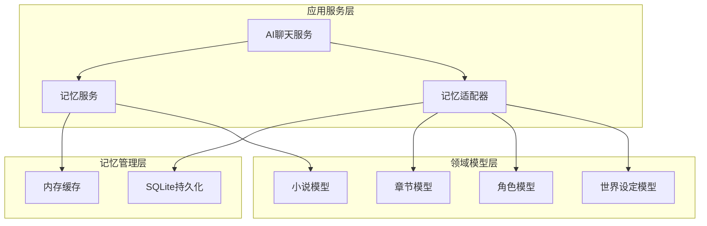
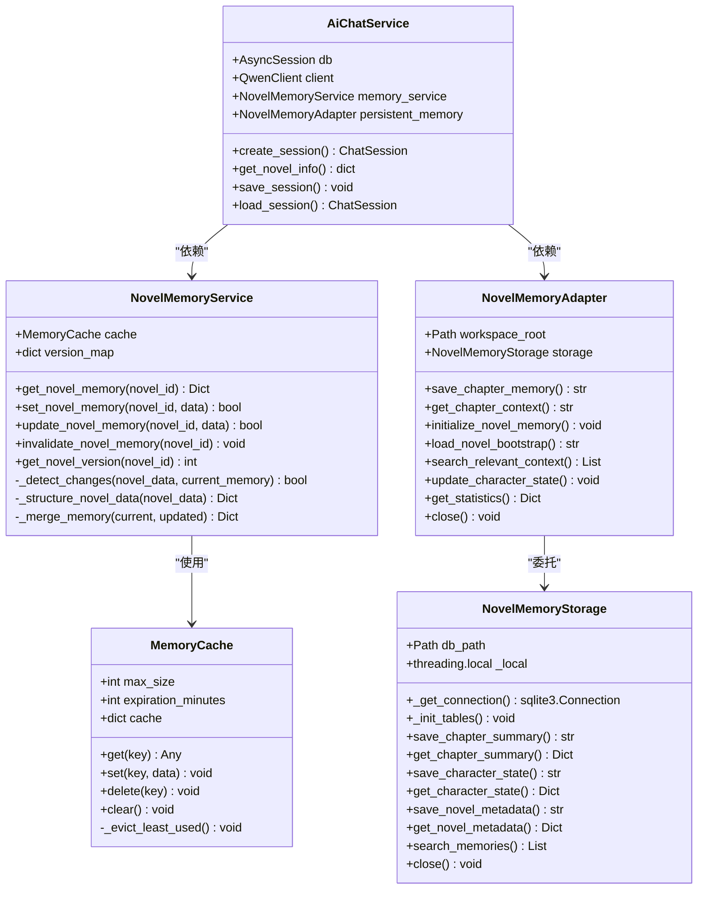
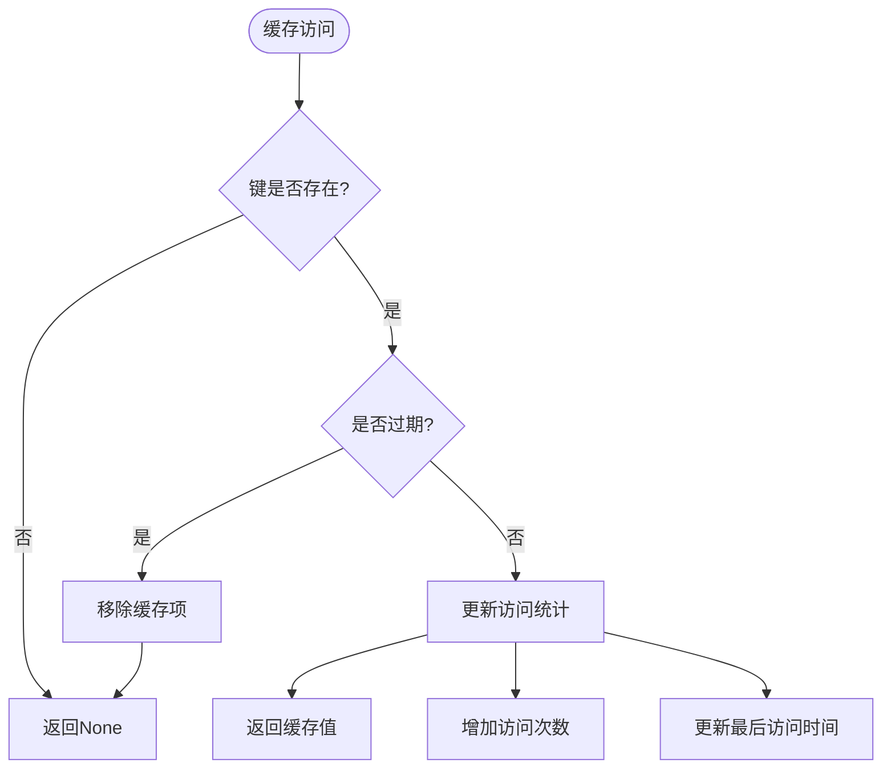
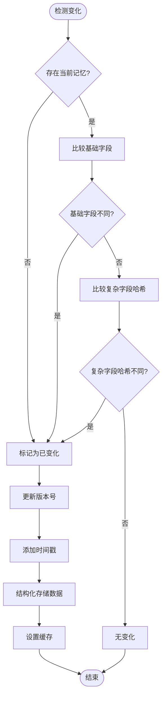
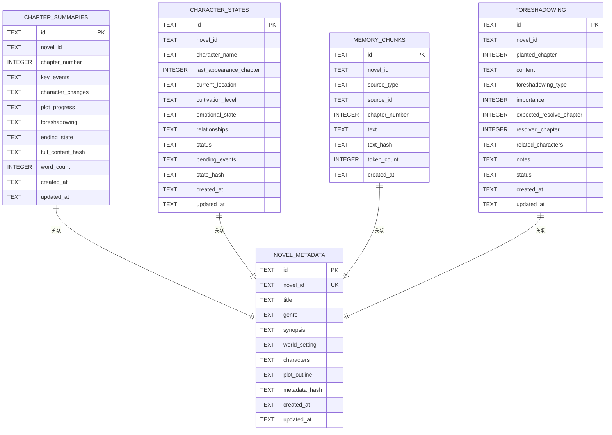
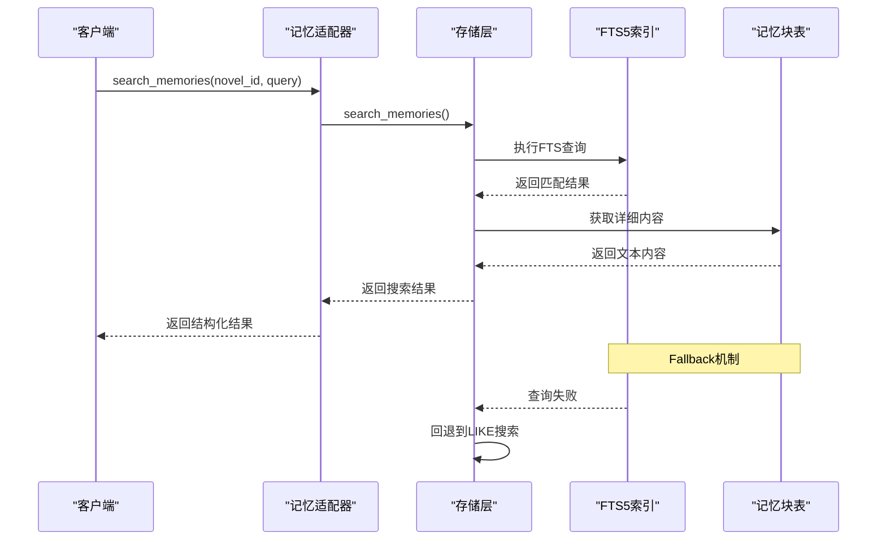
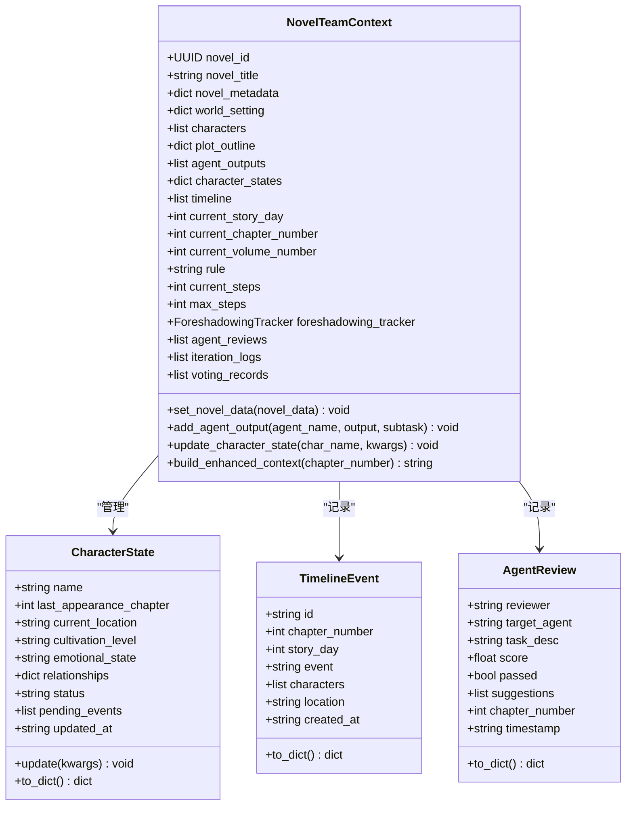
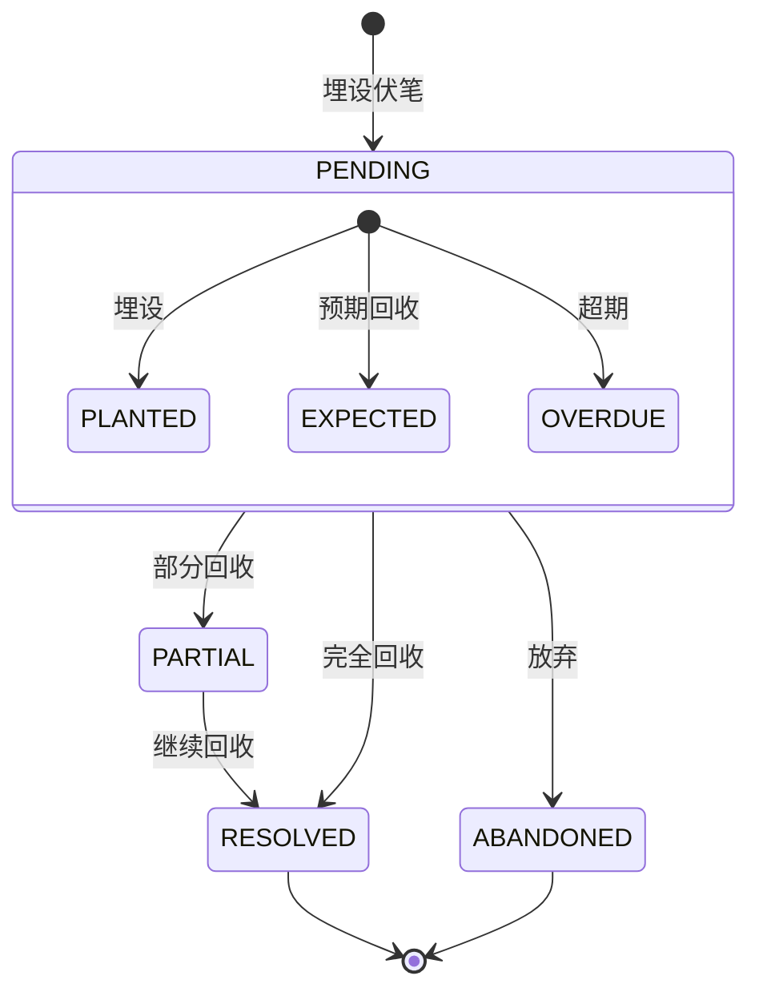
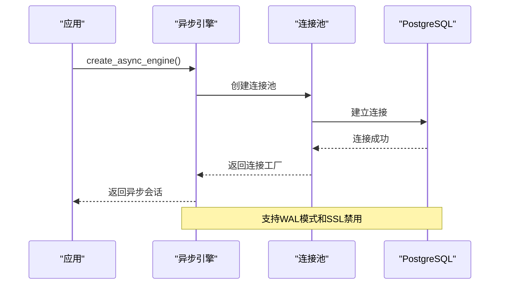
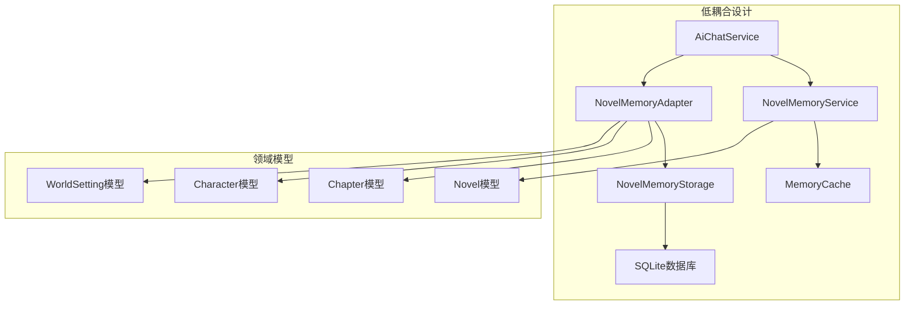

# 持久化记忆系统

<cite>
**本文档引用的文件**
- [backend/services/memory_service.py](file://backend/services/memory_service.py)
- [backend/services/agentmesh_memory_adapter.py](file://backend/services/agentmesh_memory_adapter.py)
- [backend/services/ai_chat_service.py](file://backend/services/ai_chat_service.py)
- [agents/team_context.py](file://agents/team_context.py)
- [agents/foreshadowing_tracker.py](file://agents/foreshadowing_tracker.py)
- [core/database.py](file://core/database.py)
- [backend/config.py](file://backend/config.py)
- [core/models/novel.py](file://core/models/novel.py)
</cite>

## 目录
1. [简介](#简介)
2. [项目结构](#项目结构)
3. [核心组件](#核心组件)
4. [架构总览](#架构总览)
5. [详细组件分析](#详细组件分析)
6. [依赖关系分析](#依赖关系分析)
7. [性能考虑](#性能考虑)
8. [故障排除指南](#故障排除指南)
9. [结论](#结论)

## 简介
本持久化记忆系统旨在为小说生成平台提供跨会话、跨组件的统一记忆能力，解决传统内存缓存30分钟过期导致的内容不连贯问题。系统采用双层记忆架构：内存缓存层（短期记忆）与SQLite持久化层（长期记忆），通过分层存储、内容哈希检测和全文检索技术，实现高效的内容组织、检索与版本控制。

## 项目结构
系统围绕三个核心层次构建：
- **应用服务层**：AI聊天服务、记忆服务、适配器服务
- **记忆管理层**：内存缓存与SQLite持久化存储
- **领域模型层**：小说、章节、角色、世界设定等业务模型

**图表来源**
- [backend/services/ai_chat_service.py](file://backend/services/ai_chat_service.py#L193-L203)
- [backend/services/memory_service.py](file://backend/services/memory_service.py#L74-L79)
- [backend/services/agentmesh_memory_adapter.py](file://backend/services/agentmesh_memory_adapter.py#L922-L936)

**章节来源**
- [backend/services/ai_chat_service.py](file://backend/services/ai_chat_service.py#L1-L800)
- [backend/services/memory_service.py](file://backend/services/memory_service.py#L1-L396)
- [backend/services/agentmesh_memory_adapter.py](file://backend/services/agentmesh_memory_adapter.py#L1-L1181)

## 核心组件
系统包含四大核心组件：

### 1. 内存缓存层（短期记忆）
- **MemoryCache类**：基于LRU算法的内存缓存，支持最大容量控制和过期时间管理
- **NovelMemoryService类**：小说记忆服务，提供分层数据结构和变化检测机制

### 2. SQLite持久化层（长期记忆）
- **NovelMemoryStorage类**：底层存储实现，包含章节摘要、角色状态、元数据等表结构
- **NovelMemoryAdapter类**：高层适配器，提供统一的API接口

### 3. 上下文管理
- **NovelTeamContext类**：团队共享上下文，整合角色状态、时间线、伏笔等信息
- **ForeshadowingTracker类**：伏笔追踪系统，确保情节连贯性

### 4. 数据库集成
- **SQLAlchemy异步引擎**：支持PostgreSQL数据库连接
- **领域模型**：小说、章节、角色等业务实体定义

**章节来源**
- [backend/services/memory_service.py](file://backend/services/memory_service.py#L12-L72)
- [backend/services/agentmesh_memory_adapter.py](file://backend/services/agentmesh_memory_adapter.py#L20-L170)
- [agents/team_context.py](file://agents/team_context.py#L155-L216)
- [agents/foreshadowing_tracker.py](file://agents/foreshadowing_tracker.py#L120-L135)

## 架构总览
系统采用分层架构设计，通过适配器模式实现内存缓存与持久化存储的统一管理。

**图表来源**
- [backend/services/memory_service.py](file://backend/services/memory_service.py#L12-L72)
- [backend/services/memory_service.py](file://backend/services/memory_service.py#L74-L171)
- [backend/services/agentmesh_memory_adapter.py](file://backend/services/agentmesh_memory_adapter.py#L20-L170)
- [backend/services/agentmesh_memory_adapter.py](file://backend/services/agentmesh_memory_adapter.py#L922-L936)
- [backend/services/ai_chat_service.py](file://backend/services/ai_chat_service.py#L193-L203)

## 详细组件分析

### 内存缓存组件分析

#### MemoryCache类设计
内存缓存采用LRU（Least Recently Used）淘汰策略，通过访问次数和最后访问时间双重维度进行缓存淘汰。

**图表来源**
- [backend/services/memory_service.py](file://backend/services/memory_service.py#L20-L35)

#### 变化检测机制
系统实现了多层次的变化检测机制，确保只有在内容真正发生变化时才更新缓存。

**图表来源**
- [backend/services/memory_service.py](file://backend/services/memory_service.py#L92-L131)
- [backend/services/memory_service.py](file://backend/services/memory_service.py#L138-L171)

**章节来源**
- [backend/services/memory_service.py](file://backend/services/memory_service.py#L12-L72)
- [backend/services/memory_service.py](file://backend/services/memory_service.py#L74-L171)

### SQLite持久化组件分析

#### 表结构设计
持久化层采用SQLite + FTS5全文搜索引擎，支持高效的文本检索。

**图表来源**
- [backend/services/agentmesh_memory_adapter.py](file://backend/services/agentmesh_memory_adapter.py#L52-L167)

#### 全文检索实现
系统集成了SQLite的FTS5全文搜索引擎，提供高效的关键词检索功能。

**图表来源**
- [backend/services/agentmesh_memory_adapter.py](file://backend/services/agentmesh_memory_adapter.py#L653-L713)

**章节来源**
- [backend/services/agentmesh_memory_adapter.py](file://backend/services/agentmesh_memory_adapter.py#L47-L170)
- [backend/services/agentmesh_memory_adapter.py](file://backend/services/agentmesh_memory_adapter.py#L653-L770)

### 上下文管理组件分析

#### 团队上下文设计
NovelTeamContext提供了小说生成团队的共享上下文，支持角色状态追踪、时间线管理和伏笔系统集成。

**图表来源**
- [agents/team_context.py](file://agents/team_context.py#L155-L216)
- [agents/team_context.py](file://agents/team_context.py#L32-L78)
- [agents/team_context.py](file://agents/team_context.py#L81-L104)
- [agents/team_context.py](file://agents/team_context.py#L106-L153)

#### 伏笔追踪系统
ForeshadowingTracker实现了完整的伏笔生命周期管理，包括埋设、追踪、回收和统计分析。

**图表来源**
- [agents/foreshadowing_tracker.py](file://agents/foreshadowing_tracker.py#L15-L31)
- [agents/foreshadowing_tracker.py](file://agents/foreshadowing_tracker.py#L136-L163)

**章节来源**
- [agents/team_context.py](file://agents/team_context.py#L155-L431)
- [agents/foreshadowing_tracker.py](file://agents/foreshadowing_tracker.py#L120-L376)

### 数据库集成分析

#### 异步数据库连接
系统使用SQLAlchemy异步引擎连接PostgreSQL数据库，支持高性能的并发操作。

**图表来源**
- [core/database.py](file://core/database.py#L11-L23)
- [backend/config.py](file://backend/config.py#L18-L27)

#### 领域模型设计
小说系统的核心业务模型采用ORM映射，支持复杂的关系查询和级联操作。

**章节来源**
- [core/database.py](file://core/database.py#L1-L36)
- [backend/config.py](file://backend/config.py#L1-L59)
- [core/models/novel.py](file://core/models/novel.py#L37-L66)

## 依赖关系分析

### 组件耦合度分析
系统采用松耦合设计，通过接口抽象实现组件间的解耦：

**图表来源**
- [backend/services/ai_chat_service.py](file://backend/services/ai_chat_service.py#L193-L203)
- [backend/services/memory_service.py](file://backend/services/memory_service.py#L74-L79)
- [backend/services/agentmesh_memory_adapter.py](file://backend/services/agentmesh_memory_adapter.py#L922-L936)

### 外部依赖集成
系统集成了多个外部服务和库：

| 组件 | 依赖 | 版本 | 用途 |
|------|------|------|------|
| LLM客户端 | DashScope/Qwen | 最新 | 大语言模型推理 |
| 数据库 | SQLAlchemy Async | 2.x | 异步数据库操作 |
| 缓存 | Redis | 6.x | 分布式缓存支持 |
| 消息队列 | Celery | 5.x | 异步任务处理 |

**章节来源**
- [backend/services/ai_chat_service.py](file://backend/services/ai_chat_service.py#L12-L14)
- [backend/config.py](file://backend/config.py#L28-L48)

## 性能考虑

### 缓存策略优化
1. **多级缓存架构**：内存缓存提供快速访问，SQLite持久化确保数据持久性
2. **LRU淘汰机制**：智能淘汰策略，平衡内存使用和命中率
3. **内容哈希检测**：避免重复存储相同内容，减少存储空间

### 数据库性能优化
1. **WAL模式**：提升并发读写的性能表现
2. **索引优化**：为常用查询字段建立索引
3. **连接池管理**：合理配置连接池大小，避免资源浪费

### 搜索性能优化
1. **FTS5全文索引**：提供高效的文本检索能力
2. **分页查询**：限制返回结果数量，避免内存溢出
3. **查询优化**：使用bm25评分算法提升搜索质量

## 故障排除指南

### 常见问题及解决方案

#### 1. 缓存失效问题
**症状**：内容频繁刷新，版本号异常增长
**解决方案**：
- 检查内容哈希计算逻辑
- 验证变化检测算法
- 确认缓存过期时间设置

#### 2. 数据库连接问题
**症状**：数据库连接超时或连接池耗尽
**解决方案**：
- 检查连接池配置参数
- 监控数据库负载情况
- 实施连接重试机制

#### 3. 搜索结果异常
**症状**：全文搜索返回空结果或错误数据
**解决方案**：
- 验证FTS5索引完整性
- 检查文本预处理逻辑
- 实施搜索回退机制

**章节来源**
- [backend/services/memory_service.py](file://backend/services/memory_service.py#L12-L72)
- [backend/services/agentmesh_memory_adapter.py](file://backend/services/agentmesh_memory_adapter.py#L653-L770)

## 结论
持久化记忆系统通过双层架构设计，有效解决了小说生成过程中的记忆一致性问题。内存缓存层提供快速响应，SQLite持久化层确保数据持久性，配合全文检索和变化检测机制，实现了高效、可靠的记忆管理。系统的设计充分考虑了可扩展性和维护性，为小说生成平台提供了坚实的技术基础。

未来可以进一步优化的方向包括：引入分布式缓存、实现增量备份、增强搜索算法、扩展多模态内容支持等。这些改进将进一步提升系统的性能和用户体验。