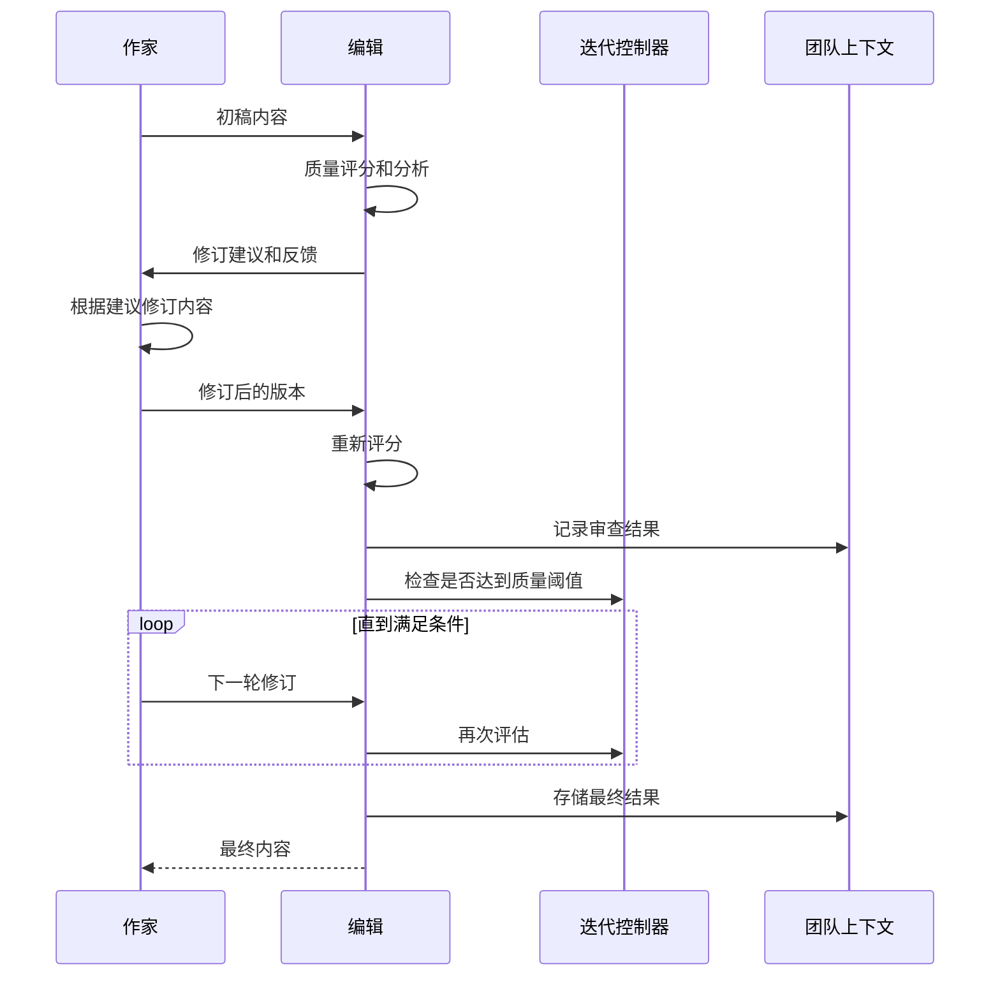
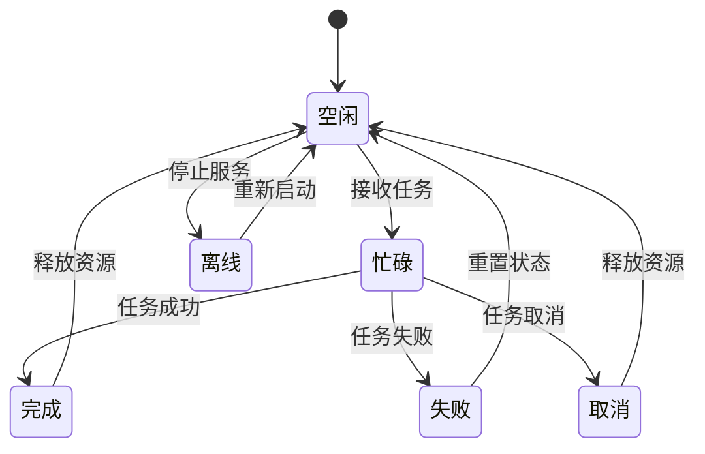
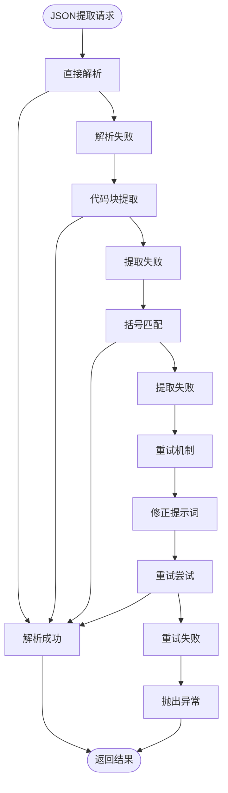
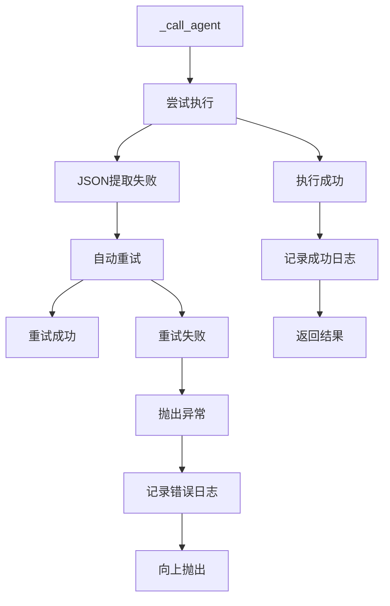
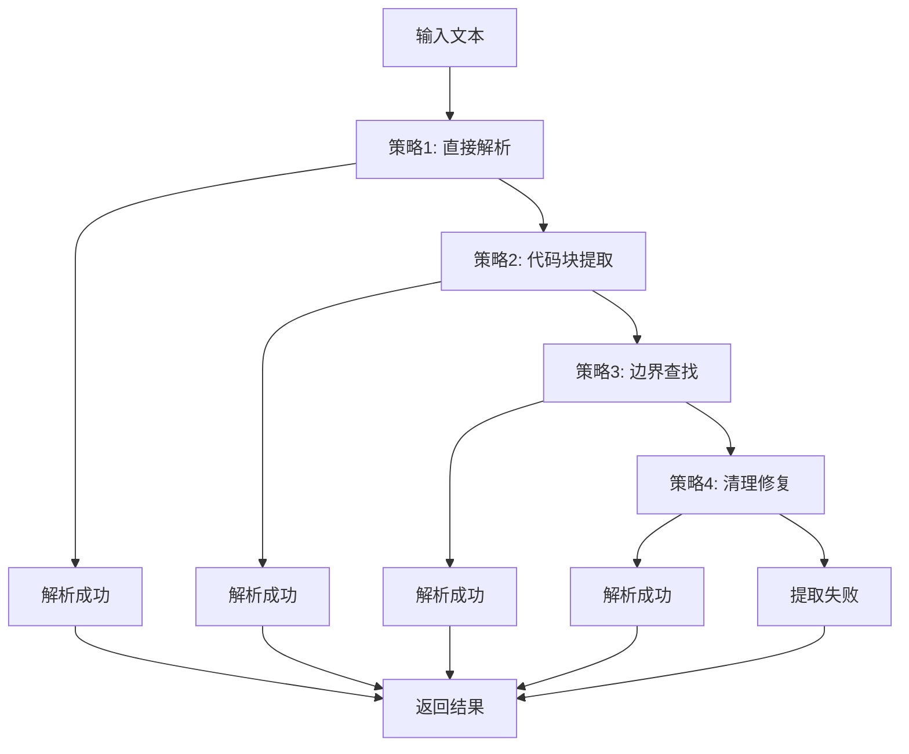
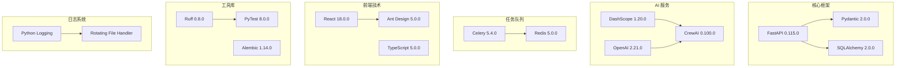

# 小说创作助手系统

<cite>
**本文档中引用的文件**
- [crew_manager.py](file://agents/crew_manager.py)
- [agent_manager.py](file://agents/agent_manager.py)
- [agent_dispatcher.py](file://agents/agent_dispatcher.py)
- [team_context.py](file://agents/team_context.py)
- [qwen_client.py](file://llm/qwen_client.py)
- [cost_tracker.py](file://llm/cost_tracker.py)
- [review_loop.py](file://agents/review_loop.py)
- [voting_manager.py](file://agents/voting_manager.py)
- [agent_scheduler.py](file://agents/agent_scheduler.py)
- [specific_agents.py](file://agents/specific_agents.py)
- [main.py](file://backend/main.py)
- [App.tsx](file://frontend/src/App.tsx)
- [pyproject.toml](file://pyproject.toml)
- [json_extractor.py](file://agents/base/json_extractor.py)
- [agent_query_service.py](file://agents/agent_query_service.py)
- [logging_config.py](file://core/logging_config.py)
</cite>

## 更新摘要
**变更内容**
- 新增JSON提取失败后的自动重试机制，支持修正提示词重试
- 增强的错误处理和日志记录系统
- 改进的Agent调用和成本追踪机制
- 优化的审查反馈循环和连续性检查

## 目录
1. [简介](#简介)
2. [项目结构](#项目结构)
3. [核心组件](#核心组件)
4. [架构概览](#架构概览)
5. [详细组件分析](#详细组件分析)
6. [依赖关系分析](#依赖关系分析)
7. [性能考虑](#性能考虑)
8. [故障排除指南](#故障排除指南)
9. [结论](#结论)

## 简介

小说创作助手系统是一个基于 CrewAI 风格的智能小说生成平台，集成了多个专门的 AI Agent 来协助用户创作高质量的小说作品。该系统采用模块化设计，支持自动化的企划阶段和写作阶段，具备强大的协作机制和质量控制功能。

**重大改进**：系统现已集成先进的JSON提取失败自动重试机制，支持修正提示词重试，以及增强的错误处理和日志记录功能，显著提升了系统的稳定性和可靠性。

系统的核心特色包括：
- **多 Agent 协作**：主题分析师、世界观架构师、角色设计师、情节架构师等专业 Agent
- **智能审查循环**：Writer-Editor 质量驱动的迭代优化机制
- **投票共识机制**：多视角决策的投票系统
- **成本追踪**：详细的 Token 使用量和费用统计
- **团队上下文共享**：Agent 间的信息共享和状态追踪
- **自动重试机制**：JSON提取失败后的智能重试和修正
- **增强日志记录**：全面的错误处理和调试信息

## 项目结构

该项目采用清晰的分层架构设计，主要分为以下几个核心层次：

```mermaid
graph TB
subgraph "前端层"
FE[React 前端应用]
end
subgraph "后端层"
API[FastAPI 应用]
ROUTERS[API 路由器]
end
subgraph "业务逻辑层"
DISPATCHER[Agent 调度器]
CREWMGR[小说 Crew 管理器]
TEAMCTX[团队上下文]
ENDPOINT[错误处理与重试]
end
subgraph "AI 服务层"
QWEN[Qwen 客户端]
COST[成本追踪器]
PROMPT[提示词管理器]
END
subgraph "Agent 层"
SPECIFIC[具体 Agent 实现]
SCHEDULER[Agent 调度系统]
QUERY[查询服务]
END
FE --> API
API --> DISPATCHER
DISPATCHER --> CREWMGR
CREWMGR --> TEAMCTX
CREWMGR --> QWEN
CREWMGR --> COST
CREWMGR --> ENDPOINT
DISPATCHER --> SPECIFIC
DISPATCHER --> SCHEDULER
DISPATCHER --> QUERY
```

**图表来源**
- [main.py](file://backend/main.py#L15-L33)
- [agent_dispatcher.py](file://agents/agent_dispatcher.py#L17-L83)
- [crew_manager.py](file://agents/crew_manager.py#L38-L154)

**章节来源**
- [pyproject.toml](file://pyproject.toml#L1-L64)

## 核心组件

### NovelCrewManager - 小说 Crew 管理器

NovelCrewManager 是系统的核心协调器，负责管理整个小说创作流程。它实现了 CrewAI 风格的直接编排模式，通过 QwenClient 直接调用通义千问模型，而非使用 CrewAI 的内置 LLM 集成。

**主要功能特性：**
- **企划阶段协调**：主题分析、世界观构建、角色设计、情节架构
- **写作阶段管理**：章节策划、内容创作、质量审查、连续性检查
- **协作机制集成**：审查反馈循环、投票共识、请求-应答协商
- **成本追踪**：详细的 Token 使用量和费用统计
- **自动重试机制**：JSON提取失败后的智能重试和修正
- **增强错误处理**：全面的异常捕获和日志记录

**重大改进**：新增了 `_retry_json_extraction` 方法，实现了JSON提取失败后的自动重试机制，支持修正提示词重试，显著提升了系统的稳定性。

**章节来源**
- [crew_manager.py](file://agents/crew_manager.py#L38-L154)

### AgentDispatcher - Agent 调度器

AgentDispatcher 负责在不同 Agent 实现之间进行调度，提供灵活的执行模式选择。它支持两种执行模式：基于调度器的 Agent 系统和 CrewAI 风格系统。

**核心功能：**
- **模式切换**：动态选择基于调度器的 Agent 系统或 CrewAI 风格系统
- **任务执行**：协调企划阶段和写作阶段的任务执行
- **批量处理**：支持批量章节的自动化生成
- **状态监控**：实时监控所有 Agent 的运行状态

**章节来源**
- [agent_dispatcher.py](file://agents/agent_dispatcher.py#L17-L83)

### NovelTeamContext - 团队上下文

NovelTeamContext 实现了 Agent 之间的信息共享和状态追踪，借鉴了 AgentMesh 的设计理念。它提供了完整的小说创作过程中的上下文管理能力。

**主要特性：**
- **Agent 输出历史**：记录所有 Agent 的输出和交互
- **角色状态管理**：追踪主要角色的状态变化
- **时间线追踪**：维护故事的时间线和关键事件
- **审查反馈记录**：保存质量审查和投票的结果
- **迭代日志**：记录 Writer-Editor 循环的详细过程

**章节来源**
- [team_context.py](file://agents/team_context.py#L155-L216)

## 架构概览

系统采用分层架构设计，确保了良好的模块化和可扩展性：

```mermaid
graph TB
subgraph "表现层"
UI[前端 React 应用]
API[后端 FastAPI 接口]
end
subgraph "业务逻辑层"
AD[Agent 调度器]
CM[小说 Crew 管理器]
TC[团队上下文]
ER[错误重试处理]
END
subgraph "AI 服务层"
QC[Qwen 客户端]
CT[成本追踪器]
PM[提示词管理器]
JE[JSON提取器]
AQ[查询服务]
END
subgraph "Agent 层"
MA[市场分析 Agent]
CA[内容策划 Agent]
WA[写作 Agent]
EA[编辑 Agent]
PA[发布 Agent]
AS[Agent 调度系统]
END
UI --> API
API --> AD
AD --> CM
CM --> TC
CM --> QC
CM --> CT
CM --> ER
CM --> JE
CM --> AQ
AD --> MA
AD --> CA
AD --> WA
AD --> EA
AD --> PA
AD --> AS
```

**图表来源**
- [agent_dispatcher.py](file://agents/agent_dispatcher.py#L105-L358)
- [crew_manager.py](file://agents/crew_manager.py#L286-L547)
- [agent_scheduler.py](file://agents/agent_scheduler.py#L222-L488)

## 详细组件分析

### 审查反馈循环系统

审查反馈循环是系统质量保证的核心机制，实现了 Writer-Editor 的智能协作：



**图表来源**
- [review_loop.py](file://agents/review_loop.py#L113-L263)
- [crew_manager.py](file://agents/crew_manager.py#L753-L775)

**章节来源**
- [review_loop.py](file://agents/review_loop.py#L91-L263)

### 投票共识机制

投票共识机制允许多个 Agent 从不同专业视角对关键决策进行投票，通过加权置信度计算获胜方案：


**图表来源**
- [voting_manager.py](file://agents/voting_manager.py#L85-L140)
- [voting_manager.py](file://agents/voting_manager.py#L173-L211)

**章节来源**
- [voting_manager.py](file://agents/voting_manager.py#L74-L236)

### Agent 调度系统

Agent 调度系统提供了完整的任务管理和 Agent 生命周期管理：



**图表来源**
- [agent_scheduler.py](file://agents/agent_scheduler.py#L13-L37)
- [agent_scheduler.py](file://agents/agent_scheduler.py#L222-L488)

**章节来源**
- [agent_scheduler.py](file://agents/agent_scheduler.py#L222-L488)

### JSON提取失败自动重试机制

**重大改进**：系统新增了智能的JSON提取失败自动重试机制，显著提升了系统的稳定性。



**图表来源**
- [crew_manager.py](file://agents/crew_manager.py#L155-L221)
- [crew_manager.py](file://agents/crew_manager.py#L292-L337)

**章节来源**
- [crew_manager.py](file://agents/crew_manager.py#L155-L221)
- [crew_manager.py](file://agents/crew_manager.py#L292-L337)

### 增强的错误处理和日志记录

系统实现了全面的错误处理和日志记录机制：



**图表来源**
- [crew_manager.py](file://agents/crew_manager.py#L248-L291)

**章节来源**
- [crew_manager.py](file://agents/crew_manager.py#L248-L291)

### JSON提取器增强功能

系统还提供了独立的JSON提取器组件，支持多种提取策略和错误处理：



**图表来源**
- [json_extractor.py](file://agents/base/json_extractor.py#L100-L157)

**章节来源**
- [json_extractor.py](file://agents/base/json_extractor.py#L16-L235)

## 依赖关系分析

系统采用了现代化的 Python 技术栈，主要依赖包括：



**图表来源**
- [pyproject.toml](file://pyproject.toml#L8-L36)

**章节来源**
- [pyproject.toml](file://pyproject.toml#L1-L64)

## 性能考虑

系统在设计时充分考虑了性能优化和资源管理：

### Token 使用优化
- **成本追踪**：实时监控每个 Agent 的 Token 使用量
- **定价策略**：支持多种模型的定价模式（qwen-plus、qwen-turbo、qwen-max）
- **章节成本统计**：按章节维度追踪和分析成本

### 并发处理
- **异步编程**：广泛使用 asyncio 实现非阻塞 I/O
- **并行投票**：多 Agent 投票的并发执行
- **流式输出**：支持 LLM 的流式响应处理

### 缓存和状态管理
- **上下文压缩**：章节内容的智能压缩和缓存
- **状态持久化**：团队上下文的序列化和恢复
- **任务队列**：基于 Redis 的分布式任务队列

### 自动重试优化
- **智能重试策略**：JSON提取失败后的自动重试机制
- **修正提示词**：使用专门的修正提示词重试
- **成本追踪**：重试操作的成本独立追踪
- **日志记录**：详细的重试过程日志

## 故障排除指南

### 常见问题及解决方案

**LLM API 调用失败**
- 检查 DashScope API 密钥配置
- 验证网络连接和代理设置
- 查看重试机制的日志信息

**Agent 调度异常**
- 确认 Agent 状态机的正确转换
- 检查任务依赖关系的完整性
- 验证消息通信系统的正常运行

**内存泄漏问题**
- 监控团队上下文的大小增长
- 定期清理过期的 Agent 输出
- 实施适当的缓存淘汰策略

**章节生成性能问题**
- 调整温度参数和最大 token 数
- 优化提示词模板的复杂度
- 实施分批处理和增量生成

**JSON提取失败问题**
- **新增**：系统现在具备自动重试机制，会尝试多种提取策略
- 检查 LLM 输出格式是否符合预期
- 查看重试日志以确定失败原因
- 验证修正提示词的有效性

**章节生成稳定性问题**
- **新增**：增强的错误处理和日志记录
- 监控重试次数和成功率
- 检查成本追踪的准确性
- 验证审查循环的收敛性

**JSON提取器使用问题**
- **新增**：独立的JSON提取器组件提供多种提取策略
- 使用 `JsonExtractor.extract_json()` 方法进行安全提取
- 利用 `safe_extract()` 方法获取默认值
- 检查输入文本格式和编码

**章节来源**
- [qwen_client.py](file://llm/qwen_client.py#L46-L161)
- [agent_scheduler.py](file://agents/agent_scheduler.py#L324-L379)
- [crew_manager.py](file://agents/crew_manager.py#L292-L337)
- [json_extractor.py](file://agents/base/json_extractor.py#L192-L216)

## 结论

小说创作助手系统是一个功能完整、架构清晰的智能创作平台。通过模块化的 Agent 设计和强大的协作机制，系统能够为用户提供从创意构思到内容发布的全流程支持。

**主要优势：**
- **高度模块化**：清晰的职责分离和接口设计
- **智能协作**：多 Agent 间的高效协同工作
- **质量保证**：完善的审查和优化机制
- **成本控制**：透明的 Token 使用和费用追踪
- **可扩展性**：灵活的架构支持功能扩展
- **稳定性提升**：新增的自动重试和错误处理机制
- **可观测性增强**：全面的日志记录和调试支持
- **JSON提取增强**：独立的JSON提取器提供多种策略

**重大改进总结：**
- **JSON提取重试机制**：显著提升系统在复杂输出场景下的稳定性
- **智能修正提示词**：通过专门的提示词引导 LLM 产生合规输出
- **增强错误处理**：全面的异常捕获和日志记录
- **成本追踪优化**：重试操作的独立成本追踪
- **调试能力提升**：详细的重试过程和错误信息记录
- **独立JSON提取器**：提供多种提取策略和安全提取方法

**未来发展方向：**
- 增强个性化定制功能
- 优化移动端用户体验
- 扩展多语言支持
- 集成更多创作工具和服务
- 进一步优化重试策略和成本控制
- 增强JSON提取器的智能化程度

该系统为 AI 辅助内容创作提供了优秀的实践范例，具有良好的商业应用前景和技术推广价值。新增的自动重试机制和增强的错误处理功能使其在生产环境中更加可靠和易于维护。