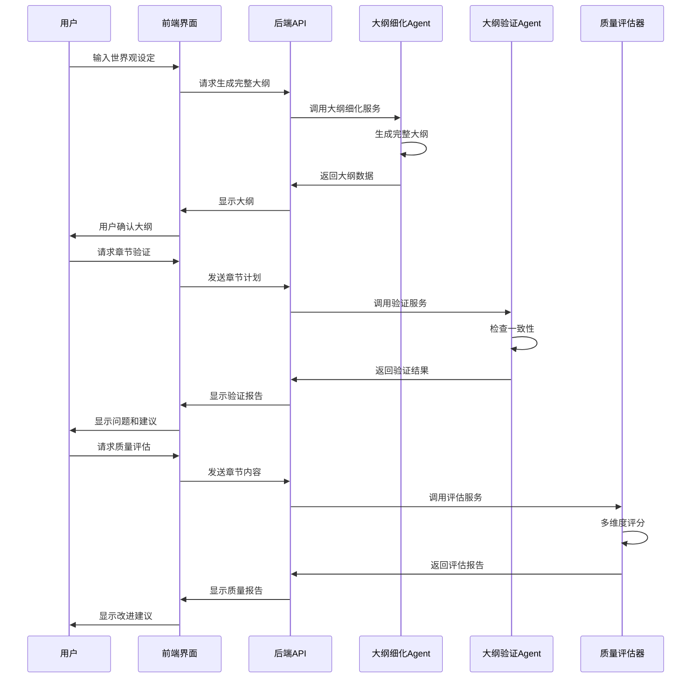
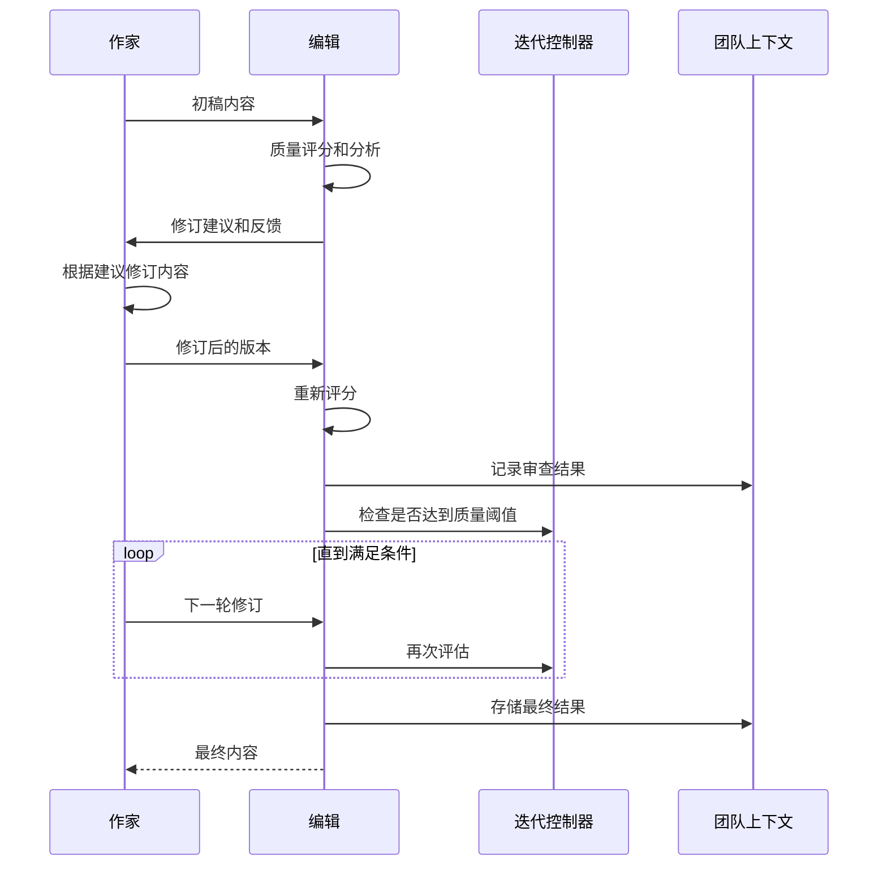
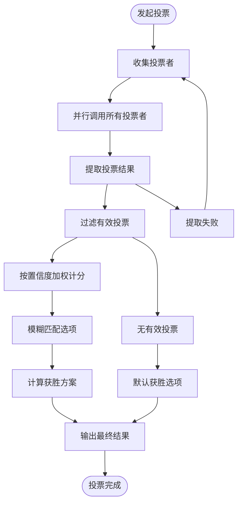
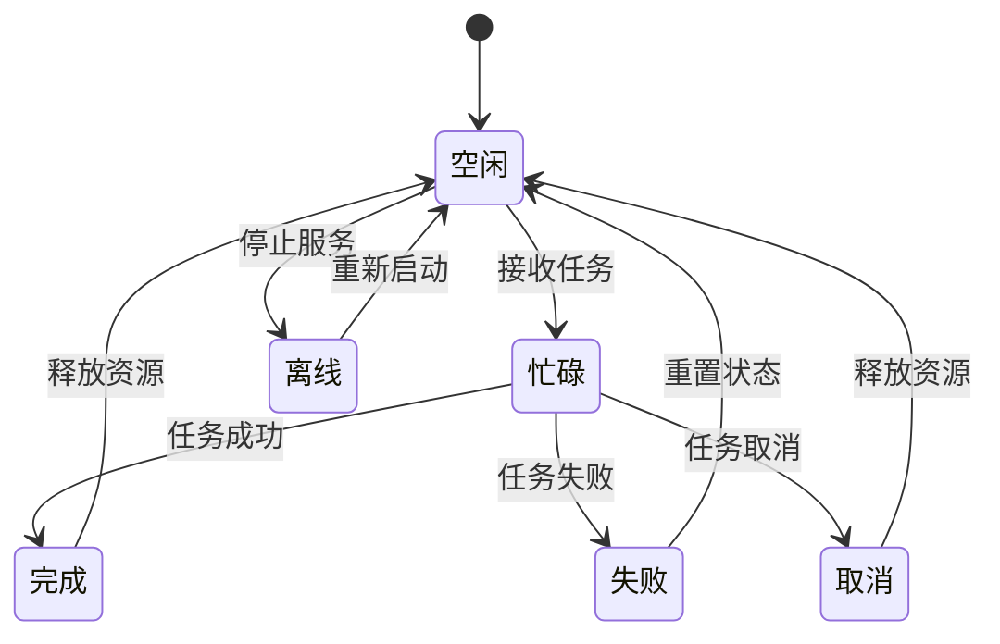
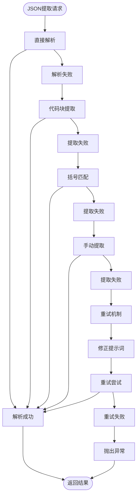
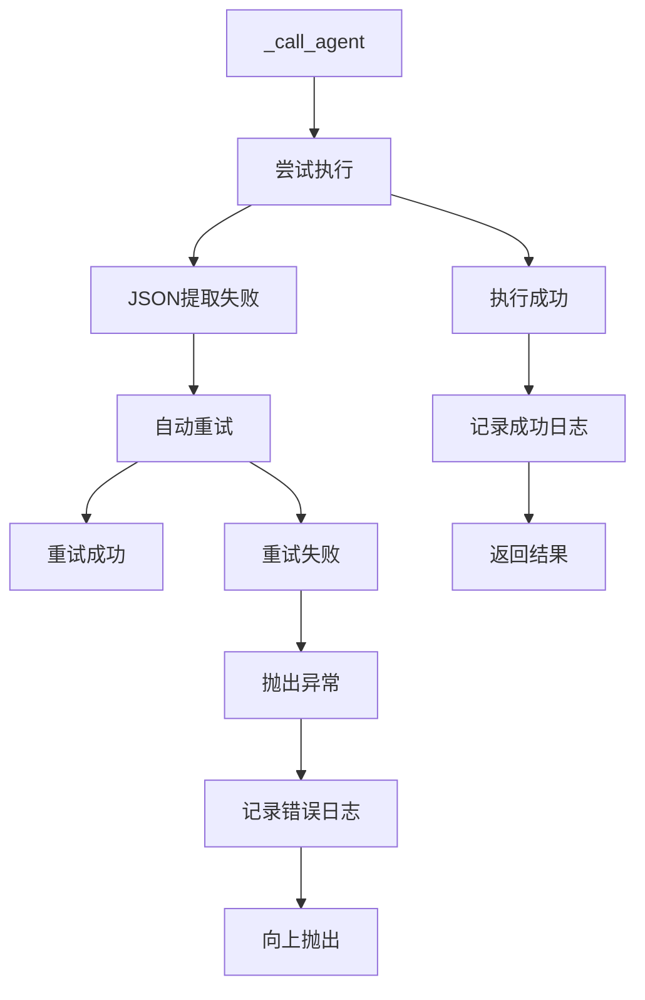
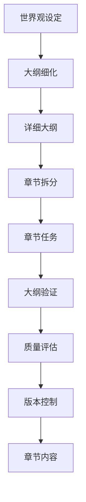
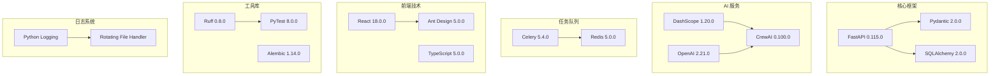

# 小说创作助手系统

<cite>
**本文档中引用的文件**
- [crew_manager.py](file://agents/crew_manager.py)
- [agent_manager.py](file://agents/agent_manager.py)
- [agent_dispatcher.py](file://agents/agent_dispatcher.py)
- [team_context.py](file://agents/team_context.py)
- [qwen_client.py](file://llm/qwen_client.py)
- [cost_tracker.py](file://llm/cost_tracker.py)
- [review_loop.py](file://agents/review_loop.py)
- [voting_manager.py](file://agents/voting_manager.py)
- [agent_scheduler.py](file://agents/agent_scheduler.py)
- [agent_query_service.py](file://agents/agent_query_service.py)
- [main.py](file://backend/main.py)
- [App.tsx](file://frontend/src/App.tsx)
- [pyproject.toml](file://pyproject.toml)
- [json_extractor.py](file://agents/base/json_extractor.py)
- [logging_config.py](file://core/logging_config.py)
- [review_result.py](file://agents/base/review_result.py)
- [quality_report.py](file://agents/base/quality_report.py)
- [review_loop_base.py](file://agents/base/review_loop_base.py)
- [outline_refiner.py](file://agents/outline_refiner.py)
- [quality_evaluator.py](file://agents/quality_evaluator.py)
- [outline_validator.py](file://agents/outline_validator.py)
- [outlines.py](file://backend/api/v1/outlines.py)
- [plot_outline.py](file://core/models/plot_outline.py)
- [outline.py](file://backend/schemas/outline.py)
- [OutlineRefinementTab.tsx](file://frontend/src/pages/NovelDetail/OutlineRefinementTab.tsx)
- [outlines.ts](file://frontend/src/api/outlines.ts)
- [add_outline_enhancements_to_chapters.py](file://alembic/versions/add_outline_enhancements_to_chapters.py)
- [2a4218cba9df_add_detailed_outline_to_chapters.py](file://alembic/versions/2a4218cba9df_add_detailed_outline_to_chapters.py)
</cite>

## 更新摘要
**变更内容**
- 新增大纲细化和验证系统，包括 OutlineRefiner、OutlineValidator 和 QualityEvaluator 三大核心组件
- 增强JSON解析韧性，新增多种提取策略和错误处理机制
- 改进质量评估系统，支持多维度评分和智能修订建议
- 完善章节大纲管理，支持详细大纲、验证和版本控制
- 新增前端大纲精炼界面和API端点

## 目录
1. [简介](#简介)
2. [项目结构](#项目结构)
3. [核心组件](#核心组件)
4. [架构概览](#架构概览)
5. [详细组件分析](#详细组件分析)
6. [依赖关系分析](#依赖关系分析)
7. [性能考虑](#性能考虑)
8. [故障排除指南](#故障排除指南)
9. [结论](#结论)

## 简介

小说创作助手系统是一个基于 CrewAI 风格的智能小说生成平台，集成了多个专门的 AI Agent 来协助用户创作高质量的小说作品。该系统采用模块化设计，支持自动化的企划阶段和写作阶段，具备强大的协作机制和质量控制功能。

**重大改进**：系统现已集成全新的一系列大纲管理功能，包括大纲细化、验证和质量评估三大核心组件，显著增强了小说创作流程的完整性和可控性。

系统的核心特色包括：
- **多 Agent 协作**：主题分析师、世界观架构师、角色设计师、情节架构师等专业 Agent
- **智能审查循环**：Writer-Editor 质量驱动的迭代优化机制
- **投票共识机制**：多视角决策的投票系统
- **成本追踪**：详细的 Token 使用量和费用统计
- **团队上下文共享**：Agent 间的信息共享和状态追踪
- **自动重试机制**：JSON提取失败后的智能重试和修正
- **增强日志记录**：全面的错误处理和调试信息
- **稳健数据验证**：多层数据验证和降级处理机制
- **大纲精细化管理**：完整的创作流程管理体系
- **智能质量评估**：多维度内容质量评分系统
- **章节一致性验证**：严格的创作质量保证机制

## 项目结构

该项目采用清晰的分层架构设计，主要分为以下几个核心层次：

```mermaid
graph TB
subgraph "前端层"
FE[React 前端应用]
OUTLINETAB[大纲精炼界面]
end
subgraph "后端层"
API[FastAPI 应用]
ROUTERS[API 路由器]
OUTLINEAPI[大纲管理API]
end
subgraph "业务逻辑层"
DISPATCHER[Agent 调度器]
CREWMGR[小说 Crew 管理器]
TEAMCTX[团队上下文]
ENDPOINT[错误处理与重试]
END
subgraph "AI 服务层"
QWEN[Qwen 客户端]
COST[成本追踪器]
PROMPT[提示词管理器]
JSON[JSON提取器]
AQ[查询服务]
END
subgraph "Agent 层"
SPECIFIC[具体 Agent 实现]
SCHEDULER[Agent 调度系统]
QUERY[查询服务]
OUTLINEREFINER[大纲细化 Agent]
OUTLINEVALIDATOR[大纲验证 Agent]
QUALITYEVALUATOR[质量评估器]
END
FE --> API
API --> OUTLINETAB
OUTLINETAB --> OUTLINEAPI
OUTLINEAPI --> DISPATCHER
DISPATCHER --> CREWMGR
CREWMGR --> TEAMCTX
CREWMGR --> QWEN
CREWMGR --> COST
CREWMGR --> ENDPOINT
DISPATCHER --> SPECIFIC
DISPATCHER --> SCHEDULER
DISPATCHER --> QUERY
DISPATCHER --> OUTLINEREFINER
DISPATCHER --> OUTLINEVALIDATOR
DISPATCHER --> QUALITYEVALUATOR
```

**图表来源**
- [main.py:15-33](file://backend/main.py#L15-L33)
- [agent_dispatcher.py:17-83](file://agents/agent_dispatcher.py#L17-L83)
- [crew_manager.py:38-154](file://agents/crew_manager.py#L38-L154)
- [OutlineRefinementTab.tsx:53-86](file://frontend/src/pages/NovelDetail/OutlineRefinementTab.tsx#L53-L86)

**章节来源**
- [pyproject.toml:1-64](file://pyproject.toml#L1-L64)

## 核心组件

### NovelCrewManager - 小说 Crew 管理器

NovelCrewManager 是系统的核心协调器，负责管理整个小说创作流程。它实现了 CrewAI 风格的直接编排模式，通过 QwenClient 直接调用通义千问模型，而非使用 CrewAI 的内置 LLM 集成。

**主要功能特性：**
- **企划阶段协调**：主题分析、世界观构建、角色设计、情节架构
- **写作阶段管理**：章节策划、内容创作、质量审查、连续性检查
- **协作机制集成**：审查反馈循环、投票共识、请求-应答协商
- **成本追踪**：详细的 Token 使用量和费用统计
- **自动重试机制**：JSON提取失败后的智能重试和修正
- **增强错误处理**：全面的异常捕获和日志记录

**重大改进**：新增了 `_retry_json_extraction` 方法，实现了JSON提取失败后的自动重试机制，支持修正提示词重试，显著提升了系统的稳定性。

**章节来源**
- [crew_manager.py:38-154](file://agents/crew_manager.py#L38-L154)

### AgentDispatcher - Agent 调度器

AgentDispatcher 负责在不同 Agent 实现之间进行调度，提供灵活的执行模式选择。它支持两种执行模式：基于调度器的 Agent 系统和 CrewAI 风格系统。

**核心功能：**
- **模式切换**：动态选择基于调度器的 Agent 系统或 CrewAI 风格系统
- **任务执行**：协调企划阶段和写作阶段的任务执行
- **批量处理**：支持批量章节的自动化生成
- **状态监控**：实时监控所有 Agent 的运行状态

**章节来源**
- [agent_dispatcher.py:17-83](file://agents/agent_dispatcher.py#L17-L83)

### NovelTeamContext - 团队上下文

NovelTeamContext 实现了 Agent 之间的信息共享和状态追踪，借鉴了 AgentMesh 的设计理念。它提供了完整的小说创作过程中的上下文管理能力。

**主要特性：**
- **Agent 输出历史**：记录所有 Agent 的输出和交互
- **角色状态管理**：追踪主要角色的状态变化
- **时间线追踪**：维护故事的时间线和关键事件
- **审查反馈记录**：保存质量审查和投票的结果
- **迭代日志**：记录 Writer-Editor 循环的详细过程

**章节来源**
- [team_context.py:155-216](file://agents/team_context.py#L155-L216)

### OutlineRefiner - 大纲细化 Agent

OutlineRefiner 是系统新增的核心组件，专门负责小说大纲的细化和完善工作。它能够基于世界观设定生成完整的创作大纲，包括主线剧情、支线剧情、卷级大纲等。

**主要功能：**
- **完整大纲细化**：生成包含主线、支线、卷大纲的完整大纲
- **详细主线剧情**：基于世界观设定生成详细的主线剧情
- **卷大纲生成**：设计带张力循环的卷级大纲
- **结局连贯性检查**：确保主线剧情和卷大纲的结局逻辑连贯

**章节来源**
- [outline_refiner.py:18-705](file://agents/outline_refiner.py#L18-L705)

### QualityEvaluator - 质量评估器

QualityEvaluator 是全新的质量评估组件，专门负责对章节内容进行多维度质量评分和分析。

**主要功能：**
- **多维度评分**：对语言流畅度、情节逻辑、角色一致性、节奏把控、爽感设计等维度进行评分
- **智能修订建议**：基于评估结果提供具体的改进建议
- **质量阈值判断**：根据预设阈值判断内容是否通过质量标准
- **异常容错处理**：在评估失败时提供默认通过的降级方案

**章节来源**
- [quality_evaluator.py:83-219](file://agents/quality_evaluator.py#L83-L219)

### OutlineValidator - 大纲验证 Agent

OutlineValidator 是系统新增的大纲一致性验证组件，负责检查章节内容与大纲设定的一致性。

**主要功能：**
- **章节一致性验证**：检查章节计划是否符合大纲要求
- **角色一致性检查**：验证章节中的角色行为、性格、能力是否与设定一致
- **剧情连贯性检查**：确保章节与之前章节的剧情逻辑严密
- **世界观一致性检查**：验证内容是否符合世界观设定
- **改进建议生成**：基于验证发现的问题提供具体的改进建议

**章节来源**
- [outline_validator.py:19-832](file://agents/outline_validator.py#L19-L832)

## 架构概览

系统采用分层架构设计，确保了良好的模块化和可扩展性：

```mermaid
graph TB
subgraph "表现层"
UI[前端 React 应用]
OUTLINETAB[大纲精炼界面]
API[后端 FastAPI 接口]
end
subgraph "业务逻辑层"
AD[Agent 调度器]
CM[小说 Crew 管理器]
TC[团队上下文]
ER[错误重试处理]
END
subgraph "AI 服务层"
QC[Qwen 客户端]
CT[成本追踪器]
PM[提示词管理器]
JE[JSON提取器]
AQ[查询服务]
END
subgraph "Agent 层"
MA[市场分析 Agent]
CA[内容策划 Agent]
WA[写作 Agent]
EA[编辑 Agent]
PA[发布 Agent]
AS[Agent 调度系统]
OR[大纲细化 Agent]
OVD[大纲验证 Agent]
QE[质量评估器]
END
UI --> API
API --> OUTLINETAB
OUTLINETAB --> AD
AD --> CM
CM --> TC
CM --> QC
CM --> CT
CM --> ER
CM --> JE
CM --> AQ
CM --> OR
CM --> OVD
CM --> QE
AD --> MA
AD --> CA
AD --> WA
AD --> EA
AD --> PA
AD --> AS
```

**图表来源**
- [agent_dispatcher.py:105-358](file://agents/agent_dispatcher.py#L105-L358)
- [crew_manager.py:286-547](file://agents/crew_manager.py#L286-L547)
- [agent_scheduler.py:222-488](file://agents/agent_scheduler.py#L222-L488)
- [OutlineRefinementTab.tsx:209-314](file://frontend/src/pages/NovelDetail/OutlineRefinementTab.tsx#L209-L314)

## 详细组件分析

### 大纲精细化管理系统

系统新增的大纲精细化管理是本次更新的核心功能，提供了从大纲生成到章节验证的完整流程：



**图表来源**
- [outline_refiner.py:31-84](file://agents/outline_refiner.py#L31-L84)
- [outline_validator.py:32-77](file://agents/outline_validator.py#L32-L77)
- [quality_evaluator.py:96-149](file://agents/quality_evaluator.py#L96-L149)
- [OutlineRefinementTab.tsx:138-187](file://frontend/src/pages/NovelDetail/OutlineRefinementTab.tsx#L138-L187)

**章节来源**
- [outline_refiner.py:31-223](file://agents/outline_refiner.py#L31-L223)
- [outline_validator.py:32-214](file://agents/outline_validator.py#L32-L214)
- [quality_evaluator.py:96-149](file://agents/quality_evaluator.py#L96-L149)

### 审查反馈循环系统

审查反馈循环是系统质量保证的核心机制，实现了 Writer-Editor 的智能协作：



**图表来源**
- [review_loop.py:113-263](file://agents/review_loop.py#L113-L263)
- [crew_manager.py:753-775](file://agents/crew_manager.py#L753-L775)

**章节来源**
- [review_loop.py:91-263](file://agents/review_loop.py#L91-L263)

### 投票共识机制

投票共识机制允许多个 Agent 从不同专业视角对关键决策进行投票，通过加权置信度计算获胜方案：



**图表来源**
- [voting_manager.py:85-140](file://agents/voting_manager.py#L85-L140)
- [voting_manager.py:173-211](file://agents/voting_manager.py#L173-L211)

**章节来源**
- [voting_manager.py:74-236](file://agents/voting_manager.py#L74-L236)

### Agent 调度系统

Agent 调度系统提供了完整的任务管理和 Agent 生命周期管理：



**图表来源**
- [agent_scheduler.py:13-37](file://agents/agent_scheduler.py#L13-L37)
- [agent_scheduler.py:222-488](file://agents/agent_scheduler.py#L222-L488)

**章节来源**
- [agent_scheduler.py:222-488](file://agents/agent_scheduler.py#L222-L488)

### 增强的JSON提取和解析系统

**重大改进**：系统新增了智能的JSON提取失败自动重试机制，显著提升了系统的稳定性。



**图表来源**
- [crew_manager.py:155-221](file://agents/crew_manager.py#L155-L221)
- [crew_manager.py:292-337](file://agents/crew_manager.py#L292-L337)
- [outline_refiner.py:601-705](file://agents/outline_refiner.py#L601-L705)
- [outline_validator.py:691-800](file://agents/outline_validator.py#L691-L800)
- [quality_evaluator.py:192-219](file://agents/quality_evaluator.py#L192-L219)

**章节来源**
- [crew_manager.py:155-221](file://agents/crew_manager.py#L155-L221)
- [crew_manager.py:292-337](file://agents/crew_manager.py#L292-L337)
- [outline_refiner.py:601-705](file://agents/outline_refiner.py#L601-L705)
- [outline_validator.py:691-800](file://agents/outline_validator.py#L691-L800)
- [quality_evaluator.py:192-219](file://agents/quality_evaluator.py#L192-L219)

### 增强的错误处理和日志记录

系统实现了全面的错误处理和日志记录机制：



**图表来源**
- [crew_manager.py:248-291](file://agents/crew_manager.py#L248-L291)

**章节来源**
- [crew_manager.py:248-291](file://agents/crew_manager.py#L248-L291)

### 服务层整体改进

**重大改进**：服务层经过整体优化，包括更好的错误传播、增强的日志功能和更稳健的数据验证。

#### 错误传播机制优化
- **分层错误处理**：从底层API调用到上层业务逻辑的完整错误链路
- **异常类型区分**：区分网络错误、解析错误、业务逻辑错误
- **错误信息保留**：在传播过程中保留原始错误的详细信息
- **降级策略**：在关键路径失败时提供合理的降级方案

#### 日志功能增强
- **结构化日志**：统一的日志格式和字段结构
- **级别分类**：DEBUG/INFO/WARNING/ERROR/FATAL 等详细级别
- **上下文追踪**：支持跨组件的日志关联和追踪
- **性能指标**：集成性能监控和耗时统计

#### 数据验证强化
- **输入验证**：对所有外部输入进行严格验证
- **输出校验**：对LLM输出进行格式和内容验证
- **降级处理**：在验证失败时提供安全的降级方案
- **回滚机制**：支持关键操作的回滚和恢复

**章节来源**
- [logging_config.py:1-55](file://core/logging_config.py#L1-L55)
- [quality_report.py:14-42](file://agents/base/quality_report.py#L14-L42)
- [review_loop_base.py:575-626](file://agents/base/review_loop_base.py#L575-L626)

### 章节大纲管理系统

系统新增了完整的章节大纲管理功能，支持详细的大纲配置、验证和版本控制：



**图表来源**
- [plot_outline.py:11-43](file://core/models/plot_outline.py#L11-L43)
- [outline.py:73-126](file://backend/schemas/outline.py#L73-L126)
- [add_outline_enhancements_to_chapters.py:22-35](file://alembic/versions/add_outline_enhancements_to_chapters.py#L22-L35)
- [2a4218cba9df_add_detailed_outline_to_chapters.py:22-27](file://alembic/versions/2a4218cba9df_add_detailed_outline_to_chapters.py#L22-L27)

**章节来源**
- [plot_outline.py:11-43](file://core/models/plot_outline.py#L11-L43)
- [outline.py:73-271](file://backend/schemas/outline.py#L73-L271)
- [add_outline_enhancements_to_chapters.py:22-35](file://alembic/versions/add_outline_enhancements_to_chapters.py#L22-L35)
- [2a4218cba9df_add_detailed_outline_to_chapters.py:22-27](file://alembic/versions/2a4218cba9df_add_detailed_outline_to_chapters.py#L22-L27)

## 依赖关系分析

系统采用了现代化的 Python 技术栈，主要依赖包括：



**图表来源**
- [pyproject.toml:8-36](file://pyproject.toml#L8-L36)

**章节来源**
- [pyproject.toml:1-64](file://pyproject.toml#L1-L64)

## 性能考虑

系统在设计时充分考虑了性能优化和资源管理：

### Token 使用优化
- **成本追踪**：实时监控每个 Agent 的 Token 使用量
- **定价策略**：支持多种模型的定价模式（qwen-plus、qwen-turbo、qwen-max）
- **章节成本统计**：按章节维度追踪和分析成本

### 并发处理
- **异步编程**：广泛使用 asyncio 实现非阻塞 I/O
- **并行投票**：多 Agent 投票的并发执行
- **流式输出**：支持 LLM 的流式响应处理

### 缓存和状态管理
- **上下文压缩**：章节内容的智能压缩和缓存
- **状态持久化**：团队上下文的序列化和恢复
- **任务队列**：基于 Redis 的分布式任务队列

### 自动重试优化
- **智能重试策略**：JSON提取失败后的自动重试机制
- **修正提示词**：使用专门的修正提示词重试
- **成本追踪**：重试操作的成本独立追踪
- **日志记录**：详细的重试过程日志

### 服务层性能优化
- **错误缓存**：失败请求的快速失败缓存
- **连接池管理**：LLM API 调用的连接池优化
- **超时控制**：统一的超时和重试策略
- **资源监控**：实时监控系统资源使用情况

### 大纲管理性能优化
- **异步处理**：大纲细化、验证和评估的异步执行
- **批量操作**：支持批量章节的大纲处理
- **缓存策略**：常用设定和模板的缓存
- **增量更新**：只更新发生变化的部分

**章节来源**
- [outline_refiner.py:60-84](file://agents/outline_refiner.py#L60-L84)
- [outline_validator.py:52-77](file://agents/outline_validator.py#L52-L77)
- [quality_evaluator.py:118-149](file://agents/quality_evaluator.py#L118-L149)

## 故障排除指南

### 常见问题及解决方案

**LLM API 调用失败**
- 检查 DashScope API 密钥配置
- 验证网络连接和代理设置
- 查看重试机制的日志信息

**Agent 调度异常**
- 确认 Agent 状态机的正确转换
- 检查任务依赖关系的完整性
- 验证消息通信系统的正常运行

**内存泄漏问题**
- 监控团队上下文的大小增长
- 定期清理过期的 Agent 输出
- 实施适当的缓存淘汰策略

**章节生成性能问题**
- 调整温度参数和最大 token 数
- 优化提示词模板的复杂度
- 实施分批处理和增量生成

**JSON提取失败问题**
- **新增**：系统现在具备自动重试机制，会尝试多种提取策略
- 检查 LLM 输出格式是否符合预期
- 查看重试日志以确定失败原因
- 验证修正提示词的有效性

**章节生成稳定性问题**
- **新增**：增强的错误处理和日志记录
- 监控重试次数和成功率
- 检查成本追踪的准确性
- 验证审查循环的收敛性

**大纲细化失败**
- **新增**：检查世界观设定的完整性和一致性
- 验证输入参数的有效性
- 查看大纲细化的日志信息
- 确认 LLM 输出格式正确

**质量评估异常**
- **新增**：检查章节内容的格式和长度
- 验证评估器的配置参数
- 查看评估过程的日志
- 确认 JSON 提取的正确性

**大纲验证错误**
- **新增**：检查章节计划与大纲的匹配度
- 验证角色状态和世界观设定
- 查看验证报告的详细信息
- 确认改进建议的可行性

**章节内容质量差**
- **新增**：使用质量评估器进行多维度分析
- 检查章节内容的结构和逻辑
- 验证角色行为和情节发展的合理性
- 查看质量报告中的具体问题

**JSON提取器使用问题**
- **新增**：独立的JSON提取器组件提供多种提取策略
- 使用 `JsonExtractor.extract_json()` 方法进行安全提取
- 利用 `safe_extract()` 方法获取默认值
- 检查输入文本格式和编码

**服务层错误传播问题**
- **新增**：改进的错误传播机制
- 检查错误链路的完整性
- 验证降级策略的有效性
- 监控错误日志的详细程度

**章节来源**
- [qwen_client.py:46-161](file://llm/qwen_client.py#L46-L161)
- [agent_scheduler.py:324-379](file://agents/agent_scheduler.py#L324-L379)
- [crew_manager.py:292-337](file://agents/crew_manager.py#L292-L337)
- [json_extractor.py:192-216](file://agents/base/json_extractor.py#L192-L216)
- [outline_refiner.py:81-83](file://agents/outline_refiner.py#L81-L83)
- [quality_evaluator.py:142-149](file://agents/quality_evaluator.py#L142-L149)
- [outline_validator.py:74-76](file://agents/outline_validator.py#L74-L76)

## 结论

小说创作助手系统是一个功能完整、架构清晰的智能创作平台。通过模块化的 Agent 设计和强大的协作机制，系统能够为用户提供从创意构思到内容发布的全流程支持。

**主要优势：**
- **高度模块化**：清晰的职责分离和接口设计
- **智能协作**：多 Agent 间的高效协同工作
- **质量保证**：完善的审查和优化机制
- **成本控制**：透明的 Token 使用和费用追踪
- **可扩展性**：灵活的架构支持功能扩展
- **稳定性提升**：新增的自动重试和错误处理机制
- **可观测性增强**：全面的日志记录和调试支持
- **JSON提取增强**：独立的JSON提取器提供多种策略
- **服务层优化**：更好的错误传播、增强的日志功能和更稳健的数据验证
- **大纲管理完善**：新增的大纲细化、验证和评估系统
- **质量评估系统**：多维度内容质量评分和智能建议
- **章节一致性保证**：严格的创作质量控制机制

**重大改进总结：**
- **JSON提取重试机制**：显著提升系统在复杂输出场景下的稳定性
- **智能修正提示词**：通过专门的提示词引导 LLM 产生合规输出
- **增强错误处理**：全面的异常捕获和日志记录
- **成本追踪优化**：重试操作的独立成本追踪
- **调试能力提升**：详细的重试过程和错误信息记录
- **独立JSON提取器**：提供多种提取策略和安全提取方法
- **服务层整体优化**：更好的错误传播、增强的日志功能和更稳健的数据验证
- **大纲精细化管理**：完整的创作流程管理体系
- **智能质量评估**：多维度内容质量评分系统
- **章节一致性验证**：严格的创作质量保证机制

**新增功能亮点：**
- **OutlineRefiner**：提供完整的大纲细化和生成能力
- **QualityEvaluator**：实现多维度内容质量评分和智能建议
- **OutlineValidator**：确保章节内容与大纲设定的一致性
- **章节大纲管理**：支持详细大纲、验证和版本控制
- **前端大纲精炼界面**：直观的用户交互体验
- **API 端点完善**：支持大纲生成、验证和版本管理

**未来发展方向：**
- 增强个性化定制功能
- 优化移动端用户体验
- 扩展多语言支持
- 集成更多创作工具和服务
- 进一步优化重试策略和成本控制
- 增强JSON提取器的智能化程度
- 完善服务层的监控和诊断能力
- 扩展大纲管理的领域覆盖范围
- 集成更多的质量评估维度
- 优化章节验证的自动化程度

该系统为 AI 辅助内容创作提供了优秀的实践范例，具有良好的商业应用前景和技术推广价值。新增的大纲管理功能、质量评估系统和增强的错误处理机制使其在生产环境中更加可靠和易于维护。