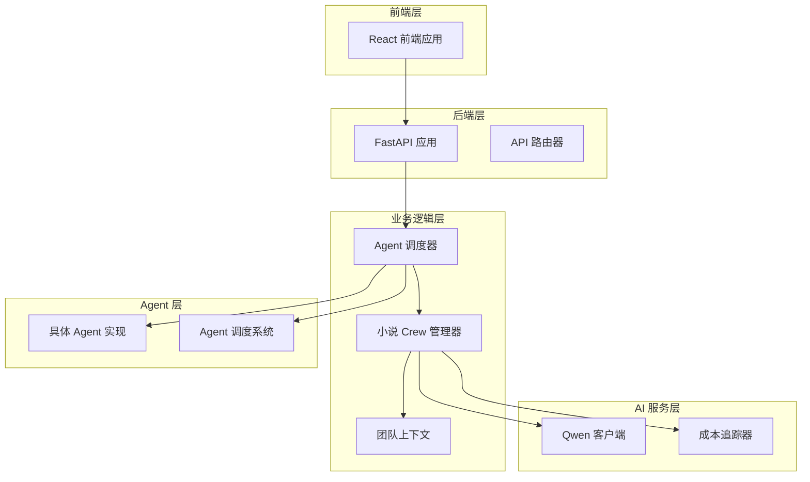
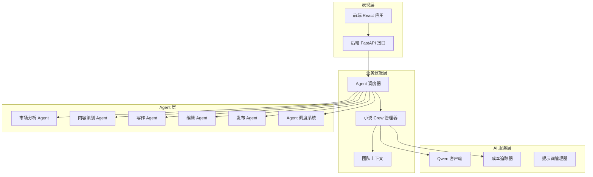
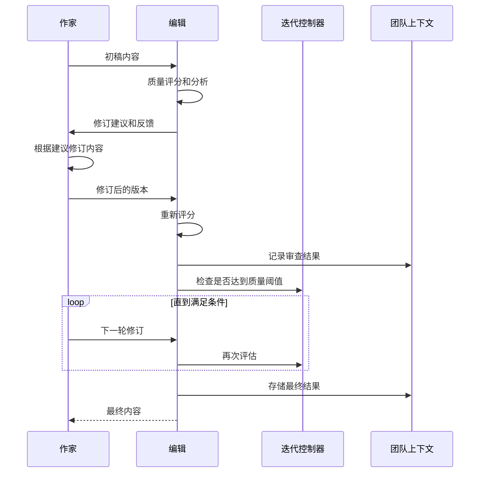
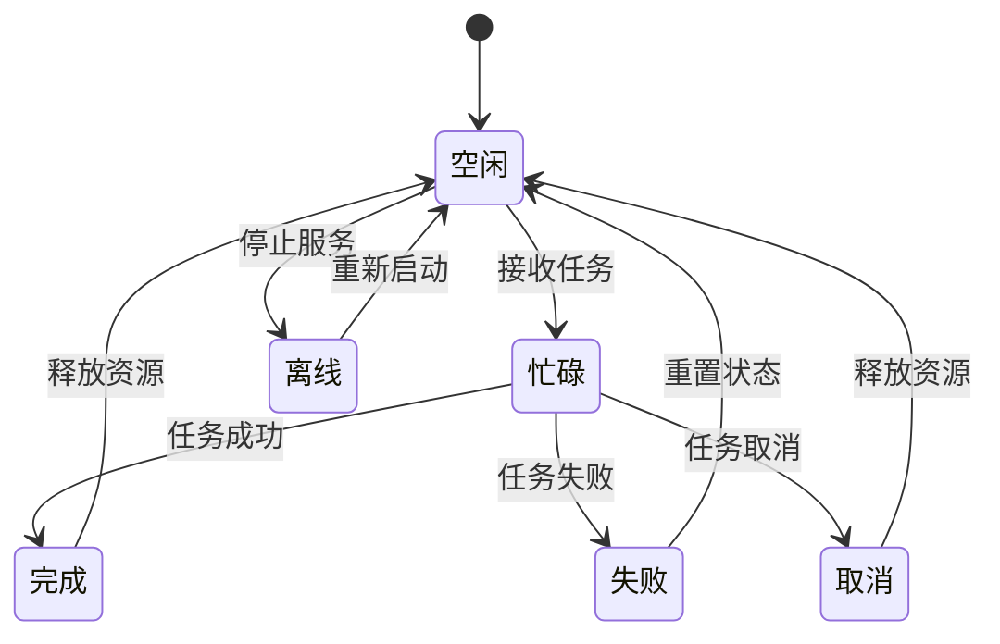
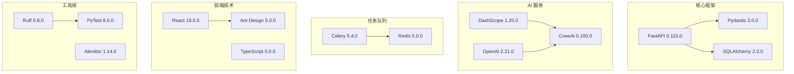

# 小说创作助手系统

<cite>
**本文档中引用的文件**
- [crew_manager.py](file://agents/crew_manager.py)
- [agent_manager.py](file://agents/agent_manager.py)
- [agent_dispatcher.py](file://agents/agent_dispatcher.py)
- [team_context.py](file://agents/team_context.py)
- [qwen_client.py](file://llm/qwen_client.py)
- [cost_tracker.py](file://llm/cost_tracker.py)
- [review_loop.py](file://agents/review_loop.py)
- [voting_manager.py](file://agents/voting_manager.py)
- [agent_scheduler.py](file://agents/agent_scheduler.py)
- [specific_agents.py](file://agents/specific_agents.py)
- [main.py](file://backend/main.py)
- [App.tsx](file://frontend/src/App.tsx)
- [pyproject.toml](file://pyproject.toml)
</cite>

## 目录
1. [简介](#简介)
2. [项目结构](#项目结构)
3. [核心组件](#核心组件)
4. [架构概览](#架构概览)
5. [详细组件分析](#详细组件分析)
6. [依赖关系分析](#依赖关系分析)
7. [性能考虑](#性能考虑)
8. [故障排除指南](#故障排除指南)
9. [结论](#结论)

## 简介

小说创作助手系统是一个基于 CrewAI 风格的智能小说生成平台，集成了多个专门的 AI Agent 来协助用户创作高质量的小说作品。该系统采用模块化设计，支持自动化的企划阶段和写作阶段，具备强大的协作机制和质量控制功能。

系统的核心特色包括：
- **多 Agent 协作**：主题分析师、世界观架构师、角色设计师、情节架构师等专业 Agent
- **智能审查循环**：Writer-Editor 质量驱动的迭代优化机制
- **投票共识机制**：多视角决策的投票系统
- **成本追踪**：详细的 Token 使用量和费用统计
- **团队上下文共享**：Agent 间的信息共享和状态追踪

## 项目结构

该项目采用清晰的分层架构设计，主要分为以下几个核心层次：

**图表来源**
- [main.py](file://backend/main.py#L15-L33)
- [agent_dispatcher.py](file://agents/agent_dispatcher.py#L17-L83)
- [crew_manager.py](file://agents/crew_manager.py#L38-L154)

**章节来源**
- [pyproject.toml](file://pyproject.toml#L1-L64)

## 核心组件

### NovelCrewManager - 小说 Crew 管理器

NovelCrewManager 是系统的核心协调器，负责管理整个小说创作流程。它实现了 CrewAI 风格的直接编排模式，通过 QwenClient 直接调用通义千问模型，而非使用 CrewAI 的内置 LLM 集成。

**主要功能特性：**
- **企划阶段协调**：主题分析、世界观构建、角色设计、情节架构
- **写作阶段管理**：章节策划、内容创作、质量审查、连续性检查
- **协作机制集成**：审查反馈循环、投票共识、请求-应答协商
- **成本追踪**：详细的 Token 使用量和费用统计

**章节来源**
- [crew_manager.py](file://agents/crew_manager.py#L38-L154)

### AgentDispatcher - Agent 调度器

AgentDispatcher 负责在不同 Agent 实现之间进行调度，提供灵活的执行模式选择。它支持两种执行模式：基于调度器的 Agent 系统和 CrewAI 风格系统。

**核心功能：**
- **模式切换**：动态选择基于调度器的 Agent 系统或 CrewAI 风格系统
- **任务执行**：协调企划阶段和写作阶段的任务执行
- **批量处理**：支持批量章节的自动化生成
- **状态监控**：实时监控所有 Agent 的运行状态

**章节来源**
- [agent_dispatcher.py](file://agents/agent_dispatcher.py#L17-L83)

### NovelTeamContext - 团队上下文

NovelTeamContext 实现了 Agent 之间的信息共享和状态追踪，借鉴了 AgentMesh 的设计理念。它提供了完整的小说创作过程中的上下文管理能力。

**主要特性：**
- **Agent 输出历史**：记录所有 Agent 的输出和交互
- **角色状态管理**：追踪主要角色的状态变化
- **时间线追踪**：维护故事的时间线和关键事件
- **审查反馈记录**：保存质量审查和投票的结果
- **迭代日志**：记录 Writer-Editor 循环的详细过程

**章节来源**
- [team_context.py](file://agents/team_context.py#L155-L216)

## 架构概览

系统采用分层架构设计，确保了良好的模块化和可扩展性：

**图表来源**
- [agent_dispatcher.py](file://agents/agent_dispatcher.py#L105-L358)
- [crew_manager.py](file://agents/crew_manager.py#L286-L547)
- [agent_scheduler.py](file://agents/agent_scheduler.py#L222-L488)

## 详细组件分析

### 审查反馈循环系统

审查反馈循环是系统质量保证的核心机制，实现了 Writer-Editor 的智能协作：

**图表来源**
- [review_loop.py](file://agents/review_loop.py#L113-L263)
- [crew_manager.py](file://agents/crew_manager.py#L753-L775)

**章节来源**
- [review_loop.py](file://agents/review_loop.py#L91-L263)

### 投票共识机制

投票共识机制允许多个 Agent 从不同专业视角对关键决策进行投票，通过加权置信度计算获胜方案：

**图表来源**
- [voting_manager.py](file://agents/voting_manager.py#L85-L140)
- [voting_manager.py](file://agents/voting_manager.py#L173-L211)

**章节来源**
- [voting_manager.py](file://agents/voting_manager.py#L74-L236)

### Agent 调度系统

Agent 调度系统提供了完整的任务管理和 Agent 生命周期管理：

**图表来源**
- [agent_scheduler.py](file://agents/agent_scheduler.py#L13-L37)
- [agent_scheduler.py](file://agents/agent_scheduler.py#L222-L488)

**章节来源**
- [agent_scheduler.py](file://agents/agent_scheduler.py#L222-L488)

## 依赖关系分析

系统采用了现代化的 Python 技术栈，主要依赖包括：

**图表来源**
- [pyproject.toml](file://pyproject.toml#L8-L36)

**章节来源**
- [pyproject.toml](file://pyproject.toml#L1-L64)

## 性能考虑

系统在设计时充分考虑了性能优化和资源管理：

### Token 使用优化
- **成本追踪**：实时监控每个 Agent 的 Token 使用量
- **定价策略**：支持多种模型的定价模式（qwen-plus、qwen-turbo、qwen-max）
- **章节成本统计**：按章节维度追踪和分析成本

### 并发处理
- **异步编程**：广泛使用 asyncio 实现非阻塞 I/O
- **并行投票**：多 Agent 投票的并发执行
- **流式输出**：支持 LLM 的流式响应处理

### 缓存和状态管理
- **上下文压缩**：章节内容的智能压缩和缓存
- **状态持久化**：团队上下文的序列化和恢复
- **任务队列**：基于 Redis 的分布式任务队列

## 故障排除指南

### 常见问题及解决方案

**LLM API 调用失败**
- 检查 DashScope API 密钥配置
- 验证网络连接和代理设置
- 查看重试机制的日志信息

**Agent 调度异常**
- 确认 Agent 状态机的正确转换
- 检查任务依赖关系的完整性
- 验证消息通信系统的正常运行

**内存泄漏问题**
- 监控团队上下文的大小增长
- 定期清理过期的 Agent 输出
- 实施适当的缓存淘汰策略

**章节生成性能问题**
- 调整温度参数和最大 token 数
- 优化提示词模板的复杂度
- 实施分批处理和增量生成

**章节来源**
- [qwen_client.py](file://llm/qwen_client.py#L46-L161)
- [agent_scheduler.py](file://agents/agent_scheduler.py#L324-L379)

## 结论

小说创作助手系统是一个功能完整、架构清晰的智能创作平台。通过模块化的 Agent 设计和强大的协作机制，系统能够为用户提供从创意构思到内容发布的全流程支持。

**主要优势：**
- **高度模块化**：清晰的职责分离和接口设计
- **智能协作**：多 Agent 间的高效协同工作
- **质量保证**：完善的审查和优化机制
- **成本控制**：透明的 Token 使用和费用追踪
- **可扩展性**：灵活的架构支持功能扩展

**未来发展方向：**
- 增强个性化定制功能
- 优化移动端用户体验
- 扩展多语言支持
- 集成更多创作工具和服务

该系统为 AI 辅助内容创作提供了优秀的实践范例，具有良好的商业应用前景和技术推广价值。