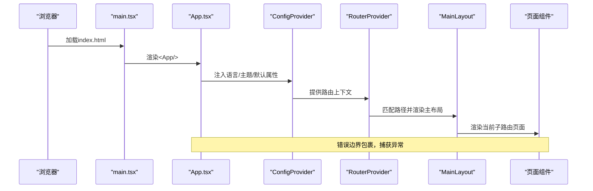
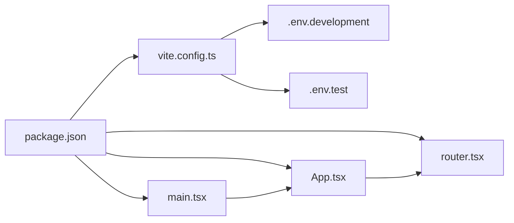

# React应用架构

<cite>
**本文引用的文件**
- [App.tsx](file://frontend/src/App.tsx)
- [main.tsx](file://frontend/src/main.tsx)
- [router.tsx](file://frontend/src/router.tsx)
- [ErrorBoundary.tsx](file://frontend/src/components/ErrorBoundary.tsx)
- [MainLayout.tsx](file://frontend/src/components/Layout/MainLayout.tsx)
- [package.json](file://frontend/package.json)
- [vite.config.ts](file://frontend/vite.config.ts)
- [.env.development](file://frontend/.env.development)
- [.env.test](file://frontend/.env.test)
- [client.ts](file://frontend/src/api/client.ts)
- [constants.ts](file://frontend/src/utils/constants.ts)
- [useGenerationStore.ts](file://frontend/src/stores/useGenerationStore.ts)
- [Dashboard.tsx](file://frontend/src/pages/Dashboard.tsx)
- [NovelList.tsx](file://frontend/src/pages/NovelList.tsx)
- [usePolling.ts](file://frontend/src/hooks/usePolling.ts)
- [tsconfig.json](file://frontend/tsconfig.json)
- [eslint.config.js](file://frontend/eslint.config.js)
</cite>

## 目录
1. [引言](#引言)
2. [项目结构](#项目结构)
3. [核心组件](#核心组件)
4. [架构总览](#架构总览)
5. [详细组件分析](#详细组件分析)
6. [依赖关系分析](#依赖关系分析)
7. [性能考虑](#性能考虑)
8. [故障排查指南](#故障排查指南)
9. [结论](#结论)
10. [附录](#附录)

## 引言
本文件为该React前端应用的架构设计与实现指南，围绕根组件App.tsx、入口文件main.tsx、路由系统router.tsx、全局配置ConfigProvider、错误边界ErrorBoundary、以及TypeScript类型与最佳实践展开。文档同时覆盖应用启动流程、开发工具链（Vite、ESLint）、API客户端拦截器、状态管理与轮询机制等关键点，帮助React开发者快速理解并扩展该系统。

## 项目结构
前端采用Vite + React 19 + TypeScript构建，目录组织遵循按功能分层：页面pages、通用组件components、API封装api、工具utils、状态stores、钩子hooks等。通过别名@指向src目录，提升路径可读性；路由采用React Router v7的createBrowserRouter；UI库使用Ant Design 6，并通过ConfigProvider统一配置语言、主题与组件默认行为。

```mermaid
graph TB
subgraph "入口与根组件"
MAIN["main.tsx<br/>应用挂载"]
APP["App.tsx<br/>根组件"]
END
subgraph "路由系统"
ROUTER["router.tsx<br/>路由配置"]
LAYOUT["MainLayout.tsx<br/>主布局"]
END
subgraph "全局配置"
CFG["ConfigProvider<br/>语言/主题/默认属性"]
ZHCN["zhCN 语言包"]
END
subgraph "错误边界"
EB["ErrorBoundary.tsx<br/>错误捕获"]
END
subgraph "开发环境配置"
VITE["vite.config.ts<br/>动态环境变量加载"]
ENV_DEV[".env.development<br/>开发环境变量"]
ENV_TEST[".env.test<br/>测试环境变量"]
API_PROXY["API代理配置<br/>API_PROXY_TARGET"]
END
subgraph "页面与功能"
DASH["Dashboard.tsx"]
NOVEL_LIST["NovelList.tsx"]
STORE["useGenerationStore.ts"]
POLL["usePolling.ts"]
CONST["constants.ts"]
API["client.ts"]
END
MAIN --> APP
APP --> CFG
CFG --> ROUTER
ROUTER --> LAYOUT
LAYOUT --> DASH
LAYOUT --> NOVEL_LIST
DASH --> API
NOVEL_LIST --> API
NOVEL_LIST --> STORE
STORE --> API
DASH --> POLL
NOVEL_LIST --> CONST
API --> EB
VITE --> ENV_DEV
VITE --> ENV_TEST
VITE --> API_PROXY
```

**图表来源**
- [main.tsx](file://frontend/src/main.tsx#L1-L10)
- [App.tsx](file://frontend/src/App.tsx#L1-L16)
- [router.tsx](file://frontend/src/router.tsx#L1-L30)
- [MainLayout.tsx](file://frontend/src/components/Layout/MainLayout.tsx#L1-L83)
- [ErrorBoundary.tsx](file://frontend/src/components/ErrorBoundary.tsx#L1-L43)
- [vite.config.ts](file://frontend/vite.config.ts#L1-L44)
- [.env.development](file://frontend/.env.development#L1-L2)
- [.env.test](file://frontend/.env.test#L1-L23)
- [client.ts](file://frontend/src/api/client.ts#L1-L24)
- [useGenerationStore.ts](file://frontend/src/stores/useGenerationStore.ts#L1-L41)
- [usePolling.ts](file://frontend/src/hooks/usePolling.ts#L1-L39)
- [constants.ts](file://frontend/src/utils/constants.ts#L1-L39)

**章节来源**
- [package.json](file://frontend/package.json#L1-L42)
- [vite.config.ts](file://frontend/vite.config.ts#L1-L44)
- [tsconfig.json](file://frontend/tsconfig.json#L1-L8)
- [eslint.config.js](file://frontend/eslint.config.js#L1-L24)

## 核心组件
- 根组件App.tsx：在顶层包裹错误边界与ConfigProvider，注入Ant Design语言包与路由提供者RouterProvider，形成全局配置与导航的统一入口。
- 入口文件main.tsx：以StrictMode包裹应用，通过ReactDOM 18+的createRoot挂载到DOM节点。
- 路由系统router.tsx：基于createBrowserRouter定义主布局与嵌套路由，支持首页、小说列表、详情、章节阅读、平台账号、发布任务、系统监控与通配符404。
- 错误边界ErrorBoundary.tsx：类组件实现错误边界，捕获子树异常并展示结果页与刷新按钮。
- 主布局MainLayout.tsx：侧边菜单、头部标题、内容区域Outlet，配合主题token与导航跳转。
- **开发环境配置**：vite.config.ts通过loadEnv动态加载环境变量，支持API_PROXY_TARGET环境变量动态设置，提供灵活的API代理配置。

**章节来源**
- [App.tsx](file://frontend/src/App.tsx#L1-L16)
- [main.tsx](file://frontend/src/main.tsx#L1-L10)
- [router.tsx](file://frontend/src/router.tsx#L1-L30)
- [ErrorBoundary.tsx](file://frontend/src/components/ErrorBoundary.tsx#L1-L43)
- [MainLayout.tsx](file://frontend/src/components/Layout/MainLayout.tsx#L1-L83)
- [vite.config.ts](file://frontend/vite.config.ts#L1-L44)

## 架构总览
应用采用"入口挂载 → 根组件 → 全局配置 → 路由提供者 → 布局容器 → 页面组件"的线性控制流。全局配置通过ConfigProvider集中管理Ant Design语言与主题；路由系统负责URL到页面的映射与嵌套；错误边界确保单页异常不影响整站；API客户端统一拦截错误并提示；状态管理与轮询钩子支撑后台任务与实时更新。开发环境通过动态环境变量加载实现灵活的API代理配置。



**图表来源**
- [main.tsx](file://frontend/src/main.tsx#L1-L10)
- [App.tsx](file://frontend/src/App.tsx#L1-L16)
- [router.tsx](file://frontend/src/router.tsx#L1-L30)
- [MainLayout.tsx](file://frontend/src/components/Layout/MainLayout.tsx#L1-L83)

## 详细组件分析

### 根组件App.tsx设计模式
- 错误边界处理：根组件最外层包裹ErrorBoundary，确保任何子组件抛错都不会导致应用崩溃，而是显示错误结果页与刷新入口。
- 国际化配置：通过ConfigProvider注入zhCN语言包，使Ant Design组件文案与日期格式本地化。
- 路由提供者集成：使用RouterProvider承载路由表，实现声明式导航与嵌套路由。
- 设计要点：单一职责、最小包裹层级、避免在根组件做复杂逻辑，保持可测试性与可维护性。

**章节来源**
- [App.tsx](file://frontend/src/App.tsx#L1-L16)
- [ErrorBoundary.tsx](file://frontend/src/components/ErrorBoundary.tsx#L1-L43)

### 入口文件main.tsx配置
- 应用挂载：使用createRoot将App渲染至id为root的DOM节点，符合React 18+推荐写法。
- 开发工具：在StrictMode下运行，有助于提前发现副作用问题。
- 性能优化：Vite提供热更新与按需编译，生产构建由Vite完成；TypeScript类型检查在构建阶段执行。
- 开发体验：ESLint配置启用React Hooks与React Refresh规则，提升开发效率与代码质量。

**章节来源**
- [main.tsx](file://frontend/src/main.tsx#L1-L10)
- [package.json](file://frontend/package.json#L1-L42)
- [vite.config.ts](file://frontend/vite.config.ts#L1-L44)
- [eslint.config.js](file://frontend/eslint.config.js#L1-L24)

### 路由系统router.tsx设计
- 路由配置：createBrowserRouter集中定义路径、元素与嵌套关系，主路由指向MainLayout，子路由覆盖仪表盘、小说列表、详情、章节阅读、平台账号、发布任务、系统监控与通配符404。
- 嵌套路由：MainLayout内部通过Outlet接收子路由内容，实现布局与页面的解耦。
- 动态导入：当前路由直接import页面组件，未见路由级懒加载；如需进一步优化可结合React.lazy与Suspense实现按需加载。
- 路由守卫：未见显式路由守卫实现；如需鉴权或权限校验，可在Layout或特定页面内通过useEffect与navigate实现前置校验。

**章节来源**
- [router.tsx](file://frontend/src/router.tsx#L1-L30)
- [MainLayout.tsx](file://frontend/src/components/Layout/MainLayout.tsx#L1-L83)

### ConfigProvider全局配置
- Ant Design主题定制：通过ConfigProvider的theme、componentDefaultProps等可扩展主题与组件默认属性（当前注入locale）。
- 语言包配置：locale={zhCN}确保组件文案为简体中文。
- 组件默认属性：可在componentDefaultProps中设置常用组件默认值，减少重复传参。
- 集中管理：将配置置于根组件，便于统一升级与迁移。

**章节来源**
- [App.tsx](file://frontend/src/App.tsx#L1-L16)

### 错误边界ErrorBoundary.tsx
- 类组件实现：构造函数初始化状态，static getDerivedStateFromError捕获错误，render根据状态决定是否展示错误页。
- 用户体验：错误页包含标题、副标题与刷新按钮，点击后重新加载页面。
- 最佳实践：仅包裹根组件或关键布局，避免过度包裹导致调试困难；在子组件中尽量使用React Error Boundary进行更细粒度的错误隔离。

**章节来源**
- [ErrorBoundary.tsx](file://frontend/src/components/ErrorBoundary.tsx#L1-L43)

### 开发环境配置与动态环境变量加载

**更新** 新增动态环境变量加载和API代理目标配置

- **动态环境变量加载**：vite.config.ts使用loadEnv函数按模式加载环境变量，支持开发、测试、生产等不同环境的配置分离。
- **API代理目标配置**：通过API_PROXY_TARGET环境变量动态设置API代理目标地址，默认回退到localhost:8000，支持容器化部署场景。
- **环境变量优先级**：优先使用Vite加载的环境变量，其次使用process.env中的环境变量，最后使用硬编码默认值。
- **代理配置增强**：vite.config.ts提供详细的代理日志输出，包括请求转发、响应状态等，便于开发调试。
- **网络接口监听**：开发服务器配置为监听所有网络接口（host: '0.0.0.0'），支持Docker容器外部访问。

**章节来源**
- [vite.config.ts](file://frontend/vite.config.ts#L1-L44)
- [.env.development](file://frontend/.env.development#L1-L2)
- [.env.test](file://frontend/.env.test#L1-L23)

### 页面与功能组件
- Dashboard.tsx：聚合小说与生成任务数据，使用表格与卡片展示统计信息；通过Promise.all并发拉取数据，提升首屏性能。
- NovelList.tsx：支持分页、筛选、创建、删除与AI辅助抽屉；使用Form与Modal实现交互；通过useCallback稳定回调，减少重渲染。
- useGenerationStore.ts：Zustand状态管理，封装任务列表与单任务刷新逻辑，集中处理加载状态与错误回退。
- usePolling.ts：自定义轮询钩子，支持立即执行与定时轮询，暴露stop方法清理定时器，避免内存泄漏。
- constants.ts：集中管理状态映射、枚举选项与格式化常量，提升可维护性与一致性。

**章节来源**
- [Dashboard.tsx](file://frontend/src/pages/Dashboard.tsx#L1-L95)
- [NovelList.tsx](file://frontend/src/pages/NovelList.tsx#L1-L162)
- [useGenerationStore.ts](file://frontend/src/stores/useGenerationStore.ts#L1-L41)
- [usePolling.ts](file://frontend/src/hooks/usePolling.ts#L1-L39)
- [constants.ts](file://frontend/src/utils/constants.ts#L1-L39)

### API客户端与环境配置
- API客户端client.ts：基于Axios创建实例，设置基础路径、超时与响应拦截器；拦截器统一提取错误消息并通过Ant Design的消息组件提示，最后重新抛出错误。
- 环境变量：.env.development中配置VITE_API_BASE_URL，.env.test中配置测试环境变量，Vite在构建时会替换对应占位符，便于区分开发与生产环境。
- 代理配置：vite.config.ts中配置/dev-server代理到后端服务，解决跨域与开发联调问题。

**章节来源**
- [client.ts](file://frontend/src/api/client.ts#L1-L24)
- [.env.development](file://frontend/.env.development#L1-L2)
- [.env.test](file://frontend/.env.test#L1-L23)
- [vite.config.ts](file://frontend/vite.config.ts#L1-L44)

### TypeScript类型定义最佳实践
- 类型安全：页面组件与API类型通过@/api/types统一管理，避免类型分散；store中明确接口约束，减少运行时错误。
- 接口设计：将状态映射与枚举以Record或联合类型表达，增强可读性与可扩展性。
- 泛型使用：在store中使用泛型约束状态结构，确保set/get调用的安全性；在钩子中使用泛型约束回调参数类型。
- 配置文件：tsconfig.json采用references组织多项目配置，提升大型项目的类型检查效率。

**章节来源**
- [useGenerationStore.ts](file://frontend/src/stores/useGenerationStore.ts#L1-L41)
- [constants.ts](file://frontend/src/utils/constants.ts#L1-L39)
- [tsconfig.json](file://frontend/tsconfig.json#L1-L8)

## 依赖关系分析
- 运行时依赖：React、React DOM、React Router、Ant Design、Axios、Day.js、Zustand等。
- 开发依赖：Vite、@vitejs/plugin-react、TypeScript、ESLint及其插件、dotenv等。
- 构建脚本：dev、build、lint、preview，分别对应开发、构建、代码检查与预览。
- 代理与别名：Vite配置了@别名与/api代理，简化路径书写并解决跨域问题。



**图表来源**
- [package.json](file://frontend/package.json#L1-L42)
- [vite.config.ts](file://frontend/vite.config.ts#L1-L44)
- [.env.development](file://frontend/.env.development#L1-L2)
- [.env.test](file://frontend/.env.test#L1-L23)
- [router.tsx](file://frontend/src/router.tsx#L1-L30)
- [App.tsx](file://frontend/src/App.tsx#L1-L16)
- [main.tsx](file://frontend/src/main.tsx#L1-L10)

**章节来源**
- [package.json](file://frontend/package.json#L1-L42)
- [vite.config.ts](file://frontend/vite.config.ts#L1-L44)

## 性能考虑
- 并发加载：Dashboard使用Promise.all并发请求多个数据源，缩短首屏等待时间。
- 轮询优化：usePolling支持立即执行与定时轮询，避免频繁请求；提供stop清理，防止组件卸载后继续执行。
- 状态管理：Zustand轻量且易用，适合中等规模的状态管理；建议按模块拆分store，避免全局状态膨胀。
- 路由懒加载：当前未实现路由级懒加载；建议对大型页面组件使用React.lazy与Suspense，降低首屏体积。
- 构建优化：Vite默认开启Tree Shaking与按需编译；TypeScript在构建阶段进行类型检查，减少运行时开销。
- 缓存策略：可在API层引入请求缓存与失效策略，减少重复请求。
- **开发环境优化**：动态环境变量加载支持灵活的API代理配置，提高开发部署灵活性。

## 故障排查指南
- 错误边界生效：若页面出现异常但整站崩溃，检查ErrorBoundary是否包裹根组件；确认static getDerivedStateFromError是否正确返回状态。
- API错误提示：若请求失败无提示，检查client.ts拦截器是否正常工作；确认后端返回的错误字段结构与拦截器匹配。
- 路由不生效：检查router.tsx路径与MainLayout嵌套关系；确认RouterProvider是否正确传入router实例。
- 环境变量未生效：确认VITE前缀与.env文件命名；在Vite中使用process.env.VITE_*或import.meta.env.VITE_*访问；检查API_PROXY_TARGET配置。
- **开发环境代理问题**：检查vite.config.ts中的API代理配置，确认API_PROXY_TARGET环境变量设置正确；查看代理日志输出定位问题。
- ESLint报错：根据eslint.config.js规则修正语法与Hook使用；优先修复推荐规则，再处理严格规则。

**章节来源**
- [ErrorBoundary.tsx](file://frontend/src/components/ErrorBoundary.tsx#L1-L43)
- [client.ts](file://frontend/src/api/client.ts#L1-L24)
- [router.tsx](file://frontend/src/router.tsx#L1-L30)
- [.env.development](file://frontend/.env.development#L1-L2)
- [.env.test](file://frontend/.env.test#L1-L23)
- [vite.config.ts](file://frontend/vite.config.ts#L1-L44)
- [eslint.config.js](file://frontend/eslint.config.js#L1-L24)

## 结论
该React应用采用清晰的分层架构：入口文件负责挂载，根组件负责全局配置与错误边界，路由系统负责导航与嵌套，页面组件聚焦业务逻辑，API与工具提供统一的数据与常量支持。通过TypeScript与ESLint保障类型安全与代码质量，配合Vite与Ant Design提升开发效率与用户体验。**新增的动态环境变量加载和API代理目标配置**显著提升了开发环境的灵活性和部署适应性。建议后续引入路由懒加载、状态模块化与缓存策略，持续优化性能与可维护性。

## 附录
- 启动流程概览：main.tsx → App.tsx → ConfigProvider → RouterProvider → MainLayout → 页面组件
- 关键配置清单：package.json脚本、vite别名与代理、ESLint规则、TS配置references、动态环境变量加载
- 扩展建议：路由懒加载、权限守卫、请求缓存、埋点与性能监控、容器化部署优化
- **开发环境优化**：动态API代理配置、环境变量优先级处理、代理日志输出、网络接口监听