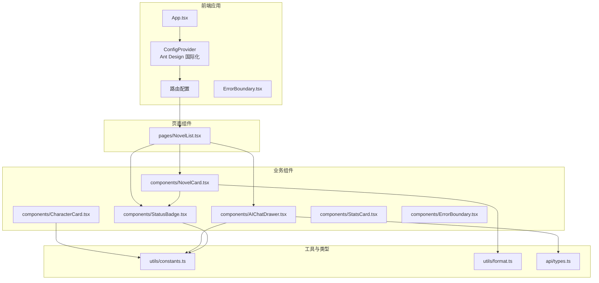
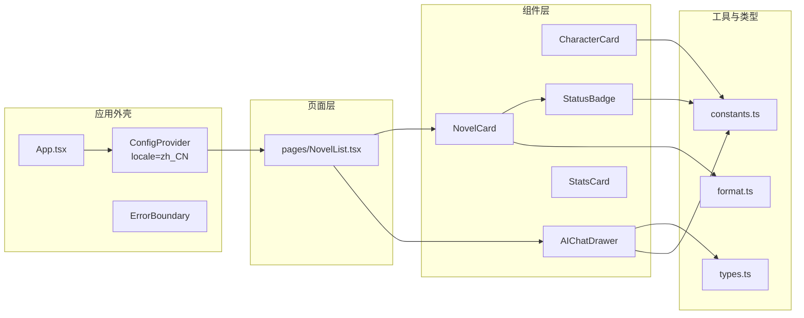
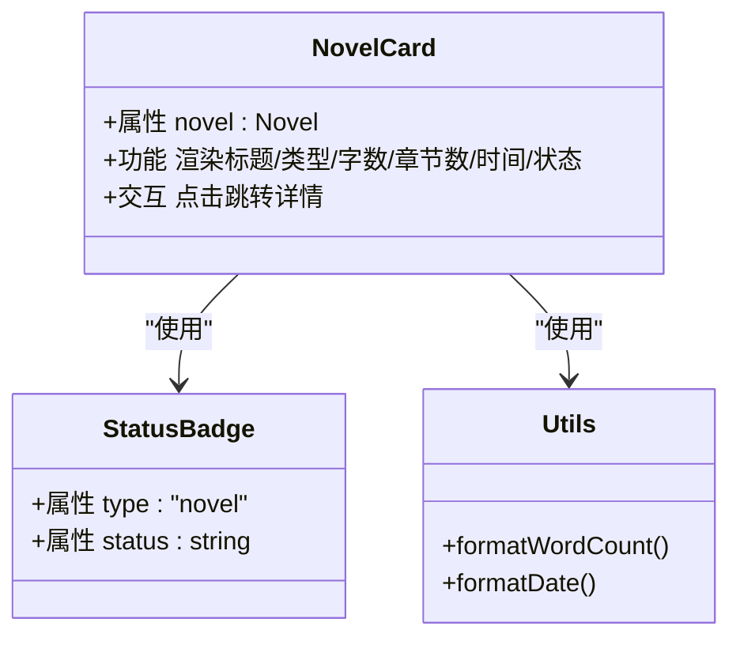
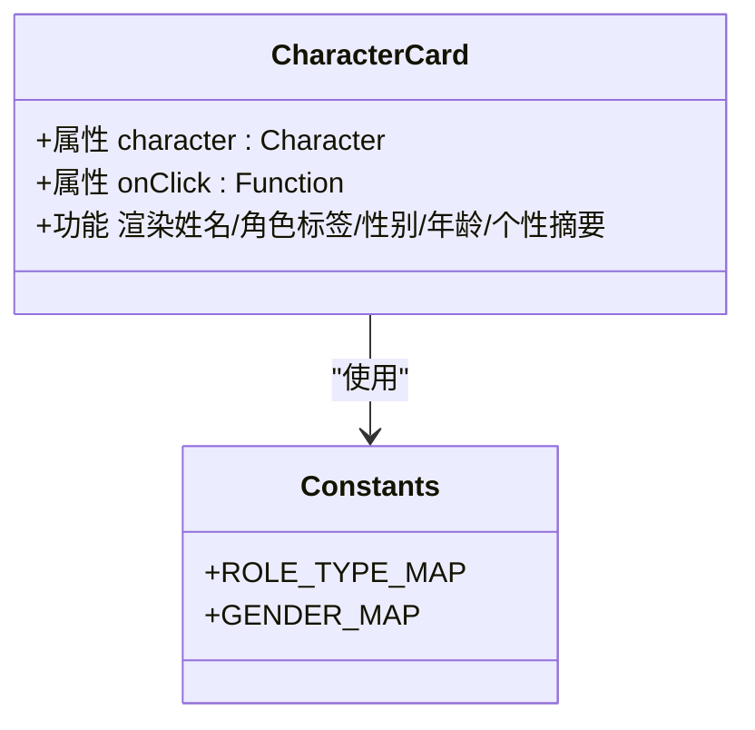
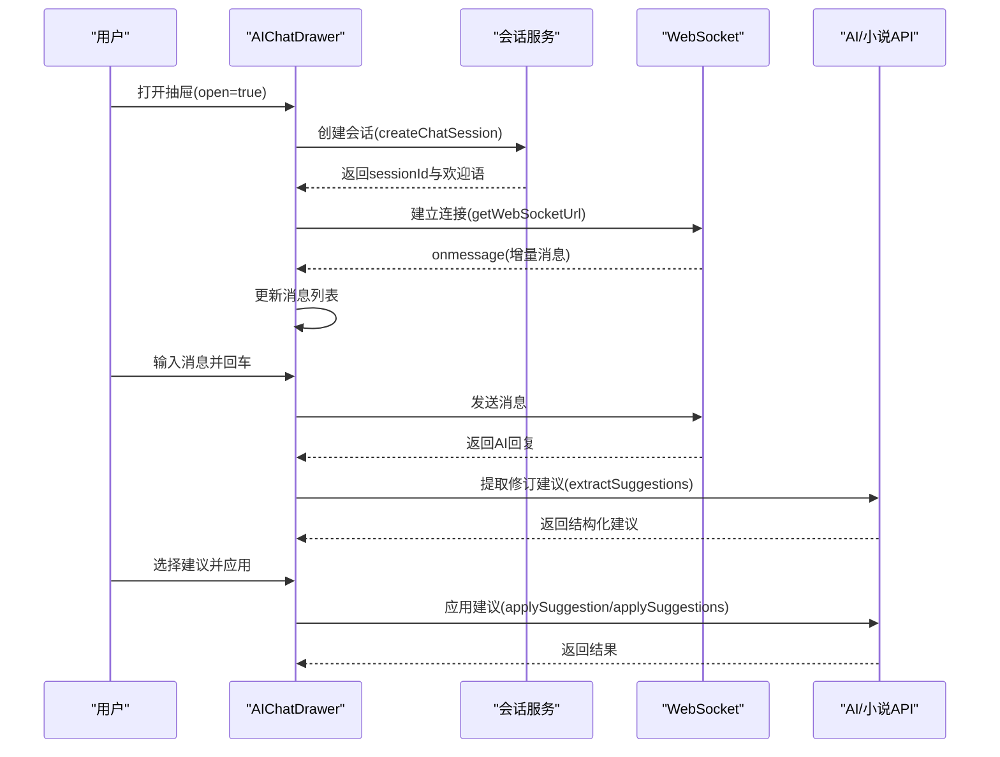
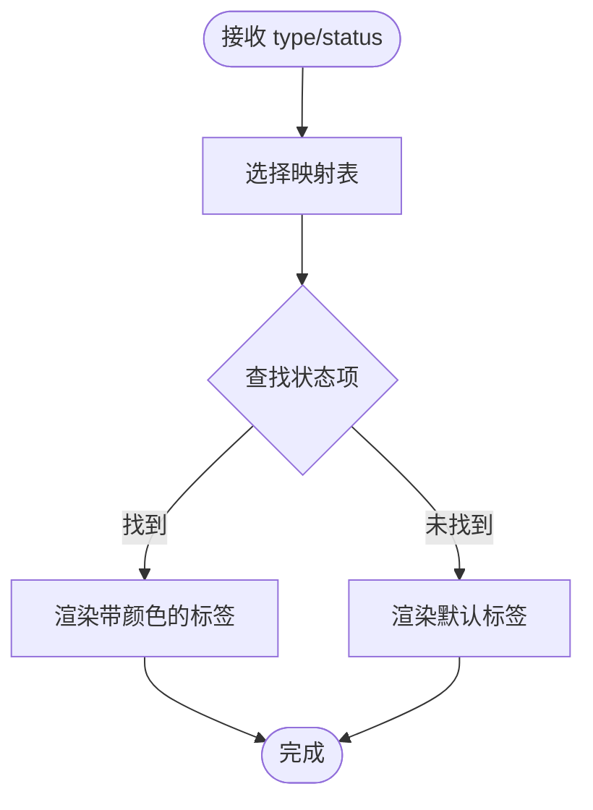
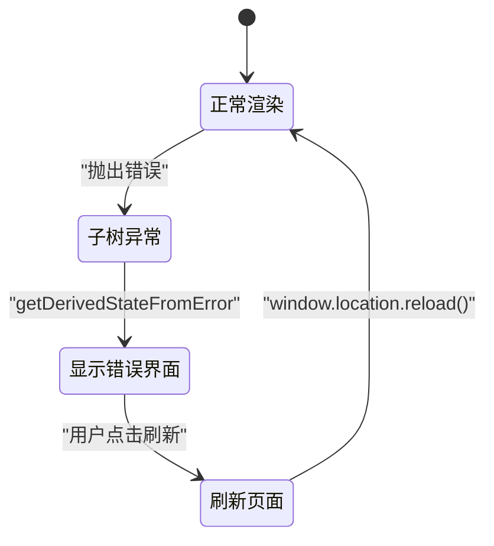
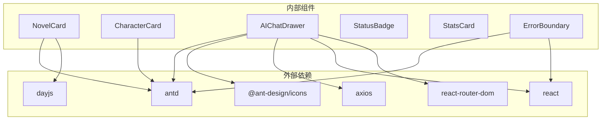

# UI组件库

<cite>
**本文引用的文件**
- [NovelCard.tsx](file://frontend/src/components/NovelCard.tsx)
- [CharacterCard.tsx](file://frontend/src/components/CharacterCard.tsx)
- [AIChatDrawer.tsx](file://frontend/src/components/AIChatDrawer.tsx)
- [ErrorBoundary.tsx](file://frontend/src/components/ErrorBoundary.tsx)
- [StatsCard.tsx](file://frontend/src/components/StatsCard.tsx)
- [StatusBadge.tsx](file://frontend/src/components/StatusBadge.tsx)
- [types.ts](file://frontend/src/api/types.ts)
- [constants.ts](file://frontend/src/utils/constants.ts)
- [format.ts](file://frontend/src/utils/format.ts)
- [package.json](file://frontend/package.json)
- [vite.config.ts](file://frontend/vite.config.ts)
- [NovelList.tsx](file://frontend/src/pages/NovelList.tsx)
- [App.tsx](file://frontend/src/App.tsx)
</cite>

## 目录
1. [引言](#引言)
2. [项目结构](#项目结构)
3. [核心组件](#核心组件)
4. [架构总览](#架构总览)
5. [组件详解](#组件详解)
6. [依赖关系分析](#依赖关系分析)
7. [性能考量](#性能考量)
8. [故障排查指南](#故障排查指南)
9. [结论](#结论)
10. [附录](#附录)

## 引言
本文件为小说系统的UI组件库开发指南，聚焦于Ant Design组件的集成与扩展，涵盖主题与样式定制、组件配置、业务组件设计规范、复用模式、测试策略以及可访问性支持。读者将通过本指南掌握如何在现有项目中高效构建、维护与演进UI组件库，并将其与路由、状态管理、API层进行解耦整合。

## 项目结构
前端采用React + TypeScript + Vite搭建，Ant Design作为基础UI库，配合路由、国际化与Axios进行网络请求。组件集中在src/components目录，页面组件位于src/pages，类型定义在src/api/types.ts，通用常量与格式化工具位于src/utils。

图表来源
- [App.tsx](file://frontend/src/App.tsx#L1-L16)
- [NovelList.tsx](file://frontend/src/pages/NovelList.tsx#L1-L162)
- [NovelCard.tsx](file://frontend/src/components/NovelCard.tsx#L1-L36)
- [CharacterCard.tsx](file://frontend/src/components/CharacterCard.tsx#L1-L41)
- [AIChatDrawer.tsx](file://frontend/src/components/AIChatDrawer.tsx#L1-L981)
- [StatusBadge.tsx](file://frontend/src/components/StatusBadge.tsx#L1-L22)
- [StatsCard.tsx](file://frontend/src/components/StatsCard.tsx#L1-L22)
- [ErrorBoundary.tsx](file://frontend/src/components/ErrorBoundary.tsx#L1-L43)
- [constants.ts](file://frontend/src/utils/constants.ts#L1-L39)
- [format.ts](file://frontend/src/utils/format.ts#L1-L23)
- [types.ts](file://frontend/src/api/types.ts#L1-L352)

章节来源
- [package.json](file://frontend/package.json#L1-L42)
- [vite.config.ts](file://frontend/vite.config.ts#L1-L23)

## 核心组件
本节对关键UI组件进行概览，说明其职责、Props接口、依赖关系与典型使用场景。

- NovelCard：展示小说条目，包含标题、类型、字数、章节数、创建时间与状态徽章；点击跳转详情页。
- CharacterCard：展示角色信息，含姓名、角色类型标签、性别/年龄、个性摘要等；支持点击回调。
- AIChatDrawer：右侧抽屉式AI对话与修订助手，支持会话管理、WebSocket流式输出、修订建议提取与应用、章节范围控制等。
- StatusBadge：根据类型映射渲染不同状态标签，统一状态视觉规范。
- StatsCard：统计卡片，支持标题、数值与前缀图标及颜色配置。
- ErrorBoundary：类组件错误边界，捕获子树异常并提供刷新入口。

章节来源
- [NovelCard.tsx](file://frontend/src/components/NovelCard.tsx#L1-L36)
- [CharacterCard.tsx](file://frontend/src/components/CharacterCard.tsx#L1-L41)
- [AIChatDrawer.tsx](file://frontend/src/components/AIChatDrawer.tsx#L1-L981)
- [StatusBadge.tsx](file://frontend/src/components/StatusBadge.tsx#L1-L22)
- [StatsCard.tsx](file://frontend/src/components/StatsCard.tsx#L1-L22)
- [ErrorBoundary.tsx](file://frontend/src/components/ErrorBoundary.tsx#L1-L43)

## 架构总览
下图展示了组件库在应用中的位置与交互路径，包括页面组件、业务组件、工具模块与API类型之间的关系。

图表来源
- [App.tsx](file://frontend/src/App.tsx#L1-L16)
- [NovelList.tsx](file://frontend/src/pages/NovelList.tsx#L1-L162)
- [NovelCard.tsx](file://frontend/src/components/NovelCard.tsx#L1-L36)
- [CharacterCard.tsx](file://frontend/src/components/CharacterCard.tsx#L1-L41)
- [AIChatDrawer.tsx](file://frontend/src/components/AIChatDrawer.tsx#L1-L981)
- [StatusBadge.tsx](file://frontend/src/components/StatusBadge.tsx#L1-L22)
- [StatsCard.tsx](file://frontend/src/components/StatsCard.tsx#L1-L22)
- [constants.ts](file://frontend/src/utils/constants.ts#L1-L39)
- [format.ts](file://frontend/src/utils/format.ts#L1-L23)
- [types.ts](file://frontend/src/api/types.ts#L1-L352)

## 组件详解

### NovelCard 小说卡片
- 设计目的：以卡片形式呈现小说基本信息，支持点击跳转详情。
- Props 接口：接收小说对象，内部使用路由导航至详情页。
- 样式系统：基于Ant Design Card与Typography，使用Space布局与状态徽章组合。
- 响应式适配：卡片高度设置为100%，配合容器自适应。
- 依赖关系：依赖StatusBadge与format工具函数；类型来自API类型定义。

图表来源
- [NovelCard.tsx](file://frontend/src/components/NovelCard.tsx#L1-L36)
- [StatusBadge.tsx](file://frontend/src/components/StatusBadge.tsx#L1-L22)
- [format.ts](file://frontend/src/utils/format.ts#L1-L23)
- [types.ts](file://frontend/src/api/types.ts#L1-L352)

章节来源
- [NovelCard.tsx](file://frontend/src/components/NovelCard.tsx#L1-L36)
- [types.ts](file://frontend/src/api/types.ts#L1-L352)
- [format.ts](file://frontend/src/utils/format.ts#L1-L23)

### CharacterCard 角色卡片
- 设计目的：展示角色关键信息，支持点击回调。
- Props 接口：接收角色对象与可选点击回调；角色类型与性别映射来自常量表。
- 样式系统：Ant Design Card/Tag/Typography/Space组合；个性文本支持省略与多行限制。
- 响应式适配：小尺寸卡片与垂直间距控制，适合网格布局。
- 依赖关系：依赖角色类型映射与性别映射。

图表来源
- [CharacterCard.tsx](file://frontend/src/components/CharacterCard.tsx#L1-L41)
- [constants.ts](file://frontend/src/utils/constants.ts#L1-L39)
- [types.ts](file://frontend/src/api/types.ts#L1-L352)

章节来源
- [CharacterCard.tsx](file://frontend/src/components/CharacterCard.tsx#L1-L41)
- [constants.ts](file://frontend/src/utils/constants.ts#L1-L39)
- [types.ts](file://frontend/src/api/types.ts#L1-L352)

### AIChatDrawer 聊天抽屉
- 设计目的：提供AI对话、会话历史、修订建议提取与应用、章节范围控制等功能。
- Props 接口：open、onClose、scene、novelId、novelTitle。
- 状态管理：会话ID、消息列表、输入值、历史会话、WebSocket引用、修订建议、目标选择等。
- 流程要点：
  - 初始化会话并建立WebSocket连接，处理流式消息。
  - 支持键盘快捷键发送消息，加载历史会话与删除会话。
  - 修订建议：支持从AI回复中提取结构化建议，选择后应用到小说的世界观、角色或章节。
  - 章节范围：在修订/分析场景下允许设置起止章节号。
- 依赖关系：依赖API模块（会话、消息、建议、修订）、小说与章节列表查询、更新接口。

图表来源
- [AIChatDrawer.tsx](file://frontend/src/components/AIChatDrawer.tsx#L1-L981)
- [types.ts](file://frontend/src/api/types.ts#L1-L352)

章节来源
- [AIChatDrawer.tsx](file://frontend/src/components/AIChatDrawer.tsx#L1-L981)
- [types.ts](file://frontend/src/api/types.ts#L1-L352)

### StatusBadge 状态徽章
- 设计目的：统一渲染不同实体的状态标签，支持小说、章节、任务三类映射。
- Props 接口：type（novel/chapter/task）、status（字符串）。
- 实现要点：根据type选择对应映射表，若无匹配则回退显示原始状态。

图表来源
- [StatusBadge.tsx](file://frontend/src/components/StatusBadge.tsx#L1-L22)
- [constants.ts](file://frontend/src/utils/constants.ts#L1-L39)

章节来源
- [StatusBadge.tsx](file://frontend/src/components/StatusBadge.tsx#L1-L22)
- [constants.ts](file://frontend/src/utils/constants.ts#L1-L39)

### StatsCard 统计卡片
- 设计目的：以卡片+统计组件展示指标标题、数值与前缀图标。
- Props 接口：title、value、icon、color。
- 使用建议：统一颜色与图标风格，确保在不同背景下的可读性。

章节来源
- [StatsCard.tsx](file://frontend/src/components/StatsCard.tsx#L1-L22)

### ErrorBoundary 错误边界
- 设计目的：捕获子树异常，提供错误提示与刷新入口。
- 实现要点：使用静态getDerivedStateFromError与render分支返回错误界面。

图表来源
- [ErrorBoundary.tsx](file://frontend/src/components/ErrorBoundary.tsx#L1-L43)

章节来源
- [ErrorBoundary.tsx](file://frontend/src/components/ErrorBoundary.tsx#L1-L43)

## 依赖关系分析
- 组件间依赖：NovelCard依赖StatusBadge与format工具；CharacterCard依赖常量映射；AIChatDrawer依赖API类型与常量；ErrorBoundary包裹应用根节点。
- 外部依赖：Ant Design、Ant Design Icons、React、React Router、Axios、Day.js。
- 构建与代理：Vite配置别名@指向src，开发服务器代理/api到后端8000端口。

图表来源
- [package.json](file://frontend/package.json#L1-L42)
- [NovelCard.tsx](file://frontend/src/components/NovelCard.tsx#L1-L36)
- [CharacterCard.tsx](file://frontend/src/components/CharacterCard.tsx#L1-L41)
- [AIChatDrawer.tsx](file://frontend/src/components/AIChatDrawer.tsx#L1-L981)
- [StatusBadge.tsx](file://frontend/src/components/StatusBadge.tsx#L1-L22)
- [StatsCard.tsx](file://frontend/src/components/StatsCard.tsx#L1-L22)
- [ErrorBoundary.tsx](file://frontend/src/components/ErrorBoundary.tsx#L1-L43)

章节来源
- [package.json](file://frontend/package.json#L1-L42)
- [vite.config.ts](file://frontend/vite.config.ts#L1-L23)

## 性能考量
- 渲染优化
  - 使用Ant Design的Card与Space组件减少重复布局计算，避免过度嵌套。
  - NovelCard与CharacterCard在列表中复用时，保持稳定的key（如id），提升列表重渲染效率。
- 网络与流式
  - AIChatDrawer通过WebSocket增量更新消息，避免全量替换DOM；滚动到底部使用ref与平滑滚动，减少重排。
  - 建议在消息较多时启用虚拟滚动（如Ant Design List的虚拟化能力）进一步优化。
- 样式与主题
  - Ant Design内置主题变量可通过ConfigProvider进行全局覆盖，建议在开发环境统一管理变量，避免散落覆盖导致的样式冲突。
- 资源与体积
  - 按需引入Ant Design图标与组件，避免打包冗余；结合Tree Shaking与懒加载页面组件。

## 故障排查指南
- 抽屉无法打开或会话初始化失败
  - 检查open状态与scene参数是否正确传递；确认API返回的sessionId与welcome_message。
  - 若WebSocket连接失败，检查代理配置与后端服务连通性。
- 修订建议未提取或应用失败
  - 确认novelId存在且后端支持extractSuggestions与applySuggestion接口；查看控制台错误日志与消息提示。
- 状态徽章显示异常
  - 检查传入的type与status是否在映射表中；若不存在，组件将回退显示原始状态。
- 页面崩溃
  - ErrorBoundary会捕获异常并提供刷新入口；若仍无法恢复，检查控制台错误堆栈定位具体组件。

章节来源
- [AIChatDrawer.tsx](file://frontend/src/components/AIChatDrawer.tsx#L1-L981)
- [StatusBadge.tsx](file://frontend/src/components/StatusBadge.tsx#L1-L22)
- [ErrorBoundary.tsx](file://frontend/src/components/ErrorBoundary.tsx#L1-L43)

## 结论
本UI组件库以Ant Design为基础，围绕小说业务场景提供了卡片、徽章、统计、抽屉与错误边界等核心组件。通过清晰的Props设计、统一的状态映射与格式化工具、完善的会话与修订流程，实现了良好的可维护性与扩展性。建议后续完善Storybook文档、自动化测试与可访问性支持，持续提升组件质量与团队协作效率。

## 附录

### 设计规范与最佳实践
- Props接口设计
  - 明确必填/可选字段，提供合理默认值；避免过宽的联合类型，必要时拆分接口。
  - 对外暴露的回调函数（如onClick）应明确参数与返回值。
- 事件处理
  - 表单与输入框使用受控组件；键盘事件（如回车发送）需考虑跨平台差异。
- 样式系统
  - 优先使用Ant Design组件的size、strong、type等属性；自定义样式尽量局部作用域化，避免全局污染。
- 响应式适配
  - 在卡片与表格中使用Flex/Space布局，保证在窄屏下的可读性与紧凑性。
- 可访问性
  - 为按钮与链接提供aria-label；确保键盘可达；为图片提供alt或占位；为动态内容提供屏幕阅读器友好的提示。

### 复用模式
- 高阶组件（HOC）：适用于横切关注点（如权限校验、埋点），但当前组件库以函数组件为主，推荐使用Hook抽象。
- Render Props：在复杂布局场景中可考虑，但需注意可读性与调试成本。
- Hooks抽象：将状态与副作用抽取为自定义Hook（如usePolling），提升组件内聚性与可测试性。

### 测试策略
- 单元测试
  - 使用React Testing Library或Jest测试组件渲染、Props变化与事件触发。
- 快照测试
  - 对稳定UI结构进行快照对比，防止意外样式回归。
- 交互测试
  - 使用Playwright/Cypress进行端到端交互验证，覆盖关键流程（如创建小说、AI抽屉交互、状态切换）。
- 文档与可访问性
  - Storybook集成：为每个组件编写stories，包含不同Props组合与交互示例；开启可访问性检查。
  - 可访问性：确保颜色对比度、焦点顺序、ARIA属性正确；提供键盘操作路径。

### 主题定制与样式覆盖
- Ant Design主题
  - 通过ConfigProvider的theme或token覆盖全局样式变量；在开发环境集中管理变量，便于版本升级。
- 组件级覆盖
  - 使用CSS-in-JS或CSS模块在组件内部进行局部覆盖，避免影响全局。
- 动态主题
  - 结合用户偏好与系统主题，动态切换ConfigProvider的token或className。

### 组件文档生成与Storybook集成
- Storybook配置
  - 安装@storybook/react与配套插件；配置主文件、预设与框架；为每个组件创建stories文件。
- 文档编写
  - 使用MDX编写组件文档，包含Props说明、使用示例、注意事项与可访问性提示。
- 自动化
  - CI中集成Storybook构建与部署，确保文档与代码同步。