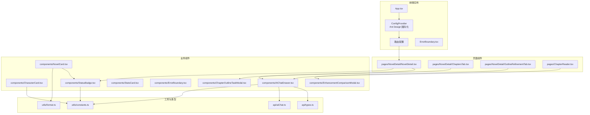
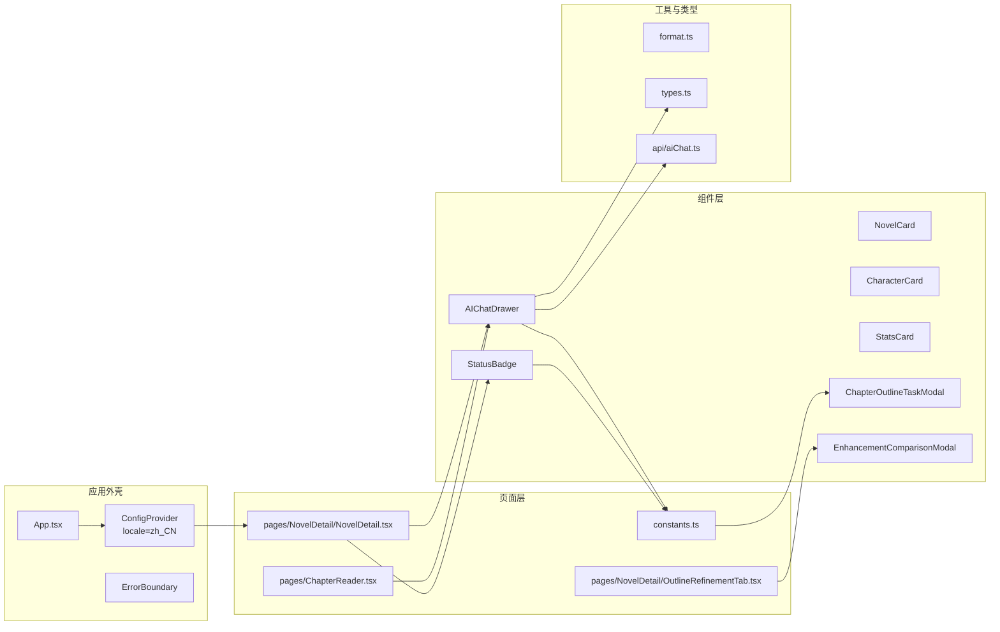
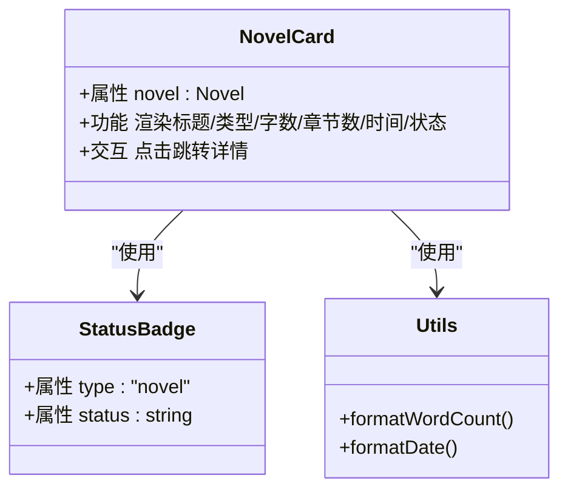
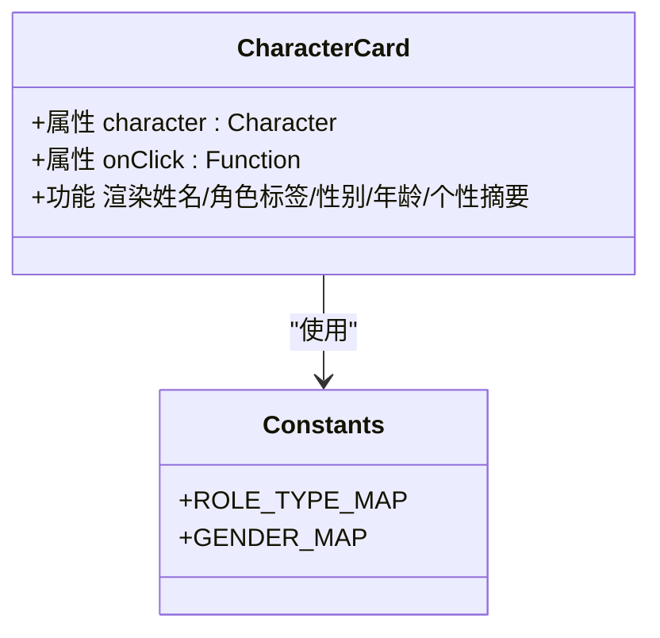
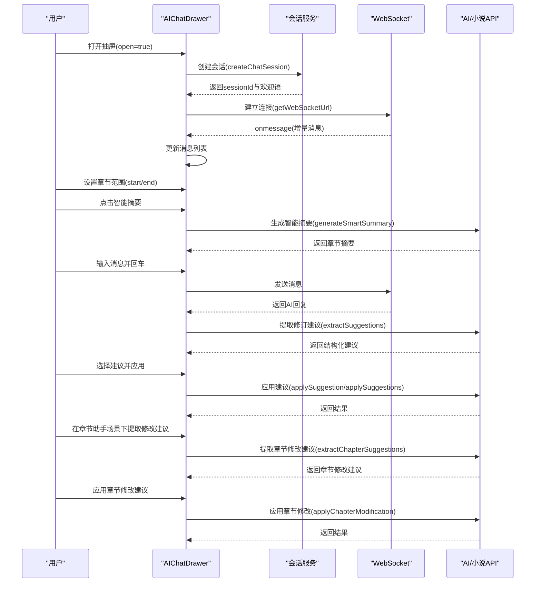
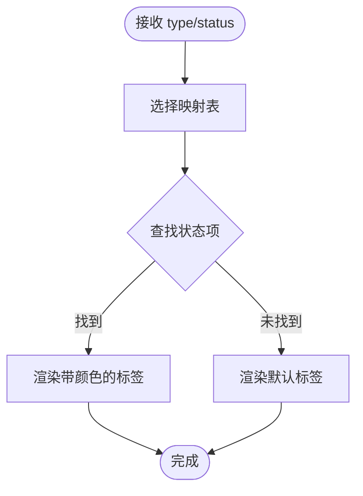
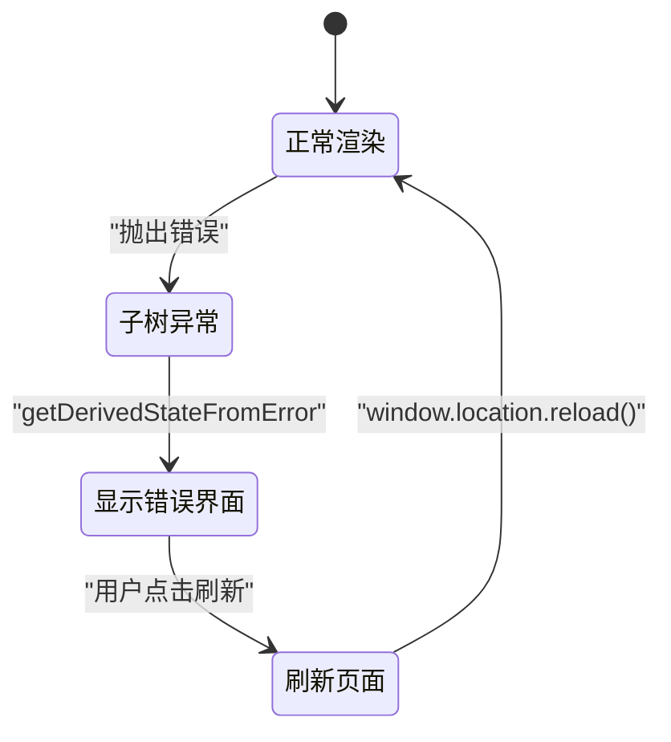
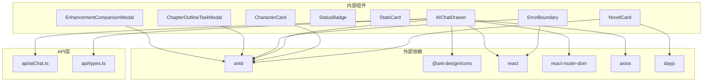

# UI组件库

<cite>
**本文引用的文件**
- [NovelCard.tsx](file://frontend/src/components/NovelCard.tsx)
- [CharacterCard.tsx](file://frontend/src/components/CharacterCard.tsx)
- [AIChatDrawer.tsx](file://frontend/src/components/AIChatDrawer.tsx)
- [ErrorBoundary.tsx](file://frontend/src/components/ErrorBoundary.tsx)
- [StatsCard.tsx](file://frontend/src/components/StatsCard.tsx)
- [StatusBadge.tsx](file://frontend/src/components/StatusBadge.tsx)
- [ChapterOutlineTaskModal.tsx](file://frontend/src/components/ChapterOutlineTaskModal.tsx)
- [EnhancementComparisonModal.tsx](file://frontend/src/components/EnhancementComparisonModal.tsx)
- [types.ts](file://frontend/src/api/types.ts)
- [aiChat.ts](file://frontend/src/api/aiChat.ts)
- [constants.ts](file://frontend/src/utils/constants.ts)
- [format.ts](file://frontend/src/utils/format.ts)
- [package.json](file://frontend/package.json)
- [vite.config.ts](file://frontend/vite.config.ts)
- [NovelList.tsx](file://frontend/src/pages/NovelList.tsx)
- [NovelDetail.tsx](file://frontend/src/pages/NovelDetail/NovelDetail.tsx)
- [ChaptersTab.tsx](file://frontend/src/pages/NovelDetail/ChaptersTab.tsx)
- [OutlineRefinementTab.tsx](file://frontend/src/pages/NovelDetail/OutlineRefinementTab.tsx)
- [ChapterReader.tsx](file://frontend/src/pages/ChapterReader.tsx)
- [App.tsx](file://frontend/src/App.tsx)
</cite>

## 更新摘要
**变更内容**
- 新增智能章节范围选择功能，支持精确控制AI分析的章节范围
- 新增智能摘要按钮，提供一键生成章节结构化摘要的能力
- 增强实时流式响应支持，优化WebSocket消息处理机制
- 完善修订建议提取与应用界面，支持结构化建议管理和批量应用
- 新增章节助手场景支持，包括章节修改建议提取和应用界面
- 新增章节任务模态框和增强对比模态框组件
- 优化AI助手的章节范围控制和智能摘要生成功能
- 新增章节修改建议的类型定义和API支持

## 目录
1. [引言](#引言)
2. [项目结构](#项目结构)
3. [核心组件](#核心组件)
4. [架构总览](#架构总览)
5. [组件详解](#组件详解)
6. [依赖关系分析](#依赖关系分析)
7. [性能考量](#性能考量)
8. [故障排查指南](#故障排查指南)
9. [结论](#结论)
10. [附录](#附录)

## 引言
本文件为小说系统的UI组件库开发指南，聚焦于Ant Design组件的集成与扩展，涵盖主题与样式定制、组件配置、业务组件设计规范、复用模式、测试策略以及可访问性支持。随着应用功能的增强，新增了智能章节范围选择、智能摘要生成、修订建议提取与应用、章节助手场景支持等高级功能，为用户提供更加智能化的小说创作体验。

## 项目结构
前端采用React + TypeScript + Vite搭建，Ant Design作为基础UI库，配合路由、国际化与Axios进行网络请求。组件集中在src/components目录，页面组件位于src/pages，类型定义在src/api/types.ts，通用常量与格式化工具位于src/utils。

**图表来源**
- [App.tsx:1-16](file://frontend/src/App.tsx#L1-L16)
- [NovelDetail.tsx:1-114](file://frontend/src/pages/NovelDetail/NovelDetail.tsx#L1-L114)
- [ChaptersTab.tsx:1-232](file://frontend/src/pages/NovelDetail/ChaptersTab.tsx#L1-L232)
- [OutlineRefinementTab.tsx:1-440](file://frontend/src/pages/NovelDetail/OutlineRefinementTab.tsx#L1-L440)
- [ChapterReader.tsx:1-193](file://frontend/src/pages/ChapterReader.tsx#L1-L193)
- [AIChatDrawer.tsx:1-1089](file://frontend/src/components/AIChatDrawer.tsx#L1-L1089)
- [ChapterOutlineTaskModal.tsx:1-179](file://frontend/src/components/ChapterOutlineTaskModal.tsx#L1-L179)
- [EnhancementComparisonModal.tsx:1-315](file://frontend/src/components/EnhancementComparisonModal.tsx#L1-L315)

**章节来源**
- [package.json:1-42](file://frontend/package.json#L1-L42)
- [vite.config.ts:1-23](file://frontend/vite.config.ts#L1-L23)

## 核心组件
本节对关键UI组件进行概览，说明其职责、Props接口、依赖关系与典型使用场景。

- **NovelCard**：展示小说条目，包含标题、类型、字数、章节数、创建时间与状态徽章；点击跳转详情页。
- **CharacterCard**：展示角色信息，含姓名、角色类型标签、性别/年龄、个性摘要等；支持点击回调。
- **AIChatDrawer**：右侧抽屉式AI对话与修订助手，支持会话管理、WebSocket流式输出、修订建议提取与应用、章节范围控制、智能摘要生成、章节助手场景支持等高级功能。
- **StatusBadge**：根据类型映射渲染不同状态标签，统一状态视觉规范。
- **StatsCard**：统计卡片，支持标题、数值与前缀图标及颜色配置。
- **ErrorBoundary**：类组件错误边界，捕获子树异常并提供刷新入口。
- **ChapterOutlineTaskModal**：章节大纲任务模态框，展示章节写作任务和要求。
- **EnhancementComparisonModal**：智能完善结果对比模态框，展示大纲优化前后的对比和质量评估。

**章节来源**
- [NovelCard.tsx:1-36](file://frontend/src/components/NovelCard.tsx#L1-L36)
- [CharacterCard.tsx:1-41](file://frontend/src/components/CharacterCard.tsx#L1-L41)
- [AIChatDrawer.tsx:1-1089](file://frontend/src/components/AIChatDrawer.tsx#L1-L1089)
- [StatusBadge.tsx:1-22](file://frontend/src/components/StatusBadge.tsx#L1-L22)
- [StatsCard.tsx:1-22](file://frontend/src/components/StatsCard.tsx#L1-L22)
- [ErrorBoundary.tsx:1-43](file://frontend/src/components/ErrorBoundary.tsx#L1-L43)
- [ChapterOutlineTaskModal.tsx:1-179](file://frontend/src/components/ChapterOutlineTaskModal.tsx#L1-L179)
- [EnhancementComparisonModal.tsx:1-315](file://frontend/src/components/EnhancementComparisonModal.tsx#L1-L315)

## 架构总览
下图展示了组件库在应用中的位置与交互路径，包括页面组件、业务组件、工具模块与API类型之间的关系。

**图表来源**
- [App.tsx:1-16](file://frontend/src/App.tsx#L1-L16)
- [NovelDetail.tsx:1-114](file://frontend/src/pages/NovelDetail/NovelDetail.tsx#L1-L114)
- [ChaptersTab.tsx:1-232](file://frontend/src/pages/NovelDetail/ChaptersTab.tsx#L1-L232)
- [OutlineRefinementTab.tsx:1-440](file://frontend/src/pages/NovelDetail/OutlineRefinementTab.tsx#L1-L440)
- [ChapterReader.tsx:1-193](file://frontend/src/pages/ChapterReader.tsx#L1-L193)
- [AIChatDrawer.tsx:1-1089](file://frontend/src/components/AIChatDrawer.tsx#L1-L1089)
- [ChapterOutlineTaskModal.tsx:1-179](file://frontend/src/components/ChapterOutlineTaskModal.tsx#L1-L179)
- [EnhancementComparisonModal.tsx:1-315](file://frontend/src/components/EnhancementComparisonModal.tsx#L1-L315)

## 组件详解

### NovelCard 小说卡片
- **设计目的**：以卡片形式呈现小说基本信息，支持点击跳转详情。
- **Props 接口**：接收小说对象，内部使用路由导航至详情页。
- **样式系统**：基于Ant Design Card与Typography，使用Space布局与状态徽章组合。
- **响应式适配**：卡片高度设置为100%，配合容器自适应。
- **依赖关系**：依赖StatusBadge与format工具函数；类型来自API类型定义。

**图表来源**
- [NovelCard.tsx:1-36](file://frontend/src/components/NovelCard.tsx#L1-L36)
- [StatusBadge.tsx:1-22](file://frontend/src/components/StatusBadge.tsx#L1-L22)
- [format.ts:1-23](file://frontend/src/utils/format.ts#L1-L23)
- [types.ts:1-352](file://frontend/src/api/types.ts#L1-L352)

**章节来源**
- [NovelCard.tsx:1-36](file://frontend/src/components/NovelCard.tsx#L1-L36)
- [types.ts:1-352](file://frontend/src/api/types.ts#L1-L352)
- [format.ts:1-23](file://frontend/src/utils/format.ts#L1-L23)

### CharacterCard 角色卡片
- **设计目的**：展示角色关键信息，支持点击回调。
- **Props 接口**：接收角色对象与可选点击回调；角色类型与性别映射来自常量表。
- **样式系统**：Ant Design Card/Tag/Typography/Space组合；个性文本支持省略与多行限制。
- **响应式适配**：小尺寸卡片与垂直间距控制，适合网格布局。
- **依赖关系**：依赖角色类型映射与性别映射。

**图表来源**
- [CharacterCard.tsx:1-41](file://frontend/src/components/CharacterCard.tsx#L1-L41)
- [constants.ts:1-39](file://frontend/src/utils/constants.ts#L1-L39)
- [types.ts:1-352](file://frontend/src/api/types.ts#L1-L352)

**章节来源**
- [CharacterCard.tsx:1-41](file://frontend/src/components/CharacterCard.tsx#L1-L41)
- [constants.ts:1-39](file://frontend/src/utils/constants.ts#L1-L39)
- [types.ts:1-352](file://frontend/src/api/types.ts#L1-L352)

### AIChatDrawer 聊天抽屉
- **设计目的**：提供AI对话、会话历史、修订建议提取与应用、章节范围控制、智能摘要生成、章节助手场景支持等高级功能。
- **Props 接口**：open、onClose、scene、novelId、novelTitle、chapterNumber、chapterTitle、chapterContent、onChapterModified。
- **状态管理**：会话ID、消息列表、输入值、历史会话、WebSocket引用、修订建议、目标选择、章节范围等。
- **增强功能**：
  - **智能章节范围选择**：支持设置起始和结束章节号，精确控制AI分析范围
  - **智能摘要生成**：一键生成章节结构化摘要，包含关键事件、情节概要、人物互动等
  - **实时流式响应**：通过WebSocket实现消息的增量更新，提供流畅的对话体验
  - **修订建议提取**：从AI回复中自动提取结构化修订建议，支持选择性应用
  - **章节助手场景**：新增chapter_assistant场景，支持章节修改建议提取和应用
  - **章节修改建议**：支持替换、插入、追加三种类型的章节修改建议
  - **批量应用功能**：支持多条建议的批量处理和单独应用
- **流程要点**：
  - 初始化会话并建立WebSocket连接，处理流式消息。
  - 支持键盘快捷键发送消息，加载历史会话与删除会话。
  - 修订建议：支持从AI回复中提取结构化建议，选择后应用到小说的世界观、角色或章节。
  - 章节范围：在修订/分析场景下允许设置起止章节号，配合智能摘要功能。
  - 章节助手：在chapter_assistant场景下，支持提取章节修改建议并直接应用到指定章节。
- **依赖关系**：依赖API模块（会话、消息、建议、修订、智能摘要、章节修改建议）、小说与章节列表查询、更新接口。

**图表来源**
- [AIChatDrawer.tsx:1-1089](file://frontend/src/components/AIChatDrawer.tsx#L1-L1089)
- [aiChat.ts:1-436](file://frontend/src/api/aiChat.ts#L1-L436)

**章节来源**
- [AIChatDrawer.tsx:1-1089](file://frontend/src/components/AIChatDrawer.tsx#L1-L1089)
- [aiChat.ts:1-436](file://frontend/src/api/aiChat.ts#L1-L436)

### StatusBadge 状态徽章
- **设计目的**：统一渲染不同实体的状态标签，支持小说、章节、任务三类映射。
- **Props 接口**：type（novel/chapter/task）、status（字符串）。
- **实现要点**：根据type选择对应映射表，若无匹配则回退显示原始状态。

**图表来源**
- [StatusBadge.tsx:1-22](file://frontend/src/components/StatusBadge.tsx#L1-L22)
- [constants.ts:1-39](file://frontend/src/utils/constants.ts#L1-L39)

**章节来源**
- [StatusBadge.tsx:1-22](file://frontend/src/components/StatusBadge.tsx#L1-L22)
- [constants.ts:1-39](file://frontend/src/utils/constants.ts#L1-L39)

### StatsCard 统计卡片
- **设计目的**：以卡片+统计组件展示指标标题、数值与前缀图标。
- **Props 接口**：title、value、icon、color。
- **使用建议**：统一颜色与图标风格，确保在不同背景下的可读性。

**章节来源**
- [StatsCard.tsx:1-22](file://frontend/src/components/StatsCard.tsx#L1-L22)

### ErrorBoundary 错误边界
- **设计目的**：捕获子树异常，提供错误提示与刷新入口。
- **实现要点**：使用静态getDerivedStateFromError与render分支返回错误界面。

**图表来源**
- [ErrorBoundary.tsx:1-43](file://frontend/src/components/ErrorBoundary.tsx#L1-L43)

**章节来源**
- [ErrorBoundary.tsx:1-43](file://frontend/src/components/ErrorBoundary.tsx#L1-L43)

### ChapterOutlineTaskModal 章节大纲任务模态框
- **设计目的**：展示章节写作任务和要求，帮助作者理解每章的写作重点。
- **Props 接口**：open、task、onConfirm、onCancel。
- **功能特性**：
  - 展示情感基调和张力位置的可视化图标
  - 列出强制性事件、可选事件和伏笔任务
  - 支持目标字数显示和任务确认
- **使用场景**：在章节写作前向作者展示具体的写作指导。

**章节来源**
- [ChapterOutlineTaskModal.tsx:1-179](file://frontend/src/components/ChapterOutlineTaskModal.tsx#L1-L179)

### EnhancementComparisonModal 智能完善结果对比模态框
- **设计目的**：展示大纲智能完善前后的对比结果，提供质量评估和改进建议。
- **Props 接口**：visible、onClose、originalOutline、enhancedOutline、qualityComparison、improvementsMade、processingTime、costEstimate、onApply。
- **功能特性**：
  - 内容对比：左右对比原始和优化后的大纲内容
  - 质量评估：展示整体评分变化和各维度提升
  - 优化摘要：列出主要改进点和处理信息
- **使用场景**：在大纲智能完善完成后向作者展示优化效果。

**章节来源**
- [EnhancementComparisonModal.tsx:1-315](file://frontend/src/components/EnhancementComparisonModal.tsx#L1-L315)

## 依赖关系分析
- **组件间依赖**：NovelCard依赖StatusBadge与format工具；CharacterCard依赖常量映射；AIChatDrawer依赖API类型与常量；ErrorBoundary包裹应用根节点。
- **外部依赖**：Ant Design、Ant Design Icons、React、React Router、Axios、Day.js。
- **构建与代理**：Vite配置别名@指向src，开发服务器代理/api到后端8000端口。
- **新增API依赖**：AIChatDrawer新增依赖aiChat.ts中的智能摘要、修订建议、章节修改建议API。

**图表来源**
- [package.json:1-42](file://frontend/package.json#L1-L42)
- [NovelCard.tsx:1-36](file://frontend/src/components/NovelCard.tsx#L1-L36)
- [CharacterCard.tsx:1-41](file://frontend/src/components/CharacterCard.tsx#L1-L41)
- [AIChatDrawer.tsx:1-1089](file://frontend/src/components/AIChatDrawer.tsx#L1-L1089)
- [ChapterOutlineTaskModal.tsx:1-179](file://frontend/src/components/ChapterOutlineTaskModal.tsx#L1-L179)
- [EnhancementComparisonModal.tsx:1-315](file://frontend/src/components/EnhancementComparisonModal.tsx#L1-L315)
- [StatusBadge.tsx:1-22](file://frontend/src/components/StatusBadge.tsx#L1-L22)
- [StatsCard.tsx:1-22](file://frontend/src/components/StatsCard.tsx#L1-L22)
- [ErrorBoundary.tsx:1-43](file://frontend/src/components/ErrorBoundary.tsx#L1-L43)
- [aiChat.ts:1-436](file://frontend/src/api/aiChat.ts#L1-L436)

**章节来源**
- [package.json:1-42](file://frontend/package.json#L1-L42)
- [vite.config.ts:1-23](file://frontend/vite.config.ts#L1-L23)

## 性能考量
- **渲染优化**
  - 使用Ant Design的Card与Space组件减少重复布局计算，避免过度嵌套。
  - NovelCard与CharacterCard在列表中复用时，保持稳定的key（如id），提升列表重渲染效率。
  - AIChatDrawer中的建议列表使用虚拟滚动和条件渲染，优化大数据量显示。
- **网络与流式**
  - AIChatDrawer通过WebSocket增量更新消息，避免全量替换DOM；滚动到底部使用ref与平滑滚动，减少重排。
  - 智能摘要功能支持缓存机制，避免重复生成相同内容。
  - 建议在消息较多时启用虚拟滚动（如Ant Design List的虚拟化能力）进一步优化。
- **状态管理**
  - 使用React状态钩子管理复杂的UI状态，避免不必要的重渲染。
  - 模态框组件采用条件渲染，只在需要时创建DOM节点。
- **样式与主题**
  - Ant Design内置主题变量可通过ConfigProvider进行全局覆盖，建议在开发环境统一管理变量，避免散落覆盖导致的样式冲突。
- **资源与体积**
  - 按需引入Ant Design图标与组件，避免打包冗余；结合Tree Shaking与懒加载页面组件。

## 故障排查指南
- **抽屉无法打开或会话初始化失败**
  - 检查open状态与scene参数是否正确传递；确认API返回的sessionId与welcome_message。
  - 若WebSocket连接失败，检查代理配置与后端服务连通性。
- **智能摘要生成失败**
  - 确认novelId存在且后端支持generateSmartSummary接口；检查章节范围设置是否合理。
  - 查看控制台错误日志与消息提示，确认章节内容是否完整。
- **修订建议未提取或应用失败**
  - 确认novelId存在且后端支持extractSuggestions与applySuggestion接口；查看控制台错误日志与消息提示。
  - 检查AI回复内容格式，确保符合建议提取的预期格式。
- **章节范围选择异常**
  - 确认起始章节号不大于结束章节号；检查章节列表获取是否成功。
  - 验证章节范围参数是否正确传递给后端API。
- **章节修改建议提取失败**
  - 确认novelId和chapterNumber都存在；检查extractChapterSuggestions接口是否可用。
  - 验证AI回复内容格式，确保符合章节修改建议提取的预期格式。
- **章节修改建议应用失败**
  - 确认applyChapterModification接口调用成功；检查返回的old_word_count和new_word_count。
  - 验证章节修改的置信度和位置信息是否正确。
- **状态徽章显示异常**
  - 检查传入的type与status是否在映射表中；若不存在，组件将回退显示原始状态。
- **页面崩溃**
  - ErrorBoundary会捕获异常并提供刷新入口；若仍无法恢复，检查控制台错误堆栈定位具体组件。

**章节来源**
- [AIChatDrawer.tsx:1-1089](file://frontend/src/components/AIChatDrawer.tsx#L1-L1089)
- [aiChat.ts:1-436](file://frontend/src/api/aiChat.ts#L1-L436)
- [StatusBadge.tsx:1-22](file://frontend/src/components/StatusBadge.tsx#L1-L22)
- [ErrorBoundary.tsx:1-43](file://frontend/src/components/ErrorBoundary.tsx#L1-L43)

## 结论
本UI组件库以Ant Design为基础，围绕小说业务场景提供了卡片、徽章、统计、抽屉与错误边界等核心组件。通过清晰的Props设计、统一的状态映射与格式化工具、完善的会话与修订流程，实现了良好的可维护性与扩展性。新增的智能章节范围选择、智能摘要生成、修订建议提取与应用、章节助手场景支持等高级功能，显著提升了用户体验和创作效率。特别是章节助手场景的引入，为作者提供了更精准的章节修改支持，包括章节修改建议的提取和应用界面。建议后续完善Storybook文档、自动化测试与可访问性支持，持续提升组件质量与团队协作效率。

## 附录

### 设计规范与最佳实践
- **Props接口设计**
  - 明确必填/可选字段，提供合理默认值；避免过宽的联合类型，必要时拆分接口。
  - 对外暴露的回调函数（如onClick）应明确参数与返回值。
  - 新增的异步操作应提供loading状态和错误处理。
- **事件处理**
  - 表单与输入框使用受控组件；键盘事件（如回车发送）需考虑跨平台差异。
  - 智能摘要和修订建议等异步操作应提供加载状态反馈。
- **样式系统**
  - 优先使用Ant Design组件的size、strong、type等属性；自定义样式尽量局部作用域化，避免全局污染。
  - 模态框组件应提供合适的宽度和最大高度，确保在不同设备上的良好体验。
- **响应式适配**
  - 在卡片与表格中使用Flex/Space布局，保证在窄屏下的可读性与紧凑性。
  - 智能摘要和修订建议列表应支持滚动和折叠功能。
- **可访问性**
  - 为按钮与链接提供aria-label；确保键盘可达；为图片提供alt或占位；为动态内容提供屏幕阅读器友好的提示。
  - 模态框应提供适当的焦点管理和关闭方式。

### 复用模式
- **高阶组件（HOC）**：适用于横切关注点（如权限校验、埋点），但当前组件库以函数组件为主，推荐使用Hook抽象。
- **Render Props**：在复杂布局场景中可考虑，但需注意可读性与调试成本。
- **Hooks抽象**：将状态与副作用抽取为自定义Hook（如usePolling），提升组件内聚性与可测试性。
- **组件组合**：通过多个小型组件的组合实现复杂功能，如AIChatDrawer中的多个模态框组件。

### 测试策略
- **单元测试**
  - 使用React Testing Library或Jest测试组件渲染、Props变化与事件触发。
  - 测试AIChatDrawer的WebSocket连接、消息处理和状态管理逻辑。
  - 特别测试章节助手场景的功能，包括章节修改建议的提取和应用。
- **快照测试**
  - 对稳定UI结构进行快照对比，防止意外样式回归。
  - 测试智能摘要和修订建议的UI展示效果。
  - 测试章节修改建议模态框的界面展示。
- **交互测试**
  - 使用Playwright/Cypress进行端到端交互验证，覆盖关键流程（如创建小说、AI抽屉交互、状态切换）。
  - 测试智能摘要生成、修订建议提取和应用的完整流程。
  - 测试章节助手场景的完整工作流程，包括建议提取、选择和应用。
- **文档与可访问性**
  - Storybook集成：为每个组件编写stories，包含不同Props组合与交互示例；开启可访问性检查。
  - 可访问性：确保颜色对比度、焦点顺序、ARIA属性正确；提供键盘操作路径。

### 主题定制与样式覆盖
- **Ant Design主题**
  - 通过ConfigProvider的theme或token覆盖全局样式变量；在开发环境集中管理变量，便于版本升级。
- **组件级覆盖**
  - 使用CSS-in-JS或CSS模块在组件内部进行局部覆盖，避免影响全局。
- **动态主题**
  - 结合用户偏好与系统主题，动态切换ConfigProvider的token或className。

### 组件文档生成与Storybook集成
- **Storybook配置**
  - 安装@storybook/react与配套插件；配置主文件、预设与框架；为每个组件创建stories文件。
- **文档编写**
  - 使用MDX编写组件文档，包含Props说明、使用示例、注意事项与可访问性提示。
  - 为新增的智能功能和章节助手场景提供详细的使用指南和最佳实践。
- **自动化**
  - CI中集成Storybook构建与部署，确保文档与代码同步。

### 新功能扩展指南
- **智能摘要功能**
  - 支持章节范围选择和智能摘要生成，提供结构化的章节内容摘要。
  - 实现缓存机制，避免重复生成相同内容。
- **修订建议管理**
  - 提供结构化建议提取、选择性应用和批量处理功能。
  - 支持角色和章节目标的选择，确保建议应用的准确性。
- **章节助手场景**
  - 新增chapter_assistant场景，支持章节修改建议的提取和应用。
  - 支持替换、插入、追加三种类型的章节修改建议。
  - 提供章节修改建议的详细信息，包括置信度、原因和修改前后内容对比。
- **流式响应优化**
  - 通过WebSocket实现消息的增量更新，提供流畅的对话体验。
  - 实现消息状态管理和错误处理机制。
- **模态框组件**
  - 设计专门的模态框组件处理复杂的用户交互场景。
  - 提供一致的样式和交互模式，确保用户体验的一致性。