# 增强对比模态框

<cite>
**本文档引用的文件**
- [EnhancementComparisonModal.tsx](file://frontend/src/components/EnhancementComparisonModal.tsx)
- [generation.py](file://backend/api/v1/generation.py)
- [generation_service.py](file://backend/services/generation_service.py)
- [types.ts](file://frontend/src/api/types.ts)
- [OutlineRefinementTab.tsx](file://frontend/src/pages/NovelDetail/OutlineRefinementTab.tsx)
- [useGenerationStore.ts](file://frontend/src/stores/useGenerationStore.ts)
- [outline_quality_evaluator.py](file://agents/outline_quality_evaluator.py)
- [outline_refiner.py](file://agents/outline_refiner.py)
- [outlines.py](file://backend/api/v1/outlines.py)
</cite>

## 目录
1. [简介](#简介)
2. [项目结构](#项目结构)
3. [核心组件](#核心组件)
4. [架构概览](#架构概览)
5. [详细组件分析](#详细组件分析)
6. [依赖关系分析](#依赖关系分析)
7. [性能考虑](#性能考虑)
8. [故障排除指南](#故障排除指南)
9. [结论](#结论)

## 简介

增强对比模态框是小说创作系统中的一个关键功能组件，它为用户提供了一个直观的界面来查看和比较大纲优化前后的差异。该模态框不仅展示了具体的文本变更，还提供了质量评分对比、处理信息统计和优化摘要等高级功能。

这个组件实现了以下核心功能：
- 实时内容对比显示
- 质量评分变化可视化
- 处理时间和成本估算
- 用户友好的交互体验
- 多维度的质量评估

## 项目结构

小说系统采用前后端分离的架构设计，增强对比模态框位于前端组件层，负责用户界面展示和交互逻辑。

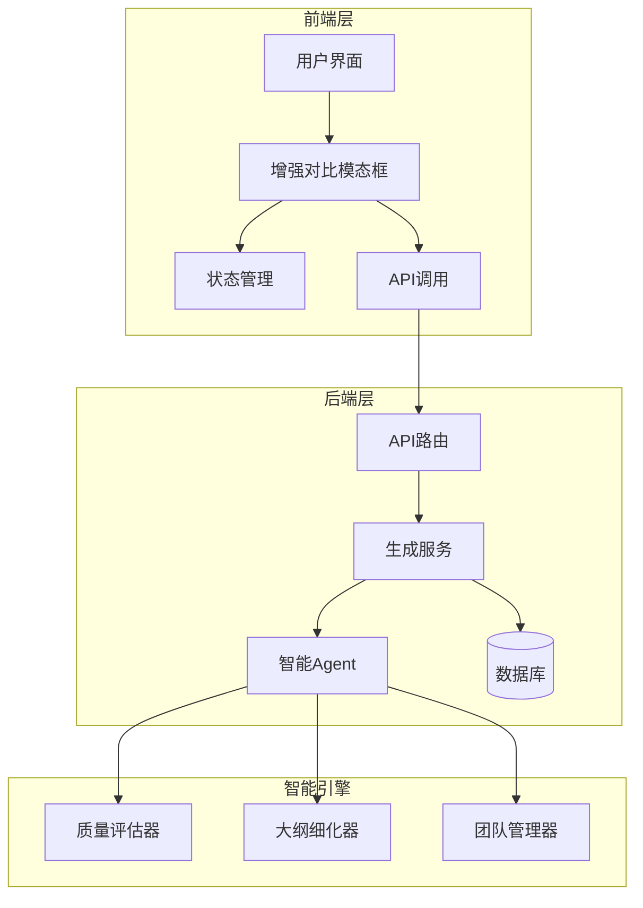

**图表来源**
- [EnhancementComparisonModal.tsx:1-315](file://frontend/src/components/EnhancementComparisonModal.tsx#L1-L315)
- [generation_service.py:312-517](file://backend/services/generation_service.py#L312-L517)

## 核心组件

增强对比模态框由多个精心设计的组件构成，每个组件都有明确的职责和功能：

### 主要组件架构

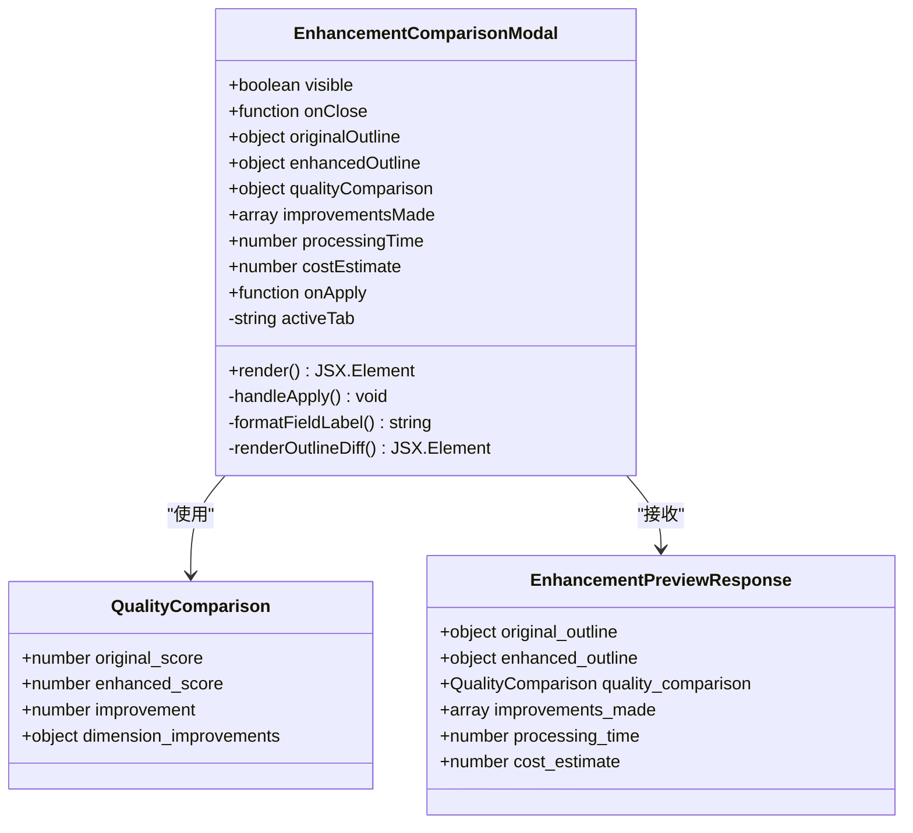

**图表来源**
- [EnhancementComparisonModal.tsx:25-35](file://frontend/src/components/EnhancementComparisonModal.tsx#L25-L35)
- [types.ts:354-366](file://frontend/src/api/types.ts#L354-L366)

### 数据流架构

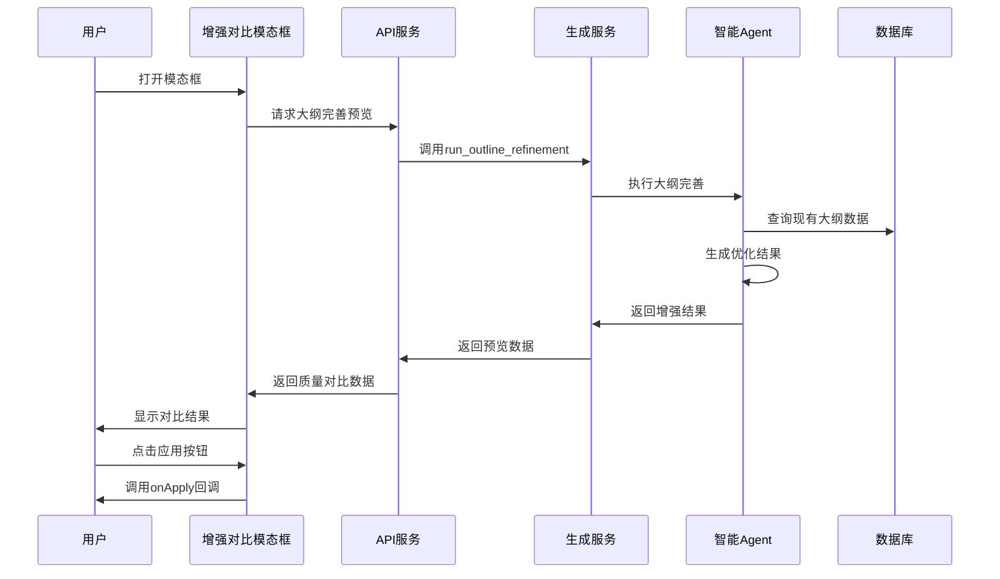

**图表来源**
- [generation.py:121-131](file://backend/api/v1/generation.py#L121-L131)
- [generation_service.py:434-442](file://backend/services/generation_service.py#L434-L442)

**章节来源**
- [EnhancementComparisonModal.tsx:1-315](file://frontend/src/components/EnhancementComparisonModal.tsx#L1-L315)
- [types.ts:354-366](file://frontend/src/api/types.ts#L354-L366)

## 架构概览

增强对比模态框在整个系统架构中扮演着重要的桥梁角色，连接了用户界面、业务逻辑和智能算法。

### 系统架构图

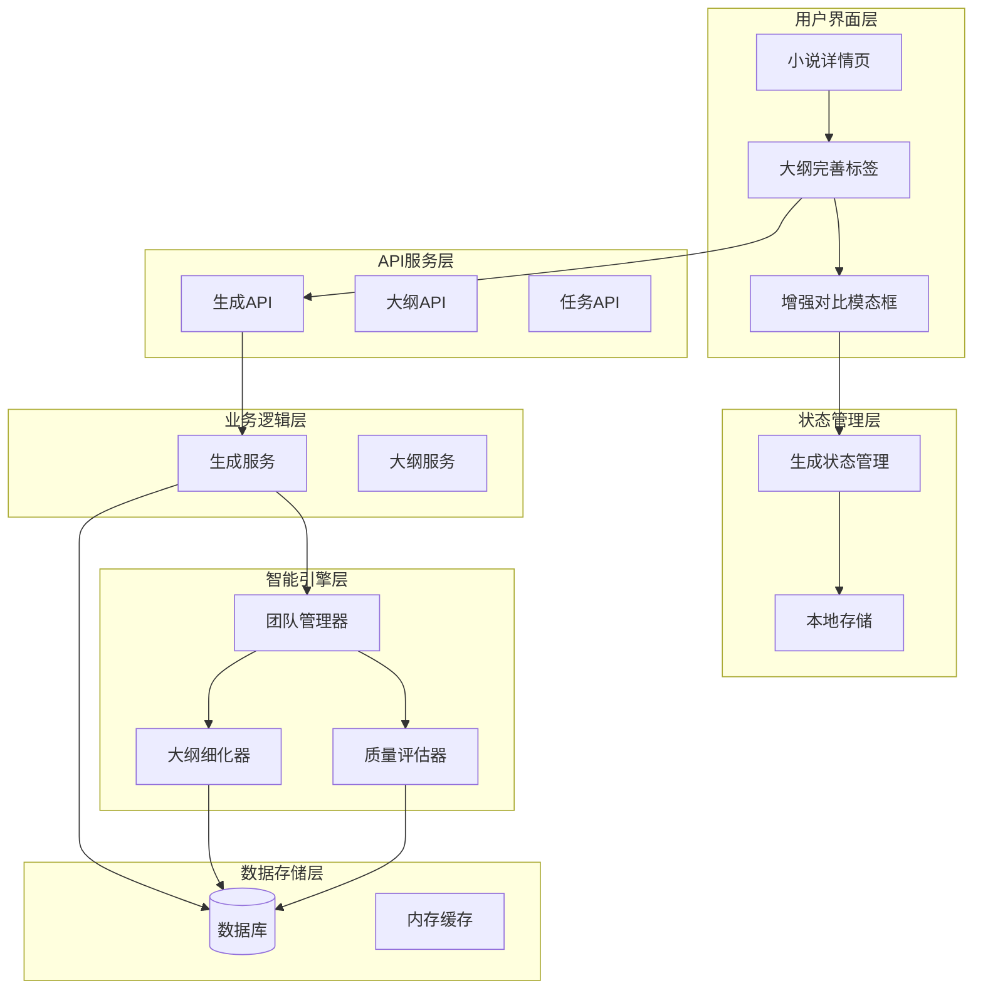

**图表来源**
- [OutlineRefinementTab.tsx:57-102](file://frontend/src/pages/NovelDetail/OutlineRefinementTab.tsx#L57-L102)
- [useGenerationStore.ts:22-72](file://frontend/src/stores/useGenerationStore.ts#L22-L72)

## 详细组件分析

### 增强对比模态框组件

增强对比模态框是一个高度模块化的React组件，采用了现代化的UI设计原则和用户体验优化。

#### 组件结构分析

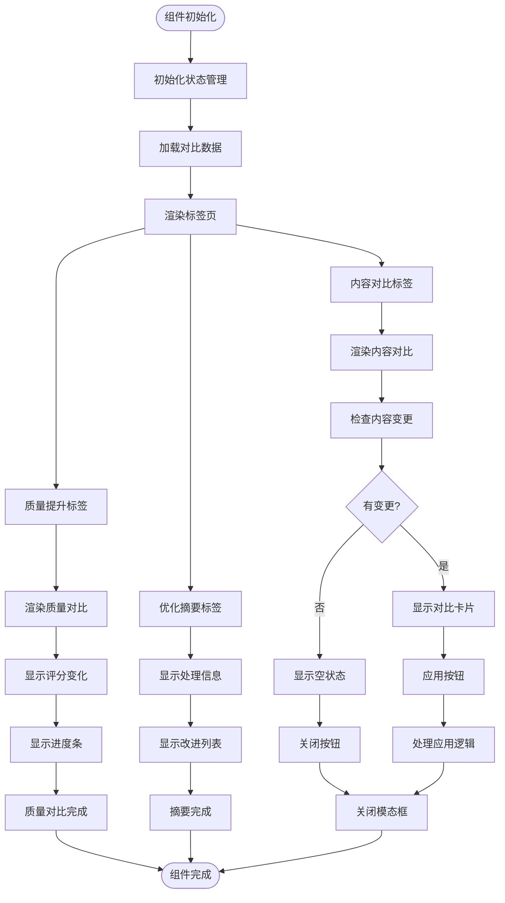

**图表来源**
- [EnhancementComparisonModal.tsx:48-53](file://frontend/src/components/EnhancementComparisonModal.tsx#L48-L53)

#### 核心功能实现

##### 内容对比功能

内容对比功能是模态框的核心特性，它能够直观地展示优化前后的差异：

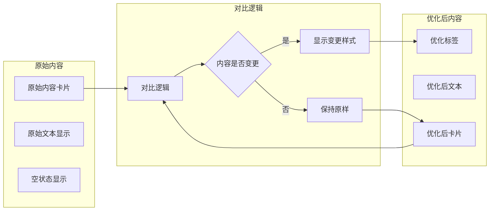

**图表来源**
- [EnhancementComparisonModal.tsx:69-123](file://frontend/src/components/EnhancementComparisonModal.tsx#L69-L123)

##### 质量评估功能

质量评估功能提供了多维度的质量对比分析：

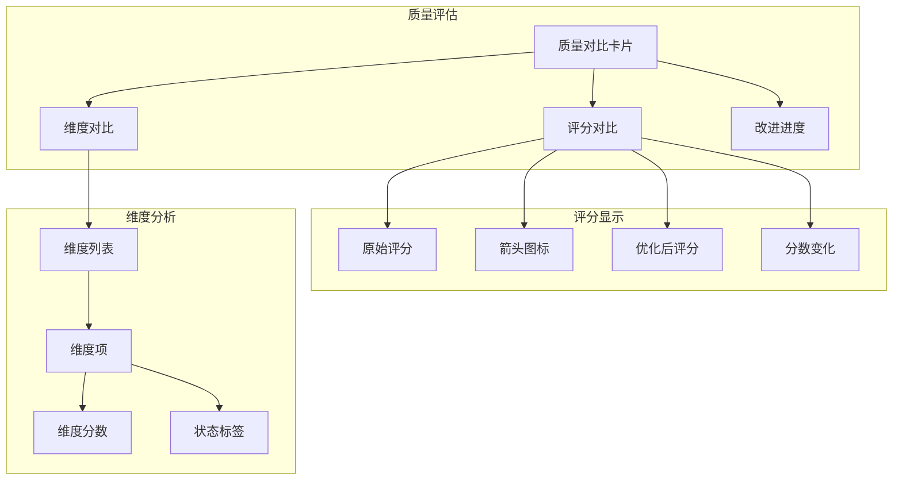

**图表来源**
- [EnhancementComparisonModal.tsx:189-269](file://frontend/src/components/EnhancementComparisonModal.tsx#L189-L269)

**章节来源**
- [EnhancementComparisonModal.tsx:1-315](file://frontend/src/components/EnhancementComparisonModal.tsx#L1-L315)

### 后端服务集成

增强对比模态框与后端服务的集成体现了良好的分层架构设计。

#### API集成流程

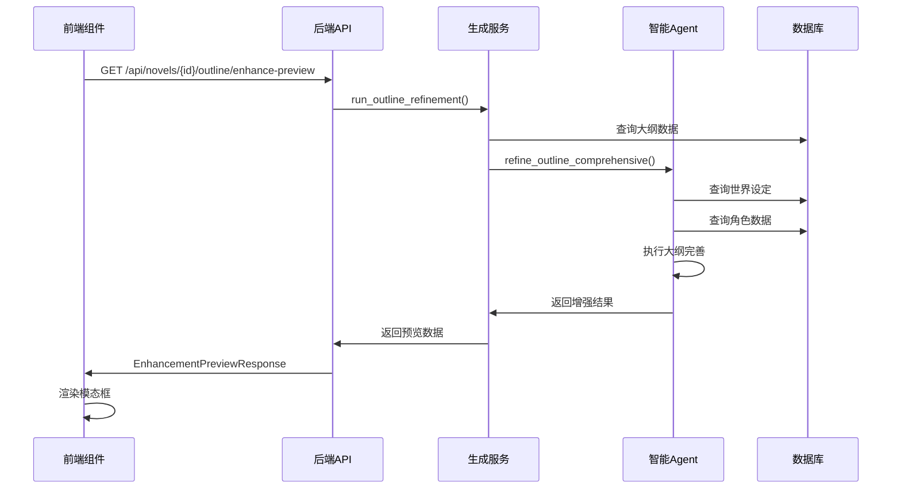

**图表来源**
- [outlines.py:576-603](file://backend/api/v1/outlines.py#L576-L603)
- [generation_service.py:434-442](file://backend/services/generation_service.py#L434-L442)

#### 数据传输协议

增强对比模态框使用标准化的数据传输协议来确保前后端数据的一致性：

| 字段名称 | 类型 | 描述 | 必填 |
|---------|------|------|------|
| original_outline | PlotOutline | 原始大纲数据 | 是 |
| enhanced_outline | PlotOutline | 增强后的大纲 | 是 |
| quality_comparison | object | 质量对比数据 | 是 |
| improvements_made | array | 实施的改进措施 | 是 |
| processing_time | number | 处理耗时（秒） | 是 |
| cost_estimate | number | 预估成本（元） | 是 |

**章节来源**
- [types.ts:354-366](file://frontend/src/api/types.ts#L354-L366)
- [generation_service.py:453-461](file://backend/services/generation_service.py#L453-L461)

### 智能算法集成

增强对比模态框集成了先进的AI算法来提供智能化的大纲优化服务。

#### 质量评估算法

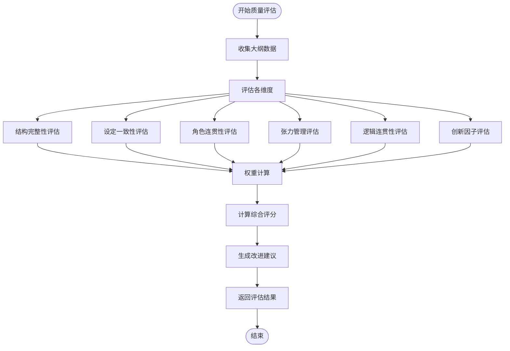

**图表来源**
- [outline_quality_evaluator.py:105-142](file://agents/outline_quality_evaluator.py#L105-L142)

#### 大纲细化算法

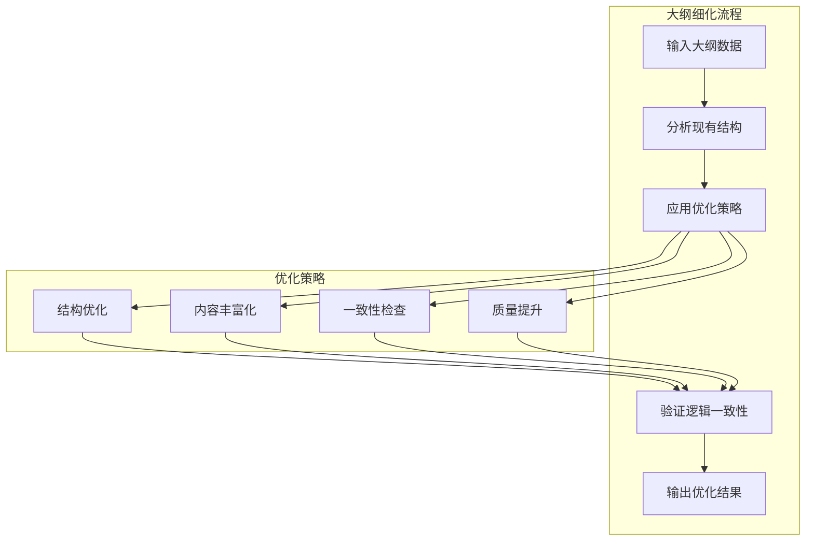

**图表来源**
- [outline_refiner.py:31-80](file://agents/outline_refiner.py#L31-L80)

**章节来源**
- [outline_quality_evaluator.py:1-200](file://agents/outline_quality_evaluator.py#L1-L200)
- [outline_refiner.py:1-200](file://agents/outline_refiner.py#L1-L200)

## 依赖关系分析

增强对比模态框的依赖关系体现了清晰的分层架构和模块化设计。

### 前端依赖关系

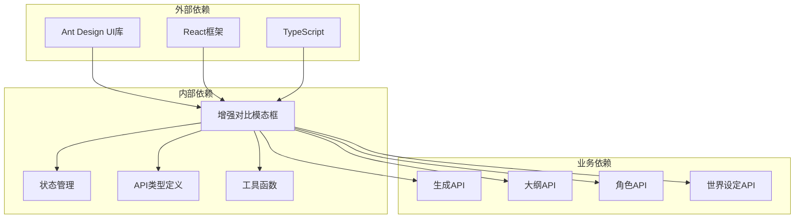

**图表来源**
- [EnhancementComparisonModal.tsx:1-25](file://frontend/src/components/EnhancementComparisonModal.tsx#L1-L25)

### 后端依赖关系

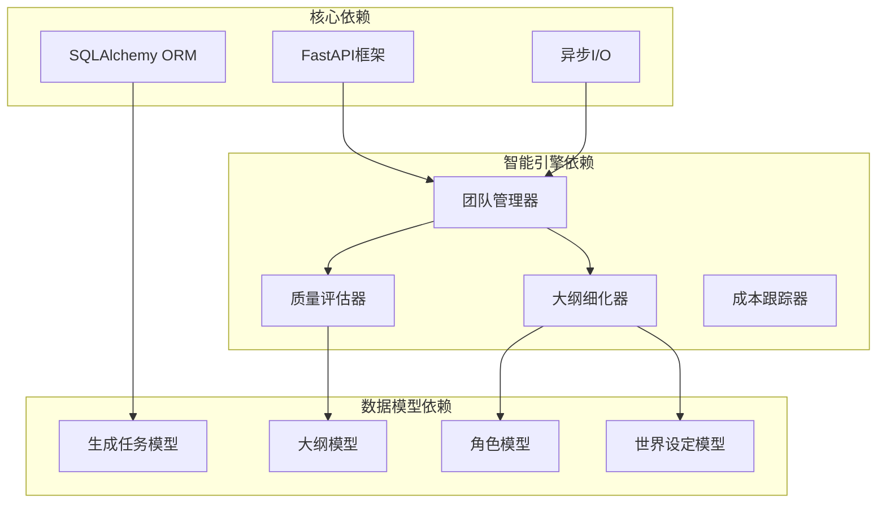

**图表来源**
- [generation_service.py:1-50](file://backend/services/generation_service.py#L1-L50)

**章节来源**
- [EnhancementComparisonModal.tsx:1-35](file://frontend/src/components/EnhancementComparisonModal.tsx#L1-L35)
- [generation_service.py:1-100](file://backend/services/generation_service.py#L1-L100)

## 性能考虑

增强对比模态框在设计时充分考虑了性能优化，采用了多种策略来确保良好的用户体验。

### 性能优化策略

#### 渲染优化

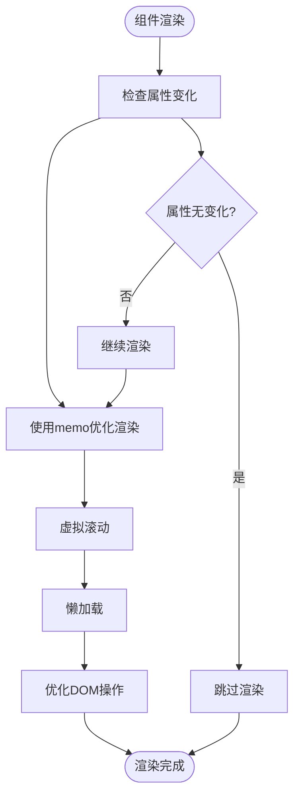

#### 数据处理优化

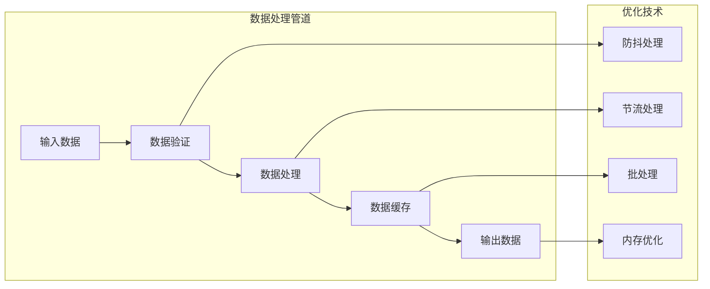

### 性能监控指标

| 指标名称 | 目标值 | 监控方式 | 优化策略 |
|---------|--------|----------|----------|
| 组件渲染时间 | < 100ms | React DevTools | 使用memo和lazy加载 |
| 内存使用 | < 50MB | 浏览器开发者工具 | 优化数据结构和垃圾回收 |
| API响应时间 | < 2s | 网络面板 | 缓存和预加载策略 |
| 用户交互延迟 | < 100ms | 性能面板 | 防抖和节流处理 |

## 故障排除指南

增强对比模态框可能遇到的各种问题及其解决方案：

### 常见问题及解决方案

#### 模态框无法打开

**问题症状**：点击按钮后模态框不显示

**可能原因**：
1. `visible` 属性未正确设置
2. 父组件状态管理错误
3. 样式冲突导致隐藏

**解决步骤**：
1. 检查父组件传入的 `visible` prop
2. 验证状态管理逻辑
3. 检查CSS样式冲突
4. 查看浏览器控制台错误

#### 内容对比显示异常

**问题症状**：对比结果显示为空或格式错误

**可能原因**：
1. 数据格式不正确
2. 字段映射错误
3. 编码问题

**解决步骤**：
1. 验证数据结构完整性
2. 检查字段映射配置
3. 确认字符编码设置
4. 查看网络请求响应

#### 质量评估数据缺失

**问题症状**：质量评分和维度信息显示为undefined

**可能原因**：
1. API调用失败
2. 数据处理错误
3. 缓存问题

**解决步骤**：
1. 检查API响应状态
2. 验证数据处理逻辑
3. 清除并重建缓存
4. 查看后端日志

### 调试工具和技巧

#### 前端调试

```javascript
// 开启详细日志
console.log('EnhancementComparisonModal props:', props);

// 检查数据结构
console.log('Original outline keys:', Object.keys(originalOutline));
console.log('Enhanced outline keys:', Object.keys(enhancedOutline));

// 验证数据类型
console.log('Quality comparison type:', typeof qualityComparison);
console.log('Improvements made type:', Array.isArray(improvementsMade));
```

#### 后端调试

```python
# 增加详细日志
logger.info(f"Enhancement result: {enhancement_result}")
logger.info(f"Quality comparison: {quality_comparison}")

# 检查数据完整性
if not enhancement_result or "enhancement_result" not in enhancement_result:
    logger.error("Invalid enhancement result structure")
```

**章节来源**
- [EnhancementComparisonModal.tsx:1-50](file://frontend/src/components/EnhancementComparisonModal.tsx#L1-L50)
- [generation_service.py:506-516](file://backend/services/generation_service.py#L506-L516)

## 结论

增强对比模态框作为小说创作系统的重要组成部分，展现了现代Web应用开发的最佳实践。它不仅提供了强大的功能特性，还在用户体验、性能优化和可维护性方面达到了很高的水准。

### 主要成就

1. **用户友好性**：直观的界面设计和流畅的交互体验
2. **功能完整性**：全面的内容对比、质量评估和优化建议
3. **技术先进性**：集成AI智能算法和现代化的开发技术栈
4. **性能优化**：高效的渲染机制和数据处理策略
5. **可扩展性**：清晰的架构设计支持未来的功能扩展

### 未来发展方向

1. **AI能力增强**：集成更先进的自然语言处理技术
2. **个性化定制**：支持用户自定义评估维度和优化策略
3. **实时协作**：支持多人协作和实时编辑功能
4. **移动端优化**：提升移动设备上的用户体验
5. **数据分析**：提供更深入的创作数据分析和洞察

增强对比模态框的成功实现为整个小说创作系统奠定了坚实的技术基础，也为用户提供了卓越的创作辅助工具。通过持续的优化和功能扩展，它将继续为创作者提供价值，推动小说创作效率和质量的提升。