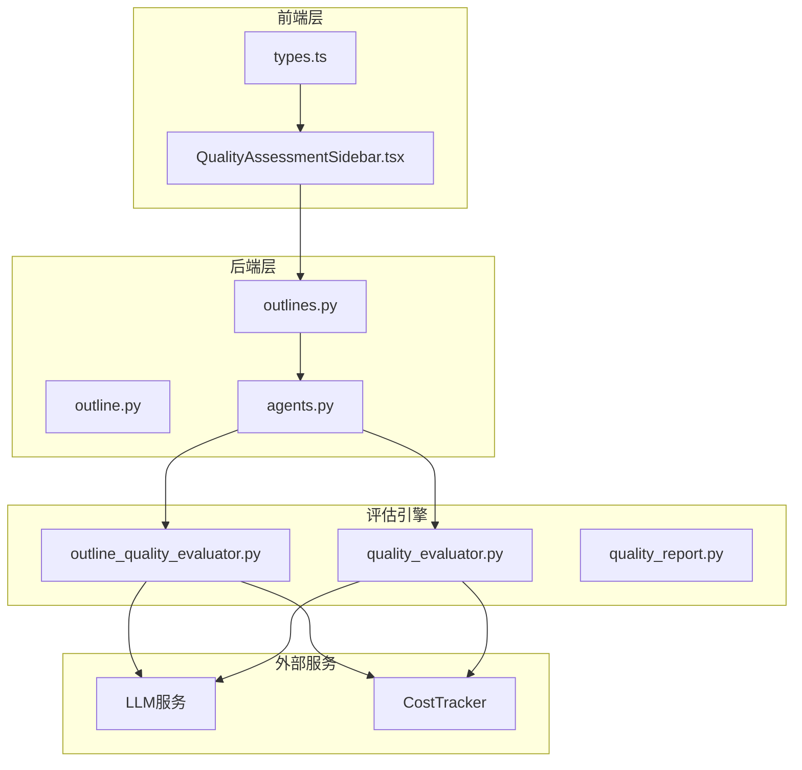
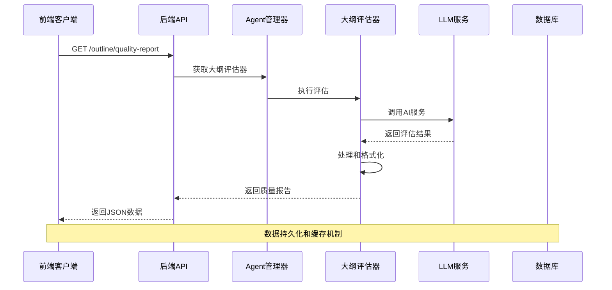
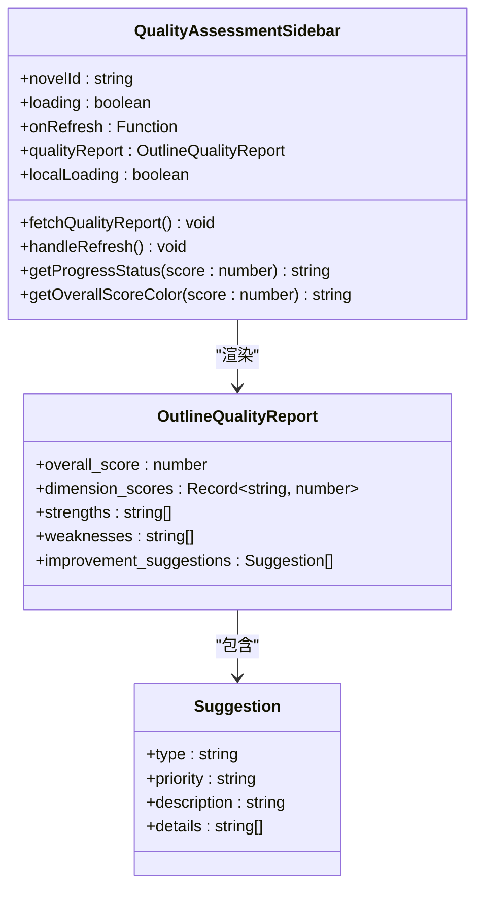
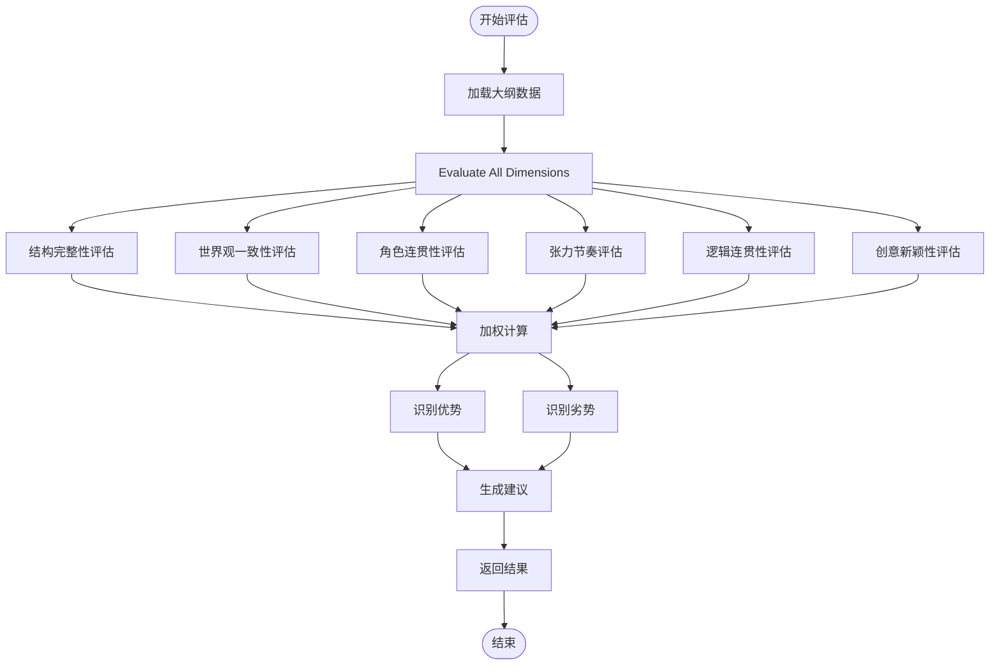
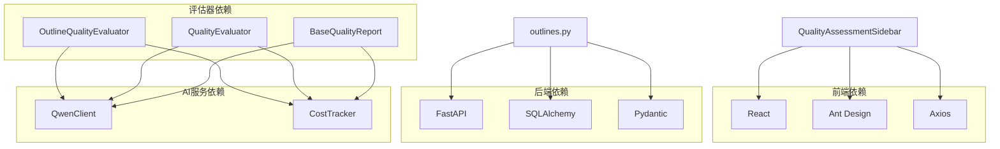

# 质量评估侧边栏

<cite>
**本文档引用的文件**
- [QualityAssessmentSidebar.tsx](file://frontend/src/components/QualityAssessmentSidebar.tsx)
- [outline_quality_evaluator.py](file://agents/outline_quality_evaluator.py)
- [quality_evaluator.py](file://agents/quality_evaluator.py)
- [outlines.py](file://backend/api/v1/outlines.py)
- [outline.py](file://backend/schemas/outline.py)
- [types.ts](file://frontend/src/api/types.ts)
- [agents.py](file://backend/dependencies/agents.py)
- [quality_report.py](file://agents/base/quality_report.py)
</cite>

## 目录
1. [简介](#简介)
2. [项目结构](#项目结构)
3. [核心组件](#核心组件)
4. [架构概览](#架构概览)
5. [详细组件分析](#详细组件分析)
6. [依赖关系分析](#依赖关系分析)
7. [性能考虑](#性能考虑)
8. [故障排除指南](#故障排除指南)
9. [结论](#结论)

## 简介

质量评估侧边栏是小说生成系统中的一个重要功能模块，为用户提供实时的大纲质量评估和改进建议。该系统采用前后端分离的架构设计，前端负责用户界面展示，后端提供API服务和质量评估功能。

系统支持六个核心评估维度：结构完整性、世界观一致性、角色连贯性、张力控制、逻辑连贯性和创新性。每个维度都有对应的权重分配和评分标准，帮助作者全面了解作品质量状况。

## 项目结构

质量评估系统由三个主要层次组成：



**图表来源**
- [QualityAssessmentSidebar.tsx:1-282](file://frontend/src/components/QualityAssessmentSidebar.tsx#L1-L282)
- [outlines.py:1-670](file://backend/api/v1/outlines.py#L1-L670)
- [outline_quality_evaluator.py:1-440](file://agents/outline_quality_evaluator.py#L1-L440)

**章节来源**
- [QualityAssessmentSidebar.tsx:1-282](file://frontend/src/components/QualityAssessmentSidebar.tsx#L1-L282)
- [outlines.py:1-670](file://backend/api/v1/outlines.py#L1-L670)

## 核心组件

### 前端组件

质量评估侧边栏组件是整个系统的核心UI组件，具有以下特点：

- **响应式设计**：支持不同屏幕尺寸的显示
- **实时更新**：自动获取最新的质量评估数据
- **交互友好**：提供刷新、加载状态等用户体验
- **可视化展示**：使用进度条、标签等直观展示评估结果

### 后端API

后端提供RESTful API接口，支持大纲质量评估的完整生命周期：

- **GET /api/novels/{novel_id}/outline/quality-report**：获取质量评估报告
- **POST /api/novels/{novel_id}/outline/enhance-preview**：预览大纲优化效果
- **POST /api/novels/{novel_id}/outline/{outline_id}/apply-enhancement**：应用优化结果

### 评估引擎

系统包含两个主要的评估器：

1. **大纲质量评估器**：专门针对小说大纲进行全面评估
2. **章节质量评估器**：针对单个章节内容进行详细分析

**章节来源**
- [QualityAssessmentSidebar.tsx:48-282](file://frontend/src/components/QualityAssessmentSidebar.tsx#L48-L282)
- [outlines.py:1-670](file://backend/api/v1/outlines.py#L1-L670)
- [outline_quality_evaluator.py:93-141](file://agents/outline_quality_evaluator.py#L93-L141)

## 架构概览

质量评估系统采用分层架构设计，确保了良好的可维护性和扩展性：



**图表来源**
- [outlines.py:563-583](file://backend/api/v1/outlines.py#L563-L583)
- [agents.py:56-64](file://backend/dependencies/agents.py#L56-L64)

系统的核心流程包括：

1. **数据获取**：从前端获取小说ID和相关数据
2. **评估执行**：调用AI服务进行质量评估
3. **结果处理**：格式化和标准化评估结果
4. **数据返回**：向前端提供结构化的质量报告

## 详细组件分析

### 质量评估侧边栏组件

QualityAssessmentSidebar.tsx是系统中最复杂的前端组件，实现了完整的UI交互逻辑：



**图表来源**
- [QualityAssessmentSidebar.tsx:24-282](file://frontend/src/components/QualityAssessmentSidebar.tsx#L24-L282)
- [types.ts:368-379](file://frontend/src/api/types.ts#L368-L379)

组件的关键特性：

- **状态管理**：使用React Hooks管理组件状态
- **错误处理**：完善的错误捕获和用户提示机制
- **性能优化**：避免不必要的重新渲染
- **国际化支持**：中文界面和提示信息

### 大纲质量评估器

OutlineQualityEvaluator是后端的核心评估组件，提供了六维评估能力：



**图表来源**
- [outline_quality_evaluator.py:105-141](file://agents/outline_quality_evaluator.py#L105-L141)

评估维度及权重分配：

| 维度 | 权重 | 描述 | 评分标准 |
|------|------|------|----------|
| 结构完整性 | 20% | 大纲结构完整性 | 三幕结构、转折点分布、结局完整性 |
| 世界观一致性 | 15% | 与设定一致性 | 力量体系、地理环境、势力关系 |
| 角色连贯性 | 20% | 角色发展连贯性 | 角色动机、成长轨迹、关系变化 |
| 张力控制 | 15% | 冲突层次和节奏 | 高潮安排、节奏变化、张力循环 |
| 逻辑连贯性 | 15% | 因果关系和时间线 | 因果关系、时间序列、逻辑连接 |
| 创新性 | 15% | 设定和情节新颖性 | 独特设定、复杂情节、深度主题 |

### API架构设计

后端API采用FastAPI框架，提供了类型安全的接口定义：

```mermaid
graph LR
subgraph "API路由"
GetReport[GET /outline/quality-report]
EnhancePreview[POST /outline/enhance-preview]
ApplyEnhancement[POST /outline/{id}/apply-enhancement]
end
subgraph "数据模型"
OutlineSchema[OutlineQualityReport]
EnhancementSchema[EnhancementPreviewResponse]
WorldSchema[WorldSettingResponse]
PlotSchema[PlotOutlineResponse]
end
subgraph "业务逻辑"
CrewManager[NovelCrewManager]
OutlineEvaluator[OutlineQualityEvaluator]
CostTracker[CostTracker]
end
GetReport --> OutlineSchema
EnhancePreview --> EnhancementSchema
ApplyEnhancement --> OutlineSchema
GetReport --> CrewManager
EnhancePreview --> CrewManager
CrewManager --> OutlineEvaluator
OutlineEvaluator --> CostTracker
```

**图表来源**
- [outlines.py:517-603](file://backend/api/v1/outlines.py#L517-L603)
- [outline.py:297-339](file://backend/schemas/outline.py#L297-L339)

**章节来源**
- [QualityAssessmentSidebar.tsx:1-282](file://frontend/src/components/QualityAssessmentSidebar.tsx#L1-L282)
- [outline_quality_evaluator.py:1-440](file://agents/outline_quality_evaluator.py#L1-L440)
- [outlines.py:1-670](file://backend/api/v1/outlines.py#L1-L670)

## 依赖关系分析

系统采用模块化设计，各组件之间的依赖关系清晰明确：



**图表来源**
- [QualityAssessmentSidebar.tsx:1-22](file://frontend/src/components/QualityAssessmentSidebar.tsx#L1-L22)
- [outlines.py:1-31](file://backend/api/v1/outlines.py#L1-L31)
- [outline_quality_evaluator.py:1-9](file://agents/outline_quality_evaluator.py#L1-L9)

**章节来源**
- [agents.py:1-106](file://backend/dependencies/agents.py#L1-L106)
- [quality_report.py:1-347](file://agents/base/quality_report.py#L1-L347)

## 性能考虑

系统在设计时充分考虑了性能优化：

### 前端性能优化

- **懒加载**：组件按需加载，减少初始包大小
- **状态缓存**：避免重复的API调用
- **虚拟滚动**：对于大量建议项使用虚拟化技术
- **防抖处理**：输入框和搜索功能使用防抖优化

### 后端性能优化

- **异步处理**：所有评估操作都是异步执行
- **连接池**：数据库连接和LLM服务连接复用
- **缓存策略**：热门数据缓存减少重复计算
- **并发控制**：限制同时进行的评估任务数量

### 成本控制

- **Token追踪**：精确记录每次评估使用的Token数量
- **成本估算**：提供预估成本功能
- **阈值控制**：根据质量阈值决定是否进行深入评估

## 故障排除指南

### 常见问题及解决方案

#### 1. 评估结果为空

**症状**：侧边栏显示"暂无质量评估数据"

**可能原因**：
- 小说ID无效或不存在
- 大纲数据尚未生成
- LLM服务调用失败

**解决步骤**：
1. 验证小说ID的有效性
2. 检查大纲是否已创建
3. 查看后端日志中的错误信息
4. 重试评估操作

#### 2. 评估超时

**症状**：加载动画持续显示，最终显示超时错误

**可能原因**：
- LLM服务响应缓慢
- 网络连接不稳定
- 评估数据量过大

**解决步骤**：
1. 检查网络连接状态
2. 重试评估操作
3. 减少评估的数据量
4. 联系系统管理员检查服务状态

#### 3. 评分异常

**症状**：评分不符合预期或出现异常值

**可能原因**：
- LLM响应格式不正确
- 数据提取算法错误
- 评估参数配置不当

**解决步骤**：
1. 检查LLM响应格式
2. 验证数据提取逻辑
3. 调整评估参数
4. 查看详细的错误日志

**章节来源**
- [QualityAssessmentSidebar.tsx:65-70](file://frontend/src/components/QualityAssessmentSidebar.tsx#L65-L70)
- [outline_quality_evaluator.py:143-157](file://agents/outline_quality_evaluator.py#L143-L157)

## 结论

质量评估侧边栏系统是一个功能完整、架构清晰的小说创作辅助工具。系统通过前后端分离的设计，结合AI驱动的质量评估能力，为用户提供了一个强大而易用的创作助手。

### 主要优势

1. **全面的评估维度**：涵盖小说创作的各个方面
2. **直观的可视化展示**：帮助用户快速理解评估结果
3. **实时的反馈机制**：支持即时的质量监控和改进
4. **可扩展的架构设计**：便于后续功能扩展和优化

### 技术特色

- **模块化设计**：各组件职责明确，易于维护
- **类型安全**：前后端都采用了严格的类型定义
- **异步处理**：支持高并发和良好的用户体验
- **成本控制**：提供详细的成本追踪和估算功能

### 未来发展方向

1. **评估精度提升**：通过更多的训练数据提高评估准确性
2. **个性化推荐**：根据作者风格提供定制化的改进建议
3. **实时协作**：支持多人协作场景下的质量评估
4. **移动端适配**：开发移动应用版本，随时随地进行质量评估

该系统为小说创作者提供了一个强大的质量保障工具，有助于提高创作效率和作品质量。