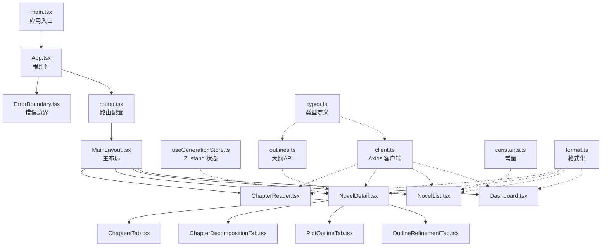
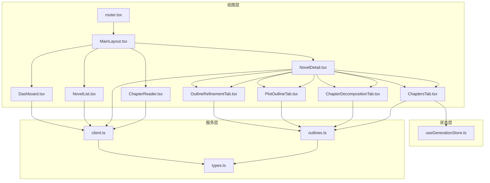
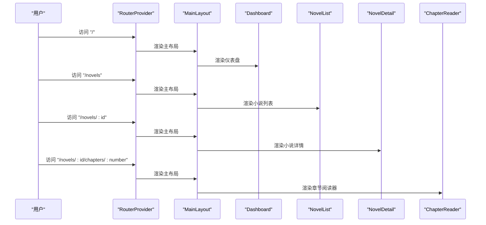
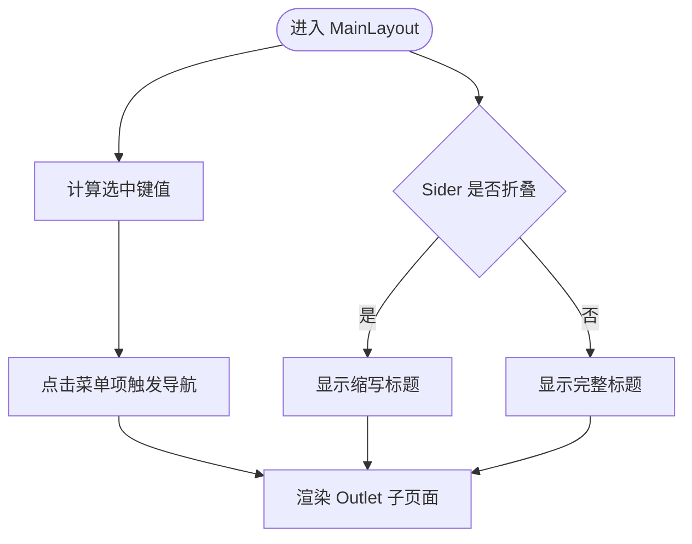
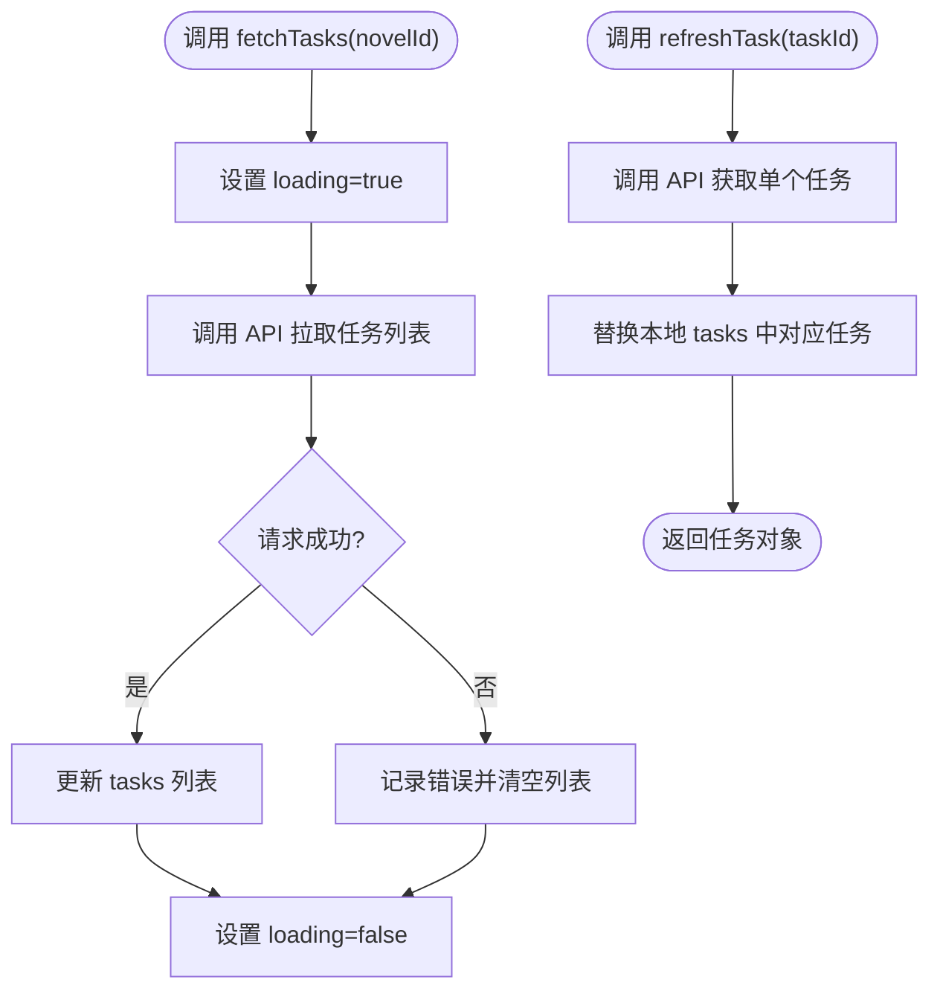
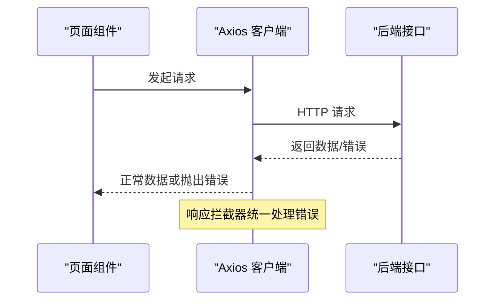
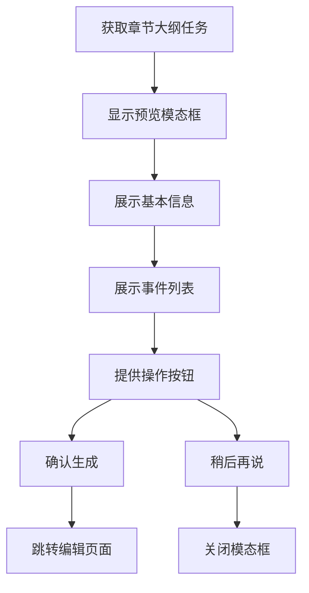
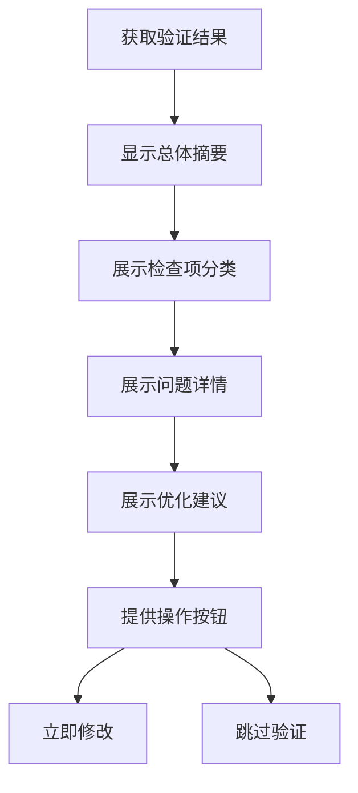
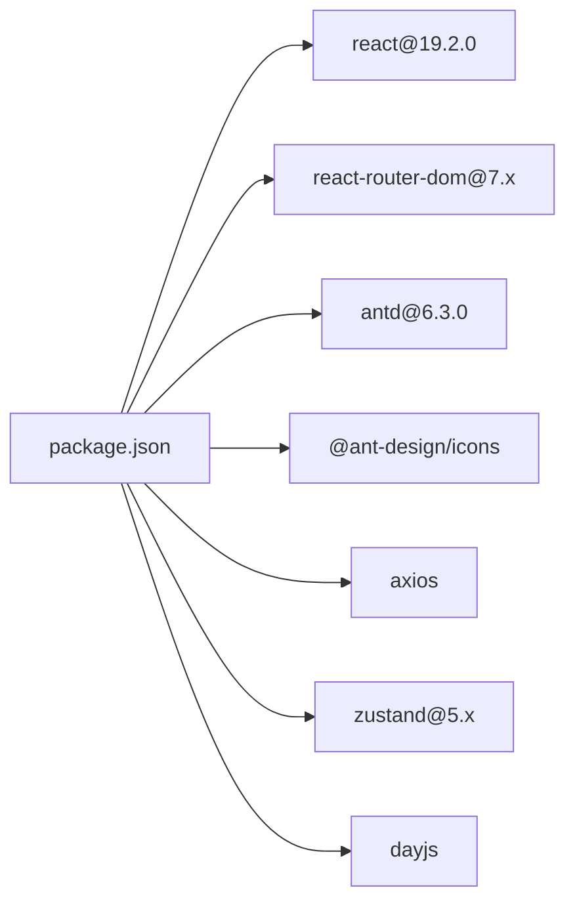

# 前端架构

<cite>
**本文引用的文件**
- [main.tsx](file://frontend/src/main.tsx)
- [App.tsx](file://frontend/src/App.tsx)
- [router.tsx](file://frontend/src/router.tsx)
- [useGenerationStore.ts](file://frontend/src/stores/useGenerationStore.ts)
- [MainLayout.tsx](file://frontend/src/components/Layout/MainLayout.tsx)
- [ChapterOutlineTaskModal.tsx](file://frontend/src/components/ChapterOutlineTaskModal.tsx)
- [OutlineValidationResult.tsx](file://frontend/src/components/OutlineValidationResult.tsx)
- [Dashboard.tsx](file://frontend/src/pages/Dashboard.tsx)
- [NovelList.tsx](file://frontend/src/pages/NovelList.tsx)
- [NovelDetail.tsx](file://frontend/src/pages/NovelDetail/NovelDetail.tsx)
- [OutlineRefinementTab.tsx](file://frontend/src/pages/NovelDetail/OutlineRefinementTab.tsx)
- [PlotOutlineTab.tsx](file://frontend/src/pages/NovelDetail/PlotOutlineTab.tsx)
- [ChapterDecompositionTab.tsx](file://frontend/src/pages/NovelDetail/ChapterDecompositionTab.tsx)
- [ChaptersTab.tsx](file://frontend/src/pages/NovelDetail/ChaptersTab.tsx)
- [ChapterReader.tsx](file://frontend/src/pages/ChapterReader.tsx)
- [ErrorBoundary.tsx](file://frontend/src/components/ErrorBoundary.tsx)
- [client.ts](file://frontend/src/api/client.ts)
- [outlines.ts](file://frontend/src/api/outlines.ts)
- [types.ts](file://frontend/src/api/types.ts)
- [constants.ts](file://frontend/src/utils/constants.ts)
- [format.ts](file://frontend/src/utils/format.ts)
- [package.json](file://frontend/package.json)
</cite>

## 目录
1. [引言](#引言)
2. [项目结构](#项目结构)
3. [核心组件](#核心组件)
4. [架构总览](#架构总览)
5. [详细组件分析](#详细组件分析)
6. [依赖分析](#依赖分析)
7. [性能考虑](#性能考虑)
8. [故障排查指南](#故障排查指南)
9. [结论](#结论)
10. [附录](#附录)

## 引言
本文件面向前端开发者，系统性梳理小说生成系统的前端架构，涵盖组件树结构、状态管理模式（Zustand）、路由系统、Ant Design 6.3.0 的集成与定制、主布局 MainLayout 的设计模式，以及核心页面（Dashboard、NovelList、NovelDetail、ChapterReader）的实现要点。同时总结 TypeScript 类型安全、API 客户端封装、错误边界处理与加载状态管理的最佳实践。

**更新** 新增 ChapterOutlineTaskModal 和 OutlineValidationResult 两个 UI 组件，增强小说详情页面的大纲分解和验证功能，完善章节生成前的任务预览与大纲质量评估流程。

## 项目结构
前端采用 Vite + React 19 + TypeScript 构建，目录组织遵循"按功能域分层"的方式：
- 入口与根组件：入口文件负责挂载根组件；根组件包裹路由与国际化配置。
- 路由层：集中定义路由表，采用嵌套路由与主布局组合。
- 页面层：各业务页面组件，如仪表盘、小说列表、详情、章节阅读器等。
- 组件层：可复用的通用 UI 组件与布局组件（如 MainLayout、ErrorBoundary、ChapterOutlineTaskModal、OutlineValidationResult）。
- 状态层：基于 Zustand 的全局状态管理，当前聚焦"生成任务"状态。
- API 层：Axios 封装的客户端与类型定义，统一错误处理。
- 工具层：常量与格式化工具，支撑 UI 渲染与展示。

**图表来源**
- [main.tsx:1-10](file://frontend/src/main.tsx#L1-L10)
- [App.tsx:1-16](file://frontend/src/App.tsx#L1-L16)
- [router.tsx:1-30](file://frontend/src/router.tsx#L1-L30)
- [MainLayout.tsx:1-83](file://frontend/src/components/Layout/MainLayout.tsx#L1-L83)
- [Dashboard.tsx:1-95](file://frontend/src/pages/Dashboard.tsx#L1-L95)
- [NovelList.tsx:1-162](file://frontend/src/pages/NovelList.tsx#L1-L162)
- [NovelDetail.tsx:1-114](file://frontend/src/pages/NovelDetail/NovelDetail.tsx#L1-L114)
- [OutlineRefinementTab.tsx:1-315](file://frontend/src/pages/NovelDetail/OutlineRefinementTab.tsx#L1-L315)
- [PlotOutlineTab.tsx:1-212](file://frontend/src/pages/NovelDetail/PlotOutlineTab.tsx#L1-L212)
- [ChapterDecompositionTab.tsx:1-638](file://frontend/src/pages/NovelDetail/ChapterDecompositionTab.tsx#L1-L638)
- [ChaptersTab.tsx:1-246](file://frontend/src/pages/NovelDetail/ChaptersTab.tsx#L1-L246)
- [ChapterReader.tsx:1-161](file://frontend/src/pages/ChapterReader.tsx#L1-L161)
- [ErrorBoundary.tsx:1-43](file://frontend/src/components/ErrorBoundary.tsx#L1-L43)
- [useGenerationStore.ts:1-41](file://frontend/src/stores/useGenerationStore.ts#L1-L41)
- [client.ts:1-24](file://frontend/src/api/client.ts#L1-L24)
- [outlines.ts:1-111](file://frontend/src/api/outlines.ts#L1-L111)
- [types.ts:1-352](file://frontend/src/api/types.ts#L1-L352)
- [constants.ts:1-39](file://frontend/src/utils/constants.ts#L1-L39)
- [format.ts:1-23](file://frontend/src/utils/format.ts#L1-L23)

**章节来源**
- [main.tsx:1-10](file://frontend/src/main.tsx#L1-L10)
- [App.tsx:1-16](file://frontend/src/App.tsx#L1-L16)
- [router.tsx:1-30](file://frontend/src/router.tsx#L1-L30)

## 核心组件
- 应用入口与根组件：负责挂载应用、提供语言环境与路由容器。
- 主布局组件：提供侧边导航、头部标题与内容区域 Outlet，支持折叠与主题切换。
- 错误边界：捕获子树渲染异常，提供用户友好的错误提示与刷新入口。
- 状态管理：基于 Zustand 的生成任务状态，支持拉取任务列表与单条任务刷新。
- API 客户端：Axios 实例封装，统一基地址、超时与响应拦截器错误提示。
- 工具与常量：状态映射、格式化函数、枚举选项，保证 UI 渲染一致性。
- **新增** 大纲任务预览组件：ChapterOutlineTaskModal 提供章节大纲任务的可视化展示。
- **新增** 大纲验证结果组件：OutlineValidationResult 展示大纲质量评估与改进建议。

**章节来源**
- [main.tsx:1-10](file://frontend/src/main.tsx#L1-L10)
- [App.tsx:1-16](file://frontend/src/App.tsx#L1-L16)
- [MainLayout.tsx:1-83](file://frontend/src/components/Layout/MainLayout.tsx#L1-L83)
- [ErrorBoundary.tsx:1-43](file://frontend/src/components/ErrorBoundary.tsx#L1-L43)
- [useGenerationStore.ts:1-41](file://frontend/src/stores/useGenerationStore.ts#L1-L41)
- [client.ts:1-24](file://frontend/src/api/client.ts#L1-L24)
- [constants.ts:1-39](file://frontend/src/utils/constants.ts#L1-L39)
- [format.ts:1-23](file://frontend/src/utils/format.ts#L1-L23)
- [ChapterOutlineTaskModal.tsx:1-181](file://frontend/src/components/ChapterOutlineTaskModal.tsx#L1-L181)
- [OutlineValidationResult.tsx:1-291](file://frontend/src/components/OutlineValidationResult.tsx#L1-L291)

## 架构总览
系统采用"路由驱动 + 布局嵌套 + 状态管理 + API 客户端"的分层架构：
- 路由层：集中声明路径与嵌套路由，统一交给 RouterProvider 渲染。
- 布局层：MainLayout 作为容器，承载侧边菜单、头部与 Outlet 内容区。
- 页面层：各页面组件负责数据加载、交互与 UI 呈现。
- 状态层：Zustand 提供轻量级全局状态，避免跨层级 props 传递。
- API 层：Axios 客户端统一封装，拦截器处理错误消息，减少重复逻辑。
- **新增** 大纲服务层：outlines.ts 提供大纲相关的 API 调用，包括任务获取、验证等功能。

**图表来源**
- [router.tsx:1-30](file://frontend/src/router.tsx#L1-L30)
- [MainLayout.tsx:1-83](file://frontend/src/components/Layout/MainLayout.tsx#L1-L83)
- [Dashboard.tsx:1-95](file://frontend/src/pages/Dashboard.tsx#L1-L95)
- [NovelList.tsx:1-162](file://frontend/src/pages/NovelList.tsx#L1-L162)
- [NovelDetail.tsx:1-114](file://frontend/src/pages/NovelDetail/NovelDetail.tsx#L1-L114)
- [OutlineRefinementTab.tsx:1-315](file://frontend/src/pages/NovelDetail/OutlineRefinementTab.tsx#L1-L315)
- [PlotOutlineTab.tsx:1-212](file://frontend/src/pages/NovelDetail/PlotOutlineTab.tsx#L1-L212)
- [ChapterDecompositionTab.tsx:1-638](file://frontend/src/pages/NovelDetail/ChapterDecompositionTab.tsx#L1-L638)
- [ChaptersTab.tsx:1-246](file://frontend/src/pages/NovelDetail/ChaptersTab.tsx#L1-L246)
- [ChapterReader.tsx:1-161](file://frontend/src/pages/ChapterReader.tsx#L1-L161)
- [useGenerationStore.ts:1-41](file://frontend/src/stores/useGenerationStore.ts#L1-L41)
- [client.ts:1-24](file://frontend/src/api/client.ts#L1-L24)
- [outlines.ts:1-111](file://frontend/src/api/outlines.ts#L1-L111)
- [types.ts:1-352](file://frontend/src/api/types.ts#L1-L352)

## 详细组件分析

### 路由系统设计
- 路由表集中定义在 router 中，采用嵌套路由将页面置于 MainLayout 之下，形成统一的布局骨架。
- 主路由路径覆盖仪表盘、小说列表、小说详情、章节阅读器、平台账号、发布管理与系统监控等。
- 通过 Outlet 渲染子页面，支持精确匹配与通配符 NotFound。

**图表来源**
- [router.tsx:12-27](file://frontend/src/router.tsx#L12-L27)
- [MainLayout.tsx:30-81](file://frontend/src/components/Layout/MainLayout.tsx#L30-L81)

**章节来源**
- [router.tsx:1-30](file://frontend/src/router.tsx#L1-L30)

### 主布局组件 MainLayout 设计模式
- 结构：左侧 Sider（带折叠与菜单项）、右侧 Layout（Header + Content），Content 内部通过 Outlet 渲染子页面。
- 导航菜单：基于 Ant Design Menu，支持图标、选中态与点击跳转。
- 响应式与主题：使用 Ant Design 主题 token 控制 Header 样式，Sider 支持折叠。
- 选中态逻辑：根据当前路径计算选中键值，适配首页与二级路径。

**图表来源**
- [MainLayout.tsx:22-81](file://frontend/src/components/Layout/MainLayout.tsx#L22-L81)

**章节来源**
- [MainLayout.tsx:1-83](file://frontend/src/components/Layout/MainLayout.tsx#L1-L83)

### Zustand 状态管理
- Store 定义：包含任务列表、加载状态与两个动作：拉取任务列表与刷新单个任务。
-  同步机制：刷新任务时通过映射替换对应任务，保持列表稳定与局部更新。
- 性能策略：仅在需要的页面（如小说详情）使用该状态，避免全局订阅导致的不必要重渲染。

**图表来源**
- [useGenerationStore.ts:12-40](file://frontend/src/stores/useGenerationStore.ts#L12-L40)

**章节来源**
- [useGenerationStore.ts:1-41](file://frontend/src/stores/useGenerationStore.ts#L1-L41)

### Ant Design 6.3.0 集成与定制
- 国际化：在根组件通过 ConfigProvider 设置 zhCN 语言包。
- 主题与样式：使用 theme.useToken 获取主题变量，配合 Header 样式与 Sider 背景色。
- 组件使用：广泛使用 Layout、Menu、Typography、Table、Breadcrumb、Tabs、Descriptions、Card 等组件构建页面。
- 响应式：利用 Ant Design 的栅格系统与断点控制，确保在不同屏幕下的良好体验。

**章节来源**
- [App.tsx:1-16](file://frontend/src/App.tsx#L1-L16)
- [MainLayout.tsx:63-70](file://frontend/src/components/Layout/MainLayout.tsx#L63-L70)
- [Dashboard.tsx:47-74](file://frontend/src/pages/Dashboard.tsx#L47-L74)
- [NovelList.tsx:91-121](file://frontend/src/pages/NovelList.tsx#L91-L121)

### API 客户端封装与类型安全
- Axios 实例：设置 base URL、超时时间与默认头，满足长时间任务场景。
- 响应拦截器：统一提取错误信息并弹出提示，保证一致的错误反馈。
- 类型定义：types.ts 提供完整的数据模型（小说、章节、角色、世界观、生成任务、发布任务等），并与后端 Pydantic 模型一一对应。
- 使用示例：页面通过 API 方法拉取数据，结合格式化与常量映射进行渲染。

**图表来源**
- [client.ts:4-21](file://frontend/src/api/client.ts#L4-L21)
- [types.ts:5-44](file://frontend/src/api/types.ts#L5-L44)

**章节来源**
- [client.ts:1-24](file://frontend/src/api/client.ts#L1-L24)
- [types.ts:1-352](file://frontend/src/api/types.ts#L1-L352)

### 新增 UI 组件详解

#### 章节大纲任务预览组件 ChapterOutlineTaskModal
- **功能定位**：在章节生成前展示详细的章节大纲任务信息，帮助作者理解创作要求。
- **数据结构**：ChapterTask 接口包含章节编号、标题、强制性事件、可选事件、伏笔任务、情感基调、张力位置、目标字数等字段。
- **视觉设计**：
  - 情感基调图标：根据情感类型显示相应的表情符号（积极/消极/中性）
  - 张力位置标签：使用颜色编码（高红/中橙/低绿）直观显示张力水平
  - 事件列表：强制性事件使用绿色勾选图标，可选事件使用蓝色减号图标，伏笔任务使用黄色时钟图标
- **交互逻辑**：支持确认和取消操作，确认后跳转到章节编辑页面。

**图表来源**
- [ChapterOutlineTaskModal.tsx:29-177](file://frontend/src/components/ChapterOutlineTaskModal.tsx#L29-L177)

**章节来源**
- [ChapterOutlineTaskModal.tsx:1-181](file://frontend/src/components/ChapterOutlineTaskModal.tsx#L1-L181)

#### 大纲验证结果组件 OutlineValidationResult
- **功能定位**：展示大纲质量评估结果，提供通过率、检查项状态、缺失要素、问题详情和优化建议。
- **数据结构**：ValidationResult 接口包含通过率、通过检查项、未通过检查项、缺失要素、问题数组、建议数组等字段。
- **视觉设计**：
  - 通过率进度条：根据通过率显示不同颜色（未通过红/需优化黄/通过绿）
  - 检查项分类：使用折叠面板分别展示通过、未通过、缺失的检查项
  - 问题详情：每个问题包含严重级别标识、字段名、问题描述和改进建议
  - 操作按钮：提供"立即修改"和"跳过"按钮，支持进一步操作
- **交互逻辑**：根据验证结果动态显示不同的提示信息和操作按钮。

**图表来源**
- [OutlineValidationResult.tsx:33-281](file://frontend/src/components/OutlineValidationResult.tsx#L33-L281)

**章节来源**
- [OutlineValidationResult.tsx:1-291](file://frontend/src/components/OutlineValidationResult.tsx#L1-L291)

### 页面组件设计规范

#### 仪表盘 Dashboard
- 数据加载：并发拉取小说列表与运行中任务，提升首屏速度。
- 统计卡片：使用 StatsCard 展示关键指标（总数、字数、成本、进行中任务）。
- 最近小说：使用栅格布局展示若干小说卡片。
- 进行中任务：表格展示任务类型、状态、开始时间等。

**章节来源**
- [Dashboard.tsx:17-95](file://frontend/src/pages/Dashboard.tsx#L17-L95)

#### 小说列表 NovelList
- 分页与筛选：支持状态筛选与分页，使用回调缓存 load 函数以减少重复渲染。
- 表格列：标题点击跳转详情、状态徽标、字数、章节、成本、创建时间等。
- 新增与删除：模态框创建、确认对话框删除，删除成功后刷新列表。
- AI 辅助：打开抽屉式 AI Chat，场景为"novel_creation"。

**章节来源**
- [NovelList.tsx:14-162](file://frontend/src/pages/NovelList.tsx#L14-L162)
- [constants.ts:1-6](file://frontend/src/utils/constants.ts#L1-L6)

#### 小说详情 NovelDetail
- 面包屑与卡片：展示基本信息与标签，提供 AI 助手入口。
- 标签页：概览、世界观、角色、大纲、章节、生成历史等子 Tab。
- 加载与错误：加载态与"小说不存在"提示。
- 刷新机制：子 Tab 可回调刷新父级数据。

**章节来源**
- [NovelDetail.tsx:17-114](file://frontend/src/pages/NovelDetail/NovelDetail.tsx#L17-L114)

#### 大纲梳理 OutlineRefinementTab
- **新增** 大纲完整性检查：实时计算并显示大纲完成度百分比。
- **新增** AI 辅助功能：为每个大纲要素提供 AI 建议生成功能。
- **新增** 确认机制：设置最低完成度阈值，确保大纲质量后再确认。

**章节来源**
- [OutlineRefinementTab.tsx:1-315](file://frontend/src/pages/NovelDetail/OutlineRefinementTab.tsx#L1-L315)

#### 大纲展示 PlotOutlineTab
- **新增** 版本历史功能：支持查看和管理大纲版本变更记录。
- **新增** 结构可视化：使用 Tree 组件展示卷章结构的层次关系。

**章节来源**
- [PlotOutlineTab.tsx:1-212](file://frontend/src/pages/NovelDetail/PlotOutlineTab.tsx#L1-L212)

#### 章节拆分 ChapterDecompositionTab
- **新增** 可拖拽排序：支持通过拖拽调整卷的顺序。
- **新增** 张力循环配置：为每卷设置不同的张力循环模式（上升/高潮/下降/平稳）。
- **新增** 伏笔分配：为每卷分配相应的伏笔任务。

**章节来源**
- [ChapterDecompositionTab.tsx:1-638](file://frontend/src/pages/NovelDetail/ChapterDecompositionTab.tsx#L1-L638)

#### 章节管理 ChaptersTab
- **新增** 大纲任务预览：点击生成章节时先展示大纲任务预览，确认后再进入编辑。
- **新增** 批量操作：支持批量删除章节，提高管理效率。

**章节来源**
- [ChaptersTab.tsx:1-246](file://frontend/src/pages/NovelDetail/ChaptersTab.tsx#L1-L246)

#### 章节阅读器 ChapterReader
- 参数解析：从路由参数读取小说 ID 与章节号。
- 并发加载：同时拉取章节内容与总章节数，提升体验。
- 编辑能力：模态框编辑标题、内容与状态，保存后刷新。
- 导航：上一章/下一章按钮，禁用状态随当前章节号变化。

**章节来源**
- [ChapterReader.tsx:12-161](file://frontend/src/pages/ChapterReader.tsx#L12-L161)

### 错误边界与加载状态管理
- 错误边界：捕获子树异常，展示错误结果与刷新按钮，避免整页崩溃。
- 加载状态：页面级 Spin、表格 loading、按钮 loading 等多层级加载反馈。
- API 错误：Axios 拦截器统一弹出错误消息，提升用户体验。

**章节来源**
- [ErrorBoundary.tsx:13-42](file://frontend/src/components/ErrorBoundary.tsx#L13-L42)
- [Dashboard.tsx:20-38](file://frontend/src/pages/Dashboard.tsx#L20-L38)
- [NovelList.tsx:26-35](file://frontend/src/pages/NovelList.tsx#L26-L35)
- [client.ts:10-21](file://frontend/src/api/client.ts#L10-L21)

## 依赖分析
- React 19.2.0：提供函数组件与 Hooks 生命周期。
- React Router 7.x：提供路由能力与嵌套路由。
- Ant Design 6.3.0：UI 组件库与主题系统。
- Axios：HTTP 客户端，统一拦截器。
- Zustand 5.x：轻量级状态管理。
- Day.js：日期格式化工具。

**图表来源**
- [package.json:12-24](file://frontend/package.json#L12-L24)

**章节来源**
- [package.json:1-42](file://frontend/package.json#L1-L42)

## 性能考虑
- 并发加载：仪表盘与章节阅读器使用 Promise.all 并发请求，缩短首屏时间。
- 回调缓存：列表页使用 useCallback 包裹加载函数，减少子组件重渲染。
- 局部状态：Zustand 仅在详情页使用，避免全局订阅带来的不必要更新。
- 路由懒加载：可在后续扩展中引入路由级懒加载以进一步优化首屏。
- 图片与内容：章节内容按段落渲染，避免一次性渲染超大文本块。
- **新增** 组件优化：新组件采用合理的条件渲染和状态管理，避免不必要的重渲染。

## 故障排查指南
- 请求失败：检查响应拦截器是否正确弹出错误消息；确认后端接口可用与网络连通。
- 路由跳转：确认路由表路径与 MainLayout 嵌套关系；检查参数解析是否正确。
- 状态未更新：核对 Zustand actions 是否被调用；确认刷新逻辑是否替换对应任务。
- UI 显示异常：检查 Ant Design 版本与 ConfigProvider 语言配置；确认断点与栅格使用是否合理。
- 错误边界：若页面白屏，检查错误边界是否捕获到异常并提供刷新入口。
- **新增** 大纲任务获取失败：检查 outlines.ts 中的 API 调用是否正确，确认后端大纲服务可用性。

**章节来源**
- [client.ts:10-21](file://frontend/src/api/client.ts#L10-L21)
- [router.tsx:12-27](file://frontend/src/router.tsx#L12-L27)
- [useGenerationStore.ts:29-39](file://frontend/src/stores/useGenerationStore.ts#L29-L39)
- [ErrorBoundary.tsx:19-41](file://frontend/src/components/ErrorBoundary.tsx#L19-L41)

## 结论
该前端架构以 React 19 为基础，结合 Ant Design 6.3.0 与 Zustand，实现了清晰的路由分层、可复用的布局组件与统一的 API 客户端。通过并发加载、回调缓存与局部状态管理，兼顾了性能与可维护性。

**更新** 新增的 ChapterOutlineTaskModal 和 OutlineValidationResult 组件显著增强了小说创作流程的智能化程度，通过可视化的任务预览和质量评估，提升了作者的创作体验和作品质量。这些组件与现有的大纲管理功能形成了完整的创作工作流，从大纲规划到章节生成都提供了强有力的技术支撑。

建议在后续迭代中引入路由懒加载、更细粒度的状态拆分与完善的测试体系，持续提升开发效率与用户体验。

## 附录
- 开发脚本：dev、build、lint、preview。
- TypeScript：严格类型约束，确保与后端模型一致。
- ESLint：规范化代码风格与 Hooks 规则。

**章节来源**
- [package.json:6-11](file://frontend/package.json#L6-L11)
- [types.ts:1-352](file://frontend/src/api/types.ts#L1-L352)