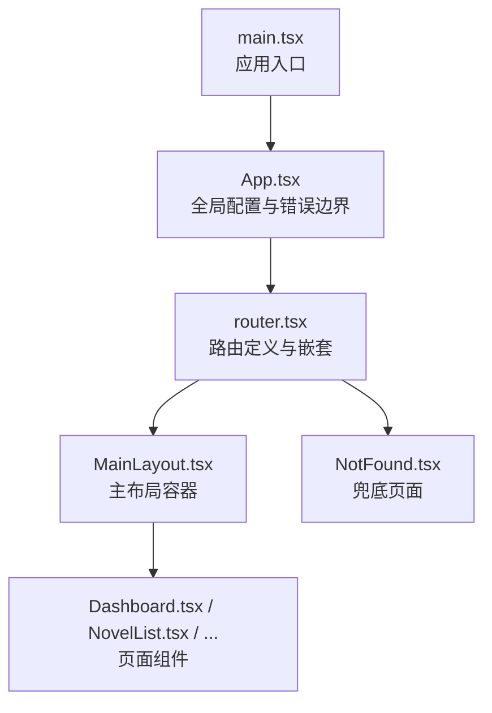
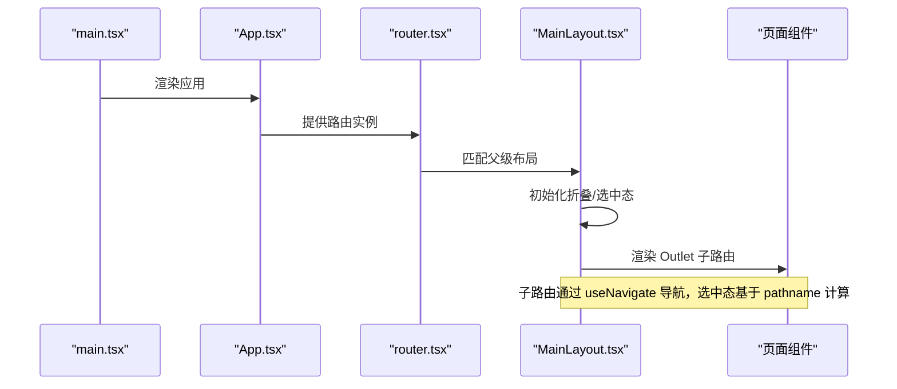
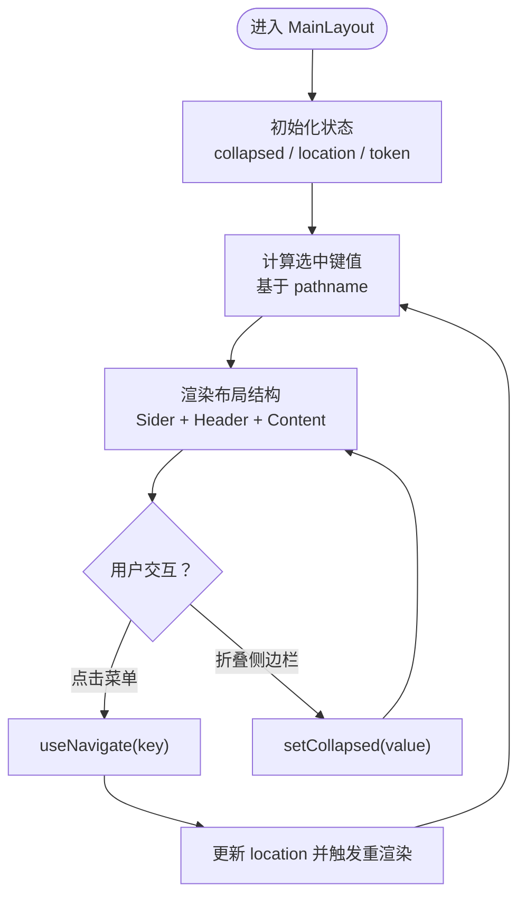
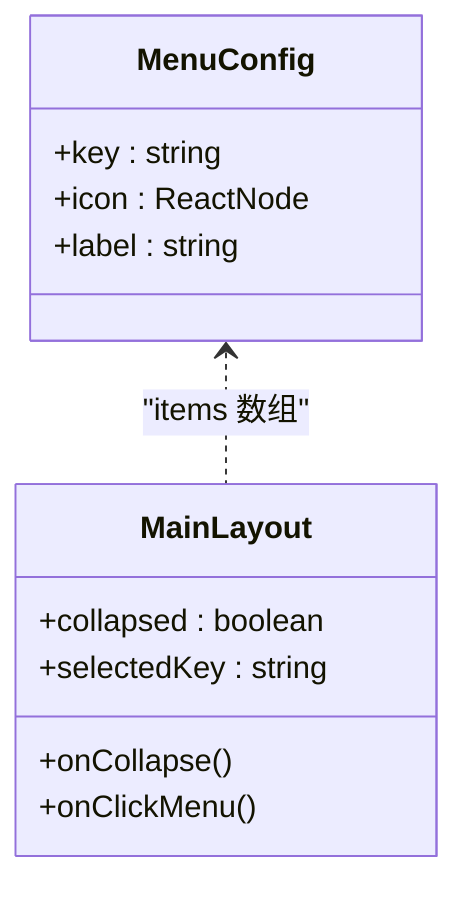
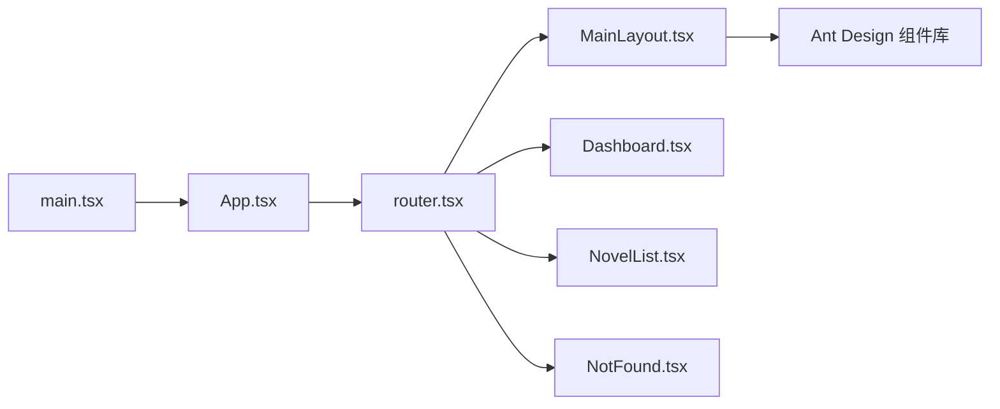

# 布局与导航系统

<cite>
**本文引用的文件**
- [frontend/src/components/Layout/MainLayout.tsx](file://frontend/src/components/Layout/MainLayout.tsx)
- [frontend/src/router.tsx](file://frontend/src/router.tsx)
- [frontend/src/App.tsx](file://frontend/src/App.tsx)
- [frontend/src/main.tsx](file://frontend/src/main.tsx)
- [frontend/vite.config.ts](file://frontend/vite.config.ts)
- [frontend/src/pages/Dashboard.tsx](file://frontend/src/pages/Dashboard.tsx)
- [frontend/src/pages/NovelList.tsx](file://frontend/src/pages/NovelList.tsx)
- [frontend/src/pages/NotFound.tsx](file://frontend/src/pages/NotFound.tsx)
- [frontend/src/utils/constants.ts](file://frontend/src/utils/constants.ts)
</cite>

## 目录
1. [引言](#引言)
2. [项目结构](#项目结构)
3. [核心组件](#核心组件)
4. [架构总览](#架构总览)
5. [详细组件分析](#详细组件分析)
6. [依赖关系分析](#依赖关系分析)
7. [性能考量](#性能考量)
8. [故障排查指南](#故障排查指南)
9. [结论](#结论)
10. [附录](#附录)

## 引言
本文件面向前端开发者，系统化梳理小说系统的布局与导航体系，重点围绕主布局组件 MainLayout.tsx 的设计模式展开，涵盖顶部导航栏、侧边栏菜单、内容区渲染、路由嵌套与面包屑的实现思路；同时给出响应式布局、菜单配置与权限扩展、动态菜单生成、图标集成、样式定制（含暗色模式）、组件复用与性能优化、可访问性建议等实践指南。

## 项目结构
前端采用 Vite + React + Ant Design 技术栈，路由通过 React Router v6 的 createBrowserRouter 管理，应用在入口处通过 ConfigProvider 全局配置语言环境，并以 MainLayout 作为根级布局容器包裹子路由页面。

图表来源
- [frontend/src/main.tsx](file://frontend/src/main.tsx#L1-L10)
- [frontend/src/App.tsx](file://frontend/src/App.tsx#L1-L16)
- [frontend/src/router.tsx](file://frontend/src/router.tsx#L1-L30)
- [frontend/src/components/Layout/MainLayout.tsx](file://frontend/src/components/Layout/MainLayout.tsx#L1-L83)

章节来源
- [frontend/src/main.tsx](file://frontend/src/main.tsx#L1-L10)
- [frontend/src/App.tsx](file://frontend/src/App.tsx#L1-L16)
- [frontend/src/router.tsx](file://frontend/src/router.tsx#L1-L30)

## 核心组件
- 主布局 MainLayout：负责侧边栏、头部、内容区的组织与状态管理，使用 Ant Design Layout/Sider/Header/Menu 组件，内置折叠状态与选中态逻辑。
- 路由系统 router：以 MainLayout 为父级容器，定义多级子路由，支撑页面级导航与面包屑的层级识别基础。
- 页面组件：如仪表盘、小说列表等，作为 Outlet 内容渲染，体现布局的复用性与一致性。

章节来源
- [frontend/src/components/Layout/MainLayout.tsx](file://frontend/src/components/Layout/MainLayout.tsx#L1-L83)
- [frontend/src/router.tsx](file://frontend/src/router.tsx#L1-L30)
- [frontend/src/pages/Dashboard.tsx](file://frontend/src/pages/Dashboard.tsx#L1-L95)
- [frontend/src/pages/NovelList.tsx](file://frontend/src/pages/NovelList.tsx#L1-L162)

## 架构总览
下图展示从应用启动到页面渲染的关键调用链路，以及布局与路由的关系。

图表来源
- [frontend/src/main.tsx](file://frontend/src/main.tsx#L1-L10)
- [frontend/src/App.tsx](file://frontend/src/App.tsx#L1-L16)
- [frontend/src/router.tsx](file://frontend/src/router.tsx#L1-L30)
- [frontend/src/components/Layout/MainLayout.tsx](file://frontend/src/components/Layout/MainLayout.tsx#L1-L83)

## 详细组件分析

### 主布局组件 MainLayout 设计模式
- 结构组成
  - 侧边栏 Sider：可折叠、深色主题，包含品牌文字区域与菜单。
  - 头部 Header：浅色背景、带底部边框，承载页面标题。
  - 内容区 Content：Outlet 占位，承载子路由页面。
- 状态与交互
  - 折叠状态：通过 useState 控制 collapsed，绑定 Sider 的 collapsible/onCollapse。
  - 选中态：根据当前 pathname 计算选中键值，确保菜单高亮与面包屑起点一致。
  - 导航：Menu 的 onClick 回调统一使用 useNavigate 进行路由跳转。
- 主题与样式
  - 使用 theme.useToken 获取 Ant Design 设计令牌，用于 Header 背景与边框颜色，便于后续主题扩展。
  - Sider/Menu 使用 theme="dark"，形成统一的暗色风格。

图表来源
- [frontend/src/components/Layout/MainLayout.tsx](file://frontend/src/components/Layout/MainLayout.tsx#L22-L82)

章节来源
- [frontend/src/components/Layout/MainLayout.tsx](file://frontend/src/components/Layout/MainLayout.tsx#L1-L83)

### 菜单系统实现
- 菜单项配置
  - 菜单项数组集中声明，包含 key（路由前缀）、图标与标签，便于统一维护与扩展。
- 权限控制
  - 当前实现未内建权限判断逻辑，推荐在菜单数组上按角色过滤或在 Menu 上增加 disabled 控制，以满足不同角色可见性需求。
- 动态菜单生成
  - 可将菜单数组改为异步加载，结合用户角色/功能开关动态拼装 items，再传入 Menu。
- 图标集成
  - 使用 Ant Design Icons，确保图标库版本与 Antd 版本兼容。

图表来源
- [frontend/src/components/Layout/MainLayout.tsx](file://frontend/src/components/Layout/MainLayout.tsx#L14-L20)
- [frontend/src/components/Layout/MainLayout.tsx](file://frontend/src/components/Layout/MainLayout.tsx#L54-L60)

章节来源
- [frontend/src/components/Layout/MainLayout.tsx](file://frontend/src/components/Layout/MainLayout.tsx#L14-L20)
- [frontend/src/components/Layout/MainLayout.tsx](file://frontend/src/components/Layout/MainLayout.tsx#L54-L60)

### 响应式布局与移动端适配
- 断点与栅格
  - 页面组件广泛使用 Ant Design 的 Grid（Row/Col）与按钮、表格等组件的响应式行为，适合在小屏设备上自动调整列宽与间距。
- 布局切换
  - 侧边栏支持折叠，可在窄屏时减少信息占用，提升可视面积。
- 建议
  - 在更复杂的场景下，可引入媒体查询或 Antd 的响应式断点常量，配合布局容器的显示/隐藏策略，进一步优化移动端体验。

章节来源
- [frontend/src/pages/Dashboard.tsx](file://frontend/src/pages/Dashboard.tsx#L47-L74)
- [frontend/src/pages/NovelList.tsx](file://frontend/src/pages/NovelList.tsx#L69-L161)
- [frontend/src/components/Layout/MainLayout.tsx](file://frontend/src/components/Layout/MainLayout.tsx#L32-L60)

### 面包屑导航机制
- 自动识别路由层级
  - 路由采用分层嵌套结构，父级为 MainLayout，子级为具体页面。面包屑可通过遍历 location.pathname 的 segments 与路由配置映射生成。
- 路径映射
  - 可建立“路由前缀 -> 标题/图标”的映射表，结合菜单配置复用标签与图标资源。
- 点击跳转
  - 面包屑项逐级返回父路径，最终回到对应页面；点击最后一个非链接项表示当前页。
- 实施建议
  - 在 MainLayout 中新增 useLocation 监听，结合路由配置生成面包屑数组，渲染 Antd Breadcrumb 组件。

章节来源
- [frontend/src/router.tsx](file://frontend/src/router.tsx#L12-L27)
- [frontend/src/components/Layout/MainLayout.tsx](file://frontend/src/components/Layout/MainLayout.tsx#L28-L28)

### 布局样式定制方案
- CSS 变量与主题切换
  - 利用 Antd ConfigProvider 的主题能力与 CSS 变量覆盖，实现明/暗主题切换；在入口 App 中注入主题配置对象。
- 暗色模式支持
  - 通过 theme.useToken 获取设计令牌，结合 token.colorBgContainer/token.colorBorderSecondary 等变量，保证 Header/Content 等区域在不同主题下保持一致的视觉层次。
- 样式隔离
  - 使用 Vite 别名 @ 指向 src，避免相对路径导致的样式查找问题；在组件内部尽量局部化样式，必要时通过 CSS-in-JS 或 styled-components 扩展。

章节来源
- [frontend/src/App.tsx](file://frontend/src/App.tsx#L7-L15)
- [frontend/src/components/Layout/MainLayout.tsx](file://frontend/src/components/Layout/MainLayout.tsx#L63-L70)
- [frontend/vite.config.ts](file://frontend/vite.config.ts#L7-L11)

### 组件复用模式与可访问性
- 复用模式
  - 将菜单配置、图标、标题映射抽离为常量或服务，供 MainLayout 与面包屑模块共享，降低重复与不一致风险。
- 可访问性
  - 为菜单项提供 aria-label；为按钮添加明确的文本标签；为表格/表单控件提供合适的语义与提示。
  - 确保键盘可导航（Tab/Enter/Space），焦点可见且有序。

章节来源
- [frontend/src/utils/constants.ts](file://frontend/src/utils/constants.ts#L1-L39)
- [frontend/src/components/Layout/MainLayout.tsx](file://frontend/src/components/Layout/MainLayout.tsx#L54-L60)

## 依赖关系分析
- 应用入口依赖 App，App 依赖 ConfigProvider 与 RouterProvider；RouterProvider 依赖 router 定义；router 定义了 MainLayout 与各页面组件的父子关系。
- MainLayout 依赖 Ant Design 的 Layout/Sider/Header/Menu 与 Icons；页面组件依赖 Antd 的布局、表格、表单等组件。

图表来源
- [frontend/src/main.tsx](file://frontend/src/main.tsx#L1-L10)
- [frontend/src/App.tsx](file://frontend/src/App.tsx#L1-L16)
- [frontend/src/router.tsx](file://frontend/src/router.tsx#L1-L30)
- [frontend/src/components/Layout/MainLayout.tsx](file://frontend/src/components/Layout/MainLayout.tsx#L1-L12)

章节来源
- [frontend/src/main.tsx](file://frontend/src/main.tsx#L1-L10)
- [frontend/src/App.tsx](file://frontend/src/App.tsx#L1-L16)
- [frontend/src/router.tsx](file://frontend/src/router.tsx#L1-L30)

## 性能考量
- 路由懒加载
  - 对大型页面组件采用动态导入，减少首屏体积与初次渲染时间。
- 状态最小化
  - 将菜单选中态与折叠状态收敛在 MainLayout，避免子组件重复计算。
- 渲染优化
  - 表格/列表组件使用虚拟滚动（如需）与分页，降低 DOM 节点数量。
- 图标与资源
  - 合理拆分图标包，避免引入不必要的图标集；对静态资源启用缓存与压缩。

## 故障排查指南
- 页面空白或路由不生效
  - 检查 router.tsx 的路径与元素是否正确挂载至 MainLayout；确认 useNavigate 的 key 与菜单项 key 一致。
- 菜单高亮异常
  - 核对 MainLayout 中选中键值计算逻辑，确保与路由前缀匹配；注意首页“/”与子路径的区分处理。
- 移动端显示异常
  - 检查 Antd 组件的响应式属性与容器宽度；必要时引入媒体查询或调整断点。
- 404 页面
  - NotFound 组件提供返回首页的按钮，确认路由兜底规则与导航逻辑。

章节来源
- [frontend/src/router.tsx](file://frontend/src/router.tsx#L12-L27)
- [frontend/src/components/Layout/MainLayout.tsx](file://frontend/src/components/Layout/MainLayout.tsx#L28-L28)
- [frontend/src/pages/NotFound.tsx](file://frontend/src/pages/NotFound.tsx#L1-L20)

## 结论
该布局与导航系统以 MainLayout 为核心，结合 React Router 的嵌套路由，实现了清晰的页面组织与一致的视觉风格。通过集中化的菜单配置、主题令牌与响应式组件，系统具备良好的可扩展性与可维护性。建议在此基础上补充权限控制、动态菜单、面包屑自动生成与主题切换能力，以满足更复杂业务场景的需求。

## 附录
- 快速检查清单
  - 菜单项 key 与路由前缀一致
  - 选中态计算逻辑覆盖首页与子路径
  - 移动端折叠与断点表现符合预期
  - 面包屑基于路由层级自动生成
  - 主题切换与暗色模式可用
  - 可访问性标签与键盘导航完善