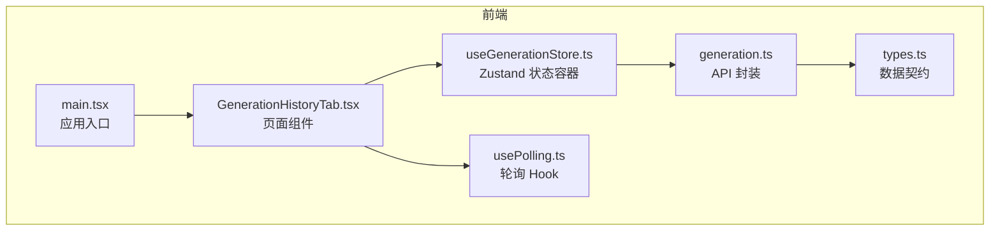
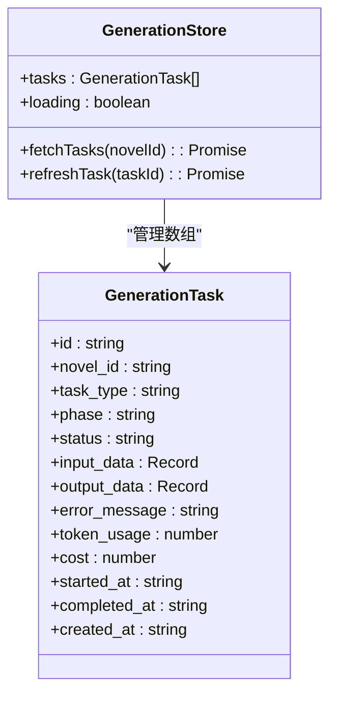
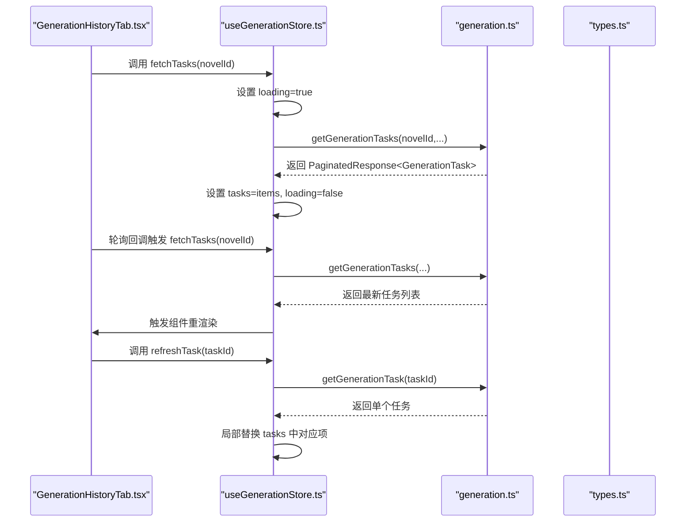
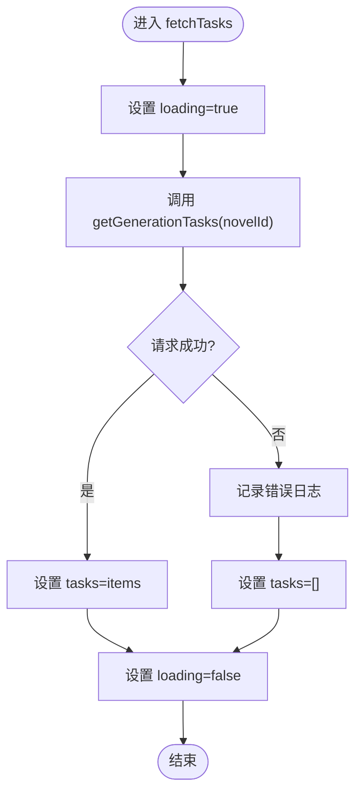
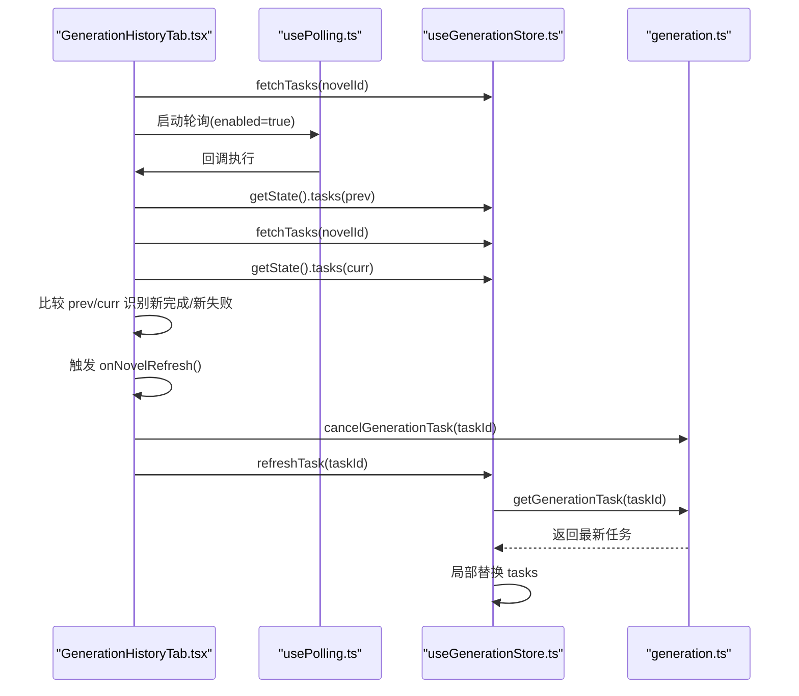
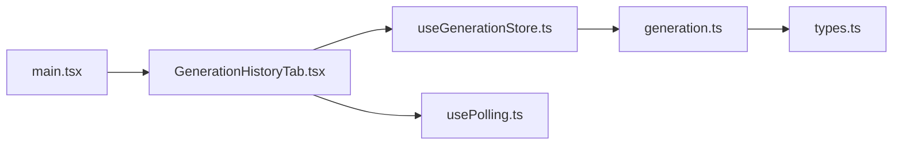

# 状态管理系统

<cite>
**本文引用的文件**
- [useGenerationStore.ts](file://frontend/src/stores/useGenerationStore.ts)
- [generation.ts](file://frontend/src/api/generation.ts)
- [types.ts](file://frontend/src/api/types.ts)
- [GenerationHistoryTab.tsx](file://frontend/src/pages/NovelDetail/GenerationHistoryTab.tsx)
- [usePolling.ts](file://frontend/src/hooks/usePolling.ts)
- [package.json](file://frontend/package.json)
- [main.tsx](file://frontend/src/main.tsx)
- [SystemMonitoring.tsx](file://frontend/src/pages/SystemMonitoring.tsx)
</cite>

## 目录
1. [引言](#引言)
2. [项目结构](#项目结构)
3. [核心组件](#核心组件)
4. [架构总览](#架构总览)
5. [详细组件分析](#详细组件分析)
6. [依赖关系分析](#依赖关系分析)
7. [性能考量](#性能考量)
8. [故障排查指南](#故障排查指南)
9. [结论](#结论)
10. [附录](#附录)

## 引言
本文件围绕前端状态管理子系统进行系统性梳理，重点解析基于 Zustand 的状态管理模式在“生成任务”场景中的应用，涵盖状态结构设计、动作函数定义、全局状态分区、数据流管理、状态同步机制、持久化策略、订阅与更新机制、最佳实践以及调试与性能监控建议。目标是为前端开发者提供一套可落地的状态管理设计指南与使用规范。

## 项目结构
本项目采用前端与后端分离架构，状态管理位于前端目录。与状态管理直接相关的关键文件如下：
- stores/useGenerationStore.ts：基于 Zustand 的生成任务状态容器
- api/generation.ts：生成任务相关的 API 封装
- api/types.ts：前后端数据契约（GenerationTask 等）
- pages/NovelDetail/GenerationHistoryTab.tsx：使用状态容器并驱动轮询刷新
- hooks/usePolling.ts：通用轮询 Hook
- package.json：声明 Zustand 依赖
- main.tsx：应用入口
- pages/SystemMonitoring.tsx：系统监控页面（展示轮询与状态刷新）

图表来源
- [main.tsx](file://frontend/src/main.tsx#L1-L10)
- [GenerationHistoryTab.tsx](file://frontend/src/pages/NovelDetail/GenerationHistoryTab.tsx#L1-L121)
- [useGenerationStore.ts](file://frontend/src/stores/useGenerationStore.ts#L1-L41)
- [generation.ts](file://frontend/src/api/generation.ts#L1-L35)
- [types.ts](file://frontend/src/api/types.ts#L147-L179)
- [usePolling.ts](file://frontend/src/hooks/usePolling.ts#L1-L39)

章节来源
- [main.tsx](file://frontend/src/main.tsx#L1-L10)
- [package.json](file://frontend/package.json#L12-L24)

## 核心组件
本节聚焦于 useGenerationStore 的实现模式与状态结构设计，以及与之配套的动作函数与数据契约。

- 状态结构
  - 任务列表：用于存放 GenerationTask 数组
  - 加载状态：布尔值，指示是否处于加载中
- 动作函数
  - fetchTasks：根据 novelId 拉取任务列表，并设置 loading 状态
  - refreshTask：按 taskId 拉取单个任务并局部更新任务列表

图表来源
- [useGenerationStore.ts](file://frontend/src/stores/useGenerationStore.ts#L5-L10)
- [types.ts](file://frontend/src/api/types.ts#L147-L162)

章节来源
- [useGenerationStore.ts](file://frontend/src/stores/useGenerationStore.ts#L1-L41)
- [types.ts](file://frontend/src/api/types.ts#L147-L162)

## 架构总览
下图展示了从页面到状态容器再到 API 的调用链路，以及轮询触发的数据刷新流程。

图表来源
- [GenerationHistoryTab.tsx](file://frontend/src/pages/NovelDetail/GenerationHistoryTab.tsx#L16-L52)
- [useGenerationStore.ts](file://frontend/src/stores/useGenerationStore.ts#L16-L39)
- [generation.ts](file://frontend/src/api/generation.ts#L11-L27)
- [types.ts](file://frontend/src/api/types.ts#L175-L179)

## 详细组件分析

### useGenerationStore 状态容器
- 设计要点
  - 使用 create 创建 Zustand 容器，定义状态与动作
  - 通过 set 控制状态变更；通过 get 访问当前状态以实现局部更新
  - fetchTasks 在请求前设置 loading，异常时回退为空列表，finally 清理 loading
  - refreshTask 基于 taskId 匹配并替换 tasks 中对应项，保持列表引用稳定
- 复杂度与性能
  - 状态读写为 O(1)，局部替换 tasks 为 O(n)（n 为任务数），但仅在刷新单条记录时触发
- 错误处理
  - fetchTasks 捕获异常并清空任务列表，避免脏数据
  - refreshTask 捕获异常并返回 null，调用方可据此判断失败

图表来源
- [useGenerationStore.ts](file://frontend/src/stores/useGenerationStore.ts#L16-L26)

章节来源
- [useGenerationStore.ts](file://frontend/src/stores/useGenerationStore.ts#L1-L41)

### GenerationHistoryTab 页面组件
- 设计要点
  - 首次挂载即拉取任务列表
  - 使用自定义轮询 Hook，按需启用/禁用定时器
  - 轮询回调比较前后两次 tasks，识别新完成或新失败的任务并触发上层刷新
  - 提供取消运行中任务的能力，并在取消后主动刷新该任务
- 数据流
  - 从 store 读取 tasks/ loading 并渲染表格
  - 通过 API 封装发起取消与刷新请求
- 性能与体验
  - 仅当存在运行中任务时启用轮询，降低无效请求
  - 使用 useRef 维护已通知任务集合，避免重复提示

图表来源
- [GenerationHistoryTab.tsx](file://frontend/src/pages/NovelDetail/GenerationHistoryTab.tsx#L16-L52)
- [usePolling.ts](file://frontend/src/hooks/usePolling.ts#L3-L38)
- [useGenerationStore.ts](file://frontend/src/stores/useGenerationStore.ts#L29-L39)
- [generation.ts](file://frontend/src/api/generation.ts#L29-L34)

章节来源
- [GenerationHistoryTab.tsx](file://frontend/src/pages/NovelDetail/GenerationHistoryTab.tsx#L1-L121)
- [usePolling.ts](file://frontend/src/hooks/usePolling.ts#L1-L39)

### usePolling 自定义 Hook
- 设计要点
  - 保存回调函数引用，确保轮询执行的是最新回调
  - 支持显式停止定时器，避免内存泄漏
  - 首次立即执行一次，随后按间隔循环执行
- 使用建议
  - 将 enabled 与业务状态绑定（如是否存在运行中任务），动态启停
  - 在组件卸载时自动清理定时器

章节来源
- [usePolling.ts](file://frontend/src/hooks/usePolling.ts#L1-L39)

### API 封装与数据契约
- API 封装
  - 提供创建、查询任务列表、查询单个任务、取消任务等方法
  - 查询接口支持分页参数与过滤条件
- 数据契约
  - GenerationTask 定义了任务的完整生命周期字段，包括状态、进度、成本、时间戳等
  - 分页响应统一包装 items 与 total 字段

章节来源
- [generation.ts](file://frontend/src/api/generation.ts#L1-L35)
- [types.ts](file://frontend/src/api/types.ts#L147-L179)

### 全局状态设计原则
- 状态分区
  - 将“生成任务”状态独立为一个 store，职责单一，便于维护与测试
- 数据流管理
  - 单向数据流：UI -> Store -> API -> Store -> UI
  - 局部更新：refreshTask 仅替换匹配项，减少不必要的重渲染
- 状态同步机制
  - 轮询回调对比前后状态，识别关键变化（新完成/新失败）并触发上层刷新
  - 取消任务后主动刷新，保证 UI 与服务端一致

章节来源
- [useGenerationStore.ts](file://frontend/src/stores/useGenerationStore.ts#L16-L39)
- [GenerationHistoryTab.tsx](file://frontend/src/pages/NovelDetail/GenerationHistoryTab.tsx#L27-L47)

### 状态持久化策略
- 本地存储
  - 可选：将关键筛选条件（如当前 novelId）持久化，避免刷新丢失
- 会话存储
  - 可选：缓存最近一次的任务列表，提升首次加载体验
- 状态恢复
  - 结合路由参数与轮询策略，在页面重新进入时恢复数据流
- 注意事项
  - 避免持久化大体量数据，优先持久化轻量元信息
  - 对敏感字段不建议持久化

### 状态订阅与更新机制
- 订阅方式
  - 组件通过 store 的解构读取状态，自动订阅变更并触发重渲染
- 副作用处理
  - 轮询 Hook 内部封装定时器生命周期，防止泄漏
  - 页面卸载时清理轮询与集合引用
- 异步状态管理
  - fetchTasks 与 refreshTask 均为异步，内部通过 loading 标记与 try/catch 保障稳定性

章节来源
- [GenerationHistoryTab.tsx](file://frontend/src/pages/NovelDetail/GenerationHistoryTab.tsx#L16-L52)
- [usePolling.ts](file://frontend/src/hooks/usePolling.ts#L15-L35)

### 最佳实践
- 状态命名规范
  - store 名称使用 useXxxStore 命名，动作函数使用动词短语（fetchXxx、refreshXxx）
- 动作函数组织
  - 将与同一领域相关的动作聚合在同一 store 中，避免跨 store 的复杂耦合
- 中间件使用
  - 可引入 devtools 中间件辅助调试（需额外安装与配置）
- 错误边界与降级
  - 在页面层增加错误边界组件，捕获渲染异常
  - API 失败时提供默认占位与重试按钮

## 依赖关系分析
- 外部依赖
  - Zustand：提供轻量级状态容器能力
- 内部依赖
  - 页面组件依赖 store 与 Hook
  - store 依赖 API 封装与数据契约
  - API 封装依赖 axios 客户端与数据契约

图表来源
- [main.tsx](file://frontend/src/main.tsx#L1-L10)
- [GenerationHistoryTab.tsx](file://frontend/src/pages/NovelDetail/GenerationHistoryTab.tsx#L1-L121)
- [useGenerationStore.ts](file://frontend/src/stores/useGenerationStore.ts#L1-L41)
- [generation.ts](file://frontend/src/api/generation.ts#L1-L35)
- [types.ts](file://frontend/src/api/types.ts#L147-L162)
- [usePolling.ts](file://frontend/src/hooks/usePolling.ts#L1-L39)

章节来源
- [package.json](file://frontend/package.json#L12-L24)

## 性能考量
- 渲染优化
  - 使用局部替换而非整体替换，减少重渲染范围
  - 轮询按需启用，避免对非活跃页面造成压力
- 请求优化
  - 合理设置轮询间隔，避免过于频繁的请求
  - 对批量任务的进度计算仅在需要时进行
- 内存管理
  - 轮询 Hook 提供 stop 方法，组件卸载时务必清理
  - 避免在回调中持有过期引用

## 故障排查指南
- 常见问题
  - 任务列表不更新：检查轮询是否启用、回调是否正确比较 prev/curr
  - 取消任务后状态未刷新：确认 refreshTask 是否被调用
  - 加载态异常：检查 fetchTasks 的 loading 设置逻辑
- 调试建议
  - 在 store 中打印关键状态变更日志
  - 使用浏览器 React DevTools 观察组件重渲染次数
  - 在 API 层增加请求日志与错误上报

章节来源
- [GenerationHistoryTab.tsx](file://frontend/src/pages/NovelDetail/GenerationHistoryTab.tsx#L27-L52)
- [useGenerationStore.ts](file://frontend/src/stores/useGenerationStore.ts#L16-L39)

## 结论
本状态管理方案以 Zustand 为核心，围绕“生成任务”场景构建了清晰的状态结构与动作函数，配合自定义轮询 Hook 实现了高效的数据同步与用户体验。通过局部更新、按需轮询与错误降级等策略，兼顾了性能与稳定性。建议在后续迭代中引入调试中间件与更完善的错误边界，进一步提升可观测性与可维护性。

## 附录
- 相关页面
  - 系统监控页面同样采用轮询策略，可作为轮询使用的参考实现

章节来源
- [SystemMonitoring.tsx](file://frontend/src/pages/SystemMonitoring.tsx#L105-L109)