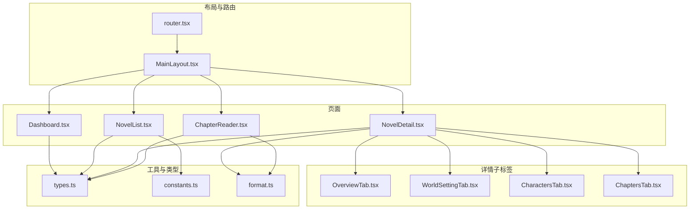
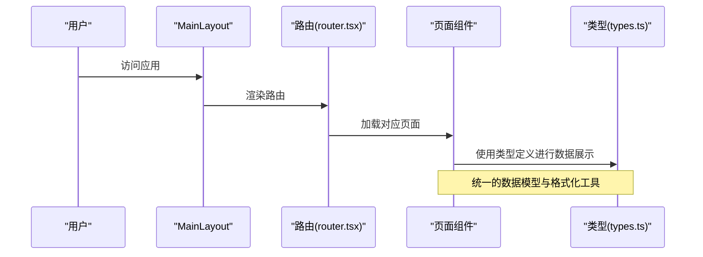
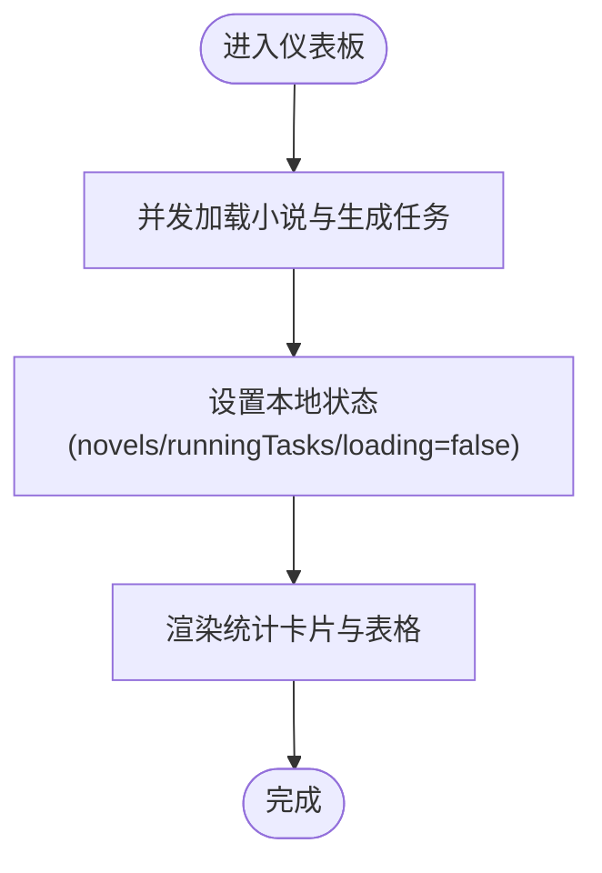
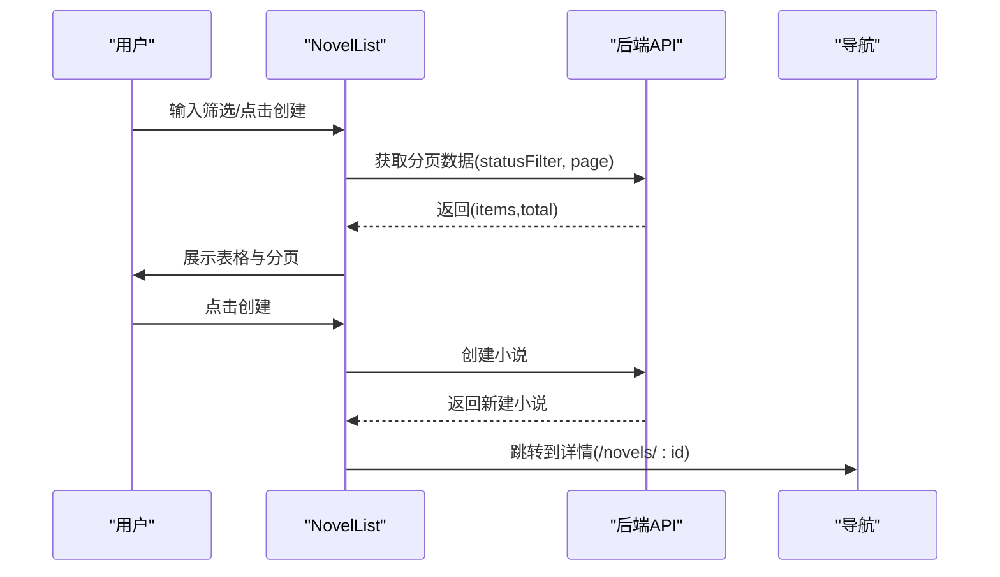
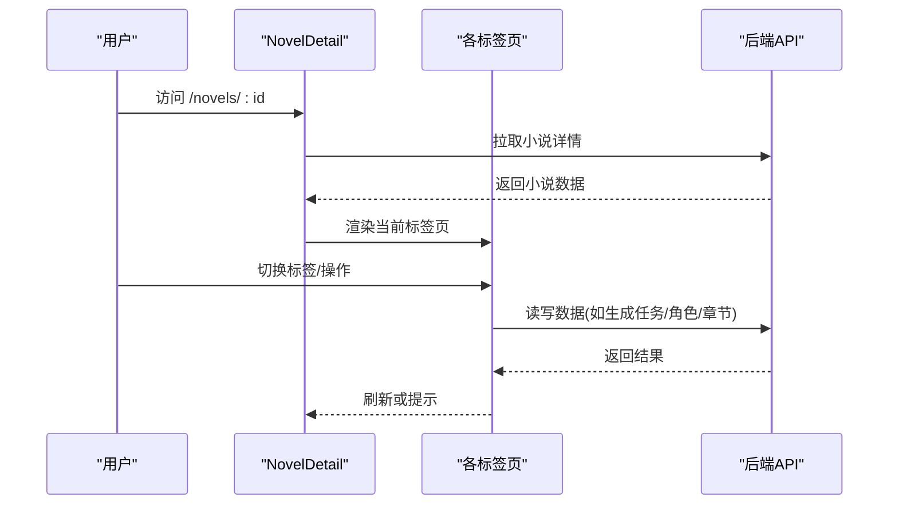
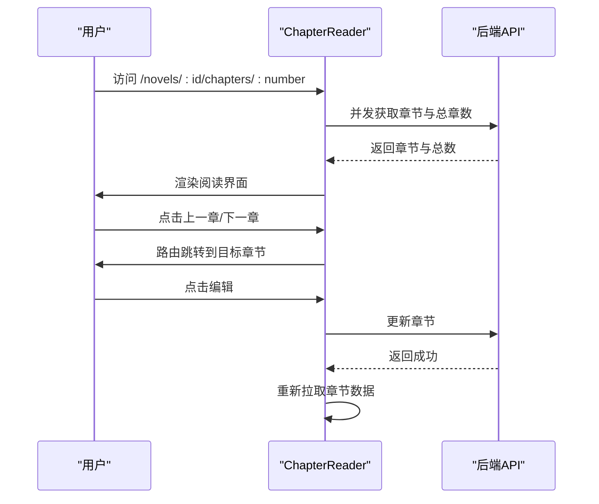
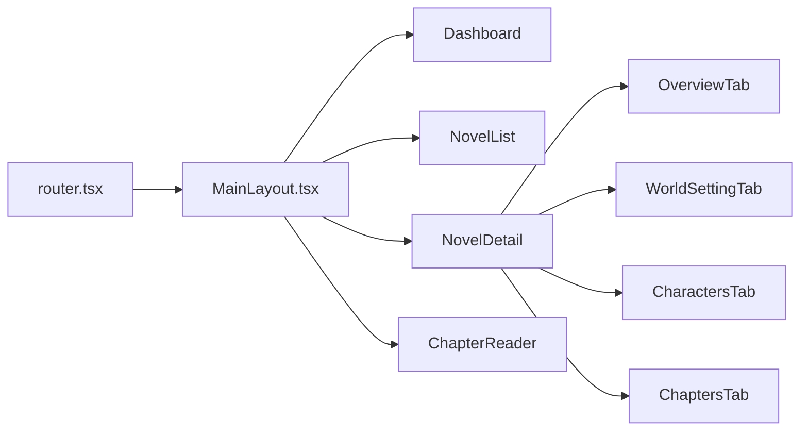
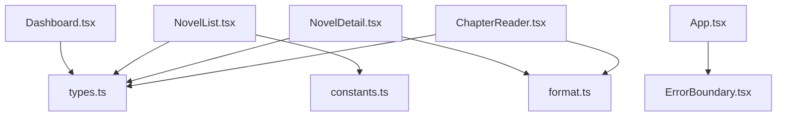

# 页面组件设计

<cite>
**本文引用的文件**
- [frontend/src/pages/Dashboard.tsx](file://frontend/src/pages/Dashboard.tsx)
- [frontend/src/pages/NovelList.tsx](file://frontend/src/pages/NovelList.tsx)
- [frontend/src/pages/ChapterReader.tsx](file://frontend/src/pages/ChapterReader.tsx)
- [frontend/src/pages/NovelDetail/NovelDetail.tsx](file://frontend/src/pages/NovelDetail/NovelDetail.tsx)
- [frontend/src/pages/NovelDetail/OverviewTab.tsx](file://frontend/src/pages/NovelDetail/OverviewTab.tsx)
- [frontend/src/pages/NovelDetail/WorldSettingTab.tsx](file://frontend/src/pages/NovelDetail/WorldSettingTab.tsx)
- [frontend/src/pages/NovelDetail/CharactersTab.tsx](file://frontend/src/pages/NovelDetail/CharactersTab.tsx)
- [frontend/src/pages/NovelDetail/ChaptersTab.tsx](file://frontend/src/pages/NovelDetail/ChaptersTab.tsx)
- [frontend/src/components/Layout/MainLayout.tsx](file://frontend/src/components/Layout/MainLayout.tsx)
- [frontend/src/router.tsx](file://frontend/src/router.tsx)
- [frontend/src/api/types.ts](file://frontend/src/api/types.ts)
- [frontend/src/utils/constants.ts](file://frontend/src/utils/constants.ts)
- [frontend/src/utils/format.ts](file://frontend/src/utils/format.ts)
- [frontend/src/components/ErrorBoundary.tsx](file://frontend/src/components/ErrorBoundary.tsx)
- [frontend/src/App.tsx](file://frontend/src/App.tsx)
</cite>

## 目录
1. [引言](#引言)
2. [项目结构](#项目结构)
3. [核心组件](#核心组件)
4. [架构总览](#架构总览)
5. [详细组件分析](#详细组件分析)
6. [依赖分析](#依赖分析)
7. [性能考虑](#性能考虑)
8. [故障排查指南](#故障排查指南)
9. [结论](#结论)
10. [附录](#附录)

## 引言
本文件面向前端开发者，系统化梳理小说系统的页面组件设计与实现，覆盖仪表板、小说列表、小说详情（多标签页）、章节阅读器等核心页面。文档从架构、状态管理、数据流、导航与权限、性能优化到可访问性与SEO等方面进行全面说明，并提供可视化图示帮助理解。

## 项目结构
前端采用基于 React + Ant Design 的单页应用，页面组件位于 frontend/src/pages，布局与路由位于 frontend/src/components 与 frontend/src/router.tsx，API 类型定义于 frontend/src/api/types.ts，通用常量与格式化工具位于 frontend/src/utils。

图表来源
- [frontend/src/components/Layout/MainLayout.tsx](file://frontend/src/components/Layout/MainLayout.tsx#L1-L83)
- [frontend/src/router.tsx](file://frontend/src/router.tsx#L1-L30)
- [frontend/src/pages/Dashboard.tsx](file://frontend/src/pages/Dashboard.tsx#L1-L95)
- [frontend/src/pages/NovelList.tsx](file://frontend/src/pages/NovelList.tsx#L1-L162)
- [frontend/src/pages/NovelDetail/NovelDetail.tsx](file://frontend/src/pages/NovelDetail/NovelDetail.tsx#L1-L110)
- [frontend/src/pages/ChapterReader.tsx](file://frontend/src/pages/ChapterReader.tsx#L1-L161)
- [frontend/src/pages/NovelDetail/OverviewTab.tsx](file://frontend/src/pages/NovelDetail/OverviewTab.tsx#L1-L261)
- [frontend/src/pages/NovelDetail/WorldSettingTab.tsx](file://frontend/src/pages/NovelDetail/WorldSettingTab.tsx#L1-L122)
- [frontend/src/pages/NovelDetail/CharactersTab.tsx](file://frontend/src/pages/NovelDetail/CharactersTab.tsx#L1-L298)
- [frontend/src/pages/NovelDetail/ChaptersTab.tsx](file://frontend/src/pages/NovelDetail/ChaptersTab.tsx#L1-L157)
- [frontend/src/api/types.ts](file://frontend/src/api/types.ts#L1-L352)
- [frontend/src/utils/constants.ts](file://frontend/src/utils/constants.ts#L1-L39)
- [frontend/src/utils/format.ts](file://frontend/src/utils/format.ts#L1-L23)

章节来源
- [frontend/src/router.tsx](file://frontend/src/router.tsx#L1-L30)
- [frontend/src/components/Layout/MainLayout.tsx](file://frontend/src/components/Layout/MainLayout.tsx#L1-L83)

## 核心组件
- 仪表板 Dashboard：聚合统计、最近小说卡片、进行中生成任务列表。
- 小说列表 NovelList：分页表格、筛选、创建/删除、AI辅助入口。
- 小说详情 NovelDetail：多标签页（概览、世界观、角色、大纲、章节、生成历史），面包屑导航，AI助手抽屉。
- 章节阅读器 ChapterReader：章节内容渲染、前后章节导航、章节编辑弹窗。
- 主布局 MainLayout：侧边菜单、头部标题、内容区 Outlet。

章节来源
- [frontend/src/pages/Dashboard.tsx](file://frontend/src/pages/Dashboard.tsx#L1-L95)
- [frontend/src/pages/NovelList.tsx](file://frontend/src/pages/NovelList.tsx#L1-L162)
- [frontend/src/pages/NovelDetail/NovelDetail.tsx](file://frontend/src/pages/NovelDetail/NovelDetail.tsx#L1-L110)
- [frontend/src/pages/ChapterReader.tsx](file://frontend/src/pages/ChapterReader.tsx#L1-L161)
- [frontend/src/components/Layout/MainLayout.tsx](file://frontend/src/components/Layout/MainLayout.tsx#L1-L83)

## 架构总览
页面通过 MainLayout 包裹，使用 react-router-dom 的 createBrowserRouter 进行路由配置。页面间通过面包屑、按钮与路由跳转连接；数据通过统一的类型定义与格式化工具进行标准化展示。

图表来源
- [frontend/src/components/Layout/MainLayout.tsx](file://frontend/src/components/Layout/MainLayout.tsx#L1-L83)
- [frontend/src/router.tsx](file://frontend/src/router.tsx#L1-L30)
- [frontend/src/api/types.ts](file://frontend/src/api/types.ts#L1-L352)

## 详细组件分析

### 仪表板 Dashboard
- 状态管理
  - 本地状态：novels、runningTasks、loading。
  - 异步加载：并发请求小说列表与运行中生成任务，Promise.all 并行提升性能。
- 数据展示
  - 统计卡片：总数、字数、成本、进行中任务。
  - 最近小说：网格卡片展示，空态提示。
  - 进行中任务：Ant Design 表格展示任务类型、状态、开始时间。
- 性能
  - 并发请求减少总等待时间。
  - 加载态使用 Spin 提升交互体验。

图表来源
- [frontend/src/pages/Dashboard.tsx](file://frontend/src/pages/Dashboard.tsx#L22-L36)

章节来源
- [frontend/src/pages/Dashboard.tsx](file://frontend/src/pages/Dashboard.tsx#L1-L95)

### 小说列表 NovelList
- 状态管理
  - 本地状态：novels、total、page、statusFilter、loading、模态框开关、表单实例。
  - 异步加载：按页码与状态过滤拉取数据，支持重置页码。
- CRUD 操作
  - 创建：表单校验后调用创建接口，成功后跳转详情。
  - 删除：二次确认 Modal，调用删除接口后刷新列表。
- 导航与数据传递
  - 面包屑与按钮跳转到详情页。
  - 查询字符串/路由参数：通过 useNavigate 传入 novel id。
- 权限与鉴权
  - 当前仓库未见路由守卫与鉴权逻辑，建议在路由层或页面入口增加鉴权拦截。

图表来源
- [frontend/src/pages/NovelList.tsx](file://frontend/src/pages/NovelList.tsx#L26-L35)
- [frontend/src/pages/NovelList.tsx](file://frontend/src/pages/NovelList.tsx#L39-L53)

章节来源
- [frontend/src/pages/NovelList.tsx](file://frontend/src/pages/NovelList.tsx#L1-L162)

### 小说详情 NovelDetail（多标签页）
- 状态管理
  - 本地状态：novel、loading、AI抽屉开关、当前激活标签键。
  - 异步加载：根据 novel id 拉取详情。
- 多标签页设计
  - 概览：统计、快速操作（开始企划、生成单章、批量生成、编辑小说）。
  - 世界观：展开式折叠面板，空态引导。
  - 角色：列表 + 抽屉详情 + 关系图谱。
  - 大纲：章节列表与删除。
  - 生成历史：与概览联动刷新。
- 导航与数据传递
  - 面包屑返回首页/列表/当前小说。
  - 标签切换通过 Tabs 控制 activeKey。
- 权限与鉴权
  - 未见路由守卫，建议在路由层或页面入口增加鉴权。

图表来源
- [frontend/src/pages/NovelDetail/NovelDetail.tsx](file://frontend/src/pages/NovelDetail/NovelDetail.tsx#L25-L33)
- [frontend/src/pages/NovelDetail/OverviewTab.tsx](file://frontend/src/pages/NovelDetail/OverviewTab.tsx#L33-L76)
- [frontend/src/pages/NovelDetail/WorldSettingTab.tsx](file://frontend/src/pages/NovelDetail/WorldSettingTab.tsx#L60-L70)
- [frontend/src/pages/NovelDetail/CharactersTab.tsx](file://frontend/src/pages/NovelDetail/CharactersTab.tsx#L30-L40)
- [frontend/src/pages/NovelDetail/ChaptersTab.tsx](file://frontend/src/pages/NovelDetail/ChaptersTab.tsx#L24-L33)

章节来源
- [frontend/src/pages/NovelDetail/NovelDetail.tsx](file://frontend/src/pages/NovelDetail/NovelDetail.tsx#L1-L110)
- [frontend/src/pages/NovelDetail/OverviewTab.tsx](file://frontend/src/pages/NovelDetail/OverviewTab.tsx#L1-L261)
- [frontend/src/pages/NovelDetail/WorldSettingTab.tsx](file://frontend/src/pages/NovelDetail/WorldSettingTab.tsx#L1-L122)
- [frontend/src/pages/NovelDetail/CharactersTab.tsx](file://frontend/src/pages/NovelDetail/CharactersTab.tsx#L1-L298)
- [frontend/src/pages/NovelDetail/ChaptersTab.tsx](file://frontend/src/pages/NovelDetail/ChaptersTab.tsx#L1-L157)

### 章节阅读器 ChapterReader
- 状态管理
  - 本地状态：chapter、totalChapters、loading、编辑弹窗、表单实例。
  - 异步加载：根据 novelId 与 chapter number 并发拉取章节与总章数。
- 阅读体验
  - 面包屑返回首页/详情。
  - 上一章/下一章按钮，禁用边界处理。
  - 编辑弹窗支持修改标题、内容、状态。
- 数据一致性
  - 保存后重新拉取章节数据，确保视图与后端一致。

图表来源
- [frontend/src/pages/ChapterReader.tsx](file://frontend/src/pages/ChapterReader.tsx#L22-L36)
- [frontend/src/pages/ChapterReader.tsx](file://frontend/src/pages/ChapterReader.tsx#L53-L65)

章节来源
- [frontend/src/pages/ChapterReader.tsx](file://frontend/src/pages/ChapterReader.tsx#L1-L161)

### 主布局 MainLayout 与路由
- 主布局
  - 侧边菜单项与当前选中状态绑定，点击触发导航。
  - 内容区通过 Outlet 渲染子路由页面。
- 路由
  - 定义根路径与子路由，包含仪表板、小说列表、小说详情、章节阅读器、发布管理、系统监控、404。
  - 路由参数：/novels/:id、/novels/:id/chapters/:number。

图表来源
- [frontend/src/router.tsx](file://frontend/src/router.tsx#L12-L27)
- [frontend/src/components/Layout/MainLayout.tsx](file://frontend/src/components/Layout/MainLayout.tsx#L22-L82)

章节来源
- [frontend/src/components/Layout/MainLayout.tsx](file://frontend/src/components/Layout/MainLayout.tsx#L1-L83)
- [frontend/src/router.tsx](file://frontend/src/router.tsx#L1-L30)

## 依赖分析
- 类型与格式化
  - 所有页面均依赖统一的类型定义与格式化工具，保证数据结构一致与展示规范。
- 常量映射
  - 状态枚举与选项通过 constants.ts 统一维护，避免硬编码。
- 错误边界
  - 应用根部包裹 ErrorBoundary，捕获子树异常并提供刷新入口。

图表来源
- [frontend/src/pages/Dashboard.tsx](file://frontend/src/pages/Dashboard.tsx#L1-L16)
- [frontend/src/pages/NovelList.tsx](file://frontend/src/pages/NovelList.tsx#L1-L12)
- [frontend/src/pages/NovelDetail/NovelDetail.tsx](file://frontend/src/pages/NovelDetail/NovelDetail.tsx#L1-L9)
- [frontend/src/pages/ChapterReader.tsx](file://frontend/src/pages/ChapterReader.tsx#L1-L10)
- [frontend/src/utils/constants.ts](file://frontend/src/utils/constants.ts#L1-L39)
- [frontend/src/utils/format.ts](file://frontend/src/utils/format.ts#L1-L23)
- [frontend/src/components/ErrorBoundary.tsx](file://frontend/src/components/ErrorBoundary.tsx#L1-L43)
- [frontend/src/App.tsx](file://frontend/src/App.tsx#L1-L16)

章节来源
- [frontend/src/api/types.ts](file://frontend/src/api/types.ts#L1-L352)
- [frontend/src/utils/constants.ts](file://frontend/src/utils/constants.ts#L1-L39)
- [frontend/src/utils/format.ts](file://frontend/src/utils/format.ts#L1-L23)
- [frontend/src/components/ErrorBoundary.tsx](file://frontend/src/components/ErrorBoundary.tsx#L1-L43)
- [frontend/src/App.tsx](file://frontend/src/App.tsx#L1-L16)

## 性能考虑
- 懒加载与代码分割
  - 将大型标签页组件（如关系图谱、生成历史）按需加载，减少首屏体积。
- 虚拟滚动
  - 在角色列表、章节列表等长列表场景引入虚拟滚动，降低 DOM 节点数量。
- 图片优化
  - 封面图与头像使用懒加载与合适的尺寸裁剪，结合 WebP 格式。
- 并发与缓存
  - 并发请求已用于仪表板与章节阅读器，建议为常用列表与详情增加内存缓存与失效策略。
- 防抖与节流
  - 筛选器与搜索输入建议加入防抖，减少频繁请求。
- 预取与预渲染
  - 在进入列表页时预取详情页所需的基础数据，缩短交互延迟。

## 故障排查指南
- 全局错误边界
  - ErrorBoundary 捕获子树异常，显示错误结果并提供刷新入口。
- 页面级错误处理
  - 章节阅读器与详情页对不存在资源进行友好提示。
- 请求拦截与错误提示
  - API 层拦截错误并在组件内进行提示，避免未处理异常导致崩溃。
- 调试建议
  - 使用浏览器网络面板观察并发请求与响应状态。
  - 在开发环境开启严格模式与 ESLint 规则，尽早暴露潜在问题。

章节来源
- [frontend/src/components/ErrorBoundary.tsx](file://frontend/src/components/ErrorBoundary.tsx#L1-L43)
- [frontend/src/pages/ChapterReader.tsx](file://frontend/src/pages/ChapterReader.tsx#L31-L35)
- [frontend/src/pages/NovelDetail/NovelDetail.tsx](file://frontend/src/pages/NovelDetail/NovelDetail.tsx#L37-L38)

## 结论
该页面组件设计以清晰的路由结构与统一的类型/格式化工具为基础，围绕仪表板、列表、详情与阅读器构建了完整的创作工作流。通过并发加载、弹窗/抽屉交互与标签页组织，提升了用户体验。建议后续补充路由守卫、鉴权与更完善的缓存策略，并在长列表场景引入虚拟滚动与图片优化，进一步提升性能与可访问性。

## 附录
- 可访问性设计
  - 为按钮与链接提供明确的 ARIA 标签与键盘导航支持。
  - 为图片与图标提供替代文本，确保屏幕阅读器可用。
- SEO 优化
  - 为详情页与阅读器页生成结构化数据（如 Schema.org），增强搜索引擎理解。
  - 使用语义化 HTML 与合理的标题层级，配合面包屑提升可发现性。
- 测试策略
  - 单元测试：针对状态变更与异步加载流程编写断言。
  - 端到端测试：覆盖导航、CRUD、权限拦截等关键路径。
  - 可访问性测试：使用 axe 或类似工具检查 WCAG 合规性。