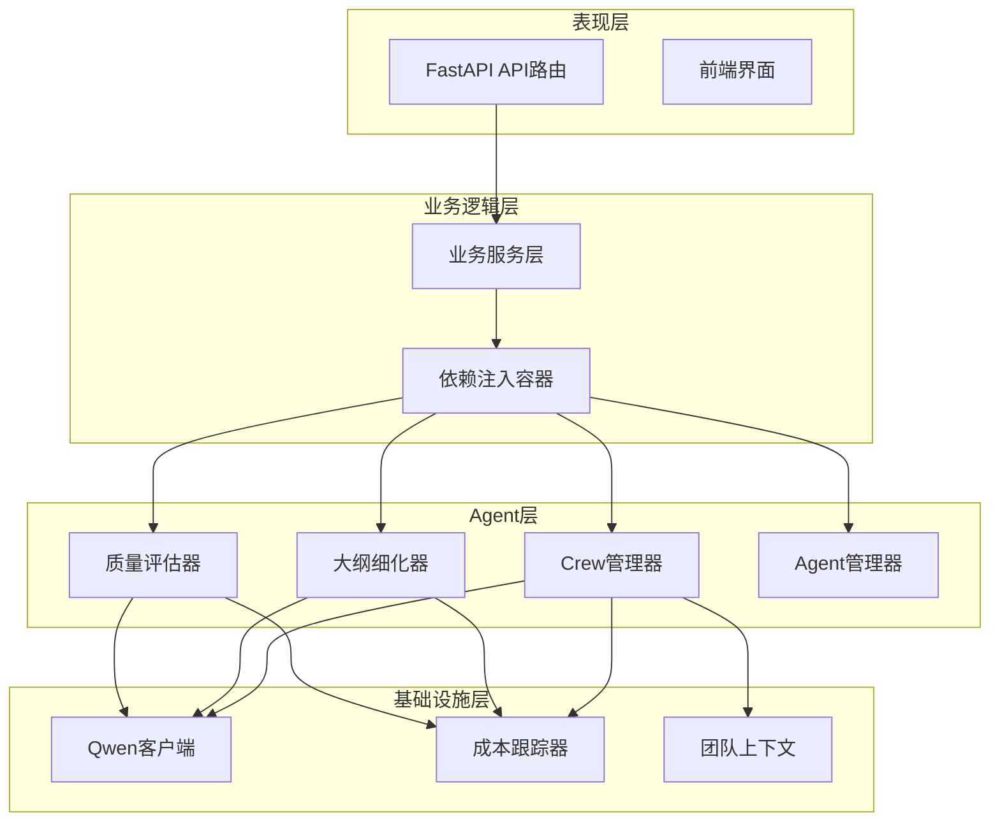
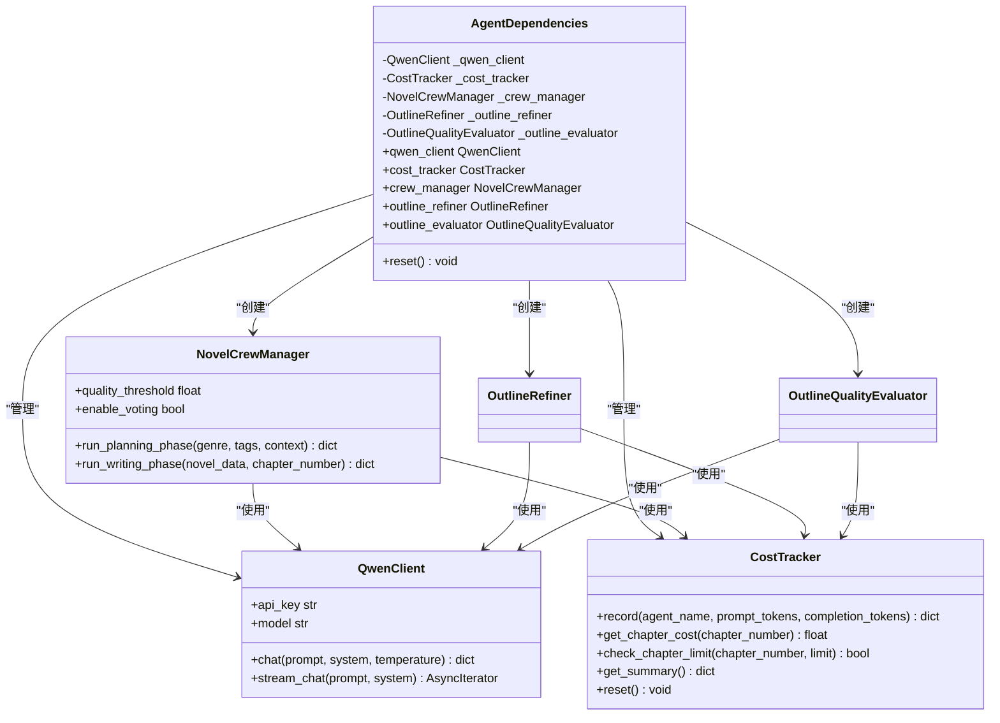
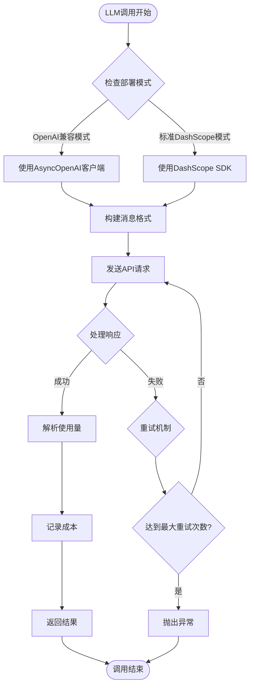
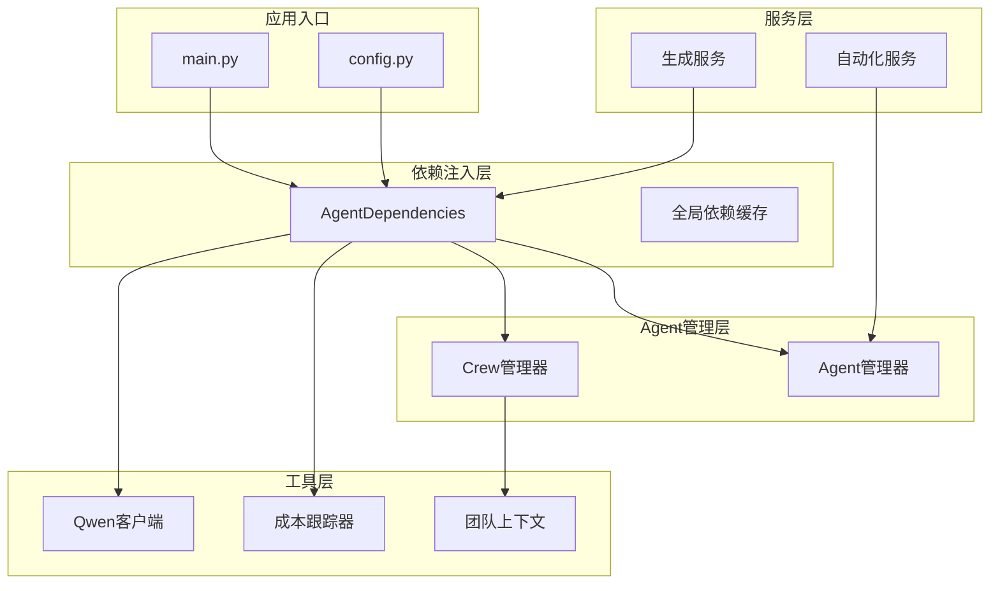
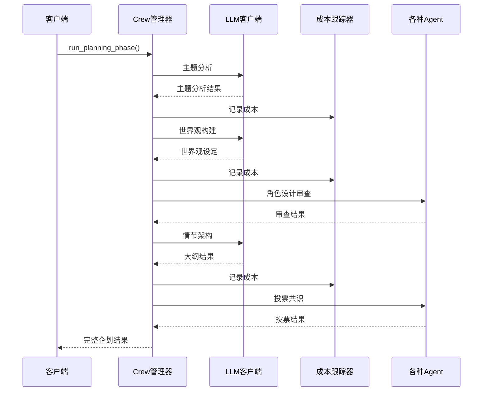
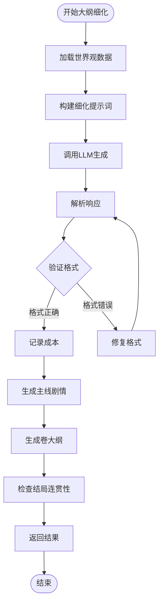
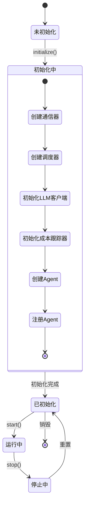
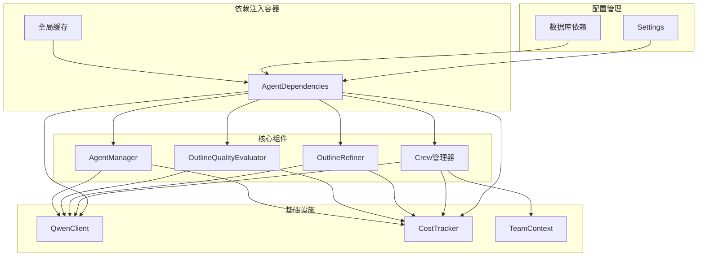

# Agent依赖注入容器

<cite>
**本文档引用的文件**
- [agents.py](file://backend/dependencies/agents.py)
- [crew_manager.py](file://agents/crew_manager.py)
- [qwen_client.py](file://llm/qwen_client.py)
- [cost_tracker.py](file://llm/cost_tracker.py)
- [outline_refiner.py](file://agents/outline_refiner.py)
- [outline_quality_evaluator.py](file://agents/outline_quality_evaluator.py)
- [agent_manager.py](file://agents/agent_manager.py)
- [team_context.py](file://agents/team_context.py)
- [config.py](file://backend/config.py)
- [dependencies.py](file://backend/dependencies.py)
- [main.py](file://backend/main.py)
</cite>

## 目录
1. [简介](#简介)
2. [项目结构](#项目结构)
3. [核心组件](#核心组件)
4. [架构概览](#架构概览)
5. [详细组件分析](#详细组件分析)
6. [依赖关系分析](#依赖关系分析)
7. [性能考虑](#性能考虑)
8. [故障排除指南](#故障排除指南)
9. [结论](#结论)

## 简介

本文档深入分析了小说生成系统的Agent依赖注入容器架构。该系统采用模块化的依赖注入设计，通过统一的AgentDependencies类管理所有Agent组件的生命周期和依赖关系。系统支持多种Agent类型，包括Crew管理器、大纲细化器、质量评估器等，实现了高度解耦和可扩展的多Agent协作架构。

## 项目结构

小说生成系统采用分层架构设计，主要分为以下几个核心层次：

**图表来源**
- [agents.py:12-79](file://backend/dependencies/agents.py#L12-L79)
- [crew_manager.py:38-158](file://agents/crew_manager.py#L38-L158)
- [qwen_client.py:16-243](file://llm/qwen_client.py#L16-L243)
- [cost_tracker.py:16-120](file://llm/cost_tracker.py#L16-L120)

**章节来源**
- [agents.py:1-106](file://backend/dependencies/agents.py#L1-L106)
- [crew_manager.py:1-800](file://agents/crew_manager.py#L1-L800)
- [qwen_client.py:1-243](file://llm/qwen_client.py#L1-L243)
- [cost_tracker.py:1-120](file://llm/cost_tracker.py#L1-L120)

## 核心组件

### Agent依赖注入容器

AgentDependencies类是整个系统的核心依赖注入容器，采用延迟初始化和单例模式设计：

**图表来源**
- [agents.py:12-79](file://backend/dependencies/agents.py#L12-L79)
- [qwen_client.py:16-243](file://llm/qwen_client.py#L16-L243)
- [cost_tracker.py:16-120](file://llm/cost_tracker.py#L16-L120)
- [crew_manager.py:38-158](file://agents/crew_manager.py#L38-L158)

### LLM客户端抽象

QwenClient提供了统一的LLM接口抽象，支持多种部署模式：

**图表来源**
- [qwen_client.py:57-172](file://llm/qwen_client.py#L57-L172)

**章节来源**
- [agents.py:12-106](file://backend/dependencies/agents.py#L12-L106)
- [qwen_client.py:16-243](file://llm/qwen_client.py#L16-L243)
- [cost_tracker.py:16-120](file://llm/cost_tracker.py#L16-L120)

## 架构概览

系统采用分层依赖注入架构，实现了高度的模块化和可测试性：

**图表来源**
- [main.py:62-90](file://backend/main.py#L62-L90)
- [config.py:7-132](file://backend/config.py#L7-L132)
- [agents.py:75-79](file://backend/dependencies/agents.py#L75-L79)

## 详细组件分析

### Crew管理器

Crew管理器是系统的核心协调组件，负责管理多个Agent的协作：

**图表来源**
- [crew_manager.py:422-695](file://agents/crew_manager.py#L422-L695)

### 大纲细化器

OutlineRefiner专门负责大纲的细化和完善工作：

**图表来源**
- [outline_refiner.py:31-223](file://agents/outline_refiner.py#L31-L223)

### Agent管理器

AgentManager提供全局的Agent生命周期管理：

**图表来源**
- [agent_manager.py:43-157](file://agents/agent_manager.py#L43-L157)

**章节来源**
- [crew_manager.py:38-695](file://agents/crew_manager.py#L38-L695)
- [outline_refiner.py:18-223](file://agents/outline_refiner.py#L18-L223)
- [agent_manager.py:22-157](file://agents/agent_manager.py#L22-L157)

## 依赖关系分析

系统采用双向依赖关系，既支持从容器获取组件，也支持组件间的相互依赖：

**图表来源**
- [agents.py:12-106](file://backend/dependencies/agents.py#L12-L106)
- [crew_manager.py:91-158](file://agents/crew_manager.py#L91-L158)
- [outline_refiner.py:21-29](file://agents/outline_refiner.py#L21-L29)
- [outline_quality_evaluator.py:96-103](file://agents/outline_quality_evaluator.py#L96-L103)

**章节来源**
- [agents.py:12-106](file://backend/dependencies/agents.py#L12-L106)
- [config.py:7-132](file://backend/config.py#L7-L132)
- [dependencies.py:12-22](file://backend/dependencies.py#L12-L22)

## 性能考虑

系统在性能方面采用了多项优化策略：

### 缓存策略
- 使用`@lru_cache(maxsize=1)`确保AgentDependencies单例模式
- 依赖对象按需初始化，避免不必要的资源消耗
- 成本跟踪器支持章节级别的成本统计

### 异步处理
- 所有LLM调用采用异步模式
- 支持流式响应处理
- 数据库操作使用异步连接池

### 资源管理
- 自动重试机制，最多3次重试
- 超时控制，防止长时间阻塞
- 连接池管理，避免资源泄漏

## 故障排除指南

### 常见问题及解决方案

**LLM API调用失败**
- 检查API密钥配置
- 验证网络连接和代理设置
- 查看重试日志和错误信息

**内存泄漏问题**
- 确认Agent实例正确销毁
- 检查循环引用情况
- 监控对象生命周期

**性能问题**
- 分析成本跟踪器统计数据
- 检查并发限制设置
- 优化提示词长度和复杂度

**章节来源**
- [qwen_client.py:76-172](file://llm/qwen_client.py#L76-L172)
- [cost_tracker.py:28-82](file://llm/cost_tracker.py#L28-L82)
- [crew_manager.py:371-416](file://agents/crew_manager.py#L371-L416)

## 结论

小说生成系统的Agent依赖注入容器架构展现了现代AI应用的最佳实践。通过模块化的依赖注入设计，系统实现了高度的解耦和可扩展性。核心优势包括：

1. **统一的依赖管理**：通过AgentDependencies类集中管理所有组件依赖
2. **灵活的生命周期控制**：支持按需初始化和资源重置
3. **强大的扩展性**：易于添加新的Agent类型和功能模块
4. **完善的监控机制**：成本跟踪和性能监控一体化设计
5. **可靠的错误处理**：多重重试和异常处理机制

该架构为大规模AI应用提供了可复用的依赖注入模式，值得在类似项目中借鉴和应用。