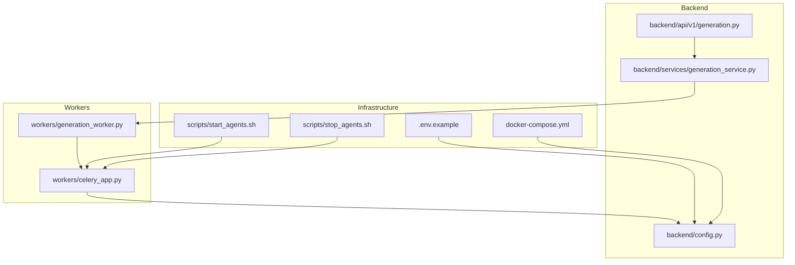
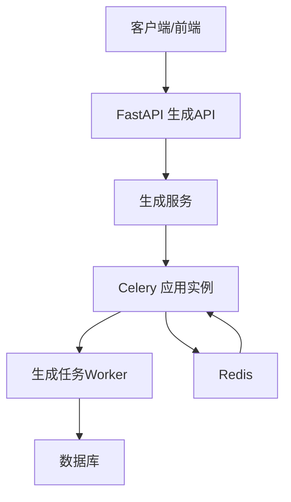
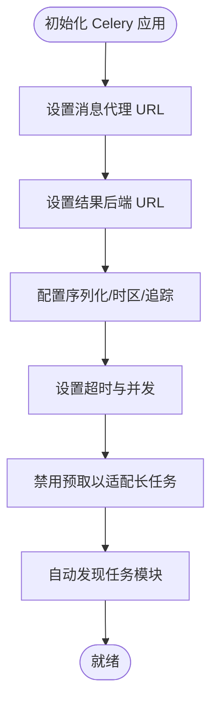
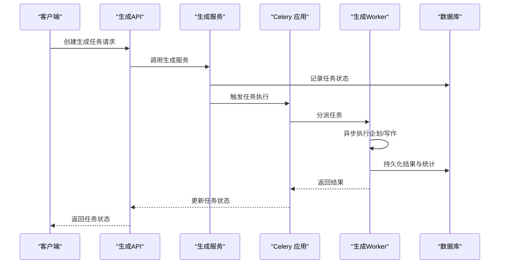
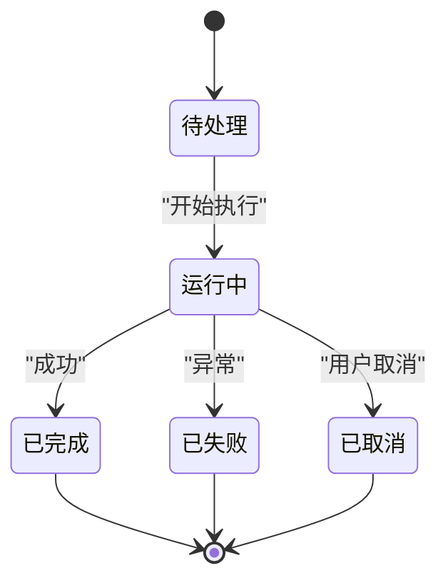
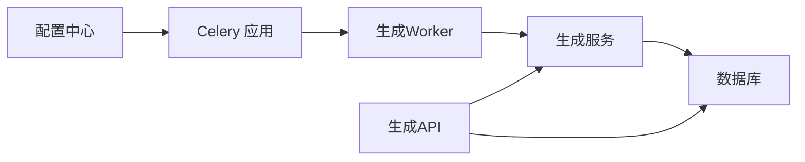

# Celery异步任务系统

<cite>
**本文档引用的文件**
- [workers/celery_app.py](file://workers/celery_app.py)
- [workers/generation_worker.py](file://workers/generation_worker.py)
- [backend/config.py](file://backend/config.py)
- [backend/api/v1/generation.py](file://backend/api/v1/generation.py)
- [backend/services/generation_service.py](file://backend/services/generation_service.py)
- [.env.example](file://.env.example)
- [docker-compose.yml](file://docker-compose.yml)
- [scripts/start_agents.sh](file://scripts/start_agents.sh)
- [scripts/stop_agents.sh](file://scripts/stop_agents.sh)
</cite>

## 目录
1. [简介](#简介)
2. [项目结构](#项目结构)
3. [核心组件](#核心组件)
4. [架构概览](#架构概览)
5. [详细组件分析](#详细组件分析)
6. [依赖关系分析](#依赖关系分析)
7. [性能考量](#性能考量)
8. [故障排查指南](#故障排查指南)
9. [结论](#结论)
10. [附录](#附录)

## 简介
本文件为小说生成系统的Celery异步任务系统提供全面的技术文档。系统采用Redis作为消息代理与结果存储，通过Celery实现任务的异步执行与状态追踪。本文档涵盖Celery应用配置、任务定义与执行流程、任务调度策略、监控与管理、扩展指南以及部署与运维要点，帮助系统管理员与开发者高效集成与维护该系统。

## 项目结构
与Celery任务系统直接相关的文件组织如下：
- workers：Celery应用实例与具体任务实现
- backend：配置、API与业务服务层
- scripts：进程启动与停止脚本
- docker-compose：数据库与缓存服务容器编排
- .env.example：环境变量示例

**图表来源**
- [workers/celery_app.py](file://workers/celery_app.py#L1-L26)
- [workers/generation_worker.py](file://workers/generation_worker.py#L1-L70)
- [backend/config.py](file://backend/config.py#L1-L59)
- [backend/api/v1/generation.py](file://backend/api/v1/generation.py#L1-L171)
- [backend/services/generation_service.py](file://backend/services/generation_service.py#L1-L689)
- [.env.example](file://.env.example#L1-L21)
- [docker-compose.yml](file://docker-compose.yml#L1-L25)
- [scripts/start_agents.sh](file://scripts/start_agents.sh#L1-L35)
- [scripts/stop_agents.sh](file://scripts/stop_agents.sh#L1-L60)

**章节来源**
- [workers/celery_app.py](file://workers/celery_app.py#L1-L26)
- [workers/generation_worker.py](file://workers/generation_worker.py#L1-L70)
- [backend/config.py](file://backend/config.py#L1-L59)
- [backend/api/v1/generation.py](file://backend/api/v1/generation.py#L1-L171)
- [backend/services/generation_service.py](file://backend/services/generation_service.py#L1-L689)
- [.env.example](file://.env.example#L1-L21)
- [docker-compose.yml](file://docker-compose.yml#L1-L25)
- [scripts/start_agents.sh](file://scripts/start_agents.sh#L1-L35)
- [scripts/stop_agents.sh](file://scripts/stop_agents.sh#L1-L60)

## 核心组件
- Celery应用实例：负责连接Redis消息代理与结果后端，配置序列化、时区、并发与任务超时等参数，并自动发现任务模块。
- 生成任务Worker：定义企划与写作两类Celery任务，封装异步执行逻辑并在同步任务上下文中运行协程。
- 配置中心：集中管理数据库、Redis、Celery等关键配置，支持从环境变量加载。
- API层：提供任务创建、查询与取消接口，结合业务服务执行具体生成流程。
- 业务服务：封装生成服务，协调Agent调度器与数据库持久化，处理任务状态与结果。

**章节来源**
- [workers/celery_app.py](file://workers/celery_app.py#L1-L26)
- [workers/generation_worker.py](file://workers/generation_worker.py#L1-L70)
- [backend/config.py](file://backend/config.py#L1-L59)
- [backend/api/v1/generation.py](file://backend/api/v1/generation.py#L1-L171)
- [backend/services/generation_service.py](file://backend/services/generation_service.py#L1-L689)

## 架构概览
系统采用“API → 业务服务 → Celery Worker → 数据库”的分层架构。Redis同时承担消息代理与结果存储，确保任务状态与结果可追踪。

**图表来源**
- [backend/api/v1/generation.py](file://backend/api/v1/generation.py#L23-L103)
- [backend/services/generation_service.py](file://backend/services/generation_service.py#L36-L204)
- [workers/celery_app.py](file://workers/celery_app.py#L6-L25)
- [workers/generation_worker.py](file://workers/generation_worker.py#L58-L69)
- [backend/config.py](file://backend/config.py#L28-L34)

## 详细组件分析

### Celery应用配置
- 消息代理与结果后端：使用Redis URL分别指向不同数据库索引，确保消息与结果隔离。
- 序列化与内容类型：统一使用JSON序列化，保证跨语言与跨服务兼容性。
- 时区与时钟：启用UTC并设置亚洲/上海时区，便于任务时间戳与日志一致性。
- 任务追踪与超时：开启任务启动追踪，设置硬超时与软超时，防止长任务占用资源。
- 并发与预取：限制worker并发度并禁用预取，保障长任务公平调度与稳定性。
- 自动发现：自动扫描workers包以注册任务。

**图表来源**
- [workers/celery_app.py](file://workers/celery_app.py#L6-L25)
- [backend/config.py](file://backend/config.py#L28-L34)

**章节来源**
- [workers/celery_app.py](file://workers/celery_app.py#L1-L26)
- [backend/config.py](file://backend/config.py#L28-L34)

### 任务定义与执行流程
- 任务类型
  - 企划任务：执行世界观、角色与大纲生成，完成后持久化到数据库并更新任务状态。
  - 写作任务：执行单章或批量章节写作，保存章节内容与统计信息。
- 异步执行：在同步Celery任务中运行协程，确保与业务服务一致的数据库会话管理。
- 参数传递：任务接收小说ID、任务ID及章节号等参数；批量写作额外携带起止章节范围。
- 结果存储：任务结果与状态写入数据库，供API查询与前端展示。

**图表来源**
- [backend/api/v1/generation.py](file://backend/api/v1/generation.py#L23-L103)
- [backend/services/generation_service.py](file://backend/services/generation_service.py#L36-L204)
- [workers/generation_worker.py](file://workers/generation_worker.py#L58-L69)

**章节来源**
- [workers/generation_worker.py](file://workers/generation_worker.py#L1-L70)
- [backend/services/generation_service.py](file://backend/services/generation_service.py#L36-L204)
- [backend/api/v1/generation.py](file://backend/api/v1/generation.py#L23-L103)

### 任务生命周期与状态管理
- 生命周期阶段：创建 → 排队 → 运行 → 完成/失败 → 结果可用。
- 状态字段：包含任务类型、阶段、输入输出数据、开始/完成时间、错误信息等。
- 终态保护：已完成/失败/取消的任务不可再次取消，防止状态倒退。
- 取消机制：通过API将任务状态置为取消，阻止后续处理。

**图表来源**
- [backend/api/v1/generation.py](file://backend/api/v1/generation.py#L152-L170)
- [backend/services/generation_service.py](file://backend/services/generation_service.py#L198-L204)

**章节来源**
- [backend/api/v1/generation.py](file://backend/api/v1/generation.py#L152-L170)
- [backend/services/generation_service.py](file://backend/services/generation_service.py#L198-L204)

### 任务调度策略
- 定时任务：当前仓库未见Celery定时任务配置，如需定时触发可在独立调度器中实现。
- 延迟任务：可通过Celery延时调用实现，但需评估与现有任务流的耦合度。
- 重试机制：当前未配置自动重试策略，建议在任务装饰器中增加重试与死信队列策略。
- 失败处理：任务异常被捕获并记录，状态更新至失败，便于人工介入与重试。

**章节来源**
- [workers/generation_worker.py](file://workers/generation_worker.py#L28-L34)
- [backend/services/generation_service.py](file://backend/services/generation_service.py#L198-L204)

### 任务监控与管理
- 状态查询：API提供任务详情查询，前端轮询展示任务进度与结果。
- 系统监控：监控服务聚合CPU、内存、磁盘与任务统计，支持系统健康度评估。
- 进度报告：批量写作任务返回完成/失败数量与进度字符串，便于前端展示。
- 性能监控：结合Redis与数据库指标，评估任务吞吐与资源占用。

**章节来源**
- [backend/api/v1/generation.py](file://backend/api/v1/generation.py#L137-L149)
- [backend/services/monitoring_service.py](file://backend/services/monitoring_service.py#L118-L133)
- [backend/services/generation_service.py](file://backend/services/generation_service.py#L510-L543)

### 任务扩展指南
- 自定义任务类型：在workers包中新增任务函数，使用装饰器注册名称，遵循现有参数与返回约定。
- 任务链与任务组：可利用Celery的链式与组合能力编排复杂工作流，注意错误传播与补偿。
- 动态任务调度：结合API层动态创建任务，传入不同输入参数以驱动多阶段生成流程。

**章节来源**
- [workers/generation_worker.py](file://workers/generation_worker.py#L58-L69)
- [backend/api/v1/generation.py](file://backend/api/v1/generation.py#L23-L103)

## 依赖关系分析
- Celery应用依赖配置中心提供的Redis URL。
- 生成Worker依赖Celery应用实例与业务服务。
- 业务服务依赖数据库会话工厂与Agent调度器。
- API层依赖业务服务与数据库访问。

**图表来源**
- [backend/config.py](file://backend/config.py#L28-L34)
- [workers/celery_app.py](file://workers/celery_app.py#L6-L25)
- [workers/generation_worker.py](file://workers/generation_worker.py#L1-L70)
- [backend/services/generation_service.py](file://backend/services/generation_service.py#L1-L689)
- [backend/api/v1/generation.py](file://backend/api/v1/generation.py#L1-L171)

**章节来源**
- [backend/config.py](file://backend/config.py#L28-L34)
- [workers/celery_app.py](file://workers/celery_app.py#L6-L25)
- [workers/generation_worker.py](file://workers/generation_worker.py#L1-L70)
- [backend/services/generation_service.py](file://backend/services/generation_service.py#L1-L689)
- [backend/api/v1/generation.py](file://backend/api/v1/generation.py#L1-L171)

## 性能考量
- 并发与预取：当前并发较低且禁用预取，适合长任务场景；若任务较短可适度提升并发。
- 超时设置：硬超时与软超时已配置，建议根据任务类型调整阈值。
- 序列化开销：JSON序列化简单可靠，但对复杂对象可能带来体积与转换成本。
- 资源监控：结合系统监控接口评估CPU、内存与网络I/O，识别瓶颈。

[本节为通用指导，无需列出章节来源]

## 故障排查指南
- 任务长时间无响应：检查worker并发与预取设置，确认任务是否被阻塞在外部调用。
- 任务失败：查看业务服务中的异常捕获与状态更新，定位具体环节。
- 结果不可见：确认Redis结果后端可达，检查任务ID与结果键空间。
- 进程管理：使用启动/停止脚本管理Agent进程，关注PID文件与日志输出。

**章节来源**
- [workers/generation_worker.py](file://workers/generation_worker.py#L28-L34)
- [backend/services/generation_service.py](file://backend/services/generation_service.py#L198-L204)
- [scripts/start_agents.sh](file://scripts/start_agents.sh#L1-L35)
- [scripts/stop_agents.sh](file://scripts/stop_agents.sh#L1-L60)

## 结论
该Celery异步任务系统通过清晰的分层设计与Redis基础设施，实现了小说生成任务的可靠执行与状态追踪。建议在现有基础上完善定时/重试策略、增强任务链编排能力，并持续优化并发与超时参数以匹配业务负载特征。

[本节为总结性内容，无需列出章节来源]

## 附录

### 部署与运维要点
- 环境变量：参考示例文件配置LLM、数据库与Celery参数。
- 容器编排：使用Compose启动PostgreSQL与Redis，确保端口映射与数据卷。
- 进程管理：通过脚本启动/停止Agent进程，定期检查日志与健康状态。
- 监控告警：结合系统监控接口设置阈值告警，保障任务执行稳定性。

**章节来源**
- [.env.example](file://.env.example#L1-L21)
- [docker-compose.yml](file://docker-compose.yml#L1-L25)
- [scripts/start_agents.sh](file://scripts/start_agents.sh#L1-L35)
- [scripts/stop_agents.sh](file://scripts/stop_agents.sh#L1-L60)