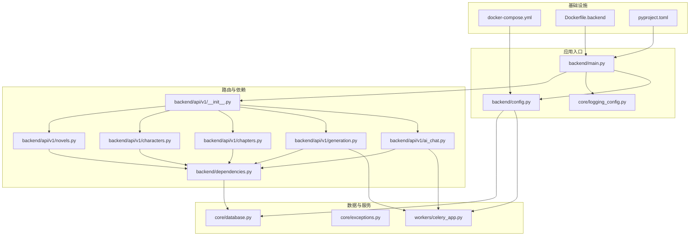
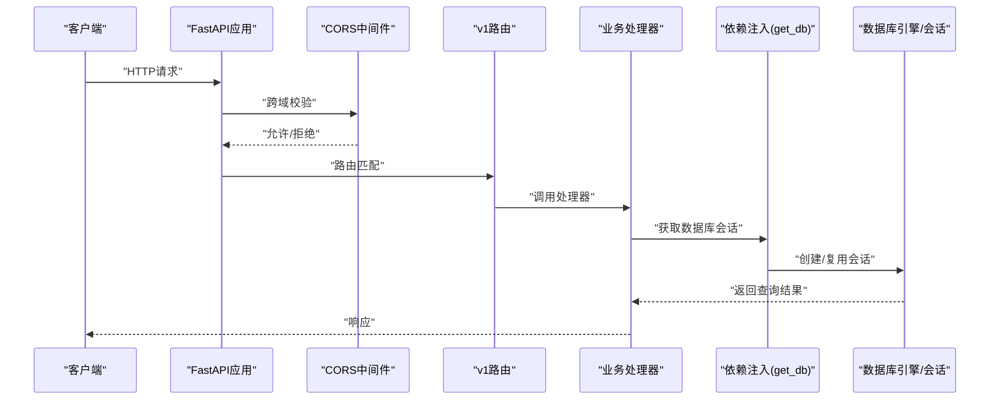
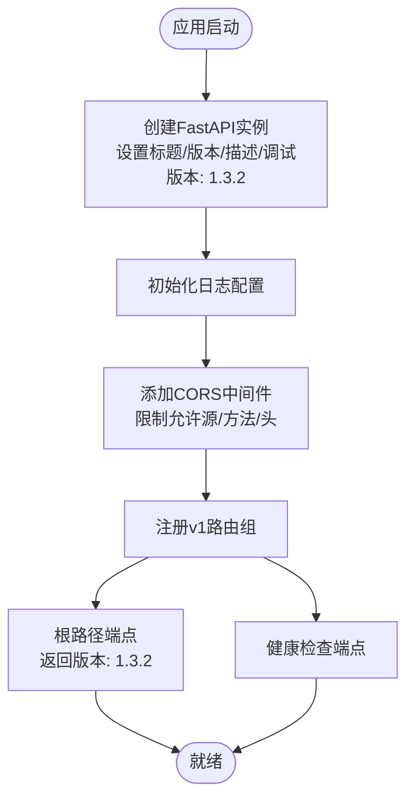
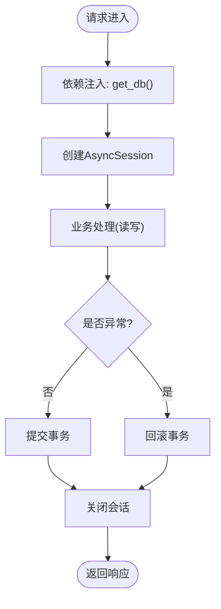
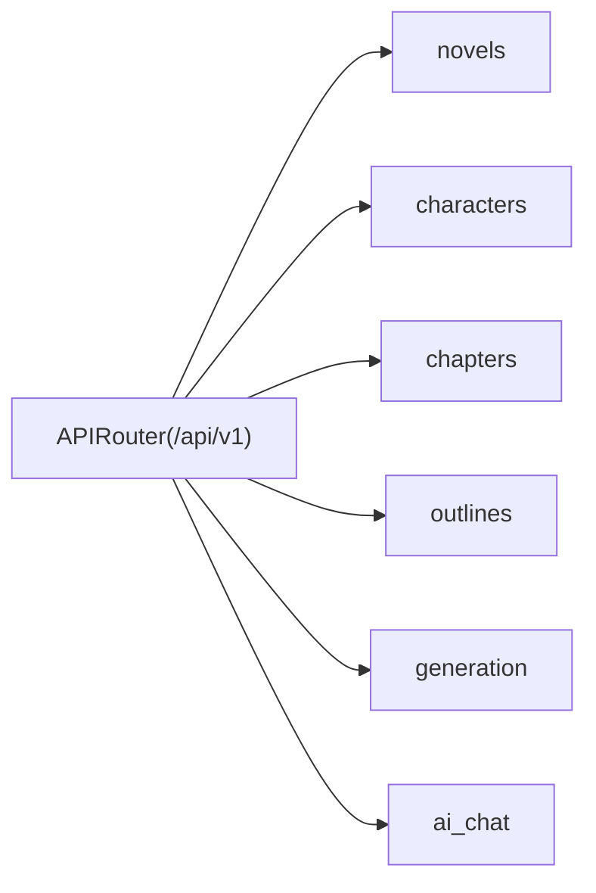
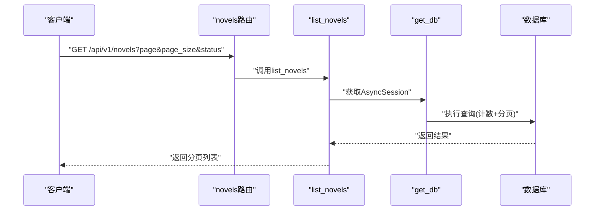
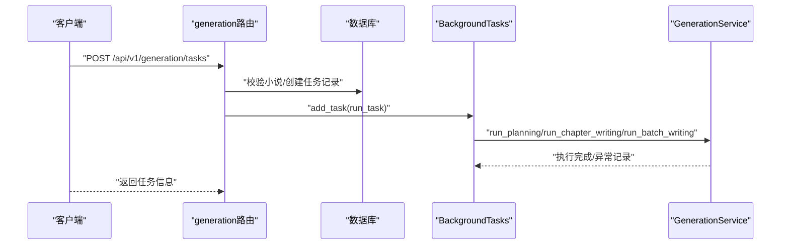
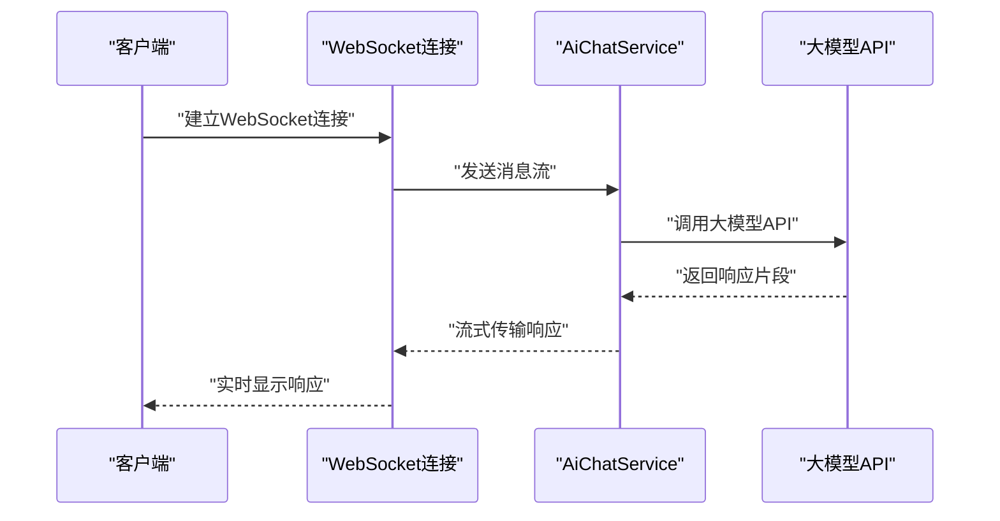
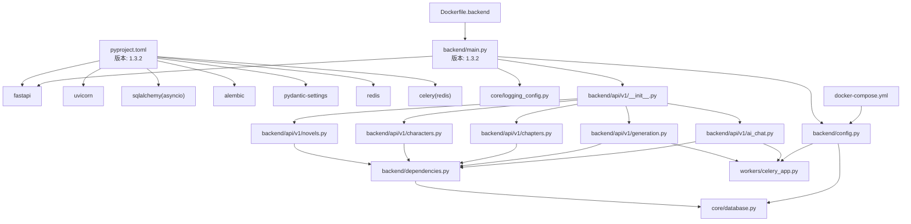

# FastAPI应用架构

<cite>
**本文引用的文件**
- [backend/main.py](file://backend/main.py)
- [backend/config.py](file://backend/config.py)
- [backend/dependencies.py](file://backend/dependencies.py)
- [backend/api/v1/__init__.py](file://backend/api/v1/__init__.py)
- [backend/api/v1/novels.py](file://backend/api/v1/novels.py)
- [backend/api/v1/characters.py](file://backend/api/v1/characters.py)
- [backend/api/v1/chapters.py](file://backend/api/v1/chapters.py)
- [backend/api/v1/generation.py](file://backend/api/v1/generation.py)
- [backend/api/v1/ai_chat.py](file://backend/api/v1/ai_chat.py)
- [core/database.py](file://core/database.py)
- [core/logging_config.py](file://core/logging_config.py)
- [core/exceptions.py](file://core/exceptions.py)
- [workers/celery_app.py](file://workers/celery_app.py)
- [docker-compose.yml](file://docker-compose.yml)
- [Dockerfile.backend](file://Dockerfile.backend)
- [pyproject.toml](file://pyproject.toml)
</cite>

## 更新摘要
**变更内容**
- 版本信息更新：FastAPI应用版本从1.3.1更新为1.3.2
- 项目版本同步：pyproject.toml中的项目版本同步更新为1.3.2
- API文档版本一致性：确保根端点返回的版本信息与应用版本保持一致

## 目录
1. [简介](#简介)
2. [项目结构](#项目结构)
3. [核心组件](#核心组件)
4. [架构总览](#架构总览)
5. [详细组件分析](#详细组件分析)
6. [依赖关系分析](#依赖关系分析)
7. [性能考虑](#性能考虑)
8. [故障排查指南](#故障排查指南)
9. [结论](#结论)
10. [附录](#附录)

## 简介
本文件为"小说生成系统"的FastAPI应用架构文档，聚焦于应用入口点的设计模式与运行机制，涵盖FastAPI实例配置、中间件链路、路由注册机制；CORS中间件的安全配置与异常处理；依赖注入系统；API版本化设计策略（v1路由组组织、标签分类与文档生成）；应用生命周期管理（启动初始化、健康检查、调试模式）；以及中间件配置最佳实践（跨域安全策略、请求日志记录、性能监控集成）。文档同时提供面向后端开发者的完整FastAPI应用开发指南。

**更新** 本次更新重点关注版本信息的准确性，确保应用版本、项目版本和API文档版本的一致性。

## 项目结构
该系统采用分层与功能混合的组织方式：入口位于backend/main.py，配置集中于backend/config.py，依赖注入定义在backend/dependencies.py，API路由按版本聚合在backend/api/v1，数据库引擎与会话工厂位于core/database.py，日志配置在core/logging_config.py，异常类型在core/exceptions.py，任务队列使用Celery并在workers/celery_app.py中配置，容器编排通过docker-compose.yml进行服务编排。

**图表来源**
- [backend/main.py:1-149](file://backend/main.py#L1-L149)
- [backend/config.py:1-167](file://backend/config.py#L1-L167)
- [backend/dependencies.py:1-23](file://backend/dependencies.py#L1-L23)
- [backend/api/v1/__init__.py:1-29](file://backend/api/v1/__init__.py#L1-L29)
- [backend/api/v1/novels.py:1-150](file://backend/api/v1/novels.py#L1-L150)
- [backend/api/v1/characters.py:1-203](file://backend/api/v1/characters.py#L1-L203)
- [backend/api/v1/chapters.py:1-200](file://backend/api/v1/chapters.py#L1-L200)
- [backend/api/v1/generation.py:1-171](file://backend/api/v1/generation.py#L1-L171)
- [backend/api/v1/ai_chat.py:1-421](file://backend/api/v1/ai_chat.py#L1-L421)
- [core/database.py:1-35](file://core/database.py#L1-L35)
- [core/logging_config.py:1-55](file://core/logging_config.py#L1-L55)
- [workers/celery_app.py:1-26](file://workers/celery_app.py#L1-L26)
- [docker-compose.yml:1-86](file://docker-compose.yml#L1-L86)
- [Dockerfile.backend:1-42](file://Dockerfile.backend#L1-L42)
- [pyproject.toml:1-64](file://pyproject.toml#L1-L64)

**章节来源**
- [backend/main.py:1-149](file://backend/main.py#L1-L149)
- [backend/config.py:1-167](file://backend/config.py#L1-L167)
- [backend/dependencies.py:1-23](file://backend/dependencies.py#L1-L23)
- [backend/api/v1/__init__.py:1-29](file://backend/api/v1/__init__.py#L1-L29)
- [core/database.py:1-35](file://core/database.py#L1-L35)
- [core/logging_config.py:1-55](file://core/logging_config.py#L1-L55)
- [docker-compose.yml:1-86](file://docker-compose.yml#L1-L86)
- [Dockerfile.backend:1-42](file://Dockerfile.backend#L1-L42)
- [pyproject.toml:1-64](file://pyproject.toml#L1-L64)

## 核心组件
- 应用入口与实例配置：在入口文件中创建FastAPI实例，设置标题、版本、描述与调试模式，并初始化日志；随后添加CORS中间件与根路径、健康检查端点。**更新** 应用版本已更新为1.3.2，确保与项目版本保持一致。
- 路由聚合与版本化：v1路由通过APIRouter聚合各子模块路由，统一前缀为/api/v1，便于后续扩展与文档生成。
- 依赖注入系统：通过共享依赖函数提供异步数据库会话，确保每个请求生命周期内正确创建、提交、回滚与关闭会话。
- 数据库与会话工厂：基于SQLAlchemy异步引擎与会话工厂，支持连接池与事务控制。
- 日志配置：根据调试开关调整日志级别，输出到控制台与轮转文件，并对第三方库日志进行降噪。
- 异常体系：自定义基础异常类及业务异常类型，便于统一错误处理与响应。
- 任务队列：Celery应用配置，支持序列化、时区、限时与并发策略，自动发现任务模块。

**章节来源**
- [backend/main.py:62-90](file://backend/main.py#L62-L90)
- [backend/api/v1/__init__.py:11-29](file://backend/api/v1/__init__.py#L11-L29)
- [backend/dependencies.py:12-19](file://backend/dependencies.py#L12-L19)
- [core/database.py:11-35](file://core/database.py#L11-L35)
- [core/logging_config.py:20-55](file://core/logging_config.py#L20-L55)
- [core/exceptions.py:1-24](file://core/exceptions.py#L1-L24)
- [workers/celery_app.py:6-26](file://workers/celery_app.py#L6-L26)

## 架构总览
下图展示应用启动到请求处理的关键交互：入口创建应用实例与中间件，注册v1路由，依赖注入提供数据库会话，业务路由调用服务层与数据库，Celery用于后台任务执行。

**图表来源**
- [backend/main.py:62-90](file://backend/main.py#L62-L90)
- [backend/api/v1/__init__.py:11-29](file://backend/api/v1/__init__.py#L11-L29)
- [backend/dependencies.py:12-19](file://backend/dependencies.py#L12-L19)
- [core/database.py:25-35](file://core/database.py#L25-L35)

## 详细组件分析

### 应用入口与中间件链路
- FastAPI实例配置：设置应用元信息与调试模式，调试模式影响数据库引擎echo行为与日志级别。**更新** 应用版本已更新为1.3.2，确保与项目版本一致。
- CORS中间件：限制允许源为本地前端开发服务器，允许凭据、常见方法与所有头部，满足开发场景下的跨域需求。
- 根与健康检查端点：根路径返回基本信息，健康检查返回服务状态，便于外部探活与监控。

**图表来源**
- [backend/main.py:62-116](file://backend/main.py#L62-L116)
- [core/logging_config.py:20-55](file://core/logging_config.py#L20-L55)

**章节来源**
- [backend/main.py:62-116](file://backend/main.py#L62-L116)
- [core/logging_config.py:20-55](file://core/logging_config.py#L20-L55)

### API路由标准化与尾随斜杠处理
**更新** 本次更新重点说明API路由标准化的重要性和Docker部署优化。

- 路由标准化策略：所有API端点均采用无尾随斜杠的URL格式，确保在不同部署环境（包括Docker容器）中的一致性。
- Docker部署优化：在Docker环境中，FastAPI的自动尾随斜杠重定向可能导致307重定向循环，特别是在反向代理和负载均衡场景下。
- 统一的API设计：通过禁用自动重定向，确保API端点的确定性行为，便于客户端缓存和SEO优化。

**章节来源**
- [backend/main.py:88-88](file://backend/main.py#L88-L88)
- [backend/api/v1/novels.py:22-22](file://backend/api/v1/novels.py#L22-L22)
- [backend/api/v1/characters.py:21-21](file://backend/api/v1/characters.py#L21-L21)
- [backend/api/v1/chapters.py:26-26](file://backend/api/v1/chapters.py#L26-L26)
- [backend/api/v1/generation.py:20-20](file://backend/api/v1/generation.py#L20-L20)
- [backend/api/v1/ai_chat.py:39-39](file://backend/api/v1/ai_chat.py#L39-L39)

### 依赖注入系统
- 共享依赖：提供异步数据库会话生成器，内部委托核心数据库模块的会话工厂，确保每个请求获得独立会话。
- 生命周期：会话在try块中yield，commit在成功后执行，异常触发回滚，finally确保关闭，避免连接泄漏。
- 事务语义：结合FastAPI依赖作用域，保证请求粒度的ACID特性。

**图表来源**
- [backend/dependencies.py:12-19](file://backend/dependencies.py#L12-L19)
- [core/database.py:25-35](file://core/database.py#L25-L35)

**章节来源**
- [backend/dependencies.py:12-19](file://backend/dependencies.py#L12-L19)
- [core/database.py:25-35](file://core/database.py#L25-L35)

### API版本化设计策略
- v1路由组：统一前缀/api/v1，按功能模块拆分（novels、characters、chapters、outlines、generation、ai_chat等），便于扩展与维护。
- 标签分类：各模块路由设置明确的tags，有助于OpenAPI文档分组与接口导航。
- 文档生成：FastAPI默认提供交互式文档（/docs），配合路由标签与端点描述，形成清晰的API手册。

**图表来源**
- [backend/api/v1/__init__.py:11-29](file://backend/api/v1/__init__.py#L11-L29)
- [backend/api/v1/novels.py:22-22](file://backend/api/v1/novels.py#L22-L22)
- [backend/api/v1/characters.py:21-21](file://backend/api/v1/characters.py#L21-L21)
- [backend/api/v1/chapters.py:26-26](file://backend/api/v1/chapters.py#L26-L26)
- [backend/api/v1/generation.py:20-20](file://backend/api/v1/generation.py#L20-L20)
- [backend/api/v1/ai_chat.py:39-39](file://backend/api/v1/ai_chat.py#L39-L39)

**章节来源**
- [backend/api/v1/__init__.py:11-29](file://backend/api/v1/__init__.py#L11-L29)

### 异常处理机制
- 自定义异常：提供基础异常类与业务异常（如资源未找到、生成错误、LLM通信错误），便于区分错误类型与统一处理。
- 路由中的异常：在路由处理器中抛出HTTPException或业务异常，结合状态码与消息，向客户端返回一致的错误响应。
- 建议：可结合FastAPI的全局异常处理器统一拦截与格式化错误响应，提升一致性与可观测性。

**章节来源**
- [core/exceptions.py:1-24](file://core/exceptions.py#L1-L24)
- [backend/api/v1/novels.py:101-102](file://backend/api/v1/novels.py#L101-L102)
- [backend/api/v1/characters.py:37-38](file://backend/api/v1/characters.py#L37-L38)

### 应用生命周期管理
- 启动阶段：入口文件完成日志初始化、CORS中间件配置、路由注册与端点定义。**更新** 应用版本已更新为1.3.2。
- 运行阶段：依赖注入提供数据库会话，业务路由处理请求，后台任务通过Celery异步执行。
- 健康检查：提供/health端点，便于Kubernetes/负载均衡等基础设施探活。
- 调试模式：通过配置项控制日志级别与数据库引擎echo，便于开发调试。

**章节来源**
- [backend/main.py:62-116](file://backend/main.py#L62-L116)
- [backend/config.py:65-68](file://backend/config.py#L65-L68)
- [core/logging_config.py:10-11](file://core/logging_config.py#L10-L11)
- [core/database.py:13-13](file://core/database.py#L13-L13)

### 中间件配置最佳实践
- 跨域安全策略：生产环境建议将allow_origins限定为具体域名，避免通配符；仅开放必要方法与头部；启用凭据时注意浏览器同源策略。
- 请求日志记录：结合Uvicorn访问日志与应用日志，区分业务日志与网络层日志；在生产中避免输出敏感信息。
- 性能监控集成：可引入指标导出（如Prometheus）、追踪（如OpenTelemetry）与慢查询告警，结合数据库连接池参数优化吞吐。
- **更新** 版本信息管理：确保应用版本、项目版本和API文档版本保持一致，便于版本追踪与部署管理。

**章节来源**
- [backend/main.py:93-99](file://backend/main.py#L93-L99)
- [core/logging_config.py:20-55](file://core/logging_config.py#L20-L55)
- [pyproject.toml:3-3](file://pyproject.toml#L3-L3)

### 业务路由示例：小说与角色管理
- 小说CRUD：支持分页查询、条件筛选、创建、更新、删除；关联加载世界观、角色与章节以减少N+1查询。
- 角色CRUD：限定在指定小说上下文中进行角色增删改查；提供角色关系图数据（节点与边）以便前端可视化。

**图表来源**
- [backend/api/v1/novels.py:25-63](file://backend/api/v1/novels.py#L25-L63)
- [backend/dependencies.py:12-19](file://backend/dependencies.py#L12-L19)
- [core/database.py:25-35](file://core/database.py#L25-L35)

**章节来源**
- [backend/api/v1/novels.py:25-150](file://backend/api/v1/novels.py#L25-L150)
- [backend/api/v1/characters.py:24-200](file://backend/api/v1/characters.py#L24-L200)

### 生成任务与后台执行
- 任务创建：校验小说存在性与批量写作参数合法性，创建任务记录并入队后台任务。
- 后台执行：使用BackgroundTasks在后台线程池中执行生成逻辑，捕获异常并记录日志。
- 任务管理：提供任务列表、详情查询与取消接口，支持按小说与状态筛选。

**图表来源**
- [backend/api/v1/generation.py:23-103](file://backend/api/v1/generation.py#L23-L103)
- [core/database.py:25-35](file://core/database.py#L25-L35)

**章节来源**
- [backend/api/v1/generation.py:23-171](file://backend/api/v1/generation.py#L23-L171)

### AI聊天与WebSocket集成
**更新** 详细的AI聊天功能架构说明。

- 会话管理：支持多种场景的AI对话会话创建与管理，包括小说创作、爬虫任务、小说修订和分析场景。
- 实时通信：通过WebSocket提供流式对话体验，支持增量响应和错误处理。
- 意图解析：提供自然语言到结构化数据的解析能力，支持小说创建和爬虫任务意图识别。

**图表来源**
- [backend/api/v1/ai_chat.py:106-152](file://backend/api/v1/ai_chat.py#L106-L152)

**章节来源**
- [backend/api/v1/ai_chat.py:1-421](file://backend/api/v1/ai_chat.py#L1-L421)

## 依赖关系分析
- 外部依赖：FastAPI、Uvicorn、SQLAlchemy异步、Alembic、Pydantic/Settings、Redis/Celery、DashScope/OpenAI等。
- 内部耦合：入口依赖配置与日志；路由依赖依赖注入；依赖注入依赖数据库模块；生成任务依赖Celery与服务层。
- 环境与编排：Docker Compose提供PostgreSQL与Redis服务；pyproject.toml声明依赖与开发工具。

**图表来源**
- [pyproject.toml:3-3](file://pyproject.toml#L3-L3)
- [backend/main.py:64-64](file://backend/main.py#L64-L64)
- [backend/config.py:1-167](file://backend/config.py#L1-L167)
- [core/database.py:1-35](file://core/database.py#L1-L35)
- [workers/celery_app.py:1-26](file://workers/celery_app.py#L1-L26)
- [docker-compose.yml:1-86](file://docker-compose.yml#L1-L86)
- [Dockerfile.backend:1-42](file://Dockerfile.backend#L1-L42)

**章节来源**
- [pyproject.toml:1-64](file://pyproject.toml#L1-L64)
- [backend/main.py:5-9](file://backend/main.py#L5-L9)
- [core/database.py:1-35](file://core/database.py#L1-L35)
- [workers/celery_app.py:1-26](file://workers/celery_app.py#L1-L26)
- [docker-compose.yml:1-86](file://docker-compose.yml#L1-L86)
- [Dockerfile.backend:1-42](file://Dockerfile.backend#L1-L42)

## 性能考虑
- 数据库连接池：合理设置连接池大小与溢出，避免高并发下的连接争用；开启连接池回收与空闲检测。
- 查询优化：使用selectinload等策略减少N+1查询；对高频查询建立索引；分页参数限制最大页大小。
- 异步优先：保持路由与服务层异步，避免阻塞；后台任务使用Celery，避免阻塞主请求线程。
- 缓存与降噪：对第三方日志（如SQLAlchemy、httpx、asyncio）进行降噪，减少日志开销。
- 超时与重试：为外部调用设置合理超时与重试策略，避免请求堆积。
- **更新** 版本信息一致性：确保应用版本、项目版本和API文档版本保持一致，便于版本追踪与部署管理。

## 故障排查指南
- 健康检查：通过/health端点确认服务可用性；若不可用，检查数据库与Redis连通性。
- 日志定位：查看应用日志与轮转文件，结合调试模式提升日志详细程度；关注数据库与外部API调用异常。
- 数据库问题：确认DATABASE_URL与连接池配置；检查连接泄漏与长事务；核对迁移脚本是否执行。
- CORS问题：确认前端源地址与方法/头配置；生产环境避免allow_origins通配符。
- 任务失败：查看Celery工作进程日志与任务跟踪；检查任务时间限制与并发设置。
- **更新** 版本信息问题：如果发现版本不一致，检查backend/main.py中的应用版本和pyproject.toml中的项目版本是否都已更新为1.3.2。

**章节来源**
- [backend/main.py:119-149](file://backend/main.py#L119-L149)
- [core/logging_config.py:20-55](file://core/logging_config.py#L20-L55)
- [core/database.py:11-22](file://core/database.py#L11-L22)
- [workers/celery_app.py:12-23](file://workers/celery_app.py#L12-L23)

## 结论
该FastAPI应用以清晰的入口与中间件链路为基础，通过v1路由组实现API版本化与模块化组织；依赖注入系统保障了数据库会话的生命周期与事务一致性；日志与异常体系提升了可观测性与可维护性；Celery后台任务满足生成类长耗时操作的需求。**更新** 最新优化包括版本信息的准确性，确保应用版本、项目版本和API文档版本都已更新为1.3.2。建议在生产环境中进一步完善CORS白名单、全局异常处理、指标与追踪集成，以达到更稳健的线上运行标准。

## 附录
- 环境变量与配置：通过pydantic-settings从.env文件加载配置，支持动态构建数据库URL与同步URL。
- 容器编排：Docker Compose提供PostgreSQL与Redis服务，端口映射与持久卷配置便于本地开发与测试。
- 依赖清单：pyproject.toml列出生产与开发依赖，Ruff与PyTest配置支持代码风格与测试规范。
- **更新** 版本管理：确保backend/main.py中的应用版本、pyproject.toml中的项目版本和根端点返回的版本信息都保持一致，便于版本追踪与部署管理。

**章节来源**
- [backend/config.py:18-40](file://backend/config.py#L18-L40)
- [docker-compose.yml:1-86](file://docker-compose.yml#L1-L86)
- [Dockerfile.backend:1-42](file://Dockerfile.backend#L1-L42)
- [pyproject.toml:1-64](file://pyproject.toml#L1-L64)