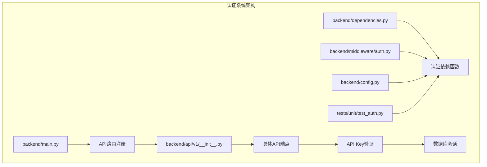
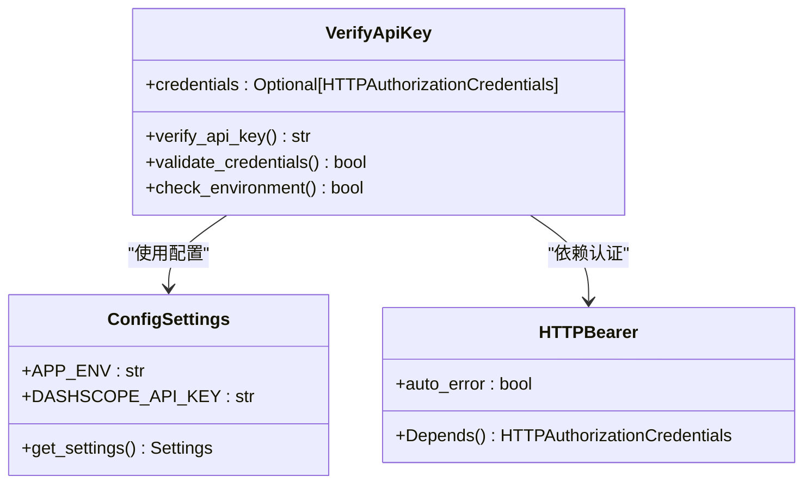
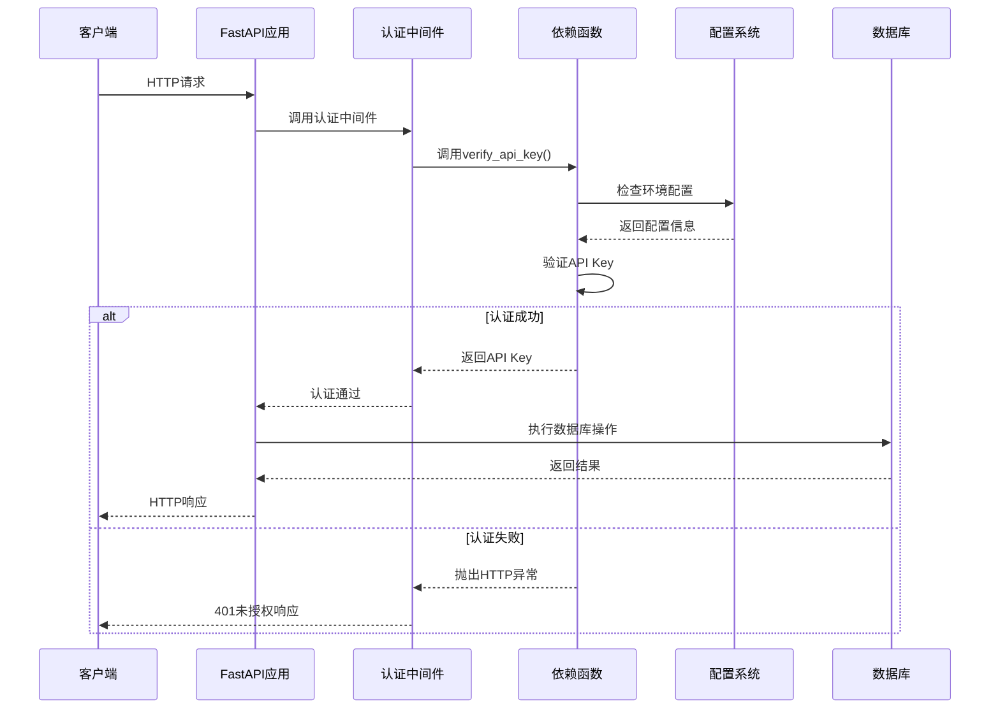
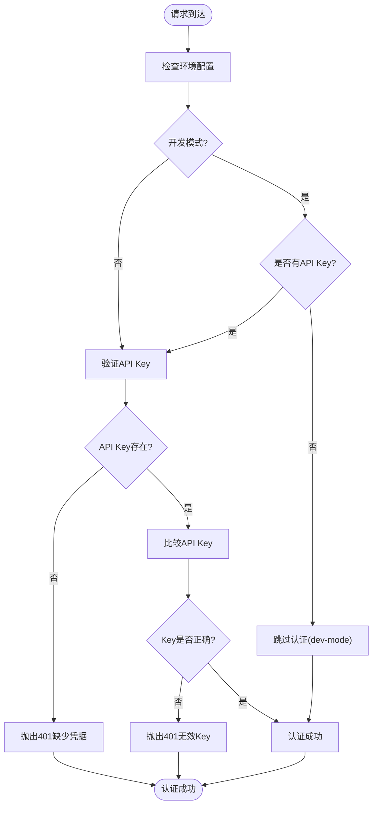
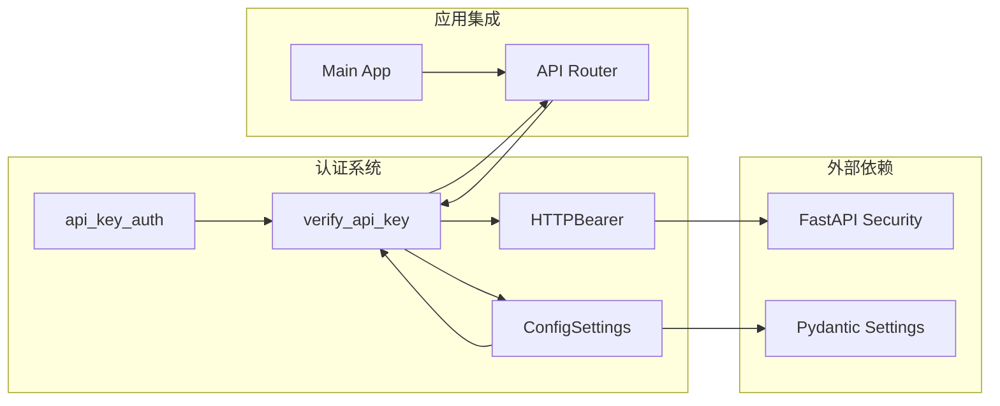

# API认证系统

<cite>
**本文档引用的文件**
- [backend/middleware/auth.py](file://backend/middleware/auth.py)
- [backend/api/v1/auth_example.py](file://backend/api/v1/auth_example.py)
- [backend/dependencies.py](file://backend/dependencies.py)
- [backend/api/v1/__init__.py](file://backend/api/v1/__init__.py)
- [backend/main.py](file://backend/main.py)
- [backend/config.py](file://backend/config.py)
- [tests/unit/test_auth.py](file://tests/unit/test_auth.py)
</cite>

## 目录
1. [简介](#简介)
2. [项目结构](#项目结构)
3. [核心组件](#核心组件)
4. [架构概览](#架构概览)
5. [详细组件分析](#详细组件分析)
6. [依赖关系分析](#依赖关系分析)
7. [性能考虑](#性能考虑)
8. [故障排除指南](#故障排除指南)
9. [结论](#结论)

## 简介

小说生成系统的API认证系统采用基于Bearer Token的API Key认证机制，为RESTful API提供统一的安全保护。该系统实现了多层次的安全策略，包括开发模式下的调试支持、生产环境下的严格认证、以及灵活的错误处理机制。

系统的核心设计理念是在保证安全性的同时，为开发者提供便利的调试体验。通过环境变量控制认证行为，既能在开发环境中快速测试API，又能在生产环境中严格执行安全策略。

## 项目结构

API认证系统主要分布在以下关键文件中：



**图表来源**
- [backend/main.py:109-114](file://backend/main.py#L109-L114)
- [backend/api/v1/__init__.py:21-31](file://backend/api/v1/__init__.py#L21-L31)
- [backend/dependencies.py:25-62](file://backend/dependencies.py#L25-L62)

**章节来源**
- [backend/main.py:1-159](file://backend/main.py#L1-L159)
- [backend/api/v1/__init__.py:1-39](file://backend/api/v1/__init__.py#L1-L39)

## 核心组件

### 认证依赖函数

认证系统的核心是`verify_api_key`函数，它负责验证传入的API Key的有效性。该函数支持多种认证场景：

- **开发模式跳过认证**：在开发环境中，如果没有配置API Key，系统会自动跳过认证
- **生产环境严格验证**：在生产环境中，必须提供正确的API Key才能访问受保护的端点
- **错误处理**：提供清晰的错误消息和适当的HTTP状态码

### 中间件集成

认证中间件通过简单的别名机制与依赖函数集成，提供了统一的认证接口：



**图表来源**
- [backend/dependencies.py:25-62](file://backend/dependencies.py#L25-L62)
- [backend/config.py:48-417](file://backend/config.py#L48-L417)

**章节来源**
- [backend/dependencies.py:1-66](file://backend/dependencies.py#L1-L66)
- [backend/middleware/auth.py:1-14](file://backend/middleware/auth.py#L1-L14)

## 架构概览

API认证系统采用分层架构设计，确保了良好的可维护性和扩展性：



**图表来源**
- [backend/dependencies.py:25-62](file://backend/dependencies.py#L25-L62)
- [backend/config.py:48-417](file://backend/config.py#L48-L417)

## 详细组件分析

### 认证流程详解

认证系统遵循严格的验证流程，确保只有合法的请求能够访问受保护的资源：



**图表来源**
- [backend/dependencies.py:44-62](file://backend/dependencies.py#L44-L62)

### API端点认证示例

系统提供了完整的API认证使用示例，展示了如何在不同类型的端点中应用认证：

#### 公开端点
公开端点不需要认证，适用于健康检查、公开文档等场景：

```python
@router.get("/public")
async def public_endpoint():
    return {"message": "这是公开端点，无需认证"}
```

#### 受保护端点
受保护端点需要API Key认证，适用于所有敏感操作：

```python
@router.get("/protected")
async def protected_endpoint(
    api_key: str = Depends(verify_api_key),
    db: AsyncSession = Depends(get_db),
):
    return {
        "message": "认证成功！",
        "api_key_prefix": api_key[:8] + "..." if api_key != "dev-mode" else "dev-mode",
    }
```

#### 批量操作端点
批量操作端点同样需要认证，支持复杂的批量处理操作：

```python
@router.post("/bulk-operation")
async def bulk_operation(
    api_key: str = Depends(verify_api_key),
    db: AsyncSession = Depends(get_db),
):
    return {"status": "authenticated", "operation": "bulk"}
```

**章节来源**
- [backend/api/v1/auth_example.py:17-67](file://backend/api/v1/auth_example.py#L17-L67)

### 错误处理机制

认证系统实现了完善的错误处理机制，确保客户端能够清楚地了解认证失败的原因：

| 错误类型 | HTTP状态码 | 错误消息 | 触发条件 |
|---------|-----------|---------|---------|
| 缺少凭据 | 401 Unauthorized | "缺少认证凭据" | 请求头中没有Authorization字段 |
| 无效API Key | 401 Unauthorized | "无效的 API Key" | 提供的API Key与配置不匹配 |
| 开发模式 | 200 OK | "dev-mode" | 开发环境且无API Key配置 |

**章节来源**
- [backend/dependencies.py:48-62](file://backend/dependencies.py#L48-L62)

## 依赖关系分析

认证系统与其他组件的依赖关系如下：



**图表来源**
- [backend/dependencies.py:7-12](file://backend/dependencies.py#L7-L12)
- [backend/middleware/auth.py:7-10](file://backend/middleware/auth.py#L7-L10)

**章节来源**
- [backend/dependencies.py:1-66](file://backend/dependencies.py#L1-L66)
- [backend/middleware/auth.py:1-14](file://backend/middleware/auth.py#L1-L14)

## 性能考虑

### 认证性能优化

认证系统在设计时充分考虑了性能因素：

- **内存缓存**：配置系统使用LRU缓存减少重复的配置读取
- **异步处理**：所有认证操作都是异步的，不会阻塞请求处理
- **最小化依赖**：认证过程只依赖必要的组件，减少不必要的开销

### 开发模式优化

开发模式下的认证跳过机制提供了显著的性能优势：

- **零认证开销**：开发环境下跳过API Key验证，避免额外的计算开销
- **快速调试**：开发者可以专注于业务逻辑，无需处理认证问题
- **条件执行**：认证逻辑只在必要时执行，提高了整体效率

## 故障排除指南

### 常见认证问题

#### 问题1：401未授权错误
**症状**：客户端收到401状态码
**可能原因**：
- 缺少Authorization请求头
- API Key格式不正确
- API Key与配置不匹配

**解决方案**：
1. 检查请求头中是否包含Authorization字段
2. 确认API Key格式为"Bearer your_api_key"
3. 验证API Key与配置文件中的设置一致

#### 问题2：开发模式认证失败
**症状**：即使在开发模式下也收到认证错误
**可能原因**：
- 环境变量配置错误
- API Key配置与预期不符

**解决方案**：
1. 检查APP_ENV环境变量设置
2. 验证DASHSCOPE_API_KEY配置
3. 确认开发模式下的预期行为

#### 问题3：Swagger UI认证问题
**症状**：Swagger UI界面无法通过认证
**可能原因**：
- Authorize按钮配置错误
- API Key格式问题

**解决方案**：
1. 在Swagger UI中点击"Authorize"按钮
2. 输入格式为"Bear your_api_key"
3. 确认API Key正确无误

**章节来源**
- [tests/unit/test_auth.py:18-127](file://tests/unit/test_auth.py#L18-L127)

### 调试技巧

#### 启用详细日志
在开发环境中，可以通过以下方式启用详细的认证日志：

1. 设置APP_DEBUG环境变量为True
2. 检查应用启动日志中的认证相关信息
3. 使用Python调试器跟踪认证流程

#### 单元测试验证
系统提供了完整的单元测试，可以用来验证认证功能：

```bash
pytest tests/unit/test_auth.py -v
```

这些测试覆盖了各种认证场景，包括正常认证、错误处理、开发模式等。

## 结论

小说系统的API认证系统设计精良，实现了安全性与易用性的完美平衡。通过多层次的认证策略、清晰的错误处理机制、以及完善的测试覆盖，系统为API提供了可靠的保护。

### 主要优势

1. **灵活的认证策略**：支持开发和生产环境的不同需求
2. **清晰的错误处理**：提供明确的错误信息和适当的HTTP状态码
3. **完善的测试覆盖**：确保认证功能的可靠性
4. **易于集成**：简洁的API设计便于在各种端点中应用

### 最佳实践建议

1. **生产环境配置**：确保在生产环境中正确配置API Key
2. **安全存储**：将API Key存储在安全的地方，避免硬编码
3. **定期轮换**：定期更换API Key以提高安全性
4. **监控和日志**：实施适当的监控和日志记录来跟踪认证活动

该认证系统为小说生成系统的API提供了坚实的安全基础，既满足了生产环境的安全要求，又为开发和测试提供了便利的工具。