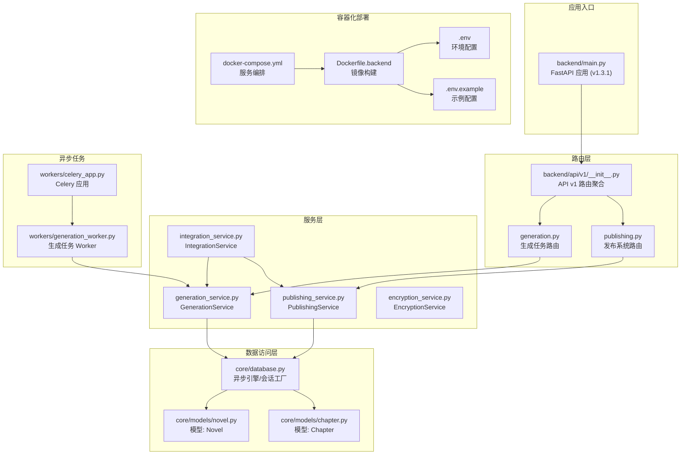
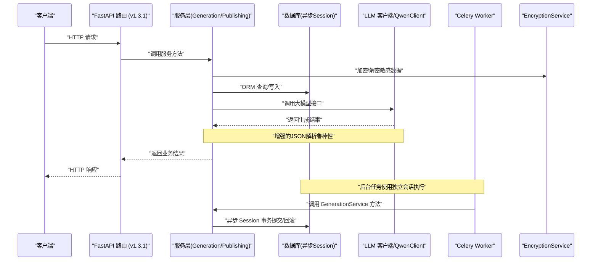
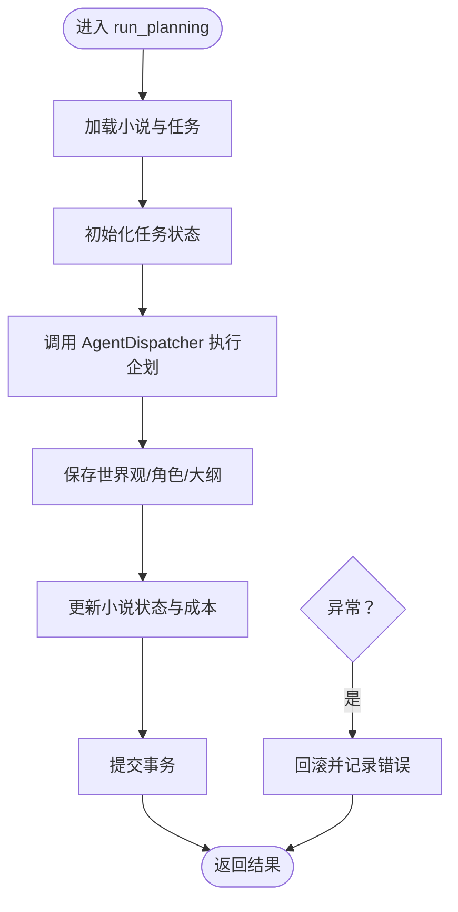
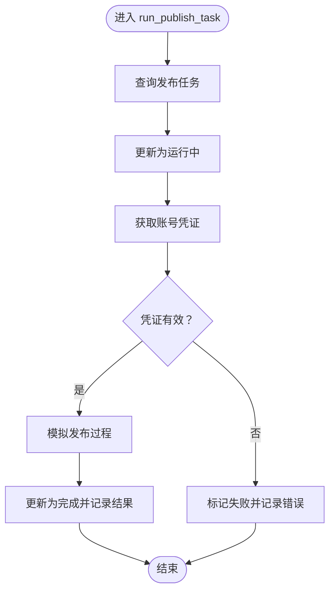
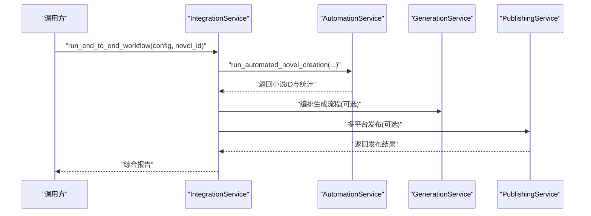
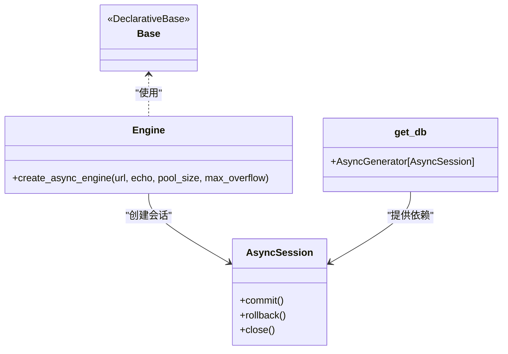
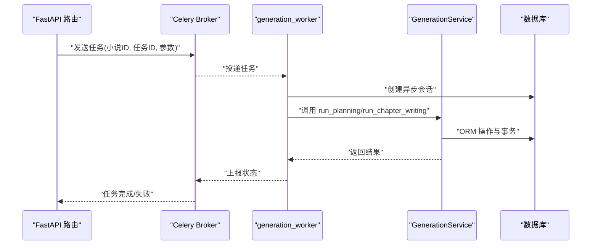
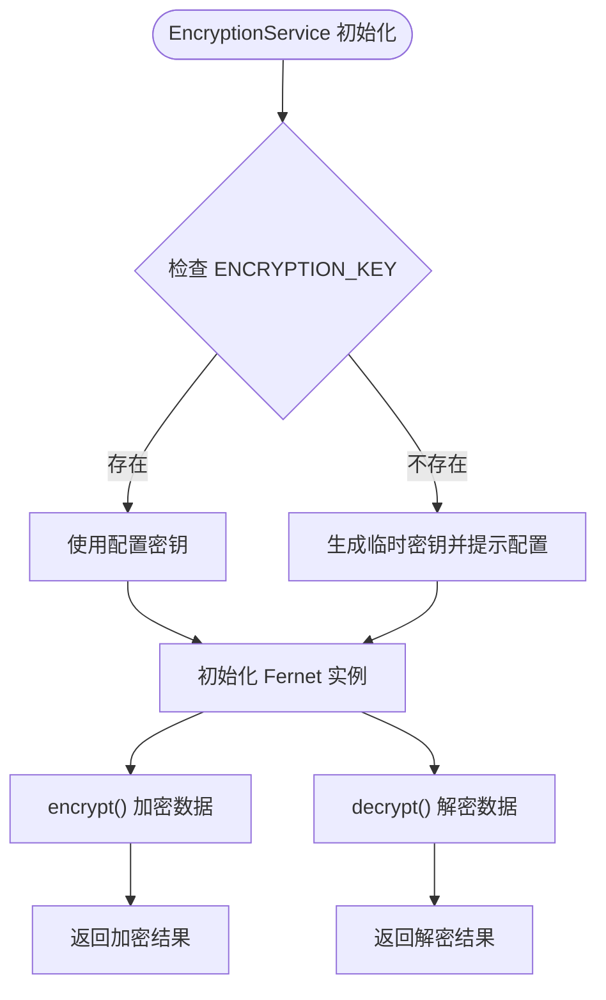
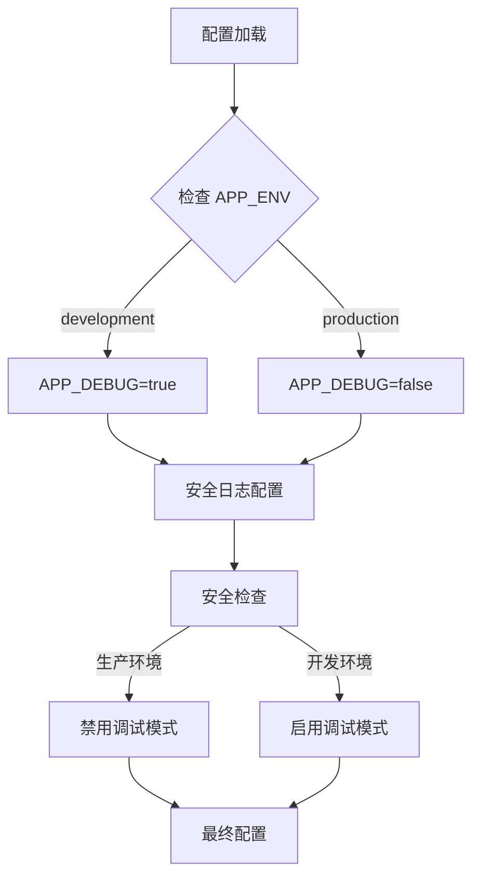
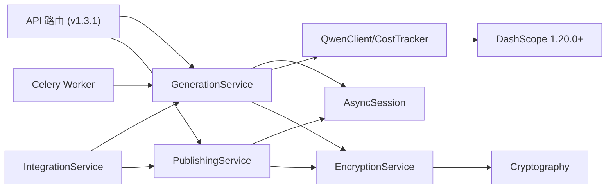

# 后端架构

<cite>
**本文档引用的文件**
- [backend/main.py](file://backend/main.py)
- [backend/config.py](file://backend/config.py)
- [backend/dependencies.py](file://backend/dependencies.py)
- [backend/api/v1/__init__.py](file://backend/api/v1/__init__.py)
- [backend/api/v1/generation.py](file://backend/api/v1/generation.py)
- [backend/api/v1/publishing.py](file://backend/api/v1/publishing.py)
- [core/database.py](file://core/database.py)
- [core/models/novel.py](file://core/models/novel.py)
- [core/models/chapter.py](file://core/models/chapter.py)
- [workers/celery_app.py](file://workers/celery_app.py)
- [workers/generation_worker.py](file://workers/generation_worker.py)
- [backend/services/generation_service.py](file://backend/services/generation_service.py)
- [backend/services/publishing_service.py](file://backend/services/publishing_service.py)
- [backend/services/integration_service.py](file://backend/services/integration_service.py)
- [backend/services/encryption_service.py](file://backend/services/encryption_service.py)
- [core/logging_config.py](file://core/logging_config.py)
- [pyproject.toml](file://pyproject.toml)
- [.env](file://.env)
- [.env.example](file://.env.example)
- [docker-compose.yml](file://docker-compose.yml)
- [Dockerfile.backend](file://Dockerfile.backend)
- [CHANGELOG.md](file://CHANGELOG.md)
</cite>

## 更新摘要
**所做更改**
- 更新应用版本信息：从 1.2.0 升级到 1.3.1
- 新增JSON解析鲁棒性增强和代码质量提升
- 修复Critical Bug和数据库迁移问题
- 新增审查循环框架和多策略JSON提取能力
- 完善AgentMesh集成和TeamContext上下文管理

## 目录
1. [引言](#引言)
2. [项目结构](#项目结构)
3. [核心组件](#核心组件)
4. [架构总览](#架构总览)
5. [详细组件分析](#详细组件分析)
6. [版本与安全增强](#版本与安全增强)
7. [依赖分析](#依赖分析)
8. [性能考虑](#性能考虑)
9. [故障排查指南](#故障排查指南)
10. [结论](#结论)

## 引言
本文件面向架构师与高级开发者，系统性梳理小说生成系统的后端架构。重点覆盖 FastAPI 应用的分层设计（路由层、服务层、数据访问层）、中间件与异常处理、请求响应生命周期；数据库层采用 SQLAlchemy 异步 ORM 与连接池、事务管理策略；Celery 异步任务系统（任务队列、序列化、超时与重试）；以及核心服务类（GenerationService、PublishingService、IntegrationService）的业务逻辑与 API 接口。同时提供性能优化、缓存与并发处理建议。

**更新** 应用已升级至 1.3.1 版本，包含JSON解析鲁棒性增强、审查循环框架、AgentMesh集成等重要功能改进。

## 项目结构
后端采用"路由层-服务层-数据访问层"的清晰分层，并通过依赖注入与共享依赖提供数据库会话。API v1 路由聚合器统一挂载各子模块路由。数据库层使用 SQLAlchemy 异步引擎与会话工厂，配合 Alembic 进行迁移管理。Celery 作为异步任务执行器，Worker 以同步任务包装异步服务方法。**新增** 完整的 Docker 容器化部署架构，支持生产环境稳定运行。

**图表来源**
- [backend/main.py:62-90](file://backend/main.py#L62-L90)
- [backend/api/v1/__init__.py:11-26](file://backend/api/v1/__init__.py#L11-L26)
- [backend/api/v1/generation.py:20-20](file://backend/api/v1/generation.py#L20-L20)
- [backend/api/v1/publishing.py:31-31](file://backend/api/v1/publishing.py#L31-L31)
- [backend/services/generation_service.py:27-35](file://backend/services/generation_service.py#L27-L35)
- [backend/services/publishing_service.py:21-27](file://backend/services/publishing_service.py#L21-L27)
- [backend/services/integration_service.py:17-25](file://backend/services/integration_service.py#L17-L25)
- [backend/services/encryption_service.py:10-26](file://backend/services/encryption_service.py#L10-L26)
- [core/database.py:11-22](file://core/database.py#L11-L22)
- [core/models/novel.py:37-66](file://core/models/novel.py#L37-L66)
- [core/models/chapter.py:18-45](file://core/models/chapter.py#L18-L45)
- [workers/celery_app.py:6-25](file://workers/celery_app.py#L6-L25)
- [workers/generation_worker.py:58-70](file://workers/generation_worker.py#L58-L70)
- [docker-compose.yml:32-66](file://docker-compose.yml#L32-L66)
- [Dockerfile.backend:1-29](file://Dockerfile.backend#L1-L29)

**章节来源**
- [backend/main.py:62-90](file://backend/main.py#L62-L90)
- [backend/api/v1/__init__.py:11-26](file://backend/api/v1/__init__.py#L11-L26)
- [docker-compose.yml:32-66](file://docker-compose.yml#L32-L66)
- [Dockerfile.backend:1-29](file://Dockerfile.backend#L1-L29)

## 核心组件
- **FastAPI 应用与中间件**
  - CORS 中间件限制前端开发服务器访问，确保本地联调安全。
  - 根路径与健康检查端点提供基础服务状态。
  - **更新** 应用版本从 1.2.0 升级到 1.3.1，提供更稳定的API版本管理。
- **配置中心**
  - 统一读取环境变量，动态拼接数据库、Redis、Celery 连接串，支持同步/异步数据库 URL。
  - **新增** 生产环境默认禁用调试模式，增强安全性。
- **数据库与依赖注入**
  - 异步 SQLAlchemy 引擎与会话工厂，自动 commit/rollback/关闭，提供 get_db 依赖供路由使用。
- **API 路由**
  - generation 与 publishing 子路由，提供任务创建、查询、取消等接口。
- **服务层**
  - GenerationService：编排规划/写作/批量写作，持久化结果与成本统计。
  - PublishingService：平台账号管理、发布任务执行、发布预览。
  - IntegrationService：端到端工作流编排（自动化创建、市场分析、多平台发布）。
  - **新增** EncryptionService：敏感信息加密解密，保护平台账号凭证安全。
- **异步任务**
  - Celery 应用配置 JSON 序列化、时区、任务跟踪、超时与并发控制。
  - generation_worker 包装异步服务方法，适配 Celery 同步任务。
- **容器化部署**
  - Docker Compose 编排 PostgreSQL、Redis、Backend、Frontend 服务。
  - 完整的环境变量配置和健康检查机制。

**章节来源**
- [backend/main.py:62-90](file://backend/main.py#L62-L90)
- [backend/config.py:35-50](file://backend/config.py#L35-L50)
- [core/database.py:11-35](file://core/database.py#L11-L35)
- [backend/dependencies.py:12-19](file://backend/dependencies.py#L12-L19)
- [backend/api/v1/generation.py:23-104](file://backend/api/v1/generation.py#L23-L104)
- [backend/api/v1/publishing.py:157-231](file://backend/api/v1/publishing.py#L157-L231)
- [backend/services/generation_service.py:27-35](file://backend/services/generation_service.py#L27-L35)
- [backend/services/publishing_service.py:21-27](file://backend/services/publishing_service.py#L21-L27)
- [backend/services/integration_service.py:17-25](file://backend/services/integration_service.py#L17-L25)
- [backend/services/encryption_service.py:10-26](file://backend/services/encryption_service.py#L10-L26)
- [workers/celery_app.py:12-25](file://workers/celery_app.py#L12-L25)
- [workers/generation_worker.py:58-70](file://workers/generation_worker.py#L58-L70)
- [docker-compose.yml:32-66](file://docker-compose.yml#L32-L66)

## 架构总览
下图展示请求从 FastAPI 路由进入，经服务层编排，访问数据库与外部 LLM 客户端，异步任务通过 Celery Worker 执行 GenerationService 的核心流程。**更新** 新增容器化部署架构和安全增强机制，以及JSON解析鲁棒性改进。

**图表来源**
- [backend/api/v1/generation.py:73-101](file://backend/api/v1/generation.py#L73-L101)
- [backend/api/v1/publishing.py:223-229](file://backend/api/v1/publishing.py#L223-L229)
- [backend/services/generation_service.py:36-196](file://backend/services/generation_service.py#L36-L196)
- [backend/services/publishing_service.py:144-209](file://backend/services/publishing_service.py#L144-L209)
- [backend/services/encryption_service.py:27-49](file://backend/services/encryption_service.py#L27-L49)
- [core/database.py:25-35](file://core/database.py#L25-L35)
- [workers/generation_worker.py:26-34](file://workers/generation_worker.py#L26-L34)

## 详细组件分析

### 路由层与请求生命周期
- **路由聚合**
  - API v1 路由统一挂载 generation 与 publishing 子路由，便于扩展其他模块。
- **请求处理**
  - generation 路由支持创建/查询/取消生成任务；publishing 路由支持账号与发布任务管理。
  - 依赖注入 get_db 提供异步 Session，确保每个请求拥有独立事务上下文。
- **生命周期要点**
  - 路由层仅负责参数校验、构造请求上下文与调用服务层。
  - 服务层负责业务编排、持久化与错误处理。
  - 数据访问层封装 ORM 与连接池，避免路由层直接操作数据库。

**章节来源**
- [backend/api/v1/__init__.py:11-26](file://backend/api/v1/__init__.py#L11-L26)
- [backend/api/v1/generation.py:23-104](file://backend/api/v1/generation.py#L23-L104)
- [backend/api/v1/publishing.py:157-231](file://backend/api/v1/publishing.py#L157-L231)
- [backend/dependencies.py:12-19](file://backend/dependencies.py#L12-L19)

### 服务层：GenerationService
- **职责边界**
  - 编排 AgentDispatcher，调用 LLM 客户端，保存企划（世界观、角色、大纲）、章节写作结果，统计 token 使用与成本。
- **关键流程**
  - 企划阶段：加载小说 → 更新任务状态 → 初始化调度器 → 调用 LLM → 保存世界观/角色/大纲 → 更新小说状态与成本 → 提交事务。
  - 单章写作：加载小说及关联对象 → 构造 novel_data → 初始化调度器 → 调用 LLM → 保存章节 → 更新统计 → 提交事务。
  - 批量写作：循环执行单章写作，汇总结果与失败数，更新任务输出数据与状态。
- **错误处理**
  - 捕获异常并回滚事务，更新任务状态与错误信息，保证数据一致性。

**图表来源**
- [backend/services/generation_service.py:36-196](file://backend/services/generation_service.py#L36-L196)

**章节来源**
- [backend/services/generation_service.py:27-35](file://backend/services/generation_service.py#L27-L35)
- [backend/services/generation_service.py:36-196](file://backend/services/generation_service.py#L36-L196)
- [backend/services/generation_service.py:206-378](file://backend/services/generation_service.py#L206-L378)
- [backend/services/generation_service.py:387-564](file://backend/services/generation_service.py#L387-L564)

### 服务层：PublishingService
- **职责边界**
  - 平台账号管理（创建/更新/验证/解密凭证）。
  - 发布任务执行（创建书籍/发布章节/批量发布），模拟平台交互并记录结果。
  - 发布预览：统计未发布章节与发布状态。
- **关键流程**
  - 账号管理：加密/解密凭证，更新状态与最后登录时间。
  - 发布任务：根据类型设置结果字段，更新任务状态与完成时间。
  - 预览：查询章节与已发布记录，构建预览列表。

**图表来源**
- [backend/services/publishing_service.py:144-209](file://backend/services/publishing_service.py#L144-L209)

**章节来源**
- [backend/services/publishing_service.py:21-139](file://backend/services/publishing_service.py#L21-L139)
- [backend/services/publishing_service.py:144-209](file://backend/services/publishing_service.py#L144-L209)
- [backend/services/publishing_service.py:212-275](file://backend/services/publishing_service.py#L212-L275)

### 服务层：IntegrationService
- **职责边界**
  - 协调自动化服务、生成服务与发布服务，实现端到端工作流。
- **关键流程**
  - 自动化创建小说 → 生成市场分析报告 → 可选多平台发布 → 生成综合报告。
  - 多平台发布：按平台查找活跃账号，复用已有书籍 ID 或创建新书，再发布最新章节。

**图表来源**
- [backend/services/integration_service.py:26-111](file://backend/services/integration_service.py#L26-L111)
- [backend/services/integration_service.py:112-292](file://backend/services/integration_service.py#L112-L292)

**章节来源**
- [backend/services/integration_service.py:17-25](file://backend/services/integration_service.py#L17-L25)
- [backend/services/integration_service.py:26-111](file://backend/services/integration_service.py#L26-L111)
- [backend/services/integration_service.py:112-292](file://backend/services/integration_service.py#L112-L292)

### 数据访问层：SQLAlchemy 异步 ORM 与事务
- **设计模式**
  - 异步引擎与会话工厂：基于 asyncpg，连接池大小与溢出配置合理，满足高并发场景。
  - 依赖注入：get_db 提供异步上下文，确保每次请求一个会话，自动 commit/rollback/关闭。
  - 模型定义：Novel/Chapter 等核心实体，定义枚举状态与外键关系，支持级联删除与排序。
- **事务管理策略**
  - 路由层创建任务后，使用 BackgroundTasks 或 asyncio.create_task 异步执行服务方法，服务内捕获异常并回滚。
  - 生成与发布服务在事务内完成持久化，保证原子性。

**图表来源**
- [core/database.py:7-35](file://core/database.py#L7-L35)
- [core/models/novel.py:37-66](file://core/models/novel.py#L37-L66)
- [core/models/chapter.py:18-45](file://core/models/chapter.py#L18-L45)

**章节来源**
- [core/database.py:11-35](file://core/database.py#L11-L35)
- [backend/dependencies.py:12-19](file://backend/dependencies.py#L12-L19)
- [core/models/novel.py:37-66](file://core/models/novel.py#L37-L66)
- [core/models/chapter.py:18-45](file://core/models/chapter.py#L18-L45)

### Celery 异步任务系统
- **配置要点**
  - JSON 序列化、UTC 时区、任务跟踪、硬/软超时、prefetch 控制与并发数。
- **任务设计**
  - generation_worker 提供 run_planning_task 与 run_writing_task，内部通过 async_session_factory 获取会话，调用 GenerationService 的异步方法。
  - 任务失败时记录日志并返回失败状态，便于前端轮询与监控。

**图表来源**
- [workers/celery_app.py:12-25](file://workers/celery_app.py#L12-L25)
- [workers/generation_worker.py:58-70](file://workers/generation_worker.py#L58-L70)
- [backend/services/generation_service.py:36-196](file://backend/services/generation_service.py#L36-L196)

**章节来源**
- [workers/celery_app.py:6-25](file://workers/celery_app.py#L6-L25)
- [workers/generation_worker.py:12-70](file://workers/generation_worker.py#L12-L70)

### 安全增强：EncryptionService
- **职责边界**
  - 提供敏感信息的加密解密功能，保护平台账号凭证等敏感数据。
- **关键特性**
  - 基于 Fernet 对称加密算法，确保数据传输和存储安全。
  - 自动密钥管理：未配置时生成临时密钥并提示配置。
  - 类型安全：明确的字符串编码/解码处理。
- **应用场景**
  - 平台账号凭证加密存储
  - 敏感配置信息保护
  - 数据库连接信息安全

**图表来源**
- [backend/services/encryption_service.py:13-25](file://backend/services/encryption_service.py#L13-L25)

**章节来源**
- [backend/services/encryption_service.py:10-26](file://backend/services/encryption_service.py#L10-L26)
- [backend/services/encryption_service.py:27-49](file://backend/services/encryption_service.py#L27-L49)

## 版本与安全增强

### 应用版本升级
- **版本标识**
  - 项目版本从 1.2.0 升级到 1.3.1，标志着系统进入更稳定的版本。
  - FastAPI 应用版本设置为 1.3.1，提供完整的 API 文档和健康检查。
  - **新增** pyproject.toml 中明确标注版本号，支持语义化版本控制。
  - **新增** CHANGELOG.md 记录详细的版本变更历史和功能更新。
- **版本管理**
  - 1.3.1版本包含JSON解析鲁棒性增强、代码质量提升等重要改进。
  - 1.2.0版本引入审查循环框架、多策略JSON提取等新功能。

**章节来源**
- [pyproject.toml](file://pyproject.toml#L3)
- [backend/main.py](file://backend/main.py#L64)
- [backend/main.py](file://backend/main.py#L113)
- [CHANGELOG.md](file://CHANGELOG.md#L3)
- [CHANGELOG.md](file://CHANGELOG.md#L13)

### 生产环境安全增强
- **调试模式禁用**
  - 生产环境默认禁用调试模式（APP_DEBUG=false），减少敏感信息泄露风险。
  - 开发环境默认启用调试模式（APP_DEBUG=true），便于开发调试。
- **环境变量安全**
  - 规范化的环境变量命名，避免客户端代码冲突。
  - 敏感信息通过 EncryptionService 进行加密处理。
- **容器化安全**
  - Docker Compose 配置了健康检查，确保服务可用性。
  - 环境变量通过 Docker 环境注入，避免硬编码在代码中。

**图表来源**
- [backend/config.py:65-68](file://backend/config.py#L65-L68)
- [.env](file://.env#L19)
- [.env.example](file://.env.example#L18)
- [docker-compose.yml](file://docker-compose.yml#L47)

**章节来源**
- [backend/config.py:65-68](file://backend/config.py#L65-L68)
- [.env](file://.env#L19)
- [.env.example](file://.env.example#L18)
- [docker-compose.yml](file://docker-compose.yml#L47)
- [CHANGELOG.md](file://CHANGELOG.md#L77)

### 容器化部署架构
- **服务编排**
  - PostgreSQL 数据库服务，支持健康检查和数据持久化。
  - Redis 缓存服务，提供任务队列和结果存储。
  - Backend 服务，运行 FastAPI 应用，支持热重载开发。
  - Frontend 服务，提供用户界面访问。
- **环境配置**
  - 统一的环境变量管理，支持开发和生产环境切换。
  - 健康检查机制确保服务启动顺序和可用性。
- **部署优势**
  - 完整的容器化解决方案，简化部署和运维。
  - 支持水平扩展和负载均衡。
  - 环境隔离，避免依赖冲突。

**章节来源**
- [docker-compose.yml:1-86](file://docker-compose.yml#L1-L86)
- [Dockerfile.backend:1-29](file://Dockerfile.backend#L1-L29)
- [docker-compose.yml:32-66](file://docker-compose.yml#L32-L66)

### JSON解析鲁棒性增强
- **新增功能**
  - 改进 _extract_json_from_response、_find_json_by_brackets 和 _extract_fields_manually 方法的错误处理。
  - 增强异常处理和输入验证机制，提高系统稳定性。
- **技术改进**
  - 多策略JSON提取：支持多种提取策略，适应不同的LLM响应格式。
  - Critical Bug修复：修复了 LLM 响应解析中的异常传播问题。
  - 数据库迁移修复：解决 Alembic 多头部修订版本问题。

**章节来源**
- [CHANGELOG.md](file://CHANGELOG.md#L5)
- [CHANGELOG.md](file://CHANGELOG.md#L9)
- [CHANGELOG.md](file://CHANGELOG.md#L11)

### 审查循环框架与AgentMesh集成
- **新增功能**
  - 引入基于模板方法模式的审查循环基础框架。
  - 新增 agents/base目录，包含质量报告和审查结果数据结构。
  - 实现 Agent 间信息共享与持久化记忆系统。
  - 新增 NovelTeamContext 类，支持跨章节状态跟踪。
- **技术架构**
  - 智能体架构优化：重构审查循环处理器，支持多种具体审查处理器扩展。
  - 团队上下文管理：增强 NovelCrewManager 中的团队上下文处理能力。
  - 持久化记忆存储：集成 SQLite + FTS5 存储系统，支持章节摘要、角色状态、伏笔追踪。

**章节来源**
- [CHANGELOG.md](file://CHANGELOG.md#L15)
- [CHANGELOG.md](file://CHANGELOG.md#L22)
- [CHANGELOG.md](file://CHANGELOG.md#L28)

## 依赖分析
- **组件耦合与内聚**
  - 路由层对服务层低耦合，仅依赖服务接口；服务层对数据库层低耦合，通过 AsyncSession 抽象。
  - GenerationService 与 PublishingService 分别依赖不同领域模型，保持内聚。
  - **新增** EncryptionService 为所有敏感数据处理提供统一的安全接口。
- **外部依赖**
  - LLM 客户端（QwenClient）与成本追踪（CostTracker）在 GenerationService 中使用，隔离于路由层。
  - Celery 与 Redis 作为消息中间件与结果存储，与业务逻辑解耦。
  - **新增** Cryptography 库提供企业级加密功能。
  - **新增** DashScope 1.20.0+ 提供更稳定的LLM服务。
- **循环依赖**
  - 当前结构未见循环导入；若后续扩展，需避免服务层相互依赖。

**图表来源**
- [backend/api/v1/generation.py:73-101](file://backend/api/v1/generation.py#L73-L101)
- [backend/api/v1/publishing.py:223-229](file://backend/api/v1/publishing.py#L223-L229)
- [backend/services/generation_service.py:30-34](file://backend/services/generation_service.py#L30-L34)
- [backend/services/encryption_service.py](file://backend/services/encryption_service.py#L5)
- [workers/generation_worker.py:26-34](file://workers/generation_worker.py#L26-L34)
- [pyproject.toml](file://pyproject.toml#L20)

**章节来源**
- [backend/api/v1/generation.py:73-101](file://backend/api/v1/generation.py#L73-L101)
- [backend/api/v1/publishing.py:223-229](file://backend/api/v1/publishing.py#L223-L229)
- [backend/services/generation_service.py:30-34](file://backend/services/generation_service.py#L30-L34)
- [backend/services/encryption_service.py](file://backend/services/encryption_service.py#L5)
- [workers/generation_worker.py:26-34](file://workers/generation_worker.py#L26-L34)
- [pyproject.toml](file://pyproject.toml#L20)

## 性能考虑
- **数据库连接池**
  - 异步引擎连接池与溢出配置需结合并发与数据库承载能力调整；建议压测后微调 pool_size 与 max_overflow。
- **事务与锁**
  - 高并发写入时注意唯一约束冲突（如章节编号），必要时引入幂等与重试。
- **异步任务**
  - Celery worker_prefetch_multiplier=1 降低长任务被预取风险；worker_concurrency=2 适合 CPU/IO 密集混合场景，可按任务特性调整。
  - 任务超时与软超时避免僵尸任务；JSON 序列化减少反序列化开销。
- **缓存与预热**
  - 对高频查询（如小说/章节列表）可引入 Redis 缓存；对 LLM Prompt 可做模板缓存与增量更新。
- **并发处理**
  - FastAPI 默认 uvicorn 多进程/多线程，结合异步 ORM 与 Celery worker 共同提升吞吐。
- **容器化优化**
  - **新增** Docker 容器资源限制和健康检查，确保生产环境稳定性。
  - **新增** 环境变量缓存和配置热更新，减少启动时间和配置错误。
- **JSON解析优化**
  - **新增** 多策略JSON提取机制，提高解析效率和成功率。
  - **新增** 增强的异常处理，减少解析失败对系统的影响。

## 故障排查指南
- **健康检查**
  - 访问根路径与 /health 确认服务运行状态与基本连通性。
  - **更新** 检查应用版本信息，确认 1.3.1 版本正常运行。
- **数据库问题**
  - 检查 DATABASE_URL 与连接池配置；确认 get_db 依赖正确注入；查看事务提交/回滚日志。
- **LLM 与成本**
  - GenerationService 记录 token 使用与成本，异常时检查 CostTracker 与 QwenClient 配置。
- **Celery 任务**
  - 查看任务日志与结果后端；核对 broker/backend URL；确认任务序列化格式一致。
- **发布流程**
  - PublishingService 验证账号状态与凭证解密；发布预览用于快速定位未发布章节。
- **安全配置**
  - **新增** 检查 APP_DEBUG 设置，生产环境应为 false。
  - **新增** 验证 ENCRYPTION_KEY 配置，确保敏感数据加密正常。
  - **新增** 确认 Docker 环境变量注入正确，避免配置泄露。
- **容器化部署**
  - **新增** 检查 Docker 服务健康状态，确认各容器正常运行。
  - **新增** 验证端口映射和网络连接，确保服务可达性。
- **JSON解析问题**
  - **新增** 检查 LLM 响应格式，确认多策略JSON提取机制正常工作。
  - **新增** 查看异常处理日志，确认 Critical Bug 修复生效。

**章节来源**
- [backend/main.py:108-116](file://backend/main.py#L108-L116)
- [backend/main.py:119-148](file://backend/main.py#L119-L148)
- [backend/services/generation_service.py:198-204](file://backend/services/generation_service.py#L198-L204)
- [backend/services/publishing_service.py:114-138](file://backend/services/publishing_service.py#L114-L138)
- [workers/generation_worker.py:31-33](file://workers/generation_worker.py#L31-L33)
- [backend/services/encryption_service.py:15-25](file://backend/services/encryption_service.py#L15-L25)
- [docker-compose.yml:13-30](file://docker-compose.yml#L13-L30)
- [CHANGELOG.md](file://CHANGELOG.md#L9)

## 结论
该后端架构以 FastAPI 为核心，通过清晰的分层与依赖注入实现高内聚低耦合；SQLAlchemy 异步 ORM 提供稳健的数据访问；Celery 异步任务体系支撑长耗时流程。服务层围绕 GenerationService、PublishingService 与 IntegrationService 构建完整的小说创作与发布闭环。**更新** 版本升级至 1.3.1，包含JSON解析鲁棒性增强、审查循环框架、AgentMesh集成等重要功能改进，新增完整的容器化部署支持和生产环境安全增强，包括调试模式禁用、敏感数据加密、环境变量安全配置等。建议持续完善缓存与监控、压测与容量规划，以支撑更大规模的并发与更复杂的业务场景。新的架构为生产环境提供了更高的安全性、稳定性和可维护性。