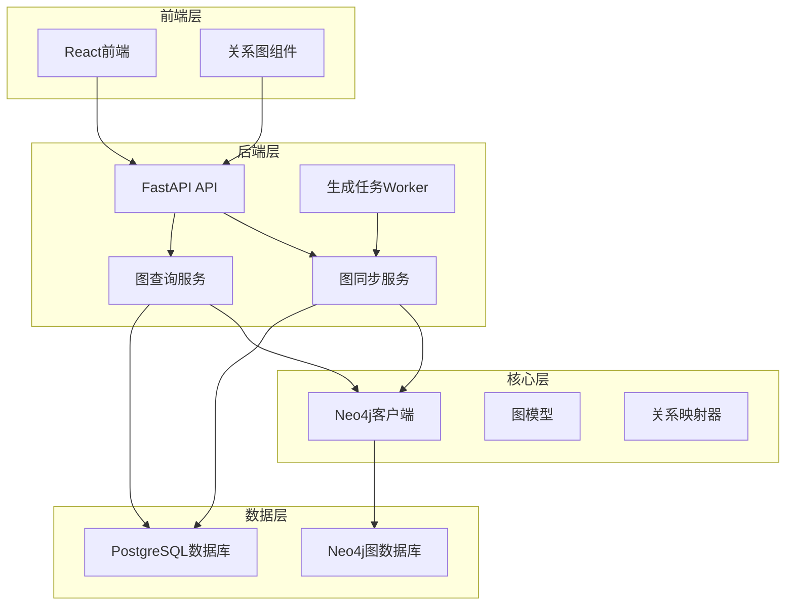
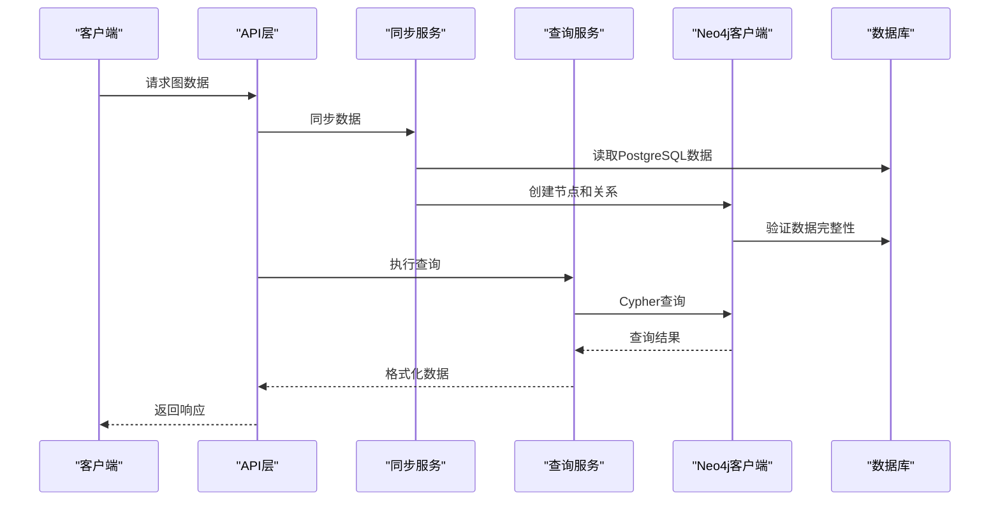
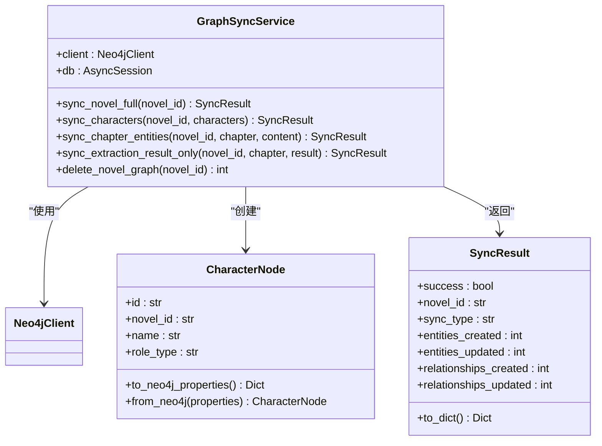
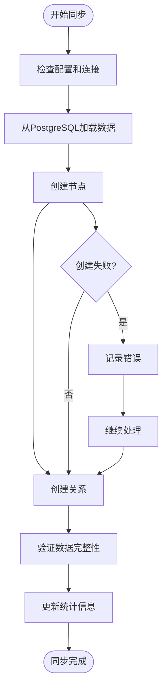
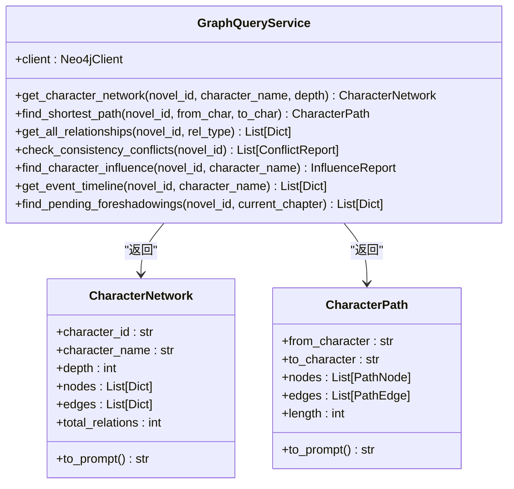
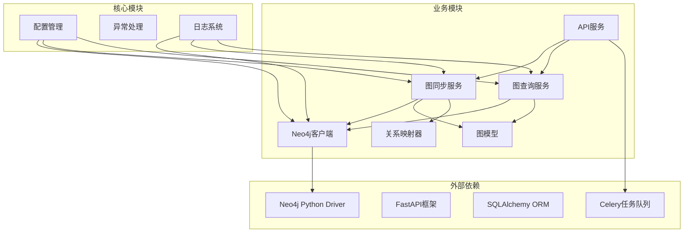
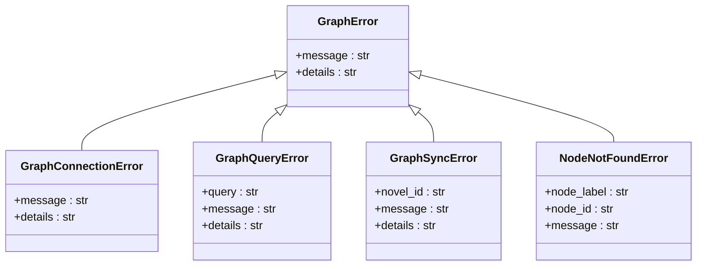

# 图数据库系统

<cite>
**本文档引用的文件**
- [neo4j_client.py](file://core/graph/neo4j_client.py)
- [graph_models.py](file://core/graph/graph_models.py)
- [relationship_mapper.py](file://core/graph/relationship_mapper.py)
- [graph_query_service.py](file://backend/services/graph_query_service.py)
- [graph_sync_service.py](file://backend/services/graph_sync_service.py)
- [graph_exceptions.py](file://core/graph/graph_exceptions.py)
- [graph.py](file://backend/api/v1/graph.py)
- [config.py](file://backend/config.py)
- [character.py](file://core/models/character.py)
- [RelationshipGraph.tsx](file://frontend/src/pages/NovelDetail/RelationshipGraph.tsx)
- [generation_worker.py](file://workers/generation_worker.py)
</cite>

## 目录
1. [简介](#简介)
2. [项目结构](#项目结构)
3. [核心组件](#核心组件)
4. [架构概览](#架构概览)
5. [详细组件分析](#详细组件分析)
6. [依赖关系分析](#依赖关系分析)
7. [性能考虑](#性能考虑)
8. [故障排除指南](#故障排除指南)
9. [结论](#结论)

## 简介

图数据库系统是一个基于Neo4j的图数据存储和查询解决方案，专门为小说创作系统设计。该系统提供了完整的图数据库功能，包括实体关系存储、智能查询、数据同步和可视化展示。

系统的核心特性包括：
- **实体关系建模**：支持角色、地点、事件、势力等多类型实体
- **智能查询分析**：提供角色网络分析、路径查找、影响力计算等功能
- **自动化同步**：从PostgreSQL数据库自动同步数据到图数据库
- **实时可视化**：提供直观的图关系可视化界面
- **一致性检测**：自动检测和报告数据冲突问题

## 项目结构

图数据库系统采用模块化架构，主要分为以下几个层次：

**图表来源**
- [graph.py:1-765](file://backend/api/v1/graph.py#L1-L765)
- [neo4j_client.py:1-550](file://core/graph/neo4j_client.py#L1-L550)

**章节来源**
- [graph.py:1-765](file://backend/api/v1/graph.py#L1-L765)
- [neo4j_client.py:1-550](file://core/graph/neo4j_client.py#L1-L550)

## 核心组件

### Neo4j客户端
Neo4j客户端是系统的核心组件，负责与图数据库的连接管理和查询执行。

**主要功能**：
- 连接池管理
- 异步查询执行
- 事务处理
- 健康检查
- 安全的标签和关系类型验证

**关键特性**：
- 支持连接池配置
- 异步操作适配
- 完整的错误处理
- 白名单安全验证

### 图数据模型
图数据模型定义了系统中使用的实体类型和关系结构。

**实体类型**：
- **角色节点**：存储小说中的角色信息
- **地点节点**：存储地理位置信息
- **事件节点**：存储关键事件信息
- **势力节点**：存储组织和团体信息
- **伏笔节点**：存储故事伏笔信息

**关系类型**：
- 角色间关系（恋人、朋友、敌人等）
- 地点关系（位于、包含等）
- 事件关系（发生、影响等）
- 势力关系（成员、领导等）

### 关系映射器
关系映射器负责在PostgreSQL的关系字典格式和Neo4j的图关系格式之间进行转换。

**核心功能**：
- 关系类型映射
- 反向关系计算
- 对称关系判断
- 关系分类统计

**章节来源**
- [neo4j_client.py:81-550](file://core/graph/neo4j_client.py#L81-L550)
- [graph_models.py:1-463](file://core/graph/graph_models.py#L1-L463)
- [relationship_mapper.py:1-226](file://core/graph/relationship_mapper.py#L1-L226)

## 架构概览

系统采用分层架构设计，确保各组件职责清晰、耦合度低。

**图表来源**
- [graph_sync_service.py:64-746](file://backend/services/graph_sync_service.py#L64-L746)
- [graph_query_service.py:135-537](file://backend/services/graph_query_service.py#L135-L537)

**章节来源**
- [graph_sync_service.py:64-746](file://backend/services/graph_sync_service.py#L64-L746)
- [graph_query_service.py:135-537](file://backend/services/graph_query_service.py#L135-L537)

## 详细组件分析

### 图同步服务

图同步服务负责将PostgreSQL中的实体数据同步到Neo4j图数据库。

**图表来源**
- [graph_sync_service.py:64-746](file://backend/services/graph_sync_service.py#L64-L746)
- [graph_models.py:101-162](file://core/graph/graph_models.py#L101-L162)

**同步流程**：

**图表来源**
- [graph_sync_service.py:81-128](file://backend/services/graph_sync_service.py#L81-L128)

### 图查询服务

图查询服务提供各种图分析查询能力，支持复杂的图数据检索和分析。

**核心查询功能**：

**图表来源**
- [graph_query_service.py:135-537](file://backend/services/graph_query_service.py#L135-L537)

### 前端可视化组件

前端提供了直观的图关系可视化界面，使用React Flow库实现交互式图形展示。

**组件特性**：
- 基于Dagre布局算法的自动布局
- 支持节点拖拽和缩放
- 实时数据更新
- 响应式设计

**章节来源**
- [graph_sync_service.py:64-746](file://backend/services/graph_sync_service.py#L64-L746)
- [graph_query_service.py:135-537](file://backend/services/graph_query_service.py#L135-L537)
- [RelationshipGraph.tsx:1-108](file://frontend/src/pages/NovelDetail/RelationshipGraph.tsx#L1-L108)

## 依赖关系分析

系统采用松耦合的设计，各组件之间的依赖关系清晰明确。

**图表来源**
- [config.py:305-357](file://backend/config.py#L305-L357)
- [neo4j_client.py:1-550](file://core/graph/neo4j_client.py#L1-L550)
- [graph_sync_service.py:1-746](file://backend/services/graph_sync_service.py#L1-L746)
- [graph_query_service.py:1-537](file://backend/services/graph_query_service.py#L1-L537)

**章节来源**
- [config.py:305-357](file://backend/config.py#L305-L357)
- [neo4j_client.py:1-550](file://core/graph/neo4j_client.py#L1-L550)

## 性能考虑

### 连接池管理
系统实现了高效的连接池管理，支持并发查询和事务处理。

**配置参数**：
- `max_connection_pool_size`: 最大连接数（默认50）
- `connection_timeout`: 连接超时时间（默认30秒）
- `enable_graph_context_injection`: 图上下文注入开关

### 查询优化
- 使用白名单验证防止Cypher注入攻击
- 支持异步查询执行
- 提供查询缓存机制
- 优化的索引使用策略

### 数据同步优化
- 批量数据处理
- 增量同步机制
- 错误恢复和重试
- 进度跟踪和监控

## 故障排除指南

### 常见问题及解决方案

**连接问题**：
1. **Neo4j连接失败**：检查URI、用户名、密码配置
2. **认证失败**：验证Neo4j用户权限
3. **服务不可用**：确认Neo4j服务状态

**查询问题**：
1. **查询超时**：优化Cypher查询语句
2. **内存不足**：调整连接池大小
3. **数据不一致**：检查同步状态

**同步问题**：
1. **同步失败**：查看错误日志，重新执行同步
2. **数据缺失**：验证源数据完整性
3. **性能问题**：优化数据库索引

### 错误处理机制

系统提供了完善的异常处理机制：

**图表来源**
- [graph_exceptions.py:7-130](file://core/graph/graph_exceptions.py#L7-L130)

**章节来源**
- [graph_exceptions.py:1-130](file://core/graph/graph_exceptions.py#L1-L130)

## 结论

图数据库系统为小说创作提供了强大的数据管理能力和智能分析功能。通过模块化的架构设计和完善的错误处理机制，系统能够稳定可靠地支持复杂的图数据操作。

**主要优势**：
- 完整的图数据生命周期管理
- 高性能的查询和分析能力
- 灵活的数据同步机制
- 直观的可视化界面
- 企业级的安全和可靠性保障

**未来发展方向**：
- 增强机器学习集成
- 优化大规模数据处理
- 扩展更多图分析算法
- 改进实时数据同步
- 增强多用户协作功能

该系统为小说创作团队提供了强大的数据支撑，能够显著提升创作效率和作品质量。