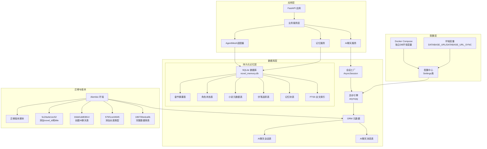
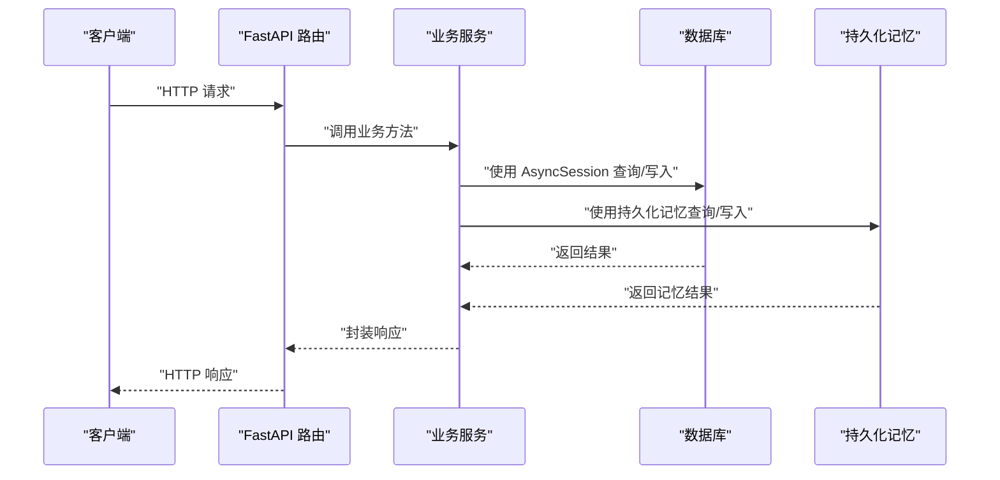
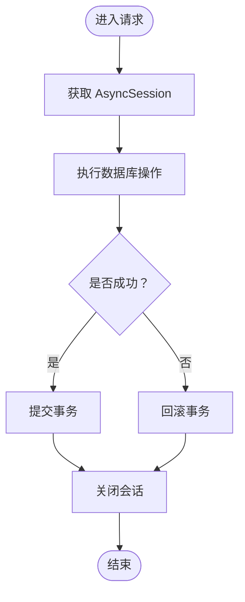
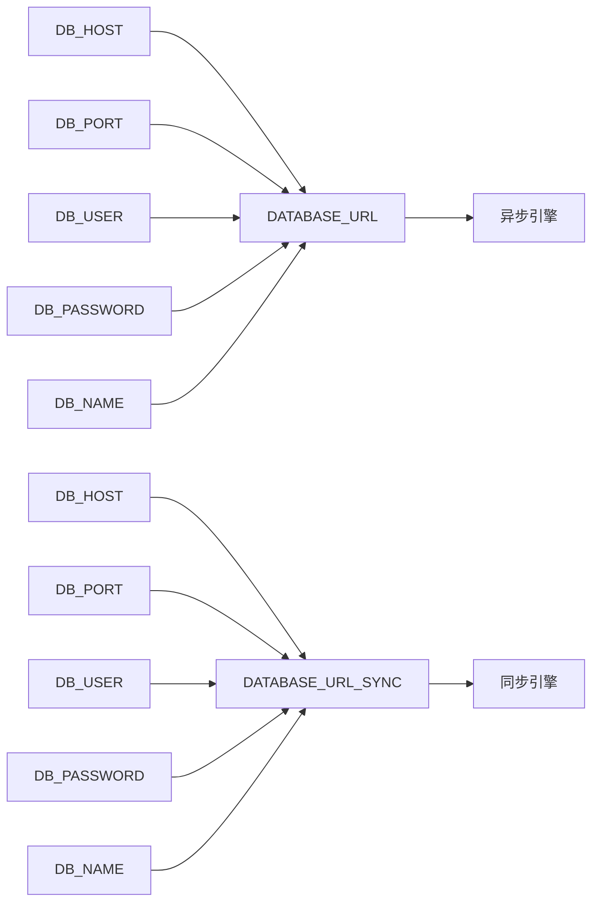
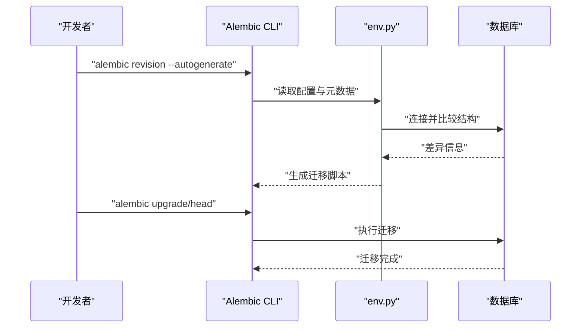
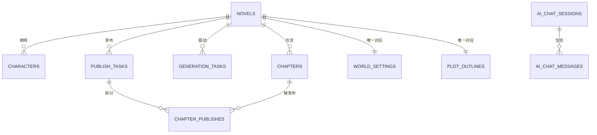
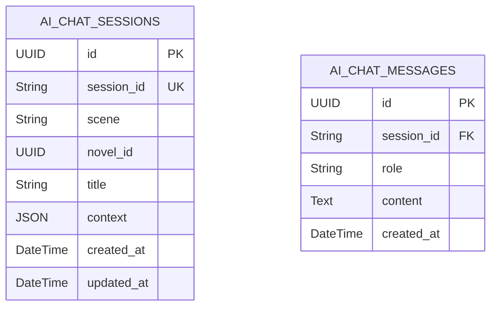
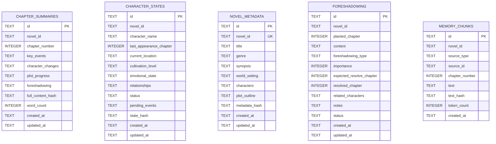
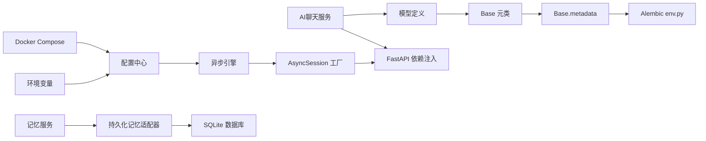

# 数据库设计

<cite>
**本文引用的文件**
- [core/database.py](file://core/database.py)
- [backend/config.py](file://backend/config.py)
- [docker-compose.yml](file://docker-compose.yml)
- [.env](file://.env)
- [.env.example](file://.env.example)
- [alembic/env.py](file://alembic/env.py)
- [alembic.ini](file://alembic.ini)
- [alembic/versions/5badc20e064a_initial_tables.py](file://alembic/versions/5badc20e064a_initial_tables.py)
- [alembic/versions/186700edca0b_fix_complete_database_tables.py](file://alembic/versions/186700edca0b_fix_complete_database_tables.py)
- [alembic/versions/fc4ecf252bbb_add_crawler_and_publishing_system.py](file://alembic/versions/fc4ecf252bbb_add_crawler_and_publishing_system.py)
- [alembic/versions/b5dd1dd83814_add_ai_chat_session_models.py](file://alembic/versions/b5dd1dd83814_add_ai_chat_session_models.py)
- [alembic/versions/5c24a4e1ec52_add_novel_id_and_title_to_chat_session.py](file://alembic/versions/5c24a4e1ec52_add_novel_id_and_title_to_chat_session.py)
- [alembic/versions/575f1ce44645_add_length_type_column_to_novels.py](file://alembic/versions/575f1ce44645_add_length_type_column_to_novels.py)
- [core/models/__init__.py](file://core/models/__init__.py)
- [core/models/novel.py](file://core/models/novel.py)
- [core/models/character.py](file://core/models/character.py)
- [core/models/chapter.py](file://core/models/chapter.py)
- [core/models/generation_task.py](file://core/models/generation_task.py)
- [core/models/publish_task.py](file://core/models/publish_task.py)
- [core/models/world_setting.py](file://core/models/world_setting.py)
- [core/models/ai_chat_session.py](file://core/models/ai_chat_session.py)
- [backend/services/ai_chat_service.py](file://backend/services/ai_chat_service.py)
- [backend/api/v1/ai_chat.py](file://backend/api/v1/ai_chat.py)
- [backend/services/memory_service.py](file://backend/services/memory_service.py)
- [backend/services/agentmesh_memory_adapter.py](file://backend/services/agentmesh_memory_adapter.py)
</cite>

## 更新摘要
**变更内容**
- 新增持久化记忆系统：引入 SQLite + FTS5 全文搜索的持久化记忆存储
- 新增记忆表结构：包括章节摘要、角色状态、小说元数据、伏笔追踪、记忆块等表
- 新增全文搜索索引：支持复杂查询和语义搜索功能
- 新增索引优化：为高性能查询建立复合索引和单列索引
- 新增迁移版本：支持持久化记忆系统的数据库演进管理

## 目录
1. [简介](#简介)
2. [项目结构](#项目结构)
3. [核心组件](#核心组件)
4. [架构总览](#架构总览)
5. [详细组件分析](#详细组件分析)
6. [依赖分析](#依赖分析)
7. [性能考量](#性能考量)
8. [故障排查指南](#故障排查指南)
9. [结论](#结论)
10. [附录](#附录)

## 简介
本文件面向数据库工程师与后端开发者，系统化梳理小说生成系统的数据库设计与实现，覆盖 SQLAlchemy 异步 ORM 配置、连接池与事务策略、实体关系建模、外键与索引设计、Alembic 迁移体系、核心数据模型关系、**新增持久化记忆系统**、性能优化与安全策略。内容以仓库现有代码为依据，避免臆造信息，并通过图示帮助不同背景读者理解。

## 项目结构
数据库相关的关键位置如下：
- ORM 引擎与会话工厂：core/database.py
- 应用配置（含数据库连接串）：backend/config.py
- Docker Compose 配置：docker-compose.yml
- 环境变量配置：.env、.env.example
- Alembic 环境与迁移入口：alembic/env.py、alembic.ini
- 模型定义与导出：core/models/*
- 迁移脚本：alembic/versions/*
- **新增持久化记忆系统**：novel_memory 数据库存储

**图表来源**
- [core/database.py](file://core/database.py#L11-L17)
- [backend/config.py](file://backend/config.py#L18-L26)
- [docker-compose.yml](file://docker-compose.yml#L37-L45)
- [.env](file://.env#L7-L8)
- [alembic/env.py](file://alembic/env.py#L12-L25)
- [alembic/versions/5c24a4e1ec52_add_novel_id_and_title_to_chat_session.py](file://alembic/versions/5c24a4e1ec52_add_novel_id_and_title_to_chat_session.py#L21-L43)
- [alembic/versions/b5dd1dd83814_add_ai_chat_session_models.py](file://alembic/versions/b5dd1dd83814_add_ai_chat_session_models.py#L21-L46)
- [backend/services/agentmesh_memory_adapter.py](file://backend/services/agentmesh_memory_adapter.py#L20-L31)
- [backend/services/memory_service.py](file://backend/services/memory_service.py#L74-L80)

**章节来源**
- [core/database.py](file://core/database.py#L1-L36)
- [backend/config.py](file://backend/config.py#L1-L59)
- [docker-compose.yml](file://docker-compose.yml#L1-L86)
- [.env](file://.env#L1-L22)
- [.env.example](file://.env.example#L1-L21)
- [alembic/env.py](file://alembic/env.py#L1-L66)
- [alembic/versions/186700edca0b_fix_complete_database_tables.py](file://alembic/versions/186700edca0b_fix_complete_database_tables.py#L1-L190)
- [backend/services/agentmesh_memory_adapter.py](file://backend/services/agentmesh_memory_adapter.py#L1-L1181)

## 核心组件
- 异步引擎与会话工厂
  - 使用异步驱动与连接池参数，提供高并发下的稳定连接管理。
  - 通过依赖注入提供生命周期可控的 AsyncSession。
  - **更新** 移除URL查询参数并添加SSL连接禁用配置。
- 配置中心
  - 提供 DATABASE_URL（异步）与 DATABASE_URL_SYNC（同步），用于运行时构建连接串。
  - **更新** 使用独立的DB_HOST、DB_PORT、DB_USER、DB_PASSWORD、DB_NAME环境变量重构配置。
- Docker Compose 配置
  - **更新** 重构数据库连接参数为独立环境变量，支持容器间通信。
- Alembic 环境
  - 导入所有模型，注册到 Base.metadata，确保迁移扫描到全部表结构。
  - 在线/离线模式分别配置连接与事务边界。
- 模型导出
  - 统一导出核心实体，便于上层模块按需引入。
- **新增持久化记忆系统**
  - 借鉴 AgentMesh 设计思想：SQLite + FTS5 全文搜索 + 分层记忆
  - 解决内存缓存30分钟过期导致的内容不连贯问题
  - 提供章节摘要、角色状态、小说元数据、伏笔追踪等持久化存储

**章节来源**
- [core/database.py](file://core/database.py#L11-L17)
- [backend/config.py](file://backend/config.py#L18-L26)
- [docker-compose.yml](file://docker-compose.yml#L37-L45)
- [alembic/env.py](file://alembic/env.py#L12-L25)
- [core/models/__init__.py](file://core/models/__init__.py#L1-L40)
- [backend/services/agentmesh_memory_adapter.py](file://backend/services/agentmesh_memory_adapter.py#L20-L31)

## 架构总览
系统采用"异步 ORM + Alembic 迁移 + 持久化记忆"的混合架构。应用通过 FastAPI 注入 AsyncSession 访问PostgreSQL数据库；Alembic 在开发与生产环境统一管理表结构演进；**新增** 持久化记忆系统通过SQLite提供全文搜索和复杂查询能力。**更新** 配置层重构为独立环境变量，支持更灵活的部署场景。

**图表来源**
- [core/database.py](file://core/database.py#L26-L36)
- [backend/config.py](file://backend/config.py#L18-L26)
- [backend/services/agentmesh_memory_adapter.py](file://backend/services/agentmesh_memory_adapter.py#L922-L936)

## 详细组件分析

### SQLAlchemy 异步 ORM 配置
- 引擎创建
  - 使用异步驱动，开启调试日志开关，设置连接池大小与溢出数量，满足高并发场景。
  - **更新** 移除URL查询参数，直接使用基础连接URL。
  - **更新** 添加 `connect_args={"ssl": False}` 配置，禁用SSL连接。
- 会话工厂
  - AsyncSession 类型，关闭提交后过期，避免脏读；通过上下文管理器确保异常回滚与连接关闭。
- 依赖注入
  - 提供 get_db 作为 FastAPI 依赖，自动完成 commit/rollback/close 生命周期管理。

**图表来源**
- [core/database.py](file://core/database.py#L26-L36)

**章节来源**
- [core/database.py](file://core/database.py#L11-L17)

### 配置中心重构
**更新** 配置中心重构为独立环境变量配置

- 独立数据库配置属性
  - DB_HOST、DB_PORT、DB_USER、DB_PASSWORD、DB_NAME 独立配置，支持灵活的部署场景。
  - DATABASE_URL 和 DATABASE_URL_SYNC 动态构建，基于独立配置属性。
- 环境变量支持
  - .env 和 .env.example 文件提供默认配置模板。
  - Docker Compose 使用独立环境变量，支持容器间通信。
- 端口配置差异
  - .env 使用 5434 端口（本地开发）
  - docker-compose.yml 使用 5432 端口（容器内部）

**图表来源**
- [backend/config.py](file://backend/config.py#L18-L26)
- [.env](file://.env#L7-L8)
- [docker-compose.yml](file://docker-compose.yml#L38-L42)

**章节来源**
- [backend/config.py](file://backend/config.py#L11-L26)
- [.env](file://.env#L6-L8)
- [.env.example](file://.env.example#L6-L7)
- [docker-compose.yml](file://docker-compose.yml#L37-L45)

### Docker Compose 配置重构
**更新** Docker Compose 重构为独立环境变量配置

- 独立数据库环境变量
  - DB_HOST=postgres：指向 PostgreSQL 容器
  - DB_PORT=5432：容器内部端口
  - DB_USER、DB_PASSWORD、DB_NAME：数据库认证信息
- 网络配置
  - backend 服务依赖 postgres 和 redis 服务健康检查
  - 容器间通过服务名通信
- 端口映射
  - PostgreSQL 映射到 5434:5432（本地开发）
  - Backend 映射到 8000:8000
  - Redis 映射到 6379:6379

**章节来源**
- [docker-compose.yml](file://docker-compose.yml#L1-L86)

### Alembic 迁移系统
- 版本控制机制
  - 通过版本目录中的脚本记录每次结构变更，支持升级与降级。
- 迁移脚本编写
  - 在 env.py 中导入模型并注册元数据，确保迁移扫描到所有表。
  - 同步 URL 来源于 DATABASE_URL_SYNC，保证迁移工具可连接数据库。
- 数据库演进管理
  - 初始版本包含主要实体；后续版本逐步引入爬虫、发布系统相关表与索引。
  - **新增** 完整数据库表版本（186700edca0b）包含所有核心表结构。

**图表来源**
- [alembic/env.py](file://alembic/env.py#L12-L25)
- [alembic/versions/5badc20e064a_initial_tables.py](file://alembic/versions/5badc20e064a_initial_tables.py#L21-L166)
- [alembic/versions/186700edca0b_fix_complete_database_tables.py](file://alembic/versions/186700edca0b_fix_complete_database_tables.py#L21-L190)
- [alembic/versions/fc4ecf252bbb_add_crawler_and_publishing_system.py](file://alembic/versions/fc4ecf252bbb_add_crawler_and_publishing_system.py#L21-L172)

**章节来源**
- [alembic/env.py](file://alembic/env.py#L1-L66)
- [alembic/versions/186700edca0b_fix_complete_database_tables.py](file://alembic/versions/186700edca0b_fix_complete_database_tables.py#L1-L190)
- [alembic/versions/fc4ecf252bbb_add_crawler_and_publishing_system.py](file://alembic/versions/fc4ecf252bbb_add_crawler_and_publishing_system.py#L1-L172)

### 核心数据模型设计
- 实体关系映射
  - 小说（Novel）与世界设定（WorldSetting）、角色（Character）、大纲（PlotOutline）、章节（Chapter）、生成任务（GenerationTask）、发布任务（PublishTask）等存在一对一或一对多关系。
  - 外键约束采用级联删除，确保父实体删除时子实体一致性。
- 字段设计要点
  - 使用 UUID 作为主键，提升安全性与分布式友好性。
  - 使用 JSONB 存储结构化元数据，便于灵活扩展。
  - 使用数组存储章节出现的角色 ID，便于快速筛选。
- 关系与级联
  - 多个实体在 ORM 层声明 cascade="all, delete-orphan"，确保删除父实体时自动清理子实体。
  - 章节表通过注释标识用途，便于维护识别。

**图表来源**
- [core/models/novel.py](file://core/models/novel.py#L37-L66)
- [core/models/character.py](file://core/models/character.py#L31-L54)
- [core/models/chapter.py](file://core/models/chapter.py#L18-L45)
- [core/models/generation_task.py](file://core/models/generation_task.py#L27-L47)
- [core/models/publish_task.py](file://core/models/publish_task.py#L29-L51)
- [core/models/world_setting.py](file://core/models/world_setting.py#L11-L29)
- [core/models/ai_chat_session.py](file://core/models/ai_chat_session.py#L17-L38)

**章节来源**
- [core/models/novel.py](file://core/models/novel.py#L1-L66)
- [core/models/character.py](file://core/models/character.py#L1-L54)
- [core/models/chapter.py](file://core/models/chapter.py#L1-L45)
- [core/models/generation_task.py](file://core/models/generation_task.py#L1-L47)
- [core/models/publish_task.py](file://core/models/publish_task.py#L1-L51)
- [core/models/world_setting.py](file://core/models/world_setting.py#L1-L29)

### AI 聊天会话模型增强
**更新** 新增 `novel_id` 和 `title` 字段支持会话隔离和智能标题存储

- AI 聊天会话表结构
  - 新增 `novel_id` 字段：UUID 类型，支持按小说隔离会话，便于多小说场景下的会话管理。
  - 新增 `title` 字段：字符串类型，最大200字符，用于智能生成和显示会话标题。
  - 保留原有的 `session_id`、`scene`、`context` 等字段。
- 迁移版本演进
  - b5dd1dd83814：首次创建 AI 聊天会话和消息表
  - 5c24a4e1ec52：添加 `novel_id` 和 `title` 字段，并支持从旧的 `context` 字段迁移数据
- 会话隔离机制
  - 支持按 `novel_id` 过滤会话列表，实现多小说场景下的会话隔离。
  - 在创建会话时自动提取 `context` 中的 `novel_id` 信息。
- 智能标题生成
  - 当会话没有标题时，自动从对话内容生成标题。
  - 支持从用户消息中提取主题信息生成简洁的会话标题。

**图表来源**
- [core/models/ai_chat_session.py](file://core/models/ai_chat_session.py#L17-L38)
- [alembic/versions/b5dd1dd83814_add_ai_chat_session_models.py](file://alembic/versions/b5dd1dd83814_add_ai_chat_session_models.py#L24-L45)
- [alembic/versions/5c24a4e1ec52_add_novel_id_and_title_to_chat_session.py](file://alembic/versions/5c24a4e1ec52_add_novel_id_and_title_to_chat_session.py#L22-L27)

**章节来源**
- [core/models/ai_chat_session.py](file://core/models/ai_chat_session.py#L1-L38)
- [alembic/versions/b5dd1dd83814_add_ai_chat_session_models.py](file://alembic/versions/b5dd1dd83814_add_ai_chat_session_models.py#L1-L59)
- [alembic/versions/5c24a4e1ec52_add_novel_id_and_title_to_chat_session.py](file://alembic/versions/5c24a4e1ec52_add_novel_id_and_title_to_chat_session.py#L1-L44)

### 持久化记忆系统设计
**新增** 持久化记忆系统提供复杂查询和语义搜索能力

- 系统架构
  - 借鉴 AgentMesh 设计思想：SQLite + FTS5 全文搜索 + 分层记忆
  - 解决内存缓存30分钟过期导致的内容不连贯问题
  - 提供章节摘要、角色状态、小说元数据、伏笔追踪等持久化存储
- 数据库表结构
  - 章节摘要表（chapter_summaries）：存储章节结构化摘要，支持全文搜索
  - 角色状态表（character_states）：跟踪角色状态变化，支持去重存储
  - 小说元数据表（novel_metadata）：长期记忆存储，包含世界观、角色、大纲
  - 伏笔追踪表（foreshadowing）：追踪情节伏笔及其状态
  - 记忆块表（memory_chunks）：语义搜索的基础文本块
  - FTS5 全文索引（memory_fts）：提供高性能全文搜索
- 索引优化策略
  - 章节摘要表：按 novel_id 和 chapter_number 建立索引
  - 角色状态表：按 novel_id 建立索引
  - 伏笔追踪表：按 novel_id 和 status 建立索引
  - 记忆块表：按 novel_id 和 source_type 建立复合索引
- 全文搜索功能
  - 使用 FTS5 虚拟表提供关键词搜索
  - 支持多字段搜索：章节号、角色名、情节关键词等
  - 支持回退机制：当 FTS5 不可用时使用 LIKE 搜索

**图表来源**
- [backend/services/agentmesh_memory_adapter.py](file://backend/services/agentmesh_memory_adapter.py#L52-L140)
- [backend/services/agentmesh_memory_adapter.py](file://backend/services/agentmesh_memory_adapter.py#L159-L167)

**章节来源**
- [backend/services/agentmesh_memory_adapter.py](file://backend/services/agentmesh_memory_adapter.py#L20-L170)
- [backend/services/agentmesh_memory_adapter.py](file://backend/services/agentmesh_memory_adapter.py#L183-L263)
- [backend/services/agentmesh_memory_adapter.py](file://backend/services/agentmesh_memory_adapter.py#L374-L452)
- [backend/services/agentmesh_memory_adapter.py](file://backend/services/agentmesh_memory_adapter.py#L501-L569)

### 外键约束与索引策略
- 外键约束
  - 章节、角色、生成任务、发布任务等均对小说进行外键关联，并设置 CASCADE 删除，保证数据一致性。
  - AI 聊天消息表通过 `session_id` 外键关联到会话表，支持级联删除。
  - **新增** 持久化记忆系统中的表之间无外键约束，采用应用层一致性保证。
- 索引策略
  - 爬虫任务表：按平台与状态、创建时间建立复合/单列索引，加速任务调度与统计。
  - 爬取结果表：按任务 ID 建立索引，便于按任务聚合结果。
  - 平台账户表：按平台名称建立索引，便于按平台检索可用账户。
  - 发布任务表：按小说 ID 与状态建立索引，支撑发布队列与状态监控。
  - 章节发布表：按发布任务 ID 建立索引，便于批量查询任务下各章节发布状态。
  - **新增** AI 聊天会话表：按 `novel_id` 建立索引，支持按小说隔离查询。
  - **新增** 持久化记忆系统：按 novel_id 建立索引，支持高效的小说级查询。

**章节来源**
- [alembic/versions/186700edca0b_fix_complete_database_tables.py](file://alembic/versions/186700edca0b_fix_complete_database_tables.py#L41-L98)
- [alembic/versions/fc4ecf252bbb_add_crawler_and_publishing_system.py](file://alembic/versions/fc4ecf252bbb_add_crawler_and_publishing_system.py#L41-L117)
- [alembic/versions/5c24a4e1ec52_add_novel_id_and_title_to_chat_session.py](file://alembic/versions/5c24a4e1ec52_add_novel_id_and_title_to_chat_session.py#L23-L24)
- [backend/services/agentmesh_memory_adapter.py](file://backend/services/agentmesh_memory_adapter.py#L159-L167)

### 事务处理策略
- 会话生命周期
  - 通过依赖注入在请求范围内创建 AsyncSession，异常时自动回滚，最后关闭连接，确保资源释放。
- 事务边界
  - 单次请求内共享同一会话，避免跨请求状态污染；复杂流程建议显式提交/回滚以明确边界。
- **新增持久化记忆事务**
  - SQLite 操作使用本地连接，支持事务但不与其他数据库共享事务边界
  - 提供独立的连接池管理，确保线程安全

**章节来源**
- [core/database.py](file://core/database.py#L26-L36)
- [backend/services/agentmesh_memory_adapter.py](file://backend/services/agentmesh_memory_adapter.py#L33-L45)

## 依赖分析
- 模块耦合
  - 模型统一继承自 Base，通过 env.py 导入并在迁移中注册元数据，形成"模型 → 元数据 → 迁移"的单向依赖链。
  - **新增** 持久化记忆系统独立于主数据库，通过适配器模式集成。
- 外部依赖
  - 异步驱动与 SQLAlchemy 2.x 异步特性配合，确保高并发下的 I/O 效率。
  - **新增** SQLite3 驱动支持 FTS5 全文搜索功能。
- 运行时连接
  - 异步与同步 URL 分别用于应用与迁移工具，避免驱动不匹配问题。
  - **更新** 配置中心重构为独立环境变量，支持多种部署场景。
  - **新增** 持久化记忆系统使用独立的 SQLite 数据库文件。

**图表来源**
- [core/models/__init__.py](file://core/models/__init__.py#L1-L40)
- [alembic/env.py](file://alembic/env.py#L12-L25)
- [backend/config.py](file://backend/config.py#L18-L26)
- [core/database.py](file://core/database.py#L11-L17)
- [backend/services/ai_chat_service.py](file://backend/services/ai_chat_service.py#L192-L200)
- [backend/services/memory_service.py](file://backend/services/memory_service.py#L74-L80)
- [backend/services/agentmesh_memory_adapter.py](file://backend/services/agentmesh_memory_adapter.py#L922-L936)
- [.env](file://.env#L7-L8)
- [docker-compose.yml](file://docker-compose.yml#L37-L45)

**章节来源**
- [core/models/__init__.py](file://core/models/__init__.py#L1-L40)
- [alembic/env.py](file://alembic/env.py#L1-L66)
- [backend/config.py](file://backend/config.py#L1-L59)
- [core/database.py](file://core/database.py#L1-L36)
- [backend/services/agentmesh_memory_adapter.py](file://backend/services/agentmesh_memory_adapter.py#L1-L1181)
- [.env](file://.env#L1-L22)
- [docker-compose.yml](file://docker-compose.yml#L1-L86)

## 性能考量
- 查询优化
  - 对高频过滤字段（如小说 ID、状态、创建时间）建立索引，减少全表扫描。
  - 使用 JSONB 字段时，结合 GIN/排序索引优化查询与排序。
  - **新增** AI 聊天会话表的 `novel_id` 字段建立了索引，支持高效的按小说过滤查询。
  - **新增** 持久化记忆系统中的复合索引优化复杂查询性能。
- 缓存策略
  - 对热点数据（如小说概要、角色列表）结合应用层缓存（Redis）降低数据库压力。
  - **新增** 内存缓存与持久化记忆相结合，提供多层次缓存策略。
- 并发控制
  - 合理设置连接池大小与溢出数量，避免峰值时连接争用。
  - 使用异步 I/O 与长连接复用，减少握手开销。
  - **更新** SSL 连接禁用可能影响某些网络环境下的连接性能。
  - **新增** SQLite 使用 WAL 模式提升并发性能。
- 写入优化
  - 大批量写入时使用批量插入与事务合并，减少往返次数。
  - 控制 JSONB 字段大小，避免单行过大影响复制与备份。
  - **新增** 持久化记忆系统支持批量插入和事务管理。
- **新增全文搜索优化**
  - FTS5 虚拟表提供高性能全文搜索，支持模糊匹配和相关性排序
  - 记忆块表按源类型和ID建立索引，优化搜索性能

## 故障排查指南
- 连接失败
  - 检查 DATABASE_URL 与 DATABASE_URL_SYNC 是否正确，确认主机、端口、用户、密码与数据库名一致。
  - **更新** 检查 .env 和 docker-compose.yml 中的端口配置差异（5434 vs 5432）。
- 迁移失败
  - 确认 Alembic 环境已导入所有模型，且目标数据库具备相应权限。
  - 在线/离线模式分别检查连接参数与事务边界。
- 事务异常
  - 若请求中发生异常，确认 get_db 的回滚逻辑是否生效；必要时在服务层显式捕获并回滚。
- 索引缺失
  - 对新增查询路径补充索引；评估索引对写入性能的影响并平衡。
- **新增** SSL 连接问题
  - 如果遇到 SSL 相关错误，检查 `connect_args={"ssl": False}` 配置是否符合网络环境要求。
- **新增** 环境变量配置
  - 确认 .env 文件中的 DATABASE_URL 和 DATABASE_URL_SYNC 配置正确。
  - 检查 docker-compose.yml 中的 DB_* 环境变量配置。
- **新增** 持久化记忆系统故障
  - 检查 novel_memory.db 文件是否存在且可写
  - 确认 SQLite 版本支持 FTS5 功能
  - 验证索引创建是否成功
  - 检查 WAL 模式配置是否正确

**章节来源**
- [backend/config.py](file://backend/config.py#L18-L26)
- [alembic/env.py](file://alembic/env.py#L46-L65)
- [core/database.py](file://core/database.py#L26-L36)
- [.env](file://.env#L7-L8)
- [docker-compose.yml](file://docker-compose.yml#L37-L45)
- [backend/services/agentmesh_memory_adapter.py](file://backend/services/agentmesh_memory_adapter.py#L26-L31)

## 结论
该数据库设计以 SQLAlchemy 异步 ORM 为核心，结合 Alembic 迁移体系，实现了从初始表结构到爬虫与发布系统的完整演进。**更新** 最新的配置重构提供了更灵活的部署选项，支持独立环境变量配置和多种部署场景。通过合理的实体关系、外键约束与索引策略，兼顾了数据一致性与查询效率。配合异步连接池与事务生命周期管理，以及 SSL 连接禁用配置，能够满足高并发场景下的稳定性与可维护性需求。

**更新** 最新的迁移版本（5c24a4e1ec52）为 AI 聊天会话表增加了 `novel_id` 和 `title` 字段，显著增强了会话隔离能力和智能标题生成功能，为多小说场景下的 AI 辅助创作提供了更好的支持。同时，配置中心的重构为不同部署环境提供了更好的灵活性。

**新增** 持久化记忆系统的设计解决了内容不连贯的问题，通过 SQLite + FTS5 的组合提供了强大的全文搜索和复杂查询能力。该系统借鉴了 AgentMesh 的设计理念，实现了分层记忆存储，支持章节摘要、角色状态、小说元数据等多种记忆类型的持久化管理。配合索引优化和事务管理，为小说生成系统提供了可靠的记忆存储基础设施。

## 附录
- 配置项摘要
  - 数据库连接串（异步/同步）：来源于配置中心属性，用于运行时构建。
  - 独立数据库配置：DB_HOST、DB_PORT、DB_USER、DB_PASSWORD、DB_NAME 支持灵活部署。
  - 连接池参数：在引擎创建时设置，需根据实例规模与负载调整。
  - **新增** 持久化记忆配置：novel_memory.db 文件路径和 SQLite 连接参数。
- 迁移常用命令
  - 生成迁移：基于模型差异自动生成脚本。
  - 应用迁移：将数据库结构升级至最新版本。
  - 回退迁移：按需降级到指定版本，注意数据丢失风险。
- **新增** AI 聊天会话迁移版本
  - b5dd1dd83814：创建 AI 聊天会话和消息表
  - 5c24a4e1ec52：添加 `novel_id` 和 `title` 字段，支持会话隔离和智能标题
  - 575f1ce44645：为小说表添加长度类型字段
  - 186700edca0b：完整数据库表结构
- **新增** 持久化记忆系统配置
  - 数据库文件：./novel_memory/novel_memory.db
  - FTS5 支持：SQLite 3.8.0+ 版本
  - WAL 模式：启用写-ahead logging 提升并发性能
  - 索引策略：针对 novel_id 和 source_type 建立复合索引
- **新增** 环境变量配置
  - .env 文件：本地开发环境配置
  - docker-compose.yml：容器化部署配置
  - 独立环境变量：DB_HOST、DB_PORT、DB_USER、DB_PASSWORD、DB_NAME
  - **新增** 持久化记忆工作空间：./novel_memory

**章节来源**
- [backend/config.py](file://backend/config.py#L18-L26)
- [core/database.py](file://core/database.py#L11-L17)
- [alembic/versions/b5dd1dd83814_add_ai_chat_session_models.py](file://alembic/versions/b5dd1dd83814_add_ai_chat_session_models.py#L1-L59)
- [alembic/versions/5c24a4e1ec52_add_novel_id_and_title_to_chat_session.py](file://alembic/versions/5c24a4e1ec52_add_novel_id_and_title_to_chat_session.py#L1-L44)
- [alembic/versions/575f1ce44645_add_length_type_column_to_novels.py](file://alembic/versions/575f1ce44645_add_length_type_column_to_novels.py#L1-L94)
- [alembic/versions/186700edca0b_fix_complete_database_tables.py](file://alembic/versions/186700edca0b_fix_complete_database_tables.py#L1-L190)
- [.env](file://.env#L6-L8)
- [docker-compose.yml](file://docker-compose.yml#L37-L45)
- [backend/services/agentmesh_memory_adapter.py](file://backend/services/agentmesh_memory_adapter.py#L26-L31)