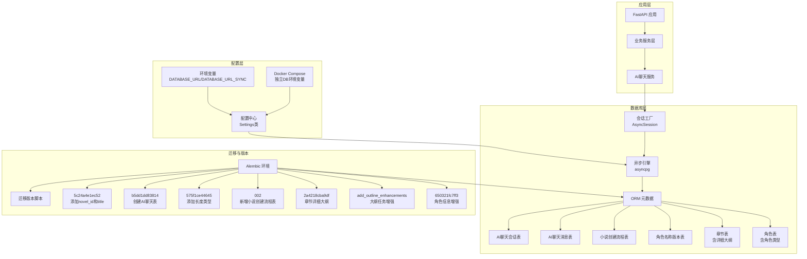
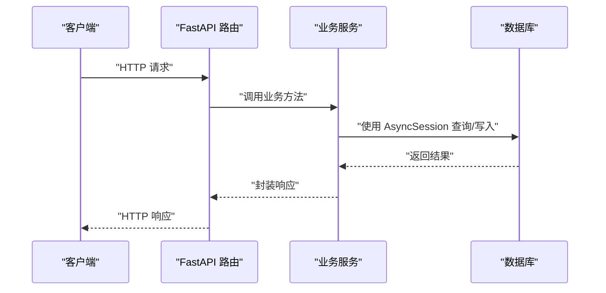
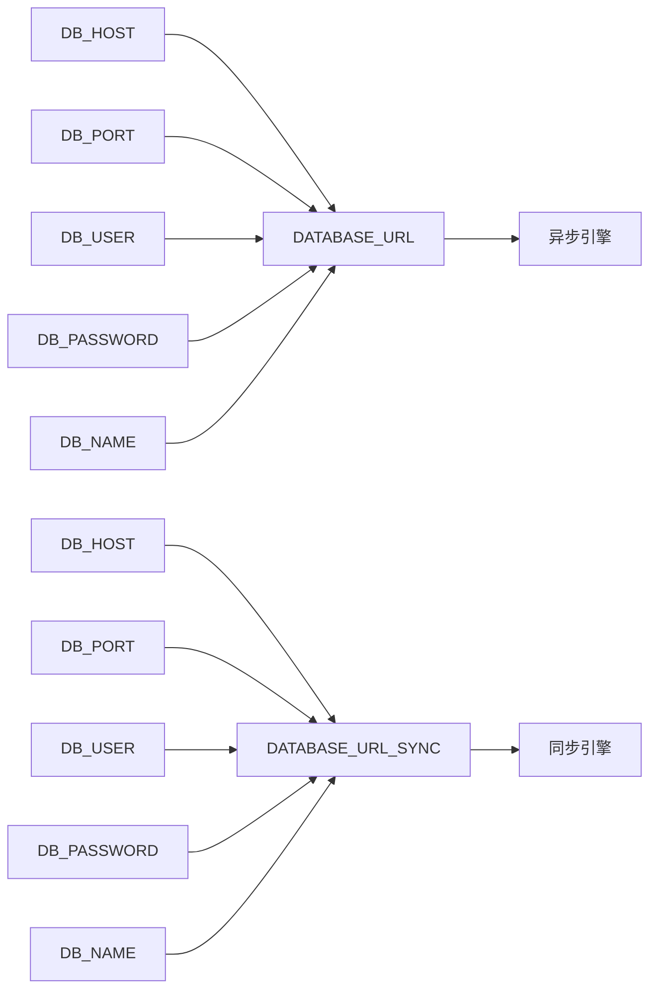
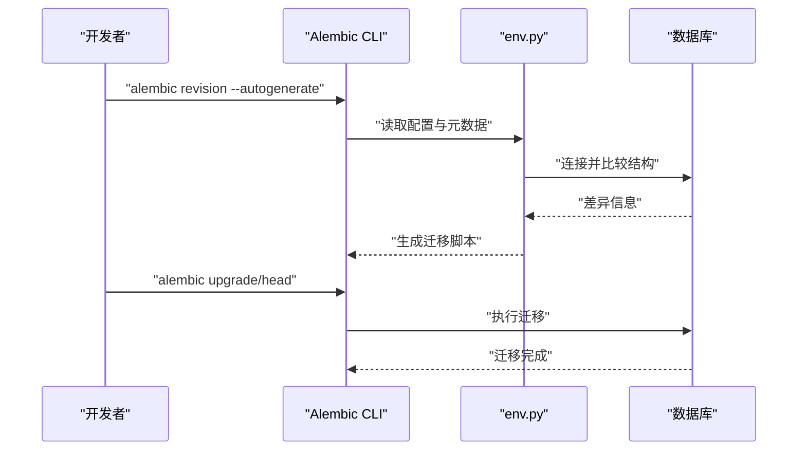
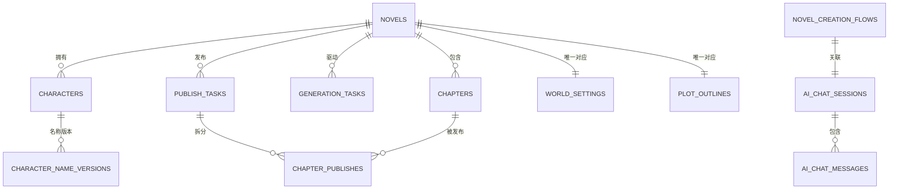
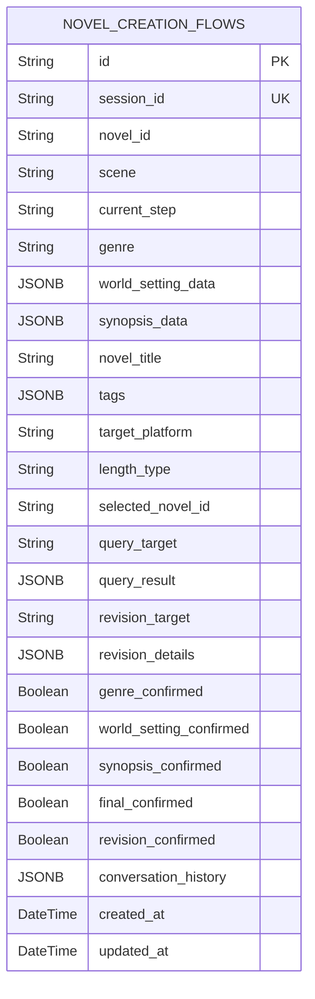
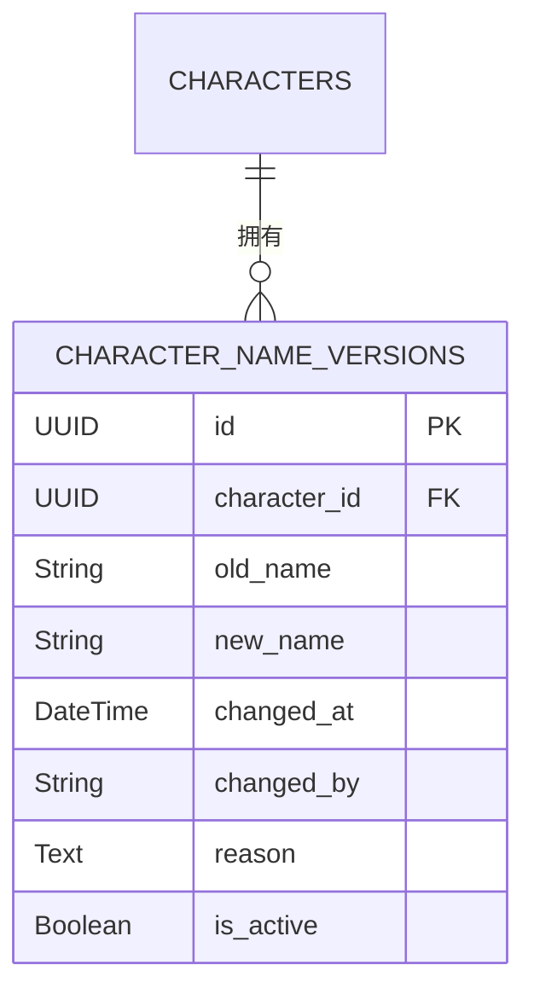
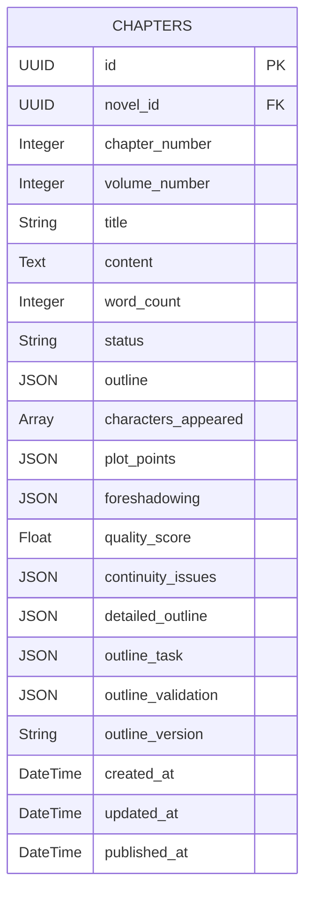
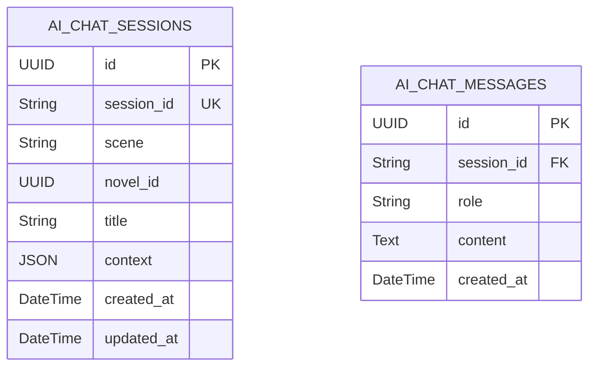
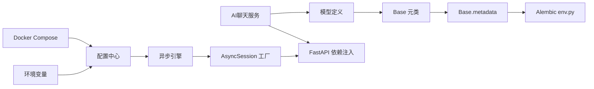

# 数据库设计

<cite>
**本文引用的文件**
- [core/database.py](file://core/database.py)
- [backend/config.py](file://backend/config.py)
- [docker-compose.yml](file://docker-compose.yml)
- [.env](file://.env)
- [.env.example](file://.env.example)
- [alembic/env.py](file://alembic/env.py)
- [alembic.ini](file://alembic.ini)
- [alembic/versions/5badc20e064a_initial_tables.py](file://alembic/versions/5badc20e064a_initial_tables.py)
- [alembic/versions/186700edca0b_fix_complete_database_tables.py](file://alembic/versions/186700edca0b_fix_complete_database_tables.py)
- [alembic/versions/fc4ecf252bbb_add_crawler_and_publishing_system.py](file://alembic/versions/fc4ecf252bbb_add_crawler_and_publishing_system.py)
- [alembic/versions/b5dd1dd83814_add_ai_chat_session_models.py](file://alembic/versions/b5dd1dd83814_add_ai_chat_session_models.py)
- [alembic/versions/5c24a4e1ec52_add_novel_id_and_title_to_chat_session.py](file://alembic/versions/5c24a4e1ec52_add_novel_id_and_title_to_chat_session.py)
- [alembic/versions/575f1ce44645_add_length_type_column_to_novels.py](file://alembic/versions/575f1ce44645_add_length_type_column_to_novels.py)
- [alembic/versions/002_add_novel_creation_flow_table.py](file://alembic/versions/002_add_novel_creation_flow_table.py)
- [alembic/versions/2a4218cba9df_add_detailed_outline_to_chapters.py](file://alembic/versions/2a4218cba9df_add_detailed_outline_to_chapters.py)
- [alembic/versions/add_outline_enhancements_to_chapters.py](file://alembic/versions/add_outline_enhancements_to_chapters.py)
- [alembic/versions/650321fc7ff3_add_missing_columns_to_characters_and_.py](file://alembic/versions/650321fc7ff3_add_missing_columns_to_characters_and_.py)
- [alembic/versions/c6cfc7b3ef20_add_raw_content_column_to_world_settings.py](file://alembic/versions/c6cfc7b3ef20_add_raw_content_column_to_world_settings.py)
- [alembic/versions/40555b81bb5d_add_batch_writing_task_type.py](file://alembic/versions/40555b81bb5d_add_batch_writing_task_type.py)
- [alembic/versions/4b47062db094_add_douyin_crawl_types.py](file://alembic/versions/4b47062db094_add_douyin_crawl_types.py)
- [core/models/__init__.py](file://core/models/__init__.py)
- [core/models/novel.py](file://core/models/novel.py)
- [core/models/character.py](file://core/models/character.py)
- [core/models/character_name_version.py](file://core/models/character_name_version.py)
- [core/models/chapter.py](file://core/models/chapter.py)
- [core/models/generation_task.py](file://core/models/generation_task.py)
- [core/models/publish_task.py](file://core/models/publish_task.py)
- [core/models/world_setting.py](file://core/models/world_setting.py)
- [core/models/ai_chat_session.py](file://core/models/ai_chat_session.py)
- [core/models/novel_creation_flow.py](file://core/models/novel_creation_flow.py)
- [backend/services/ai_chat_service.py](file://backend/services/ai_chat_service.py)
- [backend/api/v1/ai_chat.py](file://backend/api/v1/ai_chat.py)
</cite>

## 更新摘要
**变更内容**
- 数据库连接配置优化：core/database.py中移除URL查询参数并添加SSL连接禁用
- 独立环境变量重构：docker-compose.yml重构数据库连接参数为独立环境变量（DB_HOST、DB_PORT、DB_USER、DB_PASSWORD、DB_NAME）
- 配置中心重构：backend/config.py使用独立的数据库配置属性，支持动态构建连接URL
- 端口配置更新：.env和.docker-compose.yml使用不同的数据库端口（5434 vs 5432）
- 新增小说创建流程表：alembic/versions/002_add_novel_creation_flow_table.py
- 新增角色名称版本表：core/models/character_name_version.py
- 章节大纲增强：alembic/versions/2a4218cba9df_add_detailed_outline_to_chapters.py
- 章节大纲任务增强：alembic/versions/add_outline_enhancements_to_chapters.py
- 角色信息增强：alembic/versions/650321fc7ff3_add_missing_columns_to_characters_and_.py
- 世界设定原始内容：alembic/versions/c6cfc7b3ef20_add_raw_content_column_to_world_settings.py
- 批量写作任务类型：alembic/versions/40555b81bb5d_add_batch_writing_task_type.py
- 抖音爬虫类型：alembic/versions/4b47062db094_add_douyin_crawl_types.py

## 目录
1. [简介](#简介)
2. [项目结构](#项目结构)
3. [核心组件](#核心组件)
4. [架构总览](#架构总览)
5. [详细组件分析](#详细组件分析)
6. [依赖分析](#依赖分析)
7. [性能考量](#性能考量)
8. [故障排查指南](#故障排查指南)
9. [结论](#结论)
10. [附录](#附录)

## 简介
本文件面向数据库工程师与后端开发者，系统化梳理小说生成系统的数据库设计与实现，覆盖 SQLAlchemy 异步 ORM 配置、连接池与事务策略、实体关系建模、外键与索引设计、Alembic 迁移体系、核心数据模型关系、性能优化与安全策略。内容以仓库现有代码为依据，避免臆造信息，并通过图示帮助不同背景读者理解。

## 项目结构
数据库相关的关键位置如下：
- ORM 引擎与会话工厂：core/database.py
- 应用配置（含数据库连接串）：backend/config.py
- Docker Compose 配置：docker-compose.yml
- 环境变量配置：.env、.env.example
- Alembic 环境与迁移入口：alembic/env.py、alembic.ini
- 模型定义与导出：core/models/*
- 迁移脚本：alembic/versions/*

**图表来源**
- [core/database.py:11-17](file://core/database.py#L11-L17)
- [backend/config.py:18-26](file://backend/config.py#L18-L26)
- [docker-compose.yml:37-45](file://docker-compose.yml#L37-L45)
- [.env:7-8](file://.env#L7-L8)
- [alembic/env.py:12-25](file://alembic/env.py#L12-L25)
- [alembic/versions/5c24a4e1ec52_add_novel_id_and_title_to_chat_session.py:21-43](file://alembic/versions/5c24a4e1ec52_add_novel_id_and_title_to_chat_session.py#L21-L43)
- [alembic/versions/b5dd1dd83814_add_ai_chat_session_models.py:21-46](file://alembic/versions/b5dd1dd83814_add_ai_chat_session_models.py#L21-L46)
- [alembic/versions/002_add_novel_creation_flow_table.py:19-55](file://alembic/versions/002_add_novel_creation_flow_table.py#L19-L55)
- [alembic/versions/2a4218cba9df_add_detailed_outline_to_chapters.py:22-27](file://alembic/versions/2a4218cba9df_add_detailed_outline_to_chapters.py#L22-L27)
- [alembic/versions/add_outline_enhancements_to_chapters.py:22-35](file://alembic/versions/add_outline_enhancements_to_chapters.py#L22-L35)

**章节来源**
- [core/database.py:1-36](file://core/database.py#L1-L36)
- [backend/config.py:1-59](file://backend/config.py#L1-L59)
- [docker-compose.yml:1-86](file://docker-compose.yml#L1-L86)
- [.env:1-22](file://.env#L1-L22)
- [.env.example:1-21](file://.env.example#L1-L21)
- [alembic/env.py:1-66](file://alembic/env.py#L1-L66)
- [alembic.ini:1-150](file://alembic.ini#L1-L150)

## 核心组件
- 异步引擎与会话工厂
  - 使用异步驱动与连接池参数，提供高并发下的稳定连接管理。
  - 通过依赖注入提供生命周期可控的 AsyncSession。
  - **更新** 移除URL查询参数并添加SSL连接禁用配置。
- 配置中心
  - 提供 DATABASE_URL（异步）与 DATABASE_URL_SYNC（同步），用于运行时构建连接串。
  - **更新** 使用独立的DB_HOST、DB_PORT、DB_USER、DB_PASSWORD、DB_NAME环境变量重构配置。
- Docker Compose 配置
  - **更新** 重构数据库连接参数为独立环境变量，支持容器间通信。
- Alembic 环境
  - 导入所有模型，注册到 Base.metadata，确保迁移扫描到全部表结构。
  - 在线/离线模式分别配置连接与事务边界。
- 模型导出
  - 统一导出核心实体，便于上层模块按需引入。

**章节来源**
- [core/database.py:11-17](file://core/database.py#L11-L17)
- [backend/config.py:18-26](file://backend/config.py#L18-L26)
- [docker-compose.yml:37-45](file://docker-compose.yml#L37-L45)
- [alembic/env.py:12-25](file://alembic/env.py#L12-L25)
- [core/models/__init__.py:1-42](file://core/models/__init__.py#L1-L42)

## 架构总览
系统采用"异步 ORM + Alembic 迁移"的标准架构。应用通过 FastAPI 注入 AsyncSession 访问数据库；Alembic 在开发与生产环境统一管理表结构演进。**更新** 配置层重构为独立环境变量，支持更灵活的部署场景。

**图表来源**
- [core/database.py:26-36](file://core/database.py#L26-L36)
- [backend/config.py:18-26](file://backend/config.py#L18-L26)

## 详细组件分析

### SQLAlchemy 异步 ORM 配置
- 引擎创建
  - 使用异步驱动，开启调试日志开关，设置连接池大小与溢出数量，满足高并发场景。
  - **更新** 移除URL查询参数，直接使用基础连接URL。
  - **更新** 添加 `connect_args={"ssl": False}` 配置，禁用SSL连接。
- 会话工厂
  - AsyncSession 类型，关闭提交后过期，避免脏读；通过上下文管理器确保异常回滚与连接关闭。
- 依赖注入
  - 提供 get_db 作为 FastAPI 依赖，自动完成 commit/rollback/close 生命周期管理。

**图表来源**
- [core/database.py:26-36](file://core/database.py#L26-L36)

**章节来源**
- [core/database.py:11-17](file://core/database.py#L11-L17)

### 配置中心重构
**更新** 配置中心重构为独立环境变量配置

- 独立数据库配置属性
  - DB_HOST、DB_PORT、DB_USER、DB_PASSWORD、DB_NAME 独立配置，支持灵活的部署场景。
  - DATABASE_URL 和 DATABASE_URL_SYNC 动态构建，基于独立配置属性。
- 环境变量支持
  - .env 和 .env.example 文件提供默认配置模板。
  - Docker Compose 使用独立环境变量，支持容器间通信。
- 端口配置差异
  - .env 使用 5434 端口（本地开发）
  - docker-compose.yml 使用 5432 端口（容器内部）

**图表来源**
- [backend/config.py:18-26](file://backend/config.py#L18-L26)
- [.env:7-8](file://.env#L7-L8)
- [docker-compose.yml:38-42](file://docker-compose.yml#L38-L42)

**章节来源**
- [backend/config.py:11-26](file://backend/config.py#L11-L26)
- [.env:6-8](file://.env#L6-L8)
- [.env.example:6-7](file://.env.example#L6-L7)
- [docker-compose.yml:37-45](file://docker-compose.yml#L37-L45)

### Docker Compose 配置重构
**更新** Docker Compose 重构为独立环境变量配置

- 独立数据库环境变量
  - DB_HOST=postgres：指向 PostgreSQL 容器
  - DB_PORT=5432：容器内部端口
  - DB_USER、DB_PASSWORD、DB_NAME：数据库认证信息
- 网络配置
  - backend 服务依赖 postgres 和 redis 服务健康检查
  - 容器间通过服务名通信
- 端口映射
  - PostgreSQL 映射到 5434:5432（本地开发）
  - Backend 映射到 8000:8000
  - Redis 映射到 6379:6379

**章节来源**
- [docker-compose.yml:1-86](file://docker-compose.yml#L1-L86)

### Alembic 迁移系统
- 版本控制机制
  - 通过版本目录中的脚本记录每次结构变更，支持升级与降级。
- 迁移脚本编写
  - 在 env.py 中导入模型并注册元数据，确保迁移扫描到所有表。
  - 同步 URL 来源于 DATABASE_URL_SYNC，保证迁移工具可连接数据库。
- 数据库演进管理
  - 初始版本包含主要实体；后续版本逐步引入爬虫、发布系统相关表与索引。
- **新增** 迁移版本增强
  - 002：新增小说创建流程表，支持完整的创作工作流跟踪
  - 2a4218cba9df：为章节表添加详细大纲字段，支持细化的章节规划
  - add_outline_enhancements：增强章节大纲管理，添加任务和验证功能
  - 650321fc7ff3：角色信息增强，添加角色类型、成长弧线等字段
  - c6cfc7b3ef20：世界设定添加原始内容字段，支持Agent输出保存

**图表来源**
- [alembic/env.py:12-25](file://alembic/env.py#L12-L25)
- [alembic/versions/5badc20e064a_initial_tables.py:21-166](file://alembic/versions/5badc20e064a_initial_tables.py#L21-L166)
- [alembic/versions/186700edca0b_fix_complete_database_tables.py:21-247](file://alembic/versions/186700edca0b_fix_complete_database_tables.py#L21-L247)
- [alembic/versions/fc4ecf252bbb_add_crawler_and_publishing_system.py:21-172](file://alembic/versions/fc4ecf252bbb_add_crawler_and_publishing_system.py#L21-L172)
- [alembic/versions/002_add_novel_creation_flow_table.py:19-55](file://alembic/versions/002_add_novel_creation_flow_table.py#L19-L55)
- [alembic/versions/2a4218cba9df_add_detailed_outline_to_chapters.py:22-27](file://alembic/versions/2a4218cba9df_add_detailed_outline_to_chapters.py#L22-L27)
- [alembic/versions/add_outline_enhancements_to_chapters.py:22-35](file://alembic/versions/add_outline_enhancements_to_chapters.py#L22-L35)

**章节来源**
- [alembic/env.py:1-66](file://alembic/env.py#L1-L66)
- [alembic.ini:1-150](file://alembic.ini#L1-L150)
- [alembic/versions/5badc20e064a_initial_tables.py:1-181](file://alembic/versions/5badc20e064a_initial_tables.py#L1-L181)
- [alembic/versions/186700edca0b_fix_complete_database_tables.py:1-267](file://alembic/versions/186700edca0b_fix_complete_database_tables.py#L1-L267)
- [alembic/versions/fc4ecf252bbb_add_crawler_and_publishing_system.py:1-172](file://alembic/versions/fc4ecf252bbb_add_crawler_and_publishing_system.py#L1-L172)
- [alembic/versions/002_add_novel_creation_flow_table.py:1-62](file://alembic/versions/002_add_novel_creation_flow_table.py#L1-L62)
- [alembic/versions/2a4218cba9df_add_detailed_outline_to_chapters.py:1-33](file://alembic/versions/2a4218cba9df_add_detailed_outline_to_chapters.py#L1-L33)
- [alembic/versions/add_outline_enhancements_to_chapters.py:1-43](file://alembic/versions/add_outline_enhancements_to_chapters.py#L1-L43)

### 核心数据模型设计
- 实体关系映射
  - 小说（Novel）与世界设定（WorldSetting）、角色（Character）、大纲（PlotOutline）、章节（Chapter）、生成任务（GenerationTask）、发布任务（PublishTask）等存在一对一或一对多关系。
  - 外键约束采用级联删除，确保父实体删除时子实体一致性。
  - **新增** 小说创建流程（NovelCreationFlow）与AI聊天会话（AIChatSession）关联，支持创作流程跟踪。
  - **新增** 角色名称版本（CharacterNameVersion）与角色关联，支持角色名称变更追踪。
- 字段设计要点
  - 使用 UUID 作为主键，提升安全性与分布式友好性。
  - 使用 JSONB 存储结构化元数据，便于灵活扩展。
  - 使用数组存储章节出现的角色 ID，便于快速筛选。
  - **新增** 章节表包含详细大纲、大纲任务、验证结果等字段，支持精细化章节管理。
- 关系与级联
  - 多个实体在 ORM 层声明 cascade="all, delete-orphan"，确保删除父实体时自动清理子实体。
  - 章节表通过注释标识用途，便于维护识别。

**图表来源**
- [core/models/novel.py:37-77](file://core/models/novel.py#L37-L77)
- [core/models/character.py:31-55](file://core/models/character.py#L31-L55)
- [core/models/chapter.py:18-49](file://core/models/chapter.py#L18-L49)
- [core/models/generation_task.py:27-47](file://core/models/generation_task.py#L27-L47)
- [core/models/publish_task.py:29-51](file://core/models/publish_task.py#L29-L51)
- [core/models/world_setting.py:11-29](file://core/models/world_setting.py#L11-L29)
- [core/models/ai_chat_session.py:17-38](file://core/models/ai_chat_session.py#L17-L38)
- [core/models/novel_creation_flow.py:9-53](file://core/models/novel_creation_flow.py#L9-L53)
- [core/models/character_name_version.py:12-26](file://core/models/character_name_version.py#L12-L26)

**章节来源**
- [core/models/novel.py:1-77](file://core/models/novel.py#L1-L77)
- [core/models/character.py:1-55](file://core/models/character.py#L1-L55)
- [core/models/chapter.py:1-49](file://core/models/chapter.py#L1-L49)
- [core/models/generation_task.py:1-47](file://core/models/generation_task.py#L1-L47)
- [core/models/publish_task.py:1-51](file://core/models/publish_task.py#L1-L51)
- [core/models/world_setting.py:1-29](file://core/models/world_setting.py#L1-L29)
- [core/models/novel_creation_flow.py:1-53](file://core/models/novel_creation_flow.py#L1-L53)
- [core/models/character_name_version.py:1-195](file://core/models/character_name_version.py#L1-L195)

### 小说创建流程表增强
**新增** 完整的小说创建流程跟踪机制

- 小说创建流程表结构
  - 与AI聊天会话关联：通过session_id外键关联，支持完整的创作对话跟踪。
  - 流程状态管理：包含场景类型（create/query/revise）、当前步骤、确认状态等。
  - 创建数据存储：支持题材、世界设定、概要、标题、标签、目标平台、字数类型等。
  - 查询与修改支持：支持查询目标、查询结果、修改目标、修改详情等。
  - 对话历史：存储最近10轮对话历史，便于流程回溯。
- 索引优化
  - 为session_id、novel_id、selected_novel_id建立索引，支持高效查询。
- 流程支持
  - 支持小说创建、查询、修改三种场景的完整流程跟踪。
  - 提供确认状态字段，支持创作流程的阶段性确认。

**图表来源**
- [core/models/novel_creation_flow.py:9-53](file://core/models/novel_creation_flow.py#L9-L53)
- [alembic/versions/002_add_novel_creation_flow_table.py:19-55](file://alembic/versions/002_add_novel_creation_flow_table.py#L19-L55)

**章节来源**
- [core/models/novel_creation_flow.py:1-53](file://core/models/novel_creation_flow.py#L1-L53)
- [alembic/versions/002_add_novel_creation_flow_table.py:1-62](file://alembic/versions/002_add_novel_creation_flow_table.py#L1-L62)

### 角色名称版本表
**新增** 角色名称变更追踪与管理

- 角色名称版本表结构
  - 名称版本记录：记录角色名称的历史变更，包括旧名称、新名称、变更时间、变更原因等。
  - 版本管理：支持创建版本记录、获取版本历史、获取指定时间点的版本、对比版本差异。
  - 回溯功能：支持回溯到指定版本，创建新的版本记录。
  - 验证功能：验证名称变更的合理性，检测重复变更和相似名称。
- 服务层功能
  - CharacterNameVersionService提供完整的版本管理API。
  - 支持异步操作，集成到数据库事务中。
- 关系设计
  - 与Character实体建立一对多关系，支持级联删除。
  - 通过relationship属性实现双向关联。

**图表来源**
- [core/models/character_name_version.py:12-26](file://core/models/character_name_version.py#L12-L26)
- [core/models/character.py:54-55](file://core/models/character.py#L54-L55)

**章节来源**
- [core/models/character_name_version.py:1-195](file://core/models/character_name_version.py#L1-L195)
- [core/models/character.py:1-55](file://core/models/character.py#L1-L55)

### 章节大纲增强
**新增** 细化的章节大纲管理能力

- 章节大纲字段增强
  - detailed_outline：细化后的详细章节大纲，支持复杂的章节规划。
  - outline_task：本章的大纲任务，记录具体的创作任务。
  - outline_validation：大纲验证结果，记录验证状态和结果。
  - outline_version：使用的大纲版本号，支持版本控制。
- 迁移版本演进
  - 2a4218cba9df：首次添加detailed_outline字段
  - add_outline_enhancements：后续添加outline_task、outline_validation、outline_version字段
- 功能支持
  - 支持精细化的章节大纲管理
  - 提供大纲任务分配和验证机制
  - 支持大纲版本控制和追踪

**图表来源**
- [core/models/chapter.py:18-49](file://core/models/chapter.py#L18-L49)
- [alembic/versions/2a4218cba9df_add_detailed_outline_to_chapters.py:22-27](file://alembic/versions/2a4218cba9df_add_detailed_outline_to_chapters.py#L22-L27)
- [alembic/versions/add_outline_enhancements_to_chapters.py:22-35](file://alembic/versions/add_outline_enhancements_to_chapters.py#L22-L35)

**章节来源**
- [core/models/chapter.py:1-49](file://core/models/chapter.py#L1-L49)
- [alembic/versions/2a4218cba9df_add_detailed_outline_to_chapters.py:1-33](file://alembic/versions/2a4218cba9df_add_detailed_outline_to_chapters.py#L1-L33)
- [alembic/versions/add_outline_enhancements_to_chapters.py:1-43](file://alembic/versions/add_outline_enhancements_to_chapters.py#L1-L43)

### 角色信息增强
**更新** 角色模型字段扩展

- 角色信息增强字段
  - role_type：角色类型（主角、配角、反派、路人），支持更精细的角色分类。
  - growth_arc：角色成长弧线，记录角色的发展轨迹。
  - first_appearance_chapter：首次出场章节，支持角色出场时间追踪。
  - avatar_url：角色头像URL，支持角色可视化展示。
- 字段替换
  - 移除了旧的role和character_arc字段，迁移到新的结构化字段。
- 枚举类型
  - RoleType枚举定义了标准的角色类型分类。

**章节来源**
- [core/models/character.py:1-55](file://core/models/character.py#L1-L55)
- [alembic/versions/650321fc7ff3_add_missing_columns_to_characters_and_.py:21-32](file://alembic/versions/650321fc7ff3_add_missing_columns_to_characters_and_.py#L21-L32)

### 世界设定原始内容
**新增** Agent输出内容保存

- 原始内容字段
  - raw_content：世界设定的原始Agent输出内容，支持内容追溯和审计。
- 字段作用
  - 保存Agent生成的原始文本，便于后续分析和修改。
  - 支持内容版本管理和变更追踪。

**章节来源**
- [core/models/world_setting.py:1-29](file://core/models/world_setting.py#L1-L29)
- [alembic/versions/c6cfc7b3ef20_add_raw_content_column_to_world_settings.py:1-29](file://alembic/versions/c6cfc7b3ef20_add_raw_content_column_to_world_settings.py#L1-L29)

### 批量写作任务类型
**新增** 扩展的任务类型支持

- 批量写作任务
  - 为TaskType枚举添加batch_writing值，支持批量内容生成任务。
- 枚举扩展
  - 通过ALTER TYPE语句安全地扩展枚举类型，无需重建表结构。

**章节来源**
- [alembic/versions/40555b81bb5d_add_batch_writing_task_type.py:1-32](file://alembic/versions/40555b81bb5d_add_batch_writing_task_type.py#L1-L32)

### 抖音爬虫类型
**新增** 新的爬虫平台支持

- 抖音爬虫类型
  - hot：抖音热门内容爬取
  - search：抖音搜索结果爬取  
  - creators：抖音创作者信息爬取
- 索引优化
  - 临时移除相关表的复合索引，为枚举类型扩展做准备。
- 平台扩展
  - 支持更多内容平台的数据采集需求。

**章节来源**
- [alembic/versions/4b47062db094_add_douyin_crawl_types.py:1-50](file://alembic/versions/4b47062db094_add_douyin_crawl_types.py#L1-L50)

### AI 聊天会话模型增强
**更新** 新增 `novel_id` 和 `title` 字段支持会话隔离和智能标题存储

- AI 聊天会话表结构
  - 新增 `novel_id` 字段：UUID 类型，支持按小说隔离会话，便于多小说场景下的会话管理。
  - 新增 `title` 字段：字符串类型，最大200字符，用于智能生成和显示会话标题。
  - 保留原有的 `session_id`、`scene`、`context` 等字段。
- 迁移版本演进
  - b5dd1dd83814：首次创建 AI 聊天会话和消息表
  - 5c24a4e1ec52：添加 `novel_id` 和 `title` 字段，并支持从旧的 `context` 字段迁移数据
- 会话隔离机制
  - 支持按 `novel_id` 过滤会话列表，实现多小说场景下的会话隔离。
  - 在创建会话时自动提取 `context` 中的 `novel_id` 信息。
- 智能标题生成
  - 当会话没有标题时，自动从对话内容生成标题。
  - 支持从用户消息中提取主题信息生成简洁的会话标题。

**图表来源**
- [core/models/ai_chat_session.py:17-38](file://core/models/ai_chat_session.py#L17-L38)
- [alembic/versions/b5dd1dd83814_add_ai_chat_session_models.py:24-45](file://alembic/versions/b5dd1dd83814_add_ai_chat_session_models.py#L24-L45)
- [alembic/versions/5c24a4e1ec52_add_novel_id_and_title_to_chat_session.py:22-27](file://alembic/versions/5c24a4e1ec52_add_novel_id_and_title_to_chat_session.py#L22-L27)

**章节来源**
- [core/models/ai_chat_session.py:1-38](file://core/models/ai_chat_session.py#L1-L38)
- [alembic/versions/b5dd1dd83814_add_ai_chat_session_models.py:1-59](file://alembic/versions/b5dd1dd83814_add_ai_chat_session_models.py#L1-L59)
- [alembic/versions/5c24a4e1ec52_add_novel_id_and_title_to_chat_session.py:1-44](file://alembic/versions/5c24a4e1ec52_add_novel_id_and_title_to_chat_session.py#L1-L44)

### 外键约束与索引策略
- 外键约束
  - 章节、角色、生成任务、发布任务等均对小说进行外键关联，并设置 CASCADE 删除，保证数据一致性。
  - AI 聊天消息表通过 `session_id` 外键关联到会话表，支持级联删除。
  - **新增** 小说创建流程表通过 `session_id` 外键关联到AI聊天会话表。
  - **新增** 角色名称版本表通过 `character_id` 外键关联到角色表。
- 索引策略
  - 爬虫任务表：按平台与状态、创建时间建立复合/单列索引，加速任务调度与统计。
  - 爬取结果表：按任务 ID 建立索引，便于按任务聚合结果。
  - 平台账户表：按平台名称建立索引，便于按平台检索可用账户。
  - 发布任务表：按小说 ID 与状态建立索引，支撑发布队列与状态监控。
  - 章节发布表：按发布任务 ID 建立索引，便于批量查询任务下各章节发布状态。
  - **新增** AI 聊天会话表：按 `novel_id` 建立索引，支持按小说隔离查询。
  - **新增** 小说创建流程表：按 `session_id`、`novel_id`、`selected_novel_id` 建立索引。
  - **新增** 角色名称版本表：按 `character_id` 建立索引，支持角色名称历史查询。

**章节来源**
- [alembic/versions/186700edca0b_fix_complete_database_tables.py:41-98](file://alembic/versions/186700edca0b_fix_complete_database_tables.py#L41-L98)
- [alembic/versions/fc4ecf252bbb_add_crawler_and_publishing_system.py:41-117](file://alembic/versions/fc4ecf252bbb_add_crawler_and_publishing_system.py#L41-L117)
- [alembic/versions/5c24a4e1ec52_add_novel_id_and_title_to_chat_session.py:23-24](file://alembic/versions/5c24a4e1ec52_add_novel_id_and_title_to_chat_session.py#L23-L24)
- [alembic/versions/002_add_novel_creation_flow_table.py:52-54](file://alembic/versions/002_add_novel_creation_flow_table.py#L52-L54)
- [alembic/versions/650321fc7ff3_add_missing_columns_to_characters_and_.py:23-32](file://alembic/versions/650321fc7ff3_add_missing_columns_to_characters_and_.py#L23-L32)

### 事务处理策略
- 会话生命周期
  - 通过依赖注入在请求范围内创建 AsyncSession，异常时自动回滚，最后关闭连接，确保资源释放。
- 事务边界
  - 单次请求内共享同一会话，避免跨请求状态污染；复杂流程建议显式提交/回滚以明确边界。

**章节来源**
- [core/database.py:26-36](file://core/database.py#L26-L36)

## 依赖分析
- 模块耦合
  - 模型统一继承自 Base，通过 env.py 导入并在迁移中注册元数据，形成"模型 → 元数据 → 迁移"的单向依赖链。
- 外部依赖
  - 异步驱动与 SQLAlchemy 2.x 异步特性配合，确保高并发下的 I/O 效率。
- 运行时连接
  - 异步与同步 URL 分别用于应用与迁移工具，避免驱动不匹配问题。
  - **更新** 配置中心重构为独立环境变量，支持多种部署场景。

**图表来源**
- [core/models/__init__.py:1-42](file://core/models/__init__.py#L1-L42)
- [alembic/env.py:12-25](file://alembic/env.py#L12-L25)
- [backend/config.py:18-26](file://backend/config.py#L18-L26)
- [core/database.py:11-17](file://core/database.py#L11-L17)
- [backend/services/ai_chat_service.py:192-200](file://backend/services/ai_chat_service.py#L192-L200)
- [.env:7-8](file://.env#L7-L8)
- [docker-compose.yml:37-45](file://docker-compose.yml#L37-L45)

**章节来源**
- [core/models/__init__.py:1-42](file://core/models/__init__.py#L1-L42)
- [alembic/env.py:1-66](file://alembic/env.py#L1-L66)
- [backend/config.py:1-59](file://backend/config.py#L1-L59)
- [core/database.py:1-36](file://core/database.py#L1-L36)
- [.env:1-22](file://.env#L1-L22)
- [docker-compose.yml:1-86](file://docker-compose.yml#L1-L86)

## 性能考量
- 查询优化
  - 对高频过滤字段（如小说 ID、状态、创建时间）建立索引，减少全表扫描。
  - 使用 JSONB 字段时，结合 GIN/排序索引优化查询与排序。
  - **新增** AI 聊天会话表的 `novel_id` 字段建立了索引，支持高效的按小说过滤查询。
  - **新增** 小说创建流程表的多字段索引，支持完整的创作流程查询。
  - **新增** 角色名称版本表的 `character_id` 索引，支持角色名称历史查询。
- 缓存策略
  - 对热点数据（如小说概要、角色列表）结合应用层缓存（Redis）降低数据库压力。
- 并发控制
  - 合理设置连接池大小与溢出数量，避免峰值时连接争用。
  - 使用异步 I/O 与长连接复用，减少握手开销。
  - **更新** SSL 连接禁用可能影响某些网络环境下的连接性能。
- 写入优化
  - 大批量写入时使用批量插入与事务合并，减少往返次数。
  - 控制 JSONB 字段大小，避免单行过大影响复制与备份。
  - **新增** 章节大纲字段的合理使用，避免过度复杂的JSON结构影响性能。

## 故障排查指南
- 连接失败
  - 检查 DATABASE_URL 与 DATABASE_URL_SYNC 是否正确，确认主机、端口、用户、密码与数据库名一致。
  - **更新** 检查 .env 和 docker-compose.yml 中的端口配置差异（5434 vs 5432）。
- 迁移失败
  - 确认 Alembic 环境已导入所有模型，且目标数据库具备相应权限。
  - 在线/离线模式分别检查连接参数与事务边界。
  - **新增** 检查新增迁移版本的兼容性，特别是枚举类型扩展和索引变更。
- 事务异常
  - 若请求中发生异常，确认 get_db 的回滚逻辑是否生效；必要时在服务层显式捕获并回滚。
- 索引缺失
  - 对新增查询路径补充索引；评估索引对写入性能的影响并平衡。
  - **新增** 检查新增表的索引配置，特别是外键字段和查询频繁的字段。
- **新增** SSL 连接问题
  - 如果遇到 SSL 相关错误，检查 `connect_args={"ssl": False}` 配置是否符合网络环境要求。
- **新增** 环境变量配置
  - 确认 .env 文件中的 DATABASE_URL 和 DATABASE_URL_SYNC 配置正确。
  - 检查 docker-compose.yml 中的 DB_* 环境变量配置。
- **新增** 新增功能故障排查
  - 检查小说创建流程表的外键约束是否正确。
  - 验证角色名称版本表的级联删除功能。
  - 确认章节大纲字段的默认值和索引配置。

**章节来源**
- [backend/config.py:18-26](file://backend/config.py#L18-L26)
- [alembic/env.py:46-65](file://alembic/env.py#L46-L65)
- [core/database.py:26-36](file://core/database.py#L26-L36)
- [.env:7-8](file://.env#L7-L8)
- [docker-compose.yml:37-45](file://docker-compose.yml#L37-L45)

## 结论
该数据库设计以 SQLAlchemy 异步 ORM 为核心，结合 Alembic 迁移体系，实现了从初始表结构到爬虫与发布系统的完整演进。**更新** 最新的配置重构提供了更灵活的部署选项，支持独立环境变量配置和多种部署场景。**新增** 的数据库架构增强进一步提升了系统的功能完整性：

- **小说创建流程跟踪**：通过novel_creation_flows表实现了完整的创作工作流管理。
- **角色名称版本控制**：支持角色名称的变更追踪和回溯功能。
- **精细化章节管理**：章节表的详细大纲字段支持复杂的章节规划和管理。
- **扩展的任务类型**：支持批量写作等新的任务类型。
- **平台扩展支持**：新增抖音等爬虫平台的支持。

通过合理的实体关系、外键约束与索引策略，兼顾了数据一致性与查询效率。配合异步连接池与事务生命周期管理，以及 SSL 连接禁用配置，能够满足高并发场景下的稳定性与可维护性需求。

## 附录
- 配置项摘要
  - 数据库连接串（异步/同步）：来源于配置中心属性，用于运行时构建。
  - 独立数据库配置：DB_HOST、DB_PORT、DB_USER、DB_PASSWORD、DB_NAME 支持灵活部署。
  - 连接池参数：在引擎创建时设置，需根据实例规模与负载调整。
- 迁移常用命令
  - 生成迁移：基于模型差异自动生成脚本。
  - 应用迁移：将数据库结构升级至最新版本。
  - 回退迁移：按需降级到指定版本，注意数据丢失风险。
- **新增** AI 聊天会话迁移版本
  - b5dd1dd83814：创建 AI 聊天会话和消息表
  - 5c24a4e1ec52：添加 `novel_id` 和 `title` 字段，支持会话隔离和智能标题
  - 575f1ce44645：为小说表添加长度类型字段
- **新增** 新增功能迁移版本
  - 002：新增小说创建流程表，支持完整的创作工作流跟踪
  - 2a4218cba9df：为章节表添加详细大纲字段
  - add_outline_enhancements：增强章节大纲管理，添加任务和验证功能
  - 650321fc7ff3：角色信息增强，添加角色类型、成长弧线等字段
  - c6cfc7b3ef20：世界设定添加原始内容字段
  - 40555b81bb5d：添加批量写作任务类型
  - 4b47062db094：添加抖音爬虫类型
- **新增** 环境变量配置
  - .env 文件：本地开发环境配置
  - docker-compose.yml：容器化部署配置
  - 独立环境变量：DB_HOST、DB_PORT、DB_USER、DB_PASSWORD、DB_NAME
- **新增** 数据模型增强摘要
  - 小说创建流程表：支持完整的创作工作流管理
  - 角色名称版本表：支持角色名称变更追踪
  - 章节大纲增强：支持精细化的章节管理
  - 角色信息增强：支持更精细的角色分类和管理
  - 世界设定增强：支持原始内容保存
  - 任务类型扩展：支持批量写作等新任务类型
  - 爬虫平台扩展：支持抖音等新平台的数据采集

**章节来源**
- [backend/config.py:18-26](file://backend/config.py#L18-L26)
- [core/database.py:11-17](file://core/database.py#L11-L17)
- [alembic.ini:89-89](file://alembic.ini#L89-L89)
- [alembic/versions/b5dd1dd83814_add_ai_chat_session_models.py:1-59](file://alembic/versions/b5dd1dd83814_add_ai_chat_session_models.py#L1-L59)
- [alembic/versions/5c24a4e1ec52_add_novel_id_and_title_to_chat_session.py:1-44](file://alembic/versions/5c24a4e1ec52_add_novel_id_and_title_to_chat_session.py#L1-L44)
- [alembic/versions/575f1ce44645_add_length_type_column_to_novels.py:1-96](file://alembic/versions/575f1ce44645_add_length_type_column_to_novels.py#L1-L96)
- [alembic/versions/002_add_novel_creation_flow_table.py:1-62](file://alembic/versions/002_add_novel_creation_flow_table.py#L1-L62)
- [alembic/versions/2a4218cba9df_add_detailed_outline_to_chapters.py:1-33](file://alembic/versions/2a4218cba9df_add_detailed_outline_to_chapters.py#L1-L33)
- [alembic/versions/add_outline_enhancements_to_chapters.py:1-43](file://alembic/versions/add_outline_enhancements_to_chapters.py#L1-L43)
- [alembic/versions/650321fc7ff3_add_missing_columns_to_characters_and_.py:1-45](file://alembic/versions/650321fc7ff3_add_missing_columns_to_characters_and_.py#L1-L45)
- [alembic/versions/c6cfc7b3ef20_add_raw_content_column_to_world_settings.py:1-29](file://alembic/versions/c6cfc7b3ef20_add_raw_content_column_to_world_settings.py#L1-L29)
- [alembic/versions/40555b81bb5d_add_batch_writing_task_type.py:1-32](file://alembic/versions/40555b81bb5d_add_batch_writing_task_type.py#L1-L32)
- [alembic/versions/4b47062db094_add_douyin_crawl_types.py:1-50](file://alembic/versions/4b47062db094_add_douyin_crawl_types.py#L1-L50)
- [.env:6-8](file://.env#L6-L8)
- [docker-compose.yml:37-45](file://docker-compose.yml#L37-L45)