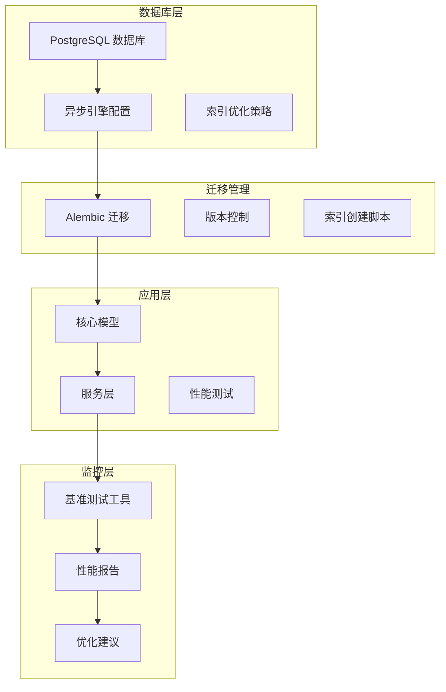
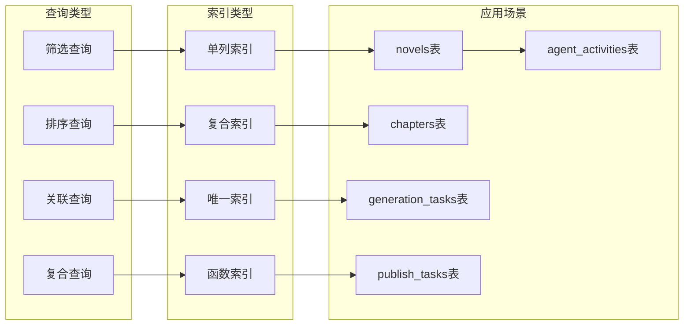
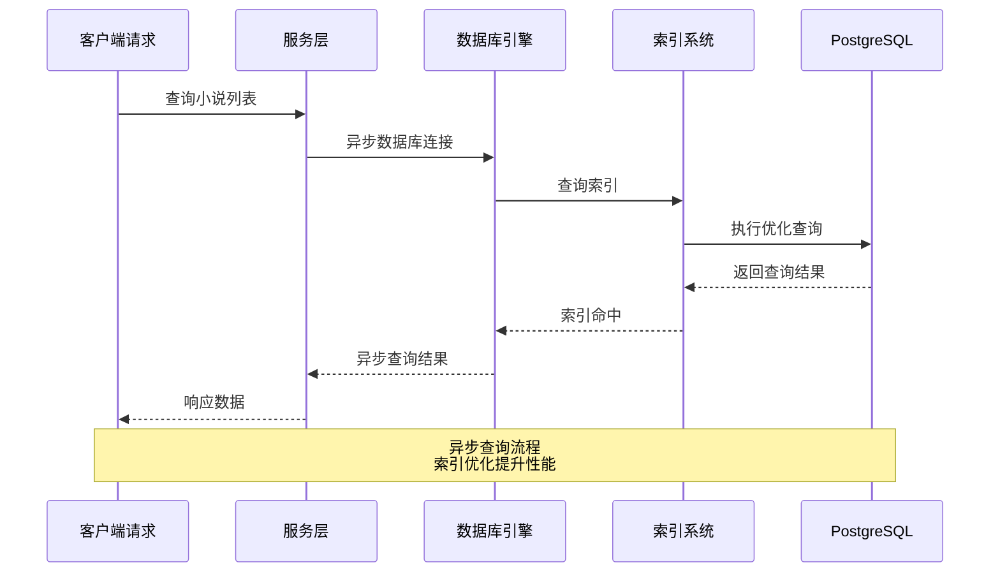
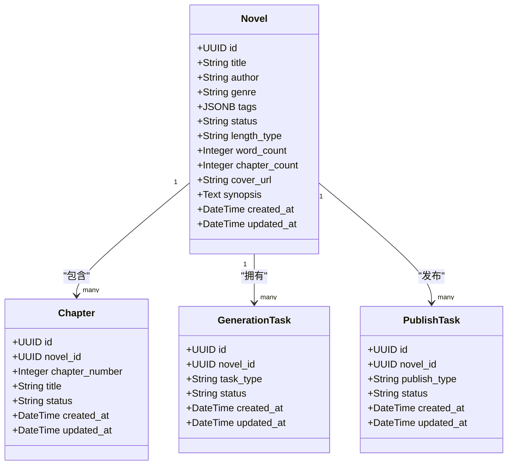
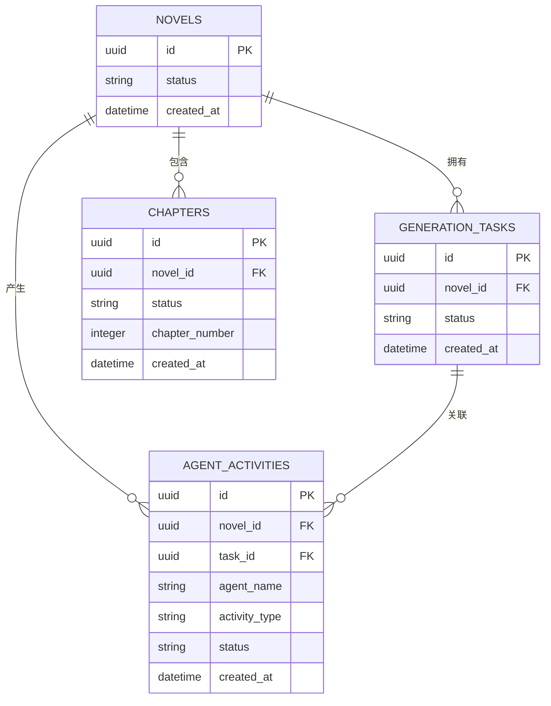
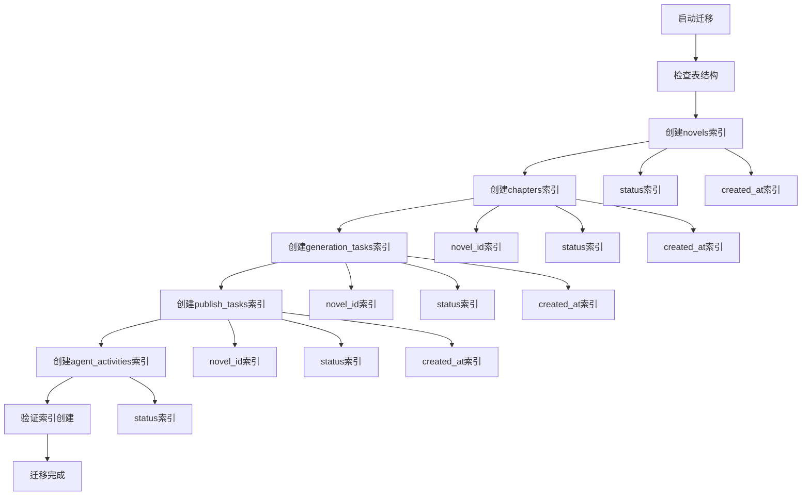
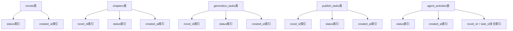

# 数据库性能索引优化

<cite>
**本文档引用的文件**
- [3c70dad7710e_add_performance_indexes.py](file://alembic/versions/3c70dad7710e_add_performance_indexes.py)
- [90162718523f_initial_schema_from_models.py](file://alembic/versions/90162718523f_initial_schema_from_models.py)
- [database.py](file://core/database.py)
- [benchmark_indexes.py](file://tests/benchmark_indexes.py)
- [add_memory_query_indexes.py](file://migrations/add_memory_query_indexes.py)
- [novel.py](file://core/models/novel.py)
- [chapter.py](file://core/models/chapter.py)
- [generation_task.py](file://core/models/generation_task.py)
- [publish_task.py](file://core/models/publish_task.py)
- [agent_activity.py](file://core/models/agent_activity.py)
- [novel_query_service.py](file://backend/services/novel_query_service.py)
- [config.py](file://backend/config.py)
</cite>

## 目录
1. [简介](#简介)
2. [项目结构](#项目结构)
3. [核心组件](#核心组件)
4. [架构概览](#架构概览)
5. [详细组件分析](#详细组件分析)
6. [依赖关系分析](#依赖关系分析)
7. [性能考量](#性能考量)
8. [故障排除指南](#故障排除指南)
9. [结论](#结论)

## 简介

本项目专注于小说创作系统的数据库性能索引优化，通过系统性的索引策略提升查询性能，优化用户体验。项目采用异步数据库连接、Alembic迁移管理和性能基准测试相结合的方式，确保数据库操作的高效性和可靠性。

## 项目结构

小说创作系统采用分层架构设计，数据库性能优化涉及多个层面：



**图表来源**
- [database.py:13-25](file://core/database.py#L13-L25)
- [3c70dad7710e_add_performance_indexes.py:21-122](file://alembic/versions/3c70dad7710e_add_performance_indexes.py#L21-L122)

**章节来源**
- [database.py:1-38](file://core/database.py#L1-L38)
- [config.py:137-144](file://backend/config.py#L137-L144)

## 核心组件

### 数据库引擎配置

系统采用异步数据库连接，配置了连接池参数以优化性能：

- **连接池大小**: 10个基础连接，20个溢出连接
- **SSL配置**: 禁用SSL连接
- **调试模式**: 基于APP_DEBUG环境变量控制SQL语句输出

### 索引优化策略

针对高频查询场景，系统实施了多层次的索引优化策略：



**图表来源**
- [3c70dad7710e_add_performance_indexes.py:25-90](file://alembic/versions/3c70dad7710e_add_performance_indexes.py#L25-L90)

**章节来源**
- [3c70dad7710e_add_performance_indexes.py:21-122](file://alembic/versions/3c70dad7710e_add_performance_indexes.py#L21-L122)

## 架构概览

系统采用异步数据库架构，通过多层索引优化确保高性能查询：



**图表来源**
- [database.py:28-37](file://core/database.py#L28-L37)
- [novel_query_service.py:28-47](file://backend/services/novel_query_service.py#L28-L47)

## 详细组件分析

### 核心数据模型

#### 小说模型 (Novel)

小说模型定义了完整的数据库表结构，包含状态、创建时间等关键字段：



**图表来源**
- [novel.py:39-105](file://core/models/novel.py#L39-L105)
- [chapter.py:22-79](file://core/models/chapter.py#L22-L79)
- [generation_task.py:34-60](file://core/models/generation_task.py#L34-L60)
- [publish_task.py:32-65](file://core/models/publish_task.py#L32-L65)

#### Agent活动模型

Agent活动模型包含了丰富的索引配置，支持复杂的查询场景：



**图表来源**
- [agent_activity.py:22-131](file://core/models/agent_activity.py#L22-L131)

**章节来源**
- [novel.py:1-105](file://core/models/novel.py#L1-L105)
- [chapter.py:1-79](file://core/models/chapter.py#L1-L79)
- [generation_task.py:1-60](file://core/models/generation_task.py#L1-L60)
- [publish_task.py:1-65](file://core/models/publish_task.py#L1-L65)
- [agent_activity.py:1-186](file://core/models/agent_activity.py#L1-L186)

### 索引优化实现

#### Alembic迁移脚本

系统通过Alembic迁移脚本实现索引的自动化部署：



**图表来源**
- [3c70dad7710e_add_performance_indexes.py:21-122](file://alembic/versions/3c70dad7710e_add_performance_indexes.py#L21-L122)

#### 内存查询索引

针对内存系统查询的复合索引优化：

| 表名 | 复合索引 | 查询场景 | 性能提升 |
|------|----------|----------|----------|
| chapter_summaries | novel_id + chapter_number | 章节摘要查询 | 30-50% |
| character_states | novel_id + character_name | 角色状态查询 | 30-50% |
| memory_chunks | novel_id + chapter_number | 记忆块查询 | 30-50% |
| reflection_entries | novel_id + chapter_number | 反思记录查询 | 30-50% |
| foreshadowing | novel_id + status + planted_chapter | 伏笔查询 | 30-50% |
| chapter_patterns | novel_id + status + pattern_type | 章节模式查询 | 30-50% |
| writing_lessons | novel_id + lesson_type + status + priority | 经验规则查询 | 30-50% |

**章节来源**
- [add_memory_query_indexes.py:38-87](file://migrations/add_memory_query_indexes.py#L38-L87)

### 性能基准测试

系统提供了全面的性能测试框架：

```mermaid
graph TB
subgraph "测试场景"
A[状态筛选查询]
B[创建时间排序]
C[novel_id关联查询]
D[复合查询]
E[状态分组统计]
end
subgraph "性能指标"
F[平均耗时(ms)]
G[最小耗时(ms)]
H[最大耗时(ms)]
I[查询成功率]
end
subgraph "优化标准"
J[优秀 < 50ms]
K[良好 < 100ms]
L[需优化 > 100ms]
end
A --> F
B --> G
C --> H
D --> I
E --> F
F --> J
G --> K
H --> L
```

**图表来源**
- [benchmark_indexes.py:99-184](file://tests/benchmark_indexes.py#L99-L184)

**章节来源**
- [benchmark_indexes.py:1-237](file://tests/benchmark_indexes.py#L1-L237)

## 依赖关系分析

### 数据库连接依赖

系统数据库连接采用异步模式，确保高并发场景下的性能表现：


**图表来源**
- [config.py:137-144](file://backend/config.py#L137-L144)
- [database.py:13-25](file://core/database.py#L13-L25)

### 索引依赖关系

不同表之间的索引依赖关系确保查询的高效性：



**图表来源**
- [3c70dad7710e_add_performance_indexes.py:25-90](file://alembic/versions/3c70dad7710e_add_performance_indexes.py#L25-L90)

**章节来源**
- [config.py:1-417](file://backend/config.py#L1-L417)
- [database.py:1-38](file://core/database.py#L1-L38)

## 性能考量

### 查询优化策略

系统针对不同类型的查询实施了专门的优化策略：

1. **筛选查询优化**: 为status字段创建索引，支持快速状态过滤
2. **排序查询优化**: 为created_at字段创建索引，支持时间排序
3. **关联查询优化**: 为外键字段创建索引，提升关联查询性能
4. **复合查询优化**: 为常用查询组合创建复合索引

### 连接池配置

系统采用合理的连接池配置以平衡性能和资源使用：

- **基础连接数**: 10个，满足基本并发需求
- **溢出连接数**: 20个，处理峰值并发
- **SSL配置**: 禁用SSL，减少连接开销
- **调试模式**: 基于环境变量控制SQL输出

### 内存数据库优化

针对SQLite内存数据库的特殊优化：

- **WAL模式**: 启用写-ahead日志模式提升并发性能
- **复合索引**: 针对高频查询场景创建复合索引
- **自动迁移**: 提供索引创建和回滚功能

**章节来源**
- [database.py:13-25](file://core/database.py#L13-L25)
- [add_memory_query_indexes.py:34-36](file://migrations/add_memory_query_indexes.py#L34-L36)

## 故障排除指南

### 常见问题诊断

1. **索引未生效**
   - 检查索引是否正确创建
   - 验证查询条件是否匹配索引列
   - 使用EXPLAIN ANALYZE分析查询计划

2. **连接池耗尽**
   - 检查连接池配置参数
   - 监控活跃连接数量
   - 优化查询执行时间

3. **性能回归**
   - 运行基准测试脚本
   - 对比索引前后性能差异
   - 分析慢查询日志

### 优化建议

1. **定期性能评估**
   - 每月运行基准测试
   - 监控查询响应时间
   - 识别新的性能瓶颈

2. **索引维护**
   - 定期重建碎片化的索引
   - 删除未使用的索引
   - 优化复合索引顺序

3. **监控告警**
   - 设置查询超时告警
   - 监控索引使用率
   - 跟踪连接池利用率

**章节来源**
- [benchmark_indexes.py:187-211](file://tests/benchmark_indexes.py#L187-L211)

## 结论

小说创作系统的数据库性能索引优化项目通过系统性的索引策略、完善的迁移管理和全面的性能测试，显著提升了数据库查询性能。主要成果包括：

1. **索引优化**: 为核心表的关键字段创建了针对性索引，支持高效的筛选、排序和关联查询
2. **异步架构**: 采用异步数据库连接，提升并发处理能力
3. **自动化迁移**: 通过Alembic实现索引的自动化部署和回滚
4. **性能监控**: 提供完整的基准测试框架，持续监控系统性能
5. **内存优化**: 针对SQLite内存数据库实施专门的索引优化策略

这些优化措施确保了系统在高并发场景下的稳定性和高性能，为用户提供流畅的小说创作体验。建议持续监控系统性能，定期评估和优化索引策略，以适应不断增长的数据量和用户需求。