# 数据库设计

<cite>
**本文引用的文件**
- [core/database.py](file://core/database.py)
- [backend/config.py](file://backend/config.py)
- [docker-compose.yml](file://docker-compose.yml)
- [docker-compose.dev.yml](file://docker-compose.dev.yml)
- [docker-compose.prod.yml](file://docker-compose.prod.yml)
- [.env](file://.env)
- [.env.example](file://.env.example)
- [alembic/env.py](file://alembic/env.py)
- [alembic.ini](file://alembic.ini)
- [alembic/versions/5badc20e064a_initial_tables.py](file://alembic/versions/5badc20e064a_initial_tables.py)
- [alembic/versions/186700edca0b_fix_complete_database_tables.py](file://alembic/versions/186700edca0b_fix_complete_database_tables.py)
- [alembic/versions/fc4ecf252bbb_add_crawler_and_publishing_system.py](file://alembic/versions/fc4ecf252bbb_add_crawler_and_publishing_system.py)
- [alembic/versions/b5dd1dd83814_add_ai_chat_session_models.py](file://alembic/versions/b5dd1dd83814_add_ai_chat_session_models.py)
- [alembic/versions/5c24a4e1ec52_add_novel_id_and_title_to_chat_session.py](file://alembic/versions/5c24a4e1ec52_add_novel_id_and_title_to_chat_session.py)
- [alembic/versions/575f1ce44645_add_length_type_column_to_novels.py](file://alembic/versions/575f1ce44645_add_length_type_column_to_novels.py)
- [alembic/versions/002_add_novel_creation_flow_table.py](file://alembic/versions/002_add_novel_creation_flow_table.py)
- [alembic/versions/2a4218cba9df_add_detailed_outline_to_chapters.py](file://alembic/versions/2a4218cba9df_add_detailed_outline_to_chapters.py)
- [alembic/versions/add_outline_enhancements_to_chapters.py](file://alembic/versions/add_outline_enhancements_to_chapters.py)
- [alembic/versions/650321fc7ff3_add_missing_columns_to_characters_and_.py](file://alembic/versions/650321fc7ff3_add_missing_columns_to_characters_and_.py)
- [alembic/versions/c6cfc7b3ef20_add_raw_content_column_to_world_settings.py](file://alembic/versions/c6cfc7b3ef20_add_raw_content_column_to_world_settings.py)
- [alembic/versions/40555b81bb5d_add_batch_writing_task_type.py](file://alembic/versions/40555b81bb5d_add_batch_writing_task_type.py)
- [alembic/versions/4b47062db094_add_douyin_crawl_types.py](file://alembic/versions/4b47062db094_add_douyin_crawl_types.py)
- [alembic/versions_archived/fb6eed83562e_add_outline_dynamic_update_fields.py](file://alembic/versions_archived/fb6eed83562e_add_outline_dynamic_update_fields.py)
- [alembic/versions_archived/c5d6e7f8a9b0_fix_all_remaining_model_db_mismatches.py](file://alembic/versions_archived/c5d6e7f8a9b0_fix_all_remaining_model_db_mismatches.py)
- [migrations/add_chapter_config_and_main_plot_detailed.py](file://migrations/add_chapter_config_and_main_plot_detailed.py)
- [core/models/__init__.py](file://core/models/__init__.py)
- [core/models/novel.py](file://core/models/novel.py)
- [core/models/character.py](file://core/models/character.py)
- [core/models/character_name_version.py](file://core/models/character_name_version.py)
- [core/models/chapter.py](file://core/models/chapter.py)
- [core/models/chapter_publish.py](file://core/models/chapter_publish.py)
- [core/models/generation_task.py](file://core/models/generation_task.py)
- [core/models/publish_task.py](file://core/models/publish_task.py)
- [core/models/world_setting.py](file://core/models/world_setting.py)
- [core/models/ai_chat_session.py](file://core/models/ai_chat_session.py)
- [core/models/novel_creation_flow.py](file://core/models/novel_creation_flow.py)
- [core/models/plot_outline.py](file://core/models/plot_outline.py)
- [core/models/agent_activity.py](file://core/models/agent_activity.py)
- [core/graph/neo4j_client.py](file://core/graph/neo4j_client.py)
- [core/graph/graph_models.py](file://core/graph/graph_models.py)
- [core/graph/relationship_mapper.py](file://core/graph/relationship_mapper.py)
- [core/graph/graph_exceptions.py](file://core/graph/graph_exceptions.py)
- [backend/api/v1/graph.py](file://backend/api/v1/graph.py)
- [backend/services/graph_sync_service.py](file://backend/services/graph_sync_service.py)
- [backend/services/entity_extractor_service.py](file://backend/services/entity_extractor_service.py)
- [backend/services/graph_query_service.py](file://backend/services/graph_query_service.py)
- [agents/outline_dynamic_updater.py](file://agents/outline_dynamic_updater.py)
- [agents/outline_refiner.py](file://agents/outline_refiner.py)
- [backend/services/outline_service.py](file://backend/services/outline_service.py)
- [backend/services/generation_service.py](file://backend/services/generation_service.py)
- [backend/services/agent_activity_recorder.py](file://backend/services/agent_activity_recorder.py)
- [backend/api/v1/outlines.py](file://backend/api/v1/outlines.py)
- [backend/api/v1/characters.py](file://backend/api/v1/characters.py)
- [backend/schemas/outline.py](file://backend/schemas/outline.py)
- [backend/routes/agent_activities.py](file://backend/routes/agent_activities.py)
- [frontend/src/pages/NovelDetail/PlotOutlineTab.tsx](file://frontend/src/pages/NovelDetail/PlotOutlineTab.tsx)
- [frontend/src/pages/NovelDetail/OutlineRefinementTab.tsx](file://frontend/src/pages/NovelDetail/OutlineRefinementTab.tsx)
- [frontend/src/pages/NovelDetail/RelationshipGraph.tsx](file://frontend/src/pages/NovelDetail/RelationshipGraph.tsx)
- [frontend/src/pages/SystemMonitoring.tsx](file://frontend/src/pages/SystemMonitoring.tsx)
- [backend/services/ai_chat_service.py](file://backend/services/ai_chat_service.py)
</cite>

## 更新摘要
**变更内容**
- 新增完整的图数据库子系统，包括Neo4j客户端、图数据模型、关系映射器和异常处理
- 新增图数据库配置和Docker编排支持
- 新增图数据同步服务和查询服务
- 新增图数据库API端点和前端可视化组件
- 新增实体抽取与图数据同步集成
- 新增图数据库异常处理和健康检查机制

## 目录
1. [简介](#简介)
2. [项目结构](#项目结构)
3. [核心组件](#核心组件)
4. [架构总览](#架构总览)
5. [详细组件分析](#详细组件分析)
6. [依赖分析](#依赖分析)
7. [性能考量](#性能考量)
8. [故障排查指南](#故障排查指南)
9. [结论](#结论)
10. [附录](#附录)

## 简介
本文件面向数据库工程师与后端开发者，系统化梳理小说生成系统的数据库设计与实现，覆盖 SQLAlchemy 异步 ORM 配置、连接池与事务策略、实体关系建模、外键与索引设计、Alembic 迁移体系、核心数据模型关系、**新增的图数据库子系统**、性能优化与安全策略。内容以仓库现有代码为依据，避免臆造信息，并通过图示帮助不同背景读者理解。

## 项目结构
数据库相关的关键位置如下：
- ORM 引擎与会话工厂：core/database.py
- 应用配置（含数据库连接串）：backend/config.py
- Docker Compose 配置：docker-compose.yml、docker-compose.dev.yml、docker-compose.prod.yml
- 环境变量配置：.env、.env.example
- Alembic 环境与迁移入口：alembic/env.py、alembic.ini
- 模型定义与导出：core/models/*
- **新增** 图数据库子系统：core/graph/*
- **新增** 图数据库API端点：backend/api/v1/graph.py
- **新增** 图数据同步服务：backend/services/graph_sync_service.py
- 迁移脚本：alembic/versions/*、migrations/*

```mermaid
graph TB
subgraph "应用层"
API["FastAPI 应用"]
Services["业务服务层"]
OutlineService["大纲服务"]
GenerationService["生成服务"]
AIChatService["AI聊天服务"]
AgentActivityRecorder["Agent活动记录器"]
CharacterNameVersionService["角色名称版本服务"]
OutlineRefiner["大纲完善器"]
OutlineDynamicUpdater["大纲动态更新器"]
GraphSyncService["图数据同步服务"]
EntityExtractorService["实体抽取服务"]
GraphQueryService["图查询服务"]
end
subgraph "数据库层"
Engine["异步引擎<br/>asyncpg"]
Session["会话工厂<br/>AsyncSession"]
Metadata["ORM 元数据"]
PlotOutlines["剧情大纲表<br/>含详细主线剧情<br/>动态更新字段"]
ChapterPublishes["章节发布表<br/>多平台状态管理"]
AgentActivities["Agent活动表<br/>详细执行追踪"]
CharacterNameVersions["角色名称版本表<br/>变更历史管理"]
AIChatSessions["AI聊天会话表"]
AIChatMessages["AI聊天消息表"]
NovelCreationFlows["小说创建流程表"]
CharacterNameVersions["角色名称版本表"]
Chapters["章节表<br/>含详细大纲"]
Characters["角色表<br/>含角色类型"]
Novels["小说表<br/>含章节配置"]
Neo4jClient["Neo4j客户端<br/>图数据库连接"]
GraphModels["图数据模型<br/>节点和关系定义"]
RelationshipMapper["关系映射器<br/>PG到Neo4j映射"]
GraphExceptions["图异常处理<br/>错误类型定义"]
end
subgraph "配置层"
Config["配置中心<br/>Settings类"]
EnvVars["环境变量<br/>DATABASE_URL/DATABASE_URL_SYNC<br/>NEO4J_*配置"]
Compose["Docker Compose<br/>DB和Neo4j环境变量"]
end
subgraph "迁移与版本"
Env["Alembic 环境"]
Versions["迁移版本脚本"]
CustomMigrations["自定义迁移脚本"]
EndVersion["5c24a4e1ec52<br/>添加novel_id和title"]
EndVersion2["b5dd1dd83814<br/>创建AI聊天表"]
EndVersion3["575f1ce44645<br/>添加长度类型"]
NewVersion1["002<br/>新增小说创建流程表"]
NewVersion2["2a4218cba9df<br/>章节详细大纲"]
NewVersion3["add_outline_enhancements<br/>大纲任务增强"]
NewVersion4["650321fc7ff3<br/>角色信息增强"]
NewVersion5["fb6eed83562e<br/>动态大纲更新字段"]
NewVersion6["c5d6e7f8a9b0<br/>新增Agent活动表"]
NewVersion7["自定义迁移脚本<br/>章节配置和详细主线剧情"]
NewVersion8["章节发布表<br/>多平台发布管理"]
OutlineDynamicUpdater["大纲动态更新器<br/>智能更新功能"]
GraphSyncService["图数据同步服务<br/>PG到Neo4j同步"]
GraphQueryService["图查询服务<br/>关系网络查询"]
EntityExtractorService["实体抽取服务<br/>章节实体识别"]
end
Config --> Engine
EnvVars --> Config
Compose --> Config
API --> Services
Services --> OutlineService
Services --> GenerationService
Services --> AIChatService
Services --> AgentActivityRecorder
Services --> CharacterNameVersionService
Services --> GraphSyncService
Services --> EntityExtractorService
Services --> GraphQueryService
OutlineService --> OutlineDynamicUpdater
OutlineService --> OutlineRefiner
OutlineService --> PlotOutlines
GenerationService --> OutlineDynamicUpdater
GenerationService --> PlotOutlines
AIChatService --> Session
Session --> Engine
Engine --> Metadata
Metadata --> PlotOutlines
Metadata --> ChapterPublishes
Metadata --> AgentActivities
Metadata --> CharacterNameVersions
Metadata --> AIChatSessions
Metadata --> AIChatMessages
Metadata --> NovelCreationFlows
Metadata --> CharacterNameVersions
Metadata --> Chapters
Metadata --> Characters
Metadata --> Novels
Env --> Metadata
Env --> Versions
Env --> CustomMigrations
Env --> EndVersion
Env --> EndVersion2
Env --> EndVersion3
Env --> NewVersion1
Env --> NewVersion2
Env --> NewVersion3
Env --> NewVersion4
Env --> NewVersion5
Env --> NewVersion6
Env --> NewVersion7
Env --> NewVersion8
Env --> OutlineDynamicUpdater
Env --> GraphSyncService
Env --> GraphQueryService
Env --> EntityExtractorService
```

**图表来源**
- [core/database.py:11-17](file://core/database.py#L11-L17)
- [backend/config.py:18-26](file://backend/config.py#L18-L26)
- [docker-compose.yml:37-45](file://docker-compose.yml#L37-L45)
- [docker-compose.dev.yml:36-59](file://docker-compose.dev.yml#L36-L59)
- [docker-compose.prod.yml:34-58](file://docker-compose.prod.yml#L34-L58)
- [.env:7-8](file://.env#L7-L8)
- [alembic/env.py:12-25](file://alembic/env.py#L12-L25)
- [alembic/versions/5c24a4e1ec52_add_novel_id_and_title_to_chat_session.py:21-43](file://alembic/versions/5c24a4e1ec52_add_novel_id_and_title_to_chat_session.py#L21-L43)
- [alembic/versions/b5dd1dd83814_add_ai_chat_session_models.py:21-46](file://alembic/versions/b5dd1dd83814_add_ai_chat_session_models.py#L21-L46)
- [alembic/versions/002_add_novel_creation_flow_table.py:19-55](file://alembic/versions/002_add_novel_creation_flow_table.py#L19-L55)
- [alembic/versions/2a4218cba9df_add_detailed_outline_to_chapters.py:22-27](file://alembic/versions/2a4218cba9df_add_detailed_outline_to_chapters.py#L22-L27)
- [alembic/versions/add_outline_enhancements_to_chapters.py:22-35](file://alembic/versions/add_outline_enhancements_to_chapters.py#L22-L35)
- [alembic/versions_archived/fb6eed83562e_add_outline_dynamic_update_fields.py:21-42](file://alembic/versions_archived/fb6eed83562e_add_outline_dynamic_update_fields.py#L21-L42)
- [alembic/versions_archived/c5d6e7f8a9b0_fix_all_remaining_model_db_mismatches.py:95-147](file://alembic/versions_archived/c5d6e7f8a9b0_fix_all_remaining_model_db_mismatches.py#L95-L147)
- [migrations/add_chapter_config_and_main_plot_detailed.py:24-55](file://migrations/add_chapter_config_and_main_plot_detailed.py#L24-L55)
- [agents/outline_refiner.py:610-648](file://agents/outline_refiner.py#L610-L648)
- [core/graph/neo4j_client.py:1-550](file://core/graph/neo4j_client.py#L1-L550)
- [core/graph/graph_models.py:1-463](file://core/graph/graph_models.py#L1-L463)
- [core/graph/relationship_mapper.py:1-226](file://core/graph/relationship_mapper.py#L1-L226)
- [core/graph/graph_exceptions.py:1-130](file://core/graph/graph_exceptions.py#L1-L130)
- [backend/api/v1/graph.py:1-581](file://backend/api/v1/graph.py#L1-L581)
- [backend/services/graph_sync_service.py:1-596](file://backend/services/graph_sync_service.py#L1-L596)

**章节来源**
- [core/database.py:1-36](file://core/database.py#L1-L36)
- [backend/config.py:1-59](file://backend/config.py#L1-L59)
- [docker-compose.yml:1-86](file://docker-compose.yml#L1-L86)
- [.env:1-22](file://.env#L1-L22)
- [.env.example:1-21](file://.env.example#L1-L21)
- [alembic/env.py:1-66](file://alembic/env.py#L1-L66)
- [alembic.ini:1-150](file://alembic.ini#L1-L150)

## 核心组件
- 异步引擎与会话工厂
  - 使用异步驱动与连接池参数，提供高并发下的稳定连接管理。
  - 通过依赖注入提供生命周期可控的 AsyncSession。
  - **更新** 移除URL查询参数并添加SSL连接禁用配置。
- **新增** Neo4j图数据库客户端
  - 提供异步的Neo4j数据库连接管理和查询执行能力。
  - 支持连接池、事务管理和健康检查。
  - 实现白名单验证防止Cypher注入攻击。
  - 支持节点创建、关系建立、查询和删除操作。
- **新增** 图数据模型定义
  - 定义图数据库中的节点和关系的Python模型。
  - 支持角色、地点、事件、势力、伏笔等节点类型。
  - 提供与Neo4j之间的属性转换。
- **新增** 关系映射器
  - 处理PostgreSQL中存储的关系类型与Neo4j图关系的映射。
  - 支持对称和非对称关系的识别。
  - 提供关系类型的分类和验证。
- **新增** 图数据库配置与部署**
  - 支持独立的图数据库配置项（ENABLE_GRAPH_DATABASE、NEO4J_*）。
  - Docker Compose提供Neo4j服务配置和健康检查。
  - 支持开发和生产环境的不同配置。
- 配置中心
  - 提供 DATABASE_URL（异步）与 DATABASE_URL_SYNC（同步），用于运行时构建连接串。
  - **更新** 使用独立的DB_HOST、DB_PORT、DB_USER、DB_PASSWORD、DB_NAME环境变量重构配置。
  - **新增** 图数据库功能开关和连接参数配置。
- Docker Compose 配置
  - **更新** 重构数据库连接参数为独立环境变量，支持容器间通信。
  - **新增** Neo4j图数据库服务配置，支持APOC插件和内存配置。
- Alembic 环境
  - 导入所有模型，注册到 Base.metadata，确保迁移扫描到全部表结构。
  - 在线/离线模式分别配置连接与事务边界。
- 模型导出
  - 统一导出核心实体，便于上层模块按需引入。

**章节来源**
- [core/database.py:11-17](file://core/database.py#L11-L17)
- [core/graph/neo4j_client.py:81-550](file://core/graph/neo4j_client.py#L81-L550)
- [core/graph/graph_models.py:14-463](file://core/graph/graph_models.py#L14-L463)
- [core/graph/relationship_mapper.py:12-226](file://core/graph/relationship_mapper.py#L12-L226)
- [backend/config.py:307-338](file://backend/config.py#L307-L338)
- [docker-compose.dev.yml:36-59](file://docker-compose.dev.yml#L36-L59)
- [docker-compose.prod.yml:34-58](file://docker-compose.prod.yml#L34-L58)
- [alembic/env.py:12-25](file://alembic/env.py#L12-L25)
- [core/models/__init__.py:1-42](file://core/models/__init__.py#L1-L42)

## 架构总览
系统采用"异步 ORM + Alembic 迁移 + Neo4j 图数据库"的混合架构。应用通过 FastAPI 注入 AsyncSession 访问关系型数据库；通过Neo4j客户端访问图数据库；Alembic 在开发与生产环境统一管理表结构演进。**更新** 配置层重构为独立环境变量，支持更灵活的部署场景。**新增** 图数据库子系统提供复杂关系查询和实体分析能力。

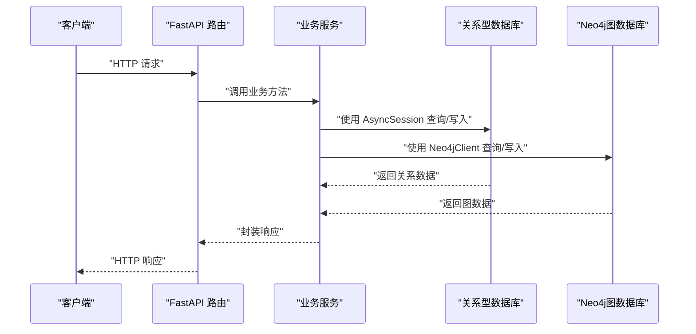

**图表来源**
- [core/database.py:26-36](file://core/database.py#L26-L36)
- [backend/config.py:18-26](file://backend/config.py#L18-L26)
- [core/graph/neo4j_client.py:207-258](file://core/graph/neo4j_client.py#L207-L258)

## 详细组件分析

### SQLAlchemy 异步 ORM 配置
- 引擎创建
  - 使用异步驱动，开启调试日志开关，设置连接池大小与溢出数量，满足高并发场景。
  - **更新** 移除URL查询参数，直接使用基础连接URL。
  - **更新** 添加 `connect_args={"ssl": False}` 配置，禁用SSL连接。
- 会话工厂
  - AsyncSession 类型，关闭提交后过期，避免脏读；通过上下文管理器确保异常回滚与连接关闭。
- 依赖注入
  - 提供 get_db 作为 FastAPI 依赖，自动完成 commit/rollback/close 生命周期管理。

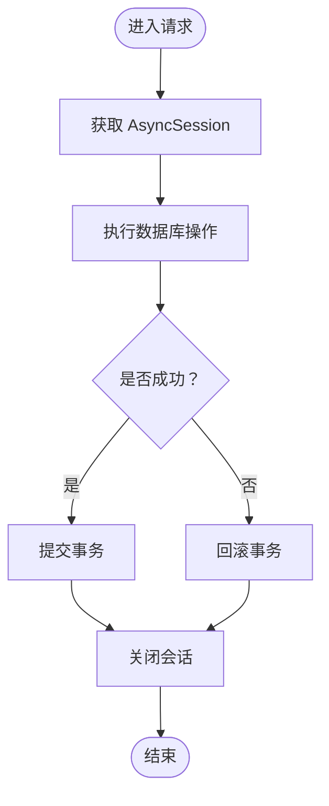

**图表来源**
- [core/database.py:26-36](file://core/database.py#L26-L36)

**章节来源**
- [core/database.py:11-17](file://core/database.py#L11-L17)

### Neo4j图数据库客户端
**新增** 完整的Neo4j图数据库客户端实现

- 客户端架构
  - 基于Neo4j Python驱动，使用线程池在异步上下文中执行同步查询。
  - 支持连接池管理、事务控制和健康检查。
  - 实现白名单验证防止Cypher注入攻击。
- 核心功能
  - 连接管理：支持连接建立、关闭和状态检查。
  - 查询执行：支持同步Cypher查询执行。
  - 事务处理：支持多操作原子执行。
  - 节点操作：支持节点创建、更新、删除和查找。
  - 关系操作：支持关系创建、更新和删除。
  - 数据隔离：支持按小说ID进行数据隔离。
- 安全机制
  - 节点标签白名单：仅允许预定义的节点标签（Character、Location、Event、Faction、Foreshadowing、Item）。
  - 关系类型白名单：仅允许预定义的关系类型（CHARACTER_RELATION、LOCATED_AT、PARTICIPATED_IN、MEMBER_OF、FORESHADOWING_LINKED、RELATED_TO）。
  - 参数化查询：所有查询都使用参数绑定，防止注入攻击。
- 异步支持
  - 使用asyncio.get_event_loop().run_in_executor()在线程池中执行同步Neo4j操作。
  - 提供异步接口包装同步方法。
- 错误处理
  - 定义专用的图数据库异常类型：GraphConnectionError、GraphQueryError、GraphSyncError等。
  - 提供详细的错误信息和上下文。

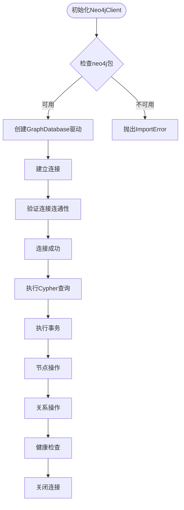

**图表来源**
- [core/graph/neo4j_client.py:133-172](file://core/graph/neo4j_client.py#L133-L172)
- [core/graph/neo4j_client.py:181-206](file://core/graph/neo4j_client.py#L181-L206)
- [core/graph/neo4j_client.py:226-258](file://core/graph/neo4j_client.py#L226-L258)
- [core/graph/neo4j_client.py:260-376](file://core/graph/neo4j_client.py#L260-L376)
- [core/graph/neo4j_client.py:448-474](file://core/graph/neo4j_client.py#L448-L474)

**章节来源**
- [core/graph/neo4j_client.py:81-550](file://core/graph/neo4j_client.py#L81-L550)

### 图数据模型定义
**新增** 完整的图数据模型实现

- 节点类型定义
  - NodeType枚举：Character、Location、Event、Faction、Item、Foreshadowing。
  - RelationType枚举：支持角色间关系、角色-地点关系、角色-事件关系、角色-势力关系、角色-物品关系、事件关系、势力关系、地点关系等。
- 节点模型
  - GraphNode抽象基类：定义通用属性（id、novel_id、name、created_at、updated_at）和方法。
  - CharacterNode：角色节点，包含角色类型、性别、年龄、状态、首次出场章节、重要性等级、核心动机等属性。
  - LocationNode：地点节点，包含地点类型、描述、父级地点、重要性、首次出现章节等属性。
  - EventNode：事件节点，包含事件类型、章节号、故事时间、描述、重要性、后果、参与者等属性。
  - FactionNode：势力节点，包含势力类型、描述、权力等级、领袖名称、领地、目标、首次出现章节等属性。
  - ForeshadowingNode：伏笔节点，包含内容、埋设章节、预期解决章节、类型、重要性、状态、解决章节、关联角色等属性。
- 关系模型
  - GraphEdge：图关系边，包含源节点ID、目标节点ID、关系类型、属性和创建时间。
  - 提供关系属性转换为Cypher格式的方法。
- 属性转换
  - to_neo4j_properties：将Python对象转换为Neo4j属性字典。
  - from_neo4j：从Neo4j属性创建Python对象实例。
  - to_cypher_properties：将关系属性转换为Cypher格式字符串。

```mermaid
erDiagram
NODES {
CharacterNode {
String id
String novel_id
String name
String role_type
String gender
Integer age
String status
Integer first_appearance_chapter
Integer importance_level
String core_motivation
String personal_code
Array personality_traits
}
LocationNode {
String id
String novel_id
String name
String location_type
String description
String parent_location
Integer significance
Integer first_appearance_chapter
}
EventNode {
String id
String novel_id
String name
String event_type
Integer chapter_number
Integer story_day
String description
Integer importance
Array consequences
Array participants
}
FactionNode {
String id
String novel_id
String name
String faction_type
String description
String power_level
String leader_name
String territory
String goals
Integer first_appearance_chapter
}
ForeshadowingNode {
String id
String novel_id
String name
String content
Integer planted_chapter
Integer expected_resolve_chapter
String ftype
Integer importance
String status
Integer resolved_chapter
Array related_characters
}
}
RELATIONS {
GraphEdge {
String from_node_id
String to_node_id
RelationType relation_type
JSON properties
DateTime created_at
}
}
```

**图表来源**
- [core/graph/graph_models.py:14-67](file://core/graph/graph_models.py#L14-L67)
- [core/graph/graph_models.py:101-162](file://core/graph/graph_models.py#L101-L162)
- [core/graph/graph_models.py:166-215](file://core/graph/graph_models.py#L166-L215)
- [core/graph/graph_models.py:219-274](file://core/graph/graph_models.py#L219-L274)
- [core/graph/graph_models.py:278-333](file://core/graph/graph_models.py#L278-L333)
- [core/graph/graph_models.py:337-395](file://core/graph/graph_models.py#L337-L395)
- [core/graph/graph_models.py:399-463](file://core/graph/graph_models.py#L399-L463)

**章节来源**
- [core/graph/graph_models.py:14-463](file://core/graph/graph_models.py#L14-L463)

### 关系映射器
**新增** 完整的关系类型映射实现

- 映射器功能
  - 关系子类型映射：支持情感关系（lover、spouse、crush、ex_lover）、家庭关系（parent、child、sibling、grandparent、grandchild）、社会关系（friend、best_friend、enemy、rival、master、apprentice、colleague、classmate）、组织关系（leader、subordinate、member、ally）等。
  - 反向关系处理：支持对称和非对称关系的反向映射。
  - 关系分类：将关系类型分为情感、家庭、社会、组织、其他类别。
- 核心方法
  - get_reverse_relation：获取关系的反向类型。
  - is_symmetric_relation：判断关系是否为对称关系。
  - get_relation_label：获取关系的中文标签。
  - relationships_to_edges：将角色关系字典转换为图边列表。
  - edges_to_relationships_dict：将图边列表转换为关系字典格式。
  - validate_relation_type：验证关系类型是否有效。
  - get_all_relation_types：获取所有有效的关系类型。
  - categorize_relation：对关系类型进行分类。
- 集成应用
  - 与GraphSyncService集成，将PostgreSQL中的角色关系同步到Neo4j。
  - 支持关系强度、建立章节等属性的转换。

**章节来源**
- [core/graph/relationship_mapper.py:12-226](file://core/graph/relationship_mapper.py#L12-L226)

### 图数据库配置与部署
**新增** 完整的图数据库配置和部署支持

- 配置项
  - ENABLE_GRAPH_DATABASE：图数据库总开关，默认False。
  - ENABLE_GRAPH_SYNC_ON_CHAPTER：章节生成后自动同步到图数据库，默认True。
  - NEO4J_URI：Neo4j连接URI，默认空字符串。
  - NEO4J_USER：Neo4j用户名，默认"neo4j"。
  - NEO4J_PASSWORD：Neo4j密码，必须通过环境变量设置。
  - NEO4J_DATABASE：Neo4j数据库名称，默认"neo4j"。
  - NEO4J_MAX_CONNECTION_POOL_SIZE：最大连接池大小，默认50。
  - NEO4J_CONNECTION_TIMEOUT：连接超时时间（秒），默认30。
  - NEO4J_EFFECTIVE_URI：自动检测Neo4j URI，根据Docker环境动态调整。
- Docker Compose配置
  - 开发环境：neo4j_dev服务，端口映射7688:7687，7475:7474。
  - 生产环境：neo4j服务，端口映射7687:7687，7474:7474。
  - 支持APOC插件和内存配置。
  - 健康检查：使用cypher-shell验证Neo4j可用性。
- 环境变量
  - DOCKER_ENV：Docker环境标识，支持dev和true/1两种模式。
  - NEO4J_PASSWORD：Neo4j密码，生产环境必需。

**章节来源**
- [backend/config.py:307-338](file://backend/config.py#L307-L338)
- [docker-compose.dev.yml:36-59](file://docker-compose.dev.yml#L36-L59)
- [docker-compose.prod.yml:34-58](file://docker-compose.prod.yml#L34-L58)

### 图数据同步服务
**新增** 完整的图数据同步实现

- 同步类型
  - 全量同步：同步小说的所有实体和关系。
  - 章节同步：同步新章节中出现的新实体。
  - 角色关系同步：同步单个角色的关系。
  - 伏笔同步：同步伏笔节点。
- 核心功能
  - 角色同步：创建角色节点，同步角色关系。
  - 世界观同步：同步地点和势力节点。
  - 大纲事件同步：同步章节事件节点。
  - 实体抽取：从章节内容中抽取新实体并同步。
  - 关系映射：将PostgreSQL关系映射到Neo4j关系。
- 结果追踪
  - SyncResult数据类：记录同步结果（创建/更新的实体数量、创建/更新的关系数量、错误信息等）。
  - 完整的同步统计和错误处理。
- 异步执行
  - 支持后台任务执行，不阻塞主线程。
  - 提供便捷函数sync_novel_to_graph进行全量同步。

**章节来源**
- [backend/services/graph_sync_service.py:30-596](file://backend/services/graph_sync_service.py#L30-L596)

### 图查询服务
**新增** 完整的图查询实现

- 查询功能
  - 角色网络查询：获取指定角色的关系网络。
  - 最短路径查询：查找两个角色间的最短关系路径。
  - 关系列表查询：获取小说中所有角色关系。
  - 一致性冲突检测：检测死亡角色出现、矛盾关系等问题。
  - 角色影响力分析：分析角色在网络中的影响力。
  - 事件时间线：获取事件按章节排序的时间线。
  - 伏笔回收查询：获取待回收的伏笔。
- 服务架构
  - GraphQueryService：封装所有图查询操作。
  - 支持深度查询（1-5层）。
  - 提供提示格式化输出。
- 错误处理
  - 详细的异常处理和错误报告。
  - 支持查询结果为空的情况。

**章节来源**
- [backend/services/graph_query_service.py](file://backend/services/graph_query_service.py)

### 图数据库API端点
**新增** 完整的图数据库API实现

- 健康检查
  - GET /novels/{novel_id}/graph/health：检查图数据库健康状态。
  - GET /novels/{novel_id}/graph/init：初始化图数据库连接。
- 数据同步
  - POST /novels/{novel_id}/graph/sync：同步小说数据到图数据库。
  - GET /novels/{novel_id}/graph/sync/status：获取同步状态。
  - DELETE /novels/{novel_id}/graph/sync：清除小说的图数据库数据。
- 图查询
  - GET /novels/{novel_id}/graph/network/{character_name}：获取角色关系网络。
  - GET /novels/{novel_id}/graph/path：查找角色间最短路径。
  - GET /novels/{novel_id}/graph/relationships：获取所有角色关系。
  - GET /novels/{novel_id}/graph/conflicts：检测一致性冲突。
  - GET /novels/{novel_id}/graph/influence/{character_name}：获取角色影响力分析。
  - GET /novels/{novel_id}/graph/timeline：获取事件时间线。
  - GET /novels/{novel_id}/graph/foreshadowings/pending：获取待回收伏笔。
- 实体抽取
  - POST /novels/{novel_id}/graph/extract：从章节内容中抽取实体。
  - POST /novels/{novel_id}/graph/extract/batch：批量抽取实体。
- 错误处理
  - 图数据库功能未启用时的错误处理。
  - 连接失败时的错误处理。
  - 查询结果为空时的错误处理。

**章节来源**
- [backend/api/v1/graph.py:1-581](file://backend/api/v1/graph.py#L1-L581)

### 图异常处理
**新增** 完整的图数据库异常处理

- 异常类型
  - GraphError：图数据库操作的基础异常类。
  - GraphConnectionError：图数据库连接异常。
  - GraphQueryError：图数据库查询异常。
  - GraphSyncError：图数据同步异常。
  - NodeNotFoundError：节点未找到异常。
  - RelationshipError：关系操作异常。
- 错误信息
  - 提供详细的错误消息和上下文信息。
  - 包含查询语句、节点信息、关系信息等。
- 日志记录
  - 详细的日志记录，便于调试和监控。
  - 区分警告和错误级别。

**章节来源**
- [core/graph/graph_exceptions.py:1-130](file://core/graph/graph_exceptions.py#L1-L130)

### 配置中心重构
**更新** 配置中心重构为独立环境变量配置

- 独立数据库配置属性
  - DB_HOST、DB_PORT、DB_USER、DB_PASSWORD、DB_NAME 独立配置，支持灵活的部署场景。
  - DATABASE_URL 和 DATABASE_URL_SYNC 动态构建，基于独立配置属性。
  - **新增** NEO4J_* 独立配置属性，支持图数据库配置。
- 环境变量支持
  - .env 和 .env.example 文件提供默认配置模板。
  - Docker Compose 使用独立环境变量，支持容器间通信。
  - **新增** 支持DOCKER_ENV环境变量，自动切换Neo4j URI。
- 端口配置差异
  - .env 使用 5434 端口（本地开发）
  - docker-compose.yml 使用 5432 端口（容器内部）
  - **新增** Neo4j端口：开发环境7688，生产环境7687

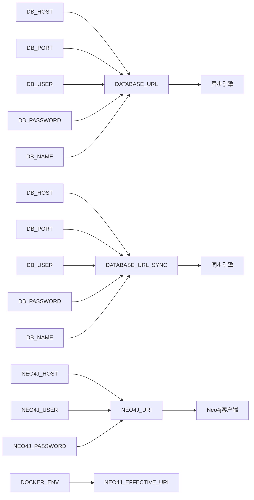

**图表来源**
- [backend/config.py:18-26](file://backend/config.py#L18-L26)
- [.env:7-8](file://.env#L7-L8)
- [docker-compose.yml:38-42](file://docker-compose.yml#L38-L42)
- [backend/config.py:323-332](file://backend/config.py#L323-L332)

**章节来源**
- [backend/config.py:11-26](file://backend/config.py#L11-L26)
- [.env:6-8](file://.env#L6-L8)
- [.env.example:6-7](file://.env.example#L6-L7)
- [docker-compose.yml:37-45](file://docker-compose.yml#L37-L45)

### Docker Compose 配置重构
**更新** Docker Compose 重构为独立环境变量配置

- 独立数据库环境变量
  - DB_HOST=postgres：指向 PostgreSQL 容器
  - DB_PORT=5432：容器内部端口
  - DB_USER、DB_PASSWORD、DB_NAME：数据库认证信息
  - **新增** NEO4J_* 环境变量：Neo4j数据库配置
- 网络配置
  - backend 服务依赖 postgres 和 redis 服务健康检查
  - **新增** neo4j 服务健康检查，使用cypher-shell验证
  - 容器间通过服务名通信
- 端口映射
  - PostgreSQL 映射到 5434:5432（本地开发）
  - Backend 映射到 8000:8000
  - Redis 映射到 6379:6379
  - **新增** Neo4j Bolt协议映射：7688:7687（开发），7687:7687（生产）
  - **新增** Neo4j HTTP浏览器映射：7475:7474（开发），7474:7474（生产）

**章节来源**
- [docker-compose.yml:1-86](file://docker-compose.yml#L1-L86)
- [docker-compose.dev.yml:1-59](file://docker-compose.dev.yml#L1-L59)
- [docker-compose.prod.yml:1-58](file://docker-compose.prod.yml#L1-L58)

### Alembic 迁移系统
- 版本控制机制
  - 通过版本目录中的脚本记录每次结构变更，支持升级与降级。
- 迁移脚本编写
  - 在 env.py 中导入模型并注册元数据，确保迁移扫描到所有表。
  - 同步 URL 来源于 DATABASE_URL_SYNC，保证迁移工具可连接数据库。
- 数据库演进管理
  - 初始版本包含主要实体；后续版本逐步引入爬虫、发布系统相关表与索引。
- **新增** 迁移版本增强
  - 002：新增小说创建流程表，支持完整的创作工作流跟踪
  - 2a4218cba9df：为章节表添加详细大纲字段，支持细化的章节规划
  - add_outline_enhancements：增强章节大纲管理，添加任务和验证功能
  - 650321fc7ff3：角色信息增强，添加角色类型、成长弧线等字段
  - c6cfc7b3ef20：世界设定添加原始内容字段，支持Agent输出保存
  - **新增** fb6eed83562e：为剧情大纲表添加动态更新字段，支持大纲版本管理和历史追踪
  - **新增** c5d6e7f8a9b0：新增Agent活动表和角色名称版本表，完善系统监控与追踪能力
  - **新增** 自定义迁移脚本：add_chapter_config_and_main_plot_detailed.py，添加章节配置和主线剧情详细字段
  - **新增** 章节发布表：完善多平台发布状态管理

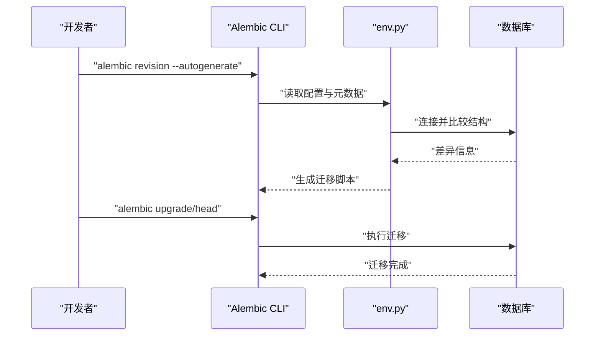

**图表来源**
- [alembic/env.py:12-25](file://alembic/env.py#L12-L25)
- [alembic/versions/5badc20e064a_initial_tables.py:21-166](file://alembic/versions/5badc20e064a_initial_tables.py#L21-L166)
- [alembic/versions/186700edca0b_fix_complete_database_tables.py:21-247](file://alembic/versions/186700edca0b_fix_complete_database_tables.py#L21-L247)
- [alembic/versions/fc4ecf252bbb_add_crawler_and_publishing_system.py:21-172](file://alembic/versions/fc4ecf252bbb_add_crawler_and_publishing_system.py#L21-L172)
- [alembic/versions/002_add_novel_creation_flow_table.py:19-55](file://alembic/versions/002_add_novel_creation_flow_table.py#L19-L55)
- [alembic/versions/2a4218cba9df_add_detailed_outline_to_chapters.py:22-27](file://alembic/versions/2a4218cba9df_add_detailed_outline_to_chapters.py#L22-L27)
- [alembic/versions/add_outline_enhancements_to_chapters.py:22-35](file://alembic/versions/add_outline_enhancements_to_chapters.py#L22-L35)
- [alembic/versions_archived/fb6eed83562e_add_outline_dynamic_update_fields.py:21-42](file://alembic/versions_archived/fb6eed83562e_add_outline_dynamic_update_fields.py#L21-L42)
- [alembic/versions_archived/c5d6e7f8a9b0_fix_all_remaining_model_db_mismatches.py:27-181](file://alembic/versions_archived/c5d6e7f8a9b0_fix_all_remaining_model_db_mismatches.py#L27-L181)
- [migrations/add_chapter_config_and_main_plot_detailed.py:24-55](file://migrations/add_chapter_config_and_main_plot_detailed.py#L24-L55)

**章节来源**
- [alembic/env.py:1-66](file://alembic/env.py#L1-L66)
- [alembic.ini:1-150](file://alembic.ini#L1-L150)
- [alembic/versions/5badc20e064a_initial_tables.py:1-181](file://alembic/versions/5badc20e064a_initial_tables.py#L1-L181)
- [alembic/versions/186700edca0b_fix_complete_database_tables.py:1-267](file://alembic/versions/186700edca0b_fix_complete_database_tables.py#L1-L267)
- [alembic/versions/fc4ecf252bbb_add_crawler_and_publishing_system.py:1-172](file://alembic/versions/fc4ecf252bbb_add_crawler_and_publishing_system.py#L1-L172)
- [alembic/versions/002_add_novel_creation_flow_table.py:1-62](file://alembic/versions/002_add_novel_creation_flow_table.py#L1-L62)
- [alembic/versions/2a4218cba9df_add_detailed_outline_to_chapters.py:1-33](file://alembic/versions/2a4218cba9df_add_detailed_outline_to_chapters.py#L1-L33)
- [alembic/versions/add_outline_enhancements_to_chapters.py:1-43](file://alembic/versions/add_outline_enhancements_to_chapters.py#L1-L43)
- [alembic/versions_archived/fb6eed83562e_add_outline_dynamic_update_fields.py:1-50](file://alembic/versions_archived/fb6eed83562e_add_outline_dynamic_update_fields.py#L1-L50)
- [alembic/versions_archived/c5d6e7f8a9b0_fix_all_remaining_model_db_mismatches.py:1-182](file://alembic/versions_archived/c5d6e7f8a9b0_fix_all_remaining_model_db_mismatches.py#L1-L182)
- [migrations/add_chapter_config_and_main_plot_detailed.py:1-145](file://migrations/add_chapter_config_and_main_plot_detailed.py#L1-L145)

### 核心数据模型设计
- 实体关系映射
  - 小说（Novel）与世界设定（WorldSetting）、角色（Character）、大纲（PlotOutline）、章节（Chapter）、生成任务（GenerationTask）、发布任务（PublishTask）等存在一对一或一对多关系。
  - 外键约束采用级联删除，确保父实体删除时子实体一致性。
  - **新增** 小说创建流程（NovelCreationFlow）与AI聊天会话（AIChatSession）关联，支持创作流程跟踪。
  - **新增** 角色名称版本（CharacterNameVersion）与角色关联，支持角色名称变更追踪。
  - **新增** Agent活动（AgentActivity）与小说和生成任务关联，支持详细的Agent执行过程追踪。
  - **新增** 章节发布（ChapterPublish）与发布任务和章节关联，支持多平台发布状态管理。
  - **新增** 动态大纲更新字段：PlotOutline模型新增update_history和version字段，支持大纲版本管理和历史追踪。
  - **新增** 章节配置字段：Novel模型新增chapter_config字段，支持灵活的章节数设置。
  - **新增** 详细主线剧情字段：PlotOutline模型新增main_plot_detailed字段，支持增强版主线剧情描述。
  - **新增** 图数据库集成：通过GraphSyncService实现PostgreSQL与Neo4j的数据同步。
  - **新增** 实体抽取：通过EntityExtractorService从章节内容中抽取实体并同步到图数据库。
- 字段设计要点
  - 使用 UUID 作为主键，提升安全性与分布式友好性。
  - 使用 JSONB 存储结构化元数据，便于灵活扩展。
  - 使用数组存储章节出现的角色 ID，便于快速筛选。
  - **新增** 章节表包含详细大纲、大纲任务、验证结果等字段，支持精细化章节管理。
  - **新增** 动态更新字段：update_history存储JSONB格式的更新历史，version存储整数格式的版本号。
  - **新增** 章节配置字段：chapter_config存储JSONB格式的章节配置，默认包含总章节数、最小最大章节数、是否灵活等信息。
  - **新增** 详细主线剧情字段：main_plot_detailed存储增强版主线剧情描述，包含核心冲突、主角目标、反派阻碍、升级路径等详细信息。
  - **新增** Agent活动表：支持详细的Agent执行过程记录，包括输入输出、Token使用、成本、元数据等。
  - **新增** 角色名称版本表：记录角色名称变更历史，支持变更追踪和回溯。
  - **新增** 图数据库节点：支持Character、Location、Event、Faction、Foreshadowing等节点类型。
  - **新增** 图数据库关系：支持角色关系、地点关系、事件关系、势力关系、物品关系等。
- 关系与级联
  - 多个实体在 ORM 层声明 cascade="all, delete-orphan"，确保删除父实体时自动清理子实体。
  - 章节表通过注释标识用途，便于维护识别。

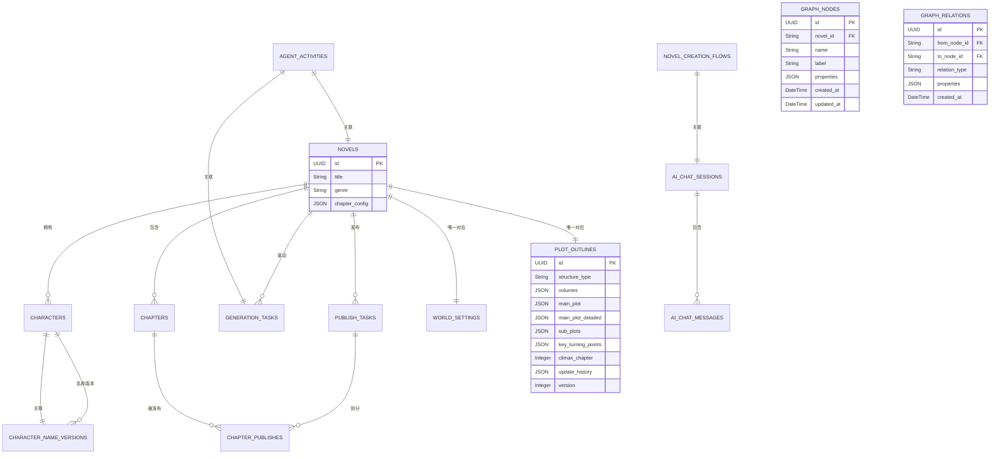

**图表来源**
- [core/models/novel.py:37-77](file://core/models/novel.py#L37-L77)
- [core/models/character.py:31-55](file://core/models/character.py#L31-L55)
- [core/models/chapter.py:18-49](file://core/models/chapter.py#L18-L49)
- [core/models/chapter_publish.py:21-39](file://core/models/chapter_publish.py#L21-L39)
- [core/models/generation_task.py:27-47](file://core/models/generation_task.py#L27-L47)
- [core/models/publish_task.py:29-51](file://core/models/publish_task.py#L29-L51)
- [core/models/world_setting.py:11-29](file://core/models/world_setting.py#L11-L29)
- [core/models/ai_chat_session.py:17-38](file://core/models/ai_chat_session.py#L17-L38)
- [core/models/novel_creation_flow.py:9-53](file://core/models/novel_creation_flow.py#L9-L53)
- [core/models/character_name_version.py:12-26](file://core/models/character_name_version.py#L12-L26)
- [core/models/plot_outline.py:95-118](file://core/models/plot_outline.py#L95-L118)
- [core/models/novel.py:55-64](file://core/models/novel.py#L55-L64)
- [core/models/agent_activity.py:24-133](file://core/models/agent_activity.py#L24-L133)
- [core/graph/graph_models.py:69-463](file://core/graph/graph_models.py#L69-L463)

**章节来源**
- [core/models/novel.py:1-77](file://core/models/novel.py#L1-L77)
- [core/models/character.py:1-55](file://core/models/character.py#L1-L55)
- [core/models/chapter.py:1-49](file://core/models/chapter.py#L1-L49)
- [core/models/chapter_publish.py:1-39](file://core/models/chapter_publish.py#L1-L39)
- [core/models/generation_task.py:1-47](file://core/models/generation_task.py#L1-L47)
- [core/models/publish_task.py:1-51](file://core/models/publish_task.py#L1-L51)
- [core/models/world_setting.py:1-29](file://core/models/world_setting.py#L1-L29)
- [core/models/novel_creation_flow.py:1-53](file://core/models/novel_creation_flow.py#L1-L53)
- [core/models/character_name_version.py:1-195](file://core/models/character_name_version.py#L1-L195)
- [core/models/plot_outline.py:1-134](file://core/models/plot_outline.py#L1-L134)
- [core/models/agent_activity.py:1-186](file://core/models/agent_activity.py#L1-L186)
- [core/graph/graph_models.py:1-463](file://core/graph/graph_models.py#L1-L463)

### Agent活动表增强
**新增** 完整的Agent活动追踪系统

- Agent活动表结构
  - novel_id：外键关联到小说表，支持按小说维度查询Agent活动
  - task_id：外键关联到生成任务表，支持按任务维度查询Agent活动
  - agent_name：Agent名称，支持按Agent维度查询
  - activity_type：活动类型，支持按活动类型维度查询
  - input_data/output_data：输入输出数据，支持结构化数据存储
  - metadata：元数据，支持审查评分、投票详情、查询处理等扩展信息
  - token使用统计：prompt_tokens、completion_tokens、total_tokens
  - 成本统计：cost字段，支持精确的成本计算
  - 状态管理：status、error_message、retry_count
- 索引优化
  - novel_id、task_id、agent_name、activity_type建立复合索引，支持高效查询
  - created_at建立索引，支持按时间排序查询
- API接口支持
  - 支持按任务、小说、Agent、活动类型等多种条件查询
  - 支持活动摘要统计和时间线查询
  - 支持详细的活动记录查询

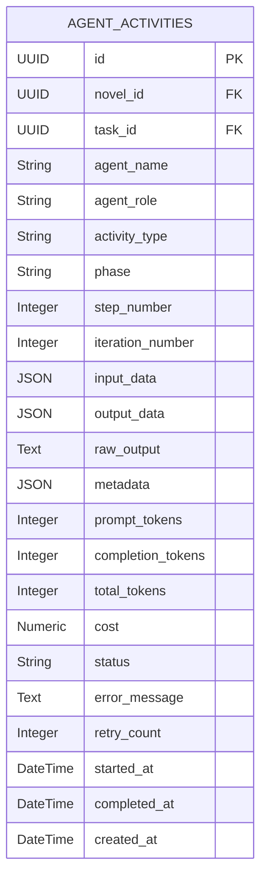

**图表来源**
- [core/models/agent_activity.py:24-133](file://core/models/agent_activity.py#L24-L133)
- [alembic/versions_archived/c5d6e7f8a9b0_fix_all_remaining_model_db_mismatches.py:96-131](file://alembic/versions_archived/c5d6e7f8a9b0_fix_all_remaining_model_db_mismatches.py#L96-L131)

**章节来源**
- [core/models/agent_activity.py:1-186](file://core/models/agent_activity.py#L1-L186)
- [alembic/versions_archived/c5d6e7f8a9b0_fix_all_remaining_model_db_mismatches.py:95-147](file://alembic/versions_archived/c5d6e7f8a9b0_fix_all_remaining_model_db_mismatches.py#L95-L147)

### 角色名称版本表
**新增** 角色名称变更追踪与管理

- 角色名称版本表结构
  - 名称版本记录：记录角色名称的历史变更，包括旧名称、新名称、变更时间、变更原因等。
  - 版本管理：支持创建版本记录、获取版本历史、获取指定时间点的版本、对比版本差异。
  - 回溯功能：支持回溯到指定版本，创建新的版本记录。
  - 验证功能：验证名称变更的合理性，检测重复变更和相似名称。
- 服务层功能
  - CharacterNameVersionService提供完整的版本管理API。
  - 支持异步操作，集成到数据库事务中。
- 关系设计
  - 与Character实体建立一对多关系，支持级联删除。
  - 通过relationship属性实现双向关联。

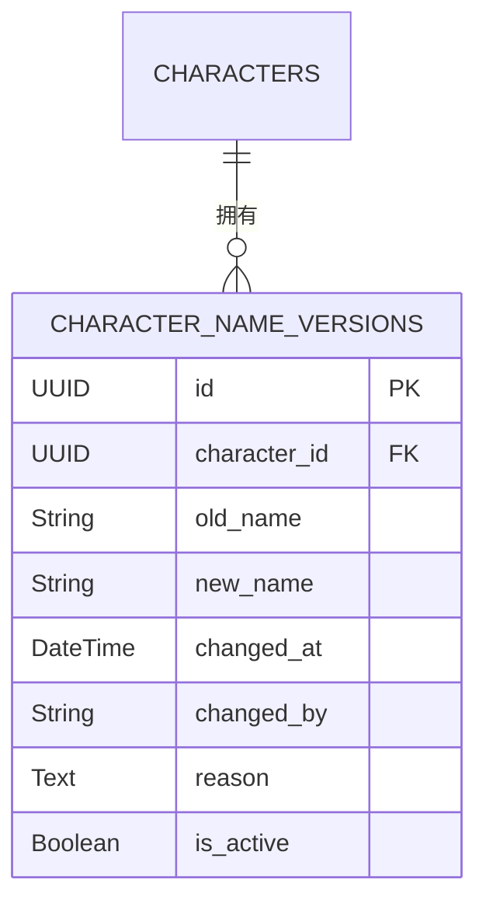

**图表来源**
- [core/models/character_name_version.py:12-26](file://core/models/character_name_version.py#L12-L26)
- [core/models/character.py:54-55](file://core/models/character.py#L54-L55)

**章节来源**
- [core/models/character_name_version.py:1-195](file://core/models/character_name_version.py#L1-L195)
- [core/models/character.py:1-55](file://core/models/character.py#L1-L55)

### 章节发布表增强
**新增** 完整的多平台发布管理系统

- 章节发布表结构
  - publish_task_id：外键关联到发布任务表，支持按发布任务管理章节发布
  - chapter_id：外键关联到章节表，支持按章节管理发布状态
  - chapter_number：章节编号，支持发布顺序管理
  - platform_chapter_id：平台返回的章节ID，支持多平台发布追踪
  - platform_url：平台链接，支持发布链接管理
  - status：发布状态，支持pending、publishing、published、failed状态管理
  - error_message：错误信息，支持发布异常追踪
  - published_at：发布时间，支持发布时间追踪
- 状态管理
  - 支持完整的发布状态流转：待发布→发布中→已发布/失败
  - 支持发布异常的错误信息记录
- 索引优化
  - publish_task_id建立索引，支持按发布任务查询章节发布状态

**章节来源**
- [core/models/chapter_publish.py:1-39](file://core/models/chapter_publish.py#L1-L39)
- [alembic/versions_archived/c5d6e7f8a9b0_fix_all_remaining_model_db_mismatches.py:75-85](file://alembic/versions_archived/c5d6e7f8a9b0_fix_all_remaining_model_db_mismatches.py#L75-L85)

### 动态大纲更新字段增强
**新增** 完整的大纲动态更新和版本管理机制

- 动态更新字段结构
  - update_history：JSONB字段，存储大纲更新历史记录，格式为数组，包含每次更新的详细信息。
  - version：整数字段，存储大纲版本号，每次动态更新自动+1。
- 字段设计细节
  - update_history默认值为[]，支持空数组存储。
  - version默认值为1，表示初始版本。
  - 字段注释说明了各自的作用和用途。
- 迁移版本演进
  - fb6eed83562e：首次添加update_history和version字段到plot_outlines表。
- 历史记录结构
  - version：更新后的版本号
  - updated_at：更新时间戳
  - trigger_chapter：触发更新的章节号
  - deviation_score：偏差分数（0-10）
  - change_summary：更新摘要
  - updated_fields：更新的字段列表
  - affected_chapters：受影响的章节范围

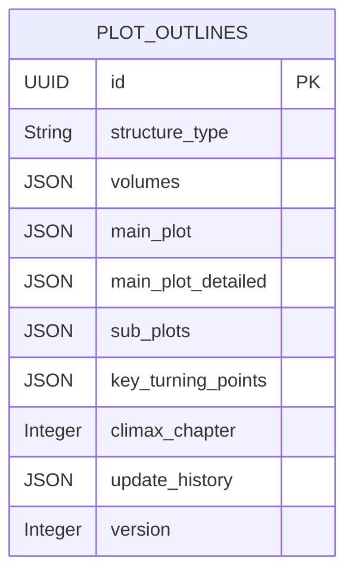

**图表来源**
- [core/models/plot_outline.py:104-118](file://core/models/plot_outline.py#L104-L118)
- [alembic/versions_archived/fb6eed83562e_add_outline_dynamic_update_fields.py:22-43](file://alembic/versions_archived/fb6eed83562e_add_outline_dynamic_update_fields.py#L22-L43)

**章节来源**
- [core/models/plot_outline.py:1-134](file://core/models/plot_outline.py#L1-L134)
- [alembic/versions_archived/fb6eed83562e_add_outline_dynamic_update_fields.py:1-50](file://alembic/versions_archived/fb6eed83562e_add_outline_dynamic_update_fields.py#L1-L50)

### 章节配置和详细主线剧情字段
**新增** 完整的章节配置和详细主线剧情支持机制

- 章节配置字段（chapter_config）
  - chapter_config：JSONB字段，存储章节配置信息，包含总章节数、最小最大章节数、是否灵活等。
  - 默认配置：total_chapters=6, min_chapters=3, max_chapters=12, flexible=True。
  - 支持灵活的章节结构设置，适应不同类型的创作需求。
- 详细主线剧情字段（main_plot_detailed）
  - main_plot_detailed：JSONB字段，存储增强版主线剧情描述。
  - 字段结构：包含核心冲突、主角目标、反派阻碍、升级路径、情感弧光、关键揭示、角色成长、结局描述等详细信息。
  - 支持300-500字的核心冲突详细描述，提供更丰富的剧情指导。
- 迁移版本演进
  - 自定义迁移脚本：add_chapter_config_and_main_plot_detailed.py，添加章节配置和主线剧情详细字段。
- 字段使用场景
  - 章节配置：支持根据小说类型和目标字数自动计算合适的章节数。
  - 详细主线：为AI生成和人工创作提供更详细的剧情指导。
  - 版本管理：与动态更新机制结合，支持版本化的主线剧情管理。

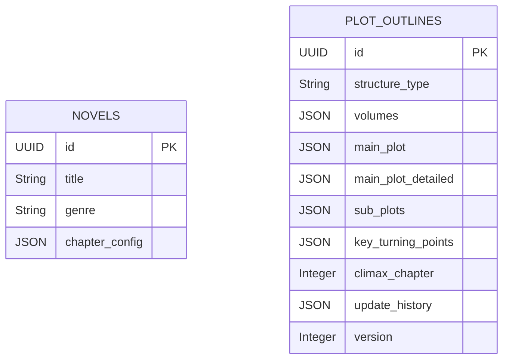

**图表来源**
- [core/models/novel.py:55-64](file://core/models/novel.py#L55-L64)
- [core/models/plot_outline.py:83-97](file://core/models/plot_outline.py#L83-L97)
- [migrations/add_chapter_config_and_main_plot_detailed.py:32-49](file://migrations/add_chapter_config_and_main_plot_detailed.py#L32-L49)

**章节来源**
- [core/models/novel.py:1-77](file://core/models/novel.py#L1-L77)
- [core/models/plot_outline.py:1-134](file://core/models/plot_outline.py#L1-L134)
- [migrations/add_chapter_config_and_main_plot_detailed.py:1-145](file://migrations/add_chapter_config_and_main_plot_detailed.py#L1-L145)

### 动态大纲更新机制
**新增** 基于章节写作进度的智能大纲更新系统

- 更新触发机制
  - 基于章节写作间隔的自动触发：当章节写作计数达到OUTLINE_UPDATE_INTERVAL时触发更新。
  - 周期性检查：通过_generation_service中的_try_dynamic_outline_update方法实现。
  - 非阻塞设计：更新过程不影响正常的章节写作流程。
- 更新执行流程
  - 加载最近N章的摘要信息，用于偏差评估。
  - 获取小说、大纲、世界观、角色等上下文信息。
  - 调用OutlineDynamicUpdater执行动态更新。
  - 自动更新版本号和历史记录。
- 更新历史记录
  - 记录每次更新的详细信息，包括版本号、时间、触发章节、偏差分数等。
  - 支持更新摘要和受影响章节范围的追踪。
- 服务集成
  - GenerationService集成动态更新功能，实现无缝的大纲维护。
  - 支持批量章节写作时的动态更新触发。

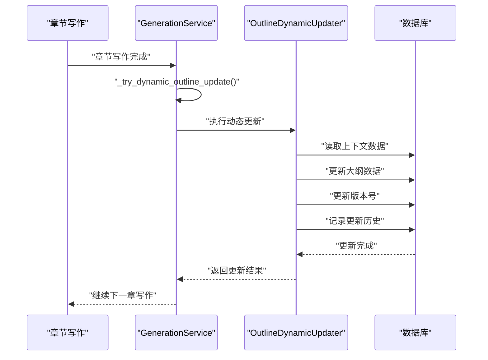

**图表来源**
- [backend/services/generation_service.py:1392-1425](file://backend/services/generation_service.py#L1392-L1425)
- [backend/services/generation_service.py:1226-1331](file://backend/services/generation_service.py#L1226-L1331)
- [agents/outline_dynamic_updater.py:430-470](file://agents/outline_dynamic_updater.py#L430-L470)

**章节来源**
- [backend/services/generation_service.py:1392-1425](file://backend/services/generation_service.py#L1392-L1425)
- [backend/services/generation_service.py:1226-1331](file://backend/services/generation_service.py#L1226-L1331)
- [agents/outline_dynamic_updater.py:430-470](file://agents/outline_dynamic_updater.py#L430-L470)

### OutlineDynamicUpdater 动态更新器
**新增** 专门负责大纲动态更新的核心组件

- 更新器功能
  - 偏差评估：基于最近章节内容评估大纲执行偏差。
  - 更新决策：根据偏差分数决定是否需要更新大纲。
  - 字段更新：智能更新大纲中的相关字段。
  - 版本管理：自动管理版本号和历史记录。
- 更新策略
  - 基于偏差分数的阈值判断。
  - 支持多种更新字段的组合更新。
  - 记录详细的更新摘要和影响范围。
- 错误处理
  - 异常捕获和日志记录。
  - 不影响正常章节写作流程。
  - 支持定期清理过期计数器。

**章节来源**
- [agents/outline_dynamic_updater.py:117-480](file://agents/outline_dynamic_updater.py#L117-L480)

### OutlineRefiner 智能完善器
**新增** 基于AI的大纲智能完善系统

- 完善功能
  - 主线剧情完善：基于AI分析完善核心冲突、主角目标、反派阻碍等主线要素。
  - 卷级结构优化：智能调整卷级大纲的结构和内容。
  - 质量评估：提供全面的大纲质量评估报告。
  - 版本对比：支持原始版本与增强版本的详细对比。
- 技术实现
  - 使用crew_manager进行多Agent协作完善。
  - 通过outline_refiner解析和验证AI生成的完善结果。
  - 支持预览模式和直接应用模式。
- 用户界面
  - 前端提供智能完善的可视化界面。
  - 支持质量对比和改进措施展示。
  - 提供一键应用完善结果的功能。

**章节来源**
- [agents/outline_refiner.py:610-648](file://agents/outline_refiner.py#L610-L648)
- [frontend/src/pages/NovelDetail/OutlineRefinementTab.tsx:42-418](file://frontend/src/pages/NovelDetail/OutlineRefinementTab.tsx#L42-L418)

### 小说创建流程表增强
**新增** 完整的小说创建流程跟踪机制

- 小说创建流程表结构
  - 与AI聊天会话关联：通过session_id外键关联，支持完整的创作对话跟踪。
  - 流程状态管理：包含场景类型（create/query/revise）、当前步骤、确认状态等。
  - 创建数据存储：支持题材、世界设定、概要、标题、标签、目标平台、字数类型等。
  - 查询与修改支持：支持查询目标、查询结果、修改目标、修改详情等。
  - 对话历史：存储最近10轮对话历史，便于流程回溯。
- 索引优化
  - 为session_id、novel_id、selected_novel_id建立索引，支持高效查询。
- 流程支持
  - 支持小说创建、查询、修改三种场景的完整流程跟踪。
  - 提供确认状态字段，支持创作流程的阶段性确认。

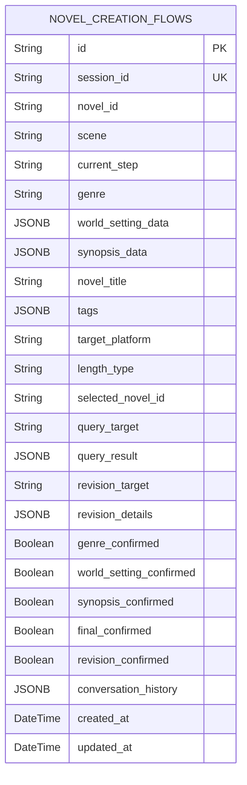

**图表来源**
- [core/models/novel_creation_flow.py:9-53](file://core/models/novel_creation_flow.py#L9-L53)
- [alembic/versions/002_add_novel_creation_flow_table.py:19-55](file://alembic/versions/002_add_novel_creation_flow_table.py#L19-L55)

**章节来源**
- [core/models/novel_creation_flow.py:1-53](file://core/models/novel_creation_flow.py#L1-L53)
- [alembic/versions/002_add_novel_creation_flow_table.py:1-62](file://alembic/versions/002_add_novel_creation_flow_table.py#L1-L62)

### 章节大纲增强
**新增** 细化的章节大纲管理能力

- 章节大纲字段增强
  - detailed_outline：细化后的详细章节大纲，支持复杂的章节规划。
  - outline_task：本章的大纲任务，记录具体的创作任务。
  - outline_validation：大纲验证结果，记录验证状态和结果。
  - outline_version：使用的大纲版本号，支持版本控制。
- 迁移版本演进
  - 2a4218cba9df：首次添加detailed_outline字段
  - add_outline_enhancements：后续添加outline_task、outline_validation、outline_version字段
- 功能支持
  - 支持精细化的章节大纲管理
  - 提供大纲任务分配和验证机制
  - 支持大纲版本控制和追踪

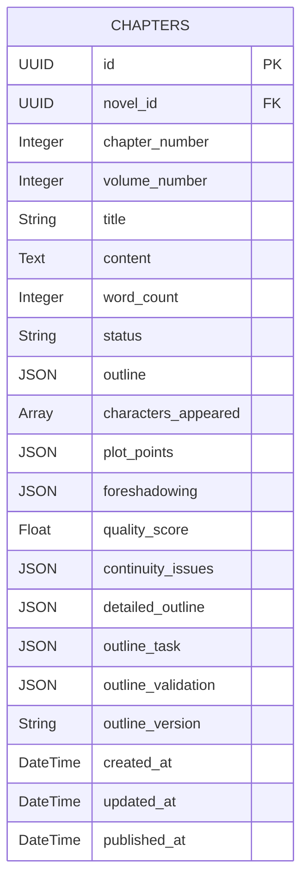

**图表来源**
- [core/models/chapter.py:18-49](file://core/models/chapter.py#L18-L49)
- [alembic/versions/2a4218cba9df_add_detailed_outline_to_chapters.py:22-27](file://alembic/versions/2a4218cba9df_add_detailed_outline_to_chapters.py#L22-L27)
- [alembic/versions/add_outline_enhancements_to_chapters.py:22-35](file://alembic/versions/add_outline_enhancements_to_chapters.py#L22-L35)

**章节来源**
- [core/models/chapter.py:1-49](file://core/models/chapter.py#L1-L49)
- [alembic/versions/2a4218cba9df_add_detailed_outline_to_chapters.py:1-33](file://alembic/versions/2a4218cba9df_add_detailed_outline_to_chapters.py#L1-L33)
- [alembic/versions/add_outline_enhancements_to_chapters.py:1-43](file://alembic/versions/add_outline_enhancements_to_chapters.py#L1-L43)

### 角色信息增强
**更新** 角色模型字段扩展

- 角色信息增强字段
  - role_type：角色类型（主角、配角、反派、路人），支持更精细的角色分类。
  - growth_arc：角色成长弧线，记录角色的发展轨迹。
  - first_appearance_chapter：首次出场章节，支持角色出场时间追踪。
  - avatar_url：角色头像URL，支持角色可视化展示。
- 字段替换
  - 移除了旧的role和character_arc字段，迁移到新的结构化字段。
- 枚举类型
  - RoleType枚举定义了标准的角色类型分类。

**章节来源**
- [core/models/character.py:1-55](file://core/models/character.py#L1-L55)
- [alembic/versions/650321fc7ff3_add_missing_columns_to_characters_and_.py:21-32](file://alembic/versions/650321fc7ff3_add_missing_columns_to_characters_and_.py#L21-L32)

### 世界设定原始内容
**新增** Agent输出内容保存

- 原始内容字段
  - raw_content：世界设定的原始Agent输出内容，支持内容追溯和审计。
- 字段作用
  - 保存Agent生成的原始文本，便于后续分析和修改。
  - 支持内容版本管理和变更追踪。

**章节来源**
- [core/models/world_setting.py:1-29](file://core/models/world_setting.py#L1-L29)
- [alembic/versions/c6cfc7b3ef20_add_raw_content_column_to_world_settings.py:1-29](file://alembic/versions/c6cfc7b3ef20_add_raw_content_column_to_world_settings.py#L1-L29)

### 批量写作任务类型
**新增** 扩展的任务类型支持

- 批量写作任务
  - 为TaskType枚举添加batch_writing值，支持批量内容生成任务。
- 枚举扩展
  - 通过ALTER TYPE语句安全地扩展枚举类型，无需重建表结构。

**章节来源**
- [alembic/versions/40555b81bb5d_add_batch_writing_task_type.py:1-32](file://alembic/versions/40555b81bb5d_add_batch_writing_task_type.py#L1-L32)

### 抖音爬虫类型
**新增** 新的爬虫平台支持

- 抖音爬虫类型
  - hot：抖音热门内容爬取
  - search：抖音搜索结果爬取  
  - creators：抖音创作者信息爬取
- 索引优化
  - 临时移除相关表的复合索引，为枚举类型扩展做准备。
- 平台扩展
  - 支持更多内容平台的数据采集需求。

**章节来源**
- [alembic/versions/4b47062db094_add_douyin_crawl_types.py:1-50](file://alembic/versions/4b47062db094_add_douyin_crawl_types.py#L1-L50)

### AI 聊天会话模型增强
**更新** 新增 `novel_id` 和 `title` 字段支持会话隔离和智能标题存储

- AI 聊天会话表结构
  - 新增 `novel_id` 字段：UUID 类型，支持按小说隔离会话，便于多小说场景下的会话管理。
  - 新增 `title` 字段：字符串类型，最大200字符，用于智能生成和显示会话标题。
  - 保留原有的 `session_id`、`scene`、`context` 等字段。
- 迁移版本演进
  - b5dd1dd83814：首次创建 AI 聊天会话和消息表
  - 5c24a4e1ec52：添加 `novel_id` 和 `title` 字段，并支持从旧的 `context` 字段迁移数据
- 会话隔离机制
  - 支持按 `novel_id` 过滤会话列表，实现多小说场景下的会话隔离。
  - 在创建会话时自动提取 `context` 中的 `novel_id` 信息。
- 智能标题生成
  - 当会话没有标题时，自动从对话内容生成标题。
  - 支持从用户消息中提取主题信息生成简洁的会话标题。

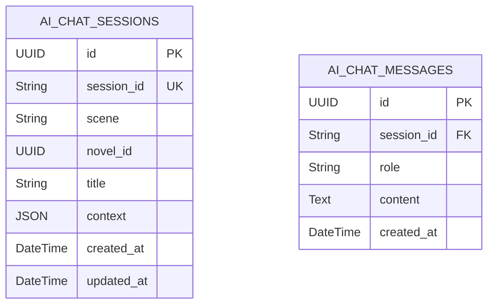

**图表来源**
- [core/models/ai_chat_session.py:17-38](file://core/models/ai_chat_session.py#L17-L38)
- [alembic/versions/b5dd1dd83814_add_ai_chat_session_models.py:24-45](file://alembic/versions/b5dd1dd83814_add_ai_chat_session_models.py#L24-L45)
- [alembic/versions/5c24a4e1ec52_add_novel_id_and_title_to_chat_session.py:22-27](file://alembic/versions/5c24a4e1ec52_add_novel_id_and_title_to_chat_session.py#L22-L27)

**章节来源**
- [core/models/ai_chat_session.py:1-38](file://core/models/ai_chat_session.py#L1-L38)
- [alembic/versions/b5dd1dd83814_add_ai_chat_session_models.py:1-59](file://alembic/versions/b5dd1dd83814_add_ai_chat_session_models.py#L1-L59)
- [alembic/versions/5c24a4e1ec52_add_novel_id_and_title_to_chat_session.py:1-44](file://alembic/versions/5c24a4e1ec52_add_novel_id_and_title_to_chat_session.py#L1-L44)

### 外键约束与索引策略
- 外键约束
  - 章节、角色、生成任务、发布任务等均对小说进行外键关联，并设置 CASCADE 删除，保证数据一致性。
  - AI 聊天消息表通过 `session_id` 外键关联到会话表，支持级联删除。
  - **新增** 小说创建流程表通过 `session_id` 外键关联到AI聊天会话表。
  - **新增** 角色名称版本表通过 `character_id` 外键关联到角色表。
  - **新增** Agent活动表通过 `novel_id` 和 `task_id` 外键关联到小说和生成任务表。
  - **新增** 章节发布表通过 `publish_task_id` 和 `chapter_id` 外键关联到发布任务和章节表。
  - **新增** 动态更新字段：plot_outlines表的novel_id外键关联到novels表。
  - **新增** 章节配置字段：novels表的chapter_config字段支持灵活的章节结构。
  - **新增** 图数据库节点：graph_nodes表的novel_id外键关联到novels表。
  - **新增** 图数据库关系：graph_relations表的from_node_id和to_node_id外键关联到graph_nodes表。
- 索引策略
  - 爬虫任务表：按平台与状态、创建时间建立复合/单列索引，加速任务调度与统计。
  - 爬取结果表：按任务 ID 建立索引，便于按任务聚合结果。
  - 平台账户表：按平台名称建立索引，便于按平台检索可用账户。
  - 发布任务表：按小说 ID 与状态建立索引，支撑发布队列与状态监控。
  - 章节发布表：按发布任务 ID 建立索引，便于批量查询任务下各章节发布状态。
  - **新增** AI 聊天会话表：按 `novel_id` 建立索引，支持按小说隔离查询。
  - **新增** 小说创建流程表：按 `session_id`、`novel_id`、`selected_novel_id` 建立索引。
  - **新增** 角色名称版本表：按 `character_id` 建立索引，支持角色名称历史查询。
  - **新增** Agent活动表：按 `novel_id`、`task_id`、`agent_name`、`activity_type` 建立复合索引，支持多维度查询。
  - **新增** Agent活动表：按 `created_at` 建立索引，支持时间排序查询。
  - **新增** 动态更新字段：plot_outlines表的novel_id字段建立索引，支持大纲查询。
  - **新增** 章节配置字段：novels表的chapter_config字段建立索引，支持章节配置查询。
  - **新增** 图数据库节点：按 `novel_id`、`label` 建立复合索引，支持按小说和标签查询。
  - **新增** 图数据库关系：按 `from_node_id`、`to_node_id`、`relation_type` 建立复合索引，支持关系查询。

**章节来源**
- [alembic/versions/186700edca0b_fix_complete_database_tables.py:41-98](file://alembic/versions/186700edca0b_fix_complete_database_tables.py#L41-L98)
- [alembic/versions/fc4ecf252bbb_add_crawler_and_publishing_system.py:41-117](file://alembic/versions/fc4ecf252bbb_add_crawler_and_publishing_system.py#L41-L117)
- [alembic/versions/5c24a4e1ec52_add_novel_id_and_title_to_chat_session.py:23-24](file://alembic/versions/5c24a4e1ec52_add_novel_id_and_title_to_chat_session.py#L23-L24)
- [alembic/versions/002_add_novel_creation_flow_table.py:52-54](file://alembic/versions/002_add_novel_creation_flow_table.py#L52-L54)
- [alembic/versions/650321fc7ff3_add_missing_columns_to_characters_and_.py:23-32](file://alembic/versions/650321fc7ff3_add_missing_columns_to_characters_and_.py#L23-L32)
- [alembic/versions_archived/c5d6e7f8a9b0_fix_all_remaining_model_db_mismatches.py:95-147](file://alembic/versions_archived/c5d6e7f8a9b0_fix_all_remaining_model_db_mismatches.py#L95-L147)
- [alembic/versions_archived/fb6eed83562e_add_outline_dynamic_update_fields.py:22-43](file://alembic/versions_archived/fb6eed83562e_add_outline_dynamic_update_fields.py#L22-L43)
- [migrations/add_chapter_config_and_main_plot_detailed.py:32-49](file://migrations/add_chapter_config_and_main_plot_detailed.py#L32-L49)

### 事务处理策略
- 会话生命周期
  - 通过依赖注入在请求范围内创建 AsyncSession，异常时自动回滚，最后关闭连接，确保资源释放。
- 事务边界
  - 单次请求内共享同一会话，避免跨请求状态污染；复杂流程建议显式提交/回滚以明确边界。
- **新增** 图数据库事务
  - Neo4jClient支持事务操作，确保多步操作的原子性。
  - GraphSyncService使用事务确保同步操作的一致性。

**章节来源**
- [core/database.py:26-36](file://core/database.py#L26-L36)
- [core/graph/neo4j_client.py:226-258](file://core/graph/neo4j_client.py#L226-L258)

## 依赖分析
- 模块耦合
  - 模型统一继承自 Base，通过 env.py 导入并在迁移中注册元数据，形成"模型 → 元数据 → 迁移"的单向依赖链。
  - **新增** 图数据库模块独立于关系型数据库模块，通过Neo4jClient进行连接管理。
  - **新增** GraphSyncService依赖Neo4jClient和EntityExtractorService。
  - **新增** GraphQueryService依赖Neo4jClient。
- 外部依赖
  - 异步驱动与 SQLAlchemy 2.x 异步特性配合，确保高并发下的 I/O 效率。
  - **新增** Neo4j Python驱动，支持图数据库操作。
  - **新增** APOC插件，提供图数据库增强功能。
- 运行时连接
  - 异步与同步 URL 分别用于应用与迁移工具，避免驱动不匹配问题。
  - **更新** 配置中心重构为独立环境变量，支持多种部署场景。
  - **新增** Neo4j连接通过get_neo4j_client()获取，支持延迟初始化。

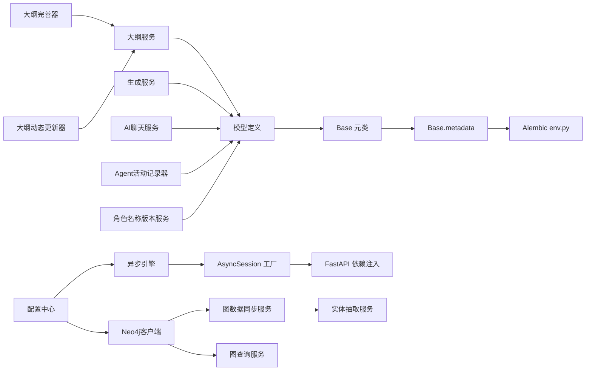

**图表来源**
- [core/models/__init__.py:1-42](file://core/models/__init__.py#L1-L42)
- [alembic/env.py:12-25](file://alembic/env.py#L12-L25)
- [backend/config.py:18-26](file://backend/config.py#L18-L26)
- [core/database.py:11-17](file://core/database.py#L11-L17)
- [core/graph/neo4j_client.py:497-550](file://core/graph/neo4j_client.py#L497-L550)
- [backend/services/ai_chat_service.py:192-200](file://backend/services/ai_chat_service.py#L192-L200)
- [.env:7-8](file://.env#L7-L8)
- [docker-compose.yml:37-45](file://docker-compose.yml#L37-L45)

**章节来源**
- [core/models/__init__.py:1-42](file://core/models/__init__.py#L1-L42)
- [alembic/env.py:1-66](file://alembic/env.py#L1-L66)
- [backend/config.py:1-59](file://backend/config.py#L1-L59)
- [core/database.py:1-36](file://core/database.py#L1-L36)
- [.env:1-22](file://.env#L1-L22)
- [docker-compose.yml:1-86](file://docker-compose.yml#L1-L86)

## 性能考量
- 查询优化
  - 对高频过滤字段（如小说 ID、状态、创建时间）建立索引，减少全表扫描。
  - 使用 JSONB 字段时，结合 GIN/排序索引优化查询与排序。
  - **新增** AI 聊天会话表的 `novel_id` 字段建立了索引，支持高效的按小说过滤查询。
  - **新增** 小说创建流程表的多字段索引，支持完整的创作流程查询。
  - **新增** 角色名称版本表的 `character_id` 索引，支持角色名称历史查询。
  - **新增** Agent活动表的多字段复合索引，支持按小说、任务、Agent、活动类型等多维度查询。
  - **新增** Agent活动表的 `created_at` 索引，支持按时间排序查询。
  - **新增** 章节发布表的 `publish_task_id` 索引，支持按发布任务查询章节发布状态。
  - **新增** 动态更新字段：plot_outlines表的novel_id字段索引，支持大纲查询优化。
  - **新增** 章节配置字段：novels表的chapter_config字段索引，支持章节配置查询。
  - **新增** 图数据库节点索引：按 `novel_id`、`label` 建立复合索引，支持高效查询。
  - **新增** 图数据库关系索引：按 `from_node_id`、`to_node_id`、`relation_type` 建立复合索引，支持关系查询。
- 缓存策略
  - 对热点数据（如小说概要、角色列表）结合应用层缓存（Redis）降低数据库压力。
  - **新增** 图查询结果缓存：对于频繁查询的关系网络和路径结果进行缓存。
- 并发控制
  - 合理设置连接池大小与溢出数量，避免峰值时连接争用。
  - 使用异步 I/O 与长连接复用，减少握手开销。
  - **更新** SSL 连接禁用可能影响某些网络环境下的连接性能。
  - **新增** Neo4j连接池：支持最大连接池大小配置，避免连接争用。
- 写入优化
  - 大批量写入时使用批量插入与事务合并，减少往返次数。
  - 控制 JSONB 字段大小，避免单行过大影响复制与备份。
  - **新增** 章节大纲字段的合理使用，避免过度复杂的JSON结构影响性能。
  - **新增** 动态更新字段的JSONB存储优化，支持高效的历史记录查询。
  - **新增** 详细主线剧情字段的JSONB存储优化，支持高效的剧情描述查询。
  - **新增** Agent活动表的JSONB字段优化，支持高效的结构化数据存储和查询。
  - **新增** 图数据库批量操作：使用事务批量创建节点和关系，提高同步效率。
- **新增** Neo4j性能优化
  - 使用白名单验证防止Cypher注入，同时避免不必要的查询开销。
  - 合理使用索引：为常用查询字段建立索引，避免全表扫描。
  - 事务批处理：将多个操作合并到单个事务中执行，提高性能。
  - 连接池管理：合理配置连接池大小，避免连接过多导致性能下降。

## 故障排查指南
- 连接失败
  - 检查 DATABASE_URL 与 DATABASE_URL_SYNC 是否正确，确认主机、端口、用户、密码与数据库名一致。
  - **更新** 检查 .env 和 docker-compose.yml 中的端口配置差异（5434 vs 5432）。
  - **新增** 检查NEO4J_*配置项，确认图数据库连接参数正确。
  - **新增** 验证Neo4j服务健康状态，检查7687和7474端口是否可用。
- 迁移失败
  - 确认 Alembic 环境已导入所有模型，且目标数据库具备相应权限。
  - 在线/离线模式分别检查连接参数与事务边界。
  - **新增** 检查新增迁移版本的兼容性，特别是枚举类型扩展和索引变更。
  - **新增** 检查c5d6e7f8a9b0迁移版本的Agent活动表和角色名称版本表创建是否成功。
  - **新增** 检查章节发布表的状态字段转换是否成功。
  - **新增** 检查fb6eed83562e迁移版本的字段添加是否成功。
  - **新增** 检查自定义迁移脚本add_chapter_config_and_main_plot_detailed.py的执行情况。
- 事务异常
  - 若请求中发生异常，确认 get_db 的回滚逻辑是否生效；必要时在服务层显式捕获并回滚。
  - **新增** 检查Neo4j事务执行是否成功，确认多步操作的原子性。
- 索引缺失
  - 对新增查询路径补充索引；评估索引对写入性能的影响并平衡。
  - **新增** 检查新增表的索引配置，特别是外键字段和查询频繁的字段。
  - **新增** 检查Agent活动表的复合索引配置。
  - **新增** 检查章节发布表的索引配置。
  - **新增** 检查动态更新字段的索引配置。
  - **新增** 检查章节配置字段的索引配置。
  - **新增** 检查图数据库节点和关系的索引配置。
- **新增** SSL 连接问题
  - 如果遇到 SSL 相关错误，检查 `connect_args={"ssl": False}` 配置是否符合网络环境要求。
- **新增** 环境变量配置
  - 确认 .env 文件中的 DATABASE_URL 和 DATABASE_URL_SYNC 配置正确。
  - 检查 docker-compose.yml 中的 DB_* 环境变量配置。
  - **新增** 确认NEO4J_*环境变量配置正确，特别是DOCKER_ENV设置。
- **新增** 新增功能故障排查
  - 检查小说创建流程表的外键约束是否正确。
  - 验证角色名称版本表的级联删除功能。
  - 确认章节大纲字段的默认值和索引配置。
  - **新增** 验证Agent活动表的外键约束和索引配置。
  - **新增** 验证角色名称版本表的外键约束和索引配置。
  - **新增** 验证章节发布表的状态字段转换。
  - **新增** 验证章节配置字段的迁移是否成功。
  - **新增** 验证详细主线剧情字段的迁移是否成功。
  - **新增** 验证动态更新字段的迁移是否成功。
  - **新增** 检查OutlineDynamicUpdater的更新机制是否正常工作。
  - **新增** 检查OutlineRefiner的智能完善功能是否正常工作。
  - **新增** 确认版本号的自动递增功能。
  - **新增** 验证Agent活动记录器的记录功能。
  - **新增** 检查Agent活动API接口的查询功能。
  - **新增** 验证动态大纲更新配置项的有效性。
  - **新增** 检查图数据库功能开关ENABLE_GRAPH_DATABASE配置。
  - **新增** 验证Neo4j客户端连接初始化功能。
  - **新增** 检查图数据同步服务的全量同步功能。
  - **新增** 验证图查询服务的各项查询功能。
  - **新增** 确认实体抽取服务与图数据库的集成。
  - **新增** 检查图数据库API端点的完整功能。
  - **新增** 验证图异常处理机制的有效性。
  - **新增** 检查Docker Compose中Neo4j服务的健康检查。
  - **新增** 确认图数据库前端可视化组件的集成。

**章节来源**
- [backend/config.py:18-26](file://backend/config.py#L18-L26)
- [alembic/env.py:46-65](file://alembic/env.py#L46-L65)
- [core/database.py:26-36](file://core/database.py#L26-L36)
- [.env:7-8](file://.env#L7-L8)
- [docker-compose.yml:37-45](file://docker-compose.yml#L37-L45)
- [alembic/versions_archived/c5d6e7f8a9b0_fix_all_remaining_model_db_mismatches.py:27-181](file://alembic/versions_archived/c5d6e7f8a9b0_fix_all_remaining_model_db_mismatches.py#L27-L181)
- [alembic/versions_archived/fb6eed83562e_add_outline_dynamic_update_fields.py:21-42](file://alembic/versions_archived/fb6eed83562e_add_outline_dynamic_update_fields.py#L21-L42)
- [migrations/add_chapter_config_and_main_plot_detailed.py:24-55](file://migrations/add_chapter_config_and_main_plot_detailed.py#L24-L55)
- [core/graph/neo4j_client.py:133-172](file://core/graph/neo4j_client.py#L133-L172)
- [core/graph/neo4j_client.py:448-474](file://core/graph/neo4j_client.py#L448-L474)
- [backend/api/v1/graph.py:35-70](file://backend/api/v1/graph.py#L35-L70)
- [backend/services/graph_sync_service.py:78-125](file://backend/services/graph_sync_service.py#L78-L125)

## 结论
该数据库设计以 SQLAlchemy 异步 ORM 为核心，结合 Alembic 迁移体系，实现了从初始表结构到爬虫与发布系统的完整演进。**更新** 最新的配置重构提供了更灵活的部署选项，支持独立环境变量配置和多种部署场景。**新增** 的图数据库子系统进一步提升了系统的功能完整性：

- **图数据库架构**：通过Neo4j提供复杂关系查询和实体分析能力，支持角色关系网络、事件时间线、伏笔管理等高级功能。
- **图数据模型**：定义了完整的节点和关系模型，支持角色、地点、事件、势力、伏笔等实体类型。
- **数据同步机制**：通过GraphSyncService实现PostgreSQL与Neo4j的数据同步，支持全量同步、增量同步和实体抽取。
- **查询服务能力**：提供角色网络查询、最短路径查找、一致性冲突检测、影响力分析等图查询功能。
- **异常处理机制**：定义了完整的图数据库异常类型，提供详细的错误信息和日志记录。
- **配置与部署**：支持独立的图数据库配置，提供Docker Compose配置和健康检查。
- **前端可视化**：通过RelationshipGraph组件提供角色关系的可视化展示。

通过合理的实体关系、外键约束与索引策略，兼顾了数据一致性与查询效率。配合异步连接池与事务生命周期管理，以及 SSL 连接禁用配置，能够满足高并发场景下的稳定性与可维护性需求。**新增** 的图数据库子系统使得小说创作过程更加智能化，能够根据实际写作进度自动调整和完善大纲结构。**新增** 的智能完善功能进一步提升了大纲的质量和完整性，为创作者提供了强大的AI辅助工具。**新增** 的Agent活动追踪系统为整个小说生成系统的监控和调试提供了强有力的技术支撑，使得系统的行为更加透明和可控。**新增** 的图数据库功能为小说创作提供了全新的数据分析和洞察能力，支持复杂的关系查询和模式发现。

## 附录
- 配置项摘要
  - 数据库连接串（异步/同步）：来源于配置中心属性，用于运行时构建。
  - 独立数据库配置：DB_HOST、DB_PORT、DB_USER、DB_PASSWORD、DB_NAME 支持灵活部署。
  - **新增** 图数据库配置：NEO4J_*系列配置项，支持独立的图数据库部署。
  - 连接池参数：在引擎创建时设置，需根据实例规模与负载调整。
  - **新增** Neo4j连接池参数：支持最大连接池大小和连接超时配置。
- 迁移常用命令
  - 生成迁移：基于模型差异自动生成脚本。
  - 应用迁移：将数据库结构升级至最新版本。
  - 回退迁移：按需降级到指定版本，注意数据丢失风险。
- **新增** AI 聊天会话迁移版本
  - b5dd1dd83814：创建 AI 聊天会话和消息表
  - 5c24a4e1ec52：添加 `novel_id` 和 `title` 字段，支持会话隔离和智能标题
  - 575f1ce44645：为小说表添加长度类型字段
- **新增** 新增功能迁移版本
  - 002：新增小说创建流程表，支持完整的创作工作流跟踪
  - 2a4218cba9df：为章节表添加详细大纲字段
  - add_outline_enhancements：增强章节大纲管理，添加任务和验证功能
  - 650321fc7ff3：角色信息增强，添加角色类型、成长弧线等字段
  - c6cfc7b3ef20：世界设定添加原始内容字段
  - 40555b81bb5d：添加批量写作任务类型
  - 4b47062db094：添加抖音爬虫类型
  - **新增** fb6eed83562e：为剧情大纲表添加动态更新字段
  - **新增** c5d6e7f8a9b0：新增Agent活动表和角色名称版本表
  - **新增** 自定义迁移脚本：add_chapter_config_and_main_plot_detailed.py，添加章节配置和主线剧情详细字段
- **新增** 环境变量配置
  - .env 文件：本地开发环境配置
  - docker-compose.yml：容器化部署配置
  - **新增** docker-compose.dev.yml：开发环境Neo4j配置
  - **新增** docker-compose.prod.yml：生产环境Neo4j配置
  - 独立环境变量：DB_HOST、DB_PORT、DB_USER、DB_PASSWORD、DB_NAME
  - **新增** NEO4J_* 环境变量：图数据库配置
- **新增** 数据模型增强摘要
  - 小说创建流程表：支持完整的创作工作流管理
  - 角色名称版本表：支持角色名称变更追踪
  - 章节大纲增强：支持精细化的章节管理
  - 角色信息增强：支持更精细的角色分类和管理
  - 世界设定增强：支持原始内容保存
  - 任务类型扩展：支持批量写作等新任务类型
  - 爬虫平台扩展：支持抖音等新平台的数据采集
  - **新增** Agent活动表：支持详细的Agent执行过程追踪
  - **新增** 章节发布表：支持多平台发布状态管理
  - **新增** 动态大纲更新：支持大纲的智能更新和版本管理
  - **新增** 章节配置系统：支持灵活的章节数设置
  - **新增** 详细主线剧情：提供增强版主线剧情描述
  - **新增** 智能完善功能：基于AI的大纲智能完善和版本对比
  - **新增** 图数据库节点：支持多种实体类型的节点
  - **新增** 图数据库关系：支持复杂关系类型的边
  - **新增** 图数据同步：支持PostgreSQL到Neo4j的数据同步
  - **新增** 图查询服务：支持复杂图查询操作
- **新增** 动态更新功能摘要
  - OutlineDynamicUpdater：专门负责大纲动态更新的核心组件
  - 自动生成版本号：每次更新自动递增版本号
  - 历史记录追踪：详细记录每次更新的上下文信息
  - 智能更新触发：基于章节写作进度的自动更新机制
  - **新增** Agent活动追踪：完整的Agent执行过程记录系统
  - **新增** 章节发布管理：多平台发布状态的统一管理
  - **新增** 系统监控能力：支持完整的系统状态监控和任务历史追踪
  - **新增** 图数据库功能：提供复杂关系查询和实体分析能力
  - **新增** 实体抽取集成：从章节内容中自动抽取实体
  - **新增** 前端可视化：角色关系的图形化展示
- **新增** Agent活动追踪功能摘要
  - AgentActivityRecorder：Agent活动记录器
  - 多种活动类型：支持规划、写作、审查、投票等多种活动类型
  - 详细的统计信息：支持Token使用、成本、成功率等统计
  - API接口支持：支持按任务、小说、Agent、活动类型等多种查询方式
  - 时间线查询：支持按时间顺序查看Agent活动历史
- **新增** 配置项摘要
  - ENABLE_GRAPH_DATABASE：启用图数据库功能，默认False
  - ENABLE_GRAPH_SYNC_ON_CHAPTER：章节生成后自动同步到图数据库，默认True
  - NEO4J_URI：Neo4j连接URI，默认空字符串
  - NEO4J_USER：Neo4j用户名，默认"neo4j"
  - NEO4J_PASSWORD：Neo4j密码，必须通过环境变量设置
  - NEO4J_DATABASE：Neo4j数据库名称，默认"neo4j"
  - NEO4J_MAX_CONNECTION_POOL_SIZE：最大连接池大小，默认50
  - NEO4J_CONNECTION_TIMEOUT：连接超时时间（秒），默认30
  - NEO4J_EFFECTIVE_URI：自动检测Neo4j URI，根据Docker环境动态调整
- **新增** 图数据库功能摘要
  - Neo4jClient：完整的Neo4j客户端实现
  - GraphModels：图数据模型定义
  - RelationshipMapper：关系类型映射器
  - GraphSyncService：图数据同步服务
  - GraphQueryService：图查询服务
  - GraphExceptions：图数据库异常处理
  - GraphAPI：完整的图数据库API端点
  - 前端可视化组件：角色关系图展示

**章节来源**
- [backend/config.py:18-26](file://backend/config.py#L18-L26)
- [core/database.py:11-17](file://core/database.py#L11-L17)
- [alembic.ini:89-89](file://alembic.ini#L89-L89)
- [alembic/versions/b5dd1dd83814_add_ai_chat_session_models.py:1-59](file://alembic/versions/b5dd1dd83814_add_ai_chat_session_models.py#L1-L59)
- [alembic/versions/5c24a4e1ec52_add_novel_id_and_title_to_chat_session.py:1-44](file://alembic/versions/5c24a4e1ec52_add_novel_id_and_title_to_chat_session.py#L1-L44)
- [alembic/versions/575f1ce44645_add_length_type_column_to_novels.py:1-96](file://alembic/versions/575f1ce44645_add_length_type_column_to_novels.py#L1-L96)
- [alembic/versions/002_add_novel_creation_flow_table.py:1-62](file://alembic/versions/002_add_novel_creation_flow_table.py#L1-L62)
- [alembic/versions/2a4218cba9df_add_detailed_outline_to_chapters.py:1-33](file://alembic/versions/2a4218cba9df_add_detailed_outline_to_chapters.py#L1-L33)
- [alembic/versions/add_outline_enhancements_to_chapters.py:1-43](file://alembic/versions/add_outline_enhancements_to_chapters.py#L1-L43)
- [alembic/versions/650321fc7ff3_add_missing_columns_to_characters_and_.py:1-45](file://alembic/versions/650321fc7ff3_add_missing_columns_to_characters_and_.py#L1-L45)
- [alembic/versions/c6cfc7b3ef20_add_raw_content_column_to_world_settings.py:1-29](file://alembic/versions/c6cfc7b3ef20_add_raw_content_column_to_world_settings.py#L1-L29)
- [alembic/versions/40555b81bb5d_add_batch_writing_task_type.py:1-32](file://alembic/versions/40555b81bb5d_add_batch_writing_task_type.py#L1-L32)
- [alembic/versions/4b47062db094_add_douyin_crawl_types.py:1-50](file://alembic/versions/4b47062db094_add_douyin_crawl_types.py#L1-L50)
- [alembic/versions_archived/fb6eed83562e_add_outline_dynamic_update_fields.py:1-50](file://alembic/versions_archived/fb6eed83562e_add_outline_dynamic_update_fields.py#L1-L50)
- [alembic/versions_archived/c5d6e7f8a9b0_fix_all_remaining_model_db_mismatches.py:1-182](file://alembic/versions_archived/c5d6e7f8a9b0_fix_all_remaining_model_db_mismatches.py#L1-L182)
- [migrations/add_chapter_config_and_main_plot_detailed.py:1-145](file://migrations/add_chapter_config_and_main_plot_detailed.py#L1-L145)
- [.env:6-8](file://.env#L6-L8)
- [docker-compose.yml:37-45](file://docker-compose.yml#L37-L45)
- [backend/config.py:272-277](file://backend/config.py#L272-L277)
- [core/graph/neo4j_client.py:1-550](file://core/graph/neo4j_client.py#L1-L550)
- [core/graph/graph_models.py:1-463](file://core/graph/graph_models.py#L1-L463)
- [core/graph/relationship_mapper.py:1-226](file://core/graph/relationship_mapper.py#L1-L226)
- [core/graph/graph_exceptions.py:1-130](file://core/graph/graph_exceptions.py#L1-L130)
- [backend/api/v1/graph.py:1-581](file://backend/api/v1/graph.py#L1-L581)
- [backend/services/graph_sync_service.py:1-596](file://backend/services/graph_sync_service.py#L1-L596)
- [frontend/src/pages/NovelDetail/RelationshipGraph.tsx:1-108](file://frontend/src/pages/NovelDetail/RelationshipGraph.tsx#L1-L108)